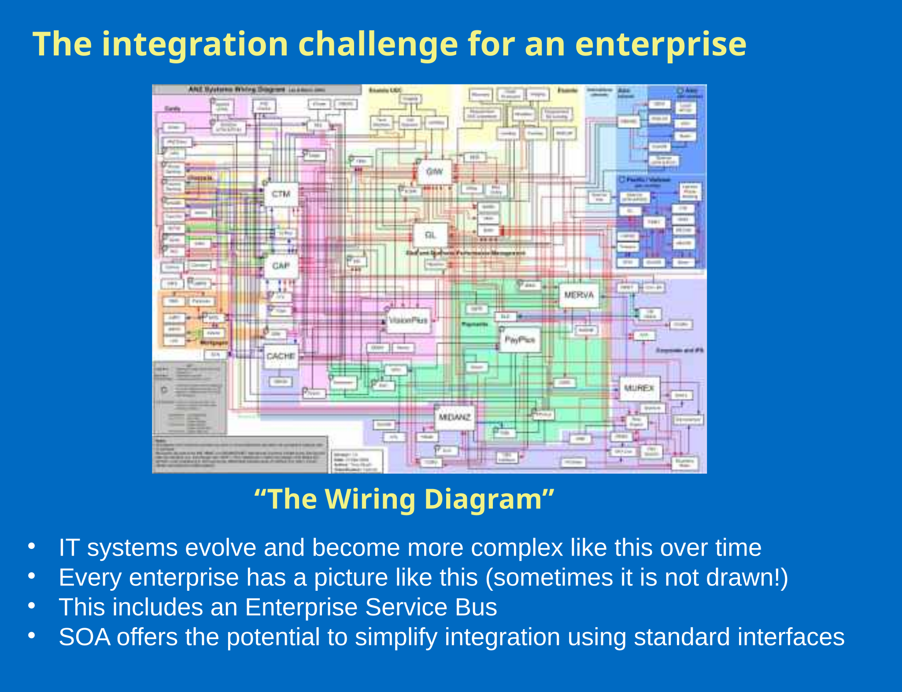

_This is not my deck. It was authored by Kate Behan of Kerandan Pty Ltd for an ACS branch forum on SOA in June 2005, in the society's "Education Across the Nation" series, and she presented it as background before a panel session in which I was one of the panellists, along with other parties. It is reproduced here as part of my record of that event, with Kate's authorship on its face. The deck sources information from [my earlier SOA presentation](/spotlite/article/ark-2005/): its slides 9 and 10 carry the NAB architecture team's definition and rationale, and credit them that way on their titles._

_The file survives in my backups. It was created on the 2nd of May 2005, revised fourteen times, and last saved on the 14th of June 2005; its OLE author field reads Graeme Hicks and its last save was by "marym" — ACS hands. The footer dates the series May/June 2005, and nothing that survives records the exact evening of the forum. As with the other decks reproduced on this site, **what follows is necessarily brief**: a deck is scaffolding for a person standing in front of it, and the argument lived in what was said between the slides — and, on this evening, in the panel discussion the deck was built to open. There are no speaker notes in the file._

_All thirty-six slides are reproduced, one to a section, at the deck's own numbering. Slide 13's survey figures are a real table in the file and are set as a table. Slides 22 to 29 are reproduced as figures converted from the deck itself. The Wingdings bullets throughout are ordinary list bullets here, slide 19's two columns are set left column first, slide 5's red emphasis words are set bold, and the "ACS Education Across the Nation May/June 2005" footer and the slide page numbers are not carried._

_The eight figures are other people's work twice over, and the deck says so itself. Slides 22 to 27 are CBDI Forum's, and slides 28 and 29 are Peter Campbell's, then an enterprise architect at ANZ Bank; slide 21 names both sources and records the permissions — "Reuse of these slides is encouraged by CBDI, provided their source is acknowledged. Peter had also approved the use of his slides." The CBDI pages' banner, logo and copyright footer, and the ANZ pages' template, live on the slides' masters, which the conversion does not carry — so each CBDI section carries its © 2005 CBDI Forum Ltd line as text beneath the figure, and one repair is made: the ANZ slides' dark blue ground is restored behind the figures for slides 28 and 29, so their yellow and white text reads as it did on the slide. Slide 28's four bullets appear inside its figure and are set out again beneath it, to be readable as text._

_The words are Kate's own throughout, slips included: "Isn't that we've all been doing" on slide 5, "these vendors involvement" on slide 15, "serbice" on slide 16, and "each others services" on slide 30. Decks are written for the room, and this is what the room saw._

## 1 Title

**Putting SOA Into Perspective** \
**Hype & Hope vs Reality**

Kate Behan \
Kerandan Pty Ltd \
kerandan@optusnet.com.au

## 2 Updating Technology Trends

- Almost every futurist includes Service Oriented Architecture as a trend to watch
- I needed to come to terms with SOA to update content for the Certification subject Technology Trends.
  - Identified good introductory articles for the study guide, selected from a possible 151.
  - Selected a textbook from six possibles.
  - Devised an assignment which covers all related developments – we’ll look at that later.
  - Wrote an ACSLearn e-lesson which we’ll look at later.
  - Went to Ark Group SOA Conference in Sydney where I found some answers and more questions

## 3 Where does SOA start?

- Terminology is misleading
  - Web Services and all the WS-standards
  - Service Oriented Architecture
  - Services-Oriented Architecture
  - Architecture – many meanings
  - What’s a “Service” anyway?
  - Can have SOA without web services and can use web services without an SOA
  - There’s also REST – Representational State Transfer. A method of building apps by sending XML documents using existing Internet protocols (Amazon.com uses this approach)

## 4 Architecture

- ….is the fundamental organisation of a system embodied by its components, their relationships to each other and to the environment and the principles guiding its design and evolution. (IEEE)
- SOA is architecture oriented towards services - Zapthink’s Jason Bloomberg

## 5 Back to the beginning

- It all starts with a desire to **digitise** business processes
- Isn’t that we’ve all been doing for the past 30 or so years?
- What’s new?
  - The “Services” in SOA are **business** services
  - Services are **linked** together to implement business **processes**
  - Services are **reusable** and supplied or consumed by **many**
  - The really “new” bit is **vendor agreement** on standards (or nearly all vendors on some important standards.)
  - Connectivity and functionality are truly **separated**
  - **Loosely** coupled
  - Offers **reusability** at a higher level
  - Favours **business flexibility** over technical **efficiency**

## 6 Components vs Interfaces

- **Web services**
  - Standardised interfaces that are separate from the internal operation of the components
  - The interfaces do not change the functionality of the component
  - Think of home stereo systems
  - Are an enabling technology for SOA

## 7 What is an SOA?

- Architecture that uses open standards to represent software assets as services
- Standard way of representing and interacting with software assets
- Individual software assets become building blocks that can be used in developing other applications
- Used internally to create new apps out of existing components
- Used externally to integrate with apps outside your organisation

## 8 More than technology

> “SOA is not just a services architecture seen from a technology perspective; it’s the policies, practices, and frameworks by which you ensure the right services and provided and consumed to provide business value.”

`http://www.sys-con.com/story/print.cfm?storyid=48814`

## 9 SOA - NAB architecture team

- SOA is an application architecture within which key business functions are implemented as re-usable services with well-defined, invocable interfaces which can be called in a defined sequence to form business processes
- Focus is on business processes
- Business processes as services

## 10 Why SOA? NAB architecture team

- Easy for business to understand
- Relatively easy to implement
- Vendor support for standards
- Lowers barriers to heterogeneous interoperability
- Can expose functionality from legacy systems as services

## 11 The Hope

- Communicate with all business partners using just one universal set of protocols, documents and business processes
- Loosely couple organisations so that they don’t need to know the internals of one another’s business processes or technologies
- Change components without breaking anything
- Respond to changing business conditions in a fast flexible manner

## 12 More hope

- Adapt functions and services to fit different business processes in an agile manner
- Share data, information, and knowledge more readily through open standards and common protocols
- Decrease infrastructure and people costs, reduce testing, fewer resources needed to manage IT
- Simplify…….Leverage……..
- Support security-enhancing environments and identity management

## 13 Who’s moving to SOA?

- Forrester Research April 2005

| Who and what         | Now | End 2005 |
| :------------------- | :-- | :------- |
| Large orgs           | 70% | 89%      |
| Medium orgs          | 28% | 61%      |
| Small orgs           | 22% | 40%      |
| Internal Integration | 37% | 74%      |
| External Integration | 15% | 21%      |

## 14 More on who’s doing SOA

- Infoworld Research Report on SOA
- Link is in the SOA e-lesson at ACSLearn
- Check out ACSLearn e-lessons on
  - Web Services
  - SOA
  - at `http://www.acs.openlab.net.au`

## 15 An extract from the SOA e-lesson at ACSLearn

- “SAP, IBM help drive SOA adoption” is a short article on these vendors involvement with SOA. At the same link you’ll find (as at April 2005) a link to an Infoworld survey on SOA adoption. You need to register to get this 25-slide presentation with February 2005 data on SOA adoption. The link is `http://www.infoworld.com/article/05/04/04/14NNsapsoa_1.html?PROFESSIONAL%20SERVICES`
- There’s a longer (19-pages) but useful, CBDI Report “Service Oriented Architecture: An Introduction for Managers” by David Sprott available at `http://www.ibm.com/services/us/bcs/pdf/soa-cbdi-report-2004-july.pdf`

## 16 Some terms in SOA

- **Composition**
  - Making a composite of existing applications/services
- Example: Airline/car rental/hotel reservation: Develop independently, then compose into a new service to co-ordinate all three.
- **Orchestration (internal)**
  - Message exchange sequences
- **Choreography (external)**
  - Executable processes
- Many web services projects set up a serbice, but don’t take the next step of dynamically linking services into business processes

## 17 It’s a bit like music

- Just as there are only a set number of plotlines for literary artists to manipulate, there are only a set number of keys and rhythms for musicians to work with. Once the primary moves have been made, combination rather than origination becomes the mark of artistic genius:
- Ray Charles: Gospel and R&B
- Bob Dylan: Folk and ?
  - Source: Australian Financial Review, Imre’s column

## 18 SOA - It’s bigger than it seemed

- Processes
- Services
- Composite applications
- Integration
- Standards
- Business agility
- Leveraging existing technology assets
- Architecture
- Choreography
- Orchestration
- ………… and it’s more complex than it may appear

## 19 SOA evolution

- Reuse
- BPM
- E-Commerce
- ERP Backlash
- Y2K
- Compliance
- Governance
- Workflow
- Internet
- EDI
- Cybercash
- CORBA, DCE etc
- EAI
- XML
- Web services

## 20 New paradigm?

- Each new “wave” of ideas and technology is built at least in part upon the best features of previous “waves”; so if we keep up, we don’t have to start at the very bottom when we learn something new
  - SPC E-ssentials newsletter Feb 2000
- You can use ACSLearn and the ACS Certification subjects to keep up.

## 21 SOA in pictures

- The next few slides are from `http://www.cbdiforum.com/public/events/workshops/Communicating_SOA_files.php`
- You can download these slides, but you need to register at the site. There’s a set of CBDI pictures and also some very good pictures from Peter Campbell, an enterprise architect at ANZ Bank.
- Reuse of these slides is encouraged by CBDI, provided their source is acknowledged. Peter had also approved the use of his slides.
- Reusability is a good thing but it requires collaboration. Thanks to both sources.

## 22 Architectural Layers

_© 2005 CBDI Forum Ltd_

## 23 Provider and Consumer Architectures

![A dense two-band diagram. The Consumer band at top holds window mock-ups and blocks wired to a network of yellow process nodes, labelled Composite Application Architecture, feeding arrows down to rows of lollipop service interfaces on buses, labelled Service Architecture. The Provider band beneath holds interconnected component blocks, cylinders and a highlighted composite panel, with two callouts labelled Component Architecture. Downward and upward block arrows mark the Consumer and Provider sides](../../assets/acs05-figure-2.svg)

_© 2005 CBDI Forum Ltd_

## 24 SOA Layers

_© 2005 CBDI Forum Ltd_

## 25 Enterprise Service Bus

![Four stacked bands. The Business Service Bus at top carries three runs of lollipop interfaces. The Enterprise Service Bus band beneath holds Orchestration, Transformation, Security, Management and Transport, each with interface circles. A Middleware and/or Platform Resources band maps each to Orchestration Server; JCA, etc over EAI Server, XML Transformer; Security Server; WSDM over WSM, Systems Management; and JMS, etc over MOM, and other Transports. The bottom band, Existing Application Resources, holds ERP, CRM and three unlabelled blocks, joined by dotted lines](../../assets/acs05-figure-4.svg)

_© 2005 CBDI Forum Ltd_

## 26 SOA Maturity Model

![A staircase of five widening steps, each glossed on the left: Federated Business, from collaborative services creating dynamic, collaborative business relationships; Business Services, where services directly implement business service capability; Business Process Improvement, where service as a process creates modular units of business process; Application Integration, where service increases loose coupling and separation of concerns; and Technical Applications at the base, from data integration, client neutrality and shared internal services](../../assets/acs05-figure-5.svg)

_© 2005 CBDI Forum Ltd_

## 27 Enterprise SOA Roadmap

![Four columns — Early Learning, Integration, Reengineering, Maturity — crossed by six row labels: Planning & Managing, Architecture, Infrastructure, Process, Resources, Project Steering. An ellipse in each column lists its stage: managed and unmanaged organizational learning through visioning, planning and communicating; common enterprise service bus capabilities through provider / consumer organization; secure transactional services through real time data currency and business intelligence; and real time business services through federated services management. A grey arrow sweeps up from bottom left to top right](../../assets/acs05-figure-6.svg)

_© 2005 CBDI Forum Ltd_

## 28 The integration challenge for an enterprise

- IT systems evolve and become more complex like this over time
- Every enterprise has a picture like this (sometimes it is not drawn!)
- This includes an Enterprise Service Bus
- SOA offers the potential to simplify integration using standard interfaces

## 29 Example: Simplification and reducing testing

![A before-and-after slide on ANZ's dark blue ground. Current State: consumers wired to a block of current transaction management and on to legacy and shared systems through many tightly coupled interfaces, a development to testing ratio of 1:9, and end-to-end testing required to cover all the interdependencies, with a note that the example only applies to a subset of existing transactions. Proposed: the same consumers and systems joined through a simplified transaction management block behind standard interfaces, a development to testing ratio of 1:3 as best practice target, and testing only required against the standard interface, yielding reduced change dependencies and less testing](../../assets/acs05-figure-8.svg)

## 30 IS SOA New?

- Not really, there’s new standards that make it easier to implement
- The services in SOA are business services, e.g. update a loan but not update a record
- Linking services creates business processes, business process engines and languages make this easier
- Business partners can use each others services
- Favours flexibility over efficiency
- Services are not tied to user interfaces, interfaces invoke services.
- Gives new life to legacy systems
  - Check out John Reynolds Blog (ACSLearn e-lesson)

## 31 The assignment

- For an organisation with which you are familiar, prepare a report that addresses the areas (a) through (i) below and a presentation as outlined in section (j) below. The report should be 4,000 words plus diagrams where possible to illustrate architecture descriptions. You are describing the current IT environment as well as proposing enhancements to it.

## 32 The assignment

- Answer the questions in the integration survey in Section 3.1 for your case organisation; (5%)
- Sample questions
  - In the past 12 months how often asked to integrate information held in disparate systems?
  - What % of these requests could be met in timeframe of the business?

## 33 More on the assignment

- Explain the current IT architecture; (5%)
- Identify and justify the maturity level of your organisation’s enterprise architecture; (5%)
- Identify any business challenges the current integration architecture and integration approaches create; (10%)

## 34 More of the assignment

- Examine how a move towards a service-oriented architecture would address these challenges; (15%)
- Identify any technical and/or organisational challenges associated with introducing an SOA. (15%)
- Identify the core services that your organisation could offer as services in a SOA.(15%)

## 35 But wait…..there’s more

- Explain which, if any, of the international IT guidance standards are in use in your organisation. (5%)
- Make recommendations as to which of the standards are relevant and suitable for the organisation. (5%)
- Prepare a 10-minute presentation suitable for senior business executives in your organisation, the title of which is “Do we need service-oriented architecture.” (20%)

## 36 The Reality

- Panel
- Short break for 5 minutes.
- Talk among yourselves about the questions you want the panel to answer.

## Sources

- **The deck**, `SOA- ACS June Branch forum Presentation.ppt`, 692 KB, thirty-six slides, authored by Kate Behan of Kerandan Pty Ltd for the ACS "Education Across the Nation" series. Created on the 2nd of May 2005, revision 14, last saved on the 14th of June 2005 by "marym", with Graeme Hicks in the author field — ACS hands rather than the presenter's. Reproduced above.
- Slides 22 to 27 are © 2005 CBDI Forum Ltd, and slides 28 and 29 are Peter Campbell's, then an enterprise architect at ANZ Bank — both credited, with their permissions, on slide 21 as the deck itself presented them.
- [The promise and pitfalls of implementing a Services Oriented Architecture](/spotlite/article/ark-2005/), the talk I gave at Ark Group's conference in March 2005 — the presentation this deck's slides 9 and 10 source their definition and rationale from, and the conference slide 2 records Kate attending. [The Role of Service Oriented Architecture within an Enterprise Architecture](/spotlite/article/eac-2005/) is that talk's later, longer descendant.
