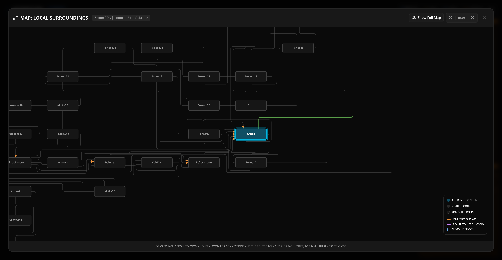

Another day, another successful vibe coding project.

This one took almost no effort: a few random prompts each morning over breakfast, for a few
days. It is a complete rewrite of the classic Colossal Cave Adventure into a modern web app,
with an interactive map, location and inventory tracking, and modern controls.

## The game that started everything

If you have never played it, Colossal Cave Adventure is where interactive fiction begins.

Will Crowther wrote the first version in FORTRAN in 1975 and 1976, mapping his knowledge of
Kentucky's Mammoth Cave onto a game for his daughters. Don Woods expanded it in 1977 and added
the dwarves, the magic word `XYZZY`, and the famous 350-point score. Everything that came after,
from Zork to the modern narrative game, is downstream of those two.

My version forward-ports Eric Raymond's faithful `open-adventure` edition into strictly typed
TypeScript, running as a Next.js app. It is a completely faithful port, and it passes the legacy
test suite.

## Minimalist prompting

The first version was built with Gemini CLI, and the method was barely a method at all.

I did as little prompting as possible, and gave the AI freedom in what features to implement and
how to implement them. Surprisingly, it did a really good job. My intent was one sentence long,
port Colossal Cave to a modern TypeScript web app, and the two checks I attached to it did all
the real work: every value fully typed with no escape hatches, and nothing merged until the
tests and the linter pass.

I used up all my remaining credits in Gemini CLI, as it happens, just before Google
decommissioned it. It is a good example of what can be achieved with minimalist prompting,
virtually no context beyond the original source code, and simply letting the AI follow a happy
path.

The check that mattered most was parity. The engine replays the original's own regression
suite, ninety-five recorded transcripts, and diffs its output against them line by line. That
is a brutally strict test, because a change that merely consumes the game's random number
stream in the wrong order will fail it immediately. To satisfy it the agent kept the canonical
game data in its historic `adventure.yaml` file and wrote a custom, type-safe parser to load it,
preserving the odd legacy structures and folding the word synonyms together as it went.

That one check did more to keep the port honest than any design document could have.

## The map, and where the models differed

Around that faithful core grew a modern skin, and a set of features I hinted at but never
specified.

The hardest of them by a distance was the interactive cave map: all 151 rooms laid out as a
clean metro-style diagram you can click to walk the player there.

This is where the models visibly differed, and it is the reason I am writing about it.

Laying a graph out orthogonally, routing its edges only along horizontal, vertical and diagonal
lines the way a metro map does, is an academic problem with no maintained JavaScript
implementation. Gemini, which had built most of the game perfectly happily, could not do it. It
worked at the problem for days. Its best attempt was a physics simulation computed in the
browser, which came out differently every time and ran its connecting lines straight through the
rooms.

I handed exactly the same intent to Fable, and it came back with the right answer in one shot,
without errors, in under thirty minutes from a single prompt. Its solution was a compass grid
refined by hill-climbing, followed by orthogonal routing through the `libavoid` library, and the
result appears instantly and never crosses a room.

The intent and the check never changed. Only the model did.

The map is interactive, too. Hover over any room and it will show you how to get there from
wherever you currently are, and if you would rather not walk, it will simply teleport you.

## Everything else

Once the map was solved I kept going, on what turned out to be my third day of a Claude 20x max
plan, by the end of which I had already hit my session limit. Tokenmaxxing.

The game now has:

- Location images for every room, courtesy of Nano Banana.
- Guided-play buttons that light up only the moves that are legal this turn.
- Direction controls you can tune to whatever level of spoilers you are comfortable with.
- Save and restore.
- The super duper interactive map described above.
- A complete walkthrough.

That last one is my favourite. Just press the Solve button and the game will play itself through
to conclusion, a perfect 430-point game, while you watch.

## Have a go

You can [play it here](https://christham.net/adventure/), and the code is on
[GitHub](https://github.com/ChristineTham/adventure).

If you have read my pieces on [Hello Calc](/spotlite/article/hellocalc/) and
[Rogoweb](/spotlite/article/rogoweb/), you will have spotted the pattern by now. I keep
resurrecting the software of my youth. I have written about the method behind all three in
[chapter three of my book](https://christham.net/aidou/software.html), but the short version is
the one this project demonstrates best: say what you want, say how you will know it is right,
and then get out of the way.
