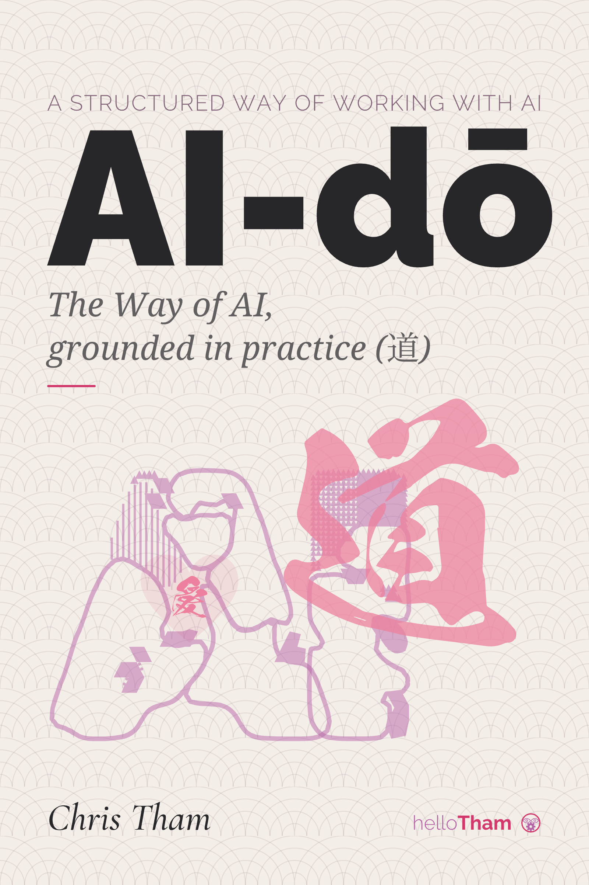

I have written a book. It is called AI-dō, it is free to read, and it is about the thing I
have come to believe actually separates good work with AI from slop.

## Why it exists

Working with artificial intelligence has become strangely easy to do and strangely hard to do
well. Anyone can open a chat window and get an answer in seconds. Getting answers you can rely
on, the sort that are accurate and consistent and actually worth using, is a great deal
harder.

Here is the observation the whole book rests on. We all tend to use the same handful of
frontier models, so the model is not what separates good quality from slop. What separates
them is method: the practised habits by which someone turns a capable tool towards a
dependable result, in the way that a practised hand and a beginner, given the same tools, turn
out very different work.

So the book is about that method. You start from what you actually want, you improve the
result over several rounds, and you check it before you use it. Simple to describe and, like
most disciplines, harder to hold to than it sounds.

## Why I wrote it

It grew out of my own work over the past year or two. I had just finished delivering an AI
strategy for a global client, and at the same time I was teaching AI to my students at Torrens
University.

That combination turned out to be the useful part. Consulting gives me the experience, and
teaching makes me explain it, and a thing you have had to explain to a room full of students
is a thing you understand rather differently afterwards. The book is the written version of
that explanation.

## Who it is for

It is written for the thoughtful professional who wants a structured way of working rather
than a bag of prompts: a leader, a consultant, an analyst, a designer, a builder.

I assume you have already used these tools and have seen both what they can do and how often
they get things wrong. I assume you can read a diagram or a code snippet when it helps. I do
not assume you work in IT, and I am not trying to teach you to build models, only to use them
well.

## Will it not date?

This was the question I worried about most, since the field moves in weeks and a book of
prompts and tool tips would be stale a model release later.

The answer I settled on was to write about how the models work rather than which model leads
this quarter, because those properties have held across several generations now. Where a point
is tied to a 2026 product or figure I mark it as such, so you can see what has an expiry date
on it and what does not.

Every claim is cited inline to a primary source, so you can follow the trail and disagree with
me properly. Where the evidence is thin, I say so rather than rounding it up.

## The six chapters

They build on one another, so it is worth reading once in order before going back for the
parts you need.

| Chapter | Theme          | The question it answers                        |
| ------- | -------------- | ---------------------------------------------- |
| 1       | Foundations    | What is AI, what is it not, where do we stand? |
| 2       | Productivity   | How does it change individual knowledge work?  |
| 3       | Software       | How does it change building software?          |
| 4       | Disciplines    | What keeps that work sound at scale?           |
| 5       | Responsibility | How do we govern it safely and fairly?         |
| 6       | Mastery        | What stays distinctly human?                   |

Chapter three is the one I have quoted here before, in the pieces on
[Hello Calc](/spotlite/article/hellocalc/), [Rogoweb](/spotlite/article/rogoweb/) and
[Adventure](/spotlite/article/adventure/). All three are running examples in it.

## The name

The title is the seed of the whole thing, and it is personal.

道, read as dō, is the way: the lifelong disciplined practice behind arts like judō. 愛, read
as ai, is love, meaning care for the people the work touches. Put together with the other
sense of AI, you get a book title that says what I think the discipline is for.

The Japanese motif is not decoration either. It is the fruit of three years spent learning the
language and reading about the culture, so it runs through the book rather than sitting on the
cover. Both characters open every chapter, brushed in the same dragon-stroke hand, over a
seigaiha wave pattern from classical Japanese design. Chapter two is subtitled 愛 in practice.
Chapter six closes on shuhari, 守破離, the martial-arts progression from keeping the form, to
breaking it, to leaving it behind, which felt like the right note to end on.

I designed the cover myself with AI helping, drawn directly in SVG because that is a text
format a model can write. There is a heart-shaped 愛 hidden inside the letter A. According to
Chinese astrology I am a wood dragon, which explains the brush strokes.

## How it was made

The book is built the way it argues you should work, which seemed only fair.

Every chapter is a single plain-text Markdown file, with the diagrams written in Mermaid.
There is one source, and the website, the PDF and the ePub are all generated from it. Nothing
is laid out twice by hand. If that sounds familiar it is the same idea behind
[this site](/spotlite/article/spotlite/), where one folder of Markdown files produces the
pages and the CV.

The look comes from a single file of design tokens. Every colour, type size and per-chapter
accent lives in one `theme.yml`, and a small script turns it into the separate stylesheets
each format needs, so adjusting a heading weight or a shade of pink is one edit that reaches
the website, the PDF and the ePub at once. The palette is Rosely, the same soft Pantone-named
set this website uses, chosen to stay calm across a long read.

Quarto does the building. It renders the Markdown to a searchable website and, through the
Typst typesetting engine, to a six-by-nine-inch PDF laid out like a printed trade book, and to
a reflowable ePub for e-readers. The Mermaid diagrams are tinted to the same palette in every
format, so a flowchart looks the same on the web, on the page and on an e-reader. Push a
change and a GitHub Action publishes the result.

Much of that toolchain was itself built the way the book describes. I said what I wanted, let
the tools work out how, and checked what came back.

## Read it

The book is [free to read online](https://christham.net/aidou/), and the whole thing, text and
toolchain together, is [open on GitHub](https://github.com/ChristineTham/aidou) under a public
domain dedication. Take whatever is useful.
