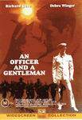

_This review was written by me for **MichaelDVD**, an Australian DVD review site that is no longer online. A capture of the site is held by the Internet Archive: **[browse it there](https://web.archive.org/web/20220217040146/http://www.michaeldvd.com.au/)**. It is reproduced here from my own copy of the site, as part of the record of what I have written._

_1981._

## The film

Plot Synopsis Here

Richard Gere .... Zack Mayo Debra Winger .... Paula Pokrifki David Keith .... Sid Worley Robert Loggia .... Byron Mayo Lisa Blount .... Lynette Pomeroy Lisa Eilbacher .... Casey Seeger Louis Gossett Jr. .... Sgt. Emil Foley Tony Plana .... Emiliano Della Serra Harold Sylvester .... Perryman David Caruso .... Topper Daniels Victor French .... Joe Pokrifki Grace Zabriskie .... Esther Pokrifki Tommy Petersen .... Young Zack Mara Scott-Wood .... Bunny David Greenfield .... Schneider Some of the music in the video version has been changed - namely the ZZ Top, Pat Benatar, Dire Straits, and Van Morrison songs.

TV versions typically eliminate the pre-credits scenes with young Zack in the Phillipines, after his mother has died and he joins his father.

In the theatrical version of the movie, Gunnery Sergeant Emit Foley declares that the only things to come out of Texas are "steers and queers". In the television version, this was dubbed to "gays and strays".

Richard Gere stars as a rebel who signs up to the US Navy Officer Candidate School to become a jet pilot. Immensely popular and with some career-defining performances, this trial of wits is now out on a disc that also offers a lesson in 80s Hollywood.

The picture transfer is very fresh, and a distinct improvement on Paramount's "American Gigolo" disc.

With the famous rock score of Jack Nitzsche and "Up Where We Belong" sung by Jennifer Warnes and Joe Cocker, this is a film that deserves a 5.1 remix. Sadly, 2.0 mono will have to do, although at least it is strong and clear.

There are plenty of director's commentaries on DVDs now, but most are unprepared, poorly thought out, and often rather dull. One exception is Taylor Hackford. His commentary for the "Dolores Claiborne" DVD was excellent and for "An Officer and a Gentleman" he really wheels out some fine anecdotes, especially of what he defines as "the different era of Hollywood", back in 1982.

"Much wilder" is one term he uses to describe the making of "Officer" the producer thought "sucked" but the head of production at paramount, Don Simpson, believed in. That period of the studio's history is fascinating with Simpson, Jerry Katzenberg, and Michael Eisner all carving out the beginnings of their careers. Hackford has plenty of great stories to relate of these major Hollywood players, and this disc is worth getting just to hear them.

Chapters: 15 Region: 2 Ratio: 1.85:1 (Anamorphic) Sound: Dolby Digital 2.0 Extra Features: Scene selection, audio commentary with director Taylor Hackford, trailer, multiple languages, subtitles, English for the hearing impaired.

AN OFFICER AND A GENTLEMAN RATING: 9/10

Review Date: December 20, 1998 Director: Taylor Hackford Writer: Douglas Day Stewart Producer: Martin Elfand Actors: Richard Gere as Zach Mayo Debra Winger as Debra Pokrifki Louis Gossett Jr. as Sgt. Emil Foley David Keith as Sid Worley Genre: Drama Year of Release: 1982

Director Taylor Hackford's greatest cinematic achievement as of 1998, this movie was able to touch people from both sexes and various sides of the track, as the love story and the determination of the human spirit reached out and played everyone's heartstrings succinctly.

PLOT: Loser/loner Zach Mayo enlists in the Navy because he wants to inject a little direction into his wayward life. During his 13-week boot camp, he gets taught a lot of lessons of discipline, friendship and ultimately, love, as he starts off as a son trying to escape his father's past, and ends up as an officer and a gentleman.

CRITIQUE: Inspirational and timeless, this romantic drama melds together a tight script, strong performances by its lead actors, and a universally positive message regarding the defiance of one's own demons, and the success drawn from one's own determination, hard work and true heart. This movie is made for the romantic in all of us, as well as the loners that we've all experienced being at one point in our lives. How does one get past the fact that there is no one around them willing to lend them any love or support? How does one triumph over all adversities despite the plethora of obstacles standing in their way? Well, besides listening to hours of endless Tony Robbins motivational tapes, there is only one way that we could all muster a little personal self-confidence, and that is sheer persistence, will power and heart! If you really want to do something, and I mean REALLY WANT TO DO SOMETHING...you should be able to do it, no matter what obstacles lie in your wake. This movie presents us with a great example of just that.

This film drills this philosophy right into our brains to the point where I actually felt like going out and "doing something", just for the sake of the thrill that the film gave me. Then I realized that it was three in the morning, I was tired, and in my PJ's, so I left it until the next day :). All that, and you get an interesting story about the trials and tribulations of boot camp Navy candidates, plenty of fully developed characters, a great performance by Louis Gossett Jr., and a wonderfully sugared romance which begins on notes of despair but ends in true inspiration. Oh yeah, and I almost forgot...Richard Gere is also quite good in the movie. This is a wonderful film that will make you laugh and cry, smile and cringe, and give you more reason to believe in yourself, and follow your dreams till their end. If candidate Mayo-naisse can do it, we all can !!!

Little Known Facts about this film and its stars: Louis Gossett Jr. won a Best Supporting Actor Oscar for his role in this film. The part of Zach Mayo was originally offered to John Travolta, who turned it down on the advice of his agent. Richard Gere went on to play that character in this film, and the film garnered 6 Oscar nominations. Debra Winger spent part of her youth in Israel and served three months in the Israeli army. She moved to California, where she decided to pursue a serious acting career following a severe accident at a local amusement park at which she was performing. She was married to actor Timothy Hutton from 1980 to 1990. They had one son together. Richard Gere was married to supermodel Cindy Crawford from 1991 to 1995. Director Taylor Hackford lived with actress Helen Mirren from 1986 to 1997, at which point, they got married. Look for an early film appearance by the actor who thought he was "too good for TV", David Caruso, of TV's NYPD fame. He's the redhead recruit with the heebie-geebies about water.

The fairy tale ending isn't something that's well-received, and the ending of An Officer and a Gentleman is no exception. Furthermore, most of the negative comments I've read concerning the ending say the same thing, that the movie fails because the ending is "fake." I have a different outlook. I ask myself if the ending works. Does the ending cheat? My take on the situation is, if the movie has terrific acting and the story is told well, then that is what makes the ending believable. For me, An Officer and a Gentleman works not only for its love story, but for the intense depiction of drill instruction at a naval officer training school.

Zack Mayo (Richard Gere) is out of college, but doesn't see any direction in his life. His father (Robert Loggia) is always drunk and he doesn't really respect his son. Zack feels that the only way to escape from this hole is to join the Navy. His dream is to fly jets, but before he can do that, he must endure 13 weeks of training school which includes rigorous physical training.

The drill instructor is Emil Foley (Louis Gossett, Jr., who won an Oscar for his performance here), who takes no crap from the new recruits and consistently yells at them. Foley's goal is to separate the strong from the weak, because "...you think flyin' a plane is just sittin' in a chair pushin' buttons?" The 13 weeks are outlined by obstacle courses, a crash simulation and time in an altitude chamber.

Foley warns the recruits about the women in the area, who like to snag onto aviators because it's their ticket out of town. Zack Mayo and Sid Worley (David Keith) ignore Foley's advice, and fall in love with two factory workers, Paula (Debra Winger) and Lynette (Lisa Blount). Richard Gere and Debra Winger supposedly didn't get along on the set, but somehow that didn't come across on the screen, and they have great chemistry in their scenes together. The movie intercuts the relationship with the scenes in training school, and director Taylor Hackford perfectly handles the two storylines.

During the course of the film, we learn that women will get themselves pregnant in order to hold onto their boyfriends, and that some of the recruits have flings with the women. Both of these elements are incorporated into the story. The relationship between Zack and Paula and the one between Sid and Lynette head into different directions, but soon they will change directions and only one of them will end happily, like a fairy tale.

An Officer and a Gentleman has deservedly garnered its share of Academy Award nominations and earnings. The level of talent involved is what makes this routine story so entertaining. The only way to enjoy this movie is to either accept the ending or not. I prefer to accept it.

Richard Gere - Zack Mayo Debra Winger - Paula Pokrifki David Keith - Sid Worley Robert Loggia - Byron Mayo Lisa Blount - Lynette Pomeroy Lisa Eilbacher - Casey Seeger Louis Gossett, Jr. - Emil Foley Tony Plana - Emiliano Della Serra Harold Sylvester - Perryman David Caruso - Topper Daniels

Director - Taylor Hackford Screenplay - Douglas Day Stewart Producer - Martin Elfand

## The video transfer

Optional General Comments

Aspect Ratio/16x9 Status

Sharpness/Shadow Detail/Grain/Low Level Noise

Colour

## The audio transfer

Optional General Comments

Audio Tracks

Dialogue/Audio Sync

Music

Surround Channel Usage

Subwoofer

## The extras

### Theatrical Trailer

### Audio Commentary

## Censorship

As far as we are aware, there are no censorship issues with this DVD.

## Region 4 versus Region 1

R4 vs R1 Comparison Here

## Summary

Summary Here

### [Ratings (out of 5)](RatingsGuide.html)

© [Christine Tham](mailto:ChrisT@michaeldvd.com.au) (read my [biography](../ReviewerProfiles/ChrisT.asp)) Sunday, July 01, 2001

| Rating  | Score         |
| :------ | :------------ |
| Plot    | ★★★★½ 4.5 / 5 |
| Video   | ★★★★ 4 / 5    |
| Audio   | ★★★★ 4 / 5    |
| Extras  | ★★★ 3 / 5     |
| Overall | ★★★★ 4 / 5    |
