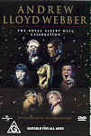

_This review was written by me for **MichaelDVD**, an Australian DVD review site that is no longer online. A capture of the site is held by the Internet Archive: **[browse it there](https://web.archive.org/web/20220217040146/http://www.michaeldvd.com.au/)**. It is reproduced here from my own copy of the site, as part of the record of what I have written._

_1998 · directed by Pimlott, Stephen (stage) Mallet, David (video)._

## The film

_**Andrew Lloyd Webber - The Royal Albert Hall Celebration**_ is a special concert put together in 1998 to celebrate the 50th birthday of noted musical theatre composer **Andrew Lloyd Webber**.

Recent visitors to this planet who may not have heard of Andrew (rest assured most inhabitants of Earth will have attended one of his musicals or at least have heard of his name) will be interested to know that Andrew is the composer of some of the most popular musicals of recent times, including:

- _Joseph and the Amazing Technicolor Dreamcoat_
- _Jesus Christ Superstar_
- _Cats_
- _Evita_
- _Variations_
- _Starlight Express_
- _The Phantom of the Opera_
- _Aspects of Love_
- _Sunset Boulevard_
- _Whistle Down the Wind_

plus a few others I have not mentioned. He has won numerous awards including seven Tonys, three Grammys, five Oliviers, a Golden Globe, an Oscar, the Praemium Imperiale the Richard Rodgers and the Critics Circle Award for Best Musical 2000. He was knighted in 1992 and created a life peer in 1997.

The concert features highlights from Andrew's musicals (mentioned above) performed by various artists including our very own **Tina Arena**, **Michael Ball**, **Antonio Banderas**, **Boyzone**, **Sarah Brightman**, **Glenn Close**, **Julian Lloyd Webber**, **Marcus Lovett**, **Lottie Mayor**, **Dennis O’Neill**, **Donny Osmond**, **Elaine Paige**, **Ray Shell**, **Kiri Te Kanawa**, and **Bonnie Tyler**.

The song list for the concert is:

| **Song** | **Musical/Work** | **Performer** |
| :-- | :-- | :-- |
| Whistle Down The Wind | WHISTLE DOWN THE WIND | Tina Arena |
| Any Dream Will Do | JOSEPH & THE AMAZING TECHNICOLOR DREAMCOAT | Donny Osmond |
| Close Every Door | JOSEPH & THE AMAZING TECHNICOLOR DREAMCOAT | Donny Osmond |
| Intro and Variations I-IV | VARIATIONS | Julian Lloyd Webber |
| Requiem for Evita | EVITA | Orchestra and Chorus |
| Oh What A Circus | EVITA | Antonio Banderas |
| High Flying Adored | EVITA | Antonio Banderas |
| Don’t Cry For Me Argentina | EVITA | Elaine Paige |
| There’s a Light at the End of the Tunnel | STARLIGHT EXPRESS | Ray Shell |
| Hosanna | REQUIEM | Dennis O’Neill |
| Pie Jesu | REQUIEM | Sarah Brightman & Ben De’ath |
| Gethsemane | JESUS CHRIST SUPERSTAR | Michael Ball |
| Superstar | JESUS CHRIST SUPERSTAR | Marcus Lovett |
| The Phantom of the Opera | THE PHANTOM OF THE OPERA | Sarah Brightman & Antonio Banderas |
| All I Ask Of You | THE PHANTOM OF THE OPERA | Sarah Brightman & Michael Ball |
| The Music Of The Night | THE PHANTOM OF THE OPERA | Sarah Brightman |
| Tire Tracks & Broken Hearts | WHISTLE DOWN THE WIND | Bonnie Tyler |
| No Matter What | WHISTLE DOWN THE WIND | Boyzone |
| Vaults of Heaven | WHISTLE DOWN THE WIND | Michael Ball |
| Once Upon a Time | SUNSET BOULEVARD | Glenn Close & Marcus Lovett |
| With One Look | SUNSET BOULEVARD | Glenn Close |
| As If We Never Said Goodbye | SUNSET BOULEVARD | Glenn Close |
| Love Changes Everything | ASPECTS OF LOVE | Michael Ball |
| Memory | CATS | Elaine Paige |
| The Heart Is Slow To Learn |  | Kiri Te Kanawa |
| Whistle Down The Wind | WHISTLE DOWN THE WIND | Lottie Mayor with Andrew Lloyd Webber |
| The Jellicle Ball | CATS | Orchestra |

I was expecting (and even looking forward to) performances by the likes of **Sarah Brightman**, **Michael Ball**, and **Elaine Page** - after all, these are artists associated to Andrew and in some cases have been made famous by their stage performances on the songs. However, I must admit I was surprised by the inclusion of artists such as **Tina Arena**, **Donny Osmond**, **Boyzone** and **Bonnie Tyler**. However, everyone gave really credible and good performances.

I don't know some of the artists featured here, but my vote for the Coolest Name for an Artist I Have Never Heard Of Before is **Ben De'ath** - especially as the name is attached to a boy with the sweetest voice and the most angelic face yet.

The weakest link is probably **Antonio Banderas** - despite his devastatingly handsome good looks and his ability to carry off his tune, his voice is not as powerful or compelling as the others. Noticeably absent from the concert was "Mr. Phantom" himself **Michael Crawford**.

The highlight for me was **Glenn Close** - even though I vaguely knew she had appeared on Broadway I never suspected her to be this good - she was awesome in her performances of selections from _Sunset Boulevard_.

All in all, this is a must-have concert if you are a fan of Andrew Lloyd Webber. Even if you can't stand the man, I would still recommend that you have at least a look.

## The video transfer

This is a full frame transfer (1.33:1) sourced from what appears to be a video master. In general, the transfer is reasonably sharp and detailed, and has acceptable colour saturation.

However, the video is marred by quite frequent occurences of colour and luminance smearing, which I suspect is present in the video master. This smearing looks similar to edge enhancement halo'ing during **Tina Arena**'s appearance on Chapter 2 but on closer inspection I realised is actually the luminance bleeding of Tina's profile into the background. This artefact is particularly noticeable in the smearing of **Donny Osmond**'s white shirt and also the blue haze surrounding **Julian Lloyd Webber**. Fortunately, the artefact settles down in the latter half of the concert to nothing more than a minor annoyance.

Other than the above artefact, the transfer is quite clean and there is very little evidence of MPEG artefacts or video noise.

This is a single sided dual layered disc (**RSDL**). The layer change occurs just at the end of Chapter 19 at **72:14**. This is a very well-placed layer change (particularly for a concert) since I didn't even notice the layer change on first viewing and I had to go specifically hunting to find it.

## The audio transfer

There are two audio tracks present on this disc: Dolby Digital 5.1 encoded at 448 Kb/s and Dolby Digital 2.0 encoded at 192 Kb/s. I listened to mainly the Dolby Digital 5.1 track.

I was initially quite impressed by the enveloping ambience of the opening of the concert (Chapter 2 start till the appearance of **Tina Arena** - **1:06**-**2:10**). The sounds of various instruments seem to be nicely spread across all speakers. However, the rest of the audience is more conventional with the surround speakers mainly used for ambience and I suspect this is actually a stereo track remixed for surround rather than a true surround track.

The Dolby Digital 2.0 track is mastered at a lower level compared to the 5.1 track (about 6 dB lower) but surprisingly sounds nearly as good as the 5.1 track and has a nice rich sound compared to most Dolby Digital 2.0 tracks which sound tinny.

The audio track does not have a strong low frequency component so the subwoofer is very rarely used.

## The extras

There are no extras on this disc, and the menus are pretty boring and static, but you do get the option of choosing which language you want the menu titles to be presented in. I would have thought it would have been pretty easy to add some extras - cast and crew profiles, information on the musicals featured in this concert etc.

## Censorship

As far as we have been able to ascertain, there are no censorship issues with this title.

## Region 4 versus Region 1

I can't find any evidence of this disc currently being available in R1.

## Summary

Andrew Lloyd Webber - Royal Albert Hall Celebration is a truly excellent concert if you are an Andrew Lloyd Webber fan. If you are not, I would encourage you to at least give the disc a spin for the concert features some great performances. It is presented on a very minimalist DVD with above average audio and video transfers.

| Rating  | Score        |
| :------ | :----------- |
| Plot    | ★★★★ 4 / 5   |
| Video   | ★★★★ 4 / 5   |
| Audio   | ★★★★ 4 / 5   |
| Overall | ★★★½ 3.5 / 5 |
