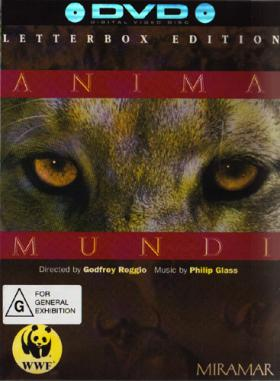

_This review was written by me for **MichaelDVD**, an Australian DVD review site that is no longer online. A capture of the site is held by the Internet Archive: **[browse it there](https://web.archive.org/web/20220217040146/http://www.michaeldvd.com.au/)**. It is reproduced here from my own copy of the site, as part of the record of what I have written._

## The film

**\_Anima Mundi _**is yet another result of the collaboration of director **Godfrey Reggio**and composer **Philip Glass**, whose previous films include _Koyaanisqatsi_(1983) and _Powaqqatsi_(1988). Unlike the _-qatsi_films though, which are feature length (over 90 minutes) in duration, _**Anima Mundi**_is a relatively short film (**29:46** minutes). The team is currently trying to raise money to produce another _-qatsi_film, _Naqoyqatsi_, scheduled for release in 2002.

For those of you are familiar with the _-qatsi_films, you will know exactly what to expect from _**Anima Mundi**_. To those of you yet to see either of the _-qatsi_films, I strongly urge you to track down either of them, though they may be hard to find these days. As far as I know, neither film is available on DVD or video as of 15 January 2001. I have an old PAL video of _Koyaanisqatsi_bought in the UK over 12 years ago - I suspect this is long out of print although there are rumours that _Koyaanisqatsi_may be out on DVD in Australia in the near future. The closest equivalent to _**Anima Mundi**_available on DVD is probably _Baraka_(1992), directed by **Ron Fricke**(who was also responsible for the cinematography in _Koyaanisqatsi_).

All of the above films share a common set of characteristics. Basically, the films consist of a sequence of beautifully shot images and scenes of natural landscapes, objects, animals or people accompanied by music but no dialogue, kind of like a wordless documentary. The set of images and scenes can be in real-time, slow motion or speeded up (using time lapse photography).

Each of the _-qatsi_films have tried to project an underlying apocalyptic message through the montage of images. _Koyaanisatsi_, subtitled "Life Out of Balance", is about the collision of urban life/technology with the natural environment. _Powaqqatsi_continues the theme but focuses more on the Third World natives and how they seek to master both nature and technology, and the new film _Naqoyqatsi_will deal with how man seeks to conquer nature through technology and civilization. Unlike the _-qatsi_films, however, _**Anima Mundi**_is more plotless in nature. If it does project a message, it is probably more a celebration of the incredible diversity of biological life on this planet rather than an apocalyptic theme.

Someone who doesn't know Italian might be tempted to think _**Anima Mundi**_translates into "Animal World" but _Anima_= Soul and _Mundi_= World so the translation is actually "The Soul Of The World".

There are only 5 chapters in the presentation of this film on DVD. Each chapter seems to concentrate on a specific "theme":

- Chapter 1 focuses on animal eyes, and do we get to see a huge variety! I particularly liked the shot of the (unidentified) animal licking it's eye!
- Chapter 2 is more about the earth itself as a living entity - it has lots of shots of lava flows both above ground and under water.
- Chapter 3 seems to be about the volume and multitude of life, it features lots of birds, bacteria, fish etc. in large groups.
- Chapter 4 is about the variety of underwater life - plants and fish.
- The final Chapter seems to be about motion and the food chain - lots of pictures of animals in motion (filmed in slow motion) or running from predators that are hunting them. The film then ends with the closing credits which are part of this chapter.

Because of it's shorter duration, _**Anima Mundi **\_may be a more gentler introduction to these type of dialogue-less documentaries, but I find _**Anima Mundi**_not as satisfying to watch as the _-qatsi_films.

The ending of Anima Mundi contains the following quote, translated into several different languages (my guess based on the alphabets and words used would be, in order: Italian, Chinese - Mandarin, French, Arabic, Spanish, Japanese, German, Hebrew and English):

**The Breath, The Life, The Spirit, The Soul of the World**

"...this world is indeed a living being endowed with soul and intelligence"

- Plato, Timeus

## The video transfer

This is one of the earliest DVDs released and the quality of the transfer leaves much to be desired. The transfer seems to have been taken from a video master intended either for video tape duplication or at best laserdisc. There are lots of video artefacts apparent in the transfer - colour bleeding, low level video noise, lack of vertical resolution (a tell-tale sign is that pressing PAUSE generally results in a still that looks terrible).

The transfer is presented in a letter box aspect ratio, with no 16x9 enhancement. The lack of 16x9 enhancement also contributes to the poor level of sharpness or detail.

Fortunately, colour saturation seems to be acceptable, with a tendency towards a reddish hue, and shadow detail seems consistent with overall detail.

The film source itself is not pristine, but acceptable. There are minor film artefacts (mainly dust and scratches) throughout the entire presentation. There is a blue mark on the right edge of the screen at 15:12 that looks like a film artefact but I am not sure. There is some telecine wobble present in the transfer.

The transfer rate hovers at or below 5Mb/s. There is a lot of MPEG ringing in the titles at the beginnin

## The audio transfer

There is only one audio track on this disc, PCM 2.0 at 48kHz/16 bits resolution. In theory, this should yield CD-like quality but I was not very impressed with the audio transfer. Although there are no obvious audio glitches, the transfer on the whole lacks the "sparkle" and clarity of a well-mastered CD. The audio track may have been derived from the video master, which may be in analogue. The audio track seems to be mastered at a relatively low level, far softer than that of an average CD.

As the audio track is in 2 channels, the surround channels and sub-woofer are not activated during the presentation. However, if you can force your audio decoder to apply Dolby Pro-Logic decoding on the PCM stream, you should be able to recover some surround information as the film was released in Dolby Stereo. On my system, I can detect some ambience reproduced in the surround speakers when I switch Dolby Pro Logic decoding on.

The music by **Philip Glass**will either enthral or annoy you, depending on your attitude towards minimalist music. If you haven't heard **Philip Glass **compositions before, he tends to reuse the same stock phrases and chords over and over again in a loop, so the orchestration and polyphony plays a larger role in the appreciation of the music as opposed to melodic or harmonic progression. I find the music in _**Anima Mundi**_fairly representative of his work, and suits the film well. However, it does not compare in inventiveness or intensity with the soundtracks to the_-qatsi _films.

## The extras

There are no extras on this disc. The menus are letter boxed, and consist of scene selections. The top level menu allows you to between select "Continuous Play" and "Scene Access", but on my DVD player the Continuous Play option does not seem to do what it suggests - at the end of the film, the DVD player does not revert back to the beginning but enters STOP mode.

## Region 4 versus Region 1

This DVD is the same the world over and is formatted for NTSC displays.

## Summary

**\_ Anima Mundi_**, for me, is a nice short film for fans of the -qatsi genre of non-verbal documentaries. It is presented on a minimalist DVD with a poor video transfer and mediocre audio transfer. The DVD has no extra features whatsoever.

### [Ratings (out of 5)](../ReviewersGuide/RatingsGuide.html)

© [Chris Tham](mailto:ChrisT@michaeldvd.com.au) (read my [biography](../ReviewerProfiles/ChrisT.asp)) 15 January 2000

| Rating  | Score       |
| :------ | :---------- |
| Plot    | ★★★ 3 / 5   |
| Video   | ★★ 2 / 5    |
| Audio   | ★★½ 2.5 / 5 |
| Overall | ★★½ 2.5 / 5 |
