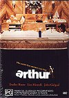

_This review was written by me for **MichaelDVD**, an Australian DVD review site that is no longer online. A capture of the site is held by the Internet Archive: **[browse it there](https://web.archive.org/web/20220217040146/http://www.michaeldvd.com.au/)**. It is reproduced here from my own copy of the site, as part of the record of what I have written._

## The film

_**Arthur**_ is the story of Arthur Bach (**Dudley Moore**), a young man who was born with the proverbial silver spoon in his mouth and so far has led a life of unrelentless luxury where his every desire would be fulfilled. Not having experienced anything as remotely dull as responsibility, pain, or even an honest hard day's work, he ends up being drunk all the time to avoid the necessity of growing up.

His father Stanford Bach (**Thomas Barbour**) thinks he is a spineless weakling and wants him to marry Susan Johnson (**Jill Eikenberry**), the daughter of self-made tycoon Burt Johnson (**Stephen Elliot**), in order to further consolidate the family's power and wealth. If Arthur refuses the marriage, he will be disinherited and he will lose his share of the family fortune - a cool \$700 million (OK, maybe that's not a lot by today's standards, but remember this movie was made in the early eighties).

The only person he truly cares for is his butler Hobson, played magnificently by the late **Sir John Gielgud**who deservedly won an Academy Award for his performance in this movie. We get the feeling that Hobson played the role of Arthur's father in a way that his real father never did, and therefore the scenes between Arthur and Hobson are particularly poignant towards the end.

Just when Arthur has almost resigned himself to become respectable and marry someone he can't stand, he meets poor, struggling waitress-who-wants-to-be-an-actress Linda Marolla (**Liza Minelli**) as while shoplifting a tie at Bergdorf Goodman (birthday present for unemployed Dad played by **Barney Martin**) . He starts to fall in love with her, but which shall it be - love or money?

Arthur is a delightful comedy. The movie starts off with Arthur and his chaffeur cruising around the streets of New York trying to pick up a prostitute. Don't be put off by the world's most irritating laugh (coming from Arthur) at the behinning, if you stick it through you will be rewarded by some of the funniest one-liners ever, delivered with impeccable timing by a perfect ensemble cast. The humour works at several levels in this movie, ranging from straightforward slapstick and situational comedy to some very dry and sophisticated observations on life.

I particularly liked Geraldine Fitzgerald as Martha Bach - the perfect example of a matriach, combining gentleness and sweetness with absolute ruthlessness.

I was initially introduced to Arthur not through the movie itself, but through the soundtrack, featuring music composed by **Burt Bacharach**and his then wife **Carole Bayer Sager**. I found the soundtrack album (yes, it's a genuine vinyl LP - they didn't make CDs in those days) in a record store and was so captivated by it I bought it. The title song sung by **Christopher Cross**deserves the popularity it received and is still vibrant and easy to listen to today, nearly 20 years after it was written.

## The video transfer

The video transfer must have been done by someone who liked the movie, because it is relatively good. It is presented in it's original widescreen aspect ratio and is **16x9 enhanced**.

The print used is fairly clean and devoid of marks. There is some grain present, but no more than what you might expect considering the age of the movie. The picture is a little soft, but exhibits reasonable detail. Shadow detail is below reference quality but probably about average for movies of the period.

The start of the movie (when Arthur and his chaffeur are cruising the streets of New York City in Arthur's Rolls Royce) seems to suffer from poor black levels. I suspect this is present in the original film and not a result of the film-to-video transfer as the rest of the film exhibits very good black levels. The car and street lights exhibit minor posterisation but I did not find the effect too annoying.

Colour saturation is below the quality of a recent film but is actually quite good for a movie originally released in 1981. I suspect colour correction has been applied during the transfer. Liza Minelli's outfits in particular stand out and are vividly saturated with primary colours.

The DVD comes with a reasonable selection of subtitle tracks. I turned on the "English for the hearing impaired" during the beginning of the movie. I would rate the selection of captions as below average in terms of completeness and accuracy for a "hard of hearing" track but probably about average if it was just a normal subtitle track (I apply a

## The audio transfer

There are three audio tracks in this DVD (English, French and Italian), all in Dolby Digital mono (1.0) at a bitrate of 192Kbps. I listened to only the English track.

The audio transfer appears to have been mastered at an extremely low level. I had to crank up the volume control all the way to reference level (0 dB) to get a reasonable sound level. Despite that, though, the audio transfer exhibit reasonable equalization and sounds rather natural.

There are no obviously audio glitches such as audio synchronisation. IMDB reports that the music doesn't seem particularly synchronised to the band during the engagement party but I didn't particular noticed anything amiss.

As the soundtrack is in mono, the subwoofer and surround speakers are not engaged during the feature.

## The extras

There are no extras in this DVD.

### Menu

The menus are pretty basic (ie. non-animated) but do come with **16x9 enhancement**. The scene selection menus do feature "postcards" of each chapter though.

## Region 4 versus Region 1

The Region 4 version of this disc misses out on;

- Pan & Scan version
- Production notes

The Region 1 version of this disc misses out on;

- **16x9 enhanced** widescreen version

My strong preference is for the Region 4 version as it has the original aspect ratio and the 16x9 enhancement.

## Summary

**Arthur** is a genuinely funny comedy presented on a DVD with a slightly above average video transfer and an average audio transfer. It has no extras whatsoever.

### [Ratings (out of 5)](../ReviewersGuide/RatingsGuide.html)

© [Chris Tham](mailto:ChrisT@michaeldvd.com.au) (read my [biography](../ReviewerProfiles/ChrisT.asp)) 27 January 2001

| Rating  | Score        |
| :------ | :----------- |
| Plot    | ★★★★ 4 / 5   |
| Video   | ★★★½ 3.5 / 5 |
| Audio   | ★★½ 2.5 / 5  |
| Overall | ★★★ 3 / 5    |
