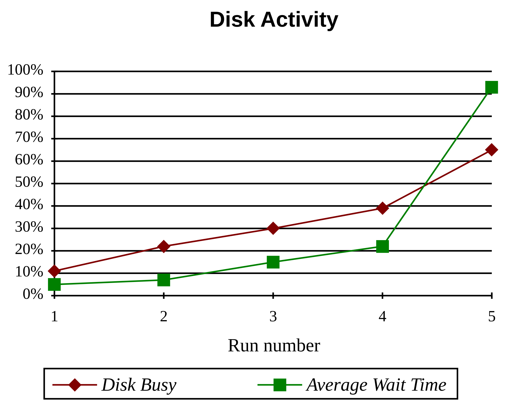
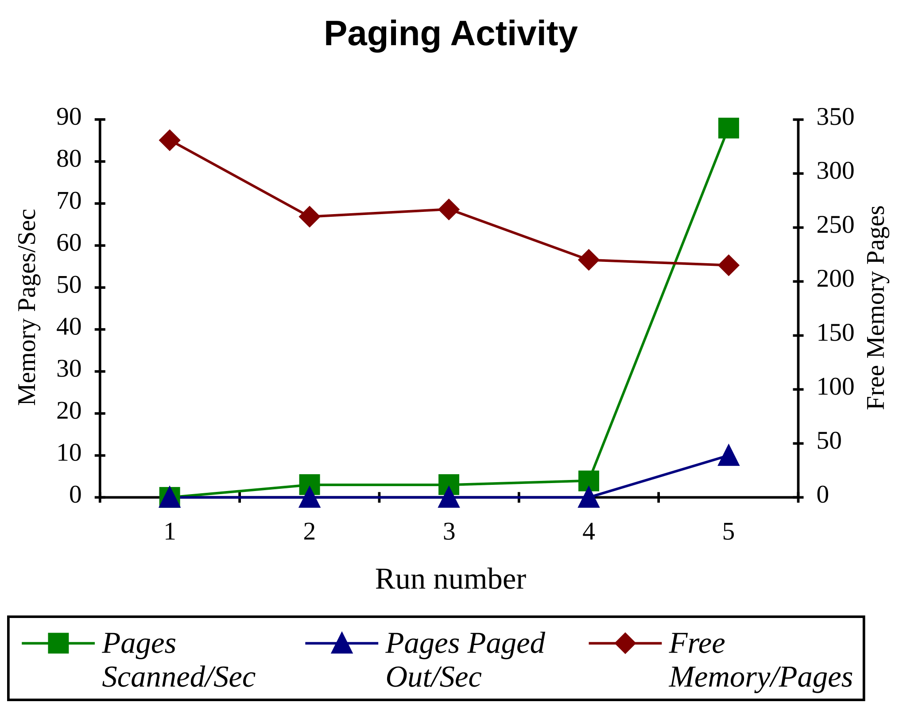
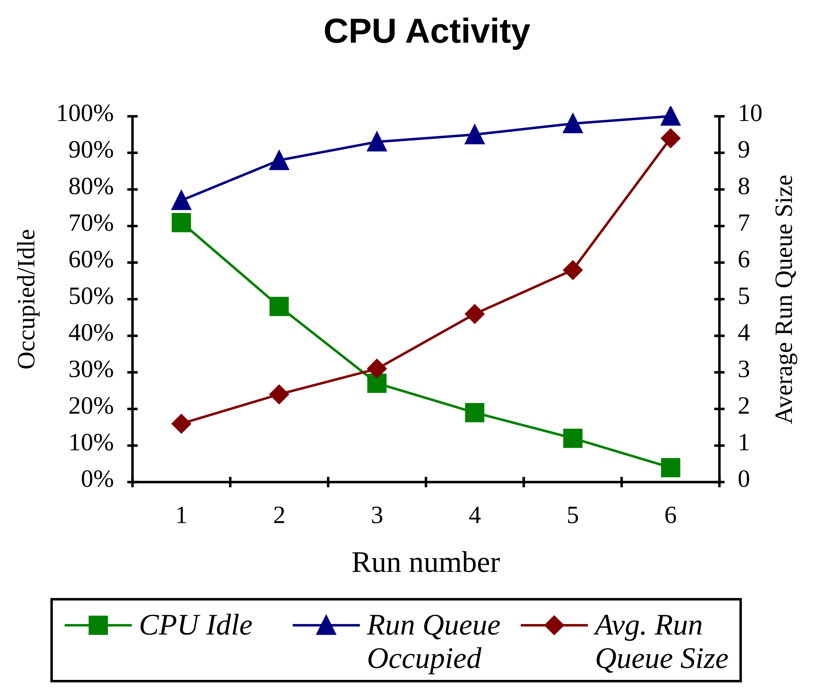
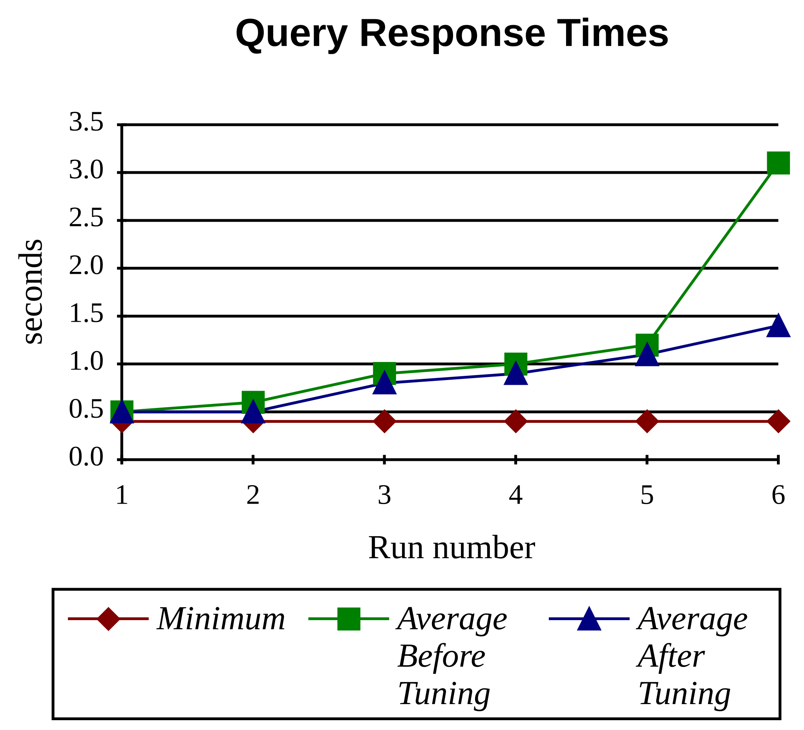
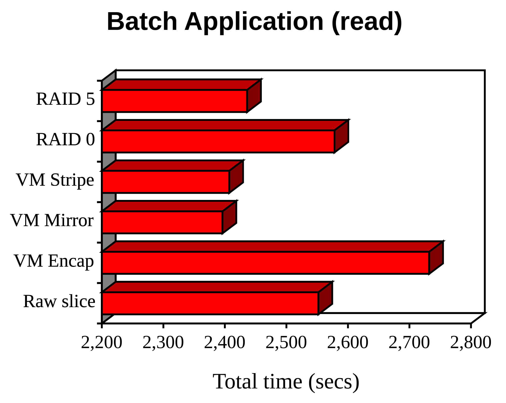
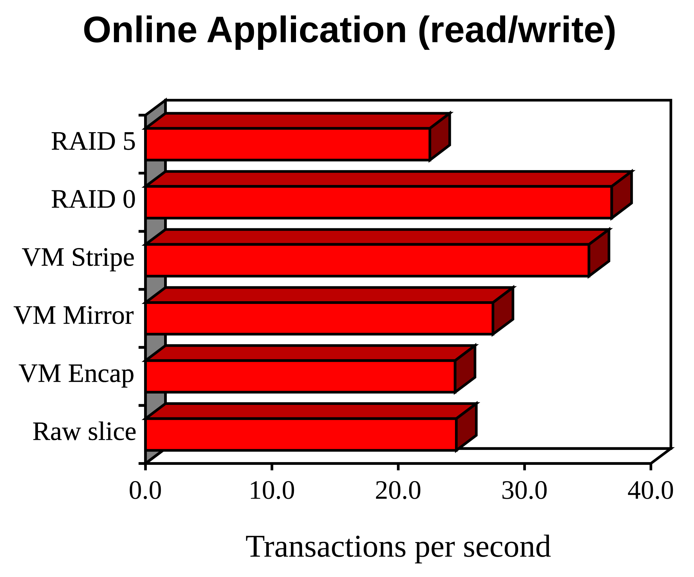
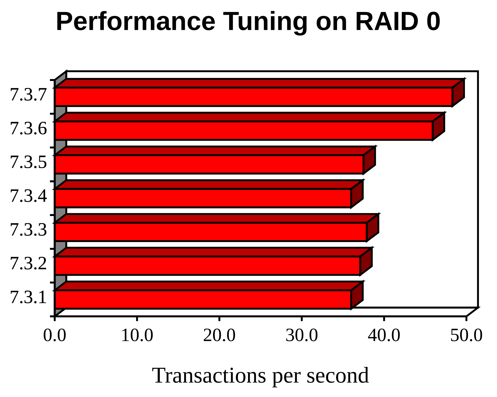
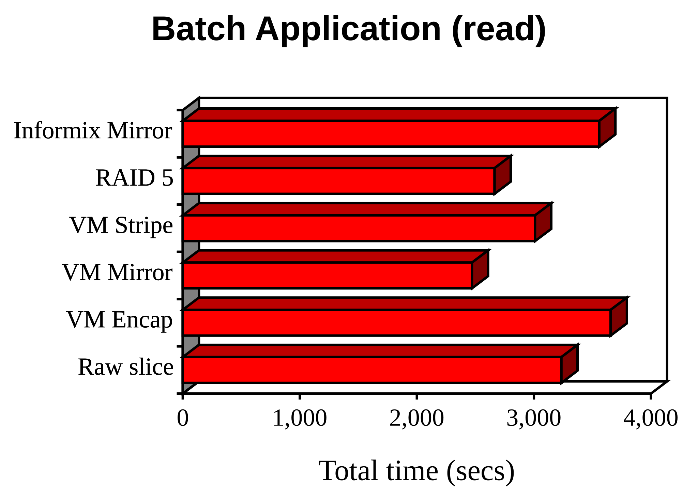
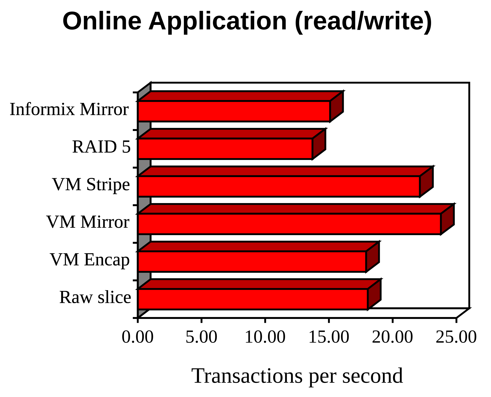
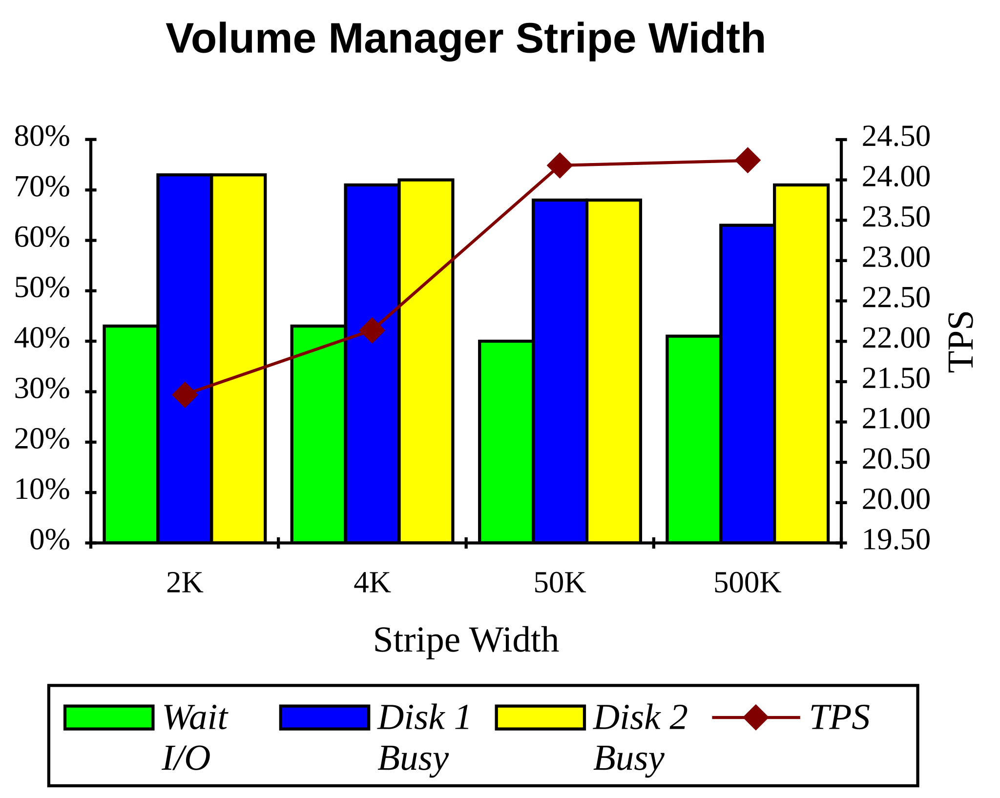

_This is a paper I gave at AUUG'93, the Australian UNIX Users Group conference, held from the 27th to the 30th of September 1993 at the Sydney Convention and Exhibition Centre in Darling Harbour. I was a Senior Consultant in Systems Engineering at [NCR Australia](/spotlite/work/ncr/) at the time. The paper carries its own date of 24 September, the Friday before the conference opened._

_Set from the Word manuscript, with the 1998 HTML export used as a cross-check. Compared as continuous text the two agree to 98.5%, and almost all of the difference is the export's own doing: it generates the section numbers, which the manuscript leaves to an `AUTONUM` field and therefore does not contain at all. Three differences are real. The export dropped a footnote naming the authors of the RAID paper, restored below. It dropped eight synopsis paragraphs, which were my own planning notes left standing under the headings and are not restored, because they were never part of the paper. And it silently corrected "comprised of of" in section 1.1, where the export is the better reading and I have kept it._

_The eleven figures are vector again. Ten of them are live Microsoft Graph chart objects embedded in the manuscript, and Word cached a metafile of each so it could draw the chart without starting Graph; those metafiles convert straight into the charts below, with real text instead of the 1997 GIFs. The eleventh, the AT&T and NCR letterhead, was drawn in PowerPoint and pasted. Unlike the AUUG'94 paper, there is no second colouring to reconcile here: the cached charts and the GIFs made from them use exactly the same palette._

_Six further faults in the export are repaired here. Eleven list items had the opening `<i>` of an italicised lead-in stranded before the `<li>` rather than inside it, so the emphasis was lost; in the AIM index list the same italic then ran across an item boundary, leaving two of four entries upright. The contents entry for section 8.2 pointed at 8.2.1. A multiplication sign set in the Symbol font had degenerated to an acute accent, so the redo logs read "2´ 4 MB". A glob sat outside the code it belonged to, giving `*` then `_NDEV` where the parameter family is `*_NDEV`. And a full stop had been italicised on its own. One defect is left as printed: the Oracle parameter `LOG_BUFFER` is listed with no value, and I have no way to recover the one that was there. The words are otherwise as given, including the body headings reading "1 Introduction" where the contents read "1. Introduction"._

Chris Tham _NCR Australia Pty Ltd_


## Abstract

This paper attempts to outline some issues involved in performance tuning and monitoring applications utilising a relational database system running under UNIX. It gives an overview of performance monitoring and tuning strategies to employ in order to optimise the performance of relational database applications. A section on suitable benchmarks for estimating relational database application performance is also included. Finally, the paper concludes with a discussion of the results and findings obtained by conducting a series of performance tuning case studies. The applications in the case studies are based on the TPC-A and TPC-B Benchmarks. These exercises were conducted on two commercially available relational database systems (Oracle RDBMS and Informix On-line). using various tuning parameters for both the UNIX kernel and the specific database product and under different disk configurations (single disk slice, Volume Manager, different RAID levels etc.) The results are interesting as a relative measure of performance but should not be judged as absolute measures of performance.

_24 September 1993._

## Table of Contents

- [1. Introduction](#H1)
  - [1.1. What is Performance Tuning?](#H1-1)
  - [1.2. An Approach Towards Performance Tuning](#H1-2)
  - [1.3. Performance Tuning and Relational Database Applications](#H1-3)
- [2. Performance Monitoring](#H2)
  - [2.1. Reasons for Performance Monitoring](#H2-1)
  - [2.2. Types of Monitoring](#H2-2)
  - [2.3. Performance Monitoring Strategy](#H2-3)
  - [2.4. Performance Monitoring Tools](#H2-4)
    - [2.4.1. OSA Performance Monitor](#H2-4-1)
    - [2.4.2. Volume Manager Visual Administrator](#H2-4-2)
    - [2.4.3. Remote Terminal Emulator](#H2-4-3)
- [3. Performance Tuning Strategies](#H3)
  - [3.1. UNIX Kernel parameter tuning](#H3-1)
  - [3.2. Tuning the Relational Database and Application](#H3-2)
    - [3.2.1. Data placement](#H3-2-1)
    - [3.2.2. Tuning the Database Engine](#H3-2-2)
- [4. Data Storage Options](#H4)
  - [4.1. RAID](#H4-1)
  - [4.2. Volume Manager](#H4-2)
- [5. Benchmarks](#H5)
  - [5.1. Introduction](#H5-1)
    - [5.1.1. Benchmark Philosophy](#H5-1-1)
    - [5.1.2. Caveat Lector](#H5-1-2)
  - [5.2. Transaction Processing Council Benchmarks](#H5-2)
    - [5.2.1. TPC Benchmark<sup>TM</sup> A (TPC-A)](#H5-2-1)
    - [5.2.2. TPC Benchmark<sup>TM</sup> B (TPC-B)](#H5-2-2)
    - [5.2.3. TPC Benchmark<sup>TM</sup> C (TPC-C)](#H5-2-3)
  - [5.3. Some observations from conducting the TPC benchmarks on the NCR System 3000 multi-processing machines](#H5-3)
    - [5.3.1. TPC-A](#H5-3-1)
    - [5.3.2. TPC-B](#H5-3-2)
  - [5.4. System Performance and Throughput Benchmarks](#H5-4)
    - [5.4.1. Neal Nelson's Business Benchmark](#H5-4-1)
    - [5.4.2. System Characterisation Benchmark (SCB)](#H5-4-2)
    - [5.4.3. AIM Technology Benchmark Suites](#H5-4-3)
    - [5.4.4. SPEC Benchmarks](#H5-4-4)
    - [5.4.5. Whetstone](#H5-4-5)
    - [5.4.6. Dhrystone](#H5-4-6)
- [6. Case Study A: An Oracle SQL\*Forms application on an NCR 3445](#H6)
  - [6.1. Description](#H6-1)
  - [6.2. Monitoring/Tuning Activities](#H6-2)
    - [6.2.1. Session 1](#H6-2-1)
    - [6.2.2. Session 2](#H6-2-2)
    - [6.2.3. Session 3](#H6-2-3)
    - [6.2.4. Session 4](#H6-2-4)
    - [6.2.5. Session 5](#H6-2-5)
  - [6.3. Conclusion](#H6-3)
- [7. Case Study B: Oracle 6 on an NCR 3550 using Volume Manager and a RAID Array](#H7)
  - [7.1. Description](#H7-1)
  - [7.2. Benchmark results](#H7-2)
    - [7.2.1. Batch Application results](#H7-2-1)
    - [7.2.2. Online Application results](#H7-2-2)
  - [7.3. Performance Tuning](#H7-3)
    - [7.3.1. Eliminate contention on the SYSTEM Rollback segment](#H7-3-1)
    - [7.3.2. Move redo logs to another disk](#H7-3-2)
    - [7.3.3. Move HISTORY table to another disk](#H7-3-3)
    - [7.3.4. Increase Oracle block buffering](#H7-3-4)
    - [7.3.5. Move ACCOUNT Index to another disk](#H7-3-5)
    - [7.3.6. Change Oracle parameters](#H7-3-6)
    - [7.3.7. Use NCR specific features in the Oracle implementation](#H7-3-7)
    - [7.3.8. Summary](#H7-3-8)
- [8. Case Study C: Informix 5.0 on an NCR 3450 using Volume Manager and a RAID Array](#H8)
  - [8.1. Description](#H8-1)
  - [8.2. Benchmark results](#H8-2)
    - [8.2.1. Batch Application results](#H8-2-1)
    - [8.2.2. Online Application results](#H8-2-2)
  - [8.3. Performance Tuning](#H8-3)
    - [8.3.1. Increasing the Volume Manager stripe width](#H8-3-1)
    - [8.3.2. Increasing the Spin Count](#H8-3-2)
    - [8.3.3. Allocating more buffers in Informix shared memory](#H8-3-3)
- [9. Conclusion](#H9)
- [References](#References)
- [Biography](#Biography)

<a id="H1"></a>

## 1 Introduction

<a id="H1-1"></a>

### 1.1 What is Performance Tuning?

First of all, define a _system_ as a combination of computer hardware and operating software designed and configured to support the execution of a suite of _applications_. The applications are run by or on behalf of the _users_ of the system.

A given system is comprised of a number of finite _resources_ (CPU, memory, disk, IPC, STREAMS, etc.). Applications have specific resource requirements. If the system cannot give an application all the resources it requires (because of under-configuration - hardware or software - or because resources are already allocated to other applications), the application may not run or may run slowly. If many applications demand a particular resource and the system cannot fulfil all demands, the resource becomes a _bottleneck_.

Ideally, a system would be configured so that no resource would ever become a bottleneck no matter what combination of applications are currently being executed. However, in real life this is not often possible, either because of cost considerations or due to other constraints, such as internal operating system limits or because applications have the policy of demanding as much resources as they can acquire.

_Performance tuning_ is the art of providing the right quantity of resources in a system to allow applications to run at the highest possible speed and at the lowest possible price. This can range from increasing the number of resources in a system (by buying additional hardware) to altering the system's configuration so that existing resources are utilised in a more optimal manner.

<a id="H1-2"></a>

### 1.2 An Approach Towards Performance Tuning

Traditionally, performance tuning consists of following any or all of the following steps:

1. Monitoring the performance of the existing system running a realistic mix of applications.
1. Analysing the real or potential bottlenecks present in the system.
1. Changing the hardware configuration of the system to reduce or minimise bottlenecks.
1. Altering the system software parameters to allocate system resources more efficiently amongst applications.
1. Modifying the application(s) to use or demand resources more efficiently.

The last step, modifying the application, is not usually performed, because many users buy applications 'off the shelf' and the users are not in a position to be able to modify them.

<a id="H1-3"></a>

### 1.3 Performance Tuning and Relational Database Applications

Many of today's business and commercial applications utilise relational database technology to store business information. This adds an additional factor into the performance tuning process, since a relational database product is a 'half-way house' between the application and the underlying operating system.

An application built using relational database technology often communicates to a relational database engine using a client-server model. The application interacts with the user and contains business logic, whereas the relational database engine actually stores and retrieves the data to and from the system. To the application, the relational database engine may appear as an extension of services or resources provided by the operating system. However, to the system, the relational database engine appear as another consumer of resources, sometimes in competition with the applications themselves.

Tuning the performance of relational database applications on a system revolves around a complex triangle consisting of the applications, the relational database engine and the underlying system.

<a id="H2"></a>

## 2 Performance Monitoring

<a id="H2-1"></a>

### 2.1 Reasons for Performance Monitoring

The first step towards performance tuning is monitoring existing or anticipated performance. Besides tuning, performance monitoring may be performed for a number of other reasons:

- Estimation (predicting the performance of a particular system)
- Configuration (ensuring that a system has the correct amount of resources to support the load placed on it)
- Accounting (dividing the costs of running a computer system between users).

<a id="H2-2"></a>

### 2.2 Types of Monitoring

Performance monitoring can be done at several levels:

- The entire system (running a mix of applications and system functions)
- Specific packages (e.g. graphical user interface, relational database engine, networking operations)
- The application or process (e.g. user session, application execution)

When we monitor the entire system, we typically monitor system resources like CPU, memory, disk, I/O controllers etc. When we monitor packages, we also monitor system resources, but we want our figures to be specific to the package, i.e. we are not interested in system resources consumed by other packages or applications running on the system. Lastly, when we monitor specific applications, we are interested in the specific resources consumed by the application as well as, say, the execution profile of the application to determine how efficiently it is utilising system resources.

In any case, we definitely do not want to monitor resources consumed by the monitoring process, unless the monitoring process is considered part of the 'normal' application mix when the system is in 'production'. Tools used for performance monitoring (this includes the performance monitoring package, activity logging and accounting functions, monitoring I/O) may consume significant resources that may skew or otherwise distort the results obtained.

<a id="H2-3"></a>

### 2.3 Performance Monitoring Strategy

First of all, we need to identify all potential resources in the system. This may include obvious hardware resources such as CPU, memory, etc., but also include operating system configuration parameters such as those for System V IPC, Berkeley sockets, Streams, pseudo-devices, the file system (disk space, inodes, file descriptors), kernel data structure sizes, buffering, and locking. If we are monitoring the relational database engine, we also need to recognise any configuration parameters or limits imposed by the engine itself (such as database block buffering, locking, etc.).

Next, we need to identify ways to measure each resource. This amounts to choosing a performance monitoring tool (either built into the system or package or an external analysis tool). Many resources can be difficult if not impossible to measure.

Lastly, we need to define the environment in which the monitoring is to be conducted. This includes not just the configuration of the system that is to be used but also the application type and mix. Ideally of course, we would monitor the actual production system running the quantity and type of applications for a duration that can be characterised as being 'typical' for the organisation.

When the above scenario is not possible (because the system is not yet in production, the applications have yet to be written, or simply because the monitoring process is considered too disruptive) we would need to assess the impact of any differences to the results that we are likely to achieve. For example, we may be monitoring the application mix on a system that is different from the actual production system, because the production system is not available, or we may not yet have purchased a suitable system and are evaluating between proposed alternatives. We need to consider how the system being monitored relates to the actual production system, and how the results obtained can be adapted or scaled to the production system.

Once we have obtained a set of results of each resource that we are monitoring, we need to check the scalability of each resource when we increase either the amount of the resource that is available or the number of applications that require the specific resource. For example, if one program needs `X` kB of memory in order to run without paging, two copies of the program running concurrently may only need 1.5 × `X` kB (due to the shared program text). Also, if CPU capacity is a bottleneck, increasing the number of processors in a multi-processing system may not deliver twice the processing power (particular if there is only one instance of one application running on the system).

<a id="H2-4"></a>

### 2.4 Performance Monitoring Tools

Basic monitoring tools available under UNIX (such as `truss`, `ps`, `sar`, `netstat`, `strconf` etc.) are usually adequate for superficial monitoring. When monitoring a large system supporting many packages and applications, we would probably need more specialised tools.

The relational database product often provides its own set of monitoring tools that can be used to monitor the database engine plus resources consumed by the engine. In addition, some tools can monitor the connections into the engine from various applications. Examples are `tbstat` under Informix, `ipm` under Ingres, and the SQL\*DBA `monitor` command under Oracle. Another approach is to gather performance monitoring information into the data dictionary. In this way, SQL queries can be performed to analyse statistical information automatically collected by the database engine. Some relational database vendors take both approaches, e.g., provide a monitoring tool as well as collect information in the data dictionary.

Another approach is to purchase a performance monitoring product. Many network and systems management products (for example, **NCR StarSENTRY**) provide analysis and monitoring facilities that can be utilised. An example of a performance monitoring tool specifically designed to monitor system activity is NCR's **OSA Performance Monitor**, which is an optional component of the **Open System Administrator** (OSA). The base OSA package is bundled together with NCR's **UNIX SVR4 MP-RAS** (in the _Client/Server Foundation Operating Environment_).

The following are brief descriptions of the performance monitoring tools that have been used in the case studies discussed in this paper. The intention is not to present the features and benefits of each product but to give sufficient background to allow the reader to understand how the product was used in the case studies.

<a id="H2-4-1"></a>

#### 2.4.1 OSA Performance Monitor

OSA Performance Monitor is a utility and user interface that gathers and presents real-time performance statistics and metrics for specific system resources as well as general system resources and activities. **Performance Monitor** gathers the performance information at the time it is requested and displays the information in a graphical format (using the X11/Motif graphical user interface) such as a line graph or an EKG graph.

<a id="H2-4-2"></a>

#### 2.4.2 Volume Manager Visual Administrator

Volume Manager Visual Administrator is a graphical systems administration tool (based on the **Motif** graphical user interface) intended for use with **Volume Manager** (refer to section 4.2 for a description of **Volume Manager**).

Volume Manager itself provides two types of performance information: I/O statistics and I/O traces.

- I/O statistics are retrieved using the `volstat` utility. Information is provided for physical reads and writes on each sub-disk, including counts, number of blocks being transferred, and total active time. Read/write failures and retry operations are also recorded.
- The `voltrace` utility allows the system administrator to set I/O tracing masks and then display ongoing I/O operations relative to the masks. The trace records allow the system administrator to track each operation even though the traces may be interspersed with other operations.

The _Analyse_ menu selection within **Visual Administrator** is used to monitor sub-disk activity and device utilisation. This information originates from the performance statistics recorded by **Volume Manager**.

- _Read/write activity_ is the total I/O activity on a **Volume Manager** device measured within a specified sample period. This is presented to the user as a picture showing read/write and disk activity. The user is allowed to modify how analysis activity takes place, including how often the activity will be sampled, as well as high/low I/O watermarks.
- _Device utilisation_ displays the activity on selected disks by colouring the icons according to the percentage of time the disk was performing I/O operations. The user is allowed to define how often the activity will be sampled, as well as high/low I/O measurements.

<a id="H2-4-3"></a>

#### 2.4.3 Remote Terminal Emulator

A Remote Terminal Emulator (RTE) is a combination of computer hardware and software that work together to emulate one or more users typing on terminals connected to a System Under Test (SUT). From the point of view of the SUT, every RTE user is a "real" user typing at a terminal. The RTE runs on a driver machine which is electrically connected to the SUT. Hence, the RTE software generates no disk, memory or CPU overhead on the SUT.

Most UNIX system RTEs emulate users at asynchronous character terminals connected to the SUT using the RS-232 protocol. There is usually no restriction on the SUT other than it must be able to support RS-232 terminal connections. Enhanced RTEs support users over a network login protocol (e.g. `telnet` or `rlogin`) or users using graphical user interfaces (e.g. X servers supporting X clients on the SUT).

An RTE simulates users at their terminals or workstations running 'workloads' on the System Under Test (SUT). RTE users enter data into the SUT at a specified typing rate and think time (time between operations). Most RTEs have a programming language that allows a user session to be defined within the RTE. Creating a workload is done by writing a program in the RTE language (called a 'script') or by using a tool to generate an RTE script from a captured session.

An RTE is an excellent performance monitoring tool as it generates realistic system wide workloads by driving applications as real users would and calculates the response time(s) of the system whilst users are performing normal everyday tasks. This makes the RTE useful for measurement, analysis and tuning of application and system software, for functional, regression, and capacity testing, for service level monitoring, and as an apparatus for creating a sustained work load. Although it is possible to do all of the above without an RTE, doing so requires real users running applications from terminals with some external timing mechanism.

NCR have used the **Quartz RTE**, originally developed in the early 1980s by AT&T Bell Laboratories and now commercially available from AT&T/NCR, for performance analysis, TPC-A, and TPC-C benchmarking, system sizing and capacity planning, application and system software testing, quality control sampling of live systems, and live customer demonstrations.

A good RTE will have the following features:

- workload capture/playback
- workload script generation
- script language
- tools for controlling/varying the workload
- specific or random workload assignment to emulated users
- response time statistical analysis
- performance display
- connectivity support (RS-232, TCP/IP, etc.)

An ideal RTE generates no load on the SUT. This is usually achieved by running the RTE on a different system altogether and using serial lines or network logins to simulate users on the SUT. If the SUT is also used to run the RTE software, then pseudo terminals can be used to simulate users.

It should be fairly simple to write an RTE using the public domain `expect` package. The `Tcl` language within `expect` can be used to simulate users typing on a terminal. However, capturing and replaying workloads can be fairly tedious, as an expect script must be written that monitors for output text and then sends in a simulated user response. This is particularly tricky for interactive screen applications, as many software applications often perform bizarre cursor movement optimisations (or, as the case may be, _dis_-optimisations) that can fool `expect`. A good RTE often automates the generation of workload scripts from a sample user interaction capture. RTEs also contain code to build a virtual screen image from terminal escape sequences in order to handle weird cursor motion sequences.

<a id="H3"></a>

## 3 Performance Tuning Strategies

Once the performance analysis have been completed using the available performance monitoring tools, we need to identify the resources that appear to be bottlenecks. Performance tuning consists of modifying the system environment to eliminate these bottlenecks or to reduce their impact on the system performance. This can be done in a number of ways, ranging from adding hardware components to the system to altering the system configuration, to altering the application itself.

<a id="H3-1"></a>

### 3.1 UNIX Kernel parameter tuning

Aside from increasing a kernel parameter to overcome a resource shortage, tuning the UNIX SVR4 kernel without a source licence is primarily striking an appropriate balance of memory usage between the file system, the process system, and the networking layer. Memory that is allocated for shared memory or programs is not available for file I/O or network buffering and vice versa. If applications do not receive enough physical memory (because, for example, it is used for file buffering), swapping and paging will reach excessive levels and the system can be said to be _thrashing_.

The `BUFHWM` and `NBUF` parameters control the allocation of buffer headers for file system buffering. `SEGMAPSZ` can be used to control the proportion of physical memory used for paging and for file buffering. The System V IPC parameters (for shared memory, semaphores and messages) are also important as many relational database products use the IPC mechanisms. The `LOTSFREE`, `DESFREE,` and `MINFREE` parameters control paging. The `STRTHRESH` and `*_NDEV` parameters control Streams and TCP/IP memory allocation.

<a id="H3-2"></a>

### 3.2 Tuning the Relational Database and Application

This section is intended to be a "no frills" guide to tuning relational database applications because it is not specific to a particular database vendor's RDBMS implementation but is "generic" across most relational databases.

Tuning a relational database application occurs at many different levels. If we are allowed to tune the application itself, tuning can be achieved using the following approaches:

- Tuning the Physical Database Design (proper indexing, de-normalisation, etc.)
- Tuning the Application SQL code (optimising queries, minimising locking, efficient cursor utilisation, etc.)
- Tuning the Application interface to the database (for example, Oracle provides several interfaces between the application and the RDBMS Server: Two-task, Fast Pipe, SQL\*Net V1 and V2, etc. The appropriate driver to use depends on circumstances).

Often, however, tuning the application is not a feasible option and we are limited to optimising the data storage and tuning the relational database engine.

<a id="H3-2-1"></a>

#### 3.2.1 Data placement

Before we can determine the optimal approach to storing the application data on the data, we need to estimate the demographics of the data. This includes estimating size of tables plus frequency of change, and also typical initial and change values. The following are some hints for optimising data placement:

- Concentrate on large tables that are most frequently accessed. Smaller tables which are frequently used will hopefully be cached (or should be).
- Tables that grow often should be placed in a separate area (nomenclature differs depending on vendor: "tablespace", "segment", "data space", etc.) and table allocation parameters used to control growth and space allocation.
- Use Volume Manager or facilities within the database itself to distribute large tables over several disks.
- Use clustering options to control how records are written to database blocks (so that dynamic, frequently accessed tables are not stored in a fragmented fashion).
- Full table scans (i.e., `SELECT * FROM CUSTOMER`) will sometimes perform slower if an index is present and used (need to find a way to turn of use of indexing for that statement, or even DROPping the index temporarily)
- Several (composite) indexes on a table will slow table inserts and updates. Solution: may need to postpone inserts to a batch job at night, and save the rows into a temporary table during the day.

<a id="H3-2-2"></a>

#### 3.2.2 Tuning the Database Engine

This is very specific to the tuning parameters provided by the relational database implementation so it is impossible to generalise the approach in this paper. The case studies in this paper can serve as a guide and indication of the parameters that can be tuned for certain database products as well as the approach taken.

<a id="H4"></a>

## 4 Data Storage Options

Because relational database applications often impose a high load on the disk sub-system, it is worthwhile considering the different options available for physically storing the data in the database.

As an example, although all relational databases allow the storage of data on the UNIX file-system, some products allow the option to store some or all information directly into a UNIX raw or block device, corresponding to a slice on the physical disk. Doing so often yields a 10-15% improvement in performance as the UNIX file-system overhead is skipped (and many symmetric multi-processing versions of UNIX have annoying bottlenecks in the file-system code when more than one CPU attempts to perform I/O on the same file-system). However, UNIX file buffering is not normally performed on direct device I/O, and the relational database engine has to compensate by using its own block buffering strategies.

The following section discusses two alternatives that can potentially increase I/O throughput for relational database applications. The impact of using these alternatives will be covered in Case Studies B and C later on in this paper.

<a id="H4-1"></a>

### 4.1 RAID

A study by the University of California at Berkeley[^1] coined the term RAID to describe an I/O architecture that can safeguard information and improve performance. RAID stands for Redundant Array of Inexpensive Disks. Current generation, small to medium capacity disks (originally designed for small systems or personal computers) are used to build RAID arrays.

The original RAID approach was to use these small disks to build a large logical disk that is cheaper as well as offering better performance and reliability than a single large and expensive disk (SLED). With the increase in hard disk capacities and drop in hard disk prices, RAID technology is nowadays more commonly utilised to provide higher reliability and availability as well as increased performance.

The Berkeley study originally defined five RAID classes or modes of operation (RAID levels 1 to 5). Subsequently two new levels were defined (RAID 0 and RAID 6). Commercially available RAID arrays (such as the NCR 6292 and 6298 Disk Arrays) usually support more than one RAID level (but each controller only supports one type of RAID level at a given time) using a software configuration utility. For the purposes of this paper, we are interested in using RAID technology to increase performance, not to achieve high availability per se.

- RAID 0 uses disk striping (dividing data into sections called _stripes_ and assigning adjacent stripes across multiple disks) without a parity or check disk. For relational database applications, it should be the best overall performer due to striping and use of multiple disk actuators.
- RAID 1 uses transparent mirroring, also called shadowing. This is the traditional approach to improving reliability of disk systems. It results in faster reading (since data can be accessed from two spindles) but slower writing (since data has to be written twice).
- RAID 2 uses Hamming Code Error Correction to achieve redundancy using multiple data and check drives.
- RAID 3 utilises parallel transfer techniques with a single check disk (using Cyclic Redundancy Checking) per group. RAID 3 has fast read/write characteristics. The strongest performance is for large block sizes (greater than 64 kB) and when the read/write ratio is less than 50%. RAID 3 is particular attractive when the I/O is mainly sequential (large block sizes of 64 kB and above).
- RAID 4 uses independent disk arrays plus a parity disk. The parity disk often becomes a bottleneck since all I/O must access it.
- RAID 5 spreads data and parity across all disks and allows multiple read/write operations to occur simultaneously. RAID 5 is particularly suited for relational database applications requiring high availability, since it is better than RAID 3 for random access I/O with block sizes less than 64 kB where the read/write ratio is greater than 50%. RAID 5 has a write penalty similar to mirroring since dual write operations must be performed.
- RAID 6 is similar to RAID 5 but uses multiple controllers and other hardware to avoid single points of failure in the design. Dual parity checking is provided.

Tuning a RAID array involves consideration of the following factors:

- Which RAID level is the most appropriate, given performance and reliability requirements
- Read/write ratio
- I/O block size
- Disk partitioning and slicing boundaries
- File system type
- Number of ranks of drives and SCSI controllers

<a id="H4-2"></a>

### 4.2 Volume Manager

Volume Manager is an **NCR UNIX SVR4 MP-RAS** add-on package (bundled with the **Client/Server Foundation**) that provides software disk management. It creates a virtual disk sub-system transparent to the user by building virtual (logical) disk volumes on top of UNIX's physical devices. Once the virtual volume is created, a normal UNIX file system, or the raw device used by a database system, accesses the logical disk volume rather than the physical disk partitions. Virtual volumes appear as character and block devices to the UNIX user, hence it is possible to create and mount a file-system on a virtual volume.

The most obvious use of **Volume Manager** is to bundle together several small physical disks and presenting the storage space as one big logical disk. It is also possible to configure **Volume Manager** to achieve software based disk mirroring by storing duplicate copies of data on multiple drives (RAID 1) and striping (similar to RAID 0). Mirroring increases data availability and reliability, and allows parallel reads. Striping improves the data transfer rate.

<a id="H5"></a>

## 5 Benchmarks

<a id="H5-1"></a>

### 5.1 Introduction

Benchmarking is an art and there are many subtleties and nuances which do not immediately come to mind. The following two sections are quoted almost verbatim from the NCR 3450 and NCR 3550 _TPC Benchmark Full Disclosure Reports_ and were written by R. J. Hanson, NCR Performance and Tools Unit, Naperville, Illinois, USA.

<a id="H5-1-1"></a>

#### 5.1.1 Benchmark Philosophy

A _benchmark_ is a representation of some real workload or application. This representation is used either because it is smaller and easier to transport from one system to another than an actual application, or because it seems similar to an application which has not been implemented yet. Running the benchmark on various systems then gives the user an idea of how those systems might perform with the actual application, and the user can then make more informed decisions.

A good benchmark must have several properties:

- _Representative_ the benchmark should represent an interesting performance quantity or workload, and it should measure what it purports to represent.
- _Accurate_ the benchmark should provide detailed performance indices. It should do so with enough precision to draw conclusions about the performance quantity it measures.
- _Isolation_ the benchmark should clearly isolate the system conditions under question, and measure only what it is intended to measure. External conditions which are not germaine should have minimal impact, where practicable, on the execution of the benchmark.
- _Reproducible_ the benchmark should generally run the same way each time it is invoked, given the same execution environment. Anyone should be able to re-create a measurement within a given tolerance band.
- _Robust_ the benchmark should not require overly controlled conditions to execute, nor should it break due to minor perturbations in the execution environment. Finicky or flaky benchmarks are probably also not accurate as well.
- _Portable_ the benchmark should run easily on a wide variety of systems in order to build a meaningful result base and allow performance analysis.
- _Easy-to-use_ the benchmark should be easy to set up and use, so as to be considered useful. If excessive resources are required, use will be so infrequent that the benchmark will no longer be needed. Ease of use also contributes to accuracy.
- _Clarity_ the benchmark results should be able to be reduced to meaningful performance conclusions which can be used by the target audience to optimum efficiency. Mountains of meaningless data just increase confusion; a clear methodology for interpreting results gives a clear conclusion.

The preceding list is not conclusive; there may be other attributes which various audiences demand from their benchmarks. However, these are the major considerations.

<a id="H5-1-2"></a>

#### 5.1.2 Caveat Lector

Since the benchmarks can be configured and implemented in different ways, the reader should keep a few things in mind when comparing results. The following points should be helpful when comparing benchmark results between systems:

- _Understand the metric._ What does the benchmark purport to measure? Does it give you peak or sustained performance? Is performance a _rate_, a _time_, or a dimensionless quantity? Does the metric fit your needs? Consult the benchmark specification for an explanation of the metric.
- _Understand the measurement methodology._ Sometimes a benchmark is run for a long time and a "snapshot" is taken in the middle, while other benchmarks run to completion and the elapsed time is the measurement. Are there any calculations involved such as aggregating several smaller results into "one number" (e.g. geometric means, weighted sums)? The benchmark specification should supply the proper methodology and help you understand what the results mean.
- _Do not confuse_ performance _with_ capacity. A PC with a very fast CPU and a small amount disk may perform at the same transaction per second (TPS) rate as a large mini-computer with lots of memory and disk, over some narrow range of users (or transaction generators). This does not mean that these systems are equivalent in features, reliability, compatibility, or even that the performance is comparable over all of the optional configurations of both systems. A large system is not always a fast system. And conversely, a fast system may not always have the ability to become a large system.
- _Be familiar with the overall system configuration._ Compare memory size, number and type of CPUs, number and size of disks, and other I/O devices equipped. The reader should have a good understanding of the absolute cost (not just cost per TPS) of the systems being compared.
- When comparing price/performance figures, the reader must _understand the method by which the numbers were obtained_. Initial cost and "full costs" are often quoted. Full costs are generally defined as the initial purchase cost plus some number of years (e.g. five) of maintenance plus additional disk storage for some number of days (e.g. 30, 90) of historical data as specified in the benchmark definition for price per transaction calculations. For high performance systems, the history file requirement is a substantial one. This can add considerable cost in the are of required disk storage. For entry level systems, the history file size requirement often increases the entry cost of a system by specifying more storage than is needed. Make sure the price/performance comparison is "apples to apples".
- _Know what database size reported numbers were measured with._ Typical database sizes range from 100,000 records to several tens of million records. Generally, the smaller the database, the better the performance will be. Additionally, a larger database requires more disk storage capacity increasing the cost of the system. Therefore it is important to compare results from similar database sizes. Even though, for example, the TPC set of benchmarks rules state that the databases must be fully scaled, it is not always fair to compare any two systems unless they have roughly equivalent _capacities_.

<a id="H5-2"></a>

### 5.2 Transaction Processing Council Benchmarks

The _Transaction Processing Performance Council_ was founded in August 1988 to establish standard benchmarks for measuring database computing performance. Most of the members of the TPC are computer hardware and software vendors. NCR has been a member of the Council since the early stages. Prior to the TPC benchmarks, several non-standard database benchmarks existed. The most familiar were the _Debit/Credit_ and _TP1_ benchmarks. Because there was no official standard, these tests were often modified in various ways to suit individual architectures. The TPC sought to end this confusion and has succeeded by publishing official specifications for two benchmarks known as _TPC-A_ and _TPC-B_. The work of the Transaction Processing Council has been well received and major vendors including NCR are contributing to this work. The Transaction Processing Council has recently released a new _TPC-C_ benchmark (which has a more realistic description of a typical OLTP environment) and is in the process of drafting the specifications of a _TPC-D_ benchmark (which is currently in draft and is an attempt to measure the performance of decision support systems).

<a id="H5-2-1"></a>

#### 5.2.1 TPC Benchmark<sup>TM</sup> A (TPC-A)

The TPC-A specification, which replaces the former _Debit/Credit_ test, was released in November 1989. TPC-A requires a comprehensive setup which includes an external transaction generator and appropriate networking hardware. The rules for scaling the size of the database in accordance with the number of transactions per second (TPS) to be demonstrated further add to its complexity. Also, the TPC, unlike SPEC, does not provide an actual benchmark tape, but rather a specification as to how the benchmark must be implemented. The vendor or system evaluator is free to implement the benchmark using whatever method, provided that it conforms to the standard specification. Upon completion, an audit by an external consultant is usually required, along with a full disclosure report of how the benchmark was executed.

TPC-A is a remote terminal emulation (RTE) benchmark which performs on-line transaction processing (OLTP) operations. The benchmark is a representation of a banking application containing teller terminals, each of which is called a "teller", "terminal" or "user". The model is a set of teller terminals at a bank and the bank has multiple branches. There is only one type of transaction at this bank - an account update which is either a deposit or a withdrawal.

The transaction involves updating three items in the bank's database:

- the customer's account balance,
- the teller's balance,
- the branch's balance,

and creation of

- a transaction history record

so that bank auditors can review transactions.

TPC-A requires:

- exactly 10 tellers per branch
- exactly 100,000 accounts per branch

The number of branches controls the database size and must be scaled to the number of TPS to be demonstrated according to the rule: one branch per demonstrated TPS.

The RTE submits transactions from each emulated terminal with a mean arrival time of 10 seconds. A random number generator is used to determine the arrival times. More precisely, these arrival times have an exponential distribution (the TPC officially uses the unusual terminology "negative exponential" for this distribution).

This distribution is characterised by having a wide range of values so that some times may be close to 0, some as big as 20 and a few close to 30 but the average over a large sample would be close to 10. This same distribution (with a different, much larger mean, of course) is used to model product reliability with the mean in this case referred to as MTBF. TPC-A delivers two metrics as an end result: the performance in _tpsA-local_ or _tpsA-wide_, and the price/performance ratio in _\$/tpsA_. The bigger the _tpsA_ number, the better. The smaller the _\$/tpsA_, the better. _Wide_ refers to a wide-area network communication configuration conforming to rules stated in the specification. _Local_ is for other system configurations, typically using direct connect (e.g. local RS-232) or Local Area Network (LAN).

<a id="H5-2-2"></a>

#### 5.2.2 TPC Benchmark<sup>TM</sup> B (TPC-B)

TPC-B is a batch-oriented database stress test which performs multi-threaded SQL submit operations. The benchmark uses the same conventions as TPC-A but without the on-line transaction processing (OLTP) aspects of the benchmark.

As in TPC-A, the size of the database is scaled to the size of the system being tested. That is, the same scaling rules apply: 10 tellers, 100,000 accounts per branch, and one branch for each _tpsB_ to be demonstrated.

A driver program spawns a number of background batch programs which then submit transactions which range over the entire database; there is no teller or "user" assignment per program as in TPC-A.

TPC-B delivers two metrics as the end result: The performance in _tpsB-simplex_ or _tpsB-duplex_ and the price/performance ratio _\$/tpsB_. As before, the bigger the tpsB the better, the smaller the _\$/tpsB_ the better.

Simplex refers to a system configuration where the transactions are submitted on the same system(s) they are served and _duplex_ means that the database back-end resides on a different system and network connectivity is used for the interface (i.e. client-server).

TPC-B replaces what was formerly known as _TP1_. It is similar to TPC-A, but does not require the external networking setup.

<a id="H5-2-3"></a>

#### 5.2.3 TPC Benchmark<sup>TM</sup> C (TPC-C)

TPC-C is also an on-line transaction processing (OLTP) benchmark but addresses more complicated business scenarios and produce a _tpmC_ rating - transactions per minute. TPC-C is different and more complex than TPC-A because of its multiple transaction types, more complex database, and overall execution structure.

As an OLTP system benchmark, TPC-C simulates a complete computing environment where a population of terminal operators execute transactions against a database. The benchmark is centred around the principal activities (transactions) of an Order-Entry environment. These transactions include entering and delivering orders, recording payments, checking the status of orders, and monitoring the level of stock at the warehouses. However, it should be stressed that it is not the intent of TPC-C to specify how to best implement an Order-Entry system. While the benchmark portrays the activity of a wholesale supplier, TPC-C is not limited to the activity of any particular business segment, but, rather, represents any industry that must manage, sell, or distribute a product or service.

The _tpmC_ metric is the number of _New-Order_ transactions executed per minute. Given the required mix and the wide range of complexity and types among the transactions, this metric more closely simulates a complete business activity, not just one or two types of transactions. For this reason, the _tpmC_ metric is considered to be a measure of business throughput.

The RTE is also used to measure the response time of each transaction and to simulate keying times and think times. The keying time represents the time spent entering data at the terminal and the think time represents the time spent, by the operator, to read the result of the transaction at the terminal before requesting another transaction. Each transaction has a minimum keying time and a minimum think time. In addition, the response time of each transaction must be below a required threshold. These thresholds have been defined to give predominance to _New-Order_ as the performance limiting transaction.

In moving toward modelling more realistic environments, TPC-C reduces the number of artificial limitations commonly found in other benchmarks. For example, to promote the use of fully-functional terminals of workstations and screen management software, TPC-C requires all terminal inputs and displays to be usable by real-life operators. To that end, all screens must be formatted using labelled input and output fields, as specified, and must provide all the common screen manipulation features, including moving forward or backward through the input fields and entering numbers in right justified fields. In another area, physical database design techniques that can be used to improve the performance of a real-life application, such as partitioning or replication of data, are allowed in TPC-C. The use of database records by the transactions has been carefully defined to preclude test sponsors from gaining unrealistic advantages from any of these techniques.

<a id="H5-3"></a>

### 5.3 Some observations from conducting the TPC benchmarks on the NCR System 3000 multi-processing machines

<a id="H5-3-1"></a>

#### 5.3.1 TPC-A

- Early testing shows that a single Intel i486 50 MHz can generate approximately 30 tpsA.
- However, the limiting resource appears to be memory, as each simulated user requires 0.5 MB and ten users are simulated for every tpsA.
- Decreasing the think time can increase the tpsA figures for a particular memory configuration.

<a id="H5-3-2"></a>

#### 5.3.2 TPC-B

- A single Intel 486 50 MHz can generate approximately 50 tpsB.
- Disk and memory configurations dramatically affect TPS performance. In general, one physical disk is required for each 10 TPS generated.
- Memory configurations are not as critical for TPC-B results but, a safe guideline is 64 MB per processor.

<a id="H5-4"></a>

### 5.4 System Performance and Throughput Benchmarks

These benchmarks are less relevant for relational database applications but a short description of the benchmarks have been included here for completeness.

<a id="H5-4-1"></a>

#### 5.4.1 Neal Nelson's Business Benchmark

This is a set of 18 tests developed by _Neal Nelson and Associates_ in Chicago, and has been used for a number of years as an "industry standard" multi-user benchmark. The benchmark was originally developed in 1986, but a major revision to the benchmark in 1992 has 30 tests expanding and improving on the original 18.

<a id="H5-4-2"></a>

#### 5.4.2 System Characterisation Benchmark (SCB)

This was developed by NCR and uses simulated workloads to provide information on the performance capability of the CPU, Disk and terminal sub-systems. It also provides information on the overall system capability for various mixes of disk and terminal I/O.

<a id="H5-4-3"></a>

#### 5.4.3 AIM Technology Benchmark Suites

AIM Technology provides a full range of benchmarking suites for measuring multi-user, workstation, and sub-system performance. The _AIM Performance Report (APR)_ are based on the _Multi-user AIM Suite III Benchmark_ and the single threaded _Suite II Benchmark_. The later version called _APR II_ provides four overall measures of various system characteristics:

- _AIM performance rating_ (a system performance rating relative to the VAX 11/780)
- _Maximum user load_
- _Utilities Index_ (rate of running selected UNIX utilities as foreground and background tasks)
- _Maximum throughput_ (Peak multi-tasking throughput in jobs/minute)

<a id="H5-4-4"></a>

#### 5.4.4 SPEC Benchmarks

SPEC is an acronym for the _Standard Performance Evaluation Corporation_. SPEC is an organisation aimed at establishing benchmarking standards for the evaluation of high-performance computing systems.

The _SPEC Benchmark Suite Release 1_ is the most well-known SPEC suite and is targeted at the technical workstation market and features ten CPU intensive tests drawn from real world applications including CASE, EDA, MCAE, and other scientific and engineering areas. Six of these ten benchmarks are floating-point programs written in FORTRAN, and all ten of the benchmarks are single tasking programs performing little disk I/O, hence have limited applicability to multi-processor systems. All the SPEC tests have a common measurement unit; namely elapsed time. A reference unit is the elapsed time of the VAX 11/780. Three measures (the _SPECint_, _SPECfp_ and _SPECmark_) are the geometric means of the relative scores of the tests with respect to the reference units.

SPEC Release 1.2b is an update to SPEC Release 1.0 that is more suited for multi-processing systems. The _SPECthruput_ figure is the key metric of this benchmark, and is generated by running two copies of each Release 1.0 benchmark on each CPU within a given machine, and then calculating a relative average figure.

The _SPEC SDM Release 1.0_ (_System Development Multi-tasking_) consists of two benchmarks. _057.sdet_ is a version of AT&T's Gaede benchmark, and _061.kenbus1_ is a derivative of the _MUSBUS_ benchmark. Both benchmarks represents a UNIX/C software development and research environment, and are multi-tasking tests which perform UNIX commands involving significant amounts of disk I/O. The performance metric is "_throughput_", defined as the total amount of work done in a given time. Each copy of the benchmark workload is known as a "_script_" and the total workload on the system is gradually increased by increasing the number of concurrent scripts. The throughput of the system is measured by a plot of _scripts/hour_ versus the number of concurrently executing scripts. The _peak throughput_ achieved is also reported.

<a id="H5-4-5"></a>

#### 5.4.5 Whetstone

This is a synthetic benchmark used to characterise scalar computational performance. It simulates high level language patterns and provides a measure of CPU and floating point efficiency. The unit of measurement is _"Whetstones per second"_ and higher results indicate better performance.

<a id="H5-4-6"></a>

#### 5.4.6 Dhrystone

This is another synthetic benchmark based on statistical data about the actual usage of programming features in a programming language. It provides information on compiler efficiency and the integer execution capability. The name of the benchmark is a pun on the Whetstone benchmark and the unit of measurement, _"Dhrystones per second"_ is interpreted similarly to the _Whetstone per second_.

<a id="H6"></a>

## 6 Case Study A: An Oracle SQL\*Forms application on an NCR 3445

<a id="H6-1"></a>

### 6.1 Description

This case study was an attempt to understand the specific system requirements for **Oracle SQL\*Forms** applications running on the **NCR System 3000** platform with the **Oracle RDBMS** Engine. The objective was to allow NCR to be able to configure, propose, benchmark, and tune systems for customers who run applications based on the **Oracle RDBMS**. The case study was done several years ago.

The **NCR 3445** is a floor-standing, single box system containing an Intel i486 processor running at 33 MHz. It has a proprietary local bus interface to memory and SCSI controllers, but has Micro-Channel Architecture (MCA) slots for other I/O adaptors. In many ways, it is a precursor to today's 'Power User' PCs and will deliver a similar level of performance. The case study was conducted using **Oracle 6.0.31.0.2** and an earlier release of **NCR UNIX SVR4** (Multi-user Operating Environment Release 1.00.00. The current release is 2.02).

The database used in the case study is very similar to the **TPC-A** and **TPC-B** benchmark descriptions and is based on a scenario of a bank with a number of branches, each with a number of tellers. The bank has a large number of customers, each with one account. All updates to the database are logged in a history file.

The database size is as follows:

| _Table_ | _No. of rows_ | _Size (MB)_ |
| ------- | ------------- | ----------- |
| ACCOUNT | 1,000,000     | 100.000     |
| TELLER  | 100           | 0.010       |
| BRANCH  | 10            | 0.001       |
| HISTORY | 4000          | 0.200       |

The application was written in **SQL\*Forms** and processes two different types of transactions on the database: a query on existing data, and an update to existing data. The workload on the system consists of 80% queries and 20% updates. A query joins over the ACCOUNT and BRANCH tables given an account number. An update writes to all four tables given the account, branch, teller numbers, and an amount.

An RTE was used to measure response times for each transaction. A transaction begins when the last input character was sent and ends when the last screen update is received. Varying numbers of users were simulated over RS-232 lines in several RTE runs, ranging from 5 to 32. Each user is sending one transaction every 5 seconds. Sometimes, a particular RTE run was repeated several times in order to determine the variability of the response times. `sar`, the UNIX System Activity Reporter, was used to monitor each RTE run. Oracle statistics were also extracted for analysis.

Each RTE run lasted approximately 27 minutes, consisting of

1. 2 minutes start-up time in which SQL\*Forms was started up for each user one at a time.
1. 10 minutes of queries and updates to stabilise results.
1. 10 minutes of measurement time.
1. 3 minutes of continued queries and updates.
1. 2 minutes shutdown time.

Each session involved 6 RTE runs, with the following number of users simulated (and hence the system load in terms of number of transactions per second):

| _RTE Run_ | _# of Users_ | _Trans/Sec_ |
| --------- | ------------ | ----------- |
| 1         | 5            | 1           |
| 2         | 10           | 2           |
| 3         | 15           | 3           |
| 4         | 20           | 4           |
| 5         | 25           | 5           |
| 6         | 32           | 6.4         |

<a id="H6-2"></a>

### 6.2 Monitoring/Tuning Activities

<a id="H6-2-1"></a>

#### 6.2.1 Session 1

The system was configured with 16 MB of memory and one 670 MB disk, set up with a root file-system, a 100 MB database raw slice and two 10 MB raw slices for the Oracle redo log files. The Oracle database was set up with a block size of 4096 and two rollback segments. All tables and indexes were created to fit into only one extent to ensure that data are stored on contiguous blocks as well as eliminating recursive calls created by dynamic allocation. 500 data block buffers were allocated in the SGA (equivalent to approximately 2 MB of shared memory).



Beyond 20 users, disk activity started increasing exponentially and it was not possible to complete the 32 user run since the system consistently had a response time greater than 90 seconds which caused the RTE to time out. It was not possible to determine whether the disk activity originated from database I/O or from paging.

<a id="H6-2-2"></a>

#### 6.2.2 Session 2

An additional 670 MB disk was added to the system to see if the disk I/O could be distributed. The Oracle database was split into two tablespaces, each on one disk. ACCOUNT was moved to the second disk and the BRANCH and TELLER tables was re-created so that only a few rows was stored in each block (using `PCTFREE` and `PCTUSED` table storage parameters) to reduce contention caused by multiple updates on the same block. Contention for the two rollback segments was also postulated, so it was decided to increase the number of rollback segments to 9 (since the maximum number of concurrent transactions was 7 in RTE Run 6, provided each transaction finished within 5 seconds). Finally, the Oracle `LOG_CHECKPOINT_INTERVAL` and `LOG_ALLOCATION` parameters were adjusted so that the system would only perform a checkpoint when switching redo log files and the whole redo log file was allocated in one operation. (to reduce system overhead).

None of these changes improved performance. It was still not possible to complete the 32 user run.



A detailed sar analysis showed that the number of free memory pages decreased dramatically beyond 20 users, together with a dramatic increase in paging activity. The conclusion was that the system was thrashing beyond 20 users.

<a id="H6-2-3"></a>

#### 6.2.3 Session 3

An attempt was made to free up enough memory to stop paging without significantly affecting the hit ratio for Oracle data block buffering. The number of data block buffers was reduced to 300, which increased available memory by 800 kB. As expected, this resulted in longer response times (due to less caching) but significantly reduced paging, allowing up to 30 users to run (2 users were still timed out).

The average run queue was above 2 and the CPU was non-idle more than 90% of the time when running above 10 users. This indicated that CPU was another resource bottleneck.

<a id="H6-2-4"></a>

#### 6.2.4 Session 4

The memory size was increased to 32 MB, but everything else was unchanged.



The system is now able to complete all test runs and sar showed that the additional memory eliminated all paging activity, leaving about 6.5 MB free memory in the worse case. As anticipated, the system eventually becomes CPU bound.

<a id="H6-2-5"></a>

#### 6.2.5 Session 5

An attempt was made to fine tune Oracle to improve response times. The number of data block buffers was increased to 1000 in order to increase the hit ratio. Oracle statistics showed that some Oracle resources were fully used, so it was decided to increase the number of entries in the data dictionary, the number of DDL and DML locks, and the number of free lists per table. The size of the redo buffer pool was also increased from 16 kB to 32 kB.

| _Oracle Statistics_     | _Session 4_ | _Session 5_ |
| ----------------------- | ----------- | ----------- |
| buffer busy waits       | 100         | 49          |
| dbwr free low           | 265         | 207         |
| dbwr timeouts           | 185         | 172         |
| free buffer scans       | 5521        | 5196        |
| physical reads          | 5122        | 4784        |
| physical writes         | 2906        | 2719        |
| redo log space requests | 76          | 27          |
| write complete waits    | 23          | 7           |

The result showed a better working Oracle engine, having less contention on buffers and doing less physical I/O. The average and maximum response times were reduced, indicating that the system is able to handle a higher transaction load. However, the minimum response times remained pretty much the same, consistent with the premise that the application was CPU bound.

<a id="H6-3"></a>

### 6.3 Conclusion

Despite doubling the amount of memory and disk, tuning did not result in a high performance increase, but allowed the system to handle a higher transaction load. This was because the system CPU turned out to be the primary performance bottleneck. A `truss` analysis of the update transaction showed that terminal I/O imposed a fairly high overhead on the system (approximately 20% of the transaction). The **SQL\*Forms** application was reading one character per read system call and writing 8 bytes per write call. In addition, communication between **SQL\*Forms** and the Oracle server took up 58 reads and 58 writes, adding to 159 read/write calls per transaction.



An analysis using the Oracle utilities `tkprof` and `EXPLAIN PLAN` showed that **SQL\*Forms** was generating non-optimal SQL. It appears possible that the number of reads/writes can be reduced by eliminating/optimising some SQL statements. However, tuning the application was beyond the scope of the case study.

<a id="H7"></a>

## 7 Case Study B: Oracle 6 on an NCR 3550 using Volume Manager and a RAID Array

<a id="H7-1"></a>

### 7.1 Description

The purpose and objective of this case study was to measure the performance of two applications on as many configurations as possible (including the use of virtual volumes and disk arrays) as well as to investigate the impact that high availability features have on database performance.

The system is an NCR 3550 multi-processing system with eight Intel 486 50 MHz processors, 512 MB memory, four 1.3 GB Internal SCSI-2 disks and one NCR 6298 Disk Array. The system was configured with **NCR UNIX SVR4 MP-RAS** NFS Operating Environment Release 2.00.01, **Volume Manager** (and **Visual Administrator**), plus **Oracle 6.0.34**.

The database used was similar to that for Case Study A, except ACCOUNT has 3.5 million rows, TELLER has 4,000 rows, BRANCH has 400 rows. HISTORY was empty at the start of each test. The entire database would fit into a 500 MB tablespace.

Two applications were tested in the environment.

The "batch" application consisted of the following four SQL statements executed in parallel by four separate **SQL\*Plus** sessions:

```sql
SELECT account, balance
FROM account
WHERE account < 400000;

SELECT account, balance
FROM account
WHERE account > 400000 AND account < 800000;

SELECT account, balance
FROM account
WHERE account > 800000 AND account < 1200000;

SELECT account, balance
FROM account
WHERE account > 1200000 AND account < 1600000;
```

The "online" application consisted of 10 processes (written in C and using Oracle **Pro\*C**) executing the following transaction repeatedly for 10 minutes with no delays:

```sql
UPDATE account
SET balance = balance + :amount
WHERE account = :account_no;

INSERT INTO history VALUES
(:account_no, :teller_no, :branch_no, :amount, :info, SYSDATE);

UPDATE teller
SET balance = balance + :amount
WHERE teller = :teller_no;

UPDATE branch
SET balance = balance + :amount
WHERE branch = :branch_no;

COMMIT;
```

The program was linked with the Two-Task driver and the **Pro\*C** options `hold_cursor=yes` and `rebind=no`.

<a id="H7-2"></a>

### 7.2 Benchmark results

Each application was run six times on the following database storage configurations:

1. Raw device: The entire database was created on one physical disk as a 500 MB disk slice. The redo logs (2 × 4 MB) were placed on a separate disk.
1. Volume Manager Encapsulation: The entire database was created on a 500 MB virtual volume created by Volume Manager encompassing one physical disk. The redo logs were placed on a separate disk.
1. Volume Manager Mirrored: The database as well as redo logs were created on a virtual volume created by Volume Manager. The virtual volume actually uses two physical disks and all data is mirrored on both disks.
1. Volume Manager Striped: The database was created on a virtual volume created by Volume Manager. The virtual volume stripes data across two physical disks. The redo logs were not striped, but one redo log was placed on each physical disk.
1. RAID 0: The database and redo logs were placed on the NCR 6298 Disk Array in RAID 0 mode. The Disk Array appears as one physical disk under UNIX.
1. RAID 5: The database and redo logs were placed on the NCR 6298 Disk Array in RAID 5 mode. The Disk Array appears as one physical disk under UNIX.

The following Oracle parameters were used:

```ini
DB_BLOCK_BUFFERS=10000
CONTEXT_AREA=8192
LOG_BUFFER
LOG_CHECKPOINT_INTERVAL=100000000
LOG_ALLOCATION=140000000
SPIN_COUNT=1000
DML_LOCKS=0
USE_ROW_ENQUEUES=FALSE
LATCH_WAIT_TIME=50
```

<a id="H7-2-1"></a>

#### 7.2.1 Batch Application results



The above graph shows the accumulated run times for the four concurrent SQL statements. Since these four processes are reading from the database only, it is expected that spreading the data over more disks will improve performance, as is shown by the Volume Manager Mirrored and Striped Configurations, as well as the RAID 5 configuration, which were all approximately 6-7% faster than the single raw slice performance. Introducing Volume Manager with neither stripping nor mirroring introduced an overhead of around 7%.

The biggest surprise was RAID 0, which had approximately the same performance as the single raw slice. Once explanation for this could be that Oracle reads 4 kB blocks, but the RAID 0 configuration has stripes of 512 bytes, resulting in 8 physical reads for every Oracle block from 5 devices. This is not much faster than a contiguous 4 kB read from one physical disk.

`sar` consistently showed about 50% idle, and on tests involving more than one disk, sar showed that the disk utilisation was pretty evenly spread between the two devices.

<a id="H7-2-2"></a>

#### 7.2.2 Online Application results

Striping is expected to improve performance because I/O operations are spread over two (or more) physical disks, while mirroring is expected to decrease performance due to there being two physical writes for each logical write. Approximately 50% of the I/O in the online application are writes.



As expected, RAID 0 and Volume Manager Striped came out as big winners, showing a 40-50% improvement in TPS. RAID 5 suffered from a 9% degradation due to the need to maintain parity data. However, Volume Manager without striping or mirroring does not seem to have any overheads over and above one raw slice. and Volume Manager Mirrored delivered a surprising 11% improvement! This improvement could be due to the advantage of having multiple disk spindles for reads more than compensating for the reduced write performance.

The idle time has now dropped to around 30%, which is consistent with the presumption that the online application was more CPU intensive than the batch application. All disks involved in data storage was consistently showing near 100% utilisation.

<a id="H7-3"></a>

### 7.3 Performance Tuning

An attempt was made to increase the number of TPS by tuning the performance of the online application on the fastest storage device (RAID 0).

The initial strategy was based upon decreasing the load on the RAID 0 array since the sar output showed that the disk was consistently 100% busy.

<a id="H7-3-1"></a>

#### 7.3.1 Eliminate contention on the SYSTEM Rollback segment

The number of rollback segments was increased from 1 to 16. The following Oracle parameters were also changed:

```ini
TRANSACTIONS_PER_ROLLBACK=1
TRANSACTIONS=15
```

This did not improve performance.

<a id="H7-3-2"></a>

#### 7.3.2 Move redo logs to another disk

This resulted in a minor, but not statistically significant improvement. The physical disk containing the redo logs showed a utilisation rate of around 25%.

<a id="H7-3-3"></a>

#### 7.3.3 Move HISTORY table to another disk

This resulted in a small improvement (around 3%). The physical disk containing the HISTORY table showed a utilisation rate of only 2%.

<a id="H7-3-4"></a>

#### 7.3.4 Increase Oracle block buffering

`DB_BLOCK_BUFFERS` was doubled to 20,000. This did not improve performance.

<a id="H7-3-5"></a>

#### 7.3.5 Move ACCOUNT Index to another disk

`DB_BLOCK_BUFFERS` was reduced back to 10,000. Again, no improvement to performance. At this stage, no real increase in performance was achieved despite moving over 25% of the load away from the RAID 0 array. This led to the bitter conclusion that perhaps the disk was not the bottleneck and that the `sar` information was not reliable.

<a id="H7-3-6"></a>

#### 7.3.6 Change Oracle parameters

It was decided to stop focusing on reducing the load on the RAID 0 and investigate other avenues. The following Oracle parameters were changed:

```ini
CPU_COUNT=8 (from 4)
SPIN_COUNT=5000 (from 1000)
DC_COLUMNS=400 (from 300)
OPEN_CURSORS=100 (from 50)
DB_FILE_MULTIBLOCK_READ=64 (from 769)
LOG_SIMULTANEOUS COPIES=8 (from 4)
```

Bingo! An increase of nearly 25% in the TPS rate was achieved (to 45.9 TPS). It is believed that there was a bottleneck in the redo log latches, and increasing the parameters `CPU_COUNT`, `SPIN_COUNT` and `LOG_SIMULTANEOUS_COPIES` had the greatest impact.

<a id="H7-3-7"></a>

#### 7.3.7 Use NCR specific features in the Oracle implementation

A change was made to use time mapping, which uses a driver in the kernel to perform the `times()` system call. The Oracle parameter `USE_TIME_MAPPING` was set to TRUE. This resulted in a minor improvement to 48.3 TPS.

<a id="H7-3-8"></a>

#### 7.3.8 Summary



<a id="H8"></a>

## 8 Case Study C: Informix 5.0 on an NCR 3450 using Volume Manager and a RAID Array

<a id="H8-1"></a>

### 8.1 Description

This case study was very similar to Case Study B except that Informix On-line 5.0 was used on an NCR 3450 multi-processing system with four Intel 486 50 MHz processors, 256 MB memory, four 1.3 GB Internal SCSI-2 disks and one NCR 6292 Disk Array (which only supported RAID 5). As Informix also supported software mirroring, the RAID 0 test for Case Study B was replaced with testing using Informix mirroring.

<a id="H8-2"></a>

### 8.2 Benchmark results

<a id="H8-2-1"></a>

#### 8.2.1 Batch Application results



Introducing Volume Manager with no striping or mirroring introduced an overhead of around 12%. The Volume Manager Mirrored and Striped configurations plus the RAID 5 configuration showed good improvements, ranging from 10-25%. Interestingly enough, using Informix to perform mirroring resulted in a 10% decrease in performance. Since the batch application only reads from the database, this means that Informix is not taking advantage of multiple disk spindles and is reading from just one copy of the database. The percentage of CPU idle time in sar was 0-20%.

<a id="H8-2-2"></a>

#### 8.2.2 Online Application results



The results were similar to that obtained for Case Study B in that gains of 20-30% were achieved using Volume Manager Striped and Volume Manager Mirrored but surprisingly neither RAID 5 nor Informix mirroring came out as winners, and in fact suffered a 20-25% drop in performance. The result for Informix mirroring is again consistent with the theory that Informix was not taking advantage of multiple disk spindles. As for Case Study B, the results showed that Volume Manager by itself imposes no significant overhead.

<a id="H8-3"></a>

### 8.3 Performance Tuning

<a id="H8-3-1"></a>

#### 8.3.1 Increasing the Volume Manager stripe width



The objective was to ensure that most I/O operations can be contained within one stripe so that the minimum number of I/O operations occur. On the other hand, the stripe width should be small enough to ensure that I/O operations are spread evenly over the physical disks.

Since Informix makes I/O operations in 2 kB blocks (more than one block can be written at a given time, especially if consecutive pages are flushed during a checkpoint), the stripe width should be a multiple of this value. The graph shows that 4 kB may not be wide enough, but going beyond 50 kB doesn't seem to improve performance. A stripe width of 500 kB is obviously too high, but because of the nature of the test application (fairly random access across the entire database) the performance was still good. The 'disk busy' figures show that the disk load is starting to be unevenly spread across the disks.

<a id="H8-3-2"></a>

#### 8.3.2 Increasing the Spin Count

The Informix `SPINCNT` parameter influences the time that the Informix background process will 'spin' waiting for a shared resource before allowing the operating system to do a context switch. On the theory that most locks on shared resources are held for a brief duration, there may be less overhead in spinning rather than suspending the process. The recommended value for multi-processor systems is 5000.

Changing the value of `SPINCNT` from 0 to 10000 yielded no significant differences in performance.

<a id="H8-3-3"></a>

#### 8.3.3 Allocating more buffers in Informix shared memory

Dramatically increasing the number of Informix buffers from 1000 to 25000 on the Volume Manager Mirrored configuration increased the TPS from 23.79 to 28.09, which is an 18% increase.

<a id="H9"></a>

## 9 Conclusion

The results derived from the above case studies are indicative of the sort of performance testing that users of relational database applications may find useful.

The following are the author's observations on the above case studies:

- Tuning is still pretty much an art rather than a science.
- Understand the system environment and the application, this gives hints as to what resources should be monitored and how the system should be tuned.
- Making 'ideologically correct' changes to system parameters may not always deliver the performance gain that was expected.
- Beware of misleading or incorrect information from performance monitoring tools.
- Different databases utilise the various kinds of storage devices differently, and the optimal storage device to use depends not just on the application but also on the database.
- The performance tuning strategy should be geared towards fixing real bottlenecks. Increasing the availability of a resource that is not a bottleneck yields no performance gain.
- The conventional wisdom that software disk management products (such as Volume Manager) introduces a high overhead is not necessarily true, it depends on the kind of application.

<a id="References"></a>

## References

1. _Database and MP Systems Tuning Workshop_ course notes, held at SE-Copenhagen 13-15 July 1992
1. _Database and MP Systems Tuning Workshop_ Report 13-15 July 1992, NCR SE-Copenhagen, Doc. No. 905-0002152 Rev. A.
1. _Oracle on NCR System 3445 Performance Profiles_, NCR SE-Copenhagen, Doc. No. 905-0001701 Rev A August 1991.
1. _Quartz RTE Technical Overview_, AT&T Software Solutions Group.
1. Don Libes, _expect: Curing Those Uncontrollable Fits of Interaction_, Proceedings of the Summer 1990 USENIX Conference, Anaheim, California, June 1990.
1. _System 3000 UNIX Performance Guide_, TechnicalLine Issue 7 (July 1992), Multiprocessor Systems Business Unit (MSBU) Columbia.
1. John B. Jones Jr. & Theresa Liu, _RAID: A Technology Poised for Explosive Growth_, Montgomery Securities, 17 December 1991.

[^1]: By David A. Patterson, Garth Gibson and Randy H. Katz of the Computer Science Division. It led to a series of papers, the best known of which is titled "A Case for Redundant Arrays of Inexpensive Disks."

<a id="Biography"></a>

## Biography

Chris Tham graduated from the University of Sydney in 1988 with a University Medal and a B.Sc. (Hons) 1st class in Computer Science. Since graduation, Chris has been involved in developing applications on the UNIX operating system for a variety of employers, mainly in the finance industry. Chris Tham is currently employed as a Senior Consultant in the Systems Engineering Division at NCR Australia Pty Ltd, where Chris specialises in NCR's version of UNIX SVR4 running on multi-processing systems and relational databases. Chris Tham's last published paper was in USENIX'91 (_UNIX Password Encryption Considered Insecure_).
