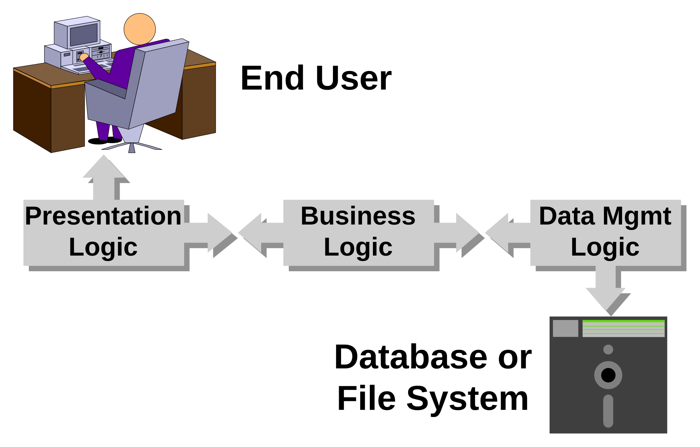
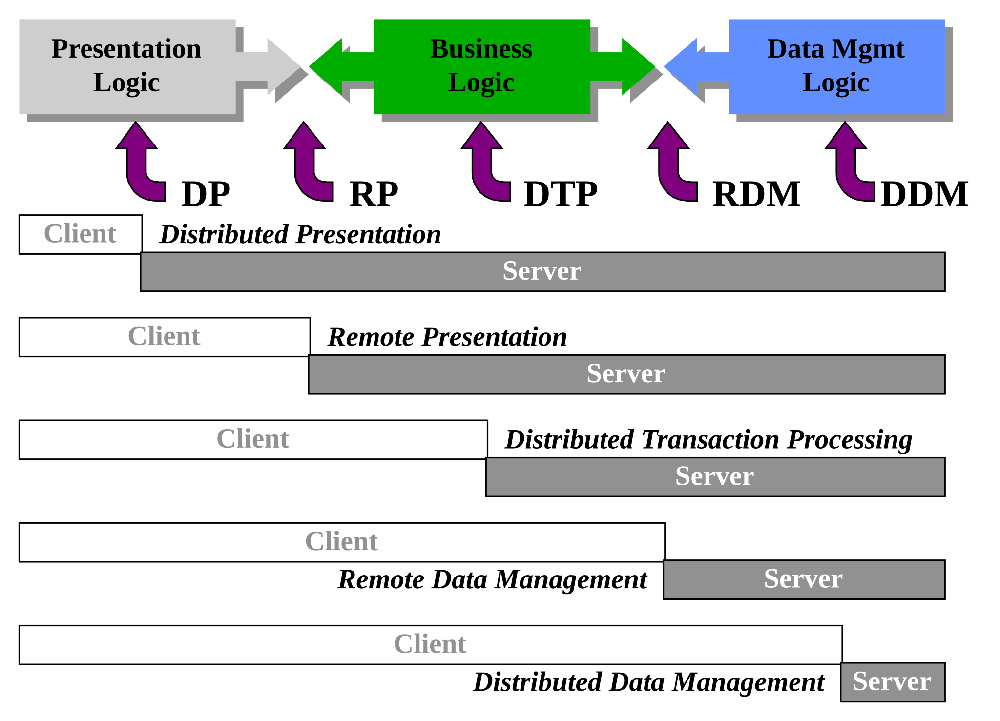

_This is the paper I gave at AUUG'94, the Australian UNIX Users Group conference, held from the 7th to the 9th of September 1994 at the World Congress Centre in Melbourne. The deck records my slot exactly, Day 3 and Session M13 at 2 PM, which puts the talk on the Friday afternoon. I was an Architecture Consultant at [AT&T Global Information Solutions](/spotlite/work/ncr/) then. I revised the paper for Oracle OpenWorld '94, and that version is [also on this site](/spotlite/article/openworld-1994/). The two agree closely, so this article marks the places where the Oracle revision said something different._

_The revision renamed section 3 from "Client/Server Enabling Technologies" to "Client/Server Mechanisms", expanded the discussion of SQL, updated the database networking product names in section 4.4.2, added examples to the gateways entry, added one reference, and rewrote the closing biography. It also corrected three grammatical slips that stand here as given: "client/server technology have been described", "the increasing need ... have promoted", and "the primary disadvantages ... is". It runs the other way once: the back-end command list in section 4.2 is marked up correctly here and was broken in the revision._

_Set from the Word manuscript rather than only from my later HTML export, and the two are worth separating. Compared as continuous text the export is faithful to 99.7%, and the whole of the difference is one word: the export dropped `telnet` from the list of Berkeley front-ends in section 4.2, leaving `ftp` and `rlogin`. It is restored here. The Oracle revision therefore did not add `telnet`, as I had it before reading the manuscript; the word was in the paper as delivered and only the export lost it._

_Two further faults in that export are repaired. Two consecutive sections were both numbered 1.2, and the first is the paper's 1.1 — the manuscript numbers its headings with an `AUTONUM` field, so it carries no literal numbers at all and the wrong ones were introduced in the conversion. Figure 1's caption lost its italics because the emphasis opened outside the paragraph holding the image and closed after it, where the other three captions sit inside. Figure 2's caption is missing its colon, as printed. The closing contact block is dropped, being a 1994 office address, phone, fax and email at a company that has not carried that name in thirty years. The words are otherwise as given._

_All four figures are vector again, in place of the 480-pixel GIFs the HTML export used, but they come from two different places and it is worth saying which. Figures 1 to 3 are embedded PowerPoint objects in the manuscript, and Word kept a metafile of each so it could draw them without opening PowerPoint; those metafiles convert straight into the drawings below. Their colours differ a little from the GIFs, which were made later from a revised set of slides, so the greens and blues here are the ones the paper was submitted with._

_Figure 4 is not an embedded object, and for a while I believed that meant it had no metafile either, so the version published here first came from slide 24 of the conference deck and needed three corrections to match the paper. That was wrong. Word cached this figure too, as a pasted picture rather than an embedded object, and it converts cleanly once the converter knows to turn it the right way up: the metafile gives its vertical extent as a negative number, so anything reading that literally draws the whole diagram mirrored top to bottom. Figure 4 now comes from the manuscript like the others, needs no corrections at all, and carries the labels in full where both the deck and the 1998 GIF abbreviate them to "Other Dist Svcs" and "Other Core Svcs"._

_The conference deck survives alongside it, 42 slides with the speaker notes still in them, last saved on the Monday before the conference. Its slides are in the presentation's own pink and purple, not the greys and greens of the printed figures._

Chris Tham _AT&T Global Information Solutions_

## Abstract

This paper gives an overview of the different ways of designing and implementing client/server architectures on open systems using de jure and de facto standards. It presents brief examples of client/server architectures that the author has encountered. It is not intended to be an exhaustive survey of the diversity of such architectures, whether in research or in industry. The paper also introduces the concept of transaction processing, and how it can be implemented on a client/server model. Finally, the paper describes an example of a client/server architecture incorporating several of the models outlined in this paper including distributed transaction processing.

## 1 Introduction

The use of the term "_client/server_" has become as pervasive as a number of other Information Technology buzzwords that are supposed to cure whatever it is that ails organisations around the world: _downsizing/rightsizing_, _object-oriented_, _graphical user interface_, _rapid application development_, _visual prototyping_, etc.

It has been used to help sell hardware and software products in the same way that "_biodegradable_" is used to sell laundry detergents: one can almost imagine it on an evaluation checklist as part of a purchasing decision!

But what does the term actually mean? Or, for that matter, what exactly is a "_distributed client/server architecture_?" As is usual with many overly-hyped phrases, client/server technology have been described by so many sources in so many ways.

This paper attempts to relate the definition of client/server within the wider context of distributed co-operative processing and enterprise computing architectures. It discusses the factors encouraging the distribution of applications and enabling technologies.

A tour through different client/server models is presented, along with examples of several research and commercial client/server architectures employing these models and using open systems standards and technologies. This paper is not intended to be an exhaustive survey: for that a book would be necessary and the reader is guided towards the ones mentioned in the _References_ section at the end of this paper.

Finally, an example of a distributed architecture using a hybrid approach (combining several client/server models within the architecture) is presented.

### 1.1 The Big Picture

A _computing architecture_ is a set of definitions, rules and terms that are used to construct a computing environment, possibly consisting of multiple hardware units and software packages. The architecture provides a _framework_ for developing applications and ensures that they communicate and inter-operate with each other. The framework includes definitions of layers for specifying computing services, the standards that govern the use of those services, and the protocols for communication between layers.

An _enterprise computing architecture_ tries to integrate information at all organisational levels to provide centralised control of information but decentralised access to information from multiple end-points. Depending on the organisation structure of the enterprise, enterprise computing architectures tend to be based on three forms of data access and processing:

1. _centralised_ - where all data access and processing are located and performed at a single central site (e.g., a traditional mainframe "glasshouse")
1. _replicated_ - where the information system is copied at each division or location requiring access to data (e.g., stand alone Personal Computers)
1. _distributed_ - where data access and processing are spread across a number of sites inter-connected to each other within a single logical network.

The goal of a distributed enterprise computing architecture is to provide _seamless integration_ of possibly heterogeneous systems:

- through a common means of accessing data
- from a network of computers,
- without knowing where the data is located (_location transparency_),
- from any end-point (_location independence_),
- integrated according to the user's needs,
- and without restructuring existing databases or
- reimplementing existing applications.

Enablers of seamless integration include the development of

- connectivity solutions, communication protocols and open systems standards for wide-area networking,
- the emergence of powerful desktop computers and graphical user interfaces with collaborative services supporting information sharing and linking, and
- workgroup computing environments and client/server models based on high speed local area networks.

However, there are significant cultural and technical barriers to seamless integration which result in trade-offs when designing an enterprise computing architecture. These barriers include the changing nature of business, behavioural resistance, immature technology, ill-defined standards, etc.

A _computing model_ is a representation of a generalised style of computing that can be used as a basis for designing computing architectures.

This paper discusses _client/server computing models_ used to implement _distributed computing architectures_ based on _open systems standards_.

It is important to note that distributed computing is not synonymous with the concept of open systems; the IBM SNA hierarchical network is an example of a very successful distributed computing architecture. However, a distributed client/server architecture based on open systems may realise the promises of open systems and adoption of standards: transparent program and data distribution and networking, inter-operability, and portability.

### 1.2 Client/Server and Peer-to-Peer Processing

The _client/server computing model_ was initially used to describe the co-operative processing interaction between two programs (on the same machine): an application (called the _client_) requesting information, and a supporting service (called the _server_) that processes the request and returns the information to the client.

This model was then extended to the concept of software/hardware components providing services or managing resources on behalf of other components across a network.

The natural extension of the client/server computing model is _peer-to-peer processing_, where computing resources can act as both clients and servers in a symbiotic and synergistic relationship with each other. The workload for any particular service can be distributed amongst available servers across the network.

The "ideal" is _distributed co-operative processing_ and _transparent access to resources_ where portions of applications run on different computers and data may be at various installations.

Client/server and peer-to-peer processing are instances of what the ACM Taskforce on the Core of Computer Science refer to as "models for distributed computation.".

The generalised concept, _distributed processing_ or _distributed computing_, is defined by the ISO CCITT _Open Distributed Processing_ (X.90x) draft as _"that class of information processing activities in which discrete components may be located at more than one location, or where there is any reason which necessitates explicit communications among the components."_

A _distributed computing environment_ based on open system standards may be hosted on _multi-protocol networks_ and _heterogeneous computing platforms_.

A pure distributed environment would consist of collections of general-purpose systems with equal capabilities. By contrast, typical distributed client/server architectures usually specify _specialised client and server hardware components_ within a networking environment. This is done in order to achieve the full benefits from co-operative processing and to achieve high performance and inter-operability.

This has encouraged the wide-spread use of the terms _client_ and _server_ to refer to hardware components, i.e. different types of computers on a network.

### 1.3 Why Distributed Client/Server?

What factors are responsible for the evolution of the client/server architecture into distributed co-operative processing? After all, it can be argued that a distributed environment is more complex and difficult to implement, as well as posing significant challenges in terms of management, security, performance measurement and capacity planning.

There are _two opposing forces_ which tend to break up applications into multiple _application components_ and distribute these components across multiple systems: one encourages the migration of components closer to end users, and the other encourages the migration of components to centralised systems.

_Figure 1: The forces separating application components over a network across machines_

Other reasons for distributing application components include:

- the possibility of _migrating into open systems_ and gain _vendor-independence_,
- the possibility of _taking advantage of multiple processors_ in a network through _parallel computing_,
- the possibility of _increasing the availability_ of the total system by distributing workload across _replicated services_, and
- the possibility of _increasing the reliability_ of the system by _storing data redundantly_ across multiple systems and implementing various fallback stages of operation.

#### 1.3.1 Moving processing closer to end users

The _evolution of intelligent personal workstations_ (i.e., personal computers as well as UNIX workstations) has caused a trend towards large numbers of inexpensive but powerful processors connected by high speed networks. The tremendous growth in the sheer computing power within each workstation has encouraged the _migration of application functionality closer towards end users_ for price/performance reasons.

This is abetted by the availability of _graphical user interfaces_ on workstations which support multiple, concurrent windows and allow users to manage higher volumes of information. Finally, enterprises are becoming flatter, more decentralised and loosely-coupled - which also encourages the _down-sizing_ of business processing closer to users.

#### 1.3.2 Centralising functionality and data

On the other hand, the increasing need for end users to access data collected from various sections of the enterprise or even across enterprises in a unified and integrated fashion have promoted the _centralisation of strategic business logic_ on large systems and have pushed the conglomeration of data into centralised repositories (sometimes called _Information Warehouses_).

End users want to access information from multiple sources using multiple delivery channels:

- in a _location transparent_ manner (users don't want to know where and how the data is stored in order to access it) as well as
- in a _location independent_ fashion (users want to access the same set of information from any location or system).

### 1.4 Client/Server Advantages and Disadvantages

There are many advantages of utilising a client/server computing model. The following are some examples:

- It allows organisations to leverage the computing power of desktop computers.
- It facilitates the use of graphical user interfaces accessing enterprise-wide information.
- It provides the facilities for optimal network utilisation (by migrating processing closer to the source of data).
- It provides an abstraction layer on underlying operating systems and communication systems, hence allowing for and encouraging the acceptance of open systems.
- It allows the computing resources (both data and applications) of an organisation to be shared effectively amongst users.
- It allows computing power and functionality to easily grow (scalability).

On the negative side, client/server architectures are still evolving and some products are relatively immature. Client/server development requires a strong systems development and life cycle methodology.

The primary disadvantages of a client/server architecture is the perceived (and real) complexity, and there are significant operational issues (How does one manage a distributed environment successfully?), security, costs, etc.

## 2 Application components

A typical application has three basic components:

1. _Presentation_ or _User Interface_ logic This is the part of the application that interacts with the user.
1. _Business_ logic This is the part of the application that processes business tasks and manipulates data within the application.
1. _Data Management_ logic This is the part of the application that stores and retrieves data into and from permanent storage (on a file system or on a database management system).

_Figure 2 Application components_

The separation of application logic into these components is not always straight-forward and the boundaries between the components are not always clearly defined.

Client/server architectures employ distributed co-operative processing to:

- distribute application components between clients and servers, and
- support cohesive interactions between clients and servers in a co-operative fashion.

Distribution can be done to software components as well as hardware components but the major advantages of distribution (transparency, inter-operability, portability, availability and scalability) are mostly realised by distribution across hardware components.

## 3 Client/Server Enabling Technologies

A distributed client/server architecture needs to specify a mechanism for handling client/server interactions. The mechanism provides facilities for developing networked applications distributed across heterogeneous networking and operating systems. Client/server mechanisms consist of:

- an Application Programming Interface (API) for developing distributed applications,
- a communications layer between application components across a network, and
- a directory service that maintains a record of machines on the network, their network interfaces, and the application components running on each machine, so that clients know where and how to direct service requests.

Fundamental core technologies used for implementing client/server mechanisms include:

- _Remote Procedure Calls_ (RPC)
- _Message Passing_ (also called _Message Queuing_)
- _Object Request Brokers_ (ORB)
- _Structured Query Language_ (SQL)

### 3.1 Remote Procedure Calls

RPCs allow programs to execute a set of instructions on a remote machine through what appears to be a local procedure call, and then wait for a response. The RPC code assembles the parameters of the procedure call and sends it across a network. The caller program and called procedure are tightly coupled: changing the procedure definition involves changing both ends.

As the client waits until it gets a response, network performance is critical to response time and a high speed LAN environment with sufficient bandwidth is required. RPCs are usually poor at handling exception conditions (such as when a network node is unavailable or unreachable).

RPCs are widely used as the underlying transport mechanism in many commercially available distributed computing products. Many distributed operating systems (e.g. _Amoeba_, _Sprite_, etc.) use RPC for kernel-to-kernel communication. Others, including the _Stanford V System_, _Chorus_, _Mach_ (which is used as a model for the development of Microsoft _Windows NT_ as well as Taligent _Workplace OS_) rely on message passing mechanisms (see below).

### 3.2 Message Passing

Message passing involves the use of messages between programs to exchange data either synchronously, asynchronously, or within the context of a conversation. It is useful for connecting loosely-coupled or autonomous application components.

Message passing techniques employ queues or buffers to log or hold messages on their way to destinations, and may support delivery acknowledgment, priority handling and content translation of messages. A message passing API is usually fairly simple: it consists of commands to establish and terminate conversations between clients and servers, message sending and receiving commands, and error handling.

Message passing bypasses the network-dependent, time-delay characteristics or RPCs and can guarantee message delivery in the event of network failure or an inoperable server.

Message passing are not as widely implemented as RPCs (read: less mature).

### 3.3 Object Request Brokers

The most recent technology used to implement client/server processing is heavily dependent on object-orientation: Object Request Brokers act as an intermediary between objects distributed across a network and allows these objects to exchange messages. ORBs are still fairly immature and usually rely on more mature technologies (such as RPCs) as underlying transport mechanisms.

The Object Management Group (OMG) is currently developing standards for ORBs under the umbrella of the _Common Object Request Broker Architecture_ (CORBA).

### 3.4 Structured Query Language

Strictly speaking, SQL is not a client/server mechanism but a database access language. However, many relational database management vendors have heavily promoted the use of SQL as a distributed application development language. Examples include _Oracle SQL\*Net_ and _Oracle Glue_, _Infomix Net_ and _Star_, _Sybase OmniSQL Gateway_, etc.

> [!NOTE] The Oracle version replaces the sentence above with three paragraphs naming the development tools of the day (Oracle CDE and Glue, Informix 4GL, HyperScript and NewEra, Ingres Vision and Open Road, Progress, Sybase APT) and the remote access technologies beneath them (ODBC, IDAPI, SQL\*Net, Informix-Star, Ingres/Star). It also adds a closing paragraph calling SQL across a network the most widely implemented client/server mechanism in commercial systems, and points at stored procedures and PL/SQL as the direction vendors were taking it.

A client interacts with the server via a distributed SQL interface: i.e. SQL requests are executed on a remote database server. Hence, client/server interactions are limited to database operations. However, this simplifies the programming model and reduces the learning curve for programmers.

## 4 Client/Server Models

The questions that every client/server system designer asks are: _what_ application components to distribute, _when_ to distribute, and _how_ to distribute. There is no universal recipe that works in all situations, and therefore different needs have resulted in several possible styles of co-operative processing between various distributed components.

The following models for designing distributed client/server architectures can be defined:

- _Distributed Presentation_ (DP)
- _Remote Presentation_ (RP)
- _Distributed Transaction Processing_ (DTP)
- _Remote Data Management_ (RDM)
- _Distributed Data Management_ (DDM)

The following figure shows how each model distribute application components across client and server network nodes:

_Figure 3: Client/server distribution models_

### 4.1 Distributed Presentation (DP)

In the DP model, presentation functions are distributed across two or more network nodes. Typically, a portion of the presentation logic (usually the graphical user interface, which has compute-intensive, event-driven requirements) resides on a specialised client workstation, whilst the remainder of the application is located on other nodes.

The canonical example of a client/server architecture employing the DP model is the _X Window System_. Somewhat confusingly, the X Window System model reverses the usual definition of _client_ and _server_: The X Window server manages the display screen(s) and control of user input devices (i.e. the keyboard and mouse) and X Window clients are applications (distributed across the network) that the user wishes to interact with. X Window clients communicate to servers using the X Window protocol, which typically runs over TCP/IP.

### 4.2 Remote Presentation (RP)

Presentation functions are said to be remote (from the business logic component) when the entire presentation logic of the application resides on one network node whilst the remainder of the application resides on other nodes. This helps insulate business processing logic from deciding how data is to be displayed, and allows multiple user interfaces to use a common application source stream.

Many Berkeley networking utilities are written using a front-end vs back-end architecture. The front-end (e.g. `ftp`, `telnet`, `rlogin`) handles the presentation component and the back-end (`ftpd`, `telnetd`, `rlogind`) runs on a different network node.

Other UNIX applications written using Berkeley sockets typically follow this model, but some extend it. Two interesting examples are the multi-user game `xtrek` and the Mandelbrot generation and display program `xmandel`.

`Xtrek` has a front end responsible for presentation functions and a back-end (shared between players) responsible for co-ordinating the player against other players and computer generated players. The `xmandel` program distributes the calculation and generation of portions of a Mandelbrot fractal image across to multiple network nodes, but only the front-end is responsible for displaying the fractal image on an X Window display.

Both `xtrek` and `xmandel` are of course X Window applications, hence employ a client/server architecture that is based on a mixture of both the DP and RP models.

A somewhat complex example of the RP model in a commercial client/server implementation would be an _Oracle SQL\*Forms_ application (running on a UNIX workstation or Personal Computer) communicating with the _Oracle RDBMS_ (running on a UNIX or VMS server) with business logic coded as stored procedures.

It is interesting to note that the logical extension of the RP model is the use of client access programs to access global information from many sources. The development of tools to browse, retrieve, and discover Internet resources is a prime example: starting with USENET news readers and `finger` to resource discovery systems such as WHOIS, `archie`, _World Wide Web_ (WWW), _Wide Area Information Servers_ (WAIS) and the _Internet Gopher_.

### 4.3 Distributed Transaction Processing (DTP)

Distributing business logic across several computers can potentially realise the full benefits of using the distributed co-operative processing model: parallel processing, higher application availability through workload distribution and replication, and increased scalability. The DTP model is also the most difficult and complex model to implement as well as manage, since it requires a sophisticated underlying program-to-program communications mechanism, as well as features such as data integrity, availability, load balancing, and scalability.

Simple application distribution architectures can be constructed using a front-end/back-end split and many UNIX applications utilising Berkeley sockets are written this way, as well as early implementations of many relational databases on UNIX.

However, a generalised application distribution model is closely related to the notion of _transactions_ and _transaction management_, which is why the model is called _Distributed Transaction Processing_.

The DTP approach focuses on designing application and business logic in terms of modular, well-defined functional chunks and then distributing them across several machines.

#### 4.3.1 The OSF Distributed Computing Environment (DCE)

The great white hope of a vendor-neutral platform for supporting the DTP model is the Open Software Foundation's _Distributed Computing Environment_ (DCE). DCE is organised as a set of services to enable the design and implementation of client/server systems where application components are distributed across a network. DCE include the following components to facilitate distributed programming:

- _Remote Procedure Call API_ (based on Apollo's _Network Computing System_, now part of Hewlett-Packard)
- _Threads API_ (based on POSIX _pthreads_)
- _Directory Services_ (comprising of a cell directory service, a global directory service and a global directory agent, based on CCITT X.500/ISO 9594 but can interoperate with the _Internet Domain Naming Service_)
- _Security Services_ (based on MIT _Kerberos_ Version 5)
- _Distributed Time Service_ (based on a DEC defined protocol)
- _Distributed File Service_ (based on the _DECorum File System_, which is in turned based on the _Andrew File System_ or AFS)
- _Local File Service_ (based on Transarc Episode)

_Figure 4: DCE Architecture_

DCE provides a very comprehensive set of services to enable distributed client/server architectures based on the DTP model to be built. However, DCE does not really provide transaction management features (although Transarc _Encina_ layers transaction management facilities on top of DCE).

#### 4.3.2 Transaction Processing Basics

Transaction processing is based on the idea that a stream of requests can be executed as discrete units of work. Each logical unit of work, or _transaction_, has a definite beginning and end and takes a computing system from one consistent state to another.

A transaction is considered transient until the decision is made to either successfully complete (_commit_) the work performed within the transaction, or abort (_rollback_) the work. The work of a transaction may be "rolled back" anytime before the commit occurs. Once the commit is processed, the work of the transaction is considered permanent.

There are four basic properties of a transaction:

- _Atomicity_ implies that work done for a transaction is either all committed or non is (all or nothing).
- _Consistency_ requires that the transaction either create a new and valid state of the affected resources, or if the transaction aborts, return the resources to its previous state before the transaction began.
- _Isolation_ means that while a transaction is in progress, its work must be kept separate and isolated from other transactions being processed.
- _Durability_ involves the ability of the system to ensure that the effects of a transaction are not adversely affected by a failure.

These four properties are collectively known as the _ACID_ properties. Supporting these properties requires recovery and concurrency mechanisms, typically implemented by a _transaction processing management system_, sometimes called a _transaction processing monitor_. These systems typically provide tools for developing transaction processing systems, an execution environment for transaction management, and administrative support for configuring transaction processing systems.

#### 4.3.3 Distributed Transaction Processing Monitors

Historically, transaction processing systems were based on the notion of a large central site to which all transaction requests were routed (e.g. the IBM _Customer Information Control System_ or CICS for IBM mainframe transaction processing).

As distributed client/server architectures become prominent, the notion of _distributed transaction processing_ was introduced. A _distributed transaction_ (sometimes called a _global transaction_) require the same ACID properties but the work performed by the transaction may span multiple network nodes. The use of _two-phase commit_ procedures, first introduced within the context of distributed databases, is critical for supporting data integrity, recovery and consistency.

In the two phase commit protocol, all participants responsible for updating data within the context of a transaction negotiate with a co-ordinator. Participants attempt to reach a common understanding with respect to committing or aborting data changes in the first phase, and then implement this decision in the second phase.

Distributed transaction processing monitors use client/server technologies to provide an environment for transaction management across a distributed computing environment, and hence allow designers to implement an architecture based on the client/server DTP model. These monitors also provide additional services, including client/server authorisation and authentication, distributed load balancing and scheduling, service replication, and links to resource managers (typically, relational databases but can be any subsystem managing resources) and other transaction management systems.

Examples of open systems based DTP monitors include:

- Novell/USL _Tuxedo System_ (one of the earliest attempts at providing transaction management capabilities on open systems),
- AT&T _TOP END_ (based on the _X/Open Distributed Transaction Processing_ model and a successor to the NCR _MultiTRAN_ OLTP monitor),
- Transarc _Encina_ (which layers transaction management facilities on top of OSF/DCE), and
- IBM _CICS/6000_ (which is based on _Encina_ but retains compatibility and inter-operability with the _CICS_ family of transaction monitors).

Both _Tuxedo_ and _TOP END_ rely on message passing facilities using the UNIX System V _Transport Layer Interface_ (TLI) for client/server communications. _Encina_ and _CICS/6000_ relies on OSF/DCE RPC and in addition takes advantage of other DCE services, including threads, security and directory services.

### 4.4 Remote Data Management (RDM)

In the RDM model, the application component executes business logic on one computer, but data is accessed and modified at a _single_ remote location on the network. Essentially, an RDM environment consists of many clients accessing a single location of storage for data, so the data itself is not distributed.

A simple way to achieve this on a Personal Computer is by using the file sharing services provided by a Network Operating System (NOS). Although the application runs wholly on a single machine (the Personal Computer), data is stored on another machine (the file server). Another approach is to standardise on a data query/manipulation language (such as SQL) and writing applications that send data access commands over the network to remote backend database servers.

Sometimes the database also incorporates stored procedures (proprietary extensions to SQL to provide procedural capabilities). This allows some application or business functionality to be distributed onto the servers as well (resulting in a hybrid DTP-RDM model).

The chief strengths of the RDM model are: wide support for application development in terms of tools available (most "client/server" products available today utilise the RDM model), and the simplicity of the model. However, the full benefits of client/server distribution are not realised, and the large amounts of data being passed over the network for processing may inhibit the applicability of this model on "bandwidth-challenged" networks.

#### 4.4.1 Shared File Systems

Most personal computer based Local Area Networks are characterised by using a specialised and dedicated server node to provide file and print sharing services to desktop computers. In essence, each client desktop views the server(s) as a peripheral with multiple file systems (these file systems are called network drives, mapped drives or share names depending on the LAN operating system) and printers contained within it. Examples include _AppleTalk_, Novell _NetWare_, Microsoft _LAN Manager_, Banyan _Vines_, etc.

Most file sharing services use some kind of RPC mechanism (usually proprietary) or protocol for remote access. For example, Novell Netware uses the _NetWare Core Protocol_ (NCP) which runs on top of IPX/SPX, _LAN Manager_ uses _Server Message Blocks_ (SMB) on top of NetBIOS.

Recently, there has been a trend to extend the functionality of LAN file sharing services from a remote file system model to a distributed file system model. Examples include Novell _NetWare 4.0_, Microsoft _NT Advanced Server_, and the growing emergence of peer-to-peer file sharing services (_Artisoft LANtastic_, Novell _Personal NetWare_, Microsoft _Windows for Workgroups_, etc.). There has also been attempts to extend the functionality of LAN operating systems to include remote data management as well as remote file management (i.e. Microsoft _SQL Server_, Novell _NetWare Loadable Modules_ etc.).

#### 4.4.2 Remote Database Servers

Many database management system vendors support the RDM model through the use of _Structured Query Language_ (SQL) as the client/server interaction protocol, which is relatively easy to implement. An application component deals with a single source of data and sends SQL across a network. Examples include _Oracle SQL\*Net_, _Informix INET, Ingres Net_ and the _Sybase DB-Library_. Applications that access these databases tend to be fourth generation languages (4GLs) or forms designing tools, sometimes supplied by the database vendors themselves but also through third parties (e.g. _PowerBuilder_).

### 4.5 Distributed Data Management (DDM)

The DDM model is constrasted from the RDM model by the distribution of data over several nodes in a network. The goal is to implement a single logical data store from multiple heterogeneous data sources. Two common ways of implementing a DDM model are by using a _distributed file system_ or a _distributed database management system_.

#### 4.5.1 Distributed File Systems

The most widely implemented method of distributing data across several machines but maintaining a single logical data store is by using a distributed file system.

Most distributed file systems use some kind of RPC mechanism (usually proprietary) or protocol for remote access. The de facto UNIX distributed file system is Sun's _Network File System_ (NFS), which is defined in terms of a freely-available RPC specification relying on an external data definition protocol called XDR.

Other distributed file systems in the UNIX environment also define their own RPC access mechanisms, for example _LOCUS_ (parts of which is incorporated in IBM _AIX_ and provides remote access at the disk block level), _Spritely NFS_ (which tries to combine the best features of both _Sprite_ and _NFS_), the _Andrew File System_ or _AFS_ (which has been extended to become OSF/DCE DFS and uses DCE RPC), and _RFS_ (using a "remote system call" interface).

Distributed file systems which are hosted on a distributed operating system tend to use the underlying operating system IPC mechanisms, e.g. _Sprite_ (which uses kernel-to-kernel RPC), _Plan 9_ (which uses a message passing protocol called 9P), etc.

Some distributed file systems also allow applications to access remote devices and non-file objects (including IPC mechanisms) as part of the distributed file system services, provided these devices and objects can be represented as files in the file system name space. For example, one of the design goals of _Plan 9_ was to eliminate special case operations by treating nearly all operating system resources as files.

Recently, researchers have begun designing experimental distributed file systems that span across large geographic areas and organisational boundaries. For example, the _Prospero File System_ supports customised views of a global file system consisting of files available from the Internet through NFS, AFS, FTP, plus documents available from WAIS and Gopher.

#### 4.5.2 Distributed Database Management Systems

A database management system is organised around a data model which is ideally independent of any particular application. A distributed database implies that data from more than one site can be accessed within an application. This can be achieved in several different ways:

1. _Database independent programming languages_ The application component serially accesses different sources of data in a non-transparent manner, and then presents the illusion of a single database to the user via the presentation component. In order for this to be achieved, the application component must be written in a language that can support accessing multiple databases using different access methods. Many database independent 4GLs work this way, by providing drivers to popular database engines and flat file record managers.
1. _Database Middleware_ The application component communicates to a middle translation or gateway layer (usually and appropriately termed _"middleware"_) that isolates the individual access methods and protocols used to communicate to each data source and provides a uniform way to communicate to multiple data sources to the application component. This is the strategy underlying the efforts by the SQL Access Group of developing a standard _Call Level Interface_ (CLI) for submitting SQL statements to an RDBMS (as well as the ISO _Remote Database Access_ (RDA) protocol for OSI environments), and vendor developed solutions based on the SAG CLI (such as Microsoft ODBC and Borland IDAPI).
1. _Database Gateways_ The application component accesses a single database which then provides a logical view of multiple data sources by implementing gateways into each data source. Many of the leading database vendors provide gateways to IBM DB/2 and to each other.
1. _Distributed Databases employing Two Phase Commit_ The application component accesses multiple databases using a common access protocol, but views the databases as a single logical database. When updating data across multiple databases, the two-phase commit protocol is used to ensure the integrity of data. The major database vendors are beginning to support externalised two-phase commit protocols (such as the X/Open DTP XA interface) and some have also implemented the two-phase protocol internally in a transparent manner. Distributed databases usually distribute data entities across multiple locations. Distribution of a single data entity (i.e. a relational table) across multiple locations (vertical or horizontal fragmentation) is exceedingly complicated and rarely implemented.
1. _Replicated Databases_ Two phase commit is an expensive operation and is very sensitive to network response time and node availability. Some database vendors are also exploring the alternative of providing mechanisms to replicate data across databases. Replicated Databases can be implemented in several ways: by the user or application _manually extracting_ data from multiple databases and copying it from location to location; by the database system itself taking _snapshot copies_ of data or subsets of data and automatically or manually refreshing those snapshots at periodic intervals; and by the database system actively creating _replicas_ of data and maintaining data consistency between replicas either synchronously or asynchronously.

> [!NOTE] The Oracle version ends the _Database Gateways_ entry above with examples: Oracle SQL\*Connect, Informix-Gateway and Sybase OmniSQL Gateway.

## 5 Combining Models: Tying it all Together

It is of course quite possible to design a distributed client/server architecture that combines several models into a hybrid model. The following is a brief description of an actual enterprise computing architecture based on open systems that incorporates multiple client/server models.

The design of the architecture revolves around the need to provide end users with graphical user interfaces, but at the same time preserve the investment in existing mainframe legacy applications (which are character based). The goal of the architecture was to surround or encapsulate the business logic embedded in these legacy applications within a distributed transaction processing framework. Over time, the business logic can then be migrated across the distributed environment into different hardware and operating system platforms. New applications would be implemented directly within the distributed framework.

The distributed processing environment consists of four logical components:

1. Users access the system through personal computers running Microsoft Windows, connected into Local Area Networks (LANs). There are multiple LANs, as the enterprise is geographically dispersed.
1. Each LAN is controlled and serviced by a UNIX server, which act as a gateway between the LANs and a Wide Area Network (WAN) spanning the enterprise.
1. The legacy applications run on a centralised site on multiple mainframe hosts with incompatible operating systems. Each application had a different user interface, which used to confuse the users, who had to deal with multiple terminals on their desks.
1. At the central computing site, UNIX machines acted as a gateways between the WAN and the mainframe hosts and translated calls from the business logic framework into host application sessions.

The personal computers run office productivity applications (including word processors, spreadsheet software, electronic mail, etc.) which are located on the UNIX LAN server, which provided file and print sharing services (using the LAN Manager protocol) to the LAN (an example of the RDM model in action). The LAN server also runs a Relational DataBase Management System (RDBMS) which can be accessed from the personal computers using Microsoft ODBC (another example of the RDM model).

Users execute core business functionality (ultimately processed by a legacy mainframe application) by accessing a Windows application that contained mostly presentation logic (a hybrid RP-DP model). The application and data management logic are distributed and managed by a distributed transaction processor (using the DTP model).

The distributed transaction processor provides the strategic business logic encapsulation: new application functionality will be implemented as transaction processing services using the client/server computing model.

Since each UNIX server runs an RDBMS, the transaction processor also helps in managing data integrity by using the two-phase commit protocol between databases (an example of the DDM model). UNIX servers of course can also share files using NFS (another example of the DDM model).

The UNIX machines acting as gateways into the host applications use a variety of means to do so: via transaction processor gateways (DTP model), database gateways (DDM model), and by emulating user login sessions (RP model).

As can be seen by the above brief description, it is possible to mix and match client/server computing models as well as different standards and technologies to create a viable distributed computing environment based on products available today from multiple vendors.

## References

1. Pamela M. Paul and Mary Ann Richardson: _Client/Server Middleware: Solutions for Integration_, Datapro Computer Systems Analyst (June 1994) 1011CSO
1. Michael Panesis and Ralph Rivera: _Enterprise Computing Architectures_, Datapro Computer Systems Analyst (May 1994) 1155WDD
1. Brent Welch: _A Comparison of Three Distributed File System Architectures: Vnode, Sprite and Plan 9_, Computing Systems Vol 7 No 2 (Spring 1994) pp. 175-199
1. Dennis Byron: _Understanding Distributed Computing_, Datapro Computer Systems Analyst (March 1994) 1130WSL
1. Dennis Byron: _Strategies for Seamless Integration_, Datapro Computer Systems Analyst (March 1994) 1520WSL
1. Mary Ann Richardson: _Transaction Monitors in Distributed Processing_, Datapro Computer Systems Analyst (February 1994) 1515WDD
1. H. Brown and Associates: OLTP: Comparing CICS/6000, Encina, TOP END & Tuxedo, /AIXtra January/February 1994) pp. 8-12
1. Dennis Byron: _Sharing and Linking Information: The Enterprise Level_, Datapro Computer Systems Analyst (January 1994) 1160WSL
1. Raman Khanna, editor: _Distributed Computing: Implementation and Management Strategies_, PTR Prentice Hall (1994)
1. David Evancha: _Implementing Workgroup Computing_, Datapro Computer Systems Analyst (October 1993) 1145WSL
1. Pamela M. Paul: _Solving the Client/Server Puzzle_, Datapro Computer Systems Analyst (September 1993) 1510WDD
1. Michael Guttman and Jason Matthews: _Sharing and Linking Information: The Desktop Level_, Datapro Computer Systems Analyst (April 1993) 1150WSL
1. Clifford Neuman: _The Prospero File System: A Global File System Based on the Virtual File System Model_, Computing Systems Vol 5 No 4 (Fall 1992) pp. 407-432
1. Michael F Schwartz, Alan Emtage, Brewster Kahle and B. Clifford Neuman: _A Comparison of Internet Resource Discovery Approaches_, Computing Systems Vol 5 No 4 (Fall 1992) pp. 461-493
1. Stan Natanson: _Implementing an Information Resources Policy_, Datapro Computer Systems Analyst (July 1992) 1570WDD
1. Alex Berson: _Client/Server Architecture_, Mc-Graw Hill, Inc. (1992)
1. Fred Douglis, John K. Ousterhout, M. Frans Kaashoek and Andrew S. Tanenbaum: _A Comparison of Two Distributed Operating Systems: Amoeba and Sprite_, Computing Systems Vol 4 No 4 (Fall 1991) pp. 353-384
1. Michael Wayne Young, Dean S. Thompson and Elliot Jaffe: _A Modular Architecture for Distributed Transaction Processing_, Proceedings of the Winter 1991 USENIX Conference, USENIX Association (January 1991) pp. 357-363
1. Michael L. Kazar, Bruce W. Leverett, Owen T. Anderson, Vasilis Apostolides, Beth A. Bottos, Sailesh Chutani, Craig F. Everhart, W. Anthony Mason, Shu-Tsui Tu and Edward R. Zayas: _DEcorum File System Architectural Overview_, Proceedings of the Summer 1990 USENIX Conference, USENIX Association (June 1990) pp. 151-163

> [!NOTE] The Oracle version adds a reference to Judith R. Davis on UNIX relational database management, and closes the biography with a paragraph on my history with the Oracle product set instead of the AUUG'93 session mentioned below.

## The Author

Chris Tham graduated from the University of Sydney in 1988 with a University Medal and a B.Sc.(Hons 1st. Class) in Computer Science, and again in 1994 from Macquarie University with a Master of Applied Finance. Chris has been involved for a number of years in developing applications on the UNIX operating system for a variety of employers, mainly in the finance industry.

Chris Tham is currently employed as an Architecture Consultant, Professional Services at AT&T Global Information Solutions. Chris specialises in enterprise architecture and planning, and designing overall solutions aimed at meeting the business objectives of AT&T customers. Chris gave a Work-in-Progress session on Performance Tuning of Relational Database Applications in AUUG'93.
