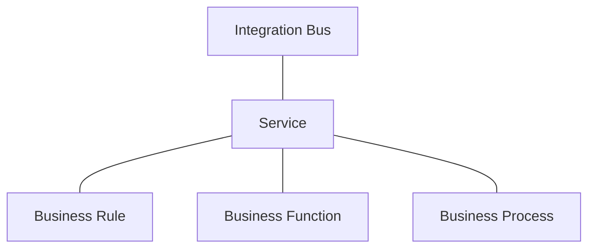
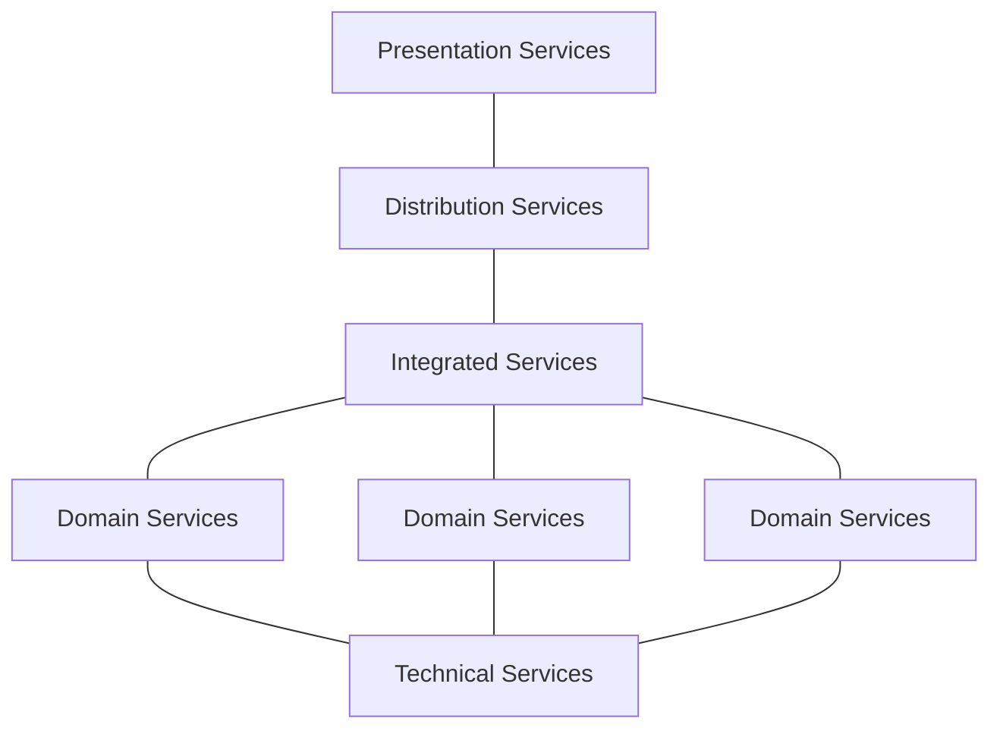
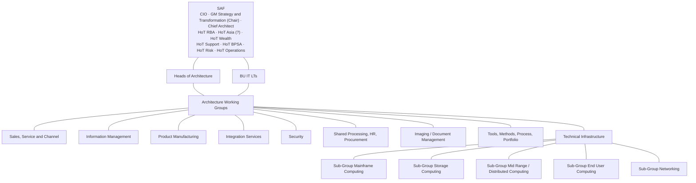

_This is the talk I gave at BankTech.06 in Sydney on the 27th and 28th of July 2006, when I was
Head of Architecture, Technology Australia, Retail Banking at [NAB](/spotlite/work/nab/). It is
reproduced from the PowerPoint deck, and **that makes it necessarily brief**. A deck is scaffolding
for a person standing in front of it, not a paper: the argument lives in what was said between the
slides, and none of that was recorded. There are no speaker notes in the file. What follows is
therefore the skeleton of a talk rather than the talk, and it reads like one — telegraphic where I
would have been discursive, and silent exactly where the interesting part was._

_The file's own dates settle when it was written: created on the 27th of June 2006, last saved on
the 5th of July, three weeks before the conference, across thirty revisions and seven and a half
hours of editing. Ignore the "last printed" stamp of the 14th of February 2006 — it is four months
earlier than the creation date, because it belongs to the `nab+White+Background` template the deck
was built from and PowerPoint carried it forward._

_Slide 19 carries ten `[Commercial in confidence]` markers. Those are mine, put there in 2006: the
retail bank's strategy boxes were blanked for a public audience and the surrounding scaffolding
left in place, with one column deliberately readable because it was the one I wanted to talk about.
The slide is reproduced as it stood, redactions and all. Nothing has been removed from it since._

_Slides are given one to a section, in order, at the numbering the deck uses. Where a slide is
mostly text it is set as text; where it is a structure it is set as a table or a diagram; and four
slides are genuine drawings and are reproduced as vector figures. Two repairs are worth naming.
Slide 15 carried nine stray shapes at coordinates a thousand times outside the slide, invisible in
PowerPoint but not to a converter measuring the drawing's extent, and it has been cropped back to
the real slide canvas. Slide 20's roadmap is set as a table rather than a drawing, because the
conversion broke words across lines in its labels and because the bars carry no text in the
original anyway — only the themes, the years and one initiative are named on it._

_One thing in the deck is worth flagging up front. Slide 5 reports Gartner's claim that "service
oriented architecture" was coined in 1994 as a synonym for client/server. I had
[given a paper on client/server architectures that same year](/spotlite/article/auug-1994/), which I did
not know when I put the slide together._

Chris Tham _Head of Architecture, Technology Australia, Retail Banking, NAB_

## 1 Services Oriented Architecture

Where are the opportunities and challenges of embedding SOA in a Retail Bank?

Chris Tham (chris.tham@nab.com.au), Head of Architecture, Technology Australia, Retail Banking.
Banktech.06, 27–28 July 2006, Sydney.

## 2 Contents

- What is a Services Oriented Architecture (SOA)?
- Positioning SOA against an overall Enterprise Architecture
- SOA in the context of NAB Technology Strategy
- Obtaining business buy in and alignment
- NAB approach to date in implementing SOA

## 3 Just what is "SOA" anyway?

- "The best thing since sliced bread" – guaranteed to cure cancer, solve world hunger, and retire
  Third World debt
- Something to do with SOAP and Web Services
- What my vendor says will be supported in their "Next Generation" product
- Yet another meaningless Three Letter Acronym, to be replaced by another fad in 3 years
- It's the same thing as (OOP, RPC, CORBA, CICS, …)
- All of the above?

## 4 SOA – Industry definitions

Four definitions, quoted as they stood on the slide.

> SOA is an architectural style for building software applications that use services available in a
> network such as the web. It promotes loose coupling between software components so that they can
> be reused. Applications in SOA are built based on services. A service is an implementation of a
> well-defined business functionality, and such services can then be consumed by clients in
> different applications or business processes.
>
> SOA allows for the reuse of existing assets where new services can be created from an existing IT
> infrastructure of systems. In other words, it enables businesses to leverage existing investments
> by allowing them to reuse existing applications, and promises interoperability between
> heterogeneous applications and technologies. SOA provides a level of flexibility that wasn't
> possible before in the sense that:
>
> Services are software components with well-defined interfaces that are
> implementation-independent. An important aspect of SOA is the separation of the service interface
> (the what) from its implementation (the how). Such services are consumed by clients that are not
> concerned with how these services will execute their requests.
>
> - Services are self-contained (perform predetermined tasks) and loosely coupled (for independence)
> - Services can be dynamically discovered
> - Composite services can be built from aggregates of other services

_Service-Oriented Architecture (SOA) and Web Services: The Road to Enterprise Application
Integration (EAI)_, Sun Developer Network
(http://java.sun.com/developer/technicalArticles/WebServices/soa/)

> "SOA is a component model that inter-relates the different functional units of an application,
> called services, through well-defined interfaces and contracts between these services". Defined as
> such, SOA is a collection of patterns for building an enterprise-level integration layer between
> applications while abstracting those applications as services. SOA approach advocates the use of
> open standards, while not ruling out proprietary technologies where they are appropriate, when
> integrating applications.
>
> SOA relies on exposing application functions as services that can be invoked by external parties.
> The commonly agreed aspects of the definition of a service in SOA are:
>
> - Services are defined by explicit, implementation-independent interfaces.
> - Services are loosely bound and invoked through communication protocols that stress location
>   transparency and interoperability.
> - Services encapsulate reusable business function.

_Develop a migration strategy from a legacy enterprise IT infrastructure to an SOA-based enterprise
architecture_, Artem Papkov (artem@us.ibm.com)
(http://www-128.ibm.com/developerworks/webservices/library/ws-migrate2soa/)

> A style of design, deployment, and management of both applications and software infrastructure in
> which:
>
> - Applications are organized into business units of work (business services) that are (typically)
>   network accessible.
> - Service interface definitions are first-class development artifacts, receiving the same degree
>   of design attention (and more) as databases and applications.
> - Quality of service (QoS) characteristics (security, transactions, performance, style of service
>   interaction, etc.) are explicitly identified and specified for each service.
> - Software infrastructure takes active responsibility for managing service access, execution, and
>   QoS.
> - Services and their metadata are cataloged in a repository and discoverable by development tools
>   and management tools.
> - Protocols and structures within the architecture are predominantly, but not exclusively, based
>   on industry standards (such as the emerging stack of standards around SOAP).

_Your Strategic SOA Platform Vision_, Randy Heffner, Forrester

> Service-oriented architecture represents a framework facilitating integration and interoperability
> of disparate systems. A service-oriented architecture consists of three key elements: a collection
> of services, a connection protocol by which these services can be accessed and can access each
> other, and a repository containing a catalog of available services. The governing principle of
> service-oriented architecture states that applications implement a collection of business
> capabilities and each of these capabilities can in turn be implemented by services, specialized
> pieces of software that implement a single business capability. Standardization acts as the key to
> a successful service-oriented architecture; not only must all services have the same structure in
> terms of the interface they present to the outside world, they must follow a standard protocol for
> advertising what they do and how they can be accessed and used.

_Service-Oriented Architecture: Theory and Practice_, Corporate Executive Board

## 5 What is a "Service-Oriented Architecture"

According to Gartner, the term "service oriented architecture" was first coined in 1994 by Alexander
Pasik (a Gartner analyst) as a synonym for "client/server architecture" (request-response model for
interprocess communication).

The current usage of the term has been expanded to incorporate IT concepts such as:

- Distributed computing
- Web services
- Functional modularisation across applications
- Object orientation

Related terms include:

- Business process modelling and orchestration
- Composite applications
- Reusability
- Component Architecture
- Enterprise Service Bus
- Workflow
- Virtualisation

## 6 SOA definition as used in NAB — Integration Services Architecture Framework

A Service is essentially any interface presented on an Information Bus – in the case of Integration
this is expected to be an accessible Business Rule, Business Function or Business Process.

The Service Taxonomy defines how Services interact, how Services are governed, and the key expected
reuse points. The layers run:

For example, it should not be possible to integrate directly from a presentation element to a core
system. Equally, an enterprise level component should not be dependent (unnecessarily) on a channel
identifier.

## 7 Architectures : Service Taxonomy

| Element               | What it does                                                                                                                                                                                                                                                                                                                                                                                                                                                                            |
| :-------------------- | :-------------------------------------------------------------------------------------------------------------------------------------------------------------------------------------------------------------------------------------------------------------------------------------------------------------------------------------------------------------------------------------------------------------------------------------------------------------------------------------- |
| **Business Rule**     | Business Rules do not change the business state. Instead, a rule derives business information. As such, rules are often described as calculations, decisions or lookups. These rules may ultimately lead to an outcome or action, but these are always realised through the vehicle of a process or function interacting with the rule. The actual execution of the rule only produces the derived information.                                                                         |
| **Business Process**  | Business Processes achieve this result by managing a process-driven interaction between Business Processes, Business Functions, Business Rules. Thus the process realises a process inherent in the activity of the business.                                                                                                                                                                                                                                                           |
| **Business Function** | Business Functions achieve this result by manipulating Technical Services (as well as interacting with other functions). In this respect a business function translates a business event (or function, or service) into the IT domain. The result of a Business Function may ultimately be a change in a database, a series of transactions or similar outcomes. A Business Function can also encapsulate an interaction with a user. This is expressed within the high-level patterns. |

Business Functions and Business Processes tangibly change the business state from a business
perspective. This is a distinct business outcome. For example, a payment is made or a new account is
opened.

## 8 Contents

_The running contents slide, repeated unchanged before each section. Positioning SOA against an
overall Enterprise Architecture follows._

## 9 SOA in relation to Enterprise Architecture — Enterprise Architecture Definitions

ANSI/IEEE Std 1471-2000 definition of architecture:

> "the fundamental organization of a system, embodied in its components, their relationships to each
> other and the environment, and the principles governing its design and evolution".

**Architecture description**: a formal description of an information system, organized in a way that
supports reasoning about the structural properties of the system. It defines the components or
building blocks that make up the overall information system, and provides a plan from which products
can be procured, and systems developed, that will work together to implement the overall system. It
thus enables you to manage your overall IT investment in a way that meets the needs of your business.

**Architecture framework**: a tool which can be used for developing a broad range of different
architectures. It should describe a method for designing an information system in terms of a set of
building blocks, and for showing how the building blocks fit together. It should contain a set of
tools and provide a common vocabulary. It should also include a list of recommended standards and
compliant products that can be used to implement the building blocks.

| Architecture                   | Definition                                                                                                                                                                                            |
| :----------------------------- | :---------------------------------------------------------------------------------------------------------------------------------------------------------------------------------------------------- |
| Business (or business process) | this defines the business strategy, governance, organisation, and key business processes.                                                                                                             |
| Application                    | this kind of architecture provides a blueprint for the individual application systems to be deployed, their interactions, and their relationships to the core business processes of the organization. |
| Information/data               | this describes the structure of an organization's logical and physical data assets and data management resources.                                                                                     |
| Technology/Infrastructure      | this describes the software infrastructure intended to support the deployment of core, mission-critical applications. This type of software is sometimes referred to as "middleware".                 |

Definitions taken from TOGAF Version 8. Where does Service Oriented Architecture sit?

## 10 Degrees of Service Orientation

- **Services Oriented Organisation** — entire organisation modelled as a set of services, and roles
  and responsibilities aligned to
- **Services Oriented Business Unit/Process**
- **Services Oriented IT** — every IT function defined as a service
- **Services Oriented Architecture**
- **Services Oriented Project**
- **Services Oriented Application**
- **Services Oriented Infrastructure**

## 11 Contents

_Repeated unchanged. SOA in the context of NAB Technology Strategy follows._

## 12 Drivers for NAB Technology Strategy (2005)

| Key Business Drivers                                          | Key Technology Drivers                                                                            |
| :------------------------------------------------------------ | :------------------------------------------------------------------------------------------------ |
| Objective to build a customer-centric organisation            | Ageing technical platforms do not have the functionality, flexibility or speed-to-market required |
| Need for new capabilities to manage a portfolio of businesses | Need to address some critical execution, workforce management and sourcing capability gaps        |
| A strong drive for cost competitiveness                       | NAB's traditional approach to managing IT has left the business poorly positioned to compete      |
| A rebuild of critical infrastructure                          |                                                                                                   |

## 13 An Enterprise Architecture is a key component of the Technology Strategy

| #   | Theme                                                        | Initiatives                                                                                                                                                                                                                       | Key Benefits                                                                                                                                                                             |
| :-- | :----------------------------------------------------------- | :-------------------------------------------------------------------------------------------------------------------------------------------------------------------------------------------------------------------------------- | :--------------------------------------------------------------------------------------------------------------------------------------------------------------------------------------- |
| 1   | Transform Platforms to enable business strategy              | **A. Move to integrated enterprise architecture with new capabilities** · B. Maintain stable and secure platforms · C. Optimise platform cost efficiency                                                                          | Enabling business strategies · Addressing current risks · Cost reduction (short term and long term)                                                                                      |
| 2   | Uplift Delivery capabilities, in key areas, to best in class | A. Significantly improve solution delivery across the region · B. Create high performing and flexible workforce · C. Extend and optimise sourcing approach · D. Improve regional infrastructure delivery · E. Manage IT for value | Enablement of business transformation program · Closer alignment with business · Cost optimisation and transparency · Increased responsiveness and flexibility · Improved service levels |
| 3   | Manage IT differently to enable business transformation      | A. Position IT as part of the Business · B. Break out of our vicious investment cycle · C. Share accountability for creating a technology profile that enables business model innovation                                          | Increased innovation · Enablement of flexible business operating model · Higher value/return for investments                                                                             |

Item 1A is circled on the slide.

## 14 The IT Strategy defines 10 major Architecture Capabilities …

| #   | Capability                                                  | What it must support                                                                                                                                                         |
| :-- | :---------------------------------------------------------- | :--------------------------------------------------------------------------------------------------------------------------------------------------------------------------- |
| 1   | Relationship Banker and "Shop" front-end platforms          | Support standard and integrated sales and servicing across multiple channels                                                                                                 |
| 2   | Integrated and reusable front-end components                | Support standard and integrated sales and servicing across multiple products, channels, and customer segments · Support white labelling                                      |
| 3   | Integrated customer information                             | Integrate and link existing customer information and management processes                                                                                                    |
| 4   | Modular product components                                  | Ability to manufacture products with innovative features, including pricing, relationship bundling and external product sourcing · Integrated components, including workflow |
| 5   | Common information integration and access                   | Application and information integration capabilities across systems and platforms and into third parties                                                                     |
| 6   | Regional source of truth for financial and transaction data | Support decentralised P&L responsibility · Support mandatory compliance (eg Basel, IFRS, SOX, AML)                                                                           |
| 7   | Shared processing and back-office utilities                 | Rationalise product environment (migrate products off legacy environments) · Rationalise support systems to create shared 'utilities' (eg document production)               |
| 8   | Regional security and identity management                   | Structure and model to support security policy and security principles · SOX and IFRS compliance                                                                             |
| 9   | Comprehensive and accurate management information           | Common data sourcing and common reporting · Improved visibility of business performance                                                                                      |
| 10  | Simplified regional infrastructure                          | Develop and operate shared infrastructure components · Standardise branch infrastructure to suit deployment of cross business unit applications and support cross sell       |

Capabilities 1 to 5 are circled on the slide. The line along the bottom reads:

> … Essentially describing the key characteristics of a Services Oriented Architecture, but avoiding
> the use of jargon!

## 15 The 10 capabilities are mapped into an integrated Enterprise Architecture

![The target enterprise architecture. Five horizontal layers, presentation and modular front end components, integration, support and information, transaction processing and infrastructure, cut by four business columns, wealth, retail, business, and finance and corporate. Named platforms sit in the layers, including the relationship-banker and Shop front-end platforms, regional integration services, core customer information, modular product manufacturing and administration, shared processing utilities and regionally interoperable infrastructure. Ten numbered lines connect them to the ten architecture capabilities listed on the right. Below, three thumbnails show the application, information and infrastructure architectures. Sourced from NAB Technology Strategy 2005](../../assets/banktech06-figure-1.svg)

## 16 Contents

_Repeated unchanged. Obtaining business buy in and alignment follows._

## 17 Key steps taken to obtain business buy in

**CEO and Executive Committee: recognise importance of architecture**

- Alignment to enterprise architecture is now a necessary precondition for approval of new projects
- Reconfirmation of Strategic Architecture Forum as the prime governance body for approval of major
  architecture decisions and ensuring programs implement them

**Head of Retail Banking Operations: conceptual discussion on SOA**

- Executive sponsorship and support for key SOA-aligned projects

**Retail Banking Business Strategy**

- Explicit recognition of SOA as a strategy for realising a component of the business strategy
- SOA initiatives embedded in Investment masterplan
- Implementing business process management and workflow for consumer lending fulfilment based on
  TIBCO iProcess and BusinessWorks
- Implementing a regional customer index supporting an integrated product offer based on IBM WCC

## 18 Strategic Architecture Forum is established to govern architecture

Integration Services is circled on the slide. The annotations read:

- New SAF membership focusing on those HOT's closest to business, strategy, risk and operations
- HOA's accountable for ensuring QA on all SAF papers generated from AWG's aligned to strategic
  roadmap
- HoT's and HoA's to ensure their BU Leadership Team is across impacts and outcomes for there BU
- AWG's managed by a HoA or Enterprise Architect. Not all AWG's need to run simultaneously – will
  depend on priorities

## 19 Explicit recognition of SOA in Retail Banking Business Strategy

![A five-row grid, Retail Bank Purpose, Differentiating Strategies, Enablers and Closing the Gap Strategy, Design and Solution Principles, and Key Leverage capabilities, with columns for Distribution Network and Sales Effectiveness, Remote and Electronic Channels participating in Sales, Product Solutions, and Efficiency. Most cells read Commercial in confidence. The Product Solutions column is left readable and ringed by a hand-drawn ellipse, listing what molecules, how to sell fulfil and service product bundles, and beneath it that molecule and customer focus lifts our game from single product focus and capacity, is not cross sales, a default molecule for mass market, and that the toolset needs to support molecule sales. Marked Work in Progress](../../assets/banktech06-figure-2.svg)

## 20 Initiation of several key business initiatives delivering SOA components

A 2006–2008 roadmap against four themes. The bars themselves carry no labels in the original except
one, so only the structure can be reproduced.

| #   | Theme                                           |
| :-- | :---------------------------------------------- |
| 1   | Transform Architecture To Enable Business Needs |
| 2   | De-risk Our Architecture                        |
| 3   | Reduce The Inherent Costs In Our Platforms      |
| 4   | Redefine And Strengthen Our Governance          |

Bars are keyed three ways: in-light / started project, new business initiatives, and suggested new
initiatives. The single named bar runs the full width of theme 4 and reads **Develop Enterprise
Architecture**. An ellipse rings the initiatives clustered under theme 1.

## 21 Contents

_Repeated unchanged. NAB approach to date in implementing SOA follows._

## 22 Current NAB approach in implementing SOA — Activities undertaken

- Services Oriented Architecture is a key component of the overall Enterprise Architecture work plan
  (funded via the Investment master plan as well as Technology Strategy)
- Integration Services Reference Architecture defined
- Integration Services Cookbook (patterns and guidelines) defined for two major programs
- Product evaluation to select key products for Mediation and Transport layer in Integration Services
  Architecture Framework
- SOA Working Group established to govern definition and adoption of SOA
- Innovation Lab established to future proof specific SOA components

## 23 SOA is a key component of overall Enterprise Architecture work plan

![A roadmap chart across 2005, 2006, 2007 and a Not Prioritised column, with five workstream rows, Information Architecture, Integration Services Architecture, Sales Service and Channels Architecture, Product Manufacturing Architecture, and Efficiency and Operations. Around forty initiatives are drawn as chevrons keyed by status: completed, EA Planning Forum funded, in progress, not started, and not a strategy priority or managed elsewhere. A large ellipse rings the Integration Services, Sales Service and Channels, and Product Manufacturing rows](../../assets/banktech06-figure-3.svg)

Three footnotes sit under the chart: initiative 1 was added after Portfolio Review and E2E
de-scoping; 2 Imaging was added although it was originally in Doc Production; and 3 E2E Lending
Strategy is to be treated as Current State Assessment input to Origination and Fulfilment.

## 24 Integration Services Reference Architecture

![The reference architecture as a block diagram. Four stacked core capabilities, Business Process Integration, Business Function, Mediation and Transport, sit above Hardware and Network Infrastructure, flanked on the left by vertical Management, Security and Identity, and Business Rules columns and on the right by Data Objects and Metadata Definition. Labelled beneath as supporting capabilities enabling the operational and security architectures, core capabilities governed by the integration architecture, and supporting capabilities enabling the information architecture. A thumbnail of the target enterprise architecture sits top left, zooming in on the regional integration services row](../../assets/banktech06-figure-4.svg)

It provides a consistent language to evaluate, position and evolve integration capabilities and
assets. This representation shows the "Level 0" capabilities. This is underpinned by another two
levels of detail (to Level 2). Each capability, at any level, has a description, rationale and a set
of guidelines. Depending on the particular capability, a set of recommended standards are also
defined.

> The **Reference Architecture** is a tool – it provides the foundation and a single point of
> reference for the rest of the **Integration Operating Framework**. It has been developed by NAB
> Stakeholders, Architects, Industry Experts and NAB Subject Matter Experts.

## 25 Mediation and Transport Refresh — Rationale and Objectives

There are a number of current drivers and planned investments that require a strategic positioning
in the mediation and transport layers of the Integration architecture, including:

- Multiple investments in the integration stack by competing projects
- Technology risk in current integration layer
- Key capability gaps in current integration layer

The Key Objectives for this exercise are:

- Select a Vendor that can provide the regional integration capabilities (Mediation and Transport)
  for the organisation.
- Determine best approach for migration of existing assets to the new platform.
- Review and determination of the direction for the Integration Centres of Competency (CoC).
- Spot opportunities for a new solution to simplify, decommission or otherwise improve the NAB IT
  environment.

## 26 SOA Working Group — establish and govern usage of new and emerging integration technologies within a service model

**Purpose:** The SOA Architecture Review Group was introduced to develop the reference architecture
for Service Orientation. It has progressed to development of programme architecture to provide
overall architecture governance that ensures programme activities are aligned to the business and IT
strategies.

The SOA AWG's objective is to:

- Ensure that SOA is implemented within the organisation such that it supports business plans and
  strategies
- Provide agreed policies, principles, standards and architectures to guide the delivery of SOA, and
  rationale is understood
- Ensure that optimised architecture decision making is attained with high level business buy-in
- Give clear direction to programme and projects
- Review key strategic architecture and solution design decisions – focussing on both "what"
  (conceptual), "how" (physical/pragmatic/delivery/transition) and "why".

Engagement with the SOA AWG must be:

- Through formal agenda items notified through the SOA AWG Lead or Project Director
- During key milestones of a project/release that effect the delivery of a service model.
- For all Enterprise Architecture decisions effecting the SOA related assets
- For all key SOA Asset Life Cycle Plan

## 27 SOA Working Group — Responsibilities and Benefits

**Responsibilities:**

- Develop an SOA containing agreed policies, principles, standards and architectures to guide the
  delivery of services in the organisation.
- Provide the avenue for architects, release solution architects and solution designers to
  recommend, review and approve SOA solution design decisions.
- Review and recommend SOA standards for submission to the SAF.
- Providing guidance on how other projects and systems interact with SOA AWG.

**Benefits:**

- Results in improved organisational agility and speed to market for programme to deliver towards
  business goals
- Ensures a clear line of sight between business goals and the underlying architectures required to
  support them
- Ensures SOA artifacts are endorsed and implemented consistently
- Ensure programme releases are delivering sustainable SOA capability
- Promotes reuse of architecture artifacts
- Reduces overall TCO of systems and applications

## 28 Innovation Lab

Future proofing concepts of service orientated architecture, process architecture, business process
management and portal technologies.

| Stream                              | Scope                                                                                                                                                                                                                                                                 |
| :---------------------------------- | :-------------------------------------------------------------------------------------------------------------------------------------------------------------------------------------------------------------------------------------------------------------------- |
| **Business Process Development**    | Execute a full business process "round trip" lifecycle of the technology set. Services invoked by the process flows will be initially implemented as Java stubs to demonstrate the full horizontal integration set.                                                   |
| **Statefull Service Orchestration** | Expand the round trip example to include specific interest areas, as defined by the SOA AWG. This area will focus on replacing stubs with service implementations (e.g. Business Rules Engine, web services etc). This will demonstrate the vertical integration set. |
| **Banker Central Portal**           | Demonstrate the capture and presentation of business events throughout process execution, integrated into a portal framework. The business measures defined in process design to determine the business events that are to be monitored.                              |

## 29 thank you

## Sources

- `Banktech06 NAB Chris Tham SOA.ppt`, the presentation file, 29 slides, created 27 June 2006 and
  last saved 5 July 2006. Reproduced above.
- Slides 12 to 15 draw on the NAB Technology Strategy 2005, which slide 15 cites by name.
- Slide 4 quotes four external definitions, attributed on the slide to the Sun Developer Network,
  IBM developerWorks, Forrester and the Corporate Executive Board. The two URLs are given as they
  appeared in 2006 and both have since moved.
