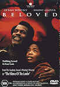

_This review was written by me for **MichaelDVD**, an Australian DVD review site that is no longer online. A capture of the site is held by the Internet Archive: **[browse it there](https://web.archive.org/web/20220217040146/http://www.michaeldvd.com.au/)**. It is reproduced here from my own copy of the site, as part of the record of what I have written._

## The film

Based on Toni Morrison's Pulitzer Prize winning novel, **Beloved** has a complex plot with multiple, interwoven themes. Ultimately, it is about a mother's love and guilt masquerading as a ghost story. A number of juxtaposed themes permeate the movie: the concept of what is human vs animal behaviour, the brutal treatment of slaves vs. the kindness of strangers, motherly love vs. dark secrets, despair vs hope and redemption.

Over the course of the movie, the main elements of the story are gradually revealed to us through a confusing set of flash backs and dramatic disclosures. The best way to describe the structure of the movie is through the analogy of an onion. Holding an onion in your hand, it feels solid and yet you have no idea what lies beneath the flaky, yet tough layers of skin. As you peel off the outer layers, gradually a set of moist and pungent inner layers are revealed to you one by one. Some layers may even be rotting and disturbing to your senses — they will certainly bring tears to your eyes — but ultimately at the very centre is life and hope itself.

The main characters in the movie are:

- Sethe (**Oprah Winfrey**), an ex-slave who escaped under painful circumstances from "Sweet Home" in Kentucky to Ohio,
- her daughter Denver (**Kimberley Elise**), who Sethe refuses to let out of the house,
- Paul D (**Danny Glover**), a friend from "Sweet Home" days who eventually became Sethe's lover, and
- Beloved (**Thandie Newton**), a strange girl called "Beloved" with a raspy voice, a mysterious past and disturbing mannerisms

It is exceedingly difficult to summarise this movie without either giving major elements of the plot away, or by destroying the complex structure of the movie, and yet at the same time not coming across as totally confusing. Prior to watching this DVD, I browsed over to the IMDB web site ([www.imdb.com](http://www.imdb.com)) and read some of the external reviews as well as user comments pertaining to this movie and at the end of it I was totally confused and still had no idea what the movie was about!

The movie starts off with a poltergeist scene establishing the haunted nature of Sethe's house in the outskirts of Cincinatti, Ohio. Eight years later, Paul D turns up on Sethe's doorstep after years of being on a bit of a walkabout. He is disturbed by the ghost, but managed to chase it away and establishes a relationship with Sethe. Through the reminisces of Sethe and Paul D and a confusing montage of flashbacks, we then find out how Sethe escaped from "Sweet Home" and what happened to her husband Halle. Then, one day, Beloved shows up, apparently with the mind of an infant trapped within the body of a young woman. Over the course of the movie, we gradually learn who Beloved is, and Paul D finally discovers Sethe's deep dark secret that apparently the whole town knows about. In the second half of the movie, Sethe and Beloved gradually plunge in the depths of poverty and madness in a bizarre relationship of mutual dependency. Finally, Denver gathers enough courage to venture into the outside world and, through the kindness of strangers (the "Thirty Ladies"), the ghost and guilt of Sethe's past actions are finally exorcised.

This movie did not do well at the box office, and I can understand why. It's complex storyline is very difficult to digest, and for the first hour of the movie I was completely lost and had no idea what the movie was about. At times, the movie seems to have a surreal, David Lynch **Twin Peaks** feel about it. I feel that the movie is probably too long (for once, I was glad for the 4% speedup you get with PAL transfers) and the major elements of the story should have been revealed within the first 30 minutes. I get the feeling that the movie attempts to be too faithful to the book, and may actually be easier to digest if it simplified the plot and adopted a more conventional story flow. Fans of Oprah's talk show will be rudely shocked if they are expecting the Oprah they know and love in this movie.

## The video transfer

This movie is presented in its original theatrical aspect ratio of 1.85:1 and the transfer is enhanced for 16:9 widescreen displays. The transfer rate averages around 5 Mb/s which is not too bad considering the length of the movie (over 2.5 hours) and the fact that the DVD carries three Dolby Digital 5.1 audio tracks on a single-sided dual-layered (RDSL or "DVD-9") disc.

For a recent movie, the transfer is somewhat problematic. Aggressive edge-enhancement has been applied to the movie leading not only to the dreaded halo effect during some scenes, but also accentuating the grain. \[During parts of the movie, the "Digital Reality Creation" circuit in the Sony projector kept trying to resolve and enhance the "grain" into objects\]. The graininess is particularly objectionable during the scenes between Sethe and Amy Denver (around 68-69 minutes into the movie) but may have been intentionally created. Shadow detail was acceptable, but certain key scenes were devoid of shadow detail, perhaps intentionally. Some scenes were deliberately overexposed but it creates a nice effect consistent with the intention of the film makers.

Colour saturation is average considering that the movie is fairly recent. Some scenes (particularly at the beginning during the poltergeist scene but also the Cincinatti scenes) have the colours intentionally muted. Scenes featuring Baby Suggs preaching in the woods have been deliberately overexposed and appear washed with a yellowish tone.

MPEG artefacts relating to the artificial enhancement of grain were evident. The transfer was relatively free of film artefacts except for a couple of scratches here and there.

I watched most of the movie with the "English for the Hearing Impaired" subtitle turned on. This is not because I was interested in checking out how well the subtitling was done (very well, by the way — the subtitles were reasonably accurate and detailed and were placed at appropriate locations on the screen) but because the dialogue was very hard to follow at times and this is one of those movies where you actually do need to hear every bit of the dialogue to follow the storyline.

The RDSL layer transition occurs at 90:31 at the end of C

## The audio transfer

The audio transfer is reasonably good, slightly above average compared to other films with the same age.

There are three audio tracks on the DVD, all encoded with Dolby Digital 5.1 surround at a bitrate of 384 Kb/s: English (default), German and Spanish. I listened to only the English audio track.

Unfortunately, despite the relatively good quality of the audio transfer, dialogue at times can be nearly unintelligible as Oprah has a tendency to mumble her lines, which then spreads onto her co-stars. Unfortunately, this is one movie where you cannot afford to ignore even a single line of dialogue as it may be crucial to your understanding of the storyline. I fear it may have contributed to the movie's lack of success in theatres — I noted from the user comments on IMDB that the movie tends to be more respected by those not from an English speaking background (who presumably watched the movie with subtitles or with a foreign language audio track). At about 15 minutes into the movie, I had to turn the English subtitles on just so that I can follow what was being said. Every time I tried to turn subtitling off, I had to turn it back on again a few minutes later so I ended up watching the entire movie with subtitles on. I don't think I would have enjoyed watching this movie in the cinema (without the benefit of subtitles).

I did not detect any audio synchronisation issues in the DVD.

The musical soundtrack is composed by Rachel Portion and is appropriate to the movie. At times, it can be quite haunting and the use of non-Western influences in the composition is a nice touch. The chanting of the Thirty Ladies during the exorcism scene is particularly effective.

Surround is effectively, if subtly used throughout the movie and creates a nice enveloping sound field. Dialogue is typically centred in front, and the rear speakers are primarily used for ambience (birds twittering, etc.) although all 6 speakers are aggressively utilised (with reasonable amounts of low frequency effects) during the poltergeist scene at the beginning and during critical flashback scenes.

## The extras

Apart from scene and audio/subtitle selections, this DVD does not contain any extras. Presumably, there would not have been much room left on the DVD to fit extras given the length of the movie and the three full DD 5.1 audio tracks. Still, I was disappointed and I felt the inclusion of a commentary track would have greatly benefited this DVD.

### Menu

The menu is static, but enhanced for 16:9 widescreen displays. It's nothing special, and reflects the front cover of the DVD.

## Region 4 versus Region 1

The Region 4 version of this disc misses out on;

- Production featurette
- Theatrical trailer
- French audio track

The Region 1 version of this disc misses out on;

- 16:9 enhancement for widescreen displays
- German and Spanish audio tracks
- Foreign language subtitles

I would be inclined to go for the Region 4 version of this DVD because of the 16:9 PAL transfer. The featurette would have been nice, but I have been told it is rather short so I doubt we are missing much.

## Summary

**Beloved**, for me, was an interesting, but ultimately flawed movie, presented on an above average DVD with no special features whatsoever.

The video quality is above average, except for excessive graininess at certain scenes.

The audio quality is good, and approaches reference quality except for a tendency amongst the actors to mumble leading to unintelligible dialogue.

There are no extras on this DVD.

### [Ratings (out of 5)](RatingsGuide.html)

© [Chris Tham](mailto:ChrisT@michaeldvd.com.au) (read my [biography](../ReviewerProfiles/ChrisT.asp)) 17 December 2000

| Rating  | Score        |
| :------ | :----------- |
| Plot    | ★★★★ 4 / 5   |
| Video   | ★★★ 3 / 5    |
| Audio   | ★★★★ 4 / 5   |
| Overall | ★★★½ 3.5 / 5 |
