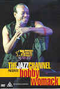

_This review was written by me for **MichaelDVD**, an Australian DVD review site that is no longer online. A capture of the site is held by the Internet Archive: **[browse it there](https://web.archive.org/web/20220217040146/http://www.michaeldvd.com.au/)**. It is reproduced here from my own copy of the site, as part of the record of what I have written._

_2000 · directed by Waymer Johnson._

## The film

_**The Jazz Channel Presents: Bobby Womack**_is another in a series of TV specials featuring concerts by black musicians produced by **BET on Jazz**.

**Bobby Womack**was born in Cleveland, Ohio in 1944. He started his musical career early (in the 1950s) along with his brothers in a group called the **Womack Brothers**which was later renamed to the **Valentinos**. Bobby then joined **Sam Cooke**'s band as a guitarist and, after Sam's death, concentrated on songwriting and session work with artists like **Aretha Franklin**, **Ray Charles**, **Jimi Hendrix**and **Wilson Pickett**. He also had some success as a solo artist in the 1960s and 1970s and more recently in his comeback records _Poet_and _Poet II_.

In this concert, Bobby is backed by a 10 piece band and 2 backup singers. The track listing for this DVD is:

|  |  |
| :-- | :-- |
| 1. Nobody Wants You When You're Down and Out 2. Daylight 3. I Wish He Didn't Trust Me So Much 4. That's The Way I Feel About 'Cha 5. Love Has Finally Come At Last 6. Woman's Gotta Have It 7. You're Welcome To Stop On By 8. A Change Is Gonna Come 9. Looking For A Love To Call My Own | 1. If You Think You're Lonely Now 2. No Matter How High I Get 3. Facts Of Life/He'll Be There When The Sun Goes Down 4. Across 110th Street 5. I'm Through Trying To Prove My Love To You 6. I Can Understand It 7. Amen/This Little Light of Mine |

Bobby has a pretty dynamic stage presence, and I quite enjoyed the songs in the latter half of the concert. He talks a fair bit in between songs, but unfortunately I found it quite difficult to quite follow exactly what he was saying. I even turned on the Italian subtitles to try and find out what he was trying to say in English! He does a fair bit of name dropping between chapters 7 and 8 (**Al Green**, **Marvin Gaye**, **Sam Cooke**, **Curtis Mayfield**amongst others).

Bobby joined by **Val Young**singing in _You're Welcome To Stop On By_, and by **Richard Rossi**playing a sax solo in _No Matter How High I Get_. The end titles are superimposed towards the end of _Amen/This Little Light of Mine_, which I found mildly annoying.

## The video transfer

Given that this originated as a TV special, the transfer is presented in a full frame aspect ratio.

In general, the transfer seems reasonably clean, with sharpness, detail and shadow detail about typical for a video source. Colour saturation was good, but I thought a bit over-saturated at times. There are occasional aliasing and shimmering (including horizontal dot crawls) which are tell-tale signs of NTSC to PAL upconversion but fortunately these artefacts are relatively minor. I also noticed some low-level video noise that verges on being unacceptable at times.

Surprisingly, this DVD actually comes with several subtitle tracks. I was hoping that one of the subtitle tracks would be in English and that the song lyrics would be transcribed onto the track. But alas, no such luck! The subtitle tracks here contain translations of Bobby's in-between songs stage banter (which are quite extensive at times!) into various foreign languages but do not include translations of the lyrics to the songs. I turned on the Italian subtitle track for a brief period (and also to try and understand what he was trying to say!). The translation was pretty comprehensive and accurate, although I am not too sure about the spelling for some of the slang words ("kunk"?).

This disc is labelled DVD9 indicating that it is a single sided dual layer disc (**RSDL**). The layer change occurs at **55:00** minutes into the concert. It is a fairly disruptive change - on my DVD player the screen freezes for almost a second, but at least it was between songs (near the transition between Chapters 10 and 11). Given that there were no real periods of silence during the concert, I can't really think of a more optimal spot for the layer change.

## The audio transfer

This DVD has three audio tracks: Dolby Digital 5.1 at 448Kbps, DTS 5.1 (unknown bitrate) and Dolby Digital 2.0 at 224Kbps. I listened to the DTS 5.1 soundtrack in its entirety, and in addition listened to a fair proportion (say about half an hour's worth) of the Dolby Digital 5.1 track.

The DTS track is actually more like a 4.0 track since the centre channel was not engaged during the entire concert. The soundstage is very front-focused, with the rear surround speakers mainly carrying ambience information. The original audio source must have been in stereo and then remixed into 5.1. In cases like this, I would have preferred it if they just gave us the original stereo track as a PCM audio track for maximum quality.

The Dolby Digital track sounded very similar, in fact it was hard for me to differentiate between the two. I also listened briefly to the Dolby Digital 2.0 track, in comparison to the 5.1 tracks it has a collapsed soundstage and has been mastered at a much lower level.

I did not detect any audio glitches or synchronisation issues.

## The extras

Given that most music DVDs don't come with any extras, the presence of an "interview" featurette, biographical stills, and the unusual inclusion of foreign language subtitles makes this DVD a cut above the average.

### Menu

The menus are reasonably pleasing and seems to be relatively free of MPEG artefacts, unlike some DVDs I've seen. They are in full frame format and are static.

### Biography - Bobby Womack

This is a single still providing a brief biography of Bobby.

### Featurette - "Meet the Artist" (9:26)

This is a brief interview with Bobby Womack. Bobby is presented in a small "window" over a background consisting of excerpts from the concert footage. Bobby talks about his musical beginnings singing gospel, his experiences performing in Europe, the ups and downs in his musical career, and upcoming albums. This featurette has three audio tracks but they all appear to be identical (Dolby Digital 2.0). Surprisingly, the featurette comes with a number of foreign language subtitle tracks.

## Censorship

As far as we have been able to ascertain, there are no censorship issues with this title.

## Region 4 versus Region 1

There appears to be no significant differences between the R1 and R4 versions of this disc.

## Summary

_**The Jazz Channel Presents: Bobby Womack**_ is a listenable concert presented on a DVD with an slightly above average video and audio transfer. The extras are nothing special, but welcomed anyway.

| Rating  | Score        |
| :------ | :----------- |
| Plot    | ★★★½ 3.5 / 5 |
| Video   | ★★★½ 3.5 / 5 |
| Audio   | ★★★ 3 / 5    |
| Extras  | ★★½ 2.5 / 5  |
| Overall | ★★★ 3 / 5    |
