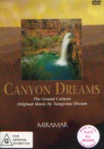

_This review was written by me for **MichaelDVD**, an Australian DVD review site that is no longer online. A capture of the site is held by the Internet Archive: **[browse it there](https://web.archive.org/web/20220217040146/http://www.michaeldvd.com.au/)**. It is reproduced here from my own copy of the site, as part of the record of what I have written._

## The film

**_Canyon Dreams_** is either a wordless travelogue/documentary on the Grand Canyon with accompanying music, or a set of **Tangerine Dream** music videos sharing a common theme, or both. Take your pick. As each chapter in the presentation is set to a specific **Tangerine Dream** song (titled on the DVD cover), and there is a few seconds of blank screen between chapters, I will describe each chapter separately:

- Chapter 1 has the opening titles (white against black background).
- Chapter 2 is entitled _Shadow Flyer_. As the name suggests, it is mainly a set of fly-bys across the Grand Canyon. If the video transfer quality (which I'll comment on later) had been better, this would have been really impressive. I was surprised to see evidence of snow in **2:50** - I didn't realise snow fell around the Grand Canyon.
- Chapter 3 is entitled _Canyon Carver_. It focuses on the river itself, including shots of people doing whitewater rafting. Don't believe anyone who tells you the Grand Canyon river is small - well it may be insignificant compared to the size of the Canyon itself, but as this chapter shows it can be pretty big, fast and mean.
- Chapter 4 is entitled _A Matter Of Time_. Predictably, it contains lots of time lapse photography and ends with some night and star shots.
- Chapter 5 is entitled _Water's Gift_. It focuses on the water again, but now including some spectacular waterfalls and some underwater shots. Some of the shots are done in slow motion.
- Chapter 6 is entitled _Canyon Voices_. It returns back to a set of fly-bys, but shot in the afternoon sun.
- Chapter 7 (the last chapter) is entitled _Sudden Revelation_. It starts with a sunrise, followed by shots of the canyon reflected through water, and ends with a sunset, followed by closing titles.

For those of you unfamiliar with **Tangerine Dream**, it is a German electronic/synthesizer band founded in 1967 (and still going strong) and has undergone about as many changes in the band line-up as _Spinal Tap_ has over the years. The band itself is extremely prolific and has consistently released an average of 1-2 albums/soundtracks per year since the 1960s - I own about 20 CDs and I have less than half of their discography!

The music for _**Canyon Dreams**_ was created towards the end of the "Blue Years" and featured a band line-up consisting of **Edgar Froese**, **Christopher Franke** and **Paul Haslinger**. I quite like the "Blue Years" period of **Tangerine Dream**. During this period the band released some pretty good albums such as _Le Parc_, _Underwater Sunlight_ and _Tyger_ (my favourite TD album). However, in _**Canyon Dreams**_ we find the band is substantially below form and running out of ideas - the music in this feature is pretty forgettable and nondescript apart from _A Matter Of Time_ which is the only song here that holds any interest for me.

I suspect at this time Edgar and Christopher were probably not on very good speaking terms and the band was probably in a hurry to finish this off, which tends to dampen the creative juices a wee bit. Soon after recording this album, Christopher Franke left the band (apparently in a bit of a huff at the end of a concert) and went on to produce a number of solo albums. Fans of _Babylon 5_ may recall Christopher as the composer of the music soundtrack for the TV series. Paul Haslinger stayed on for a few years (termed the "Melrose Years") but eventually also left and today Tangerine Dream is essentially a father and son band - Edgar and Jerome Froese.

## The video transfer

Canyon Dreams is made-for-video, which means it is originally shot in 30fps film in the full frame (1.33:1) aspect ratio and then transferred to video. It is a pity that the DVD transfer appears to be sourced from video tape rather than the original 35mm film, as the quality of the transfer leaves much to be desired. There are lots of video artefacts apparent in the transfer - colour bleeding, low level video noise, lack of vertical resolution (a tell-tale sign is that pressing PAUSE generally results in a still that looks terrible).

Sharpness and detail is generally poor. Fortunately, colour saturation seems to be acceptable, with a tendency towards slight dullness, and shadow detail seems consistent with overall detail.

The film source itself is not pristine, but acceptable. There are minor film artefacts (mainly white marks and some scratches) throughout the entire presentation. Some amount of grain seems to be present, but with the video noise present throughout the transfer, it is hard to tell.

The transfer rate hovers consistently around 8-9Mb/s. Despite this, however, I can occasionally see evidence of MPEG a

## The audio transfer

There is only one audio track on this disc, PCM 2.0 at 48kHz/16 bits resolution. In theory, this should yield CD-like quality but I suspected the audio transfer was derived from video tape as well. Although there are no obvious audio glitches, the transfer on the whole seems to have a "sheen" normally associated with video soundtracks. The audio track seems to be mastered at a relatively high level, even in comparison to CDs, and the level is far higher than the average DVD audio level.

As the audio track is in 2 channels, the surround channels and sub-woofer are not activated during the presentation.

## The extras

There are no extras on this disc. The menus consist of scene selections. The top level menu allows you to between select "Continuous Play" and "Random Scene Selection", but on my DVD player the Continuous Play option does not seem to do what it suggests - at the end of the film, the DVD player reverts back to the main menu.

## Region 4 versus Region 1

This DVD is the same the world over and is formatted for NTSC displays.

## Summary

**_Canyon Dreams_** contains some spectacular cinematography of the Grand Canyon accompanied by mediocre music from Tangerine Dream. It is presented on a minimalist DVD with a poor video transfer and mediocre audio transfer. The DVD has no extra features whatsoever.

### [Ratings (out of 5)](../ReviewersGuide/RatingsGuide.html)

© [Chris Tham](mailto:ChrisT@michaeldvd.com.au) (read my [biography](../ReviewerProfiles/ChrisT.asp)) 15 January 2000

| Rating  | Score       |
| :------ | :---------- |
| Plot    | ★★★ 3 / 5   |
| Video   | ★★ 2 / 5    |
| Audio   | ★★½ 2.5 / 5 |
| Overall | ★★½ 2.5 / 5 |
