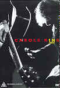

_This review was written by me for **MichaelDVD**, an Australian DVD review site that is no longer online. A capture of the site is held by the Internet Archive: **[browse it there](https://web.archive.org/web/20220217040146/http://www.michaeldvd.com.au/)**. It is reproduced here from my own copy of the site, as part of the record of what I have written._

_1994 · directed by Larry Jordan._

## The film

Ahh - what a trip down memory lane (the concert during the _Old Song Medley_ even features one of those spinning globes that used to be very popular in disco clubs!). I grew up listening to some of the songs in this concert, and it was a pleasure to hear them again and to be able to sing along with Carole in the comfort of my living room!

**Carole King** has a musical career nearly 50 years, beginning with her knocking on music publishing/recording executive doors as a 16 year old high school student to a songwriter to a very successful singer and even Broadway actress. Her album _Tapestry_ sold millions of copies when it was released in the 70s - during an era in which there was a sharp downturn in the recording industry. In the late 70s and 80s, she became one of the first performers in rock to concentrate on writing songs about the environment and personal, spiritual concerns that would later be explored by New Age followers. She also branched out to scoring films and writing songs for film & TV, such as 1986's _Murphy's Romance_.

**Carole King In Concert** is a Connecticut Public Television production recorded live in the Bushnell Memorial Hall, Hartford, Connecticut. The venue looks really posh, with lavish interiors reminiscent of a European opera house, and Carole looks quite vibrant, exuberant and youthful. I wish I've got legs like hers. She is accompanied by no less than a six piece band and two backup singers (including one who bears more than a passing resemblance to **Madonna**).

The songs in the concert are (the order and number of tracks seem slightly different than the CD version of this concert):

|  |  |
| :-- | :-- |
| 1. Hard Rock Cafe 2. Smackwater Jack 3. Up On the Roof 4. Beautiful 5. Do You Feel Love 6. Natural Woman 7. So Far Away 8. Hold Out For Love | 1. Will You Love Me Tomorrow 2. Jazzman 3. Old Song Medley 4. It's Too Late 5. Chains 6. I Feel the Earth Move 7. You've Got A Friend 8. Locomotion |

I quite enjoyed this concert and, judging by the audience reaction, so did the audience on that night. There's a far amount of screaming guitar solos and rippling keyboard sounds during this concert. The keyboard player **Teddy Andreadis** (who also sings towards the end of _Old Song Medley_) looks like he's got a puppy love (actually, make that teddy bear love) crush on Carole! _Hold Out For Love_ and _Locomotion_ features the **Voices of Jubilation** choir and **Slash** on the guitar. The only thing that disappointed me in this concert is that Carole is obviously past her singing prime and occasionally does not quite hit all the notes at the right pitch.

## The video transfer

This is a surprisingly high quality video transfer, given that the concert is originally recorded in 1994. Basically, the film source is broadcast video quality and is reasonably sharp and detailed, with good colour saturation. The only gripe I have is that low level detail can sometimes be a little below perfect (but normal for a video source) - this is more than compensated by extremely deep black levels (again, typical for a video source).

The camera footage of the concert is blocked by the head of a person standing in front of the lens at **50:25**.

I cannot detect any film-to-video artefacts - not even any ringing or halo'ing - apart from very minor aliasing every once in a blue moon. Full marks for an excellent and superb transfer!

The aspect ratio for this transfer is obviously full frame (4:3).

The feature is accompanied by several foreign language subtitle tracks, but these are only engaged for on-stage conversations, not for song lyrics. I did not engage any of the subtitle tracks.

This is a single sided single layer disc (DVD 5).

## The audio transfer

There are two audio tracks on this disc: English Dolby Digital 5.1 (448 Kb/s) and English Dolby Digital 2.0 (256 Kb/s). I listened to both audio tracks.

The Dolby Digital track is quite pleasant and appears to be derived from a stereo source that has been remixed into 5.1 surround. The centre and surround speakers are mostly used for ambience. There are no really deep bass in the mix, so I think the subwoofer would not have been kept busy.

The Dolby Stereo track is mastered at a lower level. Typical for most Dolby 2.0 tracks, it lacks the crispness and soundstage of a PCM audio track which I would have much preferred.

## The extras

Extras? What extras? :-(

### Menu

Static but okay.

## Region 4 versus Region 1

The Region 4 version of this disc apparently misses out on;

- various stills including Discography, Biography, and a list of her Top 40 hits

The Region 1 version of this disc misses out on;

- Nothing of consequence (foreign language subtitle tracks)

I would rate both versions as pretty much the same (the little bit of extras in R1 are not significant in my opinion).

## Summary

**Carole King in Concert** is a pleasant trip down memory lane and an enjoyable concert. It is presented on a DVD with a superb video transfer, an okay audio transfer and no extras whatsoever.

| Rating  | Score         |
| :------ | :------------ |
| Plot    | ★★★½ 3.5 / 5  |
| Video   | ★★★★½ 4.5 / 5 |
| Audio   | ★★★ 3 / 5     |
| Overall | ★★★½ 3.5 / 5  |
