_This article was written by me and **published on Audioholics**, where it remains: **[read it there](https://www.audioholics.com/av-preamp-processor-reviews/cary-cinema-6)**. Audioholics asked permission to run it. It is republished here for information, as part of the record of what I have written._

## Cary Cinema 6 Introduction

Cary Audio is company probably better known for their SET (single-ended triode) power amplifiers and vacuum tube pre amplifiers (and lately, some remarkably fine sounding CD players). But it seems Cary wants to be considered in the highly competitive home theater market as well, releasing a line of DVD players, processors/preamplifiers and multi-channel power amplifiers.

The Cary Cinema 6 is the latest surround processor/preamplifier from Cary, and is currently the only AV pre/pro that Cary sells as it's older and bigger brother the Cinema 8 has recently been discontinued (although there are rumors of Cinema 11 and Cinema 9 coming out soon). The Cinema 6 has been a long time coming - originally announced during CES 2003, and announced again at CES 2004 with a promised shipment date of January 2004, the model was further delayed and initial units were not shipped until March 2004. But the delay has been worthwhile, for the Cinema 6 was one of the first pre/pros on the market that supports the Dolby Pro Logic IIx matrix decoding format, as well as DTS NEO:6 and DTS 96/24.

## Cary Cinema 6 Overview

### Why is Dolby Pro Logic IIx so important and isn't the world sick of yet another surround decoding format?

Like its predecessors Dolby Pro Logic and Dolby Pro Logic II, IIx expands 2ch channel content (stereo or Dolby Surround encoded) into additional channels creating a synthetic surround audio experience. However, Pro Logic IIx expands 2ch to 7.1 speakers rather than 5.1. In addition, Pro Logic IIx will also expand 5.1 channel content (such as the output from a Dolby Digital decoder) into 7.1 channels as well.

In other words, Dolby Pro Logic IIx will convert both 2.0 and 5.1 content into 7.1, ensuring that you get the maximum benefit from a full 7.1 home theater speaker configuration instead of limiting yourself to a handful of 6.1 content in Dolby Digital EX or DTS-ES format.

In theory, Dolby Pro Logic IIx can work on any 2.0 and 5.1 content (not just Dolby Digital 5.1), including analog sources (such as the 5.1 analog outputs of SA-CD and DVD-Audio players) and even DTS 5.1. However, the implementation of IIx on the Cary Cinema 6 is limited to Dolby Digital 2.0/5.1 content and 2ch digital (LPCM) sources only.

What is interesting is the type of surround formats that the Cinema 6 does _not_ support. Unlike its more expensive competitors, the Cinema 6 is not THX certified and does not support any THX specific formats, such as THX Ultra2 Cinema mode, THX Music mode, THX Games mode, and THX Surrround EX or any of the underlying technologies, such as re-equalization, timbre matching, or adaptive decorrelation.

In addition, the Cinema 6 does not support Dolby virtual surround technologies such as Dolby Headphone (this is understandable since the unit has no headphone socket) and Dolby Virtual Speaker. Nor does it support esoteric surround formats such as MPEG Multichannel, AAC, or WMA. Finally, it does not support proprietary matrix decoding formats such as Lexicon's Logic 7 or SRS Circle Surround. However, the presence of buttons on the front panel and remote control labelled "CES 7.1" suggests that initially Cary may have originally planned to include support for 'Cirrus Extra Surround 7.1' (a proprietary Cirrus Logic specific matrix expansion algorithm).

### Bang for the Buck?

The Cinema 6 supports no-compromise analog inputs: the five stereo analog inputs are not digitally processed, and there is not just one but two 7.1 analog inputs. Indeed, the Cinema 6 seems to be cunningly positioned to appeal to the purist audiophile who wants the highest quality processing and pre-amplification and is willing to forego esoteric surround formats or THX certification. Such a person will likely never use these formats which are potentially sonically degrading.

All these exclusions appear to be motivated by licensing/cost considerations, since the Cirrus Logic CS49400 DSP used in the Cinema 6 is perfectly capable of decoding all the above formats, as evidenced by other surround processors based on the same DSP such as the Rotel RSP-1098 and Sherwood Newcastle P-965. This allows Cary to position the Cinema 6 at a lower price point than high end processors from the likes of Halcro, Halo, and Integra Research (manufacturers that also offer pre/pros with Dolby Pro Logic IIx support) whilst offering comparable audio quality.

Indeed, the Cinema 6 seems to be cunningly positioned to appeal to the purist audiophile who wants the highest quality processing and pre-amplification and is willing to forego esoteric surround formats or THX certification. Such a person will likely never use these formats which are potentially sonically degrading.

On the aspect of audio purity, the Cinema 6 delivers, at least on paper. Common sense suggests that a typical A/V receiver or pre/pro will never yield the same audio performance as an analog only preamplifier. And indeed many mass market receivers and even some high end pre/pros have mediocre specs: S/N in the 80-90s and THD as high as 0.15%. The Cinema 6 seems intent on proving common sense wrong. The quoted specs are impressive indeed: 110dB dynamic range and S/N, channel separation of over 100dB and THD of 0.003%.

The Cinema 6 supports no-compromise analog inputs: the five stereo analog inputs are not digitally processed, and there is not just one but two 7.1 analog inputs. In other words, the DSP operates only on digital inputs, and Cinema 6 operates as a pure analog pre-amplifier on analog 2ch and 7.1 inputs. There is also no provision for digital or analog line level outputs (although the Zone 2 output can be used as an analog line level output), eliminating another common area for sonic degradation (these outputs often add noise to the main path when connected).

The Cinema 6 also shares some common features typically found on Cary CD players: 2x upsampling, as well as HDCD support. The Cinema 6 is a single ended solid state design, so look elsewhere if you have balanced power amplifiers with XLR connectors and/or balanced analog sources.

Finally, in terms of video, the Cinema 6 provides only analog video switching (on composite, S-Video and component connections). There is no video processing (such as format conversion and scaling) apart from OSD (on screen display) overlay and there is no support for newer digital A/V inputs such as HDMI/DVI/HDCP or IEE1394/FireWire/i-Link. However, the component video switching offers a bandwidth of over 300 MHz (most pre/pros only offer component video bandwidth of 50-100 MHz) which should be plenty even for HDTV.

So the bottom line is: the Cinema 6 offers audiophile quality surround processing and analog pre-amplification at a "mid price point" above the mass market receivers but below the high end pre/pros. A winning formula? Well, we shall see.

## Cary Cinema 6 System Setup and Remote Control

The unit arrived packaged in a sturdy box with a fairly thick IEC power cord, owner's manual and remote control. The owner's manual is formatted as a 26 page US Letter sized booklet, and instructions are provided only in US English. 26 pages does not seem like a lot to describe a unit as complex as a pre/pro, but fortunately the Cinema 6 proved surprisingly easy to set up and use (but with a few quirks and limitations).

[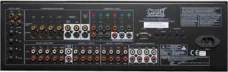](https://www.audioholics.com/av-preamp-processor-reviews/cinema6_back.jpg) The rear panel is well spaced and logically laid out. From the left to right, there are connectors for:

- Four co-axial digital inputs (DVD, CD, TV, D-VCR)
- Four optical digital inputs (DVD, CD, TV, D-VCR)
- Five analog 2-ch audio inputs (DVD, CD, TV, D-VCR, TUNER)
- Four sets of composite and S-Video video inputs (DVD, CD, TV, D-VCR)
- Two sets of composite and S-Video video outputs (with and without OSD)
- Zone-2 composite and S-Video video outputs
- Zone-2 2ch analog audio outputs
- Three sets of component video inputs (DVD, CD, TV) and one set of component video outputs
- Two sets of 7.1 analog audio inputs (A and B)
- One set of 7.1 preamplifier analog audio outputs
- RS-232C interface
- Zone 1 and Zone 2 IR inputs
- Three sets of DC trigger output terminals
- IEC power in socket

Note that there are no digital or analog line-level outputs. Digital outputs tend not to be very useful in most AV receivers or pre/pros, since on most models the digital outputs are simply copies of the digital inputs and there is no support for digital decoding (such as providing 2ch LPCM decoding of a Dolby Digital or DTS bitstream). So the lack of support is no big loss. The lack of analog line level outputs is interesting, since this is a feature available on even the most basic analog pre-amplifier. However, you can use the Zone-2 output as a line-level analog out (though the Zone 2 output will only switch between the analog 2ch inputs - the Cinema 6 will not convert digital inputs into the Zone 2 output).

Setup is pretty straightforward. Pressing the Menu button will activate the on-screen display. Note: a video display is required for configuring the processor. There are six sub-menus:

- Input Setup
- Tone Setup
- Balance Setup
- Delay Setup
- Speakers Setup
- Other Setup

The Input Setup allows you to select the audio and video source independently (note: this can also be achieved by on the remote control using the Video and Audio buttons plus the left/right arrow keys and on the front panel using the Video and Audio buttons plus the Input Selector knob).

The Tone Setup allows you to change the bass and treble settings (by +/- 10dB) but they appear to only work for LPCM digital inputs. In addition, there is an undocumented "Pre Amp" setting that can be varied between 0 and -10dB - this appears to only function on LPCM digital inputs and acts as a digital attenuator. Based on the measured results, I would recommend setting this parameter to -8 dB for optimal performance and calibrated reference level outputs.

The Balance Setup allows you to change the levels for all 7.1 channels in a +/- 15 dB range with 0.5 dB increments. There is a test signal generator that allows you to calibrate levels to 75 dB SPL using a sound meter (slow response, C weighting, 70dB sensitivity). Like the tone controls, these only work for digital sources, not analog.

The Delay Setup allows you to adjust speaker distances for all 7.1 channels from 0 to 20 feet in 0.5 foot increments (0 to 6.1 meters in 0.15 meter increments).

The Speakers Setup allows you to configure the physical speaker number and bass management settings. The front left/right channels are mandatory and can either be set to large (full range) or small (bass managed). All other channels are optional and can be configured as large/small or off. In addition, can configure your surround back channels as 1ch, 2ch or off and you can set the subwoofer crossover frequency from 40 to 140 Hz in 10 Hz increments. Unfortunately, there are no separate crossover settings for different speaker groups. However, there is some empirical evidence that suggests 80 Hz is an optimal crossover setting for bass management regardless of the actual frequency response of your individual speakers so perhaps this is not such a drastic limitation.

Finally, the 'Other Setup' allows you to configure various parameters:

- Zone 2 output (DVD, CD, TV, D-VCR, TUNER)
- Auto Detect (Off, On)
- Late (Off, On) - Dolby Digital Dynamic Range Compression
- Bright (High, Middle, Low) - Front Panel VFD brightness setting
- OSD Timeout (5 to 60 seconds in 5 sec increments)
- HDCD Default (On, Off) - HDCD format detector
- Restore Default - reset processor to default settings

Frankly, the unit was not as configurable as I would have hoped. There are no settings to adjust Dolby Pro Logic II/IIx parameters, and there is no digital room correction. The level settings and tone controls cannot be memorized for each input source, and the unit cannot remember the most recently used surround mode per input source.

The manual implies that the unit remembers the most recently selected input type (coaxial, optical, analog) per input source, but I found that the unit defaults to coaxial every time I switched input sources.

There are also some annoying limitations: Dolby Pro Logic IIx only operates on LPCM and Dolby Digital sources, not for DTS and analog sources. DTS NEO:6 only operates on LPCM sources.

## Cinema 6 Remote Control

The Cinema 6 remote control looks like a repurposed universal or DVD remote control with labels specific to the unit's functions. Unfortunately, there is no backlight, so the remote control is not usable in the dark.

The power toggle button is curiously labeled 'P'. Underneath are four surround processing buttons (functional only for digital inputs):

- PLIIx - toggles between normal, Dolby Pro Logic II and Dolby Pro Logic IIx
- Sur. Mode - in Pro Logic II or IIx mode, toggles between Virtual, Music, Movie, Matrix, Emulate; in NEO:6 mode, toggles between Cinema and Music
- CES 7.1 - in Dolby Digital mode, toggles between Ex On, Off and Auto
- NEO:96/24 - Turns NEO:6 mode on and off

Below this are input source and volume up/down selectors, and direct access buttons to 7.1 analog inputs A and B.

Next are four buttons for Mute, Test, Exit, and Menu, followed by arrow keys and selection buttons, and then analog/digital selection, plus auto decode, auto detect.

The numeric keypad is repurposed for input source select (DVD, CD, TV, D-VCR, TUNER). Finally, there is the 2XF (upsampling), Video (input source select), Audio (input source select), Zone (Zone 2 input source select), Stereo (stereo downmix), Bright (front panel VFD brightness), and Late (Dolby Digital dynamic range compression) buttons.

## Cary Cinema 6 Listening Tests & Recommendations

### Two-Channel CD / SACD

There's no doubt about it - the Cinema 6 is an excellent analog preamplifier, even when compared to the sort of preamplifiers that stereo purists rave over. I mainly compared the Cinema 6 with two analog only pre-amplifiers: a Musical Fidelity A3.2cr dual mono pre-amplifier, and a Sony TA-P9000ES multi-channel analog preamplifier.

Based on comparisons of the same sources across these three pre-amplifiers on the same power amplifiers (Musical Fidelity A5cr) and speakers (B & W CDM7NT), the Cinema 6 appeared to sound midway between the A3.2cr and the TA-P9000ES, sharing characteristics of both.

In terms of warmth, the Cinema 6 veered towards sweetness and body vs clean and clinical, although it did not sound as warm as the A3.2cr. But it also retained some of the crispness and the clarity of the TA-P9000ES. In other words, it has a nicely balanced sonic signature that should please most people.

As a digital to analog converter, the Cinema 6 performed very respectably, playing back CDs and LPCM tracks from music DVDs with a lot of style and panache. In comparison to my digital players, it probably did a better job than the Panasonic DVD-S97 舑 delivering more detail and better dynamics, but probably not as smooth or accurate as the E-MU 1820M on my Media Center 2005 PC.

The jewel in the crown is HDCD decoding - the Cinema 6 played back the few HDCDs that I own with an added sparkle compared to my non-HDCD players. HDCD detection can be turned on or off in the 'Other Menu'舡 in setup - when it is off, the processor no longer recognizes HDCDs. However, when HDCD detect is turned on, there is a perceptible pause whenever playback commences as the processor searches for the HDCD flag in the digital bitstream during which the audio is muted.

### **Multi-channel Audio**

Given the presence of both Dolby Pro Logic IIx and DTS NEO:6, I was very tempted to see how the Cinema 6 would fare applying matrix processing on my CDs. Well, I must say I was very pleasantly surprised with both. In fact, the Cinema 6 did such a good job converting ordinary stereo CDs to 7.1 that I was eager to listen to all stereo music this way. Unfortunately, the Cinema 6 does not remember the last recently used surround processing mode. The unit will always revert to no surround processing whenever a new input source (eg. CD, DVD) is selected or when the unit is turned on. Hence, you cannot for example tell the unit to always play CDs using Dolby Pro Logic IIx or DTS NEO:6 but have to manually engage these surround modes each time you turn the unit on or switch input source."

I listened to a CD that's encoded with Dolby Surround using Dolby Pro Logic IIx Music mode: Wendy Carlos' All-New 25th Anniversary **Switched-On Bach 2000** (Telarc Digital CD-80323). The experience was exhilarating - the decoded surround mix was at least as immersive as any multi-channel SA-CD or DVD-Audio I have heard, with plenty of directional cues across the rear channels.

Both Dolby Pro Logic IIx and DTS NEO:6 work best on music with lots of ambience and reverb. I next turned to **Josh Groban'**s self titled debut album (WEA Reprise 9362481542). Again this worked very well - I was almost convinced I was listening to a discrete surround mix. DTS NEO:6 seemed to exert a touch more magic on this disc than Dolby Pro Logic IIx, with the resultant mix having more body and presence.

Dolby Pro Logic IIx had its revenge on Tangerine Dream's **Optical Race** (Private Music VPCD 6803) 舑 it managed to render this with a bit more sophistication and polish than DTS NEO:6 - the latter making the music a bit recessed and front centred.

### **Home Theater**

The Cinema 6 is a very good Dolby Digital and DTS decoder. In particular, DTS soundtracks really sounded fantastic, particularly in 6.1 ES-Discrete mode, such as the audio tracks from the Extended Edition of **_The Lord of Rings_** Trilogy (New Line Platinum Series N5549, N6932, N6504). I kept hearing little details, like foley effects in the background, and the omnipresent musical score, that I've never noticed before. There's a sense of clarity and crispness in the decoding that is bound to bring a smile to home theater fans (and perhaps even a few gasps during loud scenes).

But even standard DTS 5.1 audio tracks from a variety of DVDs sounded excellent, at both normal and half bit rates. I tried several DTS tracks on Music DVDs, including **The** **Jazz Channel Presents Jeffrey Osborne** (Warner Vision 8573862162), **Laura Pausini Live 2001-2002 World Tour** (Warner Vision 5046610912) and **Pat Metheny Group Speaking of Now Live** (Eagle Eye Media EE 19023) - all sounded superb, and in each case the DTS 5.1 had an edge over Dolby Digital 5.1 in terms of audio quality.

Normal Dolby Digital 5.1 and 2.0 decoding were also handled with considerable flair. The Cinema 6 seemed to give DTS a bit of an unfair advantage by decoding DTS tracks louder and bassier than Dolby Digital, but once the differences were accounted for Dolby Digital soundtracks did sound very good. For example, the Dolby Digital 2.0 256 kbps audio track on Ana Torroja and Miguel Bosè's **Girados en concierto** (Warner Music Vision 8573864392) was handled very well, sounding only a little bit harsher than the CD version (WEA 84915-2).

But what about Dolby Pro Logic IIx layered on top of 2.0 and 5.1 audio tracks? The Cinema 6 only supports Dolby Pro Logic IIx over Dolby Digital and not DTS, so the most you can do to DTS 5.1 audio tracks is to manually turn ES Matrix decoding on or off.

Dolby Pro Logic IIx over Dolby Digital 2.0 or 5.1 (or Dolby Pro Logic II over Dolby Digital 2.0) does work, but the Cinema 6 seemed to attenuate and compress the dynamics, making the result somewhat anemic. I was a bit surprised by this - engaging Dolby Pro Logic IIx consistently seemed to attenuate the apparent loudness by at least 6 dB. But to be fair, I've also noticed this with Dolby Pro Logic II on the Panasonic DVD-S97, so perhaps this is a "feature" rather than a bug, but the sonic degradation does reduce the value of engaging Dolby Pro Logic IIx.

One advantage of Dolby Pro Logic IIx is that Matrix mode yields an enveloping surround mix even for mono soundtracks - the Cinema 6 does not have a specific surround mode for mono, but Matrix mode is almost as good.

### **Suggestions for Improvement**

The Cinema 6 could have been a perfect surround processor for the purist audiophile, but unfortunately there were too many implementation flaws. In particular, Cary needs to address the following "bugs" (operations documented in the manual, but which do not appear to work correctly):

- Noise burst (loud "pop" or "click") when re-locking onto digital signals (such as when a DVD player enters and resumes from pause) - Cary Audio recommends turning off Auto Detect and HDCD detect, but I found that I get the occasional click even when I turned both these features off
- Occasional static noise decoding Dolby Digital, rectified by switching the unit off and on
- Broken support for 192kHz digital input (in particular, the Cinema 6 recognized but did not decode 192 kHz output from the Panasonic DVD-S97 correctly)
- Support for simultaneous 2x upsampling and Dolby Pro Logic IIx operation
- The unit did not memorize the default input type (coaxial, optical, analog) to last selected format for each input source
- Tone controls not operational for HDCD, non-LPCM digital signals and analog inputs
- Speaker levels, time alignment and bass management do not work for analog inputs
- Matrix processing (Dolby Pro Logic II/IIx, DTS NEO:6) and 2x upsampling do not work for 96kHz LPCM digital signals

In addition, the following feature enhancements would greatly improve the usability of the unit. Some require additional hardware; others can potentially be implemented via a firmware upgrade:

- Digitization of analog input for surround processing
- Conversion of digital input signals to Zone 2 analog output
- Dolby Pro Logic IIx processing for DTS digital input
- DTS NEO:6 processing for Dolby Digital 2.0 digital input
- Default to last used surround processing mode for each input source

## Cary Cinema 6 Measurements and Analysis - Part 1

We tested the player using Audio RightMark 5.5 and an E-MU 1212M as the capture card, at 24 bit resolution and 44.1, 48 and 96 kHz sampling rates. The following combinations of input/output were tested:

- Analog 2ch in (on D-VCR analog input), Front Left/Right preamp out
- Analog 2ch in (on D-VCR input), Zone 2 analog out
- Analog 7.1 ch Front Left/Right in (on Ext B input), Front Left/Right preamp out
- Digital in (on D-VCR coaxial input), Front Left/Right preamp out

### **Analog Preamplifier Tests (Audio Rightmark)**

These are 96 kHz 24-bit Audio Rightmark results of the Cinema 6 as an analog preamplifier (the E-MU 1212M in external analog loopback mode is provided as a reference):

| **Test** | **E-MU 1212M** | **Analog D-VCR in, preamp out** | **Analog 7.1 Ext B in, preamp out** | **Analog D-VCR in, Zone2 out** |
| :-- | :-- | :-- | :-- | :-- |
| Frequency response (from 40 Hz to 15 kHz), dB: | +0.02, -0.18 | +0.02, -0.18 | +0.02, -0.14 | +0.02, -0.16 |
| Noise level, dB (A): | -117.4 | -101.0 | -102.9 | -102.1 |
| Dynamic range, dB (A): | 115.9 | 100.9 | 102.2 | 100.9 |
| THD, %: | 0.0007 | 0.0007 | 0.0004 | 0.0005 |
| IMD + Noise, %: | 0.0012 | 0.011 | 0.0044 | 0.0053 |
| Stereo crosstalk, dB: | -115.7 | -100.1 | -101.0 | -98.0 |

As can be seen, the Cinema 6 measured very well as an analog preamplifier, with specs rivaling that of high end stereo preamplifiers. For the above measurements, the master volume control was set to 0dB. At this level, the Cinema 6 preamp voltage output was close to reference, down by around 0.2-0.3dB.

The Cinema 6 appeared to be slightly better as an analog preamplifier on the multi-channel input (External 7.1 B) than on stereo inputs. The Zone 2 out (which is really nothing more than a renamed analog line level output) was also quite good, except for slightly worse stereo crosstalk.

### **Frequency Response**

The Cinema 6 was essentially flat all the way to at least 48 kHz (the dip in high frequencies is actually due to a high pass filter in the E-MU 1212M):

[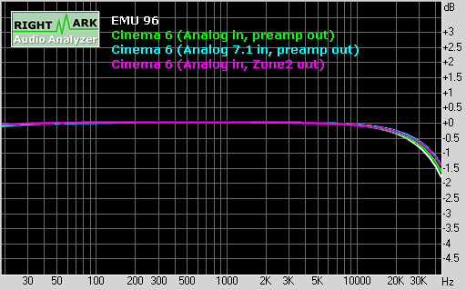](https://www.audioholics.com/av-preamp-processor-reviews/cary6measurement1.gif/image)

### **Signal to Noise Ratio**

The noise floor was convincingly below -100dB, with the main contributor to noise being the residual 50Hz spike from the power supply and harmonics of 50 Hz (primarily 150 Hz, 250 Hz, ...) There seemed to be a few spikes around 17 kHz and above 30kHz:

[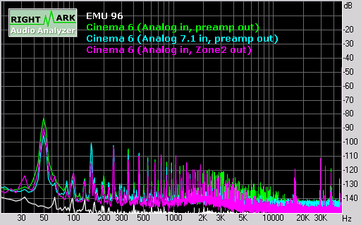](https://www.audioholics.com/av-preamp-processor-reviews/cary6measurement2.gif/image)

The unweighted dynamic range was around 86 dB and the A-weighted dynamic range was around 101 dB. Not quite the 110dB claimed in the manual but not bad for a pre/pro.

[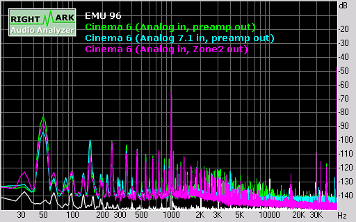](https://www.audioholics.com/av-preamp-processor-reviews/cary6measurement3.gif/image)

## Cary Cinema 6 Measurements and Analysis - Part 2

### **FFT Distortion Analysis**

Unweighted THD+noise at -3dB FS was 0.01%, and the corresponding A-weighted figure was 0.002%, which is slightly better than the 0.003% quoted in the manual:

[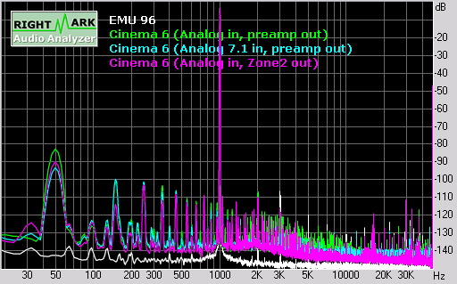](https://www.audioholics.com/av-preamp-processor-reviews/cary6measurement4.gif/image)

Intermodulation distortion (based on 70Hz + 7kHz fundamentals) was also very low: 0.01% unweighted and 0.0025% A-weighted:

[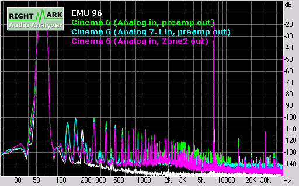](https://www.audioholics.com/av-preamp-processor-reviews/cary6measurement5.gif/image)

Based on swept tones, IMD was well below -78dB for 0-48kHz (D-VCR analog in, preamp out):

[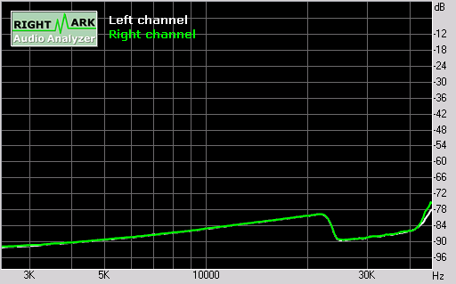](https://www.audioholics.com/av-preamp-processor-reviews/cary6measurement6.gif/image)

Finally, stereo crosstalk was extremely low for the preamp output, but rose to around -72dB FS at 48kHz for the Zone 2 output:

[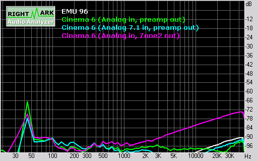](https://www.audioholics.com/av-preamp-processor-reviews/cary6measurement7.gif/image)

### **Digital Preamplifier Tests (Audio Rightmark)**

These are Audio Rightmark results of the Cinema 6 when fed a digital signal via the D-VCR coaxial input at 44.1, 48 and 96 kHz sampling rates (the E-MU 1212M in external analog loopback mode is provided as a reference):

| Test | E-MU 1212M (44.1kHz) | D-VCR coaxial in, 44.1 kHz | D-VCR coaxial in, 48 kHz | D-VCR coaxial in, 96 kHz |
| :-- | :-- | :-- | :-- | :-- |
| Frequency response (from 40 Hz to 15 kHz), dB: | +0.03, -0.20 | +0.07, -0.03 | +0.06, -0.02 | +0.02, -0.04 |
| Noise level, dB (A): | -117.5 | -92.4 | -92.8 | -93.3 |
| Dynamic range, dB (A): | 117.1 | 92.0 | 92.5 | 92.8 |
| THD, %: | 0.0007 | 0.0005 | 0.0004 | 0.0004 |
| IMD + Noise, %: | 0.0010 | 0.019 | 0.019 | 0.017 |
| Stereo crosstalk, dB: | -117.3 | -97.9 | -94.6 | -94.4 |

The Cinema 6 only managed around 93dB S/N ratio as a digital to analog converter, which is mediocre (corresponding to about 15 bits of effective resolution) but the THD figure of around 0.0005% is extremely good. Stereo cross talk was higher than the analog pre-amplifier figures but still excellent. For the above measurements, the master volume control was set to 0dB (and the pre-amp attenuation level was set to -8dB), corresponding to a preamp voltage output that was closest to reference, down by only around 0.3-0.4dB.

The figures are slightly different when the pre-amp attenuation level was set to the maximum of 0dB and the master volume control reduced to -8dB:

| Test | E-MU 1212M (44.1kHz) | D-VCR coaxial in, 44.1 kHz | D-VCR coaxial in, 48 kHz | D-VCR coaxial in, 96 kHz |
| :-- | :-- | :-- | :-- | :-- |
| Frequency response (from 40 Hz to 15 kHz), dB: | +0.03, -0.20 | +0.07, -0.02 | +0.06, -0.02 | +0.03, -0.02 |
| Noise level, dB (A): | -117.5 | -93.2 | -93.1 | -93.5 |
| Dynamic range, dB (A): | 117.1 | 92.7 | 92.7 | 93.0 |
| THD, %: | 0.0007 | 0.0016 | 0.0015 | 0.0022 |
| IMD + Noise, %: | 0.0010 | 0.021 | 0.018 | 0.017 |
| Stereo crosstalk, dB: | -117.3 | -98.6 | -95.8 | -93.2 |

As can be seen, this resulted in slightly lower noise levels but at the expense of higher distortion.

The following graphs and measurements all relate to performance at a sample rate of 96 kHz 24 bits.

### **Frequency Response**

The Cinema 6 was flat to 20kHz, but then dips to -1.5dB at 40kHz:

[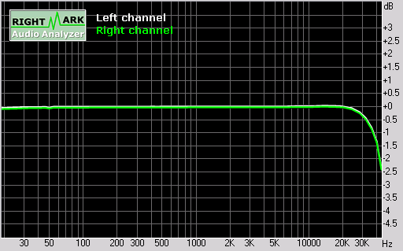](https://www.audioholics.com/av-preamp-processor-reviews/cary6measurement8.gif/image)

## Cary Cinema 6 Measurements and Analysis - Part 3 and Conclusion

### Signal to Noise Ratio

The noise floor was slightly higher than on the analog inputs, and primarily consists harmonics of the power supply residual at 50 Hz (150 Hz, 250 Hz, ...):

[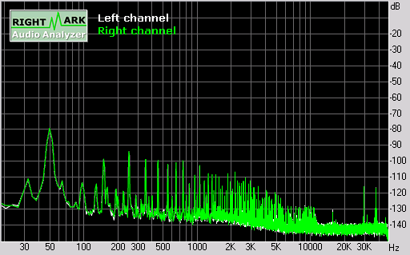](https://www.audioholics.com/av-preamp-processor-reviews/cary6measurement9.gif/image)

The unweighted dynamic range was around 82 dB and the A-weighted dynamic range was around 93 dB. This is about average for a pre/pro:

[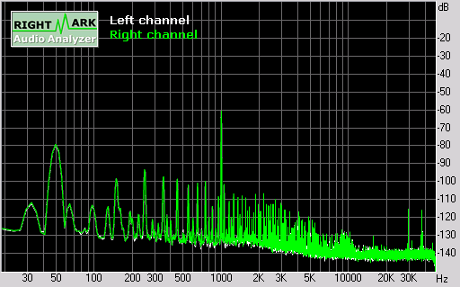](https://www.audioholics.com/av-preamp-processor-reviews/cary6measurement10.gif/image)

### FFT Distortion Analysis

Unweighted THD+noise at -3dB FS was 0.018%, and the corresponding A-weighted figure was 0.005%, which is slightly worse than the 0.003% quoted in the manual:

[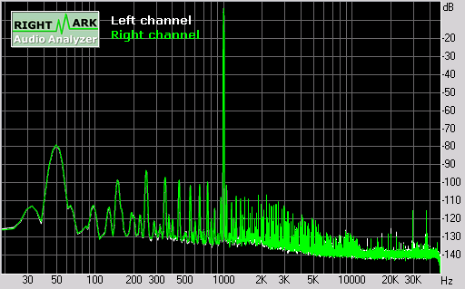](https://www.audioholics.com/av-preamp-processor-reviews/cary6measurement11.gif/image)

Intermodulation distortion (based on 70Hz + 7kHz fundamentals) was also low: 0.017% unweighted and 0.006% A-weighted.

Based on swept tones, IMD rose from -88 to -69 for 0-40kHz.

Finally, stereo crosstalk was fairly low and generally hovered around -90dB FS apart from around 50 Hz and above 10 kHz:

[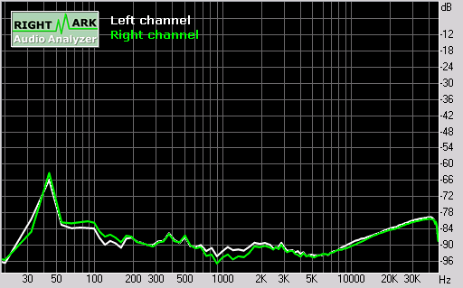](https://www.audioholics.com/av-preamp-processor-reviews/cary6measurement14.gif/image)

### **0dBFS+ Level Handling (at 44.1kHz 24-bits)**

For an explanation of what 0dBFS+ levels are, please read our article on the topic. Surprisingly the Cary Cinema 6 has about 1dB headroom even when the pre-amp attenuation level is set to the max of 0dB. When the pre-amp attenuation level was set to -8dB, the Cinema 6 handled 0dBFS+ levels with no difficulty:

| **_Frequency (sine wave)_** | **_Phase_** | **_Analog peak level (theoretical)_** | **_Pre-Amp 0dB_** | **_Pre-Amp -8dB_** |
| :-- | :-- | :-- | :-- | :-- |
| **5,512.5 Hz** | 67° | +0.69 dB FS | +0.69 dB FS | +0.69 dB FS |
| **7,350.0 Hz** | 90° | +1.25 dB FS | +1.02 dB FS | +1.25 dB FS |
| **11,025.0 Hz** | 45° | +3.00 dB FS | +1.17 dB FS | +3.04 dB FS |

This is the best 0dBFS+ handling I have ever seen in a digital component, so full marks to the Cinema 6 for playing back all digital recordings with absolutely no clipping whatsoever!

## Conclusions and Overall Perceptions

I really wanted to like the Cinema 6 - after all, at the end of the day, it's the audio quality that counts, right? And in terms of audio quality, the Cinema 6 is quite simply the best sounding surround processor I have heard to date, and I've listened to some fancy ones, including Meridian 568, Lexicon MC-8 and Krell Showcase pre pros. If you wanted high quality video switching, top class Dolby Digital and DTS decoding, excellent digital to audio conversion, plus a great analog 2ch and multi-channel pre-amplifier all rolled up into one package, the Cinema 6 is it.

However, I couldn't get pass many annoying faults and limitations, particularly the lack of ability to memorize the input type (coaxial, optical, analog) and last used surround processing mode per input source. Also, the unit has a noticeable lag locking onto digital input formats, and often with a brief noise burst.

I hope Cary Audio Design will be able to fix some of these faults in a firmware upgrade. The Harman Kardon 435 and 635 AV receivers (also based on the Cirrus Logic CS49400 DSP) have similar faults, but these have been recently rectified through a new firmware release.

Cary Audio Design

## The Score Card

The scoring below is based on each piece of equipment doing the duty it is designed for. The numbers are weighed heavily with respect to the individual cost of each unit, thus giving a rating roughly equal to:

Performance × Price Factor/Value = Rating

_**Audioholics.com note:** The ratings indicated below are based on subjective listening and objective testing of the product in question. The rating scale is based on performance/value ratio. If you notice better performing products in future reviews that have lower numbers in certain areas, be aware that the value factor is most likely the culprit. Other Audioholics reviewers may rate products solely based on performance, and each reviewer has his/her own system for ratings._

### Audioholics Rating Scale

-       — Excellent
-      — Very Good
-     — Good
- — Fair
- — Poor

| Metric                          | Rating |
| :------------------------------ | :----- |
| Frequency Response Linearity    |        |
| SNR                             |        |
| Multi-channel Audio Performance |        |
| Two-channel Audio Performance   |        |
| Video Processing                |        |
| Bass Management                 |        |
| Build Quality                   |        |
| Fit and Finish                  |        |
| Ergonomics & Usability          |        |
| Ease of Setup                   |        |
| Features                        |        |
| Remote Control                  |        |
| **Performance**                 |        |
| **Value**                       |        |

AV Preamp and Processor Reviews
