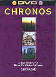

_This review was written by me for **MichaelDVD**, an Australian DVD review site that is no longer online. A capture of the site is held by the Internet Archive: **[browse it there](https://web.archive.org/web/20220217040146/http://www.michaeldvd.com.au/)**. It is reproduced here from my own copy of the site, as part of the record of what I have written._

## The film

**_Chronos_** is an IMAX 70mm film very similar to _Koyaanisqatsi_ (1983). Indeed, the cinematographer, editor, director and part producer of _**Chronos**_, **Ron Fricke**, was also responsible for the cinematography of _Koyaanisqatsi_. However, unlike _Koyaanisqatsi_, which projects a very strong subliminal apocalyptic message through it's set of images, Chronos has a less defined underlying plot holding all the images together.

For those of you not familiar with _Koyaanisqatsi_, I would strongly urge you to track it down as well as the sequel _Powaqqatsi_ (1988), though they may be hard to find these days. As far as I know, neither film is available on DVD or video as of 15 January 2001. I have an old PAL video of _Koyaanisqatsi_ bought in the UK over 12 years ago - I suspect this is long out of print although there are rumours that _Koyaanisqatsi_ may be out on DVD in Australia in the near future.

Both _**Chronos**_ and _Koyaanisqatsi_ share a common set of characteristics. Basically, the films consist of a sequence of beautifully shot images and scenes of natural landscapes juxtaposed with shots of man-made constructions and human activity, accompanied by music but no dialogue, kind of like a wordless documentary. The set of images and scenes can be in real-time, slow motion or speeded up (using time lapse photography).

The opening set of images are all consistent with the overall theme of time or the passage of time. Shots of the Grand Canyon (a landscape created through the actions of a river over time) are juxtaposed with Stonehenge (speculated amongst other things to be used for measuring time). I particularly liked the camera doing a fly-by across the river at the bottom of the canyon, and the time-lapse shot of Stonehenge is particularly appropriate to the theme of the film. These scenes are juxtaposed with each other, as well as with brief shots such as statues and the busy traffic through and across New York City's Park Avenue.

We are then taken on a wordless travelogue across the ruins and monuments to ancient civilizations in Egypt, Greece and Rome. About half way through the film, we enter a set of scenes taken at various locations in Paris that is curiously reminiscent of the "Grid" section of _Koyaanisqatsi_ - they build up from slow pans to various scenes of human activities and there is a gradual speed-up of the photography until towards the end there is a frenzied mania of fast forward motion accompanied by an equally frenzied musical score. The film then introduces similar scenes of New York City, Los Angeles and ends with a frenzied "ride" across LA freeways and Venice canals.

The cinematography is breathtakingly beautiful and impressive, and no doubt will look really good at an IMAX cinema. However, I feel that _**Chronos**_ is a very poor cousin compared to the thematically much stronger and thought provoking _Koyaanisqatsi_.

## The video transfer

The transfer is presented in a full frame aspect ratio.

This is one of the earliest DVDs released but the quality of the transfer is surprisingly quite acceptable. Sharpness, detail, colour saturation, shadow detail are all quite acceptable.

The film source is also relatively free of grain and marks. The transfer rate is consistently high (8-9Mb/s) yielding an above average video transfer relatively free of MPEG artefacts (apart from some slight shimmering in the stained glass windows in 20:20 and 21:05).

The transfer is presented in a full frame aspect ratio.

The _Ultimate DVD Platinum_ disc also contains a brief extract from Chronos. This seems to be sourced from a different transfer. The quality of the transfer in the extract is far superior to the quality of the tranfer on this disc and I wish I could see the entire f

## The audio transfer

There is only one audio track on this disc, PCM 2.0 at 48kHz/16 bits resolution. In theory, this should yield CD-like quality but I was not very impressed with the audio transfer. Although there are no obvious audio glitches, the transfer on the whole lacks the "sparkle" and clarity of a well-mastered CD. The audio track seems to be mastered at a relatively low level, far softer than that of an average CD.

As the audio track is in 2 channels, the surround channels and sub-woofer are not activated during the presentation. However, if you can force your audio decoder to apply Dolby Pro-Logic decoding on the PCM stream, you should be able to recover some surround information as the film was originally released with a dbx 6 channel audio track so I'm hoping the audio track may be Dolby Surround encoded. On my system, I can detect some ambience reproduced in the surround speakers when I switch Dolby Pro Logic decoding on.

The extract featured in the _Ultimate DVD Platinum_ disc comes with DTS, Dolby Digital and Dolby Surround audio tracks. These sound much better than the audio track on this disc.

The music by **Michael Stearns** has a vague New Age feel about it, and is quite listenable and enjoyable. It isn't the same as the music **Philip Glass** featured in _Koyaanisqatsi_, which can either be good or bad depending on whether you like **Philip Glass** or not.

## The extras

There are no extras on this disc. The menus consist of scene selections. The top level menu allows you to between select "Continuous Play" and "Scene Access", but on my DVD player the Continuous Play option does not seem to do what it suggests - at the end of the film, the DVD player does not revert back to the beginning but enters STOP mode.

## Region 4 versus Region 1

This DVD is the same the world over and is formatted for NTSC displays.

## Summary

**_Chronos_**, for me, is a nice short film vaguely reminiscent of _Koyaanisqatsi_ but not done as well. The cinematography is breathtakingly beautiful, however, and as a piece of 'eye candy' it is more than adequate, just don't expect a deep and meaningful message underlying it. It is presented on a minimalist DVD with an acceptable video transfer and mediocre audio transfer. The DVD has no extra features whatsoever.

### [Ratings (out of 5)](../ReviewersGuide/RatingsGuide.html)

© [Chris Tham](mailto:ChrisT@michaeldvd.com.au) (read my [biography](../ReviewerProfiles/ChrisT.asp)) 15 January 2000

| Rating  | Score       |
| :------ | :---------- |
| Plot    | ★★½ 2.5 / 5 |
| Video   | ★★★ 3 / 5   |
| Audio   | ★★½ 2.5 / 5 |
| Overall | ★★½ 2.5 / 5 |
