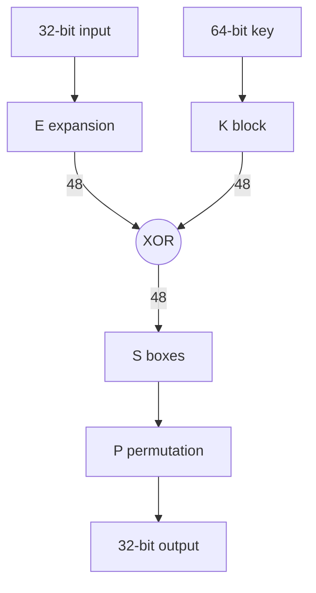
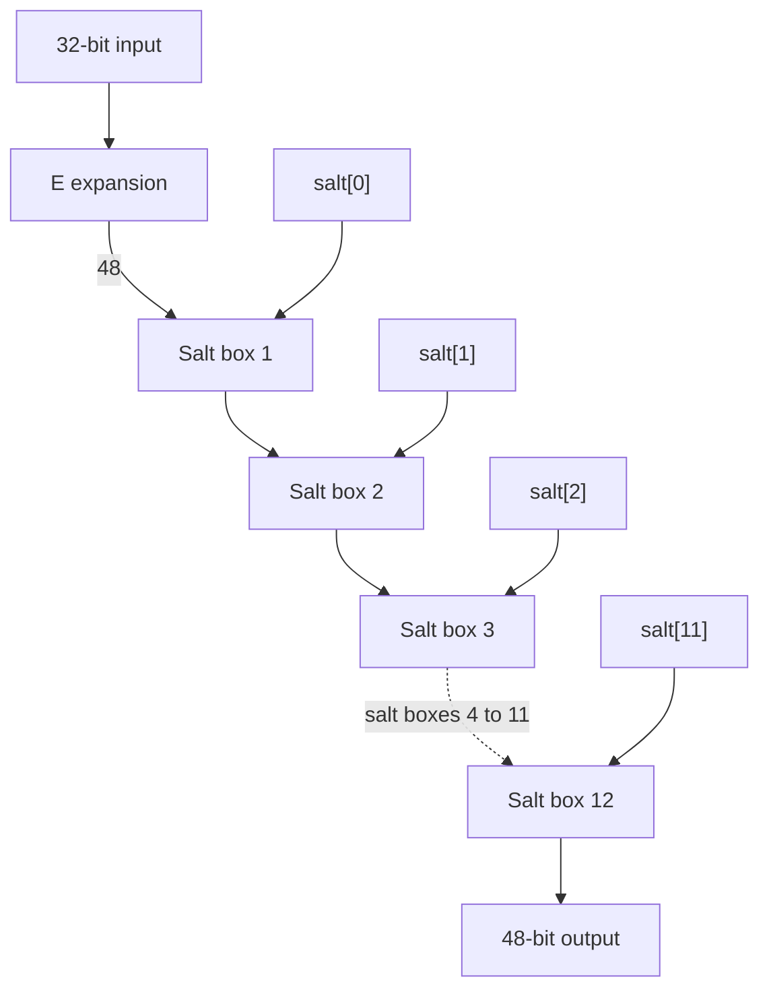
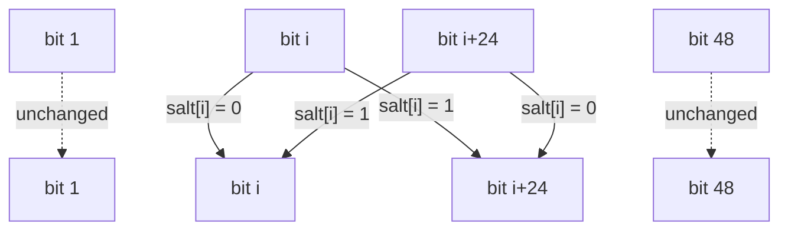
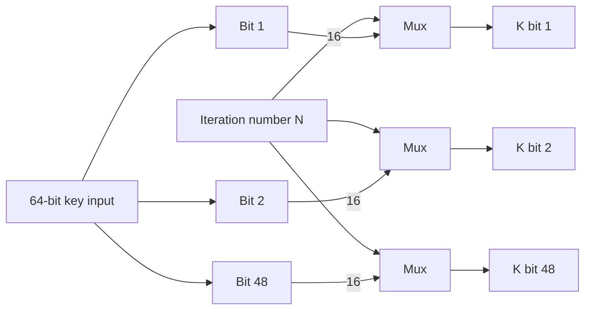
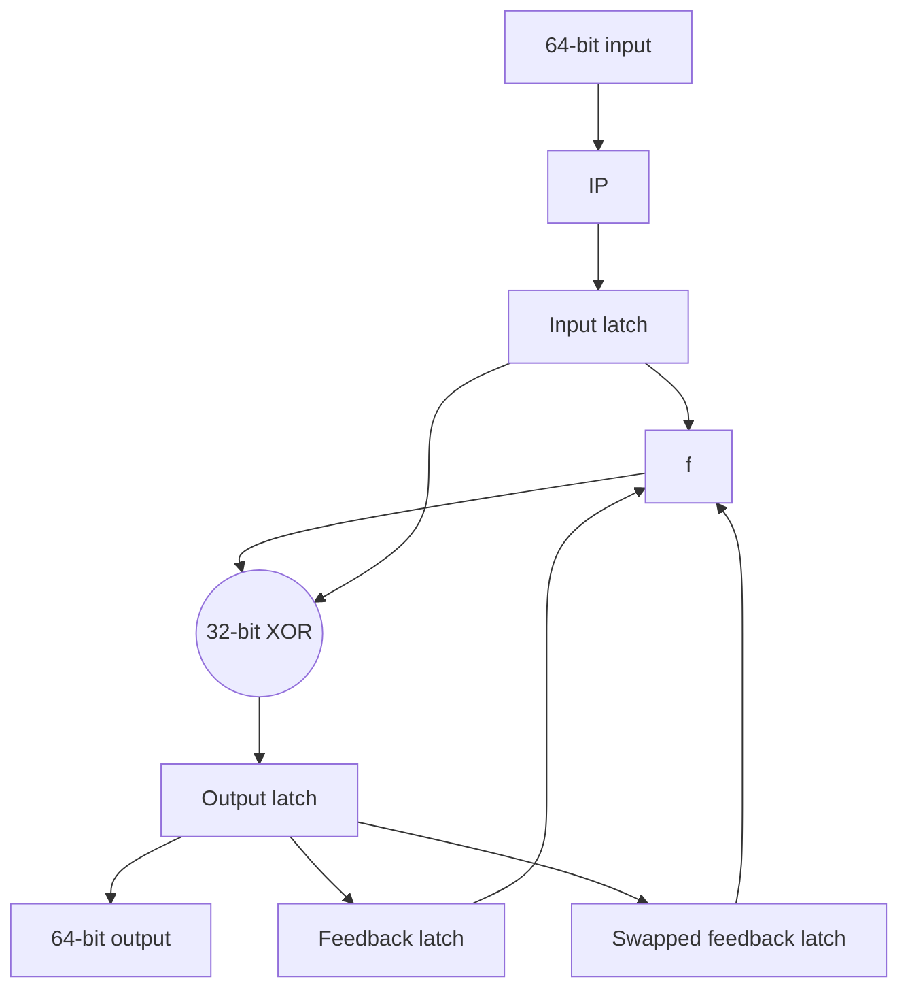
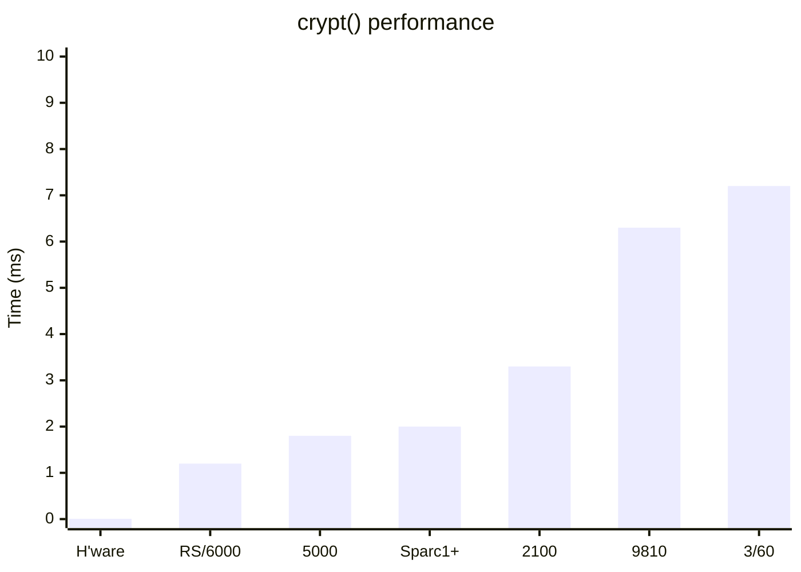

_This is a reproduction of a paper presented at the USENIX Winter '91 Conference in
Dallas, Texas (pp. 269–279), written with Philip Leong. I have transcribed it from a scan
of the proceedings: the figures have been redrawn, the tables set as tables, and the code
re-typed. The wording is unchanged._

**[Download the original scanned paper (PDF, 647 KB)](/spotlite/crypt-usenix91.pdf)**

**Philip Leong** – University of Sydney \
**Chris Tham** – State Bank of Victoria

## Abstract

Recently there has been a revival of interest in the security of the password encryption
scheme employed in the UNIX Operating System and its derivatives. This resurgence was due
mainly to the success of an attack on the Internet by a virus program in November 1988.
The current encryption scheme used is a variant of the NBS Data Encryption Standard (DES)
modified in such a way that existing DES hardware implementations cannot be used. There is
currently no reported way of reversing the password encryption, i.e., to obtain a password
from its encrypted string.

In this paper, we show that the current encryption scheme can no longer be considered
secure as most UNIX passwords can be decrypted using a brute force search within a
reasonable period of time. As an example, all passwords containing only lower case
alphabetic characters can be decrypted in less than 15 days.

In order to perform a brute force search, we need the ability to encrypt a UNIX password
in the shortest time possible. Accordingly, we present a hardware design of a password
encryption device that can encrypt a UNIX password in 6 μs. This device consists of
approximately 100 Emitter Coupled Logic (ECL) chips and can be built by any electronic
hobbyist for less than $2000. The board can also be used to encrypt DES at 266 Mbps, more
than ten times faster than a recent CMOS VLSI design.

We also present a software only implementation of the encryption algorithm recoded for
maximum speed. This implementation can encrypt a UNIX password in 1.2 ms on an IBM RS/6000
Model 530 machine.

## Introduction

The issue of the security of the UNIX Operating System has long been a subject of debate,
resulting in a multitude of conflicting statements made, often by ill-informed parties.
Whilst it is probably true that the system is "... more secure than any other operating
system offering comparable facilities" \[Duf89a\] it is also true that UNIX has never been
designed with security features foremost in its implementors' minds. \[Rit78a\]

The UNIX protection model has been extensively described in existing literature
\[Rit78a, Gra84a, Bac86a\] and will not be detailed in this paper. It is sufficient only to
know that UNIX security is based on the concept of _users_ and _groups_. A user is a
uniquely identifiable entity within the system and belongs in one or more groups. Users may
own resources in the system such as processes, files and devices. Access to these resources
is maintained by the owner who can control access by other users or a specific group. To
gain access to a UNIX system, all users must undergo a login procedure either explicitly or
implicitly. The login procedure requires the knowledge of a valid _login name_ and a
_password_ associated with the user. The password is used to authenticate the user. (An
implicit login occurs when accessing a machine through a network using utilities which may
bypass the interactive login procedure.)

Once through the login procedure, access to resources in the system is validated through
the user/group protection mechanism. In addition, there exists a special user known as the
_super-user_ who has the ability to transcend the protection scheme to access any resource
in the system.

Although there are various ways of compromising the security of a UNIX system, nearly all
of them involve either (a) an unauthorized person or program gaining access to the system
by knowing the password associated with an authorized user, or (b) an authorized user
'masquerading' as another user, preferably the super-user, in order to gain access to
unauthorized resources in the system.[^1] In any case, any intrusions into a system or
network must first begin with the knowledge of the password of an existing authorized user.
Hence, the security of a UNIX system hinges on the security of its password authentication
scheme.

[^1]:
    It must be pointed out that unauthorized access to a system can happen through a
    network by compromising the network utilities. When this occurs, we classify it as an
    unauthorized access into a system by an authenticated user of _another_ system. Also,
    the above classification scheme has not considered the possibility of an unauthorized
    user gaining access to the system simply by walking into a terminal already logged in.

On November 2, 1988, a self replicating program was released on the Internet (a logical
network of many physical networks of predominantly UNIX machines) which uses the resources
of machines on the network to replicate and spread itself. This program, alternately
described as the _Internet Worm_ and _Internet Virus_, \[Eic89a, See89a, Spa88a\] caused a
major disruption to the operation of the Internet and incensed the members of the Internet
computing community comprising thousands of academic, corporate and government users. It
sparked our interest in investigating the effectiveness of the UNIX password encryption
system as one of major methods of attack employed by the program involved the guessing of
UNIX passwords through repeated executions of a password 'cracking' routine in the program.
The implementation of the encryption routine used by the program was different from that
used by the UNIX system itself and is up to nine times faster than the UNIX
version. \[See89a\]

## Description of the UNIX password encryption algorithm

The `login(1)` program in the UNIX System implements the login procedure and attempts to
authenticate access to the system. A file called `/etc/passwd` contains a list of all valid
users on the system, including their login names and encrypted passwords. This file,
strangely enough, is readable by any user on the system. When a user tries to gain access
to the system, she or he must first type in a valid login name. The `login` program prompts
for a password associated with the login name. This password is not echoed back to the user
as it is typed in. Once typed, the program calls a standard UNIX library function called
`crypt(3)` which encrypts the password into a printable ASCII string. The `login` program
then compares the results of the encryption with the encrypted password in `/etc/passwd`.
If the two strings are equal, the user is allowed entry into the system and the program
then sets up the user environment and executes the user's command interpreter on behalf of
the user. If the login name that has been typed in does not match a valid user on the
system, or if the encrypted password does not match the encrypted string, the program
prints the string "Login incorrect" and redisplays the login prompt.

Obviously, the design and implementation of the `crypt()` function is crucial to the
security of the login procedure. The encryption performed by `crypt()` must be
irreversible, i.e., it should be impossible to derive the clear password string given the
encrypted form of the string, even when the source to the encryption routine is
available.[^2] In addition, the encryption algorithm must be reasonably compact, given the
hardware limitations of the machine on which UNIX was originally designed for, and yet take
up a substantial amount of computing time to execute. This last requirement serves to
prevent the use of key search cryptanalytic approaches.

[^2]:
    This additional requirement was necessary because the source code to the UNIX operating
    system was widely available within the academic community and also described in easily
    available literature.

The original implementation of the encryption algorithm was a variant of the M-209 cipher
machine.[^3] The password was used as the key for the encryption of a constant text string
and the result of the encryption was returned. Morris & Thompson \[Mor78a\] notes that a
version of this algorithm optimized for maximum speed could encrypt a password in
approximately 1.25 ms on a DEC PDP-11/70 minicomputer. This was considered unacceptably
fast as it permitted the use of key search techniques in password guessing programs.

[^3]: U.S. Patent Number 2,089,603

$$
\begin{aligned}
K &= k_1 k_2 \cdots k_{64} \\
PC1(K) &= C_0 D_0 \\
&= c_1 c_2 \cdots c_{28} d_1 d_2 \cdots d_{28} \\
C_i &= LS_i(C_{i-1}) \\
D_i &= LS_i(D_{i-1}) \\
K_i &= PC2(C_i D_i) \\
\text{where } i &= 1, 2, \ldots, 16
\end{aligned}
$$

**Table 1:** Computing the key schedule

The version currently in use is based on the Data Encryption Standard (DES) announced by
the National Bureau of Standards (NBS) for use in unclassified United States Government
applications in 1977. \[Ano77a, FIP75a, Seb89a\] The DES uses an algorithm called the Data
Encryption Algorithm (DEA) specified in the American National Standard
ANSI X3.92-1981. \[ANS81a\] The first eight characters of the user's password are used as
the DES key, a constant 64-bit block (consisting of all zero bits) is then encrypted via
DEA 25 times (the result of each encryption being used to feed the next round). Finally,
the resultant 64-bits is converted into a string of 11 printable ASCII characters by
encoding every six bits into a printable ASCII character and zero padding the 11th
character.

The DEA is a fairly convoluted series of bit permutations, expansions and selections
optimized for efficient hardware, rather than software, implementation. It requires a
64-bit key to be used to encrypt every 64-bit block to a 64-bit encrypted block.

The key $K$ is only effectively 56-bits long as every eighth bit is ignored by the
algorithm. $K$ is used to compute a key schedule of 16 48-bit subkeys ($K_1$ to $K_{16}$).
A permuted choice ($PC1$) function transforms $K$ into two equal 28-bit halves ($C_0$ and
$D_0$). These halves are rotated independently by specified amounts ($LS_i$) and then run
through another permuted choice ($PC2$) yielding the 16 48-bit keys. Table 1 summarizes the
key schedule computation.

The actual encryption algorithm itself will encrypt a 64-bit block $T$ into another 64-bit
block $Z$. $T$ undergoes an initial permutation called $IP$ which is then split into two
equal halves called $L_0$ and $R_0$. Each half is then alternately passed through the $f$
function which expands the half into a 48-bit block through the $E$ expansion, bitwise
exclusive-ORs ($\oplus$) with one of the subkeys in the key schedule ($K_i$), performs
selection ($S$) and permutation ($P$) operations before exclusive-ORing the 32-bit result
with the other half. After 16 applications of the $f$ function, the halves are then
rejoined back into a 64-bit block and the result undergoes a final permutation ($FP$)
yielding the encrypted block $Z$. Table 2 summarizes the operation of DEA.

$$
\begin{aligned}
T &= t_1 t_2 \cdots t_{64} \\
T_0 &= IP(T) \\
&= L_0 R_0 \\
&= l_1 l_2 \cdots l_{32} r_1 r_2 \cdots r_{32} \\
L_i &= R_{i-1} \\
R_i &= L_{i-1} \oplus f(R_{i-1}, K_i) \\
i &= 1, 2, \ldots, 16 \\
Z &= FP(R_{16} L_{16}) \\
f(R, K) &= P(S(E(R) \oplus K))
\end{aligned}
$$

**Table 2:** DEA operation

One interesting twist in the implementation of the DES algorithm in the UNIX `crypt()`
function lies in the _salting_ of the encryption. Stored together with the encrypted
password is a 12-bit salt encoded as two printable ASCII characters. The `crypt()` function
expects the salt to be passed to it along with the clear password text. The salt ($\Psi$)
is used to perturb the $E$ expansion in the following manner. Let $E$ be the standard
expansion function and $E'$ be the perturbed expansion function. Then $Y = E(X)$ and
$Y' = E'(X)$ is related:

$$
\begin{aligned}
Y' &= y'_1 y'_2 \cdots y'_{48} \\
Y &= y_1 y_2 \cdots y_{48} \\
\Psi &= s_1 s_2 \cdots s_{12} \\
y'_i &= \begin{cases} y_i & \text{if } s_i = 0 \\ y_{i+24} & \text{if } s_i = 1 \end{cases} \\
y'_{i+24} &= \begin{cases} y_{i+24} & \text{if } s_i = 0 \\ y_i & \text{if } s_i = 1 \end{cases} \\
i &= 1, 2, \ldots, 12
\end{aligned}
$$

**Table 3:** Effect of the salt on the E expansion

When a password is first selected for a user, the password encryption program `passwd(1)`
selects a random 12-bit number as the salt. The clear password string is then encrypted
using this salt and the result is stored in the password file. Later on, when the user
attempts to login to the system, the salt is extracted from the password file and is used
to encrypt the user's typed password. The effect of salting is to allow for 4096 possible
encryptions of the same password string.

Obviously, the use of salting does not necessarily improve the strength of the encryption.
In fact, especially since the mechanism of DEA is not well understood by cryptanalysts who
do not have access to classified files explaining the algorithm, it is possible that
salting may have weakened the encryption process. However, the modification was done in
order to prevent the use of hardware DES implementations in speeding up key searches, and
also to prevent password cracking programs from precomputing commonly used passwords and
storing them in a file or array and thus bypassing the (slow) encryption process.

On the surface, the UNIX `crypt()` function appears to have fulfilled all of its designers'
aims. It is compact, appears at this stage to be irreversible, and software implementations
of DEA tends to be slow, a password taking more than one second of CPU time to encrypt on a
PDP-11/70.

However, there has been many doubts casted upon the strength of DES, including disagreement
over whether a 56-bit key was sufficiently strong. Diffie & Hellman \[Dif77a\] predicted in
1977 that the DES algorithm could be compromised by a dedicated machine with around one
million chips that can be built for around $20 million. This machine could then search the
complete key space in approximately one day. They also predicted that by 1990 hardware
speeds would have improved so much that a 56-bit key would no longer be secure. The NCSC no
longer certifies DES for even unclassified government information, a sure indication that
DES is no longer considered secure. Furthermore, 25 applications of DEA does not necessarily
improve the security of the basic algorithm, especially since the key schedule does not
change between passes.

Most recently, Ali Shamir and Eli Biham \[Sha89a\] have reported that a chosen plaintext
attack can reverse the DES encryption process in a time less than that required by
exhaustive key search _provided_ less than 16 rounds of the $f$ function are run. It will be
interesting to see if a variant of this method can be used for reversing the UNIX password
encryption process, although this seems unlikely since the `crypt()` function uses
$25 \times 16$ applications of the $f$ function.

## Hardware implementation

In order to design hardware which will decrypt passwords in as short a time as possible, we
must use components with a very small propagation delay. To this end, we chose the ECL 100K
logic family.

### f function

The $f$ function forms the heart of DEA and a password encryption involves 25 applications
of DEA each of which make 16 applications of $f$. Figure 1 shows a block diagram of the $f$
function.



**Figure 1:** The f function. All buses are 32 bits unless specified.

### E expansion

The main difference between DEA and `crypt(3)` lies in the salting of the $E$ expansion
operation which outputs a 48-bit block from a 32-bit input. In DEA, this expansion is always
performed in the same way, so we could implement this by rearranging the connecting wires.
For `crypt()`, the bits in the output of the $E$ expansion may be exchanged according to the
value of the salt.

The exchange of $E$ output bits involves only optionally crossing two connections depending
on whether a particular bit of the salt is set or cleared. Thus, the exchange can be
implemented using 12 two-pole changeover relays, one for each bit of the salt. Each relay
acts as a crossbar connection controlled by a bit from the salt, thus allowing the 32-bit
input to pass through the normal DES $E$ expansion and then through the salt-dependent
permutation (see Figure 2). Since the salt need only be set once for each user, the speed of
switching of the relays does not matter. Furthermore, during the encryption process, the
signal only passes through the relay contacts, and so no propagation through logic gates is
required. Hence the difference between the $E$ expansion of DES and `crypt` does not affect
the speed of this hardware encryption device. Figure 2 shows a block diagram of the $E$
expansion and Figure 3 shows a blowup of a salt box.



**Figure 2:** The E expansion



**Figure 3:** The salt box. The 48-bit $E$ expansion output runs across the top, the salt
box output across the bottom. Bits $i$ and $i+24$ cross over when salt bit $i$ is set and
run straight through when it is clear; every other bit of the bus is untouched. The
original figure draws the same thing as crossed wiring between two of the 48 lines.

### Key schedule

The key schedule converts $K$ into a 48-bit block depending on the iteration number. Thus
the subkey for the $i$-th iteration is $K_i$ which is a selection of $K$. Our method of
calculating the key schedule is generate all 16 key schedule values for each of the 48 bits
of output, and then use a 100164 1-of-16 multiplexor to select the desired output for any
given iteration (see Figure 4).



**Figure 4:** The key schedule

### XOR of the E expansion with K<sub>i</sub>

This 48-bit XOR is implemented using 10 100107 quint XOR gates which have a maximum
propagation delay of 1.7 ns.

### S selection and P permutation

The XOR described above is passed through the $S$ selection boxes and then permuted. Note
that the $S$ boxes are arranged as 8 groups of selections of 4 bits from 6 bits, and so 8
64x4 bit ECL RAMS are required. We use 100422's which have 5 ns propagation delay from the
address input to the output. The output is then permuted according to the $P$ permutation
which just involves crossing of wires.

### Final XOR

To complete the $f$ function we do the 32-bit XOR of the output of the above permutation
with the leftmost 32 bits of the previous iteration.



**Figure 5:** Block diagram of the DES hardware. All buses are 32 bits unless specified.

### Block transformation

Block transformation involves the exchange of the leftmost 32 bits of the 64-bit word with
the rightmost 32 bits. As shown in Figure 5, we have three latches that can feed the $f$
function, and this allow us to optionally perform block transformation or clear the 64-bit
input to $f$. Clearing is required at the start of the `crypt` operation. The three latches
are wire-ORed together and the two latches not being used are cleared. The three 64-bit
latches require 33 100151 hex flip-flops.

### State machine

A finite state machine controls the flow of information through the circuit. It must feed
the key schedule computation unit with the correct iteration number, select the correct
input to the $f$ function from the three latches and latch the output result when the
computation has been completed. Figure 5 shows a block diagram of the hardware.

Note that DES can be implemented using the same hardware by setting the $E$ expansion relays
to flow straight through. Then the main difference between `crypt` and DES is that `crypt`
performs 25 iterations of the DES algorithm.

### Operating frequency

The gate delays for a single iteration of the algorithm are the delays for 2 XORs,
1 multiplexor, 1 RAM and one latch which totals to a worse case of 14.7 ns. We use a cycle
period of 15 ns which corresponds to a frequency of 66 MHz. Hence it takes 6 μs to encrypt a
password.

As a DES encryption machine, the board can process 64 bits every 240 ns, that is, at a rate
of 267 Mbps. It is interesting to note that a recently reported single chip implementation
of DES \[Ver88a\] operates at 20 Mbps.[^4]

[^4]:
    This is perhaps an unfair comparison as the reported chip implements far more than just
    the encryption part of DES.

## Software implementation

Although a hardware implementation of `crypt()` is within range of a determined cracker, we
also decided to implement a fast software version. This implementation is substantially
faster than the UNIX routine and is portable across any hardware platform with native 32-bit
operations. Interestingly, our implementation does not discriminate against either big
endian or little endian machines, although as currently implemented, it seems to shine on
RISC (Reduced Instruction Set Computer) architectures due to the fact that the
implementation does not tend to require complex instruction addressing modes but requires a
fast basic instruction execution cycle, two characteristics which have been used to describe
RISC architectures. Our implementation was written in Australia and is hence free of any US
export restrictions.

A good description of the Internet Worm/Virus implementation of `crypt()` is given in
Seeley \[See89a\] and we used this implementation as a base for our own approach. Our
initial implementation encrypted a password on the Sun Sparcstation 1 in just over 6 ms. The
performance of this implementation was disappointing compared to Bishop \[Bis88a\] so we
reimplemented the program using these new ideas. This resulted in an implementation that
encrypts a password on the same machine in just over 2 ms. The following notes describe our
second implementation.

The basic speedup over the UNIX implementation was due to bit compaction into machine words.
The UNIX implementation uses one byte to store every bit that needs to be manipulated.
Hence, 64 bytes consisting of the numbers 0 and 1 were used to represent a 64-bit entity. In
our implementation, the same entity is represented by two 32-bit words. This allows us to use
the rotate and exclusive OR operations in the instruction set, and hence exploit the inherent
parallelism in the datapath of the CPU. Also, we precomputed all expansion, selection, and
permutation functions and in many cases combined several operations into one precomputed
array.

As an example, the $PC1$, $LS_i$, $PC2$ operations can be effectively combined into a single
operation which we call $keys_i$. This operation can then be precomputed so that instead of
performing the operation on every bit in the 56-bit key yielding a 48-bit subkey, we can
divide the original 56-bit key into eight groups of 7-bit blocks. Each 7-bit block is used to
index into an array of precomputed 48-bit blocks. The eight resultant 48-bit blocks are then
ORed together to form the subkey. As an example, we declare and precompute an array used for
key schedule computations called `keys`, the DES key $K$ is in the array `k` and the computed
key schedules will be stored in the array `keysched`:

```c
typedef unsigned long Word;
typedef unsigned char Byte;

static Word keys[16][8][128][2];
static Byte k[8];
static Word keysched[16][2];
```

Note that two `Word`s are used to store the 48-bit quantity, which is divided into 24-bit
halves, each of which fits in the 32-bit machine word. For example, to compute the _i_ th
subkey, all we need to do is to use each byte in `k` to index into the `keys` array and then
OR the results into the `keysched` array.

```c
keysched[i][0] = keys[i][0][k[0]][0] |
                 keys[i][1][k[1]][0] |
                 keys[i][2][k[2]][0] |
                 keys[i][3][k[3]][0] |
                 keys[i][4][k[4]][0] |
                 keys[i][5][k[5]][0] |
                 keys[i][6][k[6]][0] |
                 keys[i][7][k[7]][0];
keysched[i][1] = keys[i][0][k[0]][1] |
                 keys[i][1][k[1]][1] |
                 keys[i][2][k[2]][1] |
                 keys[i][3][k[3]][1] |
                 keys[i][4][k[4]][1] |
                 keys[i][5][k[5]][1] |
                 keys[i][6][k[6]][1] |
                 keys[i][7][k[7]][1];
```

Note that all arrays are declared as static variables rather than left on the stack so that
the compiler can generate actual memory references or memory plus register offset references
rather than indirect stack references. This significantly speeds up code execution on CISC
(Complex Instruction Set Computer) machines. The subkey computation loop was also unrolled to
simplify the compiler address generation.

A similar technique is used to perform the $f$ function and the $FP$ final permutation.[^5]
In the $f$ function, we note that $f$ accepts a 32-bit argument, which then immediately
expands to a 48-bit block through the $E$ expansion. The result of the $f$ function is a
32-bit number which is then exclusively ORed with another 32-bit number and then fed into the
next invocation of the $f$ function. First of all, note that since $E$ is an expansion which
maps every 32-bit block into a unique 48-bit block, we can obtain the inverse of $E$ which we
shall call $E^{-1}$.

[^5]:
    The $IP$ permutation is not necessary since the text that is encrypted is always the
    zero block and we observe that $0 = IP(0)$. Also, since $FP(IP(X)) = X$, we never have to
    perform $FP$ until after the 25 iterations of the DEA as the results of each iteration is
    fed directly into the next iteration.

Suppose we define a function $g$ such that $g(X,K) = E(f(E^{-1}(X),K))$ then we notice that
$g(X,K) = E(P(S(X \oplus K)))$. In other words, we can combine the $E$, $P$ and $S$
operations into a single operation that can be precomputed. We can then transform the DEA
algorithm into 16 applications of the $g$ function followed by application of $E^{-1}$ on
both halves which is then fed into the $FP$ final permutation.

Bishop \[Bis88a\] gives a full mathematical treatment of the modified algorithm outlined
above. Finally, we note that the effect of salting can be obtained by exchanging bits of the
result of the $E$ expansion. Given that we are representing a DES block as two machine words,
we can calculate the salted expansion by performing several exclusive-ORs and one bitwise
AND (&) operation.

$$
\begin{aligned}
\text{Let } UD &= E(X) \\
&= u_1 u_2 \cdots u_{24} d_1 d_2 \cdots d_{24} \\
E'(X) &= (U \oplus M)(D \oplus M) \\
\text{where } M &= (U \oplus D) \mathbin{\&} \Psi' \\
\Psi' &= s_1 s_2 \cdots s_{12} 0 \cdots 0
\end{aligned}
$$

**Table 4:** Salting the E expansion

In our actual implementation, we reinitialize the precomputed $EPS$ array given a new salt in
order to save the time required to perturb the result of the $E$ expansion. This is because in
a password cracking situation, the cost of precomputation whenever the salt changes is
insignificant as many password guesses are made for every encrypted password.

## Guessing passwords

We shall not describe the design and implementation of the Internet Worm/Virus's password
cracking routines because it has already been documented in existing
literature, \[Eic89a, See89a, Spa88a\] although the methods it uses can be generalized for any
password guessing program. Essentially, a password guessing program works by reading in the
password file and then making multiple guesses of the password of every user or selected users
in the password file. The selection of password guesses is vitally important as the better the
quality of the guesses, the greater the chance of actually hitting the correct password within
a given period of time.

Each password guess has to be encrypted using the current salt and then matched against the
encrypted password. Obviously, the effectiveness of this procedure strongly depends on how fast
a password can be encrypted. Ideally, the encryption process should take almost no time so that
a complete key search can be done. Since we know that the encryption process takes up a
significant amount of time, even with hardware assistance, it is more effective to implement a
good password guessing generator and use brute force search only as a last resort.

A password guesser should make intelligent password guesses which is dependent on the
personality traits and characteristics of the person who has chosen the password. Ideally,
personal information concerning the password creator should be known to the program, such as
names and birth dates of people, car registration numbers etc. In practise, this information is
very hard to obtain, but a good start can be made by scanning the password file itself for
information about users. The password file often stores very useful pieces of information which
can be used, such as the user's full name, his/her phone extension and/or office number. A
password guesser should certainly try permutations of the user's login name, full name and any
other detail known about the user. Searches through lists of words or combination of words can
also be effective. These may include lists of first and last names, words occurring in a special
context (swear words, technological jargon, biblical and mythological names), or even
dictionaries.

If a brute force search is attempted, this can be made more efficient by ordering the keys
searched so that common characters and sequences of characters appear first in the search. Any
additional information such as the first character of the password or even which side of the
keyboard it was typed on, will dramatically reduce the time required to decrypt a password.

Table 5 shows the speed of our software implementation of `crypt` on a wide variety of machines.
Figure 6 summarizes the results of this table in a scatter plot.

| Machine name       | CC     | Time (ms) |
| :----------------- | :----- | --------: |
| Sun 3/50           | cc -O4 |      16.0 |
| Sun 3/60           | cc -O4 |       9.5 |
| Sun 3/60           | gcc -O |       7.2 |
| Pyramid 9810       | gcc -O |       6.3 |
| DECstation 2100    | cc -O  |       3.3 |
| Sparcstation 1+    | cc -O4 |       2.0 |
| DECsystem 5000/200 | cc -O  |       1.8 |
| IBM RS/6000-530    | cc -O  |       1.2 |
| ECL hardware       | n/a    |    0.0060 |

**Table 5:** crypt() speed comparison



**Figure 6:** crypt() performance. The original is a scatter plot of the same figures.

Table 6 demonstrates the speed difference between hardware and software implementations and also
shows the time required to decode a password using a brute force search. The software times were
extrapolated from the RS/6000 encryption time. It is easily seen that for lower case alphabetic
characters (which form the majority of passwords), it is very feasible on our hardware. The table
also shows that such brute force searches are not possible in software on commonly available
workstation class computers.

| Search criterion  | Number of passwords | H'ware (days) | S'ware (days) |
| :---------------- | :------------------ | ------------: | ------------: |
| Lower case only   | $26^8$              |          14.5 |          3712 |
| As above + digits | $36^8$              |           196 |         39182 |
| All alphabetic    | $52^8$              |          3712 |        742496 |

**Table 6:** Brute force search times

It is interesting to note that the original UNIX password encryption algorithm based on the M-209
cipher machine was changed because it could be implemented on a PDP-11/70 in 1.25 ms and this was
deemed to be too fast. \[Mor78a\] Since even our software version can perform a password
encryption in less time than this, it may be time to change the current method of encryption yet
again.

There are a number of possible improvements to password encryption algorithm that will
significantly decrease the success ratio of a password encryption program that uses our hardware
or software implementations of the `crypt()` function. An easy method would be to use the next
eight characters of the password as the initial input to the DEA and then modifying the
`passwd(1)` program to only allow passwords longer than eight characters. Alternatively, a concept
similar to the _shadow password file_ idea can be implemented by UNIX administrators to stop users
and/or programs from reading the password file.

These implementations are by no means the last word on speedy password encryption. It is certainly
tempting to imagine the speedup that can be obtained using a massively parallel computer such as
the Connection Machine \[Hil85a\] or through the use of a large array of custom VLSI chips which
can test passwords in parallel.

## Conclusion

A design of a very fast hardware encryption device has been presented in this paper. Such a device
makes brute force searching of passwords possible due to the small key space from which people
normally select passwords. It was shown that perturbing the $E$ expansion of the DES algorithm
with the salt does not result in any change in the speed of the implementation of `crypt()` in
hardware, although applying DES 25 times reduces the speed at which we can encrypt passwords by a
factor of 25.

A software implementation of the UNIX password encryption algorithm was also presented, and the
speed of this implementation was compared with that of the custom hardware.

## References

- **Ano77a.** Anon, 'Data Encryption Standard,' _FIPS PUB_, (46) National Bureau of Standards,
  (15 January 1977).
- **ANS81a.** ANSI, _American National Standards Data Encryption Algorithm_, American National
  Standards Association (1981).
- **Bac86a.** Maurice J. Bach, _The Design of the UNIX Operating System_, Prentice Hall
  International, Inc. (1986).
- **Bis88a.** Matt Bishop, 'An Application of a Fast Data Encryption Standard Implementation,'
  _Dartmouth College Technical Report_, (PCS-TR88-138) Department of Mathematics and Computer
  Science, (1988).
- **Dif77a.** W. Diffie and M. E. Hellman, 'Exhaustive Cryptanalysis of the NBS Data Encryption
  Standard,' _Computer_ 10 pp. 74–84 (June 1977).
- **Duf89a.** Tom Duff, 'Viral Attacks on UNIX System Security,' _USENIX Winter '89 Conference
  Proceedings_, (1989).
- **Eic89a.** Mark W. Eichin and Jon A. Rochlis, 'With Microscope and Tweezers: An Analysis of the
  Internet Virus of November 1988,' _IEEE Symposium on Research in Security and Privacy_,
  (9 February 1989).
- **FIP75a.** FIPS, _Proposed Federal Information Processing Data Encryption Standard_, Federal
  Register (17 March 1975).
- **Gra84a.** F. T. Grampp and R. H. Morris, 'UNIX Operating System Security,' _AT&T Bell
  Laboratories Technical Journal_ 63(8 (Part 2)) (October 1984).
- **Hil85a.** W. Daniel Hillis, _The Connection Machine_, MIT Press (1985).
- **Mor78a.** Robert Morris and Ken Thompson, 'Password Security: A Case History,' in _UNIX
  Programmers Manual_, (3 April 1978).
- **Rit78a.** Dennis Ritchie, 'On the Security of UNIX,' in _UNIX Programmers Manual_,
  (3 April 1978).
- **Seb89a.** Jennifer Seberry and Josef Pieprzyk, _Cryptography: An Introduction to Computer
  Security_, Prentice Hall Australia (1989).
- **See89a.** Donn Seeley, 'A Tour of the Worm,' _USENIX Winter '89 Conference Proceedings_, (1989).
- **Sha89a.** Ali Shamir and Eli Biham, 'Differential Cryptanalysis of DES-like Cryptosystems,'
  _Crypto '89_, (1989).
- **Spa88a.** Eugene H. Spafford, 'The Internet Worm Program: An Analysis,' _Purdue Technical
  Report_, (CSD-TR-823) (28 November 1988).
- **Ver88a.** Ingrid Verbauwhede, Frank Hoornaert, Joos Vandewalle, and Hugo de Man, 'Security and
  Performance Optimization of a New DES Data Encryption Chip,' _IEEE Journal of Solid State
  Circuits_ 23(3) pp. 647–656 (June 1988).

## About the authors

**Philip Leong** works at the Systems Engineering and Design Automation Laboratory at the
Department of Electrical Engineering at the University of Sydney. His interests include operating
systems, digital signal processing and VLSI design. He received a B.Sc. degree in Computer Science
in 1987 and a B.E. (Hons) in Electrical Engineering in 1989.

**Chris Tham** is currently employed as a Treasury Analyst at the State Bank of Victoria. Her
interests include distributed operating systems, concurrent computer language design and computer
music. She graduated from University of Sydney in 1988 with a B.Sc. (Hons) in Computer Science.

## Appendix A

A UNIX compatible version of `crypt(3)` that uses fast DES routines.

```c
/*
 * UNIX compatible version of crypt(3)
 * that uses fast DES routines
 */

#ifdef TRACE
#include <stdio.h>
#endif
#include "des.h"
#include "efp.h"
#include "spe.h"
#include "keys.h"

#define f(left, right, i) \
{ \
    register Word ss; \
    TRACEOUT("right", writeBlock48(&right)); \
    t1.w[0] = (right).w[0] ^ keysched[--i].w[0]; \
    t1.w[1] = (right).w[1] ^ keysched[i].w[1]; \
    TRACEOUT("key", writeBlock48(&keysched[i])); \
    TRACEOUT("t1", writeBlock48(&t1)); \
    t2.w[0] = \
        spe[0][t1.h[0]][0] | \
        spe[1][t1.h[1]][0] | \
        spe[2][t1.h[2]][0] | \
        spe[3][t1.h[3]][0]; \
    t2.w[1] = \
        spe[0][t1.h[0]][1] | \
        spe[1][t1.h[1]][1] | \
        spe[2][t1.h[2]][1] | \
        spe[3][t1.h[3]][1]; \
    TRACEOUT("t2", writeBlock48(&t2)); \
    ss = (t2.w[0] ^ t2.w[1]) & m; \
    (left).w[0] ^= t2.w[0] ^ ss; \
    (left).w[1] ^= t2.w[1] ^ ss; \
    TRACEOUT("left", writeBlock48(&left)); \
}

static Block64 keysched[16];
static Block64 left, right;
union result
{
    Byte    b[9];
    Word    w[2];
}       block;
static char     iobuf[16];
static Word     m;

void
setsalt(salt)
char *salt;
{
    register int    i, j;

    m = 0;
    for (i = 0; i < 2; i++)
    {
        char    c;

        iobuf[i] = c = *salt++;
        if (c > 'Z') c -= 6;
        if (c > '9') c -= 7;
        c -= '.';
        for (j = 0; j < 6; j++, c >>= 1)
        {
            m <<= 1;
            if (c & 1)
                m |= 1;
        }
    }
#ifndef LITTLE_ENDIAN
    m <<= 16;
#endif
}

char *
encrypt(pw)
char *pw;
{
    register int    i, j;
    Word    s1, s2;

    /*
     * keysched is stored in reverse
     * order to keys for optimization
     */
    memset(keysched, 0, sizeof(keysched));
    for (i = 0; (j = *pw++) && i < 8; i++)
    {
        keysched[15].w[0] |= keys[0][i][j][0];
        keysched[14].w[0] |= keys[1][i][j][0];
        keysched[13].w[0] |= keys[2][i][j][0];
        keysched[12].w[0] |= keys[3][i][j][0];
        keysched[11].w[0] |= keys[4][i][j][0];
        keysched[10].w[0] |= keys[5][i][j][0];
        keysched[9].w[0]  |= keys[6][i][j][0];
        keysched[8].w[0]  |= keys[7][i][j][0];
        keysched[7].w[0]  |= keys[8][i][j][0];
        keysched[6].w[0]  |= keys[9][i][j][0];
        keysched[5].w[0]  |= keys[10][i][j][0];
        keysched[4].w[0]  |= keys[11][i][j][0];
        keysched[3].w[0]  |= keys[12][i][j][0];
        keysched[2].w[0]  |= keys[13][i][j][0];
        keysched[1].w[0]  |= keys[14][i][j][0];
        keysched[0].w[0]  |= keys[15][i][j][0];
        keysched[15].w[1] |= keys[0][i][j][1];
        keysched[14].w[1] |= keys[1][i][j][1];
        keysched[13].w[1] |= keys[2][i][j][1];
        keysched[12].w[1] |= keys[3][i][j][1];
        keysched[11].w[1] |= keys[4][i][j][1];
        keysched[10].w[1] |= keys[5][i][j][1];
        keysched[9].w[1]  |= keys[6][i][j][1];
        keysched[8].w[1]  |= keys[7][i][j][1];
        keysched[7].w[1]  |= keys[8][i][j][1];
        keysched[6].w[1]  |= keys[9][i][j][1];
        keysched[5].w[1]  |= keys[10][i][j][1];
        keysched[4].w[1]  |= keys[11][i][j][1];
        keysched[3].w[1]  |= keys[12][i][j][1];
        keysched[2].w[1]  |= keys[13][i][j][1];
        keysched[1].w[1]  |= keys[14][i][j][1];
        keysched[0].w[1]  |= keys[15][i][j][1];
    }

    /* clear working blocks */
    left.w[0] = 0;
    left.w[1] = 0;
    right.w[0] = 0;
    right.w[1] = 0;

    j = 12;
    goto middle;
    while (j--)
    {
        static Block64  t1, t2;

        /*
         * Do 16 rounds of the f() function
         * on even rounds the right half is
         * fed to f() and exclusive ored with
         * the left half and vice versa
         */
        for (i = 16; i;)
        {
            f(right, left, i);
            f(left, right, i);
        }

middle:
        for (i = 16; i;)
        {
            f(left, right, i);
            f(right, left, i);
        }
    }

    s1 = (left.w[0] & ~m) | (left.w[1] & m);
    s2 = (left.w[1] & ~m) | (left.w[0] & m);
    left.w[0] = s1;
    left.w[1] = s2;
    s1 = (right.w[0] & ~m) | (right.w[1] & m);
    s2 = (right.w[1] & ~m) | (right.w[0] & m);
    right.w[0] = s1;
    right.w[1] = s2;
    block.w[0] =
        efp[0][right.h[0]][0] |
        efp[1][right.h[1]][0] |
        efp[2][right.h[2]][0] |
        efp[3][right.h[3]][0] |
        efp[4][left.h[0]][0] |
        efp[5][left.h[1]][0] |
        efp[6][left.h[2]][0] |
        efp[7][left.h[3]][0];
    block.w[1] =
        efp[0][right.h[0]][1] |
        efp[1][right.h[1]][1] |
        efp[2][right.h[2]][1] |
        efp[3][right.h[3]][1] |
        efp[4][left.h[0]][1] |
        efp[5][left.h[1]][1] |
        efp[6][left.h[2]][1] |
        efp[7][left.h[3]][1];
    block.b[8] = 0;
    TRACEOUT("block", writeBlock64(&block));

    for (i = 0; i < 11; i++)
    {
        int     type = i * 6;
        int     pos = type >> 3;
        char    c;

        switch (type & 07)
        {
        case    0:
            c = block.b[pos] >> 2;
            break;

        case    2:
            c = block.b[pos] & 077;
            break;

        case    4:
            c = ((block.b[pos] & 0xf) << 2)
                + (block.b[pos + 1] >> 6);
            break;

        case    6:
            c = ((block.b[pos] & 03) << 4)
                + (block.b[pos + 1] >> 4);
            break;
        }

        c += '.';
        if (c > '9') c += 7;
        if (c > 'Z') c += 6;
        iobuf[i + 2] = c;
    }
    iobuf[i + 2] = 0;

    return iobuf;
}

char *
crypt(pw, salt)
char *pw, *salt;
{
    setsalt(salt);
    return encrypt(pw);
}
```
