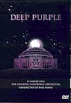

_This review was written by me for **MichaelDVD**, an Australian DVD review site that is no longer online. A capture of the site is held by the Internet Archive: **[browse it there](https://web.archive.org/web/20220217040146/http://www.michaeldvd.com.au/)**. It is reproduced here from my own copy of the site, as part of the record of what I have written._

_1999 · directed by Anthony Powell._

## The film

Well, what can I say about **Deep Purple**? One of the seminal British rock bands, it has undergone no less than nine incarnations (changes in the band line up) since it was originally founded in the mid 1960s. Some regard the "canonical" version to be Mark II (June 1969 - 30 June 1973) consisting of **Ritchie Blackmore**(guitar), **Ian Gillan**(vocals), **Roger Glover**(bass), **Jon Lord**(keyboards), and **Ian Paice**(drums). Many fans moaned the departure of **Ritchie Blackmore**in 1975. More than ten years later (April 1984 - April 1989) the band would return back to this configuration (Mark V) but some fans feel never did quite recapture the glories of the past. Even more recently, the band returned back to this line up for a brief period (Autumn 1992 - 17 November 1993) as Mark VII.

My brother was a strong fan of Deep Purple (I did remember at least two of their albums - _Machinehead_and _Made in Japan_) and it was partly out of respect for him that I've agreed to review this DVD.

Recorded live at The Royal Albert Hall during two concerts on 25 & 26 September 1999 together with the **London Symphony Orchestra**conducted by **Paul Mann**, this concert features the latest incarnation (Mark IX) containing:

- **Ian Gillan**(vocals)
- **Roger Glover**(bass)
- **Jon Lord**(keyboards)
- **Steve Morse**(guitar)
- **Ian Paice**(drums)

As you can see, this configuration is almost identical to Mark II/V/VII apart from the substitution of **Ritchie Blackmore**for **Steve Morse**. It's nice to see most of the boys back together again!

The track listing is:

|  |  |
| :-- | :-- |
| 1. _Pictured within_(**Jon Lord**) Featuring **Jon Lord**, **Miller Anderson**and the LSO. 2. _Wait a while_(**Jon Lord**) Featuring **Jon Lord**, **Sam Brown**and the LSO 3. _Sitting in a dream_(**Roger Glover**) Featuring **Ronnie James Dio**and **Graham Preskett**. 4. _Love is all_(**Roger Glover**/**Eddie Hardin**) Featuring **Ronnie James Dio**, **Eddie Hardin**and **Mickey Lee Soule**. 5. _Wring that neck_(**Blackmore**/**Simper**/**Paice**/**Lord**) Featuring **Ian Paice**together with **The Kick Horns**. 6. _Concerto for Group and Orchestra_(**Jon Lord**) - _Movement I_ Featuring **Deep Purple**and the LSO. 7. _Concerto for Group and Orchestra_(**Jon Lord**) - _Movement II_ Featuring **Deep Purple**and the LSO. | 1. _Concerto for Group and Orchestra_(**Jon Lord**) - _Movement III_ Featuring **Deep Purple**and the LSO. 2. _Ted the Mechanic_(**Deep Purple**) Featuring **Deep Purple**and **The Kick Horns**. 3. _Watching the Sky_(**Deep Purple**) Featuring **Deep Purple**and the LSO. 4. _Sometimes I feel like screaming_(**Deep Purple**) Featuring **Deep Purple**and the LSO. 5. _Pictures of home_(**Blackmore**/**Gillan**/**Glover**/**Lord**/**Paice**) Featuring **Deep Purple**and the LSO. 6. _Smoke on the water_(**Blackmore**/**Gillan**/**Glover**/**Lord**/**Paice**) Featuring all. |

Right from the start, we get the feeling that this is no ordinary **Deep Purple**concert. The opening number, _Picture Within_, features a rather lush, quiet, romantic and symphonic arrangement (not words you might ordinarily associate with the band!). Fans of the band could be forgiven for wondering if they've stepped into some sort of bizarre parallel universe, or at least an episode of the _Twilight Zone_, or maybe they've wandered into a _Three Tenors_recital by mistake (the guest singer **Miller Anderson**even looks remarkably like **Luciano Pavarotti**!). The tempo doesn't become upbeat until Chapter 4 (_Love is all_), and most of the early songs feature guest singers (eg. **Sam Brown**, **Ronnie James Dio**) and even guest musicians - the "impromptu" jazz ensemble **The Kick Horns** with **Annie Whitehead**(trombone), **Paul Spong**(trumpet/flugelhorn), **Roddy Lorimer**(trumpet/flugelhorn), **Simon C Clarke**(baritone/alto sax/flute), and **Tim Sanders**(tenor/soprano sax).

The _Concerto for Group and Orchestra_sounds rather bombastic, but seems to me more like a pastiche of various themes (from different classical periods) rather than an integrated musical work. I'm glad to see **Steve Morse**strutting his stuff in the guitar solo in _Movement I_. By the way, this is the 30th anniversary live performance of the _Concerto_.

_Ted the Mechanic_and _Watching the Sky_are more "traditional" Purple arrangements and _Sometimes I feel like screaming_ features fairly good integration between the band and orchestra, plus a guitar solo from **Steve Morse**that really rocks the hall down. _Pictures of home_ends the concert, but of course we all know the night is not over until the band plays the perennial favourite _Smoke on the water_as an encore.

In conclusion, "This is **Deep Purple**, Jim, but not as we know it."

## The video transfer

This is a superb full-frame transfer, encoded at high transfer rates (exceeding 8 Mb/s).

The sharpness and detail is so good you can count the number of pores on the faces of the musicians during close ups.

Likewise the colour saturation is superb and pretty much reference quality.

Even though the video source looks remarkably clean, the transfer seems to be riddled with minor artefacts such as aliasing, shimmering and minor pixelation, particularly in dim situations.

There are no subtitles on this disc, which is a pity as I wouldn't mind being able to view the lyrics to some of the songs.

This is a single sided dual layer disc (**RSDL**). The layer change occurs at 67:08 between Chapters 7 and 8. This is mildly disruptive but as good a place as any since it is between songs.

## The audio transfer

There is only one audio track on this disc - Dolby Digital 5.0 encoded at 448 Kb/s.

The surround mix rather aggressively positions the musicians and even vocals across all channels, creating the illusion that you are sitting amongst the musicians rather than in the audience - a rather disconcerting experience for me. The track will sound the best if you have five full range speakers as quite a lot of bass is directed even to the rear surround speakers, which is just as well since there is no separate low frequency channel.

The audio quality is quite high, creating a full-bodied sound without sacrificing the ability for finer detail to come through. There is however a tendency for **Jon Lord**'s organ to sound slightly distorted. The only I can complain about is that the very high frequencies seem slightly rolled off, perhaps in order to mask Dolby Digital high frequency artefacts.

I found the dialogue in between songs to be fairly hard to follow, and of course **Ian Gillian**'s singing style is such that I can't decipher the lyrics well.

## The extras

This is a pretty minimalist DVD.

### Menu

The menus actually feature animation and audio, though the animation is rather subtle. Interestingly, the song selection screens don't present you with a list of songs, but using the up and down keys will move from song to song. The currently selected song will always scroll across the screen in purple font.

### Discography

This is a set of stills listing band albums from the 1960s to the 1990s.

### Booklet

This is an eight page booklet with some somewhat rambling notes on the _Concerto_by **Jon Lord**on page 3, a montage of the band members (in black and white) in the centre pages, and musician and production credits on the inside back cover.

## Censorship

As far as we have been able to ascertain, there are no censorship issues with this title.

## Region 4 versus Region 1

As far as I can tell, this disc the same all over the world, apart from NTSC vs PAL formatting.

## Summary

**Deep Purple-In Concert With The London Symphony Orchestra** features some rather interesting versions of Deep Purple classics as performed by the band together with a full symphonic orchestra and some guest musicians. I found it quite enjoyable and it is presented on a DVD with a superb video and audio quality. Unfortunately, the disc is pretty devoid of extras.

| Rating  | Score         |
| :------ | :------------ |
| Plot    | ★★★★½ 4.5 / 5 |
| Video   | ★★★★½ 4.5 / 5 |
| Audio   | ★★★★½ 4.5 / 5 |
| Extras  | ½ 0.5 / 5     |
| Overall | ★★★★ 4 / 5    |
