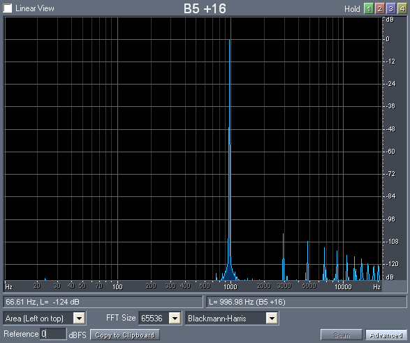
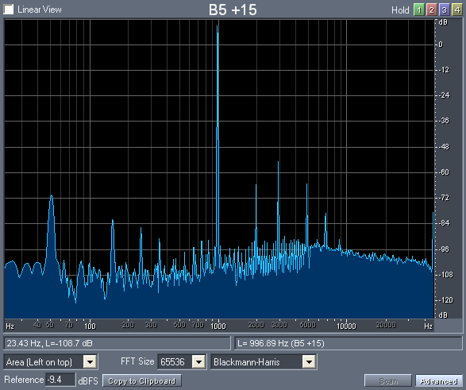
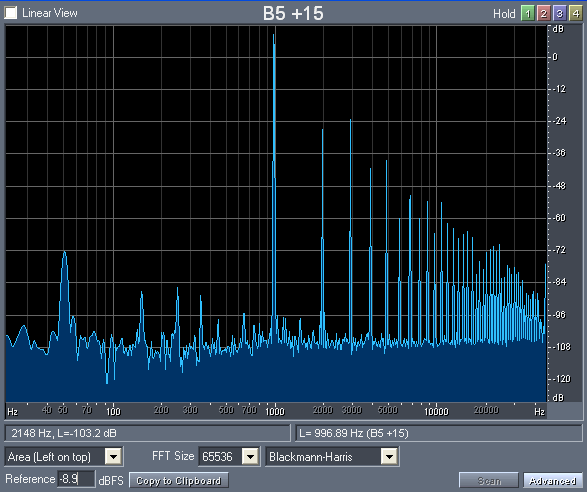
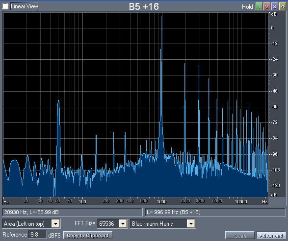
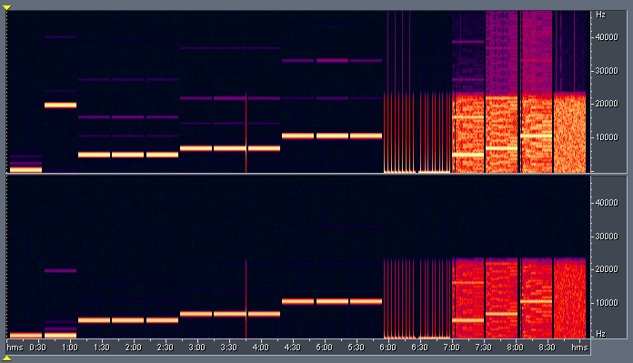
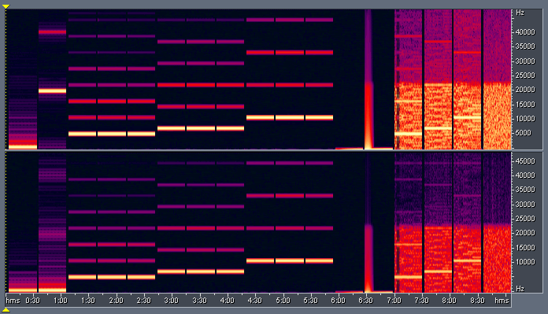

_This article was published on my own website at `users.bigpond.net.au/christie/`, which no longer exists. No capture of this page survives in the Internet Archive. It is reproduced here from my own copy of the site, as part of the record of what I have written._

This is the theoretical frequency analysis of a digitally generated 997Hz Sine wave at 44.1kHz 16-bits resolution:

Notice the presence of harmonic artefacts at 3x, 5x, 7x, ... of 997Hz, but these are below the theoretical CD dynamic range of 96dB so they are "OK."

This is the output of the Sony SCD-XA777ES playing back the file, recorded at 96kHz 24-bits:

The noise at 50Hz is due to the power supply (240V 50Hz in Australia). Note the presence of harmonic distortion at 1994Hz, 2991Hz, 4985Hz and 6979Hz, corresponding to 2x, 3x, 5x and 7x fundamental frequency of 997Hz. Although this is not a "great" result, nevertheless the harmonics are below -60dBFS.

This is the output of the same player, but now routed through the AVC-A1SE+ and taken from the analog recording outputs:

Notice that the harmonic distortion is far higher, corresponding to 2x, 3x, 4x, ... of 997Hz, and reaching as high as -24dBFS.

This is the output of a completely different player (Panasonic DVD-RP82), also routed via the amp, recorded using a completely different sound device (Edirol SD-90), recorded at 44.1kHz 24-bits:

Notice the very similar pattern of distortion, proving that the phenomenon is independent of player and recording device.

This is the spectral analysis of the complete recording of my "test" CD containing various sine waves, square waves and noise (taken directly from the player):

Here it a similar diagram, but for the recording taken from the amp's recording output:

Notice how consistent the harmonic distortion is. It makes for a pretty picture, but bad audio.
