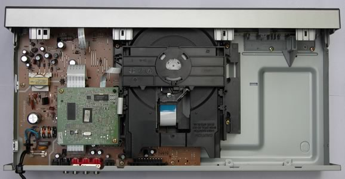
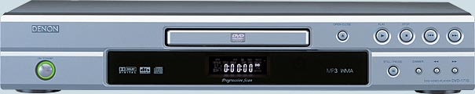
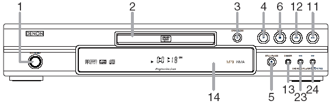
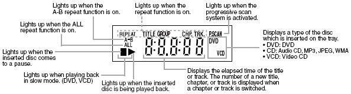
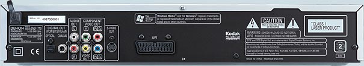
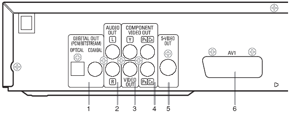
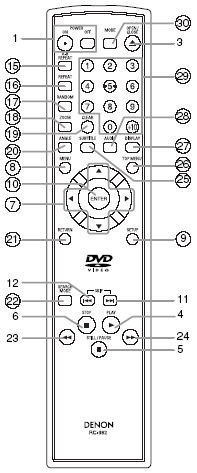
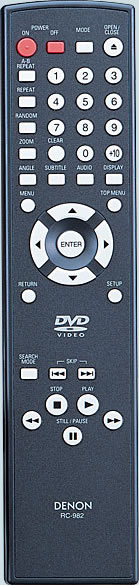

_This review was written by me for **MichaelDVD**, an Australian DVD review site that is no longer online. A capture of the site is held by the Internet Archive: **[browse it there](https://web.archive.org/web/20220217040146/http://www.michaeldvd.com.au/)**. It is reproduced here from my own copy of the site, as part of the record of what I have written._

In the last few years, Denon has built a solid reputation for their high end "universal" players, featuring advanced video and audio technology. Denon is hoping that their reputation will make quality-conscious but budget-limited consumers attracted to their entry-level players.

The DVD-1710 is the lowest cost player in the latest product line. Essentially, it is a basic progressive-scan DVD player supporting component, RGB (SCART), S-video and composite analog video outputs. Analog audio output is limited to two channels, but optical and coaxial digital outputs are available for external surround decoders. There is no support for digital video outputs such as HDMI or DVI/HDCP, nor will the player play Super Audio CDs or DVD-Audio discs.

However, the DVD-1710 will play Video CDs, Kodak Picture CDs, plus MP3, WMA and JPEG files on data CDs/DVDs. It officially supports all the recordable formats (CD-R, CD-RW, DVD-R, DVD-RW, DVD+R, DVD+RW).

So, how much of the fancy technology implemented in Denon's high end players have "trickled down" onto this player? Let's find out ...

## What's In The Box

The review unit I received seemed to be a production unit, and it came in a box weighing 2.9kg. Inside the box were:

- the player itself, with a captive power cord
- a remote control (plus 2AA batteries)
- an RCA 3-core audio/video cable cable (composite video, left and right audio)
- an owner's manual and service locations listing

The review unit was silver in colour (apparent black is also available). Like almost all low cost DVD players available today, the unit is manufactured in the People's Republic of China.

Opening up the unit revealed how little there is in this player. Apart from the transport unit (in the middle), there is a main board (brown) on the left side containing the power supply and analog audio/video circuits. The digital processing board is the small green board stacked above the main board. Finally, there is a small board housing the transport controls and display for the front panel. That's it.

The underside of the green board reveals that this is pretty much an "everything on a single chip" player typical of many low cost designs. The chip is designated "Dolby Digital DTS FEDSY 0SZBAORMS025 02 413U3B34 JAPAN" but I couldn't find any information on the Internet about it. There is also a chip with a label entitled ""E5D100-GC2S" stuck on top - I'm assuming this is either the firmware in ROM or some sort of programmable logic array. Apart from that, a TI L324 op amp, an NEC 2561A optocoupler, and a Samsung K4S641632H memory chip, that's basically it. It's amazing how few components are required for a fully functioning DVD player these days.

I could not find the video and audio D/A converters, so I assume they must be mounted on the underside of the main board. The video D/A spec is pretty ordinary - 10-bit 54MHz, but the audio D/As are supposedly Burr Brown PCM-1756 - which are rated at 192kHz/24-bits with 106dB S/N.

## Front Panel

The DVD-1710 has a fairly minimalist front panel, consisting of (from left to right):

- A power standby toggle (1), with a nice indicator light surrounding it in a ring (red for standby, green for on)
- disc tray (2), with the remote sensor (20) and fluorescent display (19) beneath
- OPEN/CLOSE Button (3)
- Disc Navigation Buttons - PLAY (4), STILL/PAUSE (5), STOP (6), Skip Back (12), Skip Forward (11), Scan Back (23), Scan Forward (24)
- Front panel (14) and dimmer button (13) for the panel (with two levels of display brightness, plus an "off" mode)

Compared to the more fully featured models, the DVD-1710 has a fairly basic front panel:

## Rear Panel

From left to right, we have:

- Digital out - coaxial and optical (1)
- Stereo audio analogue outputs (2) (RCA)
- Composite video output (3) (RCA)
- Component video out (4) (RCA)
- S-Video output (5)
- SCART terminal (6)

## Remote Control

The remote control is designated RC-982, and is in a fairly traditional design consisting of three main sections: the numeric keypad (29) and special function keys on top, menu navigation and setup keys in the middle, and playback control keys at the bottom.

Overall, not a bad design but I wish the Play and Stop buttons were differentiated from each other since I can never remember which is which in a dark room. The buttons do not light up in the dark, nor are they fluorescent.

Denon seems almost unique amongst Japanese manufacturers in using different buttons for Power On and Off (1). I found out that the reason for this is so that you can program "turn all units on" (or off) type macros in your universal remote controller without worrying about whether the unit is currently on or off. This seems like very smart thinking, and I wish more manufacturers would do the same.

The Mode button (30) is used to program selected playback order for CDs plus WMA/MP3/JPEG files, and also enter into slide show mode for JPEG files. Use the cursor and Enter keys to add a programmed selection. On DVDs, the button allows picture control settings to be changed, as well as activating/deactivating the virtual surround feature. The CLEAR button (19) clears the most recent programmed selection, and also the "A" point in an A-B repeat sequence.

The Mode button can also be used to change the dialog speed to 0.8 or 1.3 times normal speed. This will only work for Dolby Digital audio tracks, and the player resamples the audio into Linear PCM. I can't quite imagine why I would need this feature, unless I was in a hurry and wanted to finish the film earlier by playing it faster, or perhaps i might want to slow down the dialog to learn a foreign language.

The Open/Close button (3) works pretty much as you would expect.

Pressing the A-B repeat button (15) repeatedly cycles through setting the "A" repeat point, the "B" repeat point, and exiting A-B repeat mode (this does not work for WMA/MP3 files). The Repeat button (16) cycles through chapter/track repeat, title/entire CD/folder repeat, and no repeat. Random (17) will select a pseudo-random sequence of tracks to play for CDs and WMA/MP3/JPEG files.

The Zoom button (18) cycles through no zoom, 2x and 4x zoom modes (4x only available on DVDs). Use the cursor keys to move the zoom window around the frame.

The Angle (20), Subtitle (25), Audio (28) buttons cycles through all available camera angles, subtitles and audio tracks encoded in a DVD title respectively.

The Display button (27) toggles across various on screen display modes (see the section on On Screen Display).

Below that we get a diamond (7) containing the menu navigation buttons surrounding the ENTER button at the centre. On each side of the diamond is a button. These four buttons are:

- Menu (8)
- Top Menu (26)
- Return (21)
- Setup (9)

The Search Mode button (22) allows you direct access to a specific folder/title, chapter/track, time or marker. you can also use this button to set bookmarks (Denon calls them "markers") allowing the player to memorize a particular point on the disc allowing you to return to it later. However, the markers are not remembered when the player is switched off or enters stand by mode, thus severely reducing the usefulness of the feature.

After that, we get the usual playback control buttons:

- Skip Back (12)/Forward (11)
- Stop (6)
- Play (4)
- Search Back (23)/Forward (24)
- Still/Pause (5) - when in Pause mode this button advances to the next frame

When in stand-by mode, the unit can be woken up by pressing the Power On, Play and Open/Close buttons.

The DVD-1710 is quite usable as a player, except I found navigation fairly sluggish, and the remote control sensor is not particularly sensitive, requiring fairly spot-on direct line of sight from the remote to the sensor.

Picture control settings (Brightness, Contrast, Color, Gamma and Sharpness) can be accessed via the Mode button during video playback.

The Search buttons cycles through various fast motion speeds (2X, 8X, 50X, 100X) during play and slow motion speeds (1/16, 1/8, 1/2) during Still/Pause.

Pressing the Chapter/Track skip buttons whilst the player is paused exits Pause and resume Play - this behaviour is contrary to that in most other players which will skip and pause on the next/previous Chapter/Track.

## Manual

The manual breaks the Denon tradition by being typeset in portrait rather than landscape orientation, but retaining the concept of two columns of text on each page. It is fairly thick, but this is because it has versions for several languages (English, French, German, Dutch, Spanish, Italian and Swedish). The English section is only 27 pages.

The operating instructions are organised by function, with labels on top of each section indicating whether the instruction are applicable to DVD, VCD, CD, MP3, JPEG or WMA respectively. I think it would have been easier to describe the functions for each type of disc in separate sections.

Whilst most of the functions on this player are fairly intuitive, some are not, and I would encourage you to read the sections describing the operation of the Mode and Search Mode buttons, as they access multiple functions. Also, if you plan to play MP3/WMA or JPEG files, it's helpful to know that the Menu button puts you into the navigation menu and the Mode button initiates a slide show.

## Set-Up Menu

The set-up menu is accessed by pressing the Setup button. You get a choice of three modes:

1. Quick (allows you to quickly set common parameters)
2. Custom (allows access to all setup parameters)
3. Initialise (reset settings to default)

The Custom setting is divided into four groups (the settings in **bold**are also available in Quick mode):

1. Language

- Dialog (default: Original)
- Subtitle (default: Off)
- Disc Menu (default: English)
- **OSD**(default: English)

2. Display

- **TV Aspect** (default: 4:3 letter box, 4:3 pan & scan, 16:9 wide)
- Still Mode (default: Auto, Field, Frame)
- Angle Icon (default: On, Off)
- Auto Power Off (default: On, Off)
- Panel Display (default: Bright, Dimmer, Auto)
- Video Out (default: SCART, Component Interlace, Component Progressive)

3. Audio

- Dynamic Range Control (default: On, Off)
- LPCM Select (default: Off, On for downsampling 96 to 48kHz)
- **Dolby Digital**(default: On, Off)
- **DTS**(default: On, Off)
- **MPEG**(default: Off, On)

4. Ratings

- Rating Level (default: All, 1-8)
- Rating Password (reset password: 4737

## Video Playback

I calibrated the player by adjusting the display settings of my Sony VPL-VW11HT LCD projector (and leaving the Picture Mode of the DVD player on "Standard") using the [**_Digital Video Essentials_**](http://www.videoessentials.com) test discs (both NTSC and PAL), as well as using the older title (_**[Video Essentials](http://www.videoessentials.com)**_).. The player's video output must be close to reference levels, for my adjusted settings were very close to the default settings.

I only tested the player in progressive scan mode (for both PAL and NTSC titles). I did briefly put the player in interlaced mode to verify that it outputs interlaced video correctly.

The review unit is multi-region enabled and I had no difficulty playing a number of Region 1, 2 and 4 discs (including R1 RCE discs). Even discs that do not play properly on my old player - the Pioneer DV-626D - (including _When Harry Met Sally_and the layer change of several discs including _Fried Green Tomatoes_) play perfectly fine on the player. I am not sure whether retail units will be multi-region enabled out of the box.

The player delivers a fairly decent video output performance and quality that is only a few notches below state of the art. I put it through the usual battery of tests, consisting of various discs known for causing problems in other players as well as Microsoft's WHQL DVD Test Annex 3.0, and it passes almost all the tests except for the deinterlacing ones (more about this in the section on progressive scan).

Most importantly, this player appears to be completely free of the chroma upsampling error or interlaced chroma upsampling problems - which is the first Denon player I have tested that passes all the chroma tests successfully. Kudos to Denon for finally releasing a progressive scan player that does 4:2:0 chroma upsampling correctly!

In terms of detail and colour accuracy, the player does a reasonable job, though with a tendency towards moire patterns on low level detail, Gibbs effect ringing on high contrast transitions, and occasional shimmering compared to the very best players available today, but much better than early generation players. It passes PLUGE (or below black) information correctly, and does not appear to clip above-reference whites. It is able to resolve still frames to the full DVD resolution of 720x480 (NTSC) and 720x576 (PAL).

In terms of handling slow pans, the player is probably ever so slightly juddery compared to "state of the art" but probably not to an annoying level. It is very good at maintaining resolution for moving objects and I hardly noticed any pixelisation or macro-blocking except for worst case scenarios - this is actually fairly decent performance for any set top box player, let alone a player in the price range of the DVD-1710.

With only a 2MB buffer, I didn't expect the player to be able to handle layer changes seamlessly 100% of the time. However, I was surprised that it managed to handle the layer change in Region 4 edition of Fried Green Tomatoes at the Whistlestop Cafe - many more expensive players have stumbled on this. The WHQL DVD Test Annex 3.0 disc has a "worst case scenario" layer change - scrolling text encoded at high bitrate. The player paused for nearly two seconds on this change - which is probably on the limit of acceptability.

In summary then, decent, but not "state of the art" video performance.

## Progressive Scan

The DVD-1710 fully supports both NTSC and PAL progressive scan. In essence, it reconstructs a progressive NTSC or PAL frame from adjacent half-frames (intended for interlaced display) stored on the disc.

The deinterlacing performance can only be described as average, as the player seems to be mostly flag reading. It fails a number of the tougher cadence tests of DVD Test Annex 3.0 - including incoherent 3-2, 2-3-3-2 sequences, or film mode recognition. Fortunately, it seems to recover from bad edits fairly quickly, usually within a split second or so.

The player is much better in weave mode rather than Bob, as can be evidenced from the rather pixaleted, aliased and juddery presentation of the NTSC DVE's Snell and Wilcox Zone Plate test (field rate). Even in frame rate though, evidence of aliasing can still be seen.

In summary, don't expect the same level of progressive scan performance as Denon's top of the line players, but if you are using this player in interlace mode, it should be fine.

## On Screen Display

The on-screen display is accessed while the DVD playing by pressing the "Display" button on the remote control. It's pretty basic and features a single row on the screen. The following information is cycled on repeated presses of the Display button:

- Elapsed and remaining playing time for current chapter/track (plus no. of chapters in current title)
- Elapsed and remaining playing time for current title/entire disc (plus no. of tracks/titles on current disc)
- Additional information, such as bit rate and repeat modes.

The really good news is that the DVD-1710 is the first Denon player I have reviewed that features a layer indicator, allowing you to find out which layer in an RDSL DVD is currently being accessed, and determine the precise location of the layer change. So far, I have only seen this feature in Sony DVD players, so this is an interesting feature indeed.

The player does not appear to recognize CD Text or DVD Text, but then very few DVD players do (apart from Sony).

## Standards Conversions

The player does not appear to support conversion from PAL to NTSC or NTSC to PAL.

The player can be set to convert from Dolby Digital/dts/MPEG to PCM on the digital out connections.

## Other formats

The DVD-1710 had no problems playing a selection of CD-R and CD-RW discs that I inserted into it, including gold and blue/green discs recorded at various speeds. It was able to correctly recognize CD-Rs and CD-RWs containing:

- PCM audio tracks ("Redbook" format)
- dts music CD (encoded in pseudo "Redbook" format)
- ISO9660 CD-ROM containing MP3/WMA audio files
- ISO9660 CD-ROM containing JPEG image files

The player also had no problems with various recordable DVDs that I threw at it. I tried a variety of home-burnt DVD-Video, DVD-ROM discs containing MP3 and JPEG files.

In addition, the player had no problems recognizing the following types of commercially pressed discs:

- Video CD ("_James Bond: The Man With The Golden Gun_")
- DVD-Video containing PCM 96/24 audio track (also known as a "Digital Audio Disc" or DAD) (The Alan Parsons Project "_I Robot_")

## WMA/MP3 and JPEG Playback

The player's WMA and MP3 playback implementation is based on a typical "Explorer"-like on-screen display of folders and tracks, but only if you press the MENU key after the disc has been inserted and successfully recognised (otherwise you get a very unhelpful background screen). The navigation keys can be used to navigate in and out of folders and to select MP3 files to play. The player even reads multi-session discs correctly on both CD-R and CD-RW. The player will support constant bit rate MP3 files (as long as the transfer rate is at least 96Kb/s or above) as well as variable bit rate MP3 files (although the manual recommends constant bit rate files greater than 112Kb/s). Surprisingly, it recognises long file names ("Joliet") up to 25 characters, but doesn't seem to support ID3 tags (it will, however, support WMA tags) or playlists.

| **Test Disc Format** | **Results** |
| :-- | :-- |
| CD-R >100 MP3s (128 Kb/s) in multiple, nested subdirectories | Found all files |
| CD-R >100 MP3s (128 Kb/s) in root directory | Found all files |
| CD-R with MP3s (CBR ranging from 20-320 Kb/s, VBR ranging from 1%-100% quality), 1 WMA and 1 WAV file | Successfully played all constant bit rate files between 96-320 Kb/s. Recognises but skips CBR files with bitrates less than 96Kb/s. Recognized and successfully played all VBR files. Recognized and successfully played WMA file. The manual indicates that the player supports WMA9 files ranging from 48-192Kb/s. |
| Multisession CD-RW (2 sessions each containing MP3 files) | Found all files in both sessions |

The player's JPEG image display capability allows you to view JPEG still images (presumably scanned from your photo album or taken using a digital camera) burned onto an ISO9660 CD-R. The implementation is very similar to the MP3 playback menu - showing folders stored on the disc and filenames of images with a .JPG extension. In fact, you can even play a disc containing a mixture of MP3 and JPEG files correctly. It will display successive images in a slide show (if you press the MODE key - not very intuitive) with programmable delays between images.

Unfortunately, the player does not recognize a disc with more than 512 images in total (across all folders). I thought this was an important limitation that should be disclosed in the manual.

The player will automatically resize the JPEG image to fit within an NTSC progressive frame. It uses up the full NTSC frame, but with some allowance for display overscan.

## Audio Playback

I suspect many people will probably pair this player with a digital surround processor or amplifier/receiver and only use the digital outputs, so to a certain extent the audio performance of the player is not that relevant.

This would be a pity as the player seem to perform quite decently on a variety of material: mainly CDs, the PCM audio tracks of DVDs and 96/24 high resolution Linear PCM on selected DVDs.

The overall sound of the player's analog audio output (2 channels only) is clean and dynamic, with a tendency towards a slightly harsh and 'bright' sound only when compared to more expensive players.

I suspect the player's outputs are slightly "hot" because CDs that I played sounded slightly louder compared to my other players and the D/A processing on my amplifier.

Compared to more expensive players, low level recovery and ambience is only mediocre, although this is compensated somewhat by a slightly larger than life soundstage and good dynamics/transient handling (as noted earlier).

Some of the brightness/coarseness are softened somewhat when listening to high resolution 96/24 Linear PCM audio tracks on DVDs, and here the player gave a very creditable performance, coming so close to the performance of the built-in D/A converters in my Denon AVC-A1SE amplifier that I was not able to reliably distinguish between the two.

I did not test Dolby Digital decoding but given that the player downmixes everything to 2.0 channels I would not really recommend using this player's internal decoders. It will decode MPEG-2 Audio into Linear PCM and this seems to be handled reasonably well.

Audio synchronization (on both analogue and digital outputs) is excellent, and the usual problem sequences (on _**Wedding Singer**_R4 second remastered edition and also _**Matrix**_R1) played perfectly, as well as a A/V timing clock test on DVE.

Like all other Denon players that I have tested to date, the DVD-1710 does not handle material encoded with [0dBFS](http://www.audioholics.com/techtips/specsformats/0dbfsdigitalplayback.php)+ levels, resulting in distorted waveforms.

In summary, I think the player delivers acceptable sound quality in 2 channel mode. Its limitations are only apparent when comparing to far higher priced players. It should sound quite good on the majority of systems.

## Disc Compatibility Tests

��� I tested the player against a number of discs to highlight potential problems: _Specific Tests_

| **Disc** | **What Is Tested** | **Results** |
| :-- | :-- | :-- |
| The Matrix R1 Follow The White Rabbit | Tests active subtitle feature, seamless branching, ability to load hybrid DVD/DVD-ROM and audio sync. | YesYesYesYes |
| Wedding Singer Remaster 2 R4 Audio Sync | Opening scene tests audio sync. | Yes |
| Terminator: SE R4 Menu Load | Tests ability to load complex menu | Yes |
| Independence Day R4 Seamless Branching | Tests ability to handle seamless branching (Chapter 3) | Yes |
| Patriot R1 RCE | Tests ability to handle RCE protected DVDs in Auto multizone mode (if applicable). | Yes |
| Toy Story R1 Chroma Upsampling | Tests for presence of chroma upsampling error (Chapter 3 and 4) | Yes |

As you can see, the DVD-1710 passes all tests.

## User Convenience Features

| Screen Saver | No  |
| :----------- | :-- |
| Zoom         | Yes |

## Overall

### The Good Points

- Acceptable picture (particularly in interlaced mode) and sound quality
- official support for both PAL and NTSC progressive scan
- no chroma upsampling error
- has RSDL layer indicator
- will playback JPEG images, Fujicolor CDs and Kodak Picture CDs

### The Bad Points

- Not a universal player, and no support for digital video (HDMI/HDCP/DVI) connections
- No multi-channel analog audio outputs
- mediocre progressive scan performance
- does not remember bookmarks or "markers" when player is turned off or enters stand by
- no support for various features including CD/DVD Text, Jacket Pictures, CD index points

## Features At A Glance

| **Video** | Component Output | Yes | RGB Output | Yes |
| :-- | :-- | :-- | :-- | :-- |
| **Progressive Scan** | NTSC | Yes | PAL | Yes |
| **Audio** | DTS Output | Yes | MP3 Playback | Yes |
| **High Resolution Audio** | DVD-Audio | No | Super Audio CD | No |
| **CD-R/RW, DVD-R/RW** | Yes |  |  |  |
| **Conversion** | None |  |  |  |
| **Inbuilt Decoder** | Dolby Digital (2-ch only), MPEG-2 Audio (2-ch only), MP3, JPEG, WMA |  |  |  |

## In Closing

The Denon DVD-1710 appears to be a decent player and certainly deserves to be the entry-level offering in Denon's excellent line-up of DVD players, but don't expect it to have the same video or audio performance as the top-of-the-line models. If you don't have a TV that supports progressive scan, and if you primarily listen to it via the digital audio outputs, it may just be the right player at the right price, with a interlaced video quality that's more than acceptable and only a few notches below state of the art.

## [Ratings (out of 5)](../Ratings.html)

| **Performance**     | ★★★  |
| :------------------ | :--- |
| **Build Quality**   | ★★★★ |
| **In Operation**    | ★★★★ |
| **Compatibility**   | ★★★  |
| **Value For Money** | ★★★★ |

## Technical Specifications (Manufacturer Supplied)

| **Product Type:** | DVD-Video, Video CD, Audio CD, WMA/MP3/JPEG CD, Kodak Picture CD player |
| :-- | :-- |
| **Region:** | 4 (multi-region enabled) |
| **Signal System:** | PAL / NTSC |
| **Serial Number Of Unit Tested:** | 4047300037 |
| **MPEG Decoder:** | FEDSY 0SZBAORMS025 |
| **Audio Frequency Response:** | 4 Hz-20 kHz (CD) |
| **Signal to Noise Ratio:** | 115 dB |
| **Dynamic Range:** | 98 dB |
| **Total Harmonic Distortion:** | 0.004% |
| **Dimensions:** | 435 mm (w) x 220mm (d) x 75mm (h) |
| **Weight:** | 1.9 kg |
| **Price:** | \$299 |
| **Distributor:** | Audio Products Australia 67 O'Riordan Street Alexandria NSW 2015 |
| **Telephone:** | 1 800 642-922 |
| **Facsimile:** | 1 800 246-262 |
| **Email:** | info@audioproducts.com.au |
