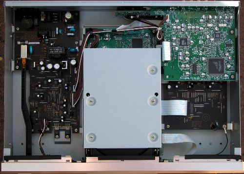
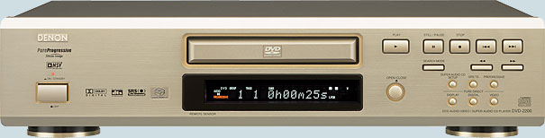
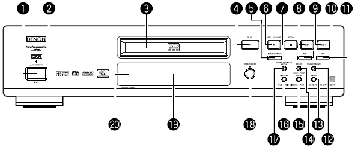
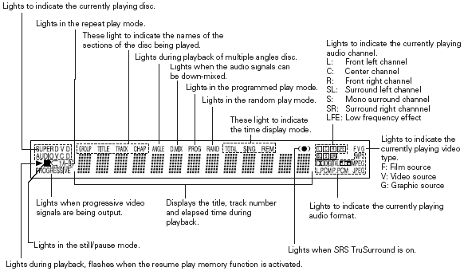
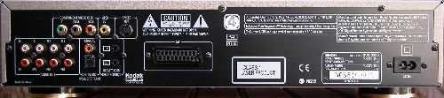
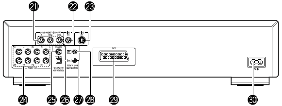
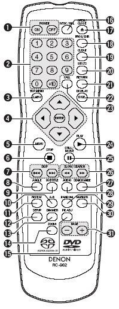
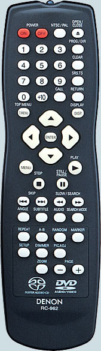

_This review was written by me for **MichaelDVD**, an Australian DVD review site that is no longer online. A capture of the site is held by the Internet Archive: **[browse it there](https://web.archive.org/web/20220217040146/http://www.michaeldvd.com.au/)**. It is reproduced here from my own copy of the site, as part of the record of what I have written._

It wasn't too long ago that Denon DVD players were simply rebadged Panasonic players, with modifications limited to some tinkering around the audio stages. Then Denon got brave and started designing their own players, beginning with the DVD-2800 and ending up with two universal players: the DVD-2900 and the DVD-A11.

Denon has now released their third universal player, the DVD-2200, this time trickling down technology from their more expensive players to their most affordable universal player to date - a mere A\$1,299 will give you the ability to watch DVDs in both NTSC and PAL progressive scan, plus satisfy your yearning to listening to high resolution audio by supporting both Super Audio CD and DVD-Audio formats.

The DVD-2200 supports all the formats of the DVD-2900, including:

- DVD-Video (with inbuilt decoders for Dolby Digital and dts)
- DVD-Audio (with inbuilt decoder for MLP)
- Super Audio CD (with support for both stereo and multi-channel tracks, plus access to the CD layer for Hybrid discs)
- Video CD
- CD audio ("Redbook")
- Kodak Picture CD (note: this is not the same as a Kodak Photo CD)
- Fujicolor CD
- DVD-R/RW (burned as DVD-Video or DVD-Audio)
- CD-R/RW (burned to contain either CD Audio, MP3 or JPEG files)

The following media/formats do _not_ appear to be supported:

- DVD+R/RW (although I tested a few home-burned ones and they appeared to work)
- Super Video CD
- HDCD
- "DivX" MPEG-4 discs
- ISO 9660 formatted CD-ROMs containing Windows Media Audio (WMA) or HighMat
- Kodak Photo CD
- DVD-ROMs containing Microsoft Windows Media audio and video

The DVD-2200 seems to have retained nearly all the "good bits" from the DVD-2900:

- Silicon Image/DVDO PureProgressive (SiI504) Decoding Engine
- Analog Devices ADV-7300AKST, 12 bit/108 MHz 4:4:4 Video D/A Conversion system featuring Noise Shaped Video processing
- Mitsubishi (M3210256FP) MPEG/DVD-Audio decoder
- Analog Devices Melody-32 digital signal processor
- Sony CXD-2753R DSD decoder
- 8MB transport buffer

So what exactly are the features that are missing or different? Not much, as far as I can tell. The build is smaller and lighter, the disc tray looks a bit flimsier, the front panel looks a little bit different. The back panel is missing the RS-232C connector (for home automation control units), but I doubt many people would need one. Also, the following components are different:

- Texas Instruments/Burr Brown DSD1791 Audio D/A converters (the DVD-2900 uses a customised-for-Denon model called DSD1790)
- smaller power supply

The only mechanical issue I encountered whilst using the player was a tendency for the player to generate a rather noticeable "whirring" sound during operation - this sound can be quite distracting if you are close enough to the player to hear it.

## What's In The Box

The review unit I received seemed to be a production unit, and it came in a box weighing 6.9kg. Inside the box were:

- the player itself
- a remote control
- an IEC power cord
- an RCA 3-core audio/video cable cable (composite video, left and right audio)
- an owner's manual and service locations listing

The review unit was gold in colour (apparent black and silver are also available).

Opening up the unit revealed a logical layout, with separate boards for the power supply (left), a digital processing board containing transport and navigation logic (centre) below the transport unit, and on the right a video processing board stacked on top of the audio board. Behind, there is a small circuit board that converts the component video output into RGB for the SCART socket. In front, there is another small circuit board that has the logic for the front panel controls and display.

As you can see, the power transformer for the DVD-2200 is smaller than the DVD-2900, and Denon has saved the cost of heatsinks by screwing the two voltage regulators (7805R JRC) directly onto the bottom part of the chassis.

The digital processing board contains the Sony CXD2753R DSD DSP and decoding chip. I also noticed the Analog Devices Melody-32 Audio Processor (ADSST-MEL322), plus a few other chips - a Winbond W986416DH-7, an MXE032045, an ESMT M111L16161SA, and a 29LV160BTC-90 - I think some of these are memory chips. I also noticed an interesting Panasonic chip labelled MN102H4608 - I wonder what this chip does. The DVD-2200 uses the same Mitsubishi MPEG decoder as the DVD-2900 (quite possibly a chip labelled M3210256FP that I saw on the board).

The video processing board contains the Silicon Image Sil504 (Sil504CM208), and has no less than 2 Video DACs - the 108MHz/12-bit Analog Devices ADV7300AKST and the 54MHz/10-bit Analog Devices ADV7190KST. I don't know why two Video DACs are used, since each Video DAC already has 6 channels - enough for a full complement of composite, S-Video and component video outputs. I suspect one Video DAC is used for progressive and the other for interlaced video output. I also noticed a PIC18LC242 microcontroller - I suspect this is used to generate the on-screen menus or to handle the I2C bus.

I saw NE-5532AN op amps on the audio board. Interestingly, I was not able to find the Burr Brown DSD1790 DACs - maybe they are mounted on the underside of the board?

I rate the build quality as excellent. All circuit boards are uncluttered and of high quality, and feature surface mounted components exclusively.

The player's region code was marked on the back panel. You can also check the region code by pressing both the STOP and the Forward Skip buttons simultaneously when there is no disc inserted. My review unit seemed to be originally marked as Region 2 on the back (but someone had applied a Region 4 sticker on top) and pressing STOP/Forward Skip caused the front panel display to read "REGION_A2" (the "A" presumably indicating that the player is multi-region enabled). On non multi-region enabled players the display should read something like "REGION_2".

## Front Panel

The DVD-2900 has a fairly minimalist front panel, consisting of (from left to right):

- A hard power switch (1), with a red power indicator (2) on top
- The disc tray (3), with the remote sensor (20) and fluorescent display (19) beneath
- Disc Navigation Buttons - PLAY (4), PAUSE (6), STOP (7), Skip Back (8), Skip Forward (9), SEARCH MODE (5), Scan Back (10), Scan Forward (11)
- OPEN/CLOSE Button (18)
- SUPER AUDIO CD SETUP (17)
- SRS TS (14)
- PROGRESSIVE (12)
- Three PURE DIRECT buttons - DISPLAY (16), DIGITAL (15), VIDEO (13)

The DVD-2200 obviously has a few extra buttons compared to its bigger sisters. Of these, the SEARCH MODE button is the most useful, allowing navigation to a DVD-Video Title or DVD-Audio Group using just the front panel keys (I'll explain how this works later). SRS TS and PROGRESSIVE are only useful if you are the sort of person who needs to toggle these settings all the time (most of us will never need to).

The PURE DIRECT rotary switch on the DVD-2900, containing two user definable settings, is gone, replaced by three dedicated buttons for turning off the front panel display, digital audio out, and video output respectively. I actually think this is an improvement - I've always found the PURE DIRECT functionality in the earlier players somewhat confusing.

The DVD-2200 breaks away from its bigger sisters by using a new fluorescent display design. I quite like it. Despite being smaller and containing less annunciators, it is actually quite informative:

I actually prefer this display to the one used in the DVD-2900 - it has all the useful information from the DVD-2900 but somehow easier to read. In particular, the F, V and G flags indicating whether the video is in film (source flagged as "progressive") or video (source is inherently interlaced) are still there.

## Rear Panel

From left to right, we have:

- Component video out (21) (RCA)
- Composite video output (22)
- S-Video outputs (23)
- SCART terminal (21)
- 5.1 channel audio analogue outputs (24) (RCA) - two pairs are provided for the front left/right signals - I don't know if these pairs are differentiated in terms of signal type or quality
- Digital out - coaxial (25) and optical (26)
- Room to Room in (27) /out (28) (this is used for wired remote control protocols)
- SCART socket (29)
- Two pin power socket (30)

The set of connectors are fairly comprehensive and should suit the majority of home theatre configurations.

## Remote Control

The remote control is designated RC-962, but appears to be identical to the RC-934 remote control used in the DVD-2900, apart from one missing button - the "P.D. Memory" button (since the DVD-2200 doesn't quite implement the "Pure Direct" functionality in quite the same way).

Interestingly, there appears to be no remote control equivalent of the "SUPER AUDIO CD SETUP" button on the front panel and also no way to control the PURE DIRECT settings.

Those of you who have read my reviews of other Denon DVD players may recall that I wasn't very impressed with the typical Denon remote control. Well, I still hate the design.

The buttons are too small. Worse still, they don't light up which means this remote is next to useless in a dark room. Because many of the buttons are undifferentiated, you can't even feel your way around.

The top row consists of two red buttons labelled Power On (1), Power Off (1), and two white buttons labelled NTSC/PAL (16) and OPEN/CLOSE (17).

Denon seems almost unique amongst Japanese manufacturers in using different buttons for Power On and Off. I found out that the reason for this is so that you can program "turn all units on" (or off) type macros in your universal remote controller without worrying about whether the unit is currently on or off. This seems like very smart thinking, and I wish more manufacturers would do the same.

The next four rows have sixteen identical small buttons. Reading from top to bottom, left to right, we have the numeric keypad (2), followed by:

- Prog/Dir (18) - switch between Program and normal play
- Clear (19) - clears entered track/chapter numbers in Program mode
- V.S.S. (20) - sets virtual surround sound
- Call (23) - review Programmed tracks/chapters
- Return (21) - go back to previous menu

Below that we get a diamond (4) containing the menu navigation buttons surrounding the ENTER button at the centre. On each side of the diamond is a button. These four buttons are:

- Top Menu (3)
- Display (22)
- Menu (5)
- Play (24)

After that, we get more small buttons:

- Stop (6)
- Still/Pause (25) - when in Pause mode this button advances to the next frame
- Skip Back/Forward (7)
- Search Back/Forward (26)
- Angle (8)
- Subtitle 95)
- Audio (28)
- Search Mode (27) - directly access specific group/title or track/chapter
- Repeat (11) - repeat group/title/disc or track/chapter
- A-B (10) - repeat section between two points
- Random (29) - plays tracks/chapters in random order
- Marker (30) - mark a spot on disc to return to later (this is not as useful as you think because the player does not memorize markers when you eject the disc or turn the player off)
- Setup (12) - enters setup menus
- Dimmer (13) - adjusts the brightness of the front panel display (four different levels from off to maximum)
- Pic Adj (15) - allows you to adjust contrast, brightness, sharpness, hue and gamma (you can change various points in the gamma curve - impressive!) for up to five memory settings (M1 to M5) plus a STD setting that corresponds to factory default/"normal"
- Zoom (14) - cycles through various video zoom settings (Off, 1.5x, 2x, 4x) - the arrow keys allow you to move the zoom area within the frame
- Page -/+ (31) - selects next/previous stills whilst playing a DVD Audio disc

When in stand-by mode, the unit can be woken up by pressing the Power On, Play and Open/Close buttons.

Denon has been hard at work fixing most of the operational issues in earlier DVD players - the DVD-2200 is quite usable as a player, with only a few minor quirks.

In particular, the usability Search Mode function has improved considerably through a very small, but highly significant change. When you press Search Mode (either on the front panel or the remote control) - the front panel displays for a few seconds either "TITLE" or "CHAPTER" (if you have a DVD-Video inserted), or "GROUP" or "TRACK" (if you have a DVD-Audio disc inserted). Pressing the Search Mode key toggles between the two selection modes. Using the Skip Forward and Back keys then allow you to select the desired item on the disc. This allows you to navigate discs without using a display - invaluable for listening to music on DVD-Audio discs. You can also use the numeric keypad to access a particular Title/Group or Chapter/Track, but I found out this does not always work consistently on DVD-Audio discs (the skip keys always work, though). Denon claims this is an authoring "feature" on the discs and there is nothing they can do about it.

DVD-Audio players are supposed to automatically play the default audio track when you press "Play" after inserting the disc into the open tray. The DVD-2200 does not implement this feature consistently. I found out with older discs (authored to the DVD-A v1.0 specification), pressing Play when the tray is open with a disc loaded will still display the menu, although with newer discs (authored to the v1.1 specification) the feature seems to work. I did find that pressing Play also works as a menu selection key, so at the very least you should be able to get a DVD-Audio disc working simply by pressing Play after inserting the disc a few times.

Pressing the Chapter/Track skip buttons whilst the player is paused exits Pause and resume Play - this behaviour is contrary to that in most other players which will skip and pause on the next/previous Chapter/Track.

The player has bookmarks (Denon calls them "markers") allowing the player to memorize a particular point on the disc allowing you to return to it later. However, the markers are not remembered when the player is switched off or enters stand by mode, thus severely reducing the usefulness of the feature.

## Manual

The manual follows the standard Denon format of being typeset in landscape rather than portrait orientation, but with two columns of text on each page. It is fairly thick and contains 206 pages, but this is because it has versions for several languages (English, German, French, Italian, Spanish, Dutch and Swedish). The English section is only 34 pages.

I would strongly recommend that you read the manual carefully because some functions are not intuitively obvious or behave differently from other manufacturers' players. For example, Subtitle does not cycle across available subtitle tracks - it puts the player into subtitle mode and you use the up and down arrow keys to cycle across subtitle tracks.

Fortunately, I found the manual relatively easy to read, albeit not always helpful, but better than most. For example, it describes the "F," "V," and "G" enunciators as "Film," "Video," and "Graphic" but neglects to explain what these modes mean (3:2 pulldown, interlaced, and 2:2 pulldown respectively). Similarly, the description for what "Darker" and "Lighter" means in the black level setting is completely unhelpful (Darker is the PAL 0 IRE setting, Lighter is the NTSC 7.5 IRE setting).

## Set-Up Menu

The set-up menu is accessed by pressing the Setup button which brings up a tabbed set of setup parameters. You navigate across tabs (effectively sub menus) using the left and right arrow keys. The up and down arrows allow you to navigate between setup parameters. Pressing the right arrow key on a setup parameter will allow you to change it. Exiting the setup menu is done by pressing the Setup button again or by navigating to the "Exit Setup" menu item.

The setup menus and parameters are very similar to those on the DVD-2900. The only missing setup parameter is Squeeze Mode (in Video Setup). I wonder why this was omitted, since the hardware is certainly capable of it. Given that I found out the DVD-2900 loses resolution in Squeeze Mode, perhaps it's just as well. There is an additional setup parameter called "SW +10dB" that is quite useful - I'll explain more later.

The items in **bold** below are the default settings for the player.

The "Disc Setup" sub menu contains the following parameters:

- Dialog (select language of default audio track - default is **English**)
- Subtitle (select language of default subtitle track - default is **English**)
- Disc Menus (select language of default DVD menu - default is **English**)

The above setup parameters allow you to directly select between English, French, Spanish, German and Italian. All other languages require you to enter a four digit language code from the manual.

The "OSD Setup" sub menu contains the following parameters:

- OSD Language (select language for player on-screen messages eg. "Play" - default is **English**)
- Wall paper (select background screen between **Blue**, Gray, Black and "Picture" - a non-customisable bitmap containing the Denon logo and some text - I would have liked the ability to select my own colour or the ability to display Jacket Pictures on the disc)

The "Video Setup" sub menu contains the following parameters:

- TV Aspect - 4:3 PS, 4:3 LB, **WIDE (16:9)**
- TV Type - NTSC, PAL, **MULTI**
- Video Out - **Progressive**, Interlaced
- Still Mode - Field, Frame, **Auto**
- Black Level - **Darker**, Lighter
- AV1 Video Out - **Video**, S-Video, RGB (this affects which pins in the SCART connector are active)
- Progressive Mode - **Mode 1** (cadence or frame detection), Mode2 (flag detection)

The "Audio Setup" sub menu contains the following parameters:

- Audio Channel - **Multi-channel**, 2 channel
- Super Audio CD - **Multi**, Stereo, CD
- Digital Out - **Normal**, PCM
- LPCM (44.1kHz/48kHz) - **Off** (no downsampling), On (downsampling)
- Bass Enhancer (2 channel) - **Off**, On (routes low frequencies to subwoofer)

Selecting Audio Channel to "Multi" allow enables a submenu allowing you to set speaker configuration (Small, Large, None per channel), channel level adjustment, speaker distance/time delay adjustment and test tone generation. These apply to all formats (DVD-Video, DVD-Audio, Super Audio CD) except time delay does not work for Super Audio CD.

There is also an additional setup parameter in the speaker configuration labelled "Filter" (which you can turn On and Off). This allows you to determine whether the LFE channel is a full range channel (required for some DVD Audio software which uses the LFE channel as a "height" channel) or a low frequency only channel (in which case a low pass filter is applied to the channel). The LFE channel is attenuated by 5 dB for DVD discs and 15 dB for Super Audio CDs. Apparently bass management is also disabled when Filter is set to Off.

The DVD-2200 has a new setup feature over the DVD-2900 called "SW +10dB". This is to address a common criticism of Denon DVD players having low subwoofer output volume. Also, Filter must be set to "On" for this feature to work.

However, I found out that even engaging this feature still causes the subwoofer volume to be lower than the other channels on the player's internal test tones and I had to manually adjust the level of the subwoofer up by +5dB on my amplifier. It turns out that the player's internal test tones are incorrect. When I calibrated the player using the 5.1 test tones from [_**Digital Video Essentials**_](http://www.videoessentials.com), the subwoofer output was at approximately the same level as the other channels. So the moral of the story is - don't trust the player's internal test tone generator.

The "Ratings" sub menu allows selection of parental control rating level and password.

The "Other Setup" sub menu contains the following parameters:

- Player Mode - **Audio**, Video (selects whether DVD-A or DVD-V is played when a DVD Audio disc is inserted)
- Captions - **Off**, On (decodes closed caption information embedded in the video stream)
- Compression - **Off**, On (Dolby Digital dynamic range compression)
- Auto Power Mode - **Off**, On (automatically enter power stand by mode if not used for a while)
- Slide show - **5**-15 seconds (interval between stills in a JPEG slide show)

All in all, this is a pretty comprehensive set of setup parameters. Unlike other players which have numerous adjustable noise reduction settings, the DVD-2900 has none. That's right, none. Denon has taken the purist approach and obviously intends this to be a "reference" player that outputs the video stream exactly as it was encoded with no dubious post-processing algorithms. Personally, I agree with the "purist" approach (in my experience noise reduction algorithms tend to do more harm than good).

## Video Playback

I calibrated the player by adjusting the display settings of my Sony VPL-VW11HT LCD projector (and leaving the Picture Mode of the DVD player on "Standard") using the [**_Digital Video Essentials_**](http://www.videoessentials.com) test disc (PAL). The player's video output must be close to reference levels, for my adjusted settings were very close to the default settings.

I only tested the player in progressive scan mode (for both PAL and NTSC titles). I did briefly put the player in interlaced mode to verify that it outputs interlaced video correctly.

The review unit is multi-region enabled and I had no difficulty playing a number of Region 1, 2 and 4 discs (including R1 RCE discs). Even discs that do not play properly on my old player - the Pioneer DV-626D - (including _When Harry Met Sally_ and the layer change of several discs including _Fried Green Tomatoes_) play perfectly fine on the DVD-2900. I am not sure whether retail units will be multi-region enabled out of the box. However, I did find some slight anomalies. For example, when playing George Benson's Absolutely Live DVD, I noticed the front panel display did not show current chapter, and the time elapsed wraps around past 60 minutes (ie. 70 minutes into the title is displayed as "0h10m00s" instead of "1h10m00s." Also, on at least one occasion the player did not send the Dolby Digital EX encoded audio programme from _Digital Video Essentials_ correctly to my amplifier using the digital output.

Given that that DVD-2200 share nearly the same video circuitry as the DVD-2900 I did not expect the picture quality to differ significantly from the DVD-2900. True enough, when I ran through my usual battery of test discs through the player, the results were very similar to my recollection of how the DVD-2900 performed on those discs. (Unfortunately, I no longer have a DVD-2900 unit with me to do direct comparisons).

On PAL discs, the DVD-2200 in progressive mode easily beat my reference player - the Panasonic DVD-RP82 - since the latter does not have progressive mode. I noticed a far more solid picture that is less prone to aliasing and shimmering.

However, on NTSC discs, where both players support progressive scan, both players behaved very similarly.

Both players are about the same in terms of handling slow pans based on my test disc: the opening titles of **Andrea Bocelli**'s _**Cieli di Toscana**_. Both players handled the motion reasonably smoothly - not as smooth as players based on the ESS Vibratto MPEG decoders but smooth enough to be acceptable.

On the Region 1 Extended Edition of _**The Lord of the Rings: Fellowship of the Ring**_, I felt on balance the DVD-RP82 was showing slightly more detail than the DVD-2200, particularly in the green grass in the background during the scenes of Hobbiton. However, both players were soundly beaten by the extra sharpness and additional amount of detail yielded by my HTPC running WinDVD 5 Platinum.

Turning now towards test images, the DVD-2200 performed superbly on most of the tests in _Digital Video Essentials_. It passed through all the picture resolution patterns (Title 13) with no problems. It also performed adequate on the _Snell and Wilcox Anamorphic Zone Plate_ motion patterns (Title 16), although I was disappointed that the player dropped down to Video mode during both the Frame rate and Field rate sequences. It performed the A/V timing test in Title 11 with no issues, indicating that the player should not have any problems with lip sync and audio synchronization.

Moving onto the _Montage of Images_ (Title 17 Chapter 2) revealed some interesting differences between the two players and my HTPC. I found out the reason why the DVD-2200 appear to yield less detail than the DVD-RP82: the player appears more susceptible to Gibb's effect - I can clearly see some artefacts around the outlines of the mountains at the start of the montage sequence.

Both players (as well as my HTPC) displayed a fair amount of shimmering in the animated flower sequence around **0:30** into the montage. However, in general the DVD-2200 displayed the least amount of shimmering and aliasing during the whole sequence than my other players.

The DVD-2200 also performed better than the DVD-RP82 in terms of macro-blocking: I can clearly see some blocking in the horizon in the night time scene of New York city around **1:33**-**1:39** on the latter but not on the DVD-2200 or the HTPC.

Using the _Montage of Images_ on the older title (_**Video Essentials**_), the DVD-2200 was fairly adept at switching between Film and Video modes - at least on par with the DVD-RP82. However, it displayed significant aliasing on the moving flag sequence around **2:42**-**2:45**. However, generally very few players do well on this scene, and the only ones that do are usually Faroudja-based so the DVD-2200 is certainly not worse than other players in this respect.

Unfortunately, the DVD-2200 is just as bad as the DVD-2900 in terms of the chroma upsampling error and 4:2:0 interlaced chroma upsampling. Although it passes the Toy Story R1 test perfectly, I noticed the same issues on the following discs as on the DVD-2900:

- on the red coat worn by Maudey (**Meredith Eaton**) around **79:30**-**80:06** in the R4 PAL release of _**Unconditional Love**_ as well as her lips around **104:43**-**104:59** in the same title
- in red objects in John Doe's apartment in the R4 deluxe special edition of _**Se7en**_, such as the red cross around **73:43**-**73:45** and **74:59**-**75:02** as well as when **Brad Pitt** is in the darkroom (the red lightbulbs, as well as the photos and shadows)
- the (animated) main menu of the Region 1 release of _Saturday Night Fever_
- the (animated) main menu of the R1 Special Edition of _**Hunt For Red October**_

The fast forward/fast reverse buttons give you multiple playback speeds (2X, 4X, 8X and 16X) which you can cycle by pressing the button repeatedly. You will exit fast forward/rewind operation by pressing "Play." The Pause button is a bit unconventional in that pressing it again whilst in Pause mode will advance to the next frame instead of reverting back to Play (I couldn't find a way of moving to the previous frame). Pressing the forward/rewind buttons when the player is paused will activate several speeds of slow scans (1/2, 1/4, 1/6 and 1/8). To exit Pause mode, you have to press the Play button. Once I got used to it, the buttons are surprisingly effective in cueing up to the right spot.

As with other upmarket Denon DVD players, this player includes a memory buffer that minimizes the "freeze" effect of a layer change transition. Layer changes are extremely smooth on this player and will be unnoticeable for most discs, even problem ones like _**Fried Green Tomatoes**_ R4. The only time I noticed a layer change was watching the time elapsed counter very closely, as this sometimes does not count up as smoothly in the vicinity of a layer change. However, on DVDs that split a film across several titles (including the above-mentioned _**Fried Green Tomatoes**_), I noticed that title transitions still incur a slight pause.

In summary, the DVD-2200 has excellent video quality, apart from the chroma upsampling error and a slight loss of detail due to Gibb's effect. Not quite State of the Art, but close enough that the majority of purchasers will not have anything to complain about.

## Progressive Scan

The DVD-2200 fully supports both NTSC and PAL progressive scan, although earlier players supported PAL progressive scan with firmware hacks. In essence, it reconstructs a progressive NTSC or PAL frame from adjacent half-frames (intended for interlaced display) stored on the disc.

The DVD-2200 progressive scan implementation for both NTSC and PAL is excellent and is identical to that of more expensive Denon DVD players.

I did not notice any combing errors except in menus right after selecting a menu item (this is unavoidable), subtitle tracks and strangely enough in player on-screen text. All these examples of combing happen when an interlaced video stream is superimposed on a progressive video stream so they are excusable. Interestingly, the player has three status enunciator flags on the front panel: "F" indicates "film" mode (NTSC 3:2 progressive source), "V" indicates "video" mode (NTSC or PAL interlaced source). "G" stands for "graphics" and is supposedly for stills, but I noticed the player displayed "G" whenever I played back a Region 4 PAL disc - I suspect "G" is also used to indicate PAL 2:2 progressive sources.

For most of the time, the player seemed to sense the video source correctly - I noticed occasional lapses into "V" for material that I know is progressive. For material that contains a mixture of progressive and interlaced material (for example, featurettes that mix video interviews with excerpts from the film), the player will correctly switch between Film and Video and vice versa. The switch from Film to Video tended to occur instantaneously, but the switch from Video to Film tended to be delayed a few frames (almost as if the player was checking to make sure the material was actually progressive before combining half frames).

## On Screen Display

The on-screen display is accessed while the DVD playing by pressing the "Display" button on the remote control. It's pretty basic and features two lines of text. The following information is cycled on repeated presses of the Display button:

- Title (Current/Total), Chapter (Current, Total), Title Elapsed in HH:MM:SS
- Title (Current/Total), Chapter (Current, Total), Title Remain in HH:MM:SS
- Title (Current/Total), Chapter (Current, Total), Chapter Elapsed in HH:MM:SS
- Title (Current/Total), Chapter (Current, Total), Chapter Remain in HH:MM:SS
- Audio (Track No/Total), Track Description (eg. "DOLBY D 3/2.1"), Subtitle (Current/Total), Subtitle Language (eg. "ENGLISH") and whether the subtitle track is ON or OFF.

Although the display of total titles of disc and total chapters within current title are useful, I would have liked to see Total Time (title or chapter) as well as a bitrate indicator. Given that the player is extremely smooth on layer changes due to memory buffering, I would have also liked to see a layer indicator.

Also, the display of the current subtitle language (eg. "English") is useful but I wish Denon had a more extensive language name lookup table in the firmware because more often than not the player displays the subtitle language as "Unknown." Worse still, when it displays "Unknown" it doesn't even display the language code to allow you to look it up yourself.

By the way, the player will recognize SACD Text and display the title/artist of the disc as well as track titles (as part of the on-screen display). However, it does not recognize CD Text or DVD Text.

## Standards Conversions

The player fully supports conversion from PAL to NTSC and NTSC to PAL. However, it does neither particularly well, resulting in jerky motion. Also, it converts a PAL 720x576 frame by cropping the upper and lower lines to fit into an NTSC 720x480 frame (resulting in lost picture information as well as incorrect aspect ratio). Similarly, it converts an NTSC 720x480 frame by fitting it into a PAL frame, resulting in blank lines on the top and bottom of the screen as well as an incorrect aspect ratio. This is not really acceptable behaviour so if you want to watch NTSC titles converted to PAL or vice versa avoid this player. Fortunately, most displays these days will accept both NTSC and PAL so the conversion features are not really important.

The player can be set to convert from Dolby Digital/dts/MPEG to PCM on the digital out connections. However, this is an all or nothing proposition - you can't enable dts to PCM but not Dolby Digital to PCM for example.

Although the player seems to recognize MPEG )|( Multi-channel tracks I couldn't get it to output MPEG 5.1 (from my R4 copy of _**Fly Away Home**_) either through the analogue outputs (it downmixes to 2 channels) or via the digital output (it converts to 2 channel PCM). This is not a serious omission given that very few MPEG )|( Multi-channel DVDs have been released.

## Other formats

The DVD-2200 had no problems playing a selection of CD-R and CD-RW discs that I inserted into it, including gold and blue/green discs recorded at 8X speed. It was able to correctly recognize CD-Rs and CD-RWs containing:

- PCM audio tracks ("Redbook" format)
- dts music CD (encoded in pseudo "Redbook" format)
- ISO9660 CD-ROM containing MP3 audio files
- ISO9660 CD-ROM containing JPEG image files

The player also had no problems with various recordable DVDs that I threw at it (including all four variants: -R, -RW, +R, +RW) although the player officially only supports the -R and -RW variants. I tried a variety of home-burnt DVD-Video, DVD-Audio and DVD-ROM discs containing MP3 and JPEG files.

I did notice an issue playing a home-burnt DVD-Audio disc that was authored using Minnentonka disc Welder Steel. Although the disc played perfectly through the analog outputs, I can only hear the left channel when playing through the digital output.

In addition, the player had no problems recognizing the following types of commercially pressed discs:

- Video CD ("_James Bond: The Man With The Golden Gun_")
- DVD-Video containing PCM 96/24 audio track (also known as a "Digital Audio Disc" or DAD) ("_Casino Royale_")

## MP3 and JPEG Playback

The player's MP3 playback implementation is similar to the DVD-2900, complete with an "Explorer"-like on-screen display of folders and tracks. The navigation keys can be used to navigate in and out of folders and to select MP3 files to play. The player even reads multi-session discs correctly on both CD-R and CD-RW. The player will support constant bit rate MP3 files (as long as the transfer rate is at least 96 Kb/s or above) as well as variable bit rate MP3 files. However, it does not recognize ID3 tags, MP3 play lists or (Joliet) long file names (all MP3 files are displayed using 8 character names).

| **Test Disc Format** | **Results** |
| :-- | :-- |
| CD-R >100 MP3s (128 Kb/s) in multiple, nested subdirectories | Found all files |
| CD-R >100 MP3s (128 Kb/s) in root directory | Found all files |
| CD-R with MP3s (CBR ranging from 20-320 Kb/s, VBR ranging from 1%-100% quality), 1 WMA and 1 WAV file | Successfully played all constant bit rate files between 96-320 Kb/s. Does not recognize CBR files with bitrates less than 96Kb/s. Recognized and successfully played all VBR files Did not recognize non MP3 files |
| Multisession CD-RW (2 sessions each containing MP3 files) | Found all files in both sessions |

The player's JPEG image display capability allows you to view JPEG still images (presumably scanned from your photo album or taken using a digital camera) burned onto an ISO9660 CD-R. The implementation is very similar to the MP3 playback menu - showing folders stored on the disc and filenames of images with a .JPG extension. In fact, you can even play a disc containing a mixture of MP3 and JPEG files correctly. It will display successive images in a slide show with programmable delays between images.

Unfortunately, the player does not recognize a folder with more than 525 images - it will only display the filenames for the first 525 images in the folder. However, if you initiate a slide show, it will eventually show the images above 525 (although the display will show the 526th image as image "1") I thought this was an important limitation that should be disclosed in the manual. Mind you, the manual does mention that it will not support more than 600 files in one folder, but that was in relation to MP3 playback.

The player will automatically resize the JPEG image to fit within an NTSC progressive frame. I did notice that the player puts a black border around the images (the amount of border depends on the original resolution of the image), which means the effective resolution of the images is a bit less than NTSC.

## Audio Playback

I initially listened to this player in both stereo and multi-channel, playing a variety of material including CDs, Super Audio CDs, DVD-Audio discs, and various audio tracks on DVD-Video discs.

I would say the player has a fantastic sound given the price. It has a very similar sonic signature to the DVD-2900, including a tendency to slightly "soften" or "dull" the sound. But this is only noticeable when comparing the player against a much more expensive player. The good news is that the DVD-2200 does seem to drop audio quality in multi-channel mode compared to stereo, unlike my experience of the DVD-2900.

Compared to other players in its price range, the DVD-2200 actually sounds quite musical. It doesn't sound harsh and "in your face" as the cheap DVD players. Whilst it may not be the most "exciting" player to listen to, it is no "sleepy-head" either and will handle most material with style and substance.

My Panasonic DVD-RP82, which I have always admired for having a really good sound considering the price, sounds distinctly harsh and lacking in PRAT (pacing, rhythm and timing) compared to the DVD-2200. A really good example is **Mike Oldfield**'s _**Tubular Bells 2003**_. On the DVD-RP82, this disc sounds very robotic and artificial. The DVD-2200 manages to inject some pace and rhythm into the album and makes it more pleasant to listen to. Another example is **Linda Ronstadt**'s _**What's New**_. The MLP 2.0 192/24 audio track always sounded much smoother on the DVD-2200 than on the DVD-RP82 and a lot closer to my LP of the same recording. In comparison, the DVD-RP82 sounds slightly harsh playing this title, with a bit of digital "fuzz" around the vocals.

Another example: **Fourplay**'s self titled album on DVD-A sounds positively ravishing on the DVD-2200, and somewhat dull and muddled on the DVD-RP82.

The only DVD-Audio disc that this player didn't quite handle well is the infamous **John Williams**' soundtrack to _**A.I.**_ Playing the theme song For Always revealed some sibilance on the vocals that state of the art players manage to avoid. But then, many players do not handle this disc well so I was not surprised.

In comparison to a much more expensive player though, my Sony SCD-XA777ES SACD/CD player, the player's limitations become apparent. I listened to _The Girl From Ipanema_ from the SACD version of _**Getz/Gilberto**_. **Astrud**'s voice and the saxophone on this track definitely did not has as much "presence" on the DVD-2200 as on the SCD-XA777ES and in addition the cymbals seem less well defined. Overall, the difference between the two players on this track was like listening to a "live" performance straight out of the mixing console, and comparing it to a tape recording of the same - the whole sense of "being there" was missing on the DVD-2200. Also, I felt the player was obscuring very low level detail - even the tape hiss, which sounded quite prominent on the SCD-XA777ES, seems to have been "swallowed up" on the DVD-2200.

The DVD-2200 was quite adept at playing CDs. It doesn't quite have the upsampling features of the DVD-RP82 but sounded better than the latter just the same, although once again not quite as good as the SCD-XA777ES. The quality compared quite favourably to the inbuilt DACs on my Denon AVC-A1SE amplifier. Unfortunately, it does not support HDCD but then very few players at this price will.

Dolby Digital and dts decoding are excellent, courtesy of the Melody 32 processing . The player does not decode newer surround formats such as Dolby Digital EX, dts ES, or dts 96/24. It also doesn't do THX post processing nor Dolby Headphone, so if you want all those formats you still need an external processor.

Subjectively, I did not notice any issues with audio synchronization (on both analogue and digital outputs) on the test discs (_**Wedding Singer**_ R4 second remastered edition and also _**Matrix**_ R1). In both cases the audio is subjectively slightly less synchronized on the optical digital output in comparison to the analogue audio outputs but well within acceptable tolerances.

In summary, I think the player delivers excellent sound quality in 2 channel mode in comparison to other universal players in its price range. Its limitations are only apparent when comparing to far higher priced players. I found myself enjoying listening to the player whenever I switch it on.

## Disc Compatibility Tests

I tested the player against a number of discs to highlight potential problems: _Specific Tests_

| **Disc** | **What Is Tested** | **Results** |
| :-- | :-- | :-- |
| The Matrix R1 Follow The White Rabbit | Tests active subtitle feature, seamless branching, ability to load hybrid DVD/DVD-ROM and audio sync. | YesYesYesYes |
| Wedding Singer Remaster 2 R4 Audio Sync | Opening scene tests audio sync. | Yes |
| Terminator: SE R4 Menu Load | Tests ability to load complex menu | Yes |
| Independence Day R4 Seamless Branching | Tests ability to handle seamless branching (Chapter 3) | Yes |
| Patriot R1 RCE | Tests ability to handle RCE protected DVDs in Auto multizone mode (if applicable). | Yes |
| Toy Story R1 Chroma Upsampling | Tests for presence of chroma upsampling error (Chapter 3 and 4) | Yes (however the chroma upsampling error was observed on other material) |

As you can see, the DVD-2900 passes all tests (apart from the chroma upsampling bug) with flying colours.

## User Convenience Features

| Screen Saver | No  |
| :----------- | :-- |
| Zoom         | Yes |

## Overall

### The Good Points

- As far as I can tell, near identical (excellent) picture and sound quality to the DVD-2900, at a fraction of the price
- official support for both PAL and NTSC progressive scan
- "universal" support for disc formats - need I say more?
- excellent in-built decoders for Dolby Digital and dts
- extensive set-up and playback options, including channel levels/bass management for all formats, and time alignment for all formats except Super Audio CD
- will playback JPEG images, Fujicolor CDs and Kodak Picture CDs
- has a subwoofer +10dB mode in comparison to the DVD-2900 allowing subwoofer levels to match the other channels
- disc navigation possible using "Search Mode" without using a video display

### The Bad Points

- an occasional "whirring" noise when playing discs
- occasional chroma upsampling error for progressive PAL material and interlaced NTSC material
- no in-built decoders for HDCD, MPEG )|( Multichannel, dts 96/24 or 7.1 formats such as Dolby Digital EX and dts ES
- no time alignment for Super Audio CDs
- does not remember bookmarks or "markers" when player is turned off or enters stand by
- no support for various features including layer change indicators, CD/DVD Text, Jacket Pictures, CD index points
- disappointing remote control

## Features At A Glance

| **Video** | Component Output | Yes | RGB Output | Yes |
| :-- | :-- | :-- | :-- | :-- |
| **Progressive Scan** | NTSC | Yes | PAL | Yes |
| **Audio** | DTS Output | Yes | MP3 Playback | Yes |
| **High Resolution Audio** | DVD-Audio | Yes | Super Audio CD | Yes |
| **CD-R/RW, DVD-R/RW** | Yes |  |  |  |
| **Conversion** | NTSC and PAL conversion (although both are problematic and in my opinion unacceptable) |  |  |  |
| **Inbuilt Decoder** | Dolby Digital, **dts**, MLP, MP3, JPEG, DSD |  |  |  |

## In Closing

Given that I thought the DVD-2900 was good value for money, the DVD-2200 is practically a steal at A\$1,299. (I am going to stop myself from uttering the words "insanely great"!) Seriously, if you want to buy a universal player at this price point, you can't go wrong with this player - it has superb picture quality and excellent audio quality. The only real weaknesses are occasional chroma upsampling errors and a disappointing remote control.

## [Ratings (out of 5)](../Ratings.html)

| **Performance**     | ★★★★  |
| :------------------ | :---- |
| **Build Quality**   | ★★★★★ |
| **In Operation**    | ★★★★★ |
| **Compatibility**   | ★★★★★ |
| **Value For Money** | ★★★★  |

## Technical Specifications (Manufacturer Supplied)

| **Product Type:** | DVD-Video/Audio, Super Audio CD, Video CD, Audio CD, MP3/JPEG CD, Kodak Picture CD player |
| :-- | :-- |
| **Region:** | 2 (multi-region enabled) - although a Region 4 sticker had been applied to the back of the player |
| **Signal System:** | PAL / NTSC |
| **Serial Number Of Unit Tested:** | 3088400315 |
| **MPEG Decoder:** | Mitsubishi (M3210256FP) |
| **Audio Frequency Response:** | 2 Hz-20 kHz (CD) 2 Hz-22 kHz (48 kHz sampling) 2 Hz-44 kHz (96 kHz sampling) 2 Hz-88 kHz (192 kHz sampling) 2 Hz-100 kHz (Super Audio CD) |
| **Signal to Noise Ratio:** | 115 dB |
| **Dynamic Range:** | 106 dB |
| **Total Harmonic Distortion:** | 0.001% |
| **Dimensions:** | 434 mm (w) x 318mm (d) x 101mm (h) |
| **Weight:** | 4.7 kg |
| **Price:** | \$1,299 |
| **Distributor:** | Audio Products Australia 67 O'Riordan Street Alexandria NSW 2015 |
| **Telephone:** | 1 800 642-922 |
| **Facsimile:** | 1 800 246-262 |
| **Email:** | info@audioproducts.com.au |
