_This review was written by me for **MichaelDVD**, an Australian DVD review site that is no longer online. A capture of the site is held by the Internet Archive: **[browse it there](https://web.archive.org/web/20220217040146/http://www.michaeldvd.com.au/)**. It is reproduced here from my own copy of the site, as part of the record of what I have written._

It seems like only yesterday when Denon released the excellent (and high end) DVD-3800 and DVD-A1 players. These players will play most formats except Super Audio CD.

And now Denon is back in the market to address that last deficiency. The DVD-2900 is the first "universal" Denon player that will play just about any commercial format released onto 8 or 12 cm optical discs.

In particular, the following formats are supported:

- DVD-Video (with inbuilt decoders for Dolby Digital and dts)
- DVD-Audio (with inbuilt decoder for MLP)
- Super Audio CD (with support for both stereo and multi-channel tracks)
- Video CD
- CD audio ("Redbook")
- Kodak Picture CD (note: this is not the same as a Kodak Photo CD, which I only learnt after unsuccessfully trying to get the player to play my Photo CDs)
- Fujicolor CD
- DVD-R/RW (burned as DVD-Video or DVD-Audio)
- CD-R/RW (burned to contain either CD Audio, MP3 or JPEG files)

The following media/formats do _not_ appear to be supported:

- DVD+R/RW (although I tested a few home-burned ones and they appear to work)
- Super Video CD
- "DivX" MPEG-4 discs
- ISO 9660 formatted CD-ROMs containing Windows Media Format (WMA) or HighMat
- Kodak Photo CD

In terms of positioning in the Denon product lineup, the DVD-2900 appears to be a "mid-priced" player with high-end aspirations, retailing at A\$1,999. As far as "universal" players are concerned, this is a very reasonable price. The other Japanese manufacturers have released players that range from A\$999 (Pioneer DV-655A) to A\$2,995 (Marantz DV-8300).

In terms of nomenclature, it would seem the DVD-2900 is intended to be the successor to the DVD-2800 Mark II, but as we shall see it contains a number of new features that are superior even in comparison to it's older (and more expensive) sisters the DVD-3800 and DVD-A1.

The DVD-2900 seems to have retained the "good bits" from the DVD-2800 Mark II and DVD-3800:

- Silicon Image/DVDO PureProgressive (SiI504) Decoding Engine
- Analog Devices ADV-7300AKST, 12 bit/108 MHz 4:4:4 Video D/A Conversion system featuring Noise Shaped Video processing

The following features have been "dropped" (in comparison to the DVD-3800):

- AL24+ processing
- Support for HDCD

Interesting, the player feature a number of "advances" over previous Denon DVD players:

- Mitsubishi (model number unknown) MPEG/DVD-Audio decoder
- Analog Devices Melody-32 digital signal processor
- Sony CXD-2753R DSD decoder
- Texas Instruments/Burr Brown DSD1790 Audio D/A convertors (custom manufactured for Denon)
- 8MB transport buffer (4MB used in previous models such as the DVD-3800)

Rumours are that the Mitsubishi MPEG decoder used in this player is similar to that used in the Pioneer DV-S733A universal player, but with the "chroma upsampling error" corrected. I wonder why Denon has chosen not to stick with the ESS Vibratto decoders used in the DVD-3800 and DVD-A1: cost perhaps, or maybe Denon has become disenchanted over the chroma upsampling problems that have plagued early versions of the Vibratto.

The Melody-32 is a 160 MIPS single chip digital signal processor for decoding audio formats. The chip itself is actually capable of decoding advanced formats such as Dolby Digital EX, Dolby Pro Logic II, DTS-ES Extended Surround, dts Neo:6, SRS Circle Surround II, THX and THX Surround EX, and AAC, but Denon has only enabled the base Dolby Digital, dts, and MP3 formats. The chip is also used for performing bass management and time alignment of all formats apart from DSD.

DSD decoding and bass management (though sadly _not_ time alignment as well) is performed by a Sony CXD-2753R - this is the same chipset used in recent Sony Super Audio CD players as well as (most of) the other universal players.

No published specifications are available for the DSD1790, but I assume it is a cut down version of the recently announced (and highly acclaimed) Burr Brown DSD1792. The DSD1790 is supposed to be better and quieter than the venerable PCM1738 DACs used on the DVD-3800, so I was very interested in how the audio performance DVD-2900 would compare against the DVD-3800. The specifications are indeed impressive: half the Total Harmonic Distortion of the DVD-3800, and a slightly increased dynamic range (110dB).

Finally, the increased transport buffer capacity should mean no more annoying layer change pauses or gaps between DVD-Audio tracks.

## What's In The Box

The review unit I received seems to be a production unit, and it comes in a box weighing 10.3kg. Inside the box are:

- the player itself
- remote control (plus 2 AA sized batteries)
- IEC power cord
- RCA 3-core audio/video cable cable (composite video, left and right audio)
- owner's manual and service locations listing

The review unit is black in colour (gold is also available).

Opening up the unit revealed a surprisingly dense layout, divided into three sections.

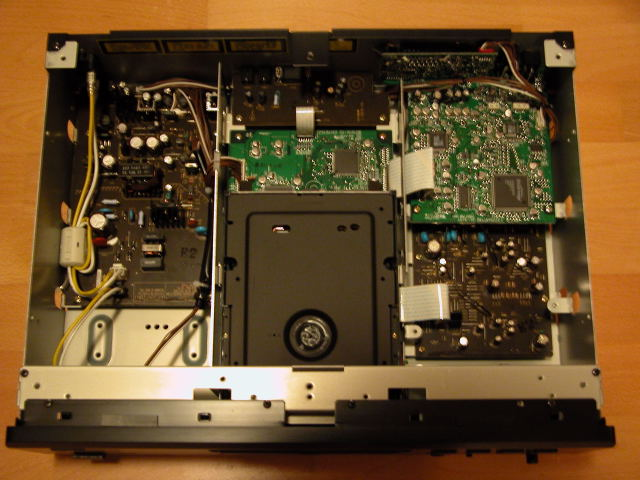

The area on the left is reserved for the power transformer and associated power circuitry. The middle area contains the DVD transport mechanism plus a digital processing board (underneath the transport). The right area consists of two boards stacked on top of each other. The upper board (as shown) has the video processing circuitry (Video DAC plus analogue video stage). The lower board is the analog audio board, containing the op amps plus associated capacitors and other components.

There is a separate, smaller board next to the SCART socket. It appears that this player is designed primarily as a component video output player, with RGB added almost as an afterthought. A friend of mine who has purchased this player and is using the RGB SCART output has found some anomalies such as the picture adjustment controls having no effect on the RGB output.

As you can see, the power transformer for the DVD-2900 is much smaller than the transformers for the DVD-3800 and DVD-A1. We shall see later on in the review that the smaller power transformer has a noticeable impact on the audio quality of this player compared to its more expensive sisters.

The digital processing board contains the Sony CXD2753R DSD DSP and decoding chip. I also noticed the Analog Devices Melody-32 Audio Processor(ADSST MEL322), plus a few other chips - a M 3210256FP, a MX S024845, and a 29LV160BTC-90 - I think these are dynamic and flash memory chips. I also noticed an interesting Panasonic chip called M 1024608 - I wonder what this chip does. I was not able to spot the MPEG decoder as most of the board is hidden underneath the transport. Denon says that the player uses a Mitsubishi MPEG decoder similar to that used for other universal players such as the Pioneer DV-S733A.

The video processing board contains the Silicon Image Sil504 (Sil504CM208), and has no less than 2 Video DACs - the 108MHz/12-bit Analog Devices ADV7300AKST and the 54MHz/10-bit Analog Devices ADV7190KST. I don't know why two Video DACs are used - since each Video DAC already has 6 channels - enough for a full complement of composite, S-Video and component video outputs. I suspect one Video DAC is used for progressive and the other for interlaced video output, or perhaps one is used for the DVD video output and the other for screen menus and overlays. I also noticed a PIC18LC242 microcontroller - I suspect this is used to generate the on-screen menus or to handle the I2C bus.

The analog audio board contains a set of OP275 op amps plus associated components. Interestingly, I was not able to find the Burr Brown DSD1790 DACs - maybe they are mounted on the underside of the board?

I rate the build quality as excellent. All circuit boards are uncluttered and high quality, and feature surface mounted components exclusively. I did not notice any hand soldered connections and various wires have been fastened using hooks to limit movement.

One "undocumented" feature is that the player's firmware can be upgraded or "flashed" using a CD-ROM containing the updated firmware code.

Another undocumented set of button presses (pressing Play and Open/Close simultaneously while turning the player on using the "hard" Power button, followed by pressing the Menu button repeatedly on the remote) will display the current firmware versions on the front panel display. There are separate versions for the transport ("DRV"), the MPEG decoder ("B/E") and the player logic ("PANEL").

This is the firmware versions reported by the review unit:

| **Button Press** | **Firmware** |
| :--------------- | :----------- |
| Menu             | DRV 030307   |
| Menu             | B/E 6237M    |
| Menu             | PANEL 0043-f |

About halfway through the review period, I asked Audio Products Australia whether there are any updated firmware (due to the chroma upsampling bug that I noticed on several titles - more on this later) and received a CD-R. Unfortunately, after reflashing the unit, it seems that the CD-R contains the same firmware code as the version numbers did not change.

The player's region code is marked on the back panel. You can also check the region code by pressing both the STOP and the Forward Skip buttons simultaneously when there is no disc inserted. My review unit seems to be originally marked as Region 2 on the back (but someone has applied a Region 4 sticker on top) and pressing STOP/Forward Skip caused the front panel display to read "REGION_A2" (the "A" presumably indicating that the player is multi-region enabled). On non multi-region enabled players the display should read something like "REGION_2".

## Front Panel

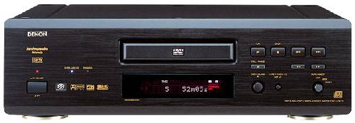

The DVD-2900 has a fairly minimalist front panel, consisting of (from left to right):

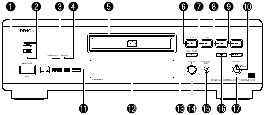

- A hard power switch (1), with a red power indicator (2) on top
- Two indicator lights, "SUPER AUDIO CD" (3) (which glows blue) and "DVD AUDIO" (4) (which glows amber)
- The disc tray (5), with the remote sensor (11) and fluorescent display (12) beneath
- Disc Navigation Buttons - PLAY (6), STOP (7), Skip Back (8), Skip Forward (9), PAUSE (13), Scan Back (16), Scan Forward (17)
- OPEN/CLOSE Button (14)
- SUPER AUDIO CD SETUP (15)
- PURE DIRECT rotary switch (10)

I would also have liked to see menu navigation buttons, but that would have destroyed the "minimalist" look that Denon is probably striving for. Even though the player has a hard power switch, it can also enter in and out of power standby mode using the remote control. This gives you the best of both worlds - the ability to turn the player in and out of standby plus the added safety of being able to completely turn the player off if you really wanted to. When the player is in standby mode, it can also be woken up using the PLAY or OPEN/CLOSE buttons.

The PURE DIRECT rotary switch allows you select between two memory settings (plus off) that turn off various circuitry to allow you to potentially hear a purer and less "corrupted" audio signal. Off means all circuitry are active, and the two settings are fully configurable, allowing you to turn off any combination of: video output, digital output and fluorescent display.

The fluorescent display is mainly blue (some indicators are red). It is the same display that is also used on the DVD-3800 and DVD-A1. It provides the following status indications (from left to right):

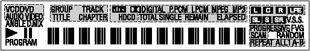

- DVD/CD/VCD AUDIO/VIDEO - indicates type of disc inserted
- ANGLE - indicates availability of multiple angles in video stream
- D.MIX - indicates signal can be down mixed
- Play/Pause
- PROGRAM
- Group/Title/Track/Chapter
- dts/Dolby Digital/P.PCM/LPCM/MPEG/MP3/HDCD - indicates current audio format
- TOTAL/SINGLE/REMAIN/ELAPSED - time display mode
- L/C/R//LFE/SL/S/SR - indicates which audio channel is active
- V.S.S. - virtual surround mode
- PROGRESSIVE SCAN
- F/V/G - indicates whether video is in film mode (3:2 pulldown), video mode (interlaced) or is a graphic still (or 2:2 pulldown)
- RANDOM
- REPEAT/ALL/1/A-B
- 13 character dot matrix display

I really like the fluorescent display and find it very informative. In particular indicating whether the video is in film (source flagged as "progressive") or video (source is inherently interlaced) is very useful. I also like the inclusion of a full dot matrix display rather than segment based characters. The D.MIX indicator confused me - this seems to light up whenever a multi-channel audio track is playing. At first I thought it meant I was hearing a down-mix and I was frantically searching for a way to turn the down-mix off, but it actually means that the audio track is "down-mixable" to stereo.

## Rear Panel

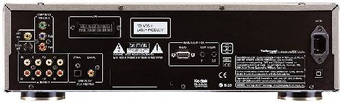

From left to right, we have:

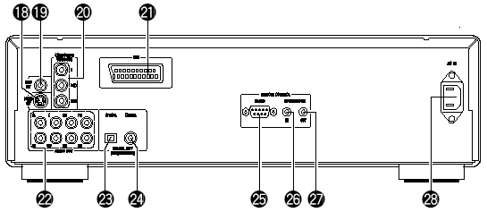

- S-Video outputs (18)
- Composite video output (19)
- Component video out (20) (RCA)
- SCART terminal (21)
- 5.1 channel audio analogue outputs (22) (RCA) - two pairs are provided for the front left/right signals - I don't know if these pairs are differentiated in terms of signal type or quality
- Digital out - optical (23) and coaxial (24)
- RS-232C control connector (25) (described as "for future system expansion" in the manual)
- Room to Room in (26) /out (27) (this is used for wired remote control protocols)
- IEC power socket (28)

The set of connectors are fairly comprehensive and should suit the majority of home theatre configurations. The provision of an IEC power socket allows you to substitute a higher grade power cord if you wish (for those of you who think the quality of a power cord makes a difference to the performance of the player!).

Interestingly, the US brochure for the DVD-2900 state that the RS-232C port will allow the use of third party system controls such as AMX and Creston. However, the manual does not confirm this.

## Remote Control

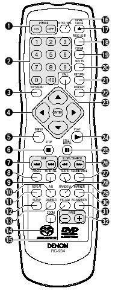

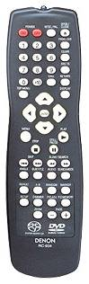

The remote control is designated RC-934, but appears to be identical to the RC-553 remote control used in the DVD-3800. The only difference I've found is the Super Audio CD and DVD Audio/Video logos silk-screened onto the bottom of the unit. The buttons and layout appear to be identical.

Interestingly, there appears to be no remote control equivalent of the "SUPER AUDIO CD SETUP" on the front panel.

Those of you who have read my review of the DVD-3800 may recall that I wasn't very impressed with the remote control. Well, I still hate it.

The buttons are too small. Worse still, they don't light up which means this remote is next to useless in a dark room. Because many of the buttons are undifferentiated, you can't even feel your way around.

The top row consists of two red buttons labelled Power On (1), Power Off (1), and two white buttons labelled NTSC/PAL (16) and OPEN/CLOSE (17).

Denon seems almost unique amongst Japanese manufacturers by using different buttons for Power On and Off. I found out that the reason for this is so that you can program "turn all units on" (or off) type macros in your universal remote controller without worrying about whether the unit is currently on or off. This seems like very smart thinking, and I wish more manufacturers would do the same.

The next four rows has sixteen identical small buttons. Reading from top to bottom, left to right, we have the numeric keypad (2), followed by:

- Prog/Dir (18) - switch between Program and normal play
- Clear (19) - clears entered track/chapter numbers in Program mode
- V.S.S. (20) - sets virtual surround sound
- Call (23) - review Programmed tracks/chapters
- Return (21) - go back to previous menu

Below that we get a diamond (4) containing the menu navigation buttons surrounding the ENTER button a the centre. On each side of the diamond is a button. These four buttons are:

- Top Menu (3)
- Display (22)
- Menu (5)
- Play (24)

After that, we get more small buttons:

- Stop (6)
- Still/Pause (25) - when in Pause mode this button advances to the next frame
- Skip Back/Forward (7)
- Search Back/Forward (26)
- Angle (8)
- Subtitle 95)
- Audio (28)
- Search Mode (27) - directly access specific group/title or track/chapter
- Repeat (11) - repeat group/title/disc or track/chapter
- A-B (10) - repeat section between two points
- Random (29) - plays tracks/chapters in random order
- Marker (30) - mark a spot on disc to return to later (this is not as useful as you think because the player does not memorize markers when you eject the disc or turn the player off)
- Setup (12) - enters setup menus
- Dimmer (13) - adjusts the brightness of the front panel display (four different levels from off to maximum)
- Pic Adj (15) - allows you to adjust contrast, brightness, sharpness, hue and gamma (you can change various points in the gamma curve - impressive!) for up to five memory settings (M1 to M5) plus a STD setting that corresponds to factory default/"normal"
- P. D. Memory (31) - allows you to select which functions (Digital Output, Video Out, Display) are turned on or off in the two user definable Pure Direct settings
- Zoom (14) - cycles through various video zoom settings (Off, 1.5x, 2x, 4x) - the arrow keys allow you to move the zoom area within the frame
- Page -/+ (32) - selects next/previous stills whilst playing a DVD Audio

When in stand by mode, the unit can be woken up by pressing the Power On, Play and Open/Close buttons.

I was glad to find out the DVD-2900 has corrected some of the operational quirks in the DVD-3800/A1 but it seems to have introduced a few new quirks.

DVD-Audio players are supposed to automatically play the default audio track when you press "Play" after inserting the disc into the open tray. The DVD-2900 does not implement this feature consistently. I found out with older discs (authored to the DVD-A v1.0 specification), pressing Play when the tray is open with a disc loaded will still display the menu, although with newer discs (authored to the v1.1 specification) the feature seems to work.

The Search Mode button now works when a disc is playing, thus allowing you to make Group and Track selections. Navigation without a video display is still difficult, but at least not impossible. The numeric keys work for CDs and Super Audio CDs, but behave strangely for DVD-Audio discs (They kind of work, but not consistently. Navigation to previously played tracks seem to work, but not to tracks yet to be played).

Pressing the Chapter/Track skip buttons whilst the player is paused exits Pause and resume Play - this behaviour is contrary to that in most other players which will skip and pause on the next/previous Chapter/Track.

## Manual

The manual follows the standard Denon format of being typeset in landscape rather than portrait orientation, but with two columns on text on each page. It is fairly thick and contains 206 pages, but this is because it has versions for several languages (English, German, French, Italian, Spanish, Dutch and Swedish). The English section is only 34 pages.

I would strongly recommend that you read the manual carefully because some functions are not intuitively obvious or behave differently from other manufacturers' players. For example, Subtitle does not cycle across available subtitle tracks - it puts the player into subtitle mode and you use the up and down arrow keys to cycle across subtitle tracks.

Fortunately, I found the manual relatively easy to read though not always helpful, but better than most. For example, it describes the "F," "V," and "G" enunciators as "Film," "Video," and "Graphic" but neglects to explain what these modes mean (3:2 pulldown, interlaced, and 2:2 pulldown respectively). Similarly, the description for what "Darker" and "Lighter" means in the black level setting is completely unhelpful (Darker is the PAL 0 IRE setting, Lighter is the NTSC 7.5 IRE setting).

## Set-Up Menu

The set-up menu is accessed by pressing the Setup button which brings up a tabbed set of setup parameters. You navigate across tabs (effectively sub menus) using the left and right arrow keys. The up and down arrows allow you to navigate between setup parameters. Pressing the right arrow key on a setup parameter will allow you to change it. Exiting the setup menu is done by pressing the Setup button again or by navigating to the "Exit Setup" menu item.

The setup menus and parameters are very similar to those on the DVD-3800 and DVD-A1. The items in **bold** are those that are new/changed from the menus on the DVD-3800.

The "Disc Setup" sub menu contains the following parameters:

- Dialog (select language of default audio track)
- Subtitle (select language of default subtitle track)
- Disc Menus (select language of default DVD menu)

The above setup parameters allow you to directly select between English, French, Spanish, German and Italian. All other languages require you to enter the four digit language code from the manual.

The "OSD Setup" sub menu contains the following parameters:

- OSD Language (select language for player on-screen messages eg. "Play")
- Wall paper (select background screen between Blue, Gray, Black and "Picture" - a non-customisable bitmap containing the Denon logo and some text - I would have liked the ability to select my own colour or the ability to display Jacket Pictures on the disc)

The "Video Setup" sub menu contains the following parameters:

- TV Aspect - 4:3 PS, 4:3 LB, WIDE (16:9)
- TV Type - NTSC, PAL, MULTI
- Video Out - Progressive, Interlaced
- **Still Mode - Field, Frame, Auto**
- Black Level - Darker, Lighter
- AV1 Video Out - Video, S-Video, RGB (this affects which pins in the SCART connector are active)
- Squeeze Mode - Off, On (Squeeze Mode will automatically display 4:3 images squeezed into the correct aspect ratio on a 16x9 display - very useful if your display is widescreen and locks into widescreen mode when receiving a progressive signal on component video)
- Progressive Mode - Mode 1 (cadence or frame detection), Mode2 (flag detection)

The "Audio Setup" sub menu contains the following parameters:

- Audio Channel - Multi-channel, 2 channel
- **Super Audio CD - Multi, Stereo, CD**
- Digital Out - Normal, PCM
- LPCM (44.1kHz/48kHz) - Off (no downsampling), On (downsampling)
- Bass Enhancer (2 channel) - Off, On (routes low frequencies to subwoofer)

Selecting Audio Channel to "Multi" allow enables a submenu allowing you to set speaker configuration (Small, Large, None per channel), channel level adjustment, speaker distance/time delay adjustment and test tone generation. These apply to all formats (DVD-Video, DVD-Audio, Super Audio CD) except time delay does not work for Super Audio CD.

There is also an additional setup parameter in the speaker configuration labelled "Filter" (which you can turn On and Off). This allows you to determine whether the LFE channel is a full range channel (required for some DVD Audio software which uses the LFE channel as a "height" channel) or a low frequency only channel (in which case a low pass filter is applied to the channel). The LFE channel is attenuated by 5 dB for DVD discs and 15 dB for Super Audio CDs. Apparently bass management is also disabled when Filter is set to Off.

The "Ratings" sub menu allows selection of parental control rating level and password.

The "Other Setup" sub menu contains the following parameters:

- Player Mode - Audio, Video (selects whether DVD-A or DVD-V is played when a DVD Audio disc is inserted)
- Captions - Off, On (decodes closed caption information embedded in video stream)
- Compression - Off, On (Dolby Digital dynamic range compression)
- Auto Power Mode - Off, On (automatically enter power stand by mode if not used for a while)
- Slide show - 5-15 seconds (interval between stills in a JPEG slide show)

All in all, this is a pretty comprehensive set of setup parameters. Unlike other players which have numerous adjustable noise reduction settings, the DVD-2900 has none. That's right, none. Denon has taken the purist approach and obviously intends this to be a "reference" player that outputs the video stream exactly as it was encoded with no dubious post-processing algorithms. Personally, I agree with the "purist" approach (in my experience noise reduction algorithms tend to do more harm than good).

## Video Playback

I calibrated the player by adjusting the display settings of my Sony VPL-VW11HT LCD projector (and leaving the Picture Mode of the DVD player on "Standard") using the [Video Essentials](http://www.videoessentials.com/dvd.htm) test disc (NTSC).

I only tested the player in progressive scan mode (for both PAL and NTSC titles). I did briefly put the player in interlaced mode to verify that it outputs interlaced video correctly.

The review unit is multi-region enabled and I had no difficulty playing a number of Region 1, 2 and 4 discs (including R1 RCE discs). Even discs that do not play properly on my old player - the Pioneer DV-626D - (including _When Harry Met Sally_ and the layer change of several discs including _Fried Green Tomatoes_) play perfectly fine on the DVD-3800. I am not sure whether retail units will be multi-region enabled out of the box.

The first thing I noticed when I connected the player and turned it on was how "sharp" the player setup menus looked in comparison to my memory of the picture quality of either the DVD-3800 or DVD-A1. Then I inserted the Video Essentials disc and noticed that the picture quality has become soft again - to the same level of softness as I noticed on the DVD-3800/A1, or perhaps even softer.

My heart sank when I saw the [Snell & Willcox Test Chart](http://www.snellwilcox.com/internet/reference/testchart.html) (Video Essentials Title 15 Chapter 12). The chart looked really soft, and it was clear from observing the Frequency Response Wedge that the lines start becoming blurred past 5 MHz. The Montage of Images also looked slightly soft, and I noticed missing detail.

Oh no, I thought. Denon has deliberately rolled off the high frequencies!

Then I started playing the R4 release of _Double Take_ - just to check how the player handled Daryl's tie (worn by Freddy) around **20:52**-**21:37**. Surprisingly, the picture quality was quite sharp, and I did not notice any moire patterns on the tie at all.

After some experimentation, I realised what was happening. I had engaged Squeeze Mode, which on this player will cause noticeable softness and loss of resolution on 4x3 images. Turning off Squeeze Mode yielded restored sharpness to 4x3 transfers and gave me a flawless Snell & Willcox Test Chart.

I did notice that the player crops a significant part of the bottom of the frame - I had to use the vertical shift function in my display to realign the frame. Apparently this is a known issue with the current firmware and should be fixed in an upcoming firmware release for the player.

I then selected a number of discs for which I have multiple copies of. These include:

- _Logan's Run_ (NTSC)
- _Pleasantville_ (PAL)

On both these titles I could not notice any differences in picture quality switching between the DVD-2900 and the DVD-RP82. Picture "sharpness", detail levels, colour saturation were pretty much identical, as well as presence/absence of MPEG compression artefacts. This is excellent, because I've always been annoyed at how the picture quality on the DVD-3800 and DVD-A1 always seemed slightly "softer" in comparison to the DVD-RP82.

I tried a few other titles. The video performance on several other titles, including the R1 editions of _Star Trek: Insurrection_ and the Superbit version of _The Fifth Element_, also seemed identical across both players - the images simply looked stunning and faultless. However, I found on several other titles that the DVD-2900 delivers a better performance than the DVD-RP82, thus making the DVD-2900 a slight winner overall.

On the R1 edition of _Harry Potter and the Sorcerer's Stone_ (no - this is not a misprint, they really did change the title from _Philosopher_ to _Sorcerer_ for our poor American cousins), I noticed distinctly less aliasing and shimmering (particularly on Harry's glasses). On the R4 Superbit edition of _Gladiator_, I noticed far less aliasing on the statue of the eagle around **56:12**-**56:17** in comparison either either the DVD-RP82 or my HTPC running PowerDVD.

Smoothness during slow pans was slightly better on the DVD-2900 in comparison to the DVD-RP82, but only just. On the opening titles of **Andrea Bocelli**'s _Cieli di Toscana_, the DVD-2900 handled the horizontal pan slightly smoother than on the DVD-RP82, but seemed more jerky than my memory of the silky smooth ESS Vibratto MPEG decoders on the DVD-3800 and DVD-A1.

With regards to the ["chroma upsampling error"](http://www.hometheaterhifi.com/volume_8_2/dvd-benchmark-special-report-chroma-bug-4-2001.html) common on many DVD players, I have both bad news and good news.

The good news is that I have yet to notice the error on any NTSC 3:2 progressive material - including the usual suspects such as _Toy Story_ and _Monsters Inc_. This was particularly surprising since Region 1 owners have reported seeing the error in the latter title (which has been authored with alternating progressive flags). Perhaps the Region 2/4 version of this player has different firmware/hardware that does not exhibit this error for those scenarios.

The bad news is the player DOES exhibit the chroma bug under certain conditions. The good news is that the conditions are relatively rare and it's probably extremely unlikely that you will encounter objectionable instances of the bug watching the majority of titles. I had a player for over two weeks (during which I played quite a few discs) before I noticed the first instance of the chroma bug - on the red coat worn by Maudey (**Meredith Eaton**) around **79:30**-**80:06** in the R4 PAL release of _Unconditional Love_ as well as her lips around **104:43**-**104:59** in the same title. Since then, I've also noticed the chroma upsampling error in one other PAL title - in red objects in John Doe's apartment in the R4 deluxe special edition of _Se7en_, such as the red cross around **73:43**-**73:45** and **74:59**-**75:02** as well as when **Brad Pitt** is in the darkroom (the red lightbulbs, as well as the photos and shadows).

An example of the chroma upsampling error can be seen in the (animated) main menu of the Region 1 release of _Saturday Night Fever_. The menu is in NTSC and the DVD-2900 detects it as 2:2 progressive. This is the full frame as captured on PowerDVD 4.0 (click on the image to see an enlarged 720x480 version):

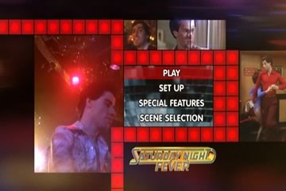

Notice that each of the red squares look fairly solid (although the centre of the squares are brighter than the edges). This is how the squares are supposed to look like without the chroma upsampling error.

The following image is a blowup of the frame, zooming into the four squares at the bottom right of the frame, as presented by the DVD-2900 via the Sony VPL-VW11HT projector. The image is captured using a digital camera with the aperture set to f/3.5 and the shutter speed at 1/2":

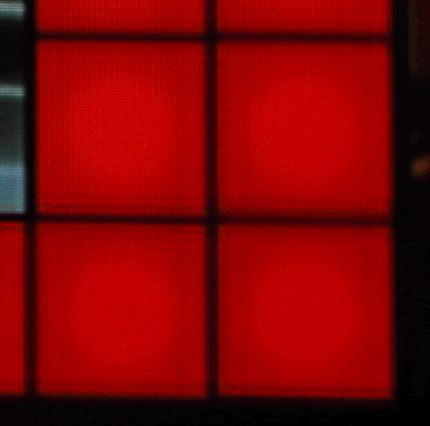

Notice the dark horizontal streaks running across the squares.

This is the exact same image, presented by the Panasonic DVD-RP82 via the Sony VPL-VW11HT projector. The image is captured using a digital camera with the aperture set to f/3.9 and the shutter speed at 1/2":

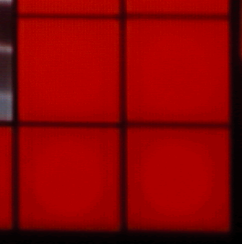

Notice the complete absence of horizontal dark streaks.

The player also handles 4:2:0 interlaced chroma upsampling rather badly. Strictly speaking this is not a bug, but it is extremely annoying nevertheless as you can see it in many R1 animated menus with lots of red, such as the R1 Special Edition of _Hunt For Red October_. I can also consistently see it in the red oval around the MGM "lion roar" animated studio logo. This puts the DVD-2900 at a disadvantage compared to Faroudja-based progressive scan DVD players such as the DVD-RP82 since the Faroudja chipset resamples and filters the chroma channel and hence "masks" the problem.

The fast forward/fast reverse buttons give you multiple playback speeds (2X, 4X, 8X and 16X) which you can cycle by pressing the button repeatedly. You will exit fast forward/rewind operation by pressing "Play." The Pause button is a bit unconventional in that pressing it again whilst in Pause mode will advance to the next frame instead of reverting back to Play (I can't find a way of moving to the previous frame). Pressing the forward/rewind buttons when the player is paused will activate several speeds of slow scans (1/2, 1/4, 1/6 and 1/8). To exit Pause mode, you have to press the Play button. Once I got used to it, the buttons are surprisingly effective in cueing up to the right spot.

As with other upmarket Denon DVD players, this player includes a memory buffer that minimizes the "freeze" effect of a layer change transition. Layer changes are extremely smooth on this player and will be unnoticeable for most discs, even problem ones like _Fried Green Tomatoes_ R4. The only time I noticed a layer change was watching the time elapsed counter very closely and this sometimes does not count up as smoothly in the vicinity of a layer change. However, on DVDs that split a film across several titles (including the above mentioned _Fried Green Tomatoes_), I noticed that title transitions still incur a slight pause.

So overall (apart from the slight chroma upsampling error and slightly jerky pans), the DVD-2900 provided the best video quality I have seen to date in a set-top DVD player.

## Progressive Scan

The DVD-2900 is the first Denon player to "officially" support both NTSC and PAL progressive scan, although earlier players supported PAL progressive scan with firmware hacks. In essence, it reconstructs a progressive NTSC or PAL frame from adjacent half-frames (intended for interlaced display) stored on the disc.

The DVD-3800 progressive scan implementation for both NTSC and PAL is excellent and is identical to that on the DVD-3800 and DVD-A1, so I have repeated the same comments from my reviews of the other two players.

I did not notice any combing errors except in menus right after selecting a menu item (this is unavoidable), subtitle tracks and strangely enough in player on-screen text. All these examples of combing happen when an interlaced video stream is superimposed on a progressive video stream so they are excusable. Interestingly, the player has three status enunciator flags on the front panel: "F" indicates "film" mode (NTSC 3:2 progressive source), "V" indicates "video" mode (NTSC or PAL interlaced source). "G" stands for "graphics" and is supposedly for stills but I noticed the player displays "G" whenever I play back a Region 4 PAL disc - I suspect "G" is also used to indicate PAL 2:2 progressive sources.

For most of the time the play seems to sense the video source correctly - I have noticed occasional lapses into "V" for material that I know is progressive. For material that contains a mixture of progressive and interlaced material (for example, featurettes that mix video interviews with excerpts from the film), the player will correctly switch between Film to Video and vice versa. The switch from Film to Video tend to occur instantaneously, but the switch from Video to Film tend to be delayed a few frames (almost as if the player is checking to make sure the material is actually progressive before combining half frames).

## On Screen Display

The on-screen display is accessed while the DVD playing by pressing the "Display" button on the remote control. It's pretty basic and features two lines of text. The following information is cycled on repeated presses of the Display button:

- Title (Current/Total), Chapter (Current, Total), Title Elapsed in HH:MM:SS
- Title (Current/Total), Chapter (Current, Total), Title Remain in HH:MM:SS
- Title (Current/Total), Chapter (Current, Total), Chapter Elapsed in HH:MM:SS
- Title (Current/Total), Chapter (Current, Total), Chapter Remain in HH:MM:SS
- Audio (Track No/Total), Track Description (eg. "DOLBY D 3/2.1"), Subtitle (Current/Total), Subtitle Language (eg. "ENGLISH") and whether the subtitle track is ON or OFF.

Although the display of total titles of disc and total chapters within current title are useful, I would have liked to see Total Time (title or chapter) as well as a bitrate indicator. Given that the player is extremely smooth on layer changes due to memory buffering, I would have also liked to see a layer indicator.

Also, the display of the current subtitle language (eg. "English") is useful but I wish Denon has a more extensive language name lookup table in the firmware because more often than not the player displays the subtitle language as "Unknown." Worse still, when it displays "Unknown" it doesn't even display the language code to allow you to look it up yourself.

By the way, the player will recognize SACD Text and display the title/artist of the disc as well as track titles (as part of the on-screen display). However it does not recognize CD Text or DVD Text.

## Standards Conversions

The player fully supports conversion from PAL to NTSC and NTSC to PAL. However, it does neither particularly well, resulting in jerky motion. Also, it converts a PAL 720x576 frame by cropping the upper and lower lines to fit into an NTSC 720x480 frame (resulting in lost picture information as well as incorrect aspect ratio). Similarly, it converts an NTSC 720x480 frame by fitting it into a PAL frame, resulting in blank lines on the top and bottom of the screen as well as an incorrect aspect ratio. This is not really acceptable behaviour so if you want to watch NTSC titles converted to PAL or vice versa avoid this player. Fortunately, most displays these days will accept both NTSC and PAL so the conversion features are not really important.

The player can be set to convert from Dolby Digital/dts/MPEG to PCM on the digital out connections. However, this is an all or nothing proposition - you can't enable dts to PCM but not Dolby Digital to PCM for example.

Although the player seems to recognize MPEG )|( Multi-channel tracks I can't get it to output MPEG 5.1 (from my R4 copy of _Fly Away Home_) either through the analog outputs (it downmixes to 2 channels) or via the digital output (it converts to 2 channel PCM). This is not a serious omission given that very few MPEG )|( Multi-channel DVDs have been released.

## CDR & Video CD

The DVD-2900 had no problems playing a selection of CD-R and CD-RW discs that I inserted into it, including gold and blue/green discs recorded at 8X speed. It was able to correctly recognize CD-Rs containing:

- PCM audio tracks ("Redbook" format)
- dts music CD (encoded in pseudo "Redbook" format)
- ISO9660 CD-ROM containing MP3 audio files
- ISO9660 CD-ROM containing JPEG image files

In addition, the player had no problems recognizing the following types of commercially pressed discs:

- Video CD ("_James Bond: The Man With The Golden Gun_")
- DVD-Video containing PCM 96/24 audio track (also known as a "Digital Audio Disc" or DAD) ("_Casino Royale_")

## MP3 and JPEG Playback

The player's MP3 playback implementation is similar to the DVD-3800 and DVD-A1, complete with an "Explorer"-like on-screen display of folders and tracks. The navigation keys can be used to navigate in and out of folders and to select MP3 files to play. The player even reads multi-session discs correctly on both CD-R and CD-RW. The player will support constant bit rate MP3 files (as long as the transfer rate is at least 96 Kb/s or above) as well as variable bit rate MP3 files. However, it does not recognize ID3 tags, MP3 play lists or (Joliet) long file names (all MP3 files are displayed using 8 character names).

| **Test Disc Format** | **Results** |
| :-- | :-- |
| CD-R >100 MP3s (128 Kb/s)in multiple, nested subdirectories | Found all files |
| CD-R >100 MP3s (128 Kb/s) in root directory | Found all files |
| CD-R with MP3s (CBR ranging from 20-320 Kb/s, VBR ranging from 1%-100% quality), 1 WMA and 1 WAV file | Successfully played all constant bit rate files between 96-320 Kb/s. Does not recognize CBR files with bitrates less than 96Kb/s. Recognized and successfully played all VBR files Did not recognize non MP3 files |
| Multisession CD-RW (2 sessions each containing MP3 files) | Found all files in both sessions |

The player's JPEG image display capability is fairly unique and allows you to view JPEG still images (presumably scanned from your photo album or taken using a digital camera) burned onto an ISO9660 CD-R. The implementation is very similar to the MP3 playback menu - showing folders stored on the disc and filenames of images with a .JPG extension. In fact, you can even play a disc containing a mixture of MP3 and JPEG files correctly. It will display successive images in a slide show with programmable delays between images.

Unfortunately, the player does not recognize a folder with more than 525 images - it will only display the first 525 images in the folder. I thought this was an important limitation that should be disclosed in the manual.

The player will automatically resize the JPEG image to fit within an NTSC progressive frame. I did notice that the player puts a black border around the images, which means the effective resolution of the images is a bit less than NTSC.

## Audio Playback

I initially listened to this player in 2-channel mode, playing a variety of material including CDs, Stereo SACDs, MLP 2.0 tracks in DVD-Audio discs, and Linear PCM tracks on DVD-Video discs.

Initially, I was quite impressed by the sound. Although I no longer have the DVD-3800 or DVD-A1 for comparisons, I felt the overall sound quality was better than the DVD-3800, but not as good as good as on the DVD-A1. I attribute the improvement in sound quality over the DVD-3800 (even though the DVD-2900 is a cheaper player) to the use of the better quality Burr Brown DSD1790 Audio DACs (in comparison to the PCM1738 DACs used on the DVD-3800). The noise floor of the player is wonderfully quiet and the player seem to be adept at extracting small nuances of detail.

In comparison with my Sony SCD-XA777ES SACD/CD player, however, I felt the DVD-2900 lacks "presence" and micro-dynamics - everything sounded slightly "muffled." For example, listening the _Chan's Song_ on **Michael Brecker**'s _The Nearness Of You: The Ballad Book_, I felt that the brushwork on the cymbals seemed to be more recessed on the DVD-2900, but on the other hand I felt the "squeaks" of the guitar fretwork seemed to be better articulated and the attack on the guitar notes seem more natural. The remastered version of **Peter Gabriel**'s _Passion: The Soundtrack for The Last Temptation Of Christ_ seemed to sound less dynamic and more compressed on the DVD-2900 than on the SCD-XA777ES - I missed the sense to "slam" or excitement of the SCD-XA777ES.

Turning onto high resolution audio sources, I listened to _The Girl From Ipanema_ from the SACD version of _Getz/Gilberto_. **Astrud**'s voice and the saxophone on this track definitely did not has as much "presence" on the DVD-2900 as on the SCD-XA777ES and in addition the cymbals seem less well defined. Overall, the difference between the two players on this track was like listening to a "live" performance straight out of the mixing console, and comparing to a tape recording of the same - the whole sense of "being there" was missing on the DVD-2900.

The player also fared reasonably well on MLP 2.0 tracks on DVD-Audio discs. Listening to **Joni Mitchell**'s _Both Sides Now_, I was struck by how "right" and "satisfying" the overall presentation was. However, turning on to the soundtrack to _A.I._ I was reminded of the same lack of presence and micro-dynamics I noticed on CDs and SACDs - the overall presentation was dull and recessed (although I have to note that most players do not render this disc well with the exception of the DVD-A1).

It appears that the lack of micro-dynamics is a defining characteristic of the player, for in multi-channel mode the "dullness" is exarcebated. **James Taylor**'s _Hourglass_ sounds dull and uninteresting in multi-channel, compared to the same title on the SCD-XA777ES. The "dullness" or lack of dynamics is also noticeable on DVD-Audio titles such as **Pat Metheny Group**'s _Imaginary Day_, even when compared to "low end" players such as the DVD-RP82. I tried all sorts of player settings (including turning the Filter On and Off as well as various settings of Pure Direct) but the audio quality did not improve or deteriorate. **Celine Dion**'s _All The Way_ confirms that multi-channel high-resolution titles simply gives 5.1 channels of sound instead of the exhilarating multi-dimensional experience I get on the SCD-XA777ES.

Interestingly, the multi-channel analog RCA outputs are not balanced by default. I found out I had to turn the front centre channel down by 2dB, and the Front Right and Rear Left channels down by 1dB in comparison to the Front Left and Rear Right channels.

Dolby Digital and dts decoding are excellent, courtesy of the Melody 32 processing (although it must be noted the "dullness" inherent in the analog outputs are noticed even for film soundtracks). The player does not decode newer surround formats such as Dolby Digital EX, dts ES, or dts 96/24. It also doesn't do THX post processing nor Dolby Headphone, so if you want all those formats you still need an external processor. HDCD decoding has also been left out on this player in comparison to its older and pricier sisters the DVD-3800 and DVD-A1. Since there aren't that many HDCD titles out there this is a small sacrifice to make.

Subjectively, I did not notice any issues with audio synchronization (on both analog and digital outputs) on the test discs (_Wedding Singer_ R4 second remastered edition and also _Matrix_ R1). In both cases the audio is subjectively slightly less synchronized on the optical digital output in comparison the the analog audio outputs but well within acceptable tolerances.

In summary, I think the player delivers excellent sound quality in 2 channel mode in comparison to other universal players in its price range. It's limitations are only apparent when comparing to far higher priced players. It's multi-channel performance however is only adequate, and disappointing in comparison to 2 channels.

## Disc Compatibility Tests

I tested the player against a number of discs to highlight potential problems: _Specific Tests_

| **Disc** | **What Is Tested** | **Results** |
| :-- | :-- | :-- |
| The Matrix R1 Follow The White Rabbit | Tests active subtitle feature, seamless branching, ability to load hybrid DVD/DVD-ROM and audio sync. | YesYesYesYes |
| Wedding Singer Remaster 2 R4 Audio Sync | Opening scene tests audio sync. | Yes |
| Terminator: SE R4 Menu Load | Tests ability to load complex menu | Yes |
| Independence Day R4 Seamless Branching | Tests ability to handle seamless branching (Chapter 3) | Yes |
| Patriot R1 RCE | Tests ability to handle RCE protected DVDs in Auto multizone mode (if applicable). | Yes |
| Toy Story R1 Chroma Upsampling | Tests for presence of chroma upsampling error (Chapter 3 and 4) | Yes (however the chroma upsampling error was observed on other material) |

As you can see, the DVD-3800 passes all tests (apart from the chroma upsampling bug) with flying colours.

## User Convenience Features

| Screen Saver | No  |
| :----------- | :-- |
| Zoom         | Yes |

## Overall

### The Good Points

- the best video quality of any Denon player I have seen to date
- official support for both PAL and NTSC progressive scan
- excellent 2-channel audio quality for its price
- "universal" support for disc formats - need I say more?
- excellent in-built decoders for Dolby Digital and dts
- extensive set-up and playback options, including channel leves/bass management for all formats, and time alignment for all formats except Super Audio CD
- Squeeze mode allows playback of 4:3 video material on 16:9 displays
- will playback JPEG images, Fujicolor CDs and Kodak Picture CDs

### The Bad Points

- occasional chroma upsampling error for progressive PAL material and interlaced NTSC material
- mediocre multi-channel audio quality in comparison to 2-channel (although still quite decent compared to other players in its price range)
- no in built decoders for HDCD, MPEG )|( Multichannel, dts 96/24 or 7.1 formats such as Dolby Digital EX and dts ES
- no time alignment for Super Audio CDs
- JPEG picture displays seem a bit soft
- does not "memorize" last playback position on discs
- no support for various features including layer change indicators, CD/DVD Text, Jacket Pictures, CD index points
- minor operating quirks
- disappointing remote control

## Features At A Glance

| **Video** | Component Output | Yes | RGB Output | Yes |
| :-- | :-- | :-- | :-- | :-- |
| **Progressive Scan** | NTSC | Yes | PAL | Yes |
| **Audio** | DTS Output | Yes | MP3 Playback | Yes |
| **High Resolution Audio** | DVD-Audio | Yes | Super Audio CD | Yes |
| **CD-R/RW, DVD-R/RW** | Yes |  |  |  |
| **Conversion** | NTSC and PAL conversion (although both are problematic and in my opinion unacceptable) |  |  |  |
| **Inbuilt Decoder** | Dolby Digital, **dts**, MLP, MP3, JPEG, HDCD, DSD |  |  |  |

## In Closing

The DVD-2900 is an excellent universal player from Denon, building on the strengths of their DVD-Audio players and featuring a "no compromise" video section. At the suggested retail price of A\$1,999, it is a value-for-money "bargain" and if there was any justice this player should outsell it's competition. Weaknesses include occasional chroma upsampling errors, a slightly disappointing multi-channel audio performance, minor operating quirks and a disappointing remote control. Even though I already own more than my fair share of DVD and Super Audio CD players, I find myself strangely lusting after this player. Oh well, time to go and staple that wallet shut!

## [Ratings (out of 5)](Ratings.html)

| **Performance**     | ★★★★  |
| :------------------ | :---- |
| **Build Quality**   | ★★★★★ |
| **In Operation**    | ★★★★★ |
| **Compatibility**   | ★★★★★ |
| **Value For Money** | ★★★★  |

## Technical Specifications (Manufacturer Supplied)

| **Product Type:** | DVD-Video/Audio, Super Audio CD, Video CD, Audio CD, MP3/JPEG CD, Kodak Picture CD player |
| :-- | :-- |
| **Region:** | 2 (multi-region enabled) - although a Region 4 sticker has been applied at the back of the player |
| **Signal System:** | PAL / NTSC |
| **Serial Number Of Unit Tested:** | 3038400255 |
| **MPEG Decoder:** | Mitsubishi (unknown model) |
| **Audio Frequency Response:** | 2 Hz-20 kHz (CD) 2 Hz-22 kHz (48 kHz sampling) 2 Hz-44 kHz (96 kHz sampling) 2 Hz-88 kHz (192 kHz sampling) 2 Hz-100 kHz (Super Audio CD) |
| **Signal to Noise Ratio:** | 118 dB |
| **Dynamic Range:** | 110 dB |
| **Total Harmonic Distortion:** | 0.0009% |
| **Dimensions:** | 434 mm (w) x 343mm (d) x 132mm (h) |
| **Weight:** | 8.1 kg |
| **Price:** | \$1,999 |
| **Distributor:** | Audio Products Australia 67 O'Riordan Street Alexandria NSW 2015 |
| **Telephone:** | 1 800 642-922 |
| **Facsimile:** | 1 800 246-262 |
| **Email:** | info@audioproducts.com.au |
