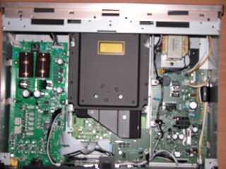
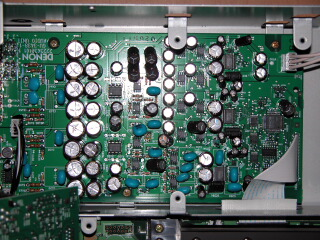
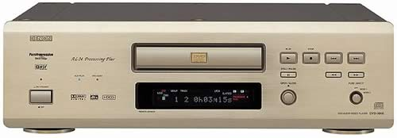
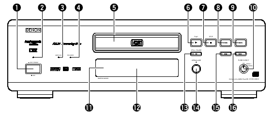
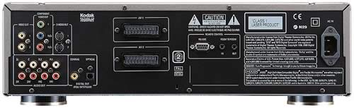
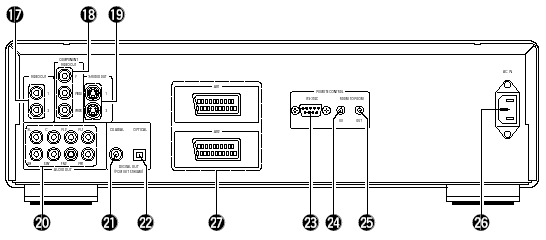
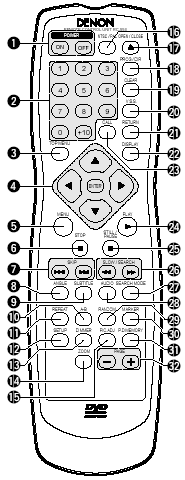
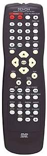

_This review was written by me for **MichaelDVD**, an Australian DVD review site that is no longer online. A capture of the site is held by the Internet Archive: **[browse it there](https://web.archive.org/web/20220217040146/http://www.michaeldvd.com.au/)**. It is reproduced here from my own copy of the site, as part of the record of what I have written._

Denon seems to have the habit of releasing "lite," "budget" or "lower-speced" versions of their flagship products, to target potential buyers who may be lusting after the top-of-the-line models but can't afford them. Generally, the "cut down" version will try and retain as many of the features of the flagship model as possible but with a number of compromises in return for a much more affordable price. For example, buyers who can't afford the Denon AVC-A1SR amplifier may be tempted to purchase the very similarly featured AVC-A11SR amplifier.

Similarly, buyers who can't afford the ultra-heavy, ultra-speced, no compromise and mucho expensive DVD-A1 (A\$6,999) may be tempted by the Denon DVD-3800 at A\$2,999.

So, what exactly do you lose out at less than half the price? Not much, thankfully. The two players even look very similar sitting side by side. The DVD-3800 is not as heavy (10kg instead of 18kg), and is slightly smaller (depth is 339mm instead of 411mm) and has squarish buttons on the front panel rather than the round buttons on it's bigger sister.

From what I can tell, these are the functional differences:

| **Feature** | **DVD-3800** | **DVD-A1** |
| :-- | :-- | :-- |
| Video DAC | Analog Devices ADV7190KST (12-bit 108 MHz) | Analog Device ADV7304A (14-bit 108 MHz) |
| Audio DAC | 3 x TI/Burr Brown PCM1738E | 8 x TI/Burr Brown PCM1704 |
| Analogue audio stage | 14 x 2068D, 2 x 2068DD op amps | NS5532AN, OP37 and OP275 ("Butler" design) op amps |
| Digital inputs | none | optical and co-axial |
| Denon Link digital output | no | yes |
| SCART ports | 2 | 1 |
| Remote control | RC-553 | RC-552 |

It looks like the major areas of compromise are the use of a lesser-speced Video DAC and a slightly downmarket audio stage. I have to stress though that "lesser-speced" does not mean "low quality." These components are still extremely good and comparable to other high-end DVD players. For example, the ADV7190 Video DAC is also used in the top of the line Sony DVP-NS905V and Pioneer DV-S733A players both of which I reviewed recently and found to have excellent picture quality. Similarly, the PCM1738E audio DACs are also used in many high end components such as Denon's own flagship amplifier AVC-A1SR as well as Sony's top of the line multi-channel SACD player SCD-XA777ES. The only difference is that Denon has configured the DACs to operate one per channel rather than in pairs (differential mode), which halves the number of chips required.

I must admit I was also surprised by the lack of inclusion of the Denon Digital Link, which is a proprietary digital audio interconnection that allows you to transmit 6 channel 96/24 or 2 channel 192/24 Linear PCM to the Denon AVC-A1SR amplifier, over a shielded twisted pair cable (very similar to the Cat5 cables used for computer networking but with shielded cables and connectors). I would have thought that this would be a relatively low cost item that would really enhance the value of the DVD-3800 given it has an inferior audio stage compared to its bigger sister. I guess Denon wants to promote the Denon Link as a high end audio interconnection that is available only on its flagship units.

More importantly are the features that have been retained. The Denon DVD-3800 will play the same types of discs as the DVD-A1:

- DVD-Video (with in-built decoders for Dolby Digital and dts)
- DVD-Audio (with in-built decoder for MLP)
- DVD-R/RW (burned as DVD-Video)
- CD-R/RW (burned to contain either MP3 or JPEG files)
- Kodak Picture CD (note: this is not the same as a Kodak Photo CD, which I only learnt after unsuccessfully trying to get the player to play my Photo CDs)
- Video CD
- HDCD
- CD audio ("Redbook")

As for the DVD-A1, the inclusion of Kodak Picture CD and JPEG display capability are somewhat unusual, and the lack of support for Super Audio CD rather disappointing. Actually, even more disappointing in the DVD-3800's case because the Audio DACs (PCM1738E) are actually capable of decoding the DSD 1-bit format used in Super Audio CDs, unlike the PCM1704 which can only decode Linear PCM. There is also no explicit support for DVD+R/RW or Super Video CD (again, consistent with the DVD-A1).

Here is a list of features that have "trickled down" onto the DVD-3800:

- ESS ES6038 Vibratto MPEG decoder
- the recently released Silicon Image Sil504 digital video processor for progressive scan conversion
- Analog Devices SHARC DSP for Dolby Digital and dts decoding
- AL24 Processing Plus (a proprietary digital filter for PCM audio)
- Noise shaped video with sub-alias filter
- Pure direct modes
- Digital bass management
- RS-232C port and remote in/out terminals for home automation

## What's In The Box

The review unit I received seems to be a production unit, and it comes in a slightly smaller box than the DVD-A1 weighing "only" 12.5kg (thank goodness!). Inside the box are:

- the player itself
- remote control (plus 2 AA sized batteries)
- IEC power cord
- RCA 3-core audio/video cable cable (composite video, left and right audio)
- owner's manual

The review unit is gold in colour. I think the player is also available in black.

Opening up the unit revealed a surprisingly dense layout, divided into three sections.

The area on the right is reserved for the power transformer and associated power circuitry. The middle area contains the DVD transport mechanism plus a digital processing board (underneath the transport). The left area consists of two boards stacked on top of each other. The upper board (as shown) has the video processing circuitry (Video DAC plus analogue video stage). Note the two extremely large capacitors on the top part of the board.

The lower board (shown below) contains the audio processing, including the audio DACs plus analogue audio stage. Note the use of good quality capacitors (blue blobs and black cylinders).

I rate the build quality as excellent. All circuit boards are uncluttered and high quality, and feature surface mounted components exclusively. I did notice a hand soldered wire connection on the video processing board.

Compared to the DVD-A1, the DVD-3800 lacks the heavy copper plated shielding but this player is still better constructed than many players I have seen.

One "undocumented" feature is that the player's firmware can be upgraded or "flashed" using a CD-ROM containing the updated firmware code.

Another undocumented set of button presses (pressing Play and Open/Close simultaneously while turning the player on using the "hard" Power button, followed by pressing either the Display or Menu buttons repeatedly on the remote) will display the current firmware versions on the front panel display. There are separate versions for the transport ("DRV"), the MPEG decoder ("ESS") and the player logic ("PANEL").

This is the firmware versions reported by the review unit:

| **Button Press** | **Firmware** |
| :--------------- | :----------- |
| Display          | ESS 720      |
| Menu             | DRV 6100     |
| Menu             | ESS 34625P   |
| Menu             | PANEL 6093-2 |

This seems to correspond to the October 2002 release level for this player, which is multi-region capable as well as PAL progressive enabled. There is a newer (December 2002) firmware that has been released.

The player's region code is marked on the back panel. You can also check the region code by pressing both the STOP and the Forward Skip buttons simultaneously when there is no disc inserted. My review unit seems to be originally marked as Region 2 on the back (but someone has applied a Region 4 sticker on top) and pressing STOP/Forward Skip caused the front panel display to read "REGION_A2" (the "A" presumably indicating that the player is multi-region enabled). On non multi-region enabled players the display should read something like "REGION_2".

## Front Panel

The DVD-3800 has a fairly minimalist front panel, consisting of (from left to right):

- A hard power switch (1), with a red power indicator (2) on top
- Two indicator lights, "AL24 PLUS" (3) (which glows blue) and "DVD AUDIO" (4) (which glows amber)
- The disc tray (5), with the remote sensor (11) and fluorescent display (12) beneath
- Disc Navigation Buttons - PLAY (6), STOP (7), Skip Back (8), Skip Forward (9), PAUSE (13), Scan Back (15), Scan Forward (16)
- OPEN/CLOSE Button (14)
- PURE DIRECT rotary switch (10)

The front panel improves upon that on the DVD-A1 through the inclusion of Pause and Scan Forward/Back buttons. I would also have liked to see menu navigation buttons, but that would have destroyed the "minimalist" look that Denon is probably striving for. Even though the player has a hard power switch, it can also enter in and out of power standby mode using the remote control. This gives you the best of both worlds - the ability to turn the player in and out of standby plus the added safety of being able to completely turn the player off if you really wanted to. When the player is in standby mode, it can also be woken up using the PLAY or OPEN/CLOSE buttons.

The PURE DIRECT rotary switch allows you select between two memory settings (plus off) that turn off various circuitry to allow you to potentially hear a purer and less "corrupted" audio signal. Off means all circuitry are active, and the two settings are fully configurable, allowing you to turn off any combination of: video output, digital output and flourescent display.

The flourescent display is mainly blue (some indicators are red). It provides the following status indications (from left to right):

- DVD/CD/VCD AUDIO/VIDEO - indicates type of disc inserted
- ANGLE - indicates availability of multiple angles in video stream
- D.MIX - indicates signal can be down mixed
- Play/Pause
- PROGRAM
- Group/Title/Track/Chapter
- dts/Dolby Digital/P.PCM/LPCM/MPEG/MP3/HDCD - indicates current audio format
- TOTAL/SINGLE/REMAIN/ELAPSED - time display mode
- L/C/R//LFE/SL/S/SR - indicates which audio channel is active
- V.S.S. - virtual surround mode
- PROGRESSIVE SCAN
- F/V/G - indicates whether video is in film mode (3:2 pulldown), video mode (interlaced) or is a graphic still (or 2:2 pulldown)
- RANDOM
- REPEAT/ALL/1/A-B
- 13 character dot matrix display

I really like the flourescent display and find it very informative. In particular indicating whether the video is in film (source flagged as "progressive") or video (source is inherently interlaced) is very useful. I also like the inclusion of a full dot matrix display rather than segment based characters. The D.MIX indicator confused me - this seems to light up whenever a multi-channel audio track is playing. At first I thought it meant I was hearing a down-mix and I was frantically searching for a way to turn the down-mix off, but it actually means that the audio track is "down-mixable" to stereo.

## Rear Panel

From left to right, we have:

- Two composite video outputs (17)
- Component video out (18) (RCA)
- Two S-Video outputs (19)
- 5.1 channel audio analogue outputs (20) (RCA) - two pairs are provided for the front left/right signals - I don't know if these pairs are differentiated in terms of signal type or quality
- Digital out - coaxial (21) and optical (22)
- RS-232C control connector (23) (the manual says this is for "future system expansion")
- Room to Room in (24) /out (25) (this is used for wired remote control protocols)
- IEC power socket (26)
- 2 x SCART terminals (27)

The set of connectors are fairly comprehensive and should suit the majority of home theatre configurations. The provision of an IEC power socket allows you to substitute a higher grade power cord if you wish (for those of you who think the quality of a power cord makes a difference to the performance of the player!).

Interestingly, the US brochure for the DVD-3800 state that the RS-232C port will allow the use of third party system controls such as AMX and Creston. However, the manual does not confirm this.

## Remote Control

I thought the remote control for the DVD-A1 was pretty disappointing but this one is even worse!

Again, way too many small and undifferentiated buttons. Worse still, they don't light up which means this remote is next to useless in a dark room. Because all the buttons are undifferentiated, you can't even feel your way around.

By the way, now that I've had greater exposure to the user interface, I have found some quirks with this player, as well as the DVD-A1.

First of all, the player does not play the default audio track when you press "Play" after inserting the disc into the open tray. That will take you to the menu, just as if you had pressed the "Open/Close" button.

Secondly, it's quite hard to operate the player when playing DVD-Audio discs without using a video display. There is no "Group" button on the remote and selecting different groups is a hit or miss affair unless the display is on.

Thirdly, the numeric keypad and search mode button on the remote does not work whilst a DVD Audio disc is playing. They only work when the player is in "Stop" mode.

The top row consists of two red buttons labelled Power On (1), Power Off (1), and two white buttons labelled NTSC/PAL (16) and OPEN/CLOSE (17).

Denon seems almost unique amongst Japanese manufacturers by using different buttons for Power On and Off. I suspect it's for safety reasons, so you can't hold the Power button and cause the unit to rapidly switch between on and off which could damage it.

The next four rows has sixteen identical small buttons. Reading from top to bottom, left to right, we have the numeric keypad (2), followed by:

- Prog/Dir (18) - switch between Program and normal play
- Clear (19) - clears entered track/chapter numbers in Program mode
- V.S.S. (20) - sets virtual surround sound
- Call (23) - review Programmed tracks/chapters
- Return (21) - go back to previous menu

Below that we get a diamond (4) containing the menu navigation buttons surrounding the ENTER button a the centre. On each side of the diamound is a button. These four buttons are:

- Top Menu (3)
- Display (22)
- Menu (5)
- Play (24)

After that, we get more small buttons:

- Stop (6)
- Still/Pause (25) - when in Pause mode this button advances to the next frame
- Skip Back/Forward (7)
- Search Back/Forward (26)
- Angle (8)
- Subtitle 95)
- Audio (28)
- Search Mode (27) - directly access specific group/title or track/chapter
- Repeat (11) - repeat group/title/disc or track/chapter
- A-B (10) - repeat section between two points
- Random (29) - plays tracks/chapters in random order
- Marker (30) - mark a spot on disc to return to later (this is not as useful as you think because the player does not memorize markers when you eject the disc or turn the player off)
- Setup (12) - enters setup menus
- Dimmer (13) - adjusts the brightness of the front panel display (four different levels from off to maximum)
- Pic Adj (15) - allows you to adjust contrast, brightness, sharpness, hue and gamma (you can change various points in the gamma curve - impressive!) for up to five memory settings (M1 to M5) plus a STD setting that corresponds to factory default/"normal"
- P. D. Memory (31) - allows you to select which functions (Digital Output, Video Out, Display) are turned on or off in the two user definable Pure Direct settings
- Zoom (14) - cycles through various video zoom settings (Off, 1.5x, 2x, 4x) - the arrow keys allow you to move the zoom area within the frame
- Page -/+ (32) - selects next/previous stills whilst playing a DVD Audio

When in stand by mode, the unit can be woken up by pressing the Power On, Play and Open/Close buttons.

## Manual

The manual follows the standard Denon format of being typeset in landscape rather than portrait orientation, but with two columns on text on each page. It is fairly thick and contains 206 pages, but this is because it has versions for several languages (English, German, French, Italian, Spanish, Dutch and Swedish). The English section is only 34 pages.

I would strongly recommend that you read the manual carefully because some functions are not intuitively obvious or behave differently from other manufacturers' players. For example, Subtitle does not cycle across available subtitle tracks - it puts the player into subtitle mode and you use the up and down arrow keys to cycle across subtitle tracks.

Fortunately, I found the manual relatively easy to read though not always helpful, but better than most. For example, it describes the "F," "V," and "G" annunciators as "Film," "Video," and "Graphic" but neglects to explain what these modes mean (3:2 pulldown, interlaced, and 2:2 pulldown respectively). Similarly, the description for what "Darker" and "Lighter" means in the black level setting is completely unhelpful (Darker is the PAL 0 IRE setting, Lighter is the NTSC 7.5 IRE setting).

## Set-Up Menu

The set-up menu is accessed by pressing the Setup button which brings up a tabbed set of setup parameters. You navigate across tabs (effectively sub menus) using the left and right arrow keys. The up and down arrows allow you to navigate between setup parameters. Pressing the right arrow key on a setup parameter will allow you to change it. Exiting the setup menu is done by pressing the Setup button again or by navigating to the "Exit Setup" menu item.

The setup menus and parameters are identical to that on the DVD-A1 apart from elimination of the "Denon Link" parameter which the DVD-3800 does not support.

The "Disc Setup" sub menu contains the following parameters:

- Dialog (select language of default audio track)
- Subtitle (select language of default subtitle track)
- Disc Menus (select language of default DVD menu)

The above setup parameters allow you to directly select between English, French, Spanish, German and Italian. All other languages require you to enter the four digit language code from the manual.

The "OSD Setup" sub menu contains the following parameters:

- OSD Language (select language for player on-screen messages eg. "Play")
- Wall paper (select background screen between Blue, Gray, Black and "Picture" - a non-customisable bitmap containing the Denon logo and some text - I would have liked the ability to select my own colour or the ability to display Jacket Pictures on the disc)

The "Video Setup" sub menu contains the following parameters:

- TV Aspect - 4:3 PS, 4:3 LB, WIDE (16:9)
- TV Type - NTSC, PAL, MULTI
- Video Out - Progressive, Interlaced
- Video Mode - Video, Film, Auto
- Black Level - Darker, Lighter
- AV1 Video Out - Video, S-Video, RGB (this affects which pins in the SCART connector are active)
- Squeeze Mode - Off, On (Squeeze Mode will automatically display 4:3 images squeezed into the correct aspect ratio on a 16x9 display - very useful if your display is widescreen and locks into widescreen mode when receiving a progressive signal on component video)
- Progressive Mode - Mode 1 (cadence or frame detection), Mode2 (flag detection)

The "Audio Setup" sub menu contains the following parameters:

- Audio Channel - Multi-channel, 2 channel
- Digital Out - Normal, PCM
- LPCM (44.1kHz/48kHz) - Off (no downsampling), On (downsampling)
- Bass Enhancer (2 channel) - Off, On (routes low frequencies to subwoofer)

Selecting Audio Channel to "Multi" allow enables a submenu allowing you to set speaker configuration (Small, Large, None per channel), channel level adjustment, speaker distance/delay adjustment and test tone generation. I presume these apply to DVD Audio as well as DVD Video but the manual does not confirm one way or the other.

There is also an additional setup parameter in the speaker configuration labelled "Filter" (which you can turn On and Off). This allows you to determine whether the LFE channel is a full range channel (required for some DVD Audio software which uses the LFE channel as a "height" channel) or a low frequency only channel (in which case a low pass filter is applied to the channel).

The "Ratings" sub menu allows selection of parental control rating level and password.

The "Other Setup" sub menu contains the following parameters:

- Player Mode - Audio, Video (selects whether DVD-A or DVD-V is played when a DVD Audio disc is inserted)
- Captions - Off, On (decodes closed caption information embedded in video stream)
- Compression - Off, On (Dolby Digital dynamic range compression)
- Auto Power Mode - Off, On (automatically enter power stand by mode if not used for a while)
- Slide show - 5-15 seconds (interval between stills in a JPEG slide show)

All in all, this is a pretty comprehensive set of setup parameters, though not as comprehensive as on a Sony player. Unlike Sony or Pioneer players which have numerous adjustable noise reduction settings, the DVD-A1 has none. That's right, none. Denon has taken the purist approach and obviously intends this to be a "reference" player that outputs the video stream exactly as it was encoded with no dubious post-processing algorithms. Personally, I agree with the "purist" approach (in my experience noise reduction algorithms tend to do more harm than good).

## Video Playback

I calibrated the player by adjusting the display settings of my Sony VPL-VW11HT LCD projector (and leaving the Picture Mode of the DVD player on "Standard") using the [Video Essentials](http://www.videoessentials.com/dvd.htm) test disc (NTSC). The player outputs video signals close to reference level, as the calibrated settings on the projector happen to also be the projector's default settings.

I only tested the player in progressive scan and interlaced modes (for both PAL and NTSC titles).

It was clear from viewing the [Snell & Willcox Test Chart](http://www.snellwilcox.com/internet/reference/testchart.html) (Video Essentials Title 15 Chapter 12) that the DVD player is capable of extracting maximum horizontal and vertical resolution from the DVD format. I did not notice any video artefacts or abnormality viewing this test pattern (apart from the usual moire effects and slight colouration in the moving zone plate).

The picture quality of the player seems to be very close to my memory of what the video output of the DVD-A1 looked like. In fact, so eerily close I requested for a re-loan of the DVD-A1 review unit so that I can do a side-by-side comparison. Fortunately, the kind folks at Audio Products Australia and High Profile Marketing agreed to this, so I was able to hook both players simultaneously to my Denon AVC-A1SE+ for a period of a week and a half.

Basically, I only hooked up the component video, analogue stereo, and analogue multi-channel outputs for both players on to the Ext. 1 and Ext. 2 multi-channel inputs on the AVC-A1SE+. I also took care to select the same type and length of interconnects to ensure I was not inadvertently favouring one player over the other.

I then selected a number of discs for which I have multiple copies of. These include:

- _Logan's Run_ (NTSC)
- _Best of Sessions from West 54th Street, Vol. 1_ (NTSC)
- _Pleasantville_ (PAL)

By standing well away from both players, I was able to use the same remote control to trigger the same operations on both players simultaneously - this include opening and closing door trays, menu navigation and chapter selection. Thus I could ensure that both players were playing exactly the same material simultaneously, and I can use the input selector on the AVC-A1SE+ to rapidly switch between the two players.

Using the same technique (but on different remotes), I was also able to compare video quality to my reference player, the Panasonic DVD-RP82.

Like it's sister the DVD-A1, the overall picture quality of the DVD-3800 is slightly soft, especially compared to the Panasonic DVD-RP82. However, in return for the softness, the DVD-3800 offers less visible artefacts such as ringing or shimmering. It also presents additional detail than I can see on the RP82 and even my home theatre PC running PowerDVD.

For example, the RP82 displays moire patterns around Daryl's tie (worn by Freddy) in the R4 edition of _Double Take_ around **20:52**-**21:37** . This same scene on the HTPC does not show any moire patterns. However, the tie pattern detail has also been smoothened out, making the tie look somewhat bland. On the DVD-3800, the tie pattern is clearly resolved down to the finest detail with minimal moire effects.

The DVD-3800 is also noticeably smoother in fast pans than the RP82, which displays noticeable judder during the first few minutes of **Andrea Bocelli**'s _Cieli Di Toscana_ (where we get to see the shops and alleys of the West End district of London panning across the screen from the perspective of the side window of a moving car). This is a real torture test for an MPEG decoder, as the entire scene is a relatively fast pan from right to left.On the DVD-A1 I get a much smoother (though not completely smooth) and a more detailed set of frames.

Switching between the DVD-A1 and the DVD-3800 on NTSC titles such as _Logan's Run_ and the _Best of Sessions from West 54th Vol. 1_ revealed absolutely no difference in terms of picture quality. I really could not tell them apart. So it looks like the additional 2 bits of Video DAC resolution on the DVD-A1 does not actually translate to any perceptible increase in quality on my system.

However, on the PAL title (_Pleasantville_), the picture on the DVD-A1 looked slightly softer than the DVD-3800. Based on this title, I would have to say I prefer the picture quality of the DVD-3800. I am unable to account for this slight difference and why it only occurs on PAL and not NTSC. Perhaps the DVD-A1 and DVD-3800 has slightly different firmware settings for the MPEG encoder for PAL.

Unfortunately, the review unit exhibits the ["chroma upsampling error"](http://www.hometheaterhifi.com/volume_8_2/dvd-benchmark-special-report-chroma-bug-4-2001.html) common on many DVD players, in fact the same error as on the review unit of the DVD-A1. Both review units are early production units. Denon has recently announced both a hardware and software fix for the problem and I've been told by the Denon product manager at Audio Products Australia (**Steve Ismay**) that currently shipping players should not have this problem, but I would urge you to check before you buy, especially if your display is sensitive to this "bug." (Some displays have circuitry that effectively "masks" the problem by resampling the chroma information. Sony's Digital Reality Creation or DRC is a well known example.) If you are an existing owner and you experience the chroma bug, please contact your dealer.

The review unit is also multi-region enabled and I had no difficulty playing a number of Region 1, 2 and 4 discs (including R1 RCE discs). Even discs that do not play properly on my old player - the Pioneer DV-626D - (including _When Harry Met Sally_ and the layer change of several discs including _Fried Green Tomatoes_) play perfectly fine on the DVD-3800. I am not sure whether retail units will be multi-region enabled out of the box.

The fast forward/fast reverse buttons give you multiple playback speeds (2X, 4X, 8X and 16X) which you can cycle by pressing the button repeatedly. You will exit fast forward/rewind operation by pressing "Play." The Pause button is a bit unconventional in that pressing it again whilst in Pause mode will advance to the next frame instead of reverting back to Play (I can't find a way of moving to the previous frame). Pressing the forward/rewind buttons when the player is paused will activate several speeds of slow scans (1/2, 1/4, 1/6 and 1/8). To exit Pause mode, you have to press the Play button. Once I got used to it, the buttons are surprisingly effective in cueing up to the right spot.

As with other upmarket Denon DVD players, this player includes a memory buffer that minimises the "freeze" effect of a layer change transition. Layer changes are extremely smooth on this player and will be unnoticeable for most discs, even problem ones like _Fried Green Tomatoes_ R4. The only time I noticed a layer change was watching the time elapsed counter very closely and this sometimes does not count up as smoothly in the vicinity of a layer change. However, on DVDs that split a film across several titles (including the above mentioned _Fried Green Tomatoes_), I noticed that title transitions still incur a slight pause.

So overall (apart from the chroma upsampling error), I rate the picture quality of the DVD-3800 as excellent and pretty much reference quality. If you only care about video quality and the player will be connected to your surround processor using the digital output, my recommendation is to get the DVD-3800 instead of the DVD-A1 and save yourself A\$4,000 - I doubt you will notice the difference between the two players.

## Progressive Scan

The progressive scan performance for the DVD-3800 is identical to that on the DVD-A1, therefore I have quoted the following paragraphs from my review of the DVD-A1.

The review unit comes with firmware that supports both NTSC and PAL progressive scan. In essence, it reconstructs a progressive NTSC or PAL frame from adjacent half-frames (intended for interlaced display) stored on the disc.

Although DVDs are supposed to be authored with the "progressive scan" flag set appropriately to allow a DVD player to reconstruct the progressive frame correctly, there has been many DVDs released with the flag set incorrectly (flagging progressive material as non-progressive, or worse still flagging interlaced material as progressive). There has even been reports of DVDs authored with the progressive flag set alternately on and off with each half frame which is a violation of the intended usage of the flag. Even when the progressive flag is set correctly, sometimes the video source has been spliced in between frames which may mean two completely different half frames are now adjacent to one other.

With all the above issues, no wonder first generation progressive scan players did such a bad job, resulting in combing errors on-screen. These players actually trusted the flag setting (silly of them!). The DVD-3800 can respect the flags if you force it to (Mode 2 in the setup menu) but it has a much smarter Mode 1, using the Silicon Image Sil504 processor. The Sil504 is "cadence reading" which means it ignores the flags completely and stores up to four half frames in memory. It always compares between these frames in real time so that it is always selecting the right two half frames to combine into a progressive frame. Furthermore, it takes care of NTSC 3:2 pulldown.

The DVD-3800 progressive scan implementation for both NTSC and PAL is excellent - I did not notice any combing errors except in menus right after selecting a menu item (this is unavoidable), subtitle tracks and strangely enough in player on-screen text. All these examples of combing happen when an interlaced video stream is superimposed on a progressive video stream so they are excusable. Interestingly, the player has three status annunciator flags on the front panel: "F" indicates "film" mode (NTSC 3:2 progressive source), "V" indicates "video" mode (NTSC or PAL interlaced source). "G" stands for "graphics" and is supposedly for stills but I noticed the player displays "G" whenever I play back a Region 4 PAL disc - I suspect "G" is also used to indicate PAL 2:2 progressive sources.

For most of the time the play seems to sense the video source correctly - I have noticed occasional lapses into "V" for material that I know is progressive. For material that contains a mixture of progressive and interlaced material (for example, featurettes that mix video interviews with excerpts from the film), the player will correctly switch between Film to Video and vice versa. The switch from Film to Video tend to occur instantaneously, but the switch from Video to Film tend to be delayed a few frames (almost as if the player is checking to make sure the material is actually progressive before combining half frames).

## On Screen Display

The on-screen display for the DVD-3800 is identical to that on the DVD-A1, therefore I have quoted the following paragraphs from my review of the DVD-A1.

The on-screen display is accessed while the DVD playing by pressing the "Display" button on the remote control. It's pretty basic and features two lines of text. The following information is cycled on repeated presses of the Display button:

- Title (Current/Total), Chapter (Current, Total), Title Elapsed in HH:MM:SS
- Title (Current/Total), Chapter (Current, Total), Title Remain in HH:MM:SS
- Title (Current/Total), Chapter (Current, Total), Chapter Elapsed in HH:MM:SS
- Title (Current/Total), Chapter (Current, Total), Chapter Remain in HH:MM:SS
- Audio (Track No/Total), Track Description (eg. "DOLBY D 3/2.1"), Subtitle (Current/Total), Subtitle Language (eg. "ENGLISH") and whether the subtitle track is ON or OFF.

Although the display of total titles of disc and total chapters within current title are useful, I would have liked to see Total Time (title or chapter) as well as a bitrate indicator. Given that the player is extremely smooth on layer changes due to memory buffering, I would have also liked to see a layer indicator.

Also, the display of the current subtitle language (eg. "English") is useful but I wish Denon has a more extensive language name lookup table in the firmware because more often than not the player displays the subtitle language as "Unknown." Worse still, when it displays "Unknown" it doesn't even display the language code to allow you to look it up yourself.

## Standards Conversions

Standards conversions for the DVD-3800 are identical to that on the DVD-A1, therefore I have quoted the following paragraphs from my review of the DVD-A1.

The player fully supports conversion from PAL to NTSC and NTSC to PAL.

The player can be set to convert from Dolby Digital/dts/MPEG to PCM on the digital out connections. However, this is an all or nothing proposition - you can't enable dts to PCM but not Dolby Digital to PCM for example.

Although the player seems to recognize MPEG III Multichannel tracks I can't get it to output MPEG 5.1 (from my R4 copy of _Fly Away Home_) either through the analog outputs (it downmixes to 2 channels) or via the digital output (it converts to 2 channel PCM). This is not a serious omission given that very few MPEG III Multichannels DVDs have been released but still I would have expected a player at this price to support the format.

## CDR & Video CD

The DVD-3800 has identical functionality to that on the DVD-A1, therefore I have quoted the following paragraphs from my review of the DVD-A1.

The DVD-3800 had no problems playing a selection of CD-R and CD-RW discs that I inserted into it, including gold and blue/green discs recorded at 8X speed. It was able to correctly recognise CD-Rs containing:

- PCM audio tracks ("Redbook" format)
- DTS music CD (encoded in pseudo "Redbook" format)
- ISO9660 CD-ROM containing MP3 audio files
- ISO9660 CD-ROM containing JPEG image files

In addition, the player had no problems recognising the following types of commercially pressed discs:

- Video CD ("_James Bond: The Man With The Golden Gun_")
- DVD-Video containing PCM 96/24 audio track (also known as a "Digital Audio Disc" or DAD) ("_Casino Royale_")

## MP3 and JPEG Playback

The player's MP3 playback implementation is identical to the DVD-A1, complete with an "Explorer"-like on-screen display of folders and tracks. The navigation keys can be used to navigate in and out of folders and to select MP3 files to play. The player even reads multi-session discs correctly on both CD-R and CD-RW. The player will support constant bit rate MP3 files with a transfer rate as low as 40 Kb/s as well as variable bit rate MP3 files. However, it does not recognise ID3 tags, MP3 play lists or (Joliet) long file names (all MP3 files are displayed using 8 character names)

| **Test Disc Format** | **Results** |
| :-- | :-- |
| CD-R >100 MP3s (128 Kb/s)in multiple, nested subdirectories | Found all files |
| CD-R >100 MP3s (128 Kb/s) in root directory | Found all files |
| CD-R with MP3s (CBR ranging from 20-320 Kb/s, VBR ranging from 1%-100% quality), 1 WMA and 1 WAV file | Successfully played all constant bit rate files between 40-320 Kb/s. Recognised CBR 24 Kb/s as an MP3 file but was not able to play Did not recognise CBR 20, 32 Kb/s files Recognised and successfully played all VBR files Did not recognise non MP3 files |
| Multisession CD-RW (2 sessions each containing MP3 files) | Found all files in both sessions |

The player's JPEG image display capability is fairly unique and allows you to view JPEG still images (presumably scanned from your photo album or taken using a digital camera) burned onto an ISO9660 CD-R. The implementation is very similar to the MP3 playback menu - showing folders stored on the disc and filenames of images with a .JPG extension. It will display successive images in a slide show with programmable delays between images. It correctly recognised a CD-R I burned with over a 1000 (!) images. The display panel shows the current sequence number of the image displayed. However, it only displays the sequence number as a three digit number - on my CD-R it displayed images with sequence numbers greater than 1000 as ":02" instead of "1002."

The player will automatically resize the JPEG image to fit within an NTSC progressive frame. The manual warns that images greater than 2048x1536 pixels will not be displayed - I would assume this is because there isn't enough space in memory to hold large images prior to scaling.

I did not have any problems viewing images captured using a one-megapixel digital camera, however I noticed that some images copied from a web site did not display correctly. Images that I scanned and wrote using Photoshop did work. I did notice that the player puts a black border around the images, which means the effective resolution of the images is a bit less than NTSC. Also, the aspect ratio of the images did not seem correct (I tried setting my display to 4:3 as well as 16:9 and neither worked perfectly).

## Audio Playback

Given the DVD-3800 fares so well in the video department, what is the sound quality like? I was really anxious to find out that I started just by playing a few DVD-Audios and CDs at random.

My initial impressions were that the DVD-3800 did not seem as "loud" as the DVD-A1, and even when I turned up the volume something seemed to be "missing," though I can't seem to pin point exactly what was lacking. The best way to describe is that the DVD-A1 has a lush highly dynamic sound that really grabbed my attention.

In comparison, the same material on the DVD-3800 sounded a bit dull, muffled or blurred. It seemed to lack the "presence" and excitement of the DVD-D1.

Now that my curiosity has been aroused, I decided to do the same side-by-side comparisons using the same material playing on both players, using the same methodology as I employed for the video playback comparisons.

Unfortunately, I did not have many duplicate copies of the same titles, but I managed to find two copies of **José Cura** _Verismo_ (DVD-Audio). Plus, I could directly compare the audio playback quality from the DVD-Videos that I mentioned above.

Switching between the two players on _Verismo_ destroyed the illusion that one player is louder than the other. In fact, both players sounded about equal in levels, however the DVD-3800 does seem to "blur" transients and dynamics to the extent that it may seem subjectively "softer" than the DVD-A1. The blurring effect is very minor, but just enough to be noticeable.

The effect is replicated on the DVD-Videos, and seem to consistent whether the material is in MLP, Linear PCM or Dolby Digital.

I must stress that I am in no way implying that the DVD-3800 sounds "bad" or "sub-standard" compared to other players in its price range. Both the DVD-A1 and the DVD-3800 have a very similar overall sonic signature - it's just that the DVD-A1 is better at handling micro-dynamics and is capable of extracting more lower level detail than the DVD-3800. But then, this is all expected given the superior audio circuitry on the DVD-A1.

At it's price range, I would rate the DVD-3800 as "excellent" in reproducing all audio formats, with an open and well-balanced sound.

Dolby Digital and dts decoding are excellent, courtesy of the SHARC processing, and the results are comparable to, say, the AVC-A11SR amplifier. The player does not decode newer surround formats such as Dolby Digital EX, dts ES, or dts 96/24. It also doesn't do THX post processing nor Dolby Headphone, so if you want all those formats you still need an external processor.

The DVD-3800 also supports the Microsoft HDCD format. HDCDs are normal CDs that store additional "bits" in the sub codes (these are intended for storing information such as lyrics and are normally unused in CDs). I tested the DVD-A1 using several HDCD discs that I own and it seems to handle them fine.

The DVD-3800 has the same "quirk" as the DVD-A1 in that the subwoofer output is about 10-15dB lower than the other channels, which can be verified when calibrating the player using the Video Essentials disc, and also using the player's test tone generator. I corrected this by increasing the LFE channel level on the AVC-A1SE+ by +12dB.

Subjectively, I did not notice any issues with audio synchronization (on both analog and digital outputs) on the test discs (_Wedding Singer_ R4 second remastered edition and also _Matrix_ R1). I did not notice any issues with audio synchronization on other discs, but I did not have an opportunity to test the player for an extended period of time with lots of discs so I am not sure whether the occasional audio mis-sync that I noticed on the DVD-A1 is also present on this player.

## Disc Compatibility Tests

I tested the player against a number of discs to highlight potential problems: _Specific Tests_

| **Disc** | **What Is Tested** | **Results** |
| :-- | :-- | :-- |
| The Matrix R1 Follow The White Rabbit | Tests active subtitle feature, seamless branching, ability to load hybrid DVD/DVD-ROM and audio sync. | YesYesYesYes |
| Wedding Singer Remaster 2 R4 Audio Sync | Opening scene tests audio sync. | Yes |
| Terminator: SE R4 Menu Load | Tests ability to load complex menu | Yes |
| Independence Day R4 Seamless Branching | Tests ability to handle seamless branching (Chapter 3) | Yes |
| Patriot R1 RCE | Tests ability to handle RCE protected DVDs in Auto multizone mode (if applicable). | Yes |
| Toy Story R1 Chroma Upsampling | Tests for presence of chroma upsampling error (Chapter 3 and 4) | Yes (however the chroma upsampling error was observed on other material) |

As you can see, the DVD-3800 passes all tests (apart from the chroma upsampling bug) with flying colours.

## User Convenience Features

| Screen Saver | No  |
| :----------- | :-- |
| Zoom         | Yes |

## Overall

### The Good Points

- reference level video quality, equivalent in quality to the DVD-A1
- excellent audio quality
- excellent in-built decoders for HDCD, Dolby Digital and dts
- plays lots of different disc formats (notable exception being Super Audio CD)
- extensive set-up and playback options, including bass management
- Squeeze mode allows playback of 4:3 video material on 16:9 displays
- will playback JPEG images and Kodak Picture CDs
- well, it's less than half the price of the DVD-A1

### The Bad Points

- audio playback quality is not as awe-inspiring as on the DVD-A1
- chroma upsampling error (on the review unit)
- no in built decoders for MPEG III Multichannel, dts 96/24 or 7.1 formats such as Dolby Digital EX and dts ES
- JPEG picture displays seem a bit soft
- does not "memorize" last playback position on discs
- no support for various features including layer change indicators, CD/DVD Text, Jacket Pictures, CD index points
- difficult to navigate DVD-Audio discs without a video display

## Features At A Glance

| **Video** | Component Output | Yes | RGB Output | Yes |
| :-- | :-- | :-- | :-- | :-- |
| **Progressive Scan** | NTSC | Yes | PAL | Yes |
| **Audio** | DTS Output | Yes | MP3 Playback | Yes |
| **High Resolution Audio** | DVD-Audio | Yes | Super Audio CD | No |
| **CD-R/RW, DVD-R/RW** | Yes |  |  |  |
| **Conversion** | NTSC and PAL conversion |  |  |  |
| **Inbuilt Decoder** | Dolby Digital, **dts**, MLP, MP3, JPEG, HDCD |  |  |  |

## In Closing

The Denon DVD-3800 has nearly all the features of Denon's flagship DVD player (DVD-A1) but at less than half the price. In particular, the video playback quality appears to be indistinguishable from the more expensive model. Need I say more? Okay, the audio quality is not as good, and there is no Denon Link.

## [Ratings (out of 5)](Ratings.html)

| **Performance**     | ★★★★  |
| :------------------ | :---- |
| **Build Quality**   | ★★★★  |
| **In Operation**    | ★★★★★ |
| **Compatibility**   | ★★★★  |
| **Value For Money** | ★★★★★ |

## Technical Specifications (Manufacturer Supplied)

| **Product Type:** | DVD-Video/Audio, Video CD, Audio CD, MP3/JPEG CD, Kodak Picture CD player |
| :-- | :-- |
| **Region:** | 2 (multi-region enabled) - although a Region 4 sticker has been applied at the back of the player |
| **Signal System:** | PAL / NTSC |
| **Serial Number Of Unit Tested:** | XXX |
| **MPEG Decoder:** | ESS6038F Vibratto |
| **Audio Frequency Response:** | 2 Hz-20 kHz (CD) 2 Hz-22 kHz (48 kHz sampling) 2 Hz-44 kHz (96 kHz sampling) 2 Hz-88 kHz (192 kHz sampling) |
| **Signal to Noise Ratio:** | 118 dB |
| **Dynamic Range:** | 108 dB (DVD), 100 dB (CD) |
| **Total Harmonic Distortion:** | 0.0018% |
| **Dimensions:** | 434 mm (w) x 339mm (d) x 132mm (h) |
| **Weight:** | 10.0 kg |
| **Price:** | \$2,999 |
| **Distributor:** | Audio Products Australia 67 O'Riordan Street Alexandria NSW 2015 |
| **Telephone:** | 1 800 642-922 |
| **Facsimile:** | 1 800 246-262 |
| **Email:** | info@audioproducts.com.au |
