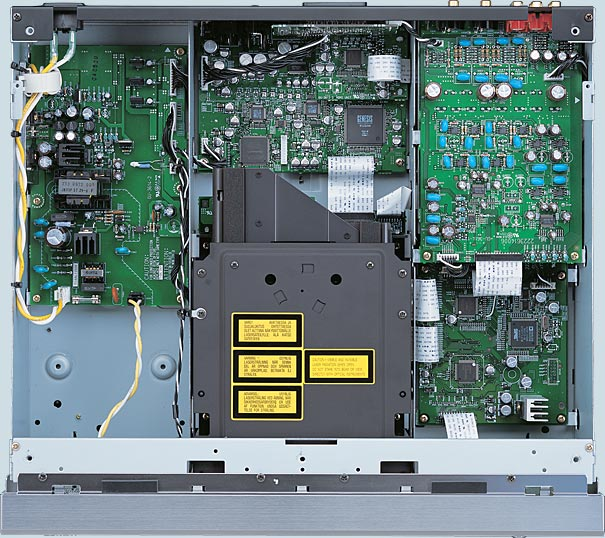
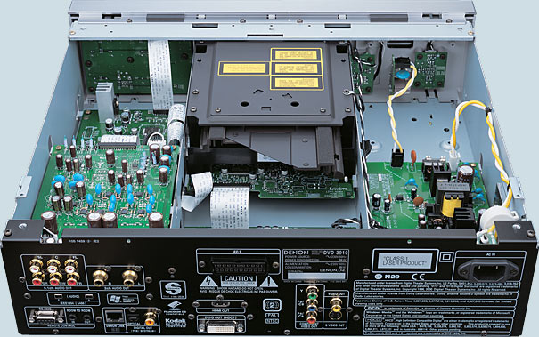
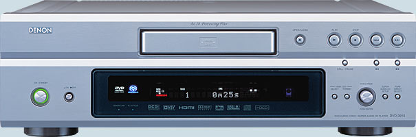
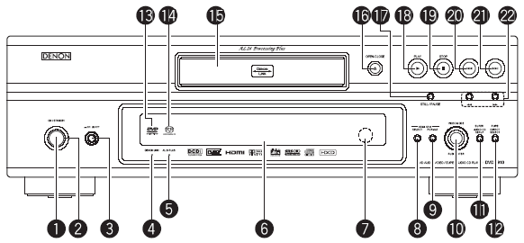
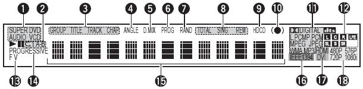
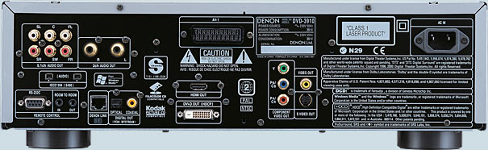
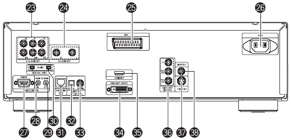
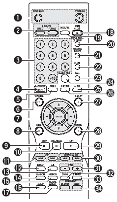
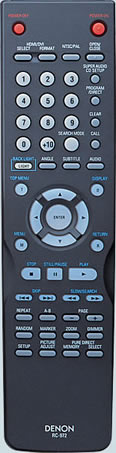

_This review was written by me for **MichaelDVD**, an Australian DVD review site that is no longer online. A capture of the site is held by the Internet Archive: **[browse it there](https://web.archive.org/web/20220217040146/http://www.michaeldvd.com.au/)**. It is reproduced here from my own copy of the site, as part of the record of what I have written._

Denon has gone from strength to strength in releasing high-end universal players, and every new generation seems to improve significantly in terms of features and performance. The DVD-3910 is the very latest and is currently the best-speced model in the current product line-up (although an even higher-end model replacing the previous flagship DVD-A11 is scheduled for release sometime in 2005).

One could perhaps be forgiven for thinking that this model is the replacement for the DVD-3800 given the similarity in model numbering, but in truth this player has all the features in the previous flagship DVD-A11 plus an HDMI interface and Denon Pixel Image Correction (DPIC). The only features missing are fairly minor ones: RCA instead of BNC component video outputs, quite possibly a different MPEG decoder instead of the ESS Vibratto (although this is not confirmed), and "off the shelf" Burr Brown DSD-1796 audio D/A converters instead of the Denon-exclusive DSD-1790 used in the DVD-A11. And all this at the same price as the previous DVD-2900 model (there is also a DVD-2910 in the new product line-up), so it seems you can have your cake and eat it!

The DVD-3910 supports all the major audio and video formats:

- DVD-Video (with inbuilt decoders for Dolby Digital and dts)
- DVD-Audio (with inbuilt decoder for MLP)
- Super Audio CD (with support for both stereo and multi-channel tracks, plus access to the CD layer for Hybrid discs)
- Video CD
- CD audio ("Redbook")
- HDCD
- Kodak Picture CD (note: this is not the same as a Kodak Photo CD)
- Fujicolor CD
- DVD-R/RW (burned as DVD-Video or DVD-Audio)
- CD-R/RW (burned to contain either CD Audio, MP3 or JPEG files)

The media/formats that are not supported are mainly esoteric ones:

- DVD+R/RW (although I tried a few and they worked)
- Super Video CD
- CD-V, CD-G
- "DivX" MPEG-4 discs
- Kodak Photo CD
- DVD-ROMs containing Microsoft Windows Media Video High Definition (WMV-HD)

## What's In The Box

The review unit I received seemed to be a production unit, and it came in a box weighing 6.9kg. Inside the box were:

- the player itself
- a remote control
- an IEC power cord
- an RCA 3-core audio/video cable cable (composite video, left and right audio)
- a FireWire cable
- a Denon Link (Shielded Twisted Pair) cable
- an owner's manual and service locations listing

The review unit was silver in colour. It seems like silver is the new gold in home entertainment fashion, which may be a problem if the rest of the components in your system are gold in colour (black, however, is available). I've long since given trying to colour match all the components in my setup, but if I cared I would be annoyed.

## Inside The Player

Opening up the unit revealed one of the most complex internals I have yet encountered in a DVD player - there is certainly a LOT of hardware in this player!

Looking at the diagram above, the right hand side of the player features no less than three circuit boards stacked on top of each other. The left hand features the power supply unit, and in the middle we have the transport unit stacked on top of the transport control logic board plus another board behind doing the video processing. There are multiple, smaller, boards, such as one for the SCART port, and even the power switches (hard and standby) are mounted on their very own board.

This diagram, taken at an angle from the rear of the player, shows the additional boards in the front for the front panel buttons and display.

Starting with the main system unit, which is at the bottom and largest board to the right of the transport (when the player is viewed from the front), the main processing grunt on the DVD-3910 is provided by an Analog Devices ADSP-21266 SHARC 32-bit Harvard-architecture processor running at 200Mhz, capable of 1.2Gflops. This is the latest generation and most powerful processor in the SHARC family available today. There's also a Mitsubishi M16C M30624FGPGP micro-controller (probably used for managing the user interface and basic operational logic). I can't identify the MPEG decoder chip because a paper label "3376106 001D9771" has been stuck on top of it.

The main system unit also contains the audio circuitry for the centre, subwoofer and surround channels, based on two Texas Instruments/Burr Brown PCM1796 (each chip operating in stereo or dual channel mode), eight 2068D op amp chips plus an assortment of fairly high quality capacitors. I also noticed two oscillators, operating at 24.576MHz and 18.75MHz.

On top of this board, completely enclosed by metal shielding to protect the audio circuits, is a separate board for the FireWire interface. The design is based on a Bridgeco L5A9625 processor and is separately clocked using 22.579MHz and 24.576MHz oscillators.

The third board stacked topmost is a dedicated board for the audio front left/right channels. Here we find another two PCM1796 plus no less than ten 2068D op amps and accompanying capacitors. The Denon literature implies that one PCM1796 is used for the dedicated stereo left/right outputs (containing a downmixed signal for multi-channel sources) and the other is used for the front left/right channels forming part of the analog 5.1 outputs.

The video processing unit is the board located behind the disc transport, containing the Genesis FLI2310 digital video format converter (responsible for deinterlacing and scaling operations), two Analog Devices ADV7310KST (12-bit 216MHz) video D/A converters for the analog video outputs (progressive and interlaced), a BH7862FS video driver (including filter, amplifier and line driver), and an Altera Cyclone EP1C3T144C8 programmable logic array. The HDMI interface is on a separate board again, containing a Silicon Image TMDS PanelLink Sil9030CT and a 13.5MHz oscillator.

All in all, some very impressive circuitry! Build quality is impressive given the complexity of the design, I did not notice any last minute hot wiring or patches. I would hate to imagine what Denon's manufacturing cost for this player is - I imagine it must be fairly substantial.

I rate the build quality as excellent. All circuit boards are uncluttered and of high quality, and feature surface mounted components exclusively.

## Region Coding

The player's region code was marked on the back panel. You can also check the region code by pressing both the STOP and the Forward Skip buttons simultaneously when there is no disc inserted. My review unit seemed to be originally marked as Region 2 on the back (but someone had applied a Region 4 sticker on top) and pressing STOP/Forward Skip caused the front panel display to read "REGION_A2" (the "A" presumably indicating that the player is multi-region enabled). On non multi-region enabled players the display should read something like "REGION_2".

In any case, like most recent DVD players sold in Australia, this player is multi-region enabled and has no problems playing my various Region 1, 2, 3 and 4 discs (including RCE-protected region 1 DVDs).

## Firmware

The firmware revision of the player can be determined by pressing the Play and Open/Close (on the front panel) simultaneously while turning the player on using the "hard" Power button, then press '3', '2', '6', '5' followed by pressing the 'Menu' button repeatedly on the remote.

These are the firmware versions reported by the review unit (on the front panel display):

| **Component** | **Version** |
| :------------ | :---------- |
| ESS           | 6609-5      |
| Make Day      | 831         |
| DRV           | 030825      |
| System        | 6767-3      |
| DSP           | 6770        |
| CNE           | 20040609    |

During the review period, I discovered that the player seems to crush below black and above reference white levels on the component video outputs (more on this later). When I reported the problem, I received a firmware update (Region 4 only) on a CD-R (which unfortunately did not fix the problem). The new firmware versions reported are:

| **Component** | **Version** |
| :------------ | :---------- |
| ESS           | 6609-6      |
| Make Day      | B08         |
| DRV           | 030825      |
| System        | 6767-3      |
| DSP           | 6770        |
| CNE           | 20040609    |

## Front Panel

The DVD-3910 front panel consists of the folllowing features:

- A "soft" power toggle button (On/Standby) (1), with a nice power indicator light (2) surrounding it in a ring (red for standby, green for on)
- A hard power switch (3)
- Denon Link indicator (4)
- AL24 PLUS indicator (5)
- Front panel display (VFD) (6)
- Remote control sensor (7)
- HDMI/DVI Select button (8) - cycles through HDMI Y Cb Cr, HDMI RGB, DVI, HDMI/DVI Off
- HDMI/DVI Format button (9) - cycles through 480P/576P, 720P, 1080i
- Video Mode rotary button (10)
- Super Audio CD Setup button (11) - cycles through Multi, Stereo, CD
- Pure Direct Select button (12) - cycles through Normal, Mode 1, Mode 2, All Off
- DVD Audio/Video indicator (13)
- Super Audio CD indicator (14)
- Disc tray (15)
- OPEN/CLOSE Button (16)
- Disc Navigation Buttons - STILL/PAUSE (17), PLAY (18), STOP (19), Skip Back (20), Skip Forward (21), Scan Back/Forward (22)

The DVD-3910 front panel design follows the "new look" common to the XX10 generation players, but the buttons are fairly similar to previous designs. The HDMI/DVI Select/Format buttons are new, as is the Video Mode combination knob and button (rotate to select between functions, push to activate). There are dedicated buttons to cycle through available Super Audio CD tracks and Pure Direct modes. I found the last two quite handy, even though they are also available on the remote control.

What's missing is a Search Mode button, which I found very useful on the DVD-2200. Later on, I found out why. The Search Mode feature is not usable unless you have a video display connected, thus there's no point putting it on the front panel.

Also missing are DVD menu navigation buttons, which means this is not a very friendly player for those who like to play their DVD-Audios without the display turned on.

The Video Mode knob/button allows the following functions to be changed:

- Picture Mode (Std, M1, M2, M3, M4, M5)
- Progressive Mode (Auto 1, Auto 2, Video 1, Video 2, Video 3)
- TV Type (Multi, NTSC, PAL)
- Squeeze Mode (Off, On)

## Front Panel Display

The DVD-3910 front panel is based on VFD technology, and is an expanded version of the one used in previous generations:

I've always liked Denon front panel displays - they display a lot of very useful information and look quite pretty. The annunciators on this new design are:

1. Current disc type inserted in player (DVD V, DVD Audio, VCD, Super Audio CD, CD)
2. Repeat play mode (Repeat All, Repeat 1, Repeat A-B)
3. Group/Title/Track/Chapter
4. ANGLE - Multiple Angles available
5. D.MIX - Current audio track is down-mixable
6. PROG - Programmed play mode
7. RAND - Random play mode
8. Total/Sing/Rem - Time play mode
9. HDCD mode detected
10. SRS TruSurround engaged
11. Currently playing audio format (Dolby Pro Logic, Dolby Digital, dts, L.PCM, P.PCM, MPEG, JPEG, WMA, MP3)
12. Active channels in current audio track (L, C, R, LFE, SL, S, SR)
13. F/V - Current video source is in Film/Video mode
14. Progressive video output mode
15. 13-character Dot matrix alphanumeric display
16. IEEE1394 (FireWire) output active
17. HDMI/DVI output active
18. Current video resolution of HDMI/DVI output (480P, 576P, 720P, 1080i)

When in stand-by mode, the unit can be woken up by pressing the Power On, Play and Open/Close buttons (on the front panel as well as remote control).

## Rear Panel

From left to right, we have:

- 5.1 channel audio analogue outputs (23) (RCA)
- Front L/R audio analogue outputs (24) (RCA)
- SCART terminal (25)
- Two pin IEC power socket (26)
- RS-232 interface (27)
- Room to Room in (28) /out (29) (this is used for wired remote control protocols)
- Two IEEE1394 FireWire outputs (30)
- Denon Link Second Edition output (31)
- Digital SP/DIF audio out - coaxial (32) and optical (33)
- DVI (HDCP) out (34)
- HDMI out (35)
- Component video out (36) (RCA)
- S-Video outputs (37)
- Composite video output (38) (RCA)

All I can say is wow! I've never seen a player that supports so many different types of digital and analog audio/video output types. There should be nothing out there that this player will not happily connect to (well, apart from esoteric connectors like the Japanese D connectors, and VGA).

## Remote Control

The remote control is designated RC-972.

Those of you who have read my reviews of other Denon DVD players may recall that I haven't been very impressed with the most Denon remote control shipped with their players.

Well, it looks like Denon may have been listening to me, because they have made a very good attempt at addressing almost all my previous complaints.

Well, first of all, every function available on the front panel is now duplicated on the remote.

There is some attempt to differentiate commonly accessed buttons such as STOP, PAUSE and PLAY, and best of all backlight is available on the important buttons.

The buttons are reasonably well spaced. All in all, this is a remote control I can grow to like!

Denon seems almost unique amongst Japanese manufacturers in using different buttons for Power On and Off.

I found out that the reason for this is so that you can program "turn all units on" (or off) type macros in your universal remote controller without worrying about whether the unit is currently on or off. This seems like very smart thinking, and I wish more manufacturers would do the same.

Going through the list of buttons available:

1. Power On/Off
2. HDMI Select/Format
3. Numeric Keypad
4. Backlight toggle
5. Angle - toggles through available video viewing angles on DVD
6. Top Menu
7. Disc/menu navigation buttons - Up, Down, Left, Right, Enter
8. Menu
9. Stop
10. Still/Pause - when in Pause mode this button advances to the next frame
11. Skip backward/forward
12. Repeat - repeat group/title/disc or track/chapter
13. A-B - repeat section between two points
14. Random - plays tracks/chapters in random order
15. Marker - mark a spot on disc to return to later (this is not as useful as you think because the player does not memorize markers when you eject the disc or turn the player off)
16. Setup - enters setup menus
17. Picture Adjust - allows you to adjust picture settings such as contrast, brightness, and gamma (you can change various points in the gamma curve - impressive!) for up to five memory settings (M1 to M5) plus a STD setting that corresponds to factory default/"normal"
18. Open/Close
19. NTSC/PAL
20. Super Audio CD Setup
21. Program/Direct - switch between Program and normal play
22. Clear - clears entered track/chapter numbers in Program mode
23. Call - review Programmed tracks/chapters
24. Search Mode - directly access specific group/title or track/chapter
25. Audio
26. Subtitle
27. Display
28. Return - go back to previous menu
29. Play
30. Slow/Search
31. Page -/+ - selects next/previous stills whilst playing a DVD Audio disc
32. Zoom - cycles through various video zoom settings (Off, 1.5x, 2x, 4x) - the arrow keys allow you to move the zoom area within the frame
33. Dimmer - adjusts the brightness of the front panel display (four different levels from off to maximum)
34. Pure Direct Memory/Select

## Player Operation

Denon has been hard at work fixing most of the operational issues in earlier DVD players, but at the same time introducing a few new ones.

The Picture Adjustment settings have been significantly improved over previous generations. After pressing the "Picture Adjust" button on the remote control, you have access to no less than three groups of image quality settings that you can store into five memories for instant recall.

The settings you can store into memory are (**bold**is the default):

- Contrast (-6, ..., **0**, ..., +6)
- Brightness (**0**, ..., +12)
- Sharpness (mid frequencies) (-6, ..., **0**, ..., +6)
- Sharpness (high frequencies) (-6, ..., **0**, ..., +6)
- Hue (-6, ..., **0**, ..., +6)
- Cross Colour Suppression (**0**, ..., +3)
- White Level (-5, ..., **0**, ..., +5)
- Chroma Level (-6, ..., **0**, ..., +6)
- Chroma Delay (-2, ..., **0**, ..., +2)
- Digital Noise Reduction (**0**, ..., +6)
- Vertical Enhancer (**0**, ..., +11)
- Horizontal Enhancer (**0**, ..., +11)

You can also make micro adjustments to gamma (and store them in the image quality memories) using either a spreadsheet table style interface or graphically using a gamma curve (up to ten points).

Finally, there are three "global" settings that apply at all times:

- Black Level (0 IRE, 7.5 IRE)
- Horizontal Position (-7, ..., **0**, ..., +7)
- Vertical Position (-3, ..., **0**, ..., +7)

Needless to say, this is an impressive set of parameters. Some critics in the past have whinged about the limited range of user adjustable settings (or even none) on Denon players compared to other manufacturers like Sony, Pioneer or Panasonic. I think these critics will be more than happy with the flexibility now provided (for review purposes, I left all settings at default).

In terms of major operational quirks fixed, Denon has finally implemented Auto Play on DVD-Audio correctly. This is the feature that allows the player to automatically play the default audio track on a DVD-Audio if you press the Play button with the tray open (and the disc inserted in the tray).

However, the Search Mode feature reverts to the unfriendly version implemented in earlier players rather than the improved version featured on the DVD-2200. The Seach Mode function is supposed to allow you direct access to a specific Title/Chapter in a DVD-Video or Group/Track in a DVD-Audio (using the Skip keys or the numeric keypad). Pressing the button cycles through either Title/Group selection mode or Chapter/Track. On the DVD-2200, the front panel display will briefly flash the current mode whenever you press the key, but the DVD-3910 relies on the on-screen display, which makes the button useless unless you have a video display connected and turned on - and extremely inconvenient if you are the sort of person (like me) who prefers to listen to DVD-Audios without the TV on.

Other quirks remain - such as the funny way of selecting audio/subtitle/angle (by using the up and down cursor keys). Also, pressing the Chapter/Track skip buttons whilst the player is paused will cause the player to immediately Play the next chapter/track - this behaviour is contrary to that in most other players which will skip and pause on the next/previous Chapter/Track.

One thing I found annoying was that many functions such as DVD menu navigation, browsing through WMA/MP3/JPEG folders, and even starting and stopping playback are painfully slow on this player, especially compared to the fast response times I was used to on the DVD-2200. Finally, I can occasionally hear the whirring motor noise when the player is playing certain discs, plus a tendency for the player to vibrate strongly (I don't think this will cause the player to jump off the shelf given that it's nearly 10kg in weight but I can definitely feel the chassis vibrating, and this vibration may transfer to other components in your system rack).

The player has bookmarks (Denon calls them "markers") allowing the player to memorize a particular point on the disc allowing you to return to it later. However, the markers are not remembered when the player is switched off or enters stand by mode, thus severely reducing the usefulness of the feature.

This player has two user definable "Pure Direct" modes (allowing various components of the player to be switched off for a purer analog output signal) as well as Normal (all components on) and All Off. You can selectively program each setting (Mode 1, Mode 2) to selectively turn off any combination of Digital audio output, video signal output, front panel display.

I recommend the following settings:

- Mode 1 (for DVD-Audio discs): Digital Output Off, Video Out On, Display On
- Mode 2 (for Super Audio CDs and audio discs): Digital Output Off, Video Out Off, Display On

## Manual

The manual follows the standard Denon format of being typeset in landscape rather than portrait orientation, but with two columns of text on each page. It is fairly thick and contains 206 pages, but this is because it has versions for several languages (English, German, French, Italian, Spanish, Dutch and Swedish). The English section is only 34 pages.

I would strongly recommend that you read the manual carefully because some functions are not intuitively obvious or behave differently from other manufacturers' players. For example, Subtitle does not cycle across available subtitle tracks - it puts the player into subtitle mode and you use the up and down arrow keys to cycle across subtitle tracks.

## Set-Up Menu

The set-up menu is accessed by pressing the Setup button which brings up a tabbed set of setup parameters. You navigate across tabs (effectively sub menus) using the left and right arrow keys. The up and down arrows allow you to navigate between setup parameters. Pressing the right arrow key on a setup parameter will allow you to change it. Exiting the setup menu is done by pressing the Setup button again or by navigating to the "Exit Setup" menu item.

The setup menus and parameters are similar to those on previous generation players, with with a few twists.

The items in **bold** below are the default settings for the player.

The "Language Setup" sub menu contains the following parameters:

- Dialog (select language of default audio track - default is **English**)
- Subtitle (select language of default subtitle track - default is **English**)
- Disc Menus (select language of default DVD menu - default is **English**)
- OSD Language (select language of on screen display- default is **English**)

The above setup parameters allow you to directly select between English, French, Spanish, German and Italian (except for OSD, which omits Italian). All other languages require you to enter a four digit language code from the manual.

The "Digital Interface Setup" sub menu contains the following parameters:

- HDMI/DVI Black Level (**Normal**, Enhanced) - does not work when HDMI mode is set to Y Cb Cr
- HDMI Audio Setup (**2ch**, Multi - Normal, Multi- LPCM)
- Denon Link (**Off**, 2nd)
- IEEE1394 (**Off**, On)

The Normal HDMI/DVI Black level is based on Studio RGB (16-235) whereas Enhanced crushes black levels below 16 and white levels above 235. I would recommend leaving this on Normal and adjusting your display Brightness and Contrast settings accordingly.

Setting the HDMI Audio Setup to Normal (LPCM) enters a HDMI Speaker Setup sub-menu:

- Speaker Configuration

- Front Speaker (**Large**, Small)
- Center Speaker (**Large**, Small)
- Subwoofer (**Yes**, No)
- Surround Speaker (**Large**, Small)
- Crossover (40,60,**80**,100,120Hz)

- Channel Level

- Test Tone (**Off**, Auto, Manual)
- Front L Channel (-10dB, ...**0dB**)
- Center (-10dB, ...**0dB**)
- Front R Channel (-10dB, ...**0dB**)
- Surround L Channel (-10dB, ...**0dB**)
- Surround R Channel (-10dB, ...**0dB**)
- Subwoofer (-10dB, ...**0dB**)

- Delay Time

- Distance (**Meters**, Feet)
- Front L Channel (**3.6m**)
- Center (**3.6m**)
- Front R Channel (**3.6m**)
- Surround L Channel (**3.0m**)
- Surround R Channel (**3.0m**)
- Subwoofer (**3.6m**)
- Default (On)

Setting the IEEE1394 interface to On enters a IEEE1394 Setup sub-menu:

- Auto Play (**Off**, On) - allows player to be controlled remotely
- Audio Format (**Format1**, Format2) - select between a Denon proprietary format (Format1) or a different format ("for future system expansion")

The "Video Setup" sub menu contains the following parameters:

- TV Aspect - 4:3 PS, 4:3 LB, **WIDE (16:9)**
- TV Type - NTSC, PAL, **MULTI**
- Video Out - **Progressive**, Interlaced
- Progressive Mode - **Auto 1**, Auto 2, Video 1, Video 2, Video 3
- Squeeze Mode - **Off**, On
- AV1 Video Out - **Video**, S-Video, RGB (this affects which pins in the SCART connector are active)
- Still Mode - Field, Frame, **Auto**
- Black Level - **Darker**, Lighter

Interestingly, all progressive modes are cadence reading and motion adaptive, they simply provide different hints to the deinterlacing algorithm regarding the video source:

- Auto 1 - 3:2 pulldown for film mode
- Auto 2 - 2:2 pulldown for film mode
- Video 1 - "regular" video material
- Video 2 - video material with little movement (prefer Weave)
- Video 3 - video material with a lot of movement (prefer Bob)

The Faroudja FLI2310 does a pretty good job at deinterlacing in Auto 1 for a wide variety of material, so I would recommend just leaving this setting at Auto 1 and "forgetaboutit." An alternative if you not have any NTSC DVDs is to set the player to Auto 2 which is better optimized for PAL.

Missing are Black Level (moved to Picture Adjust) and Still Mode settings.

The "Audio Setup" sub menu contains the following parameters:

- Audio Channel - **Multi-channel**, 2 channel SRS Off, 2 channel SRS On (SRS TruSurround only works on DVD and VCD audio tracks)
- Digital Out - **Normal**, PCM (force audio format conversion through SP/DIF)
- LPCM (44.1kHz/48kHz) - **Off**(no downsampling), On (downsampling)
- Source Direct - **Off**, On (audio DSP bypass mode)
- Bass Enhancer (2 channel) - **Off**, On (routes low frequencies to subwoofer)
- Compression - **Off**, On (Dolby Digital dynamic range compression)
- SACD Filter - **50kHz**, 100kHz (routes low frequencies to subwoofer)

Missing is the ability to default to a specific type of Super Audio CD track (Multi, Stereo, CD).

Setting the Audio Channel to Multi-Channel enters a Speaker Setup sub-menu identical to the HDMI Speaker Setup menu, except for an additional SW+10dB setting (default **Off**) under Channel Level parameter group. This is to address a common criticism of Denon DVD players having low subwoofer output volume.

One point of caution: turning Source Direct On does not disengage the SW+10dB setting, so if you don't want your subwoofer to sound annoyingly loud, remember to set it back to 0dB.

The ability to change the SACD filter roll-off frequency is a new parameter, but the rather confusing Filter setup parameter (which controlled multiple things, including filtering of the subwoofer channel, DSP bypass and LFE attenuation) has disappeared, which is just as well.

The "Ratings" sub menu allows selection of parental control rating level (0 - Lock All to **8 - No Limit**)and password (default is **0000**).

The "Other Setup" sub menu contains the following parameters:

- Player Mode - **Audio**, Video (selects whether DVD-A or DVD-V is played when a DVD Audio disc is inserted)
- Captions - **Off**, On (decodes closed caption information embedded in the video stream)
- Wall paper (select background screen between **Blue**, Gray, Black and "Picture" - a non-customisable bitmap containing the Denon logo and some text - I would have liked the ability to select my own colour or the ability to display Jacket Pictures on the disc)
- Display - **Off**, On (indicate whether front panel display shows player operation mode briefly whenever it changes, but only if display has been switched off)
- Auto Power Mode - **Off**, On (automatically enter power stand by mode if not used for a while)
- Slide show - **5**-15 seconds (interval between stills in a JPEG slide show)

## Video Playback

I calibrated the player by adjusting the display settings of my Sony VPL-VW11HT LCD projector (and leaving the Picture Mode of the DVD player on "Standard") using the [**_Digital Video Essentials_**](http://www.videoessentials.com) test discs (both NTSC and PAL), as well as using the older title (_**[Video Essentials](http://www.videoessentials.com)**_).. The player's video output must be close to reference levels, for my adjusted settings were very close to the default settings.

I only tested the player in progressive scan mode (for both PAL and NTSC titles). I did briefly put the player in interlaced mode to verify that it outputs interlaced video correctly. I was not able to test the HDMI or DVI/HDCP digital video outputs due to the lack of suitable equipment to connect the player to.

Compared to budget DVD players, the initial picture quality may been just a bit on the soft side, but this is because the player does not apply any sharpness enhancement by default, preferring to deliver the video exactly as it was encoded but allow the user to adjust the picture quality using a comprehensive set of post-processing parameters if required. This approach pays off as the player is not as susceptible to edge enhancement ringing or Gibbs effect mosquito noise as the cheap players.

I was not able to determine the MPEG encoder used in the player as Denon has covered up the chip markings with a sticky paper label. Denon claims the player is using the latest generation ESS Vibratto, and certainly based on the discs I tried the behaviour of the decoder on various scenes were identical to those of players based on the Vibratto, particularly in terms of being able to display silky smooth slow pans, and successfully avoiding shimmering and moire patterns that seem to plague many decoders.

Another piece of good news: the player shows no signs of the dreaded chroma upsampling error or the interlaced chroma upsampling problem. Saturated colours had completely smooth edges and were streak free on all different tests on Microsoft's DVD Test Annex 3.0 and also on the usual NTSC and PAL discs that in the past have exhibited the problem on previous Denon players: _Saturday Night Fever_R1, _The Hunt For Red October_R1 and _Unconditional Love_R4. Yeah!

And now for not so good news: the player does not seem to pass PLUGE (below black) correctly, no matter what combination of HDMI/DVI Black Level or Picture Adjust Black IRE setting I used. Also, the player seems to crush above reference whites. I even tried initializing the player back to default settings (and yes, I did turn it off and on just in case). I suspect this is a firmware problem, as owners have reported that they have managed to get the player to pass PLUGE and avoid crushing whites. I asked for, and received a firmware update but unfortunately it did not fix the problem.

Because of this problem, the player does not seem to display as much shadow level detail or highlight detail as my reference player: an HTPC running Microsoft Windows Media Center Edition 2005 and the NVDVD decoder on a GeForce 6600 graphics card.

There has also been a lot of discussion of the so-called "macro-blocking" problem inherent in the FLI2310 chip. In any case, I did not really encounter any objectionable instances of macro-blocking in the DVDs that I watched, although I did notice a tendency for "slight" banding (appearance of faint horizontal lines on what should be smooth backgrounds) occasionally.

The fast forward/fast reverse buttons give you multiple playback speeds (2X, 4X, 8X and 16X) which you can cycle by pressing the button repeatedly. You will exit fast forward/rewind operation by pressing "Play." The Pause button is a bit unconventional in that pressing it again whilst in Pause mode will advance to the next frame instead of reverting back to Play (I couldn't find a way of moving to the previous frame). Pressing the forward/rewind buttons when the player is paused will activate several speeds of slow scans (1/2, 1/4, 1/6 and 1/8). To exit Pause mode, you have to press the Play button. Once I got used to it, the buttons are surprisingly effective in cueing up to the right spot.

As with other upmarket Denon DVD players, this player includes a memory buffer that minimizes the "freeze" effect of a layer change transition. Layer changes are extremely smooth on this player and will be unnoticeable for most discs, even problem ones like _**Fried Green Tomatoes**_R4. The only time I noticed a layer change was watching the time elapsed counter very closely, as this sometimes does not count up as smoothly in the vicinity of a layer change. However, on DVDs that split a film across several titles (including the above-mentioned _**Fried Green Tomatoes**_), I noticed that title transitions still incur a pause (and a fairly long one at that). The player did stumble on the "worst case scenario" layer change on the Microsoft WHQL DVD Test Annex 3.0 Disc 2 (this layer change occurs during scrolling titles encoded at the maximum permissible bit rate) - it paused for around half a second. Still, better than the 3-4 seconds I've seen on other players.

In summary, the DVD-3910 has excellent video quality, apart from the crushing of below black signals and above-reference whites.

## Progressive Scan

As you would expect from any player based on the Genesis FLI2310 chip, the player's progressive scan performance is excellent. The DVD-3910 fully supports both NTSC and PAL progressive scan, and does pixel-based motion adaptive deinterlacing based on adjacent fields rather than relying on flag reading. In fact, it's not possible to force the player to respect the encoded progressive flag, it is always operating in cadence-reading mode.

It passes the majority of the cadence tests of Microsoft's WHQL DVD Test Annex 3.0, including the really tough ones like film mode recognition, and incorrectly encoded sequences. It recovers from bad edits very quickly, always within the next frame or so, and often completely transparently. It does not recognise 2-3-3-2 cadences and will drop into video mode, but then I don't know any player today that will weave 2-3-3-2 cadences correctly.

Even in video mode, the player does a very good job, and often it's hard to tell the difference between bob and weave deinterlacing, as can be seen by looking at various versions of DVE's Snell and Wilcox Zone Plate test at field and frame rates.

About the only fault I've noticed is an occasionaly tendency to drop into video mode for "difficult" frames, but whenever this happens, the player usually recovers by the next frame.

## On Screen Display

The on-screen display is accessed while the DVD playing by pressing the "Display" button on the remote control. It's pretty basic and features two lines of text. The following information is cycled on repeated presses of the Display button:

- Title (Current/Total), Chapter (Current, Total), Title Elapsed in HH:MM:SS
- Title (Current/Total), Chapter (Current, Total), Title Remain in HH:MM:SS
- Title (Current/Total), Chapter (Current, Total), Chapter Elapsed in HH:MM:SS
- Title (Current/Total), Chapter (Current, Total), Chapter Remain in HH:MM:SS
- Audio (Track No/Total), Track Description (eg. "DOLBY D 3/2.1"), Subtitle (Current/Total), Subtitle Language (eg. "ENGLISH") and whether the subtitle track is ON or OFF.

Although the display of total titles of disc and total chapters within current title are useful, I would have liked to see Total Time (title or chapter) as well as a bitrate indicator. Given that the player is extremely smooth on layer changes due to memory buffering, I would have also liked to see a layer indicator.

Also, the display of the current subtitle language (eg. "English") is useful but I wish Denon had a more extensive language name lookup table in the firmware because more often than not the player displays the subtitle language as "Unknown." Worse still, when it displays "Unknown" it doesn't even display the language code to allow you to look it up yourself.

By the way, the player will recognize SACD Text and display the title/artist of the disc as well as track titles (as part of the on-screen display). However, it does not recognize CD Text or DVD Text.

## Standards Conversions

The player fully supports conversion from PAL to NTSC and NTSC to PAL. The former is done a bit better than the latter, as it is a lot easier to drop resolution and insert a few extra frames here and there than it is to convert 60Hz material to 50Hz (without a lot of CPU grunt and sophisticated algorithms).

Both conversions result in occasional deinterlacing errors resulting in occasional combing. NTSC to PAL causes occasional stutter and judder, PAL to NTSC seems reasonably smooth.

The player can be set to convert from Dolby Digital/dts/MPEG to PCM on the digital out connections. However, this is an all or nothing proposition - you can't enable dts to PCM but not Dolby Digital to PCM for example.

I was surprised that the player successfully recognized and decoded the MPEG )|( 5.1 multi-channel audio track in my R4 copy of _**Fly Away Home**_ - especially since previous generation players downmixed this track to 2 channels.

## Other formats

The DVD-3910 had no problems playing a selection of CD-R and CD-RW discs that I inserted into it, including gold and blue/green discs recorded at various speeds. It was able to correctly recognize CD-Rs and CD-RWs containing:

- PCM audio tracks ("Redbook" format)
- dts music CD (encoded in pseudo "Redbook" format) - only via digital out, not internally
- ISO9660 CD-ROM containing MP3 and WMA audio files
- ISO9660 CD-ROM containing JPEG image files

The player also had no problems with various recordable DVDs that I threw at it (including all four variants: -R, -RW, +R, +RW) although the player officially only supports the -R and -RW variants. I tried a variety of home-burnt DVD-Video, DVD-Audio and DVD-ROM discs containing MP3 and JPEG files.

In addition, the player had no problems recognizing the following types of commercially pressed discs:

- Video CD ("_James Bond: The Man With The Golden Gun_")
- DVD-Video containing PCM 96/24 audio track (also known as a "Digital Audio Disc" or DAD) (The Alan Parsons Project "_I Robot_")

## MP3 and JPEG Playback

The player's MP3 playback implementation is similar to previous Denon players, complete with an "Explorer"-like on-screen display of folders and tracks. The navigation keys can be used to navigate in and out of folders and to select MP3 files to play. The player even reads multi-session discs correctly on both CD-R and CD-RW. The player will support constant bit rate MP3 files as well as variable bit rate MP3 files. However, it does not recognize ID3 tags or MP3 play lists. It does recognise (Joliet) long file names but only displays the first few characters in the menu.

| **Test Disc Format** | **Results** |
| :-- | :-- |
| CD-R >100 MP3s (128 Kb/s) in multiple, nested subdirectories | Found all files |
| CD-R >100 MP3s (128 Kb/s) in root directory | Found all files |
| CD-R with MP3s (CBR ranging from 20-320 Kb/s, VBR ranging from 1%-100% quality), 1 WMA and 1 WAV file | Recognized and successfully played all CBR and VBR files. Recognized and successfully played WMA file. Did not recognize WAV file. |
| Multisession CD-RW (2 sessions each containing MP3 files) | Found all files in both sessions |

The player's JPEG image display capability allows you to view JPEG still images (presumably scanned from your photo album or taken using a digital camera) burned onto an ISO9660 CD-R. The implementation is very similar to the MP3 playback menu - showing folders stored on the disc and filenames of images with a .JPG extension. In fact, you can even play a disc containing a mixture of MP3 and JPEG files correctly. It will display successive images in a slide show with programmable delays between images.

The player recognized more than 1000 files within a single folder, and had no problems playing back all files (even though the manual recommends no more than 99 files per folder).

The player will automatically resize the JPEG image to fit within an NTSC progressive frame.

## Audio Playback

I initially listened to this player in both stereo and multi-channel, playing a variety of material including CDs, Super Audio CDs, DVD-Audio discs, and various audio tracks on DVD-Video discs.

Straight out of the box, the player sounded a bit "polite" and "well-mannered", almost as if it was too scared to make a loud noise. It played back music quite faithfully, but perhaps lacking a bit of excitement and spice.

I then proceeded to "burn in" the player by playing a CD-R containings various test signals (several types of sine wave sweeps, plus different kinds of pseudo-random noise patterns) in continuous repeat mode for just under 100 hours. After that, the player opened up considerably.

I was quite pleased by the DVD-3910 purely as an audio player, using the analog audio outputs exclusively. It has a fairly confident and authoritative presentation, to the extent that if I listen to it for any length of time I soon become convinced that it was reproducing music as accurately as possible, and nothing could sound better than it. That's a fantastic illusion, and one that very few players that have graced my living room have been able to pull off.

I noticed an improvement in the sound by engaging Source Direct On (which bypasses all processing such as bass and time management) - otherwise the presentation sounded just a tiny bit veiled.

Also, I discovered on this player using the Pure Direct modes are definitely worth it. Turning video output off and digital audio output seems to improve the sound coming from the analog outs. The differences were quite noticeable, and akin to lifting a veil off the music and improving the dynamics slightly. In Normal mode, the player still displayed a tiny vestige of the initial "politeness" and a tendency to dampen dynamics slightly.

The player seems equally adept at various formats, and the various DVD-Audio, SACD, HDCD and CD discs that I fed into it all played successfully. The overall "characteristic" or "sonic signature" of the player appear to be a rather warm and thick sound, with prominent bass "punch" and clear high frequencies with no noticeable trace of harshness or ringing.

Discs tested include:

- Fourplay (DVD-Audio)
- Pat Metheny Group: _Imaginary Day_(DVD-Audio)
- The Alan Parsons Project: _I Robot_(DVD-Audio and DVD-Video with a Linear PCM 96/24 2.0 audio track)
- Getz/Gilberto (SACD 2 channel)
- Alfred Brendel: Chopin Polonaises (SACD 2 channel)
- Chris Botti: _Night Sessions_(SACD multi-channel)
- James Taylor: _Hourglass_(SACD multi-channel)
- Joni Mitchell: _Shadows and Light_(HDCD)
- Mike Oldfield: _Ommadawn_(HDCD)
- Michael Brecker: _The Nearness of You_(CD, as well as ripped into MP3 and WMA files)
- CD-R recordings made from various LPs

In comparison with cheaper players (such as the entry level DVD-1710 or my Panasonic DVD-RP82), the DVD-3910 doesn't have the strident brightness that tends to cause listener fatigue. In comparison with more expensive players (such as my Sony SCD-XA777ES or the Linn Unidisk 1.2 or even Denon's previous flagship the DVD-A1), the DVD-3910's overall delivery did not sound as natural or liquid, and perhaps did not extract low level detail as convincingly as others. But these are all very minor criticisms, and these "faults" as such are only noticeable in close comparisons with other players.

Interestingly, I felt that the player was probably better at playing Super Audio CDs and CDs than DVD-Audios, which was surprising given Denon was an early supporter of DVD-Audio. For some reason, the DVD-Audio discs that I sampled came across a bit "soft" and unexciting compared to other players, but on the positive side I felt the presentation was less prone to harshness, sibilance or "ringing" compared to my Panasonic DVD-RP82.

Dolby Digital and dts decoding are excellent, courtesy of the SHARC processing . The player does not decode newer surround formats such as Dolby Digital EX, dts ES, or dts 96/24. It also doesn't do THX post processing nor Dolby Headphone, so if you want all those formats you still need an external processor. I tried playing a dts encoded CD, and although the player successfully player the disc (as well as sent the dts stream successfully via the digital output), the front panel display did not flag the disc as containing dts content.

Needless to say, I had no problems connecting the optical digital audio output to my amplifier. I did not try the HDMI or IEEE1394 digital outputs due to the lack of suitable equipment that can receive such signals, and unfortunately although my Denon AVC-A1SE has an upgraded digital board that accepts Denon Link, I only have the original Denon Link and not the Second Edition implemented on this player so I did not try to hook the player up via Denon Link. In any case, the player's analog audio outputs sound noticeable superior to the internal D/A converters in my AVC-A1SE that there would be no point in doing the link.

Audio synchronization (on both analogue and digital outputs) is excellent, and the usual problem sequences (on _**Wedding Singer**_R4 second remastered edition and also _**Matrix**_R1) played perfectly, as well as a A/V timing clock test on DVE.

Like all other Denon players that I have tested to date, the DVD-3910 does not handle material encoded with [0dBFS](http://www.audioholics.com/techtips/specsformats/0dbfsdigitalplayback.php)+ levels, resulting in distorted waveforms.

In summary, I think the player delivers excellent sound quality and is a formidable performer in its price range.

## Disc Compatibility Tests

I tested the player against a number of discs to highlight potential problems: _Specific Tests_

| **Disc** | **What Is Tested** | **Results** |
| :-- | :-- | :-- |
| The Matrix R1 Follow The White Rabbit | Tests active subtitle feature, seamless branching, ability to load hybrid DVD/DVD-ROM and audio sync. | YesYesYesYes |
| Wedding Singer Remaster 2 R4 Audio Sync | Opening scene tests audio sync. | Yes |
| Terminator: SE R4 Menu Load | Tests ability to load complex menu | Yes |
| Independence Day R4 Seamless Branching | Tests ability to handle seamless branching (Chapter 3) | Yes |
| Patriot R1 RCE | Tests ability to handle RCE protected DVDs in Auto multizone mode (if applicable). | Yes |
| Toy Story R1 Chroma Upsampling | Tests for presence of chroma upsampling error (Chapter 3 and 4) | Yes (however the chroma upsampling error was observed on other material) |

As you can see, the DVD-3910 passes all tests (apart from the chroma upsampling bug) with flying colours.

## User Convenience Features

| Screen Saver | No  |
| :----------- | :-- |
| Zoom         | Yes |

## Overall

### The Good Points

- Excellent video and audio quality (no chroma upsampling error)
- State of the art progressive scan implementation
- Wide support for audio/video outputs, including the latest digital interface standards such as HDMI, DVI/HDCP and IEEE1394
- Video upconversion to 720p and 1080i for HDMI and DVI/HDCP
- High resolution digital audio output via HDMI, IEEE1394 and Denon Link Second Edition
- "universal" support for disc formats
- excellent in-built decoders for Dolby Digital and dts
- extensive set-up and playback options, and image quality settings
- will playback JPEG images, Fujicolor CDs and Kodak Picture CDs
- good and usable remote control

### The Bad Points

- slow disc navigation and access
- an occasional "whirring" noise and vibration when playing discs
- Search Mode function not usable without a video display
- no in-built decoders for 7.1 formats such as Dolby Digital EX and dts ES
- does not remember bookmarks or "markers" when player is turned off or enters stand by
- no support for various features including layer change indicators, CD/DVD Text, Jacket Pictures, CD index points
- does not play back 0dBFS+ levels on PCM without distortion

## Features At A Glance

| **High Quality Analog Video** | Component Output | Yes | RGB Output | Yes |
| :-- | :-- | :-- | :-- | :-- |
| **Digital Video Output** | HDMI | Yes | DVI/HDCP | Yes |
| **Progressive Scan** | NTSC | Yes | PAL | Yes |
| **Audio** | dts Output | Yes | MP3 Playback | Yes |
| **High Resolution Digital Audio Output** | IEEE1394 (FireWire) | Yes | Denon Link | Yes |
| **High Resolution Audio** | DVD-Audio | Yes | Super Audio CD | Yes |
| **CD-R/RW, DVD-R/RW** | Yes |  |  |  |
| **Conversion** | NTSC and PAL conversion |  |  |  |
| **Inbuilt Decoder** | Dolby Digital, **dts**, MLP, WMA, MP3, JPEG, DSD, MPEG Multichannel |  |  |  |

## In Closing

It's hard to fault the DVD-3910: a "universal" player supporting nearly all disc formats and just about every major audio/video output interface (digital/analog), and one that does it "with style" and providing excellent performance, all at a lower cost than the previous flagship! If you want a player that has it all but don't want to spend silly money, I reckon you should consider this player very seriously. There are a few minor quirks, to be sure, but I would strongly recommend this player if you are interested in excellent audio AND video quality.

## [Ratings (out of 5)](../Ratings.html)

| **Performance**     | ★★★★★ |
| :------------------ | :---- |
| **Build Quality**   | ★★★★★ |
| **In Operation**    | ★★★★  |
| **Compatibility**   | ★★★★★ |
| **Value For Money** | ★★★★★ |

## Technical Specifications (Manufacturer Supplied)

| **Product Type:** | DVD-Video/Audio, Super Audio CD, Video CD, Audio CD, WMA/MP3/JPEG CD, Kodak Picture CD player |
| :-- | :-- |
| **Region:** | 2 (multi-region enabled) - although a Region 4 sticker had been applied to the back of the player |
| **Signal System:** | PAL / NTSC |
| **Serial Number Of Unit Tested:** | 4108404387 |
| **MPEG Decoder:** | "3376106 001D9771" |
| **Audio Frequency Response:** | 2 Hz-20 kHz (CD) 2 Hz-22 kHz (48 kHz sampling) 2 Hz-44 kHz (96 kHz sampling) 2 Hz-88 kHz (192 kHz sampling) 2 Hz-100 kHz (Super Audio CD) |
| **Signal to Noise Ratio:** | 120 dB |
| **Dynamic Range:** | 110 dB |
| **Total Harmonic Distortion:** | 0.0008% |
| **Dimensions:** | 434 mm (w) x 403mm (d) x 137mm (h) |
| **Weight:** | 9.3 kg |
| **Price:** | \$1,999 |
| **Distributor:** | Audio Products Australia 67 O'Riordan Street Alexandria NSW 2015 |
| **Telephone:** | 1 800 642-922 |
| **Facsimile:** | 1 800 246-262 |
| **Email:** | info@audioproducts.com.au |
