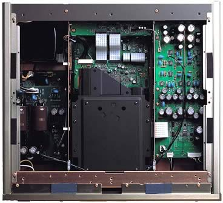
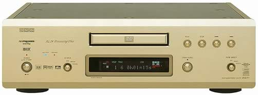
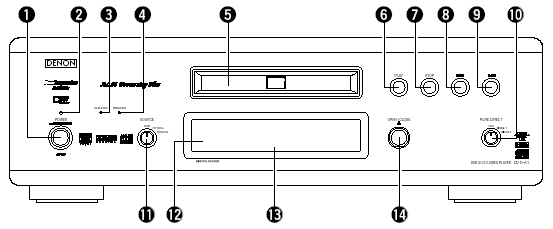
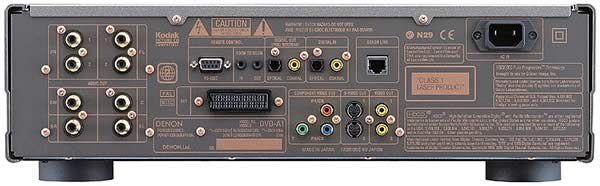
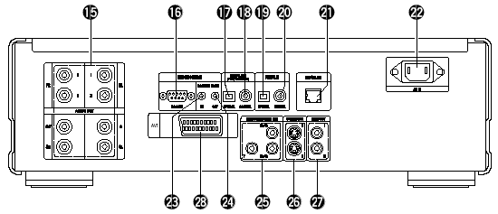
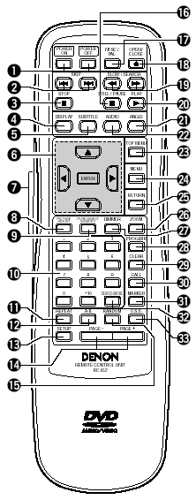
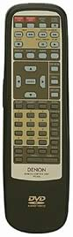

_This review was written with **John Lee** for **MichaelDVD**, an Australian DVD review site that is no longer online. A capture of the site is held by the Internet Archive: **[browse it there](https://web.archive.org/web/20220217040146/http://www.michaeldvd.com.au/)**. It is reproduced here from my own copy of the site, as part of the record of what I have written._

The accepted wisdom in high end circles seems to be - the more expensive the equipment, the heavier it is. Obviously, Denon must believe in this adage for the DVD-A1 weighs over 18 kg (nett, not gross!) and cost A\$6,999. Buying this player will put a heavy load on your arms and make your wallet surprisingly thin and lightweight.

The DVD-A1 will play back discs in the following formats

- DVD-Video (with in-built decoders for Dolby Digital and dts)
- DVD-Audio (with in-built decoder for MLP)
- DVD-R/RW (burned as DVD-Video)
- CD-R/RW (burned to contain either MP3 or JPEG files)
- Kodak Picture CD (note: this is not the same as a Kodak Photo CD, which I only learnt after unsuccessfully trying to get the player to play my Photo CDs)
- Video CD
- HDCD
- CD audio ("Redbook")

The inclusion of Kodak Picture CD and JPEG display capability are somewhat unusual, but the player still falls a bit short in the compatibility stakes due to the lack of support for emerging formats such as Super Audio CD (contrary to rumours prior to the player's release which indicated that this might be Denon's first "universal" player), and Super Video CD. There is also no explicit support for DVD+R/RW. Given the availability of "universal" players such as the Pioneer DV-733A and Marantz DV-8300, why would anyone pay more for a player that doesn't play "everything?" The answer can be summed up in three words: quality, quality, quality.

This is a serious attempt by Denon to reach into the high end market with a flagship "no compromise" player. Having pretty much conquered the premium A/V integrated amplifier and receiver market (despite being nipped in the heels by competitors such as Pioneer and Onkyo), Denon is trying to extend into the premium DVD player market. It hasn't been an easy road to travel so far. Denon does not have the R&D budget nor the economies of scale of manufacturers such as Panasonic, Pioneer, Sony or Toshiba. Early Denon DVD players are based on Panasonic designs and these range from straight rebadges to modified designs typically incorporating a Denon audio stage. Some of these are excellent players - including the Denon DVD-1600 and DVD-3300 (both of have been reviewed on this site and have received the "two thumbs up" rating).

Denon's first completely in-house designed player, the DVD-2800, was a mixed bag. When it was first announced, it generated a lot of hype as it was the first DVD player to incorporate the superb Silicon Image Sil503 chip for progressive scan. This, together with other interesting innovations such as memory buffering (to reduce layer change pauses), made it a highly anticipated player. Unfortunately, early players were plagued with power supply problems. There were also some problems with the firmware and worst of all the MPEG decoder chosen by Denon exhibited the chroma upsampling bug.

With the DVD-A1, Denon seems determined to learn from their experiences and went back to the drawing board. Denon has worked closely with ESS on a new generation decoding chip (ES6038 Vibratto) that can decode DVD Audio and Super Audio CD as well as DVD Video, and supposedly fixes the chroma upsampling bug once and for all.

The DVD-A1 is also the first released player to feature the brand new Analog Devices ADV7304A 14-bit 108 MHz Video DAC. This is an amazing chip (costing nearly US\$100 per unit!) that can upsample interlaced video 8X and progressive video 4X with noise-shaping (pioneered in sigma delta converters for digital audio and only recently introduced into video processing) to shift the quantization noise generated by D/A conversion into frequencies above the sampling rate.

The other components selected by Denon are all premium quality and pretty much represents "best-of-breed":

- the recently released Silicon Image Sil504 digital video processor for progressive scan conversion
- Burr Brown PCM1704 Audio DACs (these are rated at 24-bit 768 kHz and will oversample 96/24 8X)
- Analog Devices SHARC DSP for Dolby Digital and dts decoding
- NS5532AN, OP37 and OP275 ("Butler" design) op amps

All in all, I am very impressed by Denon's smart selection of components. If I were designing a high end player, these would be exactly the components I would select, and I would be hard pressed to point where Denon could have done better. About the only "compromise" I have seen so far is that the PCM1704 DACs are used in dual differential mode on the front left and right channels, but only one per channel for the other channels. I would have preferred to see dual differential used for all channels but given that these DACs cost US\$25 each I am not surprised Denon skimped on the other channels.

In particular, I would like to commend Denon for the inclusion of the SHARC for Dolby Digital and dts encoding. The SHARC's main advantage over it's peers is that it uses 32-bit floating point arithmetic to do the decoding as opposed to 24 or 32 bit fixed point arithmetic, thus mimising inaccuracies caused by rounding off errors and ensuring accurate decoding of even the tiniest level of detail from the bitstream.

However, once again Denon ran into bad luck. Early releases of the DVD-A1 were found to contain the chroma upsampling bug after all (including the unit reviewed), which turned out to be a huge embarassment for Denon given how loudly they were touting the fixing of the chroma bug in their brochures. Thankfully, Denon spared no effort and wasted no time in working with ESS to address the issue, and came up with both a firmware and a "siliconware" fix. I would like to applaud Denon for displaying the commitment in comparison to some other manufacturers (Pioneer and Sony included) who have either ignored the problem or deemed it too insignificant to fix.

## What's In The Box

The review unit I received seems to be a production unit, and it comes in a massive box weighing 22 kg. Inside the box are:

- the player itself
- remote control (plus 2 AA sized batteries)
- IEC power cord
- gold plated (and fairly thick) RCA 2 channel audio cable
- gold plated (and thick) RCA composite video cable
- Denon link (Cat 5) cable
- owner's manual
- errata sheet for owner's manual
- list of service locations

The review unit is gold in colour. I am not sure whether it is also available in black.

I was wondering how Denon could possibly justify charging A\$6,999 for a DVD player, so I opened the unit to have a peek at the insides. What I saw stunned me. Now my opinion has changed to wondering how Denon managed to set such a low price given the components used and build quality of the player. If this player has been manufactured by an esoteric high end manufacturer, the list price would have undoubtedly been over A\$10,000.

The player weighs so much because it is fully shielded using thick copper-plated metal sheets, minimising radio frequency interference to and from external devices. Inside, the chassis is further separated into three distinct areas separated by additional copper-plated shielding, as can be seen from the image below.

The area on the left is reserved for the power transformer (the huge black thing on the top left) and power supply boards (separate boards for audio and video). Huge Silmic capacitors are used for the audio power supply board as a testament to Denon's commitment for audio purity.

The middle area contains the DVD transport mechanism plus video and digital processing boards. The right layer consists of two audio boards - front left/right on top, and surround channels on the bottom (not visible in image). As you can see, the audio board uses very high quality capacitors (these are the large black cylindrical objects on the circuit board plus the bright blue blobs).

I rate the build quality as excellent. All circuit boards are uncluttered and high quality, and feature surface mounted components exclusively.

One "undocumented" feature is that the player's firmware can be upgraded or "flashed" using a CD-ROM containing the updated firmware code. Which is just as well because when I first received the review unit, it had just been upgraded with new firmware. Unfortunately the firmware did not work too well - although the player would play NTSC discs just fine, it would play PAL discs with either Dolby Digital or dts audio tracks with jittery video and occasional sound drop outs. The player then went back and we awaited news of a firmware update. When I received the player several weeks later, it was able to play PAL discs just fine, and as a bonus it was multi-region enabled and can output PAL progressive scan as well!

The player's region code is marked on the back panel. You can also check the region code by pressing both the STOP and the Forward Skip buttons simultaneously when there is no disc inserted. My review unit is marked as Region 2 and pressing STOP/Forward Skip caused the front panel display to read "REGION_A2" (the "A" presumably indicating that the player is multi-region enabled). On the old firmware (non multi-region enabled) the display read "REGION_2".

Another undocumented set of button presses (pressing Play and Open/Close simultaneously while turning the player on using the "hard" Power button, followed by pressing either the Display or Menu buttons repeatedly on the remote) will display the current firmware versions on the front panel display. There are separate versions for the transport ("DRV"), the MPEG decoder ("ESS") and the player logic ("PANEL").

Here is a comparison of the previous and current firmware versions for the review unit that I sampled:

| **Button Press** | **"Previous" Firmware** | **"Current" Firmware** |
| :--------------- | :---------------------- | :--------------------- |
| Display          | ESS 626                 | ESS 720                |
| Menu             | DRV 6062                | DRV 6062               |
| Menu             | ESS 6133                | ESS 33625P             |
| Menu             | PANEL 6091-2            | PANEL 6091-2           |

So it looks like the ESS firmware was updated.

## Front Panel

The DVD-A1 has a fairly minimalist front panel, consisting of (from left to right):

- A hard power switch (1), with a red power indicator (2) on top
- Two indicator lights, "AL24 PLUS" (3) (which glows blue) and "DVD AUDIO" (4) (which glows amber)
- SOURCE rotary switch (11)
- The disc tray (5), with the remote sensor (12) and fluorescent display (13) beneath
- Disc Navigation Buttons - PLAY (6), STOP (7), Skip Back (8), Skip Forward (9)
- OPEN/CLOSE Button (14)
- PURE DIRECT rotary switch (15)

The front panel is probably too minimalist for me - I would have preferred to see at the very least a Pause button, and menu navigation buttons would also be helpful. Even though the player has a hard power switch, it can also enter in and out of power standby mode using the remote control. This gives you the best of both worlds - the ability to turn the player in and out of standby plus the added safety of being able to completely turn the player off if you really wanted to. When the player is in standby mode, it can also be woken up using the PLAY or OPEN/CLOSE buttons.

The SOURCE rotary switch allows you to use the player as a D/A converter for an external digital source, such as a CD transport or Mini Disc recorder. You can route an optical/coaxial digital output into the player and use this switch to select the appropriate input. However, you can only use the DVD-A1 to decode external Linear PCM digital signals - you cannot use the player to decode Dolby Digital or dts signals. This is really unfortunate, as otherwise I would be tempted to pair the DVD-A1 with an analog 5.1 amplifier, avoid using an A/V processor altogether, and use the DVD-A1 to decode the digital output from my Digital TV set top box.

The PURE DIRECT rotary switch allows you select between two memory settings (plus off) that turn off various circuitry to allow you to potentially hear a purer and less "corrupted" audio signal. Off means all circuitry are active, and the two settings are fully configurable, allowing you to turn off any combination of: video output, digital output and flourescent display. The Denon web site has hints on appropriate Pure Direct settings if you own the matching Denon AVC-A1SR A/V amplifier and you wish to use the Denon Link feature effectively (more on this later).

The flourescent display is mainly blue (some indicators are red). It provides the following status indications (from left to right):

- DVD/CD/VCD AUDIO/VIDEO - indicates type of disc inserted
- ANGLE - indicates availability of multiple angles in video stream
- D.MIX - indicates signal can be down mixed
- Play/Pause
- PROGRAM
- Group/Title/Track/Chapter
- dts/Dolby Digital/P.PCM/LPCM/MPEG/MP3/HDCD - indicates current audio format
- TOTAL/SINGLE/REMAIN/ELAPSED - time display mode
- L/C/R//LFE/SL/S/SR - indicates which audio channel is active
- V.S.S. - virtual surround mode
- PROGRESSIVE SCAN
- F/V/G - indicates whether video is in film mode (3:2 pulldown), video mode (interlaced) or is a graphic still (or 2:2 pulldown)
- RANDOM
- REPEAT/ALL/1/A-B
- 13 character dot matrix display

I really like the flourescent display and find it very informative. In particular indicating whether the video is in film (source flagged as "progressive") or video (source is inherently interlaced) is very useful. I also like the inclusion of a full dot matrix display rather than segment based characters. The D.MIX indicator confused me - this seems to light up whenever a multi-channel audio track is playing. At first I thought it meant I was hearing a down-mix and I was frantically searching for a way to turn the down-mix off, but it actually means that the audio track is "down-mixable" to stereo.

## Rear Panel

From left to right, we have:

- 5.1 channel audio analogue outputs (15) (RCA) - two pairs are provided for the front left/right signals - I don't know if these pairs are differentiated in terms of signal type or quality
- RS-232C control connector (16) (the manual says this is for "future system expansion")
- Room to Room in (23) /out (24) (this is used for wired remote control protocols)
- Digital out - optical (17) and coaxial (18)
- Digital in - optical (19) and coaxial (20) - used in conjunction with the SOURCE switch on the front panel
- Denon Link (21)
- IEC power socket (22)
- SCART terminal (28)
- Component video out (25) (RCA)
- Two S-Video outputs (26)
- Two composite video outputs (27)

The set of connectors are fairly comprehensive and should suit the majority of home theatre configurations. The provision of an IEC power socket allows you to substitute a higher grade power cord if you wish (for those of you who think the quality of a power cord makes a difference to the performance of the player!).

Interestingly, the US brochure for the DVD-9000 (equivalent model to the DVD-A1) state that the RS-232C port will allow the use of third party system controls such as AMX and Creston. However, the manual does not confirm this.

The most interesting connector is the Denon Link connector. This is a standard RJ-45 connector to which you plug in a Shielded Twisted Pair cable to connect to an external D/A converter. The only thing you can connect it to at the moment is Denon's new flagship A/V amplifier - the AVC-A1SR. Essentially this is a proprietary digital out connection that can output high-resolution multi-channel PCM (96/24/6 channels or 192/24/2 channels), so that you can bypass the internal audio DACs of the player.

## Remote Control

Denon is not exactly famous for producing good, functional and most importantly _usable_ remote controls for the equipment in the past, and this is yet another disappointing remote control. This one has too many small buttons all looking alike and impossible to distinguish in the dark. The remote does have a glow button (7) that when activated lights up a subset of the buttons. However, some of these buttons are not labelled (on the button) so you can't tell what the functions are unless you have memorised the layout of the remote control.

The top row consists of four identical white buttons labelled Power On (1), Power Off (1), NTSC/PAL (17) and OPEN/CLOSE (18). Only the OPEN/CLOSE button has a eject icon embossed into the button.

The next six rows will light up if you press a large button on the left hand side of the remote. Reading from top to bottom, left to right, we have Skip Back/Forward (2), Search Back/Forward (19), Stop (3), Pause (16), Play (20), Display (4), Subtitle (5), Audio (22), Angle (21), Menu navigation arrow keys and ENTER (6), Top Menu (23), Menu (24) and Return (25). As mentioned before, only some of these buttons have icons embossed on them so that you have to guess which is which when they are glowing.

After this, you get a plethora of tiny grey buttons mostly indistinguishable from each other. This includes the following:

- Picture Adjust (8) - allows you to adjust contrast, brightness, sharpness, hue and gamma (you can change various points in the gamma curve - impressive!) for up to five memory settings (M1 to M5) plus a STD setting that corresponds to factory default/"normal"
- Pure Direct Memory (9) - allows you to select which functions (Digital Output, Video Out, Display) are turned on or off in the two user definable Pure Direct settings
- Dimmer (27) - adjusts the brightness of the front panel display (four different levels from off to maximum)
- Zoom (26) - cycles through various video zoom settings (Off, 1.5x, 2x, 4x) - the arrow keys allow you to move the zoom area within the frame
- numeric keypad (10)
- Prog/Dir (28) - switch between Program and normal play
- Clear (29) - clears entered track/chapter numbers in Program mode
- Call (30) - review Programmed tracks/chapters
- Search Mode (32) - directly access specific group/title or track/chapter
- Marker (31) - mark a spot on disc to return to later (this is not as useful as you think because the player does not memorize markers when you eject the disc or turn the player off)
- Repeat (11) - repeat group/title/disc or track/chapter
- A-B (12) - repeat section between two points
- Random (15) - plays tracks/chapters in random order
- V.S.S. (33) - sets virtual surround sound
- Setup (13) - enters setup menus
- Page -/+ (15) - selects next/previous stills

When in stand by mode, the unit can be woken up by pressing the Power On, Play and Open/Close buttons.

## Manual

The manual follows the standard Denon format of being typeset in landscape rather than portrait orientation, but with two columns on text on each page. It is fairly thick and contains over a hundred pages long, but this is because it has versions for several languages (English, German, French, Italian, Spanish, Dutch and Swedish).

I would strongly recommend that you read the manual carefully because some functions are not intuitively obvious or behave differently from other manufacturers' players. For example, Subtitle does not cycle across available subtitle tracks - it puts the player into subtitle mode and you use the up and down arrow keys to cycle across subtitle tracks.

Fortunately, I found the manual relatively easy to read though not always helpful, but better than most. For example, it describes the "F," "V," and "G" annunciators as "Film," "Video," and "Graphic" but neglects to explain what these modes mean (3:2 pulldown, interlaced, and 2:2 pulldown respectively). Similarly, the description for what "Darker" and "Lighter" means in the black level setting is completely unhelpful (Darker is the PAL 0 IRE setting, Lighter is the NTSC 7.5 IRE setting).

## Set-Up Menu

The set-up menu is accessed by pressing the Setup button which brings up a tabbed set of setup parameters. You navigate across tabs (effectively sub menus) using the left and right arrow keys. The up and down arrows allow you to navigate between setup parameters. Pressing the right arrow key on a setup parameter will allow you to change it. Exiting the setup menu is done by pressing the Setup button again or by navigating to the "Exit Setup" menu item.

The "Disc Setup" sub menu contains the following parameters:

- Dialog (select language of default audio track)
- Subtitle (select language of default subtitle track)
- Disc Menus (select language of default DVD menu)

The above setup parameters allow you to directly select between English, French, Spanish, German and Italian. All other languages require you to enter the four digit language code from the manual.

The "OSD Setup" sub menu contains the following parameters:

- OSD Language (select language for player on-screen messages eg. "Play")
- Wall paper (select background screen between Blue, Gray, Black and "Picture" - a non-customisable bitmap containing the Denon logo and some text - I would have liked the ability to select my own colour or the ability to display Jacket Pictures on the disc)

The "Video Setup" sub menu contains the following parameters:

- TV Aspect - 4:3 PS, 4:3 LB, WIDE (16:9)
- TV Type - NTSC, PAL, MULTI
- Video Out - Progressive, Interlaced
- Video Mode - Video, Film, Auto
- Black Level - Darker, Lighter
- AV1 Video Out - Video, S-Video, RGB (this affects which pins in the SCART connector are active)
- Squeeze Mode - Off, On (Squeeze Mode will automatically display 4:3 images squeezed into the correct aspect ratio on a 16x9 display - very useful if your display is widescreen and locks into widescreen mode when receiving a progressive signal on component video)
- Progressive Mode - Mode 1 (cadence or frame detection), Mode2 (flag detection)

The "Audio Setup" sub menu contains the following parameters:

- Audio Channel - Multi-channel, 2 channel
- Digital Out - Normal, PCM
- LPCM (44.1kHz/48kHz) - Off (no downsampling), On (downsampling)
- Bass Enhancer (2 channel) - Off, On (routes low frequencies to subwoofer)
- Denon Link - Off, On

Selecting Audio Channel to "Multi" allow enables a submenu allowing you to set speaker configuration (Small, Large, None per channel), channel level adjustment, speaker distance/delay adjustment and test tone generation. I presume these apply to DVD Audio as well as DVD Video but the manual does not confirm one way or the other.

There is also an additional setup parameter in the speaker configuration labelled "Filter" (which you can turn On and Off). This allows you to determine whether the LFE channel is a full range channel (required for some DVD Audio software which uses the LFE channel as a "height" channel) or a low frequency only channel (in which case a low pass filter is applied to the channel). The manual also seems to imply that Denon Link cannot be enabled unless Filter is set to On so I left it that way.

The "Ratings" sub menu allows selection of parental control rating level and password.

The "Other Setup" sub menu contains the following parameters:

- Player Mode - Audio, Video (selects whether DVD-A or DVD-V is played when a DVD Audio disc is inserted)
- Captions - Off, On (decodes closed caption information embedded in video stream)
- Compression - Off, On (Dolby Digital dynamic range compression)
- Auto Power Mode - Off, On (automatically enter power stand by mode if not used for a while)
- Slide show - 5-15 seconds (interval between stills in a JPEG slide show)

All in all, this is a pretty comprehensive set of setup parameters, though not as comprehensive as on a Sony player. Unlike Sony or Pioneer players which have numerous adjustable noise reduction settings, the DVD-A1 has none. That's right, none. Denon has taken the purist approach and obviously intends this to be a "reference" player that outputs the video stream exactly as it was encoded with no dubious post-processing algorithms. Personally, I agree with the "purist" approach (in my experience noise reduction algorithms tend to do more harm than good).

## Video Playback

I calibrated the player by adjusting the display settings of my Sony VPL-VW11HT LCD projector (and leaving the Picture Mode of the DVD player on "Standard") using the [Video Essentials](http://www.videoessentials.com/dvd.htm) test disc (NTSC).

Unlike two other recent players that I reviewed (the Sony DVP-NS905V and the Pioneer DV-S733A), the picture quality at first did not seem to be dramatically better than my current player (a Pioneer DV-626D). In other words, the picture quality seemed a bit soft compared to the NS905V and S733A. I couldn't help being a bit disappointed.

However, extensive testing revealed that this perception of "softness" was ill-founded. The DVD-A1 only looked "soft" compared to the other two because of a lack of sharpness enhancement which the other two players automatically applied to the picture (again, consistent with Denon's purist approach). As we all know, adding sharpness to a video image is easily done (most TVs have a "sharpness" control) but increased sharpness paradoxically reduces detail as it is achieved by deliberately distorting the signal.

It was clear from viewing the [Snell & Willcox Test Chart](http://www.snellwilcox.com/internet/reference/testchart.html) (Video Essentials Title 15 Chapter 12) that the DVD player is capable of extracting maximum horizontal and vertical resolution from the DVD format. I did not notice any video artefacts or abnormality viewing this test pattern (apart from the usual moire effects and slight colouration in the moving zone plate).

The level of detail that is reproduced by this player can only be described as "astounding." Slight levels of pixelisation that I noticed on the Pioneer 626D on various discs literally "disappeared" or became unnoticeable on the DVD-A1. The following examples are all taken from a DVD I recently reviewed ("_Double Take_") using the Pioneer 626D:

- Not only were the small print in the closeup of "La Questa" newspaper at **65:40** readable (and incidentally, it is in English and not Mexican!), but the closeup of the black and white halftone of the governor before he was killed (around **65:42**) clearly resolves down to the halftone dots!
- Moire patterns (displayed by the 626D) around Daryl's tie (worn by Freddy) around **20:52**-**21:37** are now resolved down to the tie pattern with minimal moire effects
- Aliasing (such as on the railway bridge around **23:52**) have been minimised on the DVD-A1 to the extent it's no longer objectionable
- Shimmering (such as around **53:14** and **62:35**) again have been minimised to the extent that I can barely notice it.

In other words, a disc that I reviewed as being near reference quality apart from a few minor faults on the Pioneer DV-626D is displayed faultlessly on the DVD-A1! Never before have I gotten the impression I was seeing the whole picture and nothing but the whole picture on this player!

Slow camera pans are handled very smoothly on the DVD-A1, in fact the smoothest I have ever seen. However, I did notice a very occasional tendency for the player to pause ever so slightly during a pan - almost as if the MPEG decoder ran out of buffer space or CPU processing capacity and had to take a brief moment to recover. As an example I played the first few minutes of **Andrea Bocelli**'s _Cieli Di Toscana_ (where we get to see the shops and alleys of the West End district of London panning across the screen from the perspective of the side window of a moving car). This is a real torture test for an MPEG decoder, as the entire scene is a relatively fast pan from right to left. On the 626D the scene appears really jerky and sometimes I can see individual frames. On the DVD-A1 I get a much smoother (though not completely smooth) and a more detailed set of frames.

Another good test disc to demonstrate the superior video playback performance of this player is the R4 edition of _Star Wars: The Phantom Menace_. On most players, the transfer exhibits persistent minor aliasing. On the DVD-A1 in progressive scan mode, aliasing on this disc is virtually non-existent. Also, the detail levels particular on the sand buildings in Tatooine are nothing short of amazing - I can just about see every sand particle. Finally, the pod race scene is superb featuring ultra-smooth movement guaranteed to induce motion sickness!

The review unit initially can only play Region 2 discs, but after the firmware upgrade appears to be multi-region enabled, and I had no difficulty playing a number of Region 1, 2 and 4 discs (including R1 RCE discs). Even discs that do not play properly on the 626D (including _When Harry Met Sally_ and the layer change of several discs including _Fried Green Tomatoes_) play perfectly fine on the DVD-A1. I am not sure whether retail units will be multi-region enabled out of the box.

Unfortunately, the review unit exhibits the ["chroma upsampling error"](http://www.hometheaterhifi.com/volume_8_2/dvd-benchmark-special-report-chroma-bug-4-2001.html) common on many DVD players. Denon has recently announced both a hardware and software fix for the problem and I've been told by the Denon product manager at Audio Products Australia (**Steve Ismay**) that currently shipping players should not have this problem, but I would urge you to check before you buy, especially if your display is sensitive to this "bug." (Some displays have circuitry that effectively "masks" the problem by resampling the chroma information. Sony's Digital Reality Creation or DRC is a well known example.) If you are an existing owner and you experience the chroma bug, please contact your dealer.

The following is an example of the extent of the chroma upsampling error on the DVD-A1, taken from the R1 Superbit edition of _The Fifth Element_ (part of a copyright still image displayed prior to the film). The first image (taken using the DVD-A1 in progressive scan mode, displayed onto a 100" screen using a Sony VPL-VW11HT LCD projector and captured using a digital camera) shows the tell-tale "streaking" of chroma in the red "Warning" text:

The second image is taken using the DVD-A1 in interlaced mode. The chroma bug is still present, but has been effectively "hidden" by the Sony DRC processing within the projector. Notice that a remnant of the chroma bug still remains on top of the text:

The fast forward/fast reverse buttons give you multiple playback speeds (2X, 4X, 8X and 16X) which you can cycle by pressing the button repeatedly. You will exit fast forward/rewind operation by pressing "Play." The Pause button is a bit unconventional in that pressing it again whilst in Pause mode will advance to the next frame instead of reverting back to Play (I can't find a way of moving to the previous frame). Pressing the forward/rewind buttons when the player is paused will activate several speeds of slow scans (1/2, 1/4, 1/6 and 1/8). To exit Pause mode, you have to press the Play button. Once I got used to it, the buttons are surprisingly effective in cueing up to the right spot.

As with other upmarket Denon DVD players, this player includes a memory buffer that minimises the "freeze" effect of a layer change transition. Layer changes are extremely smooth on this player and will be unnoticeable for most discs, even problem ones like _Fried Green Tomatoes_ R4. The only time I noticed a layer change was watching the time elapsed counter very closely and this sometimes does not count up as smoothly in the vicinity of a layer change. However, on DVDs that split a film across several titles (including the above mentioned _Fried Green Tomatoes_), I noticed that title transitions still incur a slight pause.

## Progressive Scan

As mentioned earlier, the review unit comes with firmware that supports both NTSC and PAL progressive scan. In essence, it reconstructs a progressive NTSC or PAL frame from adjacent half-frames (intended for interlaced display) stored on the disc.

Although DVDs are supposed to be authored with the "progressive scan" flag set appropriately to allow a DVD player to reconstruct the progressive frame correctly, there has been many DVDs released with the flag set incorrectly (flagging progressive material as non-progressive, or worse still flagging interlaced material as progressive). There has even been reports of DVDs authored with the progressive flag set alternately on and off with each half frame which is a violation of the intended usage of the flag. Even when the progressive flag is set correctly, sometimes the video source has been spliced in between frames which may mean two completely different half frames are now adjacent to one other.

With all the above issues, no wonder first generation progressive scan players did such a bad job, resulting in combing errors on-screen. These players actually trusted the flag setting (silly of them!). The DVD-A1 can respect the flags if you force it to (Mode 2 in the setup menu) but it has a much smarter Mode 1, using the Silicon Image Sil504 processor. The Sil504 is "cadence reading" which means it ignores the flags completely and stores up to four half frames in memory. It always compares between these frames in real time so that it is always selecting the right two half frames to combine into a progressive frame. Furthermore, it takes care of NTSC 3:2 pulldown.

The DVD-A1 progressive scan implementation for both NTSC and PAL is excellent - I did not notice any combing errors except in menus right after selecting a menu item (this is unavoidable), subtitle tracks and strangely enough in player on-screen text. All these examples of combing happen when an interlaced video stream is superimposed on a progressive video stream so they are excusable. Interestingly, the player has three status annunciator flags on the front panel: "F" indicates "film" mode (NTSC 3:2 progressive source), "V" indicates "video" mode (NTSC or PAL interlaced source). "G" stands for "graphics" and is supposedly for stills but I noticed the player displays "G" whenever I play back a Region 4 PAL disc - I suspect "G" is also used to indicate PAL 2:2 progressive sources.

For most of the time the play seems to sense the video source correctly - I have noticed occasional lapses into "V" for material that I know is progressive. For material that contains a mixture of progressive and interlaced material (for example, featurettes that mix video interviews with excerpts from the film), the player will correctly switch between Film to Video and vice versa. The switch from Film to Video tend to occur instantaneously, but the switch from Video to Film tend to be delayed a few frames (almost as if the player is checking to make sure the material is actually progressive before combining half frames).

## On Screen Display

The on-screen display is accessed while the DVD playing by pressing the "Display" button on the remote control. It's pretty basic and features two lines of text. The following information is cycled on repeated presses of the Display button:

- Title (Current/Total), Chapter (Current, Total), Title Elapsed in HH:MM:SS
- Title (Current/Total), Chapter (Current, Total), Title Remain in HH:MM:SS
- Title (Current/Total), Chapter (Current, Total), Chapter Elapsed in HH:MM:SS
- Title (Current/Total), Chapter (Current, Total), Chapter Remain in HH:MM:SS
- Audio (Track No/Total), Track Description (eg. "DOLBY D 3/2.1"), Subtitle (Current/Total), Subtitle Language (eg. "ENGLISH") and whether the subtitle track is ON or OFF (a bit redundant I thought).

Although the display of total titles of disc and total chapters within current title are useful, I would have liked to see Total Time (title or chapter) as well as a bitrate indicator. Given that the player is extremely smooth on layer changes due to memory buffering, I would have liked to see a layer indicator.

Also, the display of the current subtitle language (eg. "English") is useful but I wish Denon has a more extensive language name lookup table in the firmware because more often than not the player displays the subtitle language as "Unknown." Worse still, when it displays "Unknown" it doesn't even display the language code to allow you to look it up yourself.

## Standards Conversions

The player fully supports conversion from PAL to NTSC and NTSC to PAL.

The player can be set to convert from Dolby Digital/dts/MPEG to PCM on the digital out connections. However, this is an all or nothing proposition - you can't enable dts to PCM but not Dolby Digital to PCM for example.

Although the player seems to recognize MPEG III Multichannel tracks I can't get it to output MPEG 5.1 (from my R4 copy of _Fly Away Home_) either through the analog outputs (it downmixes to 2 channels) or via the digital output (it converts to 2 channel PCM). This is not a serious omission given that very few MPEG III Multichannels DVDs have been released but still I would have expected a player at this price to support the format.

## CDR & Video CD

The DVD-A1 had no problems playing a selection of CD-R and CD-RW discs that I inserted into it, including gold and blue/green discs recorded at 8X speed. It was able to correctly recognise CD-Rs containing:

- PCM audio tracks ("Redbook" format)
- DTS music CD (encoded in pseudo "Redbook" format)
- ISO9660 CD-ROM containing MP3 audio files
- ISO9660 CD-ROM containing JPEG image files

In addition, the player had no problems recognising the following types of commercially pressed discs:

- Video CD ("_James Bond: The Man With The Golden Gun_")
- DVD-Video containing PCM 96/24 audio track (also known as a "Digital Audio Disc" or DAD) ("_Casino Royale_")

## MP3 and JPEG Playback

The player's MP3 playback implementation is quite good, complete with an "Explorer"-like on-screen display of folders and tracks. The navigation keys can be used to navigate in and out of folders and to select MP3 files to play. The player even reads multi-session discs correctly on both CD-R and CD-RW. The player will support constant bit rate MP3 files with a transfer rate as low as 40 Kb/s as well as variable bit rate MP3 files. However, it does not recognise ID3 tags, MP3 play lists or (Joliet) long file names (all MP3 files are displayed using 8 character names)

| **Test Disc Format** | **Results** |
| :-- | :-- |
| CD-R >100 MP3s (128 Kb/s)in multiple, nested subdirectories | Found all files |
| CD-R >100 MP3s (128 Kb/s) in root directory | Found all files |
| CD-R with MP3s (CBR ranging from 20-320 Kb/s, VBR ranging from 1%-100% quality), 1 WMA and 1 WAV file | Successfully played all constant bit rate files between 40-320 Kb/s. Recognised CBR 24 Kb/s as an MP3 file but was not able to play Did not recognise CBR 20, 32 Kb/s files Recognised and successfully played all VBR files Did not recognise non MP3 files |
| Multisession CD-RW (2 sessions each containing MP3 files) | Found all files in both sessions |

The player's JPEG image display capability is fairly unique and allows you to view JPEG still images (presumably scanned from your photo album or taken using a digital camera) burned onto an ISO9660 CD-R. The implementation is very similar to the MP3 playback menu - showing folders stored on the disc and filenames of images with a .JPG extension. It will display successive images in a slide show with programmable delays between images. It correctly recognised a CD-R I burned with over a 1000 (!) images. The display panel shows the current sequence number of the image displayed. However, it only displays the sequence number as a three digit number - on my CD-R it displayed images with sequence numbers greater than 1000 as ":02" instead of "1002."

The player will automatically resize the JPEG image to fit within an NTSC progressive frame. The manual warns that images greater than 2048x1536 pixels will not be displayed - I would assume this is because there isn't enough space in memory to hold large images prior to scaling.

I did not have any problems viewing images captured using a one-megapixel digital camera, however I noticed that some images copied from a web site did not display correctly. Images that I scanned and wrote using Photoshop did work. I did notice that the player puts a black border around the images, which means the effective resolution of the images is a bit less than NTSC. Also, the aspect ratio of the images did not seem correct (I tried setting my display to 4:3 as well as 16:9 and neither worked perfectly).

## Audio Playback

Given the build quality and components, I would expect the DVD-A1 to have a superb audio playback quality and I was not disappointed.

The DVD-A1 excelled at reproducing all audio formats, with a sound quality that is open, solid and three dimensional. Presence and imaging is superb, and the player seems to reproduce low level detail (such as ambience and very soft sounds) to a level and accuracy that I have never experienced before.

Even when playing CDs on the DVD-A1, notes seem to decay naturally into the background instead of disappearing into a dark void. The player seems to allow good recordings to sound their best and manages to bring some life even into dull recordings.

I tried comparing the audio quality of the DVD-A1 with my Sony SCD-XA777ES reference player. Since both players retail for about the same price, I felt it would be an interesting and well matched Battle of the Titans. Unfortunately "Redbook" (Linear PCM 2.0 44.1/16) is the only common sound format that is recognised by both players, as the XA777ES will only play CDs and Super Audio CDs and the DVD-A1 will play everything except Super Audio CDs.

It turned out to be a close call indeed and for a long time I could not decide which player is better. Indeed, I still can't, even though they both sound quite different. The DVD-A1 had better imaging, sounded slightly "hotter" and more airy, and definitely captures more low level detail than the XA777ES. However, it can sound a bit harsh compared to the XA777ES which is very smooth and yet dynamic and punchy when necessary. The XA777ES in comparison though can sound a bit "darker." In the end I suppose it boils down to your personal taste - I could definitely be very happy with either of them.

A good recording to demonstrate the differences between the players is the CD version of **Barbra Streisand**'s _Higher Ground_. I've noticed that Barbra's voice on this recording can sound either harsh or smooth depending on the playback equipment and speaker positioning. On the DVD-A1, the orchestra seemed to have more "presence" but Barbra's voice sounded a bit harsh. On the XA777ES the orchestra is just a little bit more "muffled" but Barbra's voice sounded silky smooth.

The DVD-A1 also supports the Microsoft HDCD format. HDCDs are normal CDs that store additional "bits" in the sub codes (these are intended for storing information such as lyrics and are normally unused in CDs). I tested the DVD-A1 using my copy of **Joni Mitchell**'s _Both Sides Now_ and was somewhat disturbed to discover that the "HDCD" flag on the display only came on for certain tracks and not others. I don't know whether this is a fault of the player or the disc.

On high resolution audio formats such as MLP and PCM 96/24 audio tracks on DADs the DVD-A1 provides a truly stunning sound that is analog-like in its fluidity and dynamics whilst retaining the crystal clear clarity that digital brings. On listening to _Casino Royale_ (a DAD with a PCM 96/24 stereo track) I felt I was listening to the master tape and all the digital encoding and processing kind of melted away. Listening to the soundtrack to _A.I._ (a DVD Audio disc I recently reviewed using the Pioneer DV-S733A) I discovered surround imaging and detail that I never heard earlier and the experience certainly raises my opinion of the audio quality of the disc from "mediocre" to "above average." The harshness I noticed in the vocals in "For Always" on the S733A all but disappeared into a much more natural rendition on the DVD-A1.

The DVD-A1 also has superb Dolby Digital and dts decoding. Indeed, the decoding is so good I ended up preferring it to the processing on my Denon AVC-A1SE+ (the "+" meaning it has been upgraded with the new digital processing board). Even though the AVC-A1SE+ has more processing power, the DVD-A1 has better D/A converters and analog stages so throughout the time I was reviewing the DVD-A1 I was mainly using the AVC-A1SE+ in "External 7.1 Input" mode - which means it was acting as a glorified volume control and power amplifier and all the lovely processing power was sitting idle.

Good though the DVD-A1 processing is, it does not decode newer surround formats such as Dolby Digital EX, dts ES, or dts 96/24. It also doesn't do THX post processing nor Dolby Headphone, so if you want all those formats you still need an external processor.

Interestingly, my review unit has a quirk in the analog 5.1 outputs. When calibrating the player using the Video Essentials disc, and also using the player's test tone generator, I noticed that the subwoofer output is about 10-15dB below the other channels, so if the player is not calibrated the LFE channel will sound quieter than normal.

Subjectively, I did not notice any issues with audio synchronization (on both analog and digital outputs) on the test discs (_Wedding Singer_ R4 second remastered edition and also _Matrix_ R1). However, when I was playing _Beverly Hills Cop_ R4 I noticed the audio and video went severely out of sync on the analog outputs. Turning the player off and on again seemed to cure the problem. Since then, I've also noticed the problem playing _Star Wars: The Phantom Menace_ (this time using the digital optical output) but again turning the player off and on again eliminated the audio mis-sync. This sounds like a firmware "bug" in which case it may be resolvable through a firmware upgrade in the future.

## Denon Link

If you own the matching Denon amplifier (either the current top of the line AVC-A1SR or an upgraded AVC-A1SE+), you will be able to utilize the Denon Link, which is a proprietary digital audio interconnection that allows you to transmit 6 channel 96/24 or 2 channel 192/24 Linear PCM between the DVD-A1 and the amplifier, over a shielded twisted pair cable (very similar to the Cat5 cables used for computer networking but with shielded cables and connectors). This means you can theoretically send DVD Audio high resolution tracks digitally to be decoded by the D/A converters on the amplifier.

There are a number of advantages to using a digital connection such as Denon Link:

- The amplifier can perform bass management and time delay better than the player can (for example, you can adjust the sub woofer crossover frequency).
- The amplifier can post-process the signal (Ever wanted to know how a DVD Audio would sound like using THX or Dolby Pro Logic II? Or even a 5.1 multi-channel track expanded into 7.1?)
- Delaying the D/A conversion to the amplifier allows the signal to skip an entire analog stage and signal loss/distortion through cables.

However, the DVD-A1 has better D/A converters (though not all in dual-differential mode) and better analog circuitry than the AVC-A1SR so if you are a purist you may still prefer the DVD-A1 analog outputs, particularly for music.

Enabling the Denon Link connection is not easy - there are configuration tips downloadable from the USA Denon site which I would urge you to refer to - the link to the document is [here](http://www.usa.denon.com/catalog/pdfs/5803_9000%20SETUP%20TIPS.pdf) (the equivalent US model for the DVD-A1 is the DVD-9000 and the US model for the AVC-A1SR is the AVR-5803). Basically, you must connect the DVD-A1 to the DVD input, and configure the Pure Direct modes of the DVD-A1 correctly as well as a number of parameters on the amplifier.

I managed to get the Denon Link working to my upgraded Denon AVC-A1SE. However, I was not able to play any of my DVD-Audios using the Denon Link apart from [JohnL](mailto:JohnL@MichaelDVD.com.au)'s copy of **Blue Man Group** _Audio_. This is because the current implementation of the Denon Link will only transmit content that has not been flagged as "copy protected." The restriction was put in place pending approval of the Denon Link by the DVD-Audio 4C licensing group. Since the majority of DVD Audio discs released to date have the flag turned on, this makes the Denon Link feature useless except for a handful of discs.

So, how did the Denon Link and the AVC-A1SE+ sound on **Blue Man Group** _Audio_ compared to the analog outputs from the DVD-A1? To be honest, based on my limited testing I preferred the analog outputs, but I've been told others have preferred the Denon Link.

Recently, Denon has announced at the US-based CEDIA 2002 that the Denon Link has finally received authorization from 4C to transmit copy-protected digital data. This requires a hardware and software change to the DVD-A1, as well as a firmware upgrade to the AVC-A1SR/SE. Unfortunately you must upgrade both the player and the amplifier. The upgraded Denon Link on the player will not work on the old firmware on the amplifier and the copy-protected restriction still applies if you have an old player and an upgraded amplifer.

**Steve Ismay** (Denon product manager at Audio Products Australia) has informed me that AVC-A1SR amplifiers shipped from the month of October 2002 will include the updated firmware, and existing AVC-A1SR and upgraded AVC-A1SE owners will be able to send in their units for an upgrade sometime in early 2003. DVD-A1 players shipping from November 2002 should contain the upgraded Denon Link and existing owners will also qualify for an upgrade. The upgrade process and timeframe for existing owners is still to be finalized but at this stage is expected to be free-of-charge.

Finally, there are also rumours that originally the Denon Link would also allow the transmission of a DSD stream and therefore allow the DVD-A1 to be used as a Super Audio CD transport in conjunction with the AVC-A1SR (the 1738 DACs used in the amplifier are capable of decoding DSD). I would strongly urge potential buyers of this player not to rely on the possibility of DSD digital output when making their purchase decision - so far Denon has not confirmed the above rumour nor made any commitment towards Super Audio CD playback on the DVD-A1.

## Disc Compatibility Tests

I tested the player against a number of discs to highlight potential problems: _Specific Tests_

| **Disc** | **What Is Tested** | **Results** |
| :-- | :-- | :-- |
| The Matrix R1 Follow The White Rabbit | Tests active subtitle feature, seamless branching, ability to load hybrid DVD/DVD-ROM and audio sync. | YesYesYesYes |
| Wedding Singer Remaster 2 R4 Audio Sync | Opening scene tests audio sync. | Yes |
| Terminator: SE R4 Menu Load | Tests ability to load complex menu | Yes |
| Independence Day R4 Seamless Branching | Tests ability to handle seamless branching (Chapter 3) | Yes |
| Patriot R1 RCE | Tests ability to handle RCE protected DVDs in Auto multizone mode (if applicable). | Yes |
| Toy Story R1 Chroma Upsampling | Tests for presence of chroma upsampling error (Chapter 3 and 4) | No (very minor) |

As you can see, the DVD-A1 passes all tests (apart from the chroma upsampling bug) with flying colours.

## User Convenience Features

| Screen Saver | No  |
| :----------- | :-- |
| Zoom         | Yes |

## Overall

### The Good Points

- reference level video quality, particularly in detail and the smoothest pans you have ever seen!
- reference level audio quality, certainly the best I have heard yet from a DVD player
- excellent in-built decoders for HDCD, Dolby Digital and dts
- plays lots of different disc formats (notable exception being Super Audio CD)
- extensive set-up and playback options, including bass management
- Squeeze mode allows playback of 4:3 video material on 16:9 displays
- will playback JPEG images and Kodak Picture CDs
- can act as a D/A converter for an external digital source (such as a CD transport or Mini Disc recorder)

### The Bad Points

- chroma upsampling error (on the review unit)
- no in built decoders for MPEG III Multichannel, dts 96/24 or 7.1 formats such as Dolby Digital EX and dts ES
- JPEG picture displays seem a bit soft
- slight tendency to freeze momentarily during fast pans
- occasional audio synchronization errors on both digital and analog audio outputs
- does not "memorize" last playback position on discs
- no support for various features including layer change indicators, CD/DVD Text, Jacket Pictures, CD index points

## Features At A Glance

| **Video** | Component Output | Yes | RGB Output | Yes |
| :-- | :-- | :-- | :-- | :-- |
| **Progressive Scan** | NTSC | Yes | PAL | Yes |
| **Audio** | DTS Output | Yes | MP3 Playback | Yes |
| **High Resolution Audio** | DVD-Audio | Yes | Super Audio CD | No |
| **CD-R/RW, DVD-R/RW** | Yes |  |  |  |
| **Conversion** | NTSC and PAL conversion |  |  |  |
| **Inbuilt Decoder** | Dolby Digital, **dts**, MLP, MP3, JPEG, HDCD |  |  |  |

## In Closing

The Denon DVD-A1 is Denon's flagship DVD player and features excellent build quality and "reference level" audio and video playback quality. Despite a number of teething problems, I have no hesitation in recommending this player if you want state-of-the-art video and audio and cost is not an issue. Even though the price tag of A\$6,999 may seem astronomical, you can be paying a lot more for a high-end player from an esoteric manufacturer and you still wouldn't be able to match the features on this player.

Remember the TV commercial about the guy who was so impressed by a shaver he bought the company? This would be the player I would buy today if I have the money and I'm currently seriously considering saving up for it.

## [Ratings (out of 5)](Ratings.html)

| **Performance**     | ★★★★★ |
| :------------------ | :---- |
| **Build Quality**   | ★★★★★ |
| **In Operation**    | ★★★★★ |
| **Compatibility**   | ★★★★  |
| **Value For Money** | ★★★★  |

## Technical Specifications (Manufacturer Supplied)

| **Product Type:** | DVD-Video/Audio, Video CD, Audio CD, MP3/JPEG CD, Kodak Picture CD player |
| :-- | :-- |
| **Region:** | 2 (multi-region enabled) |
| **Signal System:** | PAL / NTSC |
| **Serial Number Of Unit Tested:** | 2031500095 |
| **MPEG Decoder:** | ESS6038F Vibratto |
| **Audio Frequency Response:** | 2 Hz-20 kHz (CD) 2 Hz-22 kHz (48 kHz sampling) 2 Hz-44 kHz (96 kHz sampling) 2 Hz-88 kHz (192 kHz sampling) |
| **Signal to Noise Ratio:** | 118 dB |
| **Dynamic Range:** | 108 dB (DVD), 100 dB (CD) |
| **Total Harmonic Distortion:** | 0.0018% |
| **Dimensions:** | 434 mm (w) x 411 mm (d) x 136mm (h) |
| **Weight:** | 18.5 kg |
| **Price:** | \$6,999 |
| **Distributor:** | Audio Products Australia 67 O'Riordan Street Alexandria NSW 2015 |
| **Telephone:** | 1 800 642-922 |
| **Facsimile:** | 1 800 246-262 |
| **Email:** | info@audioproducts.com.au |
