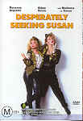

_This review was written by me for **MichaelDVD**, an Australian DVD review site that is no longer online. A capture of the site is held by the Internet Archive: **[browse it there](https://web.archive.org/web/20220217040146/http://www.michaeldvd.com.au/)**. It is reproduced here from my own copy of the site, as part of the record of what I have written._

## The film

When _**Desperately Seeking Susan**_was first released in 1985, the big attraction was the fact that it was **Madonna**'s first movie. A lot of people saw the movie just to find out whether she could act, and many commented that she was simply playing herself. More than 15 years later, with the benefit of hindsight from witnessing numerous attempts by Madonna to reinvent her image, it is probably more accurate to say Madonna was simply playing a role that was consistent with her public image at that time.

When I first saw this film in its original theatrical run, I remembered it as a somewhat quirky and offbeat romantic comedy but definitely watchable. Viewing it again on DVD, I am not as impressed. Maybe this is just one of those films that one cannot watch more than once, or perhaps the thrill of seeing Madonna on the big screen just isn't there anymore. It does feature one of my favourite Madonna songs - _Into The Groove_- and it was nice to hear it again after all these years.

Desperately Seeking Susan is a story about amnesia and mistaken identities. It also contrasts the different lifestyles of its two central characters: Roberta (**Rosanna Arquette**) the bored and relatively well-to-do suburban wife, and Susan (**Madonna**) the penniless but street smart, punkish, in-your-face wild girl.

Susan's boyfriend is in the habit of trying to get in touch with Madonna by placing personal ads in the newspaper, each beginning with the tagline "Desperately Seeking Susan". Roberta, who is married to an arrogant and insensitive hot tub salesman named Gary (**Mark Blum**), starts tracking these ads. To her, the idea of this mysterious girl who travels all over the place and can be contacted only via a personal ad seems impossibly glamourous and full of adventure compared to her dull and sedate life, divided between visits to the beauty parlour and hairdresser, shopping and cooking dishes by following a cooking programme.

One day, she decided to go to Battery Park (the rendezvous point specified in the latest "Desperately ..." personal ad) to see if she can catch a glimpse of the mysterious Susan and her boyfriend Jim (**Robert Joy**). Intrigued by Susan, Roberta follows her into a shop where Madonna exchanges her jacket with a pair of shoes. Roberta proceeds to buy the jacket.

When Roberta discovers that Madonna has left the locker key (where she has stowed her luggage (containing all her personal belongings in this world) in the jacket, she decides to place her own "Desperately Seeking Susan" personal ad. Unknown to her, Susan is being pursued by various people, including the police who wants to question her regarding a recent murder/suicide involving her previous boyfriend, and Nolan (**Will Paton**), an associate of Susan's gangster boyfriend in Atlantic City who suspects Susan has a pair of Egyptian earrings that he stole. Unfortunately, Nolan seems to think Roberta is Susan because she is wearing Susan's jacket. Roberta is rescued from the clutches of Nolan by Dez (**Aidan Quinn**), a friend of Jim, but not before she falls and hits her head and develops amnesia.

Sounds confusing? Well, you ain't heard nothing yet, girlfriend!!! Dez thinks Roberta is Susan, and Roberta doesn't know any better because she has amnesia. The rest of the film shows Roberta trying to live the life of Susan and wondering why she doesn't seem to fit in, whilst at the same time trying to evade from Nolan and developing a strong attachment to Dez. In the meantime, Susan has managed to get in touch with Gary because she wants to recover the locker key and her luggage. Everything manages to resolve itself in the end, and everyone lives happily ever after except possibly for Gary.

## The video transfer

This film is presented in its original aspect ratio of 1.85:1, with 16x9 enhancement. I would say the transfer is above average but not excellent. The transfer is reasonably sharp, with average levels of detail and shadow detail. A good example of detail is the readability of the newspaper text in **2:35**.

Colours seemed a bit washed out compared to a reference quality transfer. Given that the audio commentary talks a lot about the use of colours to create a larger-than-life music video type effect, I would have preferred it if the film had over-the-top colour saturation (like the use of colours in the menu, for example).

Fortunately the film source is relatively clean and free of grain, and there are no obvious signs of MPEG artefacts.

The disc has a number of foreign language subtitle tracks and hard of hearing tracks. I turned on the English for the Hard of Hearing track. This was quite comprehensive, transcribing even the names and lyrics of songs and the audio track of TV programmes as well as detailing auditory cues in the film.

This is a single sided dual layer disc (**RSDL**) and the layer change occurs at **45:21

## The audio transfer

This disc has three language audio tracks (English, French, German), all recorded in Dolby Digital 2.0 mono at a bitrate of 224 Kbps. In addition, there is a commentary track, also in Dolby Digital 2.0 at 224 Kbps. I listened to the English audio track.

There's nothing remarkable or outstanding about the audio track - it's basically your garden variety run-of-the-mill optical mono audio track compressed using Dolby Digital. The dialogue was easy to understand, there were no audio sync issues or audio glitches, and obviously there is no surround or subwoofer activity.

The track seemed to have both the high and low end rolled off, as the musical soundtrack sounded a bit boomy and strident. The audio track seems to have been mastered at a higher than average volume level.

## The extras

For a DVD that is not being marketed as a Special Edition or Collector's Edition, this disc has an above average selection of extras, including an alternative ending, the original theatrical trailer and a director/producer commentary. Surprisingly, the presence of the commentary is not mentioned in the cover.

What could have made the extras well ... extra special would have been the inclusion of the music video for _Into The Groove_, cast & crew biographies and production notes but all in all I am pretty pleased with what _is_included.

### Menu

The menus are non-animated but are 16x9 enhanced. They look quite vibrant with good colour saturation - in fact, much better than the transfer of the film itself.

There are three sets of menus corresponding to three languages (English, French and German) corresponding to the language audio tracks. You select the appropriate language option when the DVD is first inserted into the player.

### Theatrical Trailer (1:58)

This is presented in a full-frame 4:3 aspect ratio. The quality of the video transfer is slightly poorer than that for the main feature.

### Alternate Ending (6:08)

Originally, director Susan Seidelman and writer Leona Barrish envisioned an ending to the movie that was quite different from that shown in the theatres.

After shooting started, the film was shown at a series of "test screenings". Unexpectedly, it seemed that the audience was satisfied, expecting the film to wrap up at the point where it now ends.

This alternate ending consists of the extra footage that was subsequently cut from the theatrical release, and is presented in a letterboxed non-16x9 enhanced aspect ratio. I think I understand why these extra scenes were edited out - they seem rather anti-climactic and unnecessary.

The quality of the video and audio transfer is rather poor, and looks like it might have been transferred from a VHS tape (the text at the beginning mentions that it came from the "personal archives" of director Susan Seidelman).

### Audio Commentary - _Susan Seidelman (Dir), Barbara Boyle, et al_

This features comments from director **Susan Seidelman**, producers **Midge Sanford**and **Sarah Pilsbury**, and studio vice president and executive responsible for the film **Barbara Boyle**. This is noteworthy because the creative and production team appears to be entirely female, which explains why the film focuses almost entirely on the two leading female characters and the male roles seem so two-dimensional.

With these many people commenting on the film, I wished that there was some indication of who is saying what. It's reasonably easy to distinguish between the voices, but I quickly forgot which voice belonged to who. Perhaps a silhouette of the commentary team as in _Ghostbusters_, or transcribing the commentary onto a subtitle track as in _Contact_, would have been nice.

The team talked about various things, including using different colours and styles to distinguish between Susan and Roberta's worlds, how the script evolved, and various insights into the film.

I found particularly interesting the commentary on the casting process for Madonna, as she was an up-and-coming pop star at that time but wasn't quite the household name that she was later to become, so there was some debate as to whether she could take on the role. In the end, the team must have been glad they made the right decision, as she was perfect for the role and they were able to capitalize on her subsequent fame in the marketing of the film.

Overall I would rate this a good and informative commentary. It goes on all the way right up to the end of the closing credits and I almost get the feeling that it probably went past the end and was cut short!

## Region 4 versus Region 1

The Region 4 version of this disc misses out on;

- Pan & Scan version (full-frame?)
- Animated menus

The Region 1 version of this disc misses out on;

- Nothing of consequence (foreign language audio tracks and subtitles)

The additional extras on Region 1 are not compelling so I would say both versions are about equal.

## Summary

**_Desperately Seeking Susan_**, is a rather interesting but quirky romantic comedy that is worth watching at least once even if it is only to see Madonna doing her screen debut. It is presented on a DVD with an above average video transfer (apart from washed out colours) and an average audio transfer. The extras are reasonable and include a very interesting commentary track.

### [Ratings (out of 5)](../ReviewersGuide/RatingsGuide.html)

© [Chris Tham](mailto:ChrisT@michaeldvd.com.au) (read my [biography](../ReviewerProfiles/ChrisT.asp)) 17 February 2001

| Rating  | Score       |
| :------ | :---------- |
| Plot    | ★★★ 3 / 5   |
| Video   | ★★★ 3 / 5   |
| Audio   | ★★½ 2.5 / 5 |
| Extras  | ★★★ 3 / 5   |
| Overall | ★★★ 3 / 5   |
