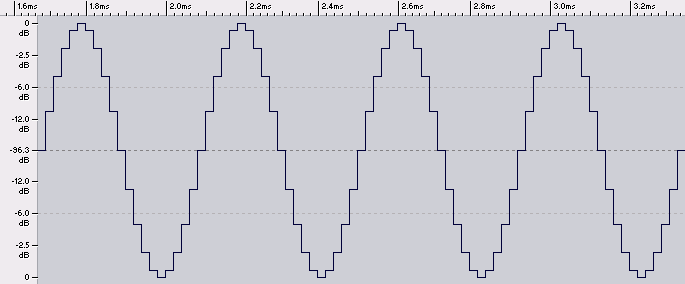
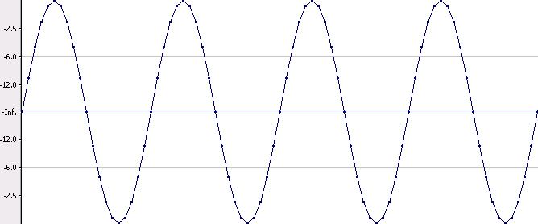
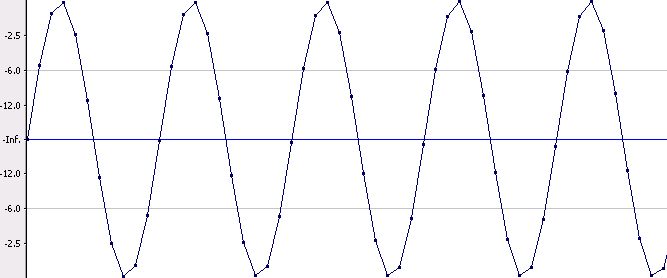
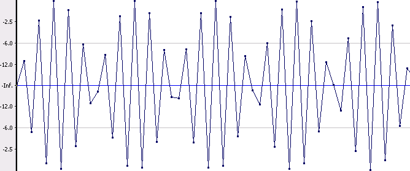
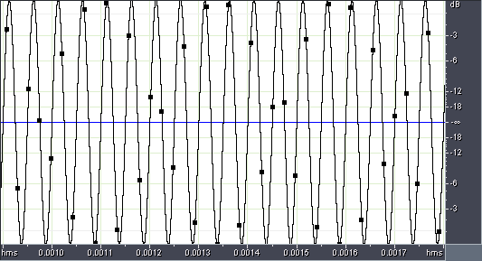
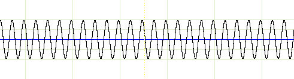
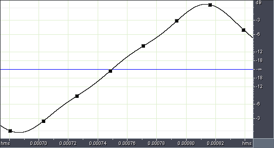
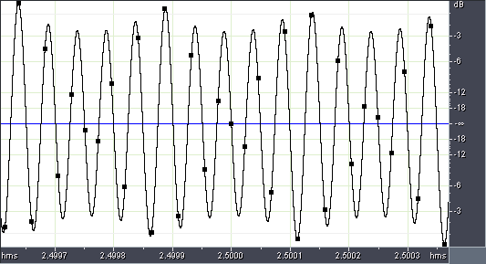
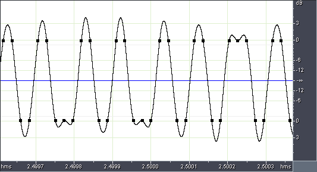

_This article was written by me and **published on Audioholics**, where it remains: **[read it there](https://www.audioholics.com/audio-technologies/exploring-digital-audio-myths-and-reality-part-1)**. Audioholics asked permission to run it. It is republished here for information, as part of the record of what I have written._

_Five of the figures below have been lost by Audioholics. Three of them still have a place on the page there, pointing at a file that no longer exists; Figures 4 and 9 have lost even that, and appear as a caption with nothing above it. All five are restored here from my original screen captures of WaveLab, Sound Forge and Adobe Audition._

This is part one of a set of articles exploring some common myths and misconceptions surrounding digital audio. Time and again I am surprised that even experienced and well-respected audio engineers often subscribe to some of these myths. These articles explore the bases behind some of these myths, and then provide the reality (and sometimes, the reality can be even stranger than the myths).

## **Myth 1: Digital Audio is discontinuous**

There are many variations of this myth, all stemming from the perception that analog audio is good because it is represented by a continuously varying electrical signal, and digital is somehow "bad" because it's a set of discrete "samples". Often this myth is linked to an assertion that our ears "hear" in analog, ie. we hear a continuously varying signal (we don't, because our ears have tiny hairs that capture discrete frequencies, and the firing of neurons are also discrete).

I suspect the origin of this myth comes from a common misconception: many people (even they stop to think about it at all) assume that because digital audio is a set of samples, when you play back those samples you will get something like this:

 _Figure 1: 2400 Hz 0dB sine wave sampled at 48kHz 16 bits_

It's easy to understand why this misconception occurs. There are plenty of published graphs very similar to the one above that purport to explain how digital audio sampling works. Even software programs that manipulate digital audio often draw waveforms on the screen like this. The above example is actually a screen capture of Steinberg's Wavelab 5.

Other people assume that when you play back digital audio, the resultant signal will have straight lines between samples, very much like "joining the dots"

_Figure 2: The same signal as Figure 1, but with straight lines plotted in between samples_

Again, it's not too hard to imagine how this misconception might have occurred, and some people even think this is what upsampling or oversampling does: interpolate straight lines between samples and then output at a higher sampling rate. And of course, some software actually represent waveforms this way - the above figure is a screenshot from Sony's Sound Forge 8.

The above two examples are deliberately "neat and tidy" - I choose to represent a sine wave which is an even divisor of the sampling rate so that the samples are evenly spaced across the sine wave. The waveform looks uglier when the sine wave is not an exact multiple of the sampling rate.

__

_Figure 3: 4001 Hz 0dB sine wave sampled at 44.1kHz 16 bits_

As you can see, the result looks kind of "distorted" rather than a perfectly symmetrical sine wave. Even worse, at high frequencies, there may only be 2-3 sample points over the period of the sine wave, and when you join straight lines between the samples you get something like this:

_Figure 4: 19997 Hz 0dB sine wave sampled at 44.1kHz 16 bits_

Looking at these graphs, it is easy to empathise with people who claim that digital audio can't even represent sine waves properly, and cannot represent high frequencies correctly (with amplitude accuracy). However, this is incorrect, as we shall soon find out.

## **Shattering Myth 1: Analog reconstruction during playback**

The truth is: digital audio playback will reproduce sine waves "perfectly" (or at least, within the resolution implied by the sampling word depth). This is how the above sine wave (19,997 Hz sampled at 44.1kHz) will theoretically be played back (on a "perfect" DAC):

_Figure 5: The same signal as Figure 4 but with analog reconstruction_

As you can see, a perfect sine wave is "reconstructed" between the samples, with amplitude accuracy in between sample points. By the way, the above is a screen capture of Adobe Audition, which is the only digital audio editing tool I have encountered that actually correctly draws the analog reconstructed waveform in between sample points.

To prove that Figure 5 is not just a theoretical reconstruction, here is the actual analog output of the [Panasonic DVD-S97](https://www.audioholics.com/news/pressreleases/PanasonicDVDS97HDMI.php)player playing the above waveform, captured at high resolution. As you can see, what comes out of the player is a perfect sine wave (exactly as theory predicted and _not_as Figure 4 would imply), within the limits of capture accuracy:

_Figure 6: Analog output of Panasonic DVD-S97 playing back a 19997Hz 0dB sine wave_

How is this possible? How does the DAC know how to "plot" the signal in between sample points? How does the DAC know that what should be played back is a sine wave and not something that looks like Figure 4?

The answer, without resorting to some rather complex mathematics, is surprisingly simple. In one word, it's "filtering." Some of you may be familiar with the concept of the Nyquist frequency. If you digitally sample a continuous signal at a sampling rate of _fs_, you cannot capture frequencies higher than _fs_/2 (because you have less than two sample points over the frequency period, and you need at least two sample points to represent the frequency). The Nyquist frequency is _fs_/2. In the above example, given that the _fs_= 44.1kHz, the Nyquist frequency is _fs_/2 = 22.05kHz.

Digital audio theory says that when you play back a set of digital samples, you must filter out all frequencies above _fs_/2. In the above example, the resultant waveform after filtering will be a pure 19997Hz sine wave.

Armed with this knowledge, let's re-examine Figures 1-5. Hopefully, you will now realise that the output of a digital audio player cannot be a set of "staircases" like Figure 1, because the abrupt transitions between sample points contain frequencies far higher than Nyquist. Similarly, it cannot be a set of straight lines between sample points, like Figures 2-4, because the sharp transitions and "corners" between sample points also contain frequencies higher than Nyquist. In all the above cases, once you have filtered out frequencies above Nyquist, what remains is a sine wave.

But what about Figure 4, where the samples don't quite align to the peaks of the sine wave? How can removing frequencies above Nyquist restore the correct peak levels (which are higher than any individual sample)? This is hard to explain without resorting to mathematics, but essentially Fourier Theory postulates that any complex continuously varying signal can be represented by a set of sine waves of varying frequencies and amplitudes. When you sum all these sine waves, you get the original signal.

In the case of Figure 4, if you draw a set of straight lines between sample points, you are plotting a signal composed of many sine waves summed together. These sine waves "modify" the original sine wave and lower the actual peaks of the waveforms. When these extraneous sine waves are removed, the peaks of the sine wave between sample points are restored.

If you still find this difficult to swallow, try thinking of it in a different way. The reason a perfect sine wave is output even though the samples did not capture the peaks is that a 19997Hz sine wave is the only possible plot that you can draw that passes through all the sample points but does not contain frequencies higher than Nyquist. This can actually be proven mathematically, but I will spare you the calculations.

## **But what about non-sine waves?**

In fact, digital audio will capture any signal, no matter how complex, as long as it can be represented as a set of sine waves lower than the Nyquist frequency. Therefore, if you choose a sampling rate so that Nyquist is higher than 20 kHz, you can represent any signal containing tones between 0-20kHz. Since our ears do not hear past 20kHz, it could be argued that digital audio will perfectly reproduce any audible signal.

However, not all signals can be represented accurately by a set of sine waves below 20kHz. In particular, sawtooth waves (also known as triangular waves) and square waves can only be represented by an infinite set of sine waves with frequencies extending all the way to infinity. When you capture either sawtooth waves or sine waves digitally, you don't get back a perfect waveform when you play it back due to filtering.

As an example, this is how a 4001Hz sawtooth wave looks like after filtering at the Nyquist frequency:

 _Figure 7: 4001Hz 0dB sawtooth wave sampled at 44.1kHz 16 bits_

As you can see, the peaks of the sawtooth are "rounded off" and the lines connecting the sample points are slightly "wavy" rather than straight. At higher frequencies, you can see that digital audio playback cannot even preserve amplitude accuracy for sawtooth waves:

 _Figure 8: 19997Hz 0dB sawtooth wave sampled at 44.1kHz 16 bits_

Square waves are even worse. This is the theoretical reproduction of a 10kHz square wave:

_Figure__9: 10__kHz 0dB square wave sampled at 44.1kHz 16 bits_

As you can see, not only is amplitude accuracy not preserved, but the resultant waveform looks nothing like a square wave. Even worse, the analog reconstructed waveform overshoots the 0dB peak. Many digital audio players cannot reproduce signals above [0dB FS ("full scale")](https://www.audioholics.com/techtips/specsformats/0dbfsdigitalplayback.php)during playback, so the above waveform will most likely be clipped (which, in this case, is "beneficial" since it will make the waveform more like a square wave!).

## **Conclusion**

Digital audio is not as bad as some people seem to think, it will reproduce any bandwidth limited signal "perfectly" as a continuous signal. However, not all waveforms, even deceptively simple ones, can be represented accurately once they are filtered.

Some could argue that we don't listen to sawtooths or square waves, therefore Figures 6-8 are not significant. But we do - some musical instruments have harmonic characteristics very similar to sawtooth waves. And pop/rock music often contain music generated by synthesizers - sawtooth and square waves are fundamental building blocks for digitally synthesized music.

It could also be argued that the frequency components above 20kHz for sawtooth and sinewaves are not important, since we don't hear them, so arguably what our ears are hearing are represented accurately in Figures 6-8. This is perhaps true, but the counter argument is that if a digital player is not playing back a 0dB 19997kHz sawtooth (or a 0dB 10kHz square wave) with even amplitude accuracy (let alone harmonic accuracy), then that represents a kind of "distortion" that is audible. By the way, analog circuits have no problems playing back sawtooth and square waves with much better amplitude and harmonic accuracy than digital.

Many people have commented that CDs do not seem to reproduce high frequencies as well as analog sources such as vinyl and magnetic tape. Perhaps the above could at least partially explain the subjective impressions? This would also suggest one benefit of sampling at higher rates such as 96kHz or 192kHz even though our ears cannot hear past 20kHz. A higher sampling rate can help preserve amplitude and harmonic accuracy for non-sine waves at high frequencies.
