_This article was published on my own website at `users.bigpond.net.au/christie/`, which no longer exists. A capture of the original is held by the Internet Archive: **[read it there](https://web.archive.org/web/20040704112411/http://www.users.bigpond.net.au/christie/dvdmusic/index.html)**. It is reproduced here from my own copy of the site, as part of the record of what I have written._

_(Or ... "Why do most of my music DVDs not sound as good as my CDs ")_

For some time now I've noticed that many of my music DVDs don't sound as good as my CDs.

Now, I don't mean that music DVDs with heavily compressed Dolby Digital 2.0 audio tracks (encoded at 192kb/s). These are basically equivalent to MP3 files in terms of sound quality, and I would hardly expect these to sound anywhere close to CD quality.

No, I mean DVDs with Linear PCM audio tracks. There are more than a few music DVDs out there with PCM 2.0 audio tracks recorded at 48kHz 16 bit resolution, which is slightly better than CD (44.1kHz 16 bit).

Now, these should theoretically sound slightly better than CDs, right? Unfortunately, based on my experience reviewing music DVDs on [www.michaeldvd.com.au](http://www.michaeldvd.com.au) (click here to get a [list](http://www.michaeldvd.com.au/Search/ReviewSearch.asp?title=&SRID=13&NSRID=0) of all my reviews), it appears that even music DVDs with PCM audio tracks tend to sound mediocre, apart from a few exceptions.

I can think of a few reasons why this might be so. The most obvious one is: Garbage In Garbage Out. The quality of an audio track is dependent on the quality of the source. For music DVDs (particularly a re-release of a title previously available on VHS), the source could be an old analog video tape. In which case, it doesn't really matter that the audio has been transferred at PCM 48/16 resolution - the original source quality is poor. Often, I hear analog tape glitches, including drop outs and tape head mistracking.

However, even recently released DVDs based on digitally recorded/mastered sources don't quite sound as good as typical CDs, at least to my ears anyway.

Another thing I've noticed on music DVDs that provide both a Dolby Digital 2.0 and 5.1 tracks: in many cases the Dolby Digital 2.0 track sounds considerably inferior compared to the 5.1 audio track, even when I downmix the 5.1 audio track into 2.0. Often this is because the 2.0 audio track appears to be encoded at a lower average volume level as well as encoding rate compared to the 5.1 audio track, therefore it will have more compression artefacts compared to the 5.1 audio track. However, the differences between audio tracks on some titles cannot be explained away so easily.

I was curious as to why this might be so, so armed with my trusty HTPC, I set out to do some sleuthing and analysis.

## Procedure

I used a few DVDs for comparison:

- _[Celine: All The Way ... A Decade of Song & Video](http://www.michaeldvd.com.au/Reviews/Reviews.asp?ID=3602)_ (because I am able to compare it with the CD)
- [_Gato Barbieri: Live From The Latin Quarter_](http://www.michaeldvd.com.au/Reviews/Reviews.asp?ReviewID=1776) (for comparing the Dolby Digital 2.0 track against the Dolby Digital 5.1 track)
- [_Alejandro Sanz: El Alma Al Aire Live_](http://www.michaeldvd.com.au/Reviews/Reviews.asp?ID=3077) (even though the Dolby Digital 5.1 audio track - encoded at 256kb/s - sounds awful, the Linear PCM 2.0 audio track doesn't sound particularly nice either)
- [_Alejandro Sanz: MTV Unplugged_](http://www.michaeldvd.com.au/Reviews/Reviews.asp?ID=2929) (the Dolby Digital 5.1 audio is also encoded at 256kb/s, the Linear PCM 2.0 audio track is kinda okay but sound a bit "weird")

What I did was de-muxed and extracted the audio tracks digitally using [DVD Decrypter](http://www.dvddecrypter.com/), converted all Dolby Digital audio tracks to PCM 2.0 48/16 using [BeSweet](http://dspguru.doom9.net/), and analyzed the results using an old copy of [Cool Edit](http://www.cooledit.com) (now called [Adobe Audition](http://www.adobe.com/products/audition/main.html)).

Needless to say, the results were very surprising and shocked even me ...

## [Celine: All The Way ... A Decade of Song & Video](http://www.michaeldvd.com.au/Reviews/Reviews.asp?ID=3602)

This is a rip of Track 8 (_My Heart Will Go On (Love Theme From Titanic)_) from the companion CD:

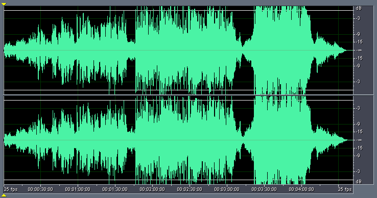

Note that this is not an "audiophile" quality recording, as the track is clearly mastered at too high a level, resulting in significant clipping around 3:20-4:00.

In comparison, the equivalent chapter (10) from the DVD PCM 2.0 48/16 audio track shows clearly why the CD still sound superior:

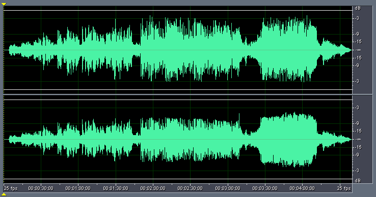

Not only is the track mastered at a rather low level (approximately 6dB lower than the CD level) it shows signs of being compressed and therefore lacking in dynamics compared to the CD.

This is the full waveform display of the entire PCM 2.0 audio track:

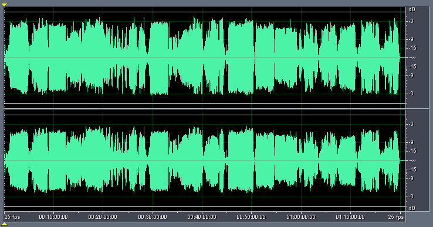

If you compare this against the Dolby Digital 5.1 audio track (mixed down to 2 channels), you will notice that PCM 2.0 listeners are clearly missing out on the dynamics present in the 5.1 audio track, and this confirms why to my ears the compressed 5.1 audio track (even when mixed down) sounds much better than the uncompressed PCM 2.0 audio track:

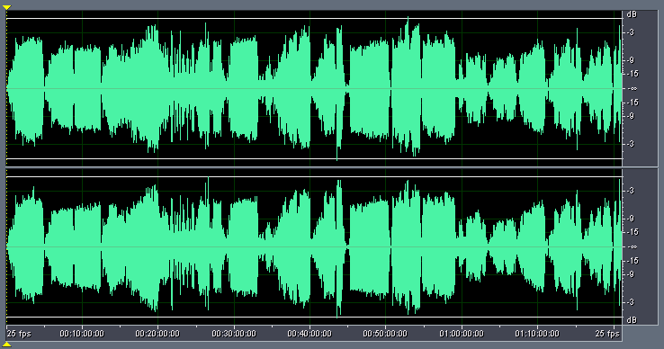

## [Gato Barbieri: Live From The Latin Quarter](http://www.michaeldvd.com.au/Reviews/Reviews.asp?ReviewID=1776)

This is the Dolby Digital 2.0 audio track (224kb/s):

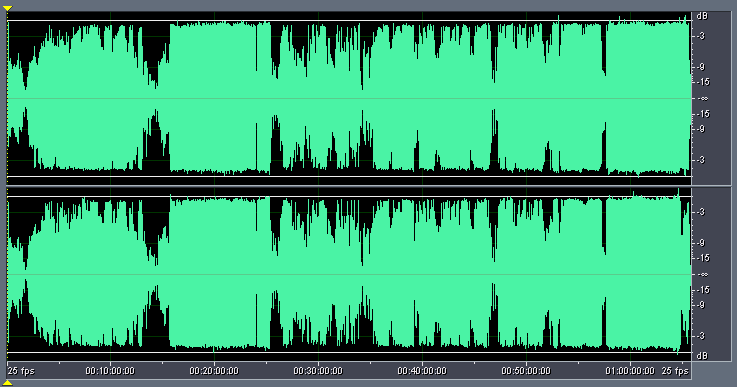

Notice how severely compressed and peak limited the audio track is. No wonder it's virtually unlistenable.

Zooming in around 1:00:00 reveals that the compression is quite deliberate, and carefully done, as there is no signs of actual clipping. The regularity of the peaks (all hitting just under -1dB) is the strongest clue to this heavily processed audio track:

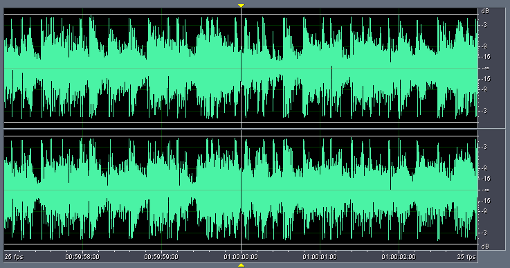

Looking at the Dolby Digital 5.1 audio track reveals that only the front centre channel (highlighted) has been dynamically compressed. The other channels actually look okay:

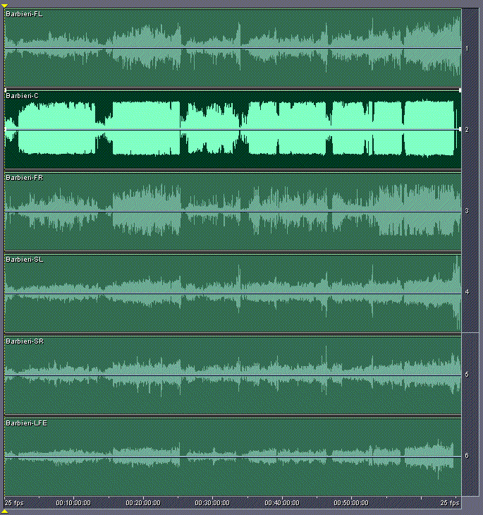

So, when you mix it down to stereo, it still sounds okay (and much better than the 2.0 audio track):

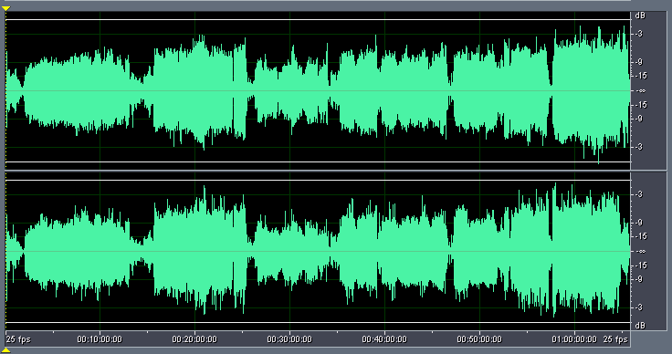

## [Alejandro Sanz: El Alma Al Aire Live](http://www.michaeldvd.com.au/Reviews/Reviews.asp?ID=3077)

Why bother releasing a DVD with a PCM 2.0 48/16 audio track when the material has been compressed to the max? This is the aural equivalent of someone colliding into a brick wall:

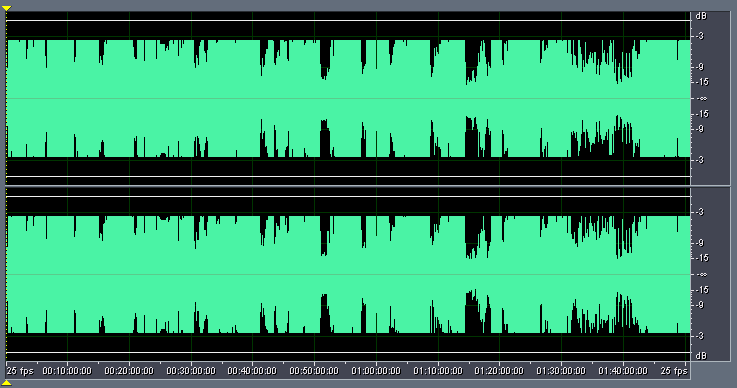

The Dolby Digital 2.0 audio track is similar:

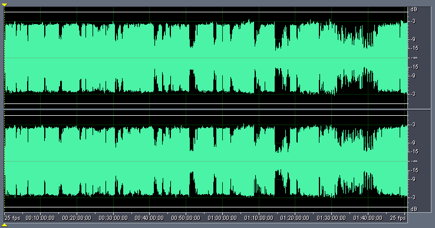

Notice how the peaks on the Dolby Digital 2.0 audio track are more "jaggy" and extend up to 1-2dB higher than the equivalent peaks on the PCM 2.0 audio track? This confirms my long held suspicion: Dolby Digital encoding/decoding tends to exagerate transients. That's why Dolby Digital audio tracks tend to sound "punchier" and more dynamic compared to uncompressed PCM, and dts tends to sound soft in comparison.

The Dolby Digital 5.1 audio track is also dynamically compressed and peak limited, but not as severely:

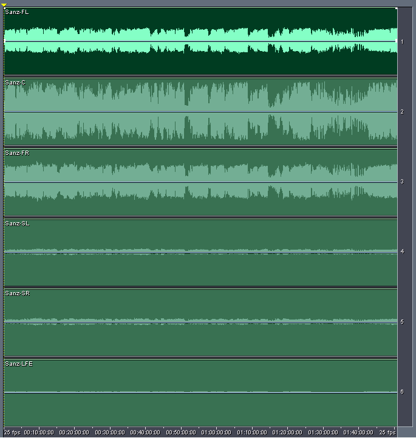

Notice the left channel is recorded at around -3dB lower than the right channel. This looks like a mixing error. Also, there isn't much happening in the rear and LFE channels.

Fortunately, the front centre channel retains some of the original dynamics of the music, resulting in a mixdown to stereo that looks better than the 2.0 audio tracks:

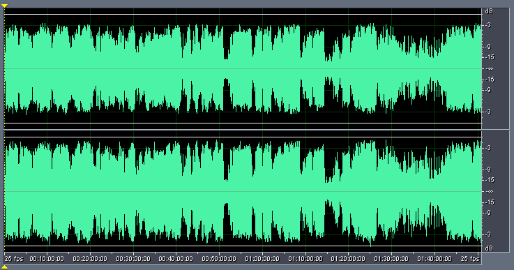

## [Alejandro Sanz: MTV Unplugged](http://www.michaeldvd.com.au/Reviews/Reviews.asp?ID=2929)

My final example, to convince you how evil :-) mastering engineers can be! This is the PCM 2.0 audio track:

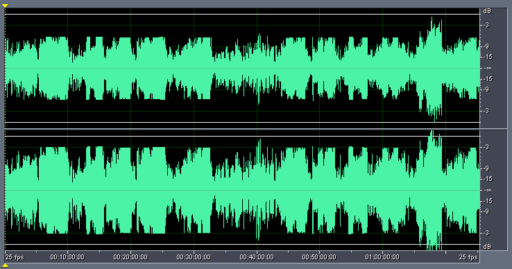

This is just totally bizarre. The track is obviously dynamically compressed and peak limited, but the compression was turned "off" at two places (aound 40:00 and 1:05:00-1:10:00). Also, the left channel is clearly 3dB below the right channel.

The Dolby Digital 2.0 audio track is similar, but the mastering level has been increased by 3dB, resulting in clipping:

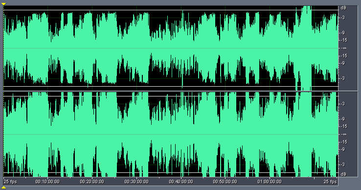

Here is the Dolby Digital 5.1 audio track, by comparison:

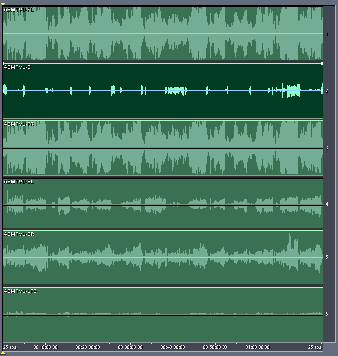

Once again, Dolby Digital 5.1 wins out. No obvious signs of compression, although there are quite a few instances of clipping in the front left and right channels. Like many other music DVDs, nothing much is happening in the front centre channel (highlighted) or the LFE channel.

Mixing down to stereo provides an acceptable result:

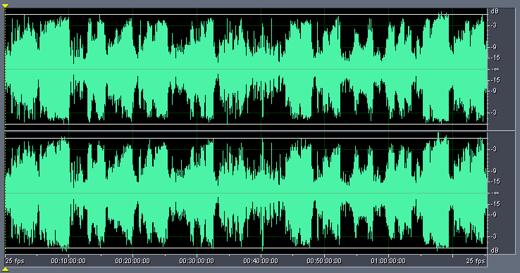

## Conclusions

Looking at this graphs makes me depressed and wish the standards of audio mastering haven't dropped so much in recent years due to the pressure of making the music sound "as loud as possible." Bottom line is, if a DVD features a Linear PCM 2.0 audio track, don't automatically assume it will sound as "good" as a well recorded CD. And don't ignore the Dolby Digital 5.1 audio track, even if you only llisten in stereo. In some cases, you may get a better experience listening to a mixdown of the Dolby Digital 5.1 audio track than the PCM 2.0 audio track!

© 2004 Christine Tham
