_This article was written by me and **published on Audioholics**, where it remains: **[read it there](https://www.audioholics.com/audio-technologies/dynamic-comparison-of-cd-dvd-a-sacd-part-1)**. Audioholics asked permission to run it. It is republished here for information, as part of the record of what I have written._

Recently I bought an [Audiotrak Prodigy 7.1](https://www.audiotrak.net/prodigy71.htm) soundcard for my HTPC. This is a soundcard based on the Via Envy24HT "Vinyl Audio" controller and a [Wolfson WM8770](https://www.wolfsonmicro.com/products/WM8770/) CODEC supporting 96/24 A/D converters with 102dB dynamic range, and 8 channels of 192/24 D/A converters with 106dB dynamic range.

I also have a very old copy of Cool Edit lying around, and I thought it might be interesting to record and compare CD, DVD-A and SACD (2 channel only) versions of **Diana Krall's _The Look Of Love_** (Verve) to see if I can gain any insights on the relative performance of each version in terms of dynamics and ultrasonic frequency content.

Why that particular album? Well, "jimby" from Universal Music assures me that The Look Of Love was entirely recorded, mixed and mastered using analog equipment, and this is one of the few titles that are duplicated across all three consumer audio delivery formats. I did not want to use a recording that was originally recorded in either DSD or PCM as that would favour one format over the other. Also, I have been told the DVD-A and SACD were transferred off the same analog master, with as much commonality in the transfer chain as possible.

I recorded the title track from the album ( _The Look Of Love_ ) three times on separate wave files at the 96/24 sample rate, which Cool Edit then upconverted to 32-bit floating point representation. The CD version was recorded based on the analog outputs from my Sony SCD-XA777ES SACD/CD player, through the pre-amp section of my Denon AVC-A1SE+ amplifier. The DVD-A version (Group 2: 2 channel) was taken from the analog outputs from my Panasonic DVD-RP82 DVD Audio/Video player (also going through the amp), and finally the SACD 2-channel version was also taken from the Sony SCD-XA777ES analog outputs (via the amp).

I also "normalized" each wave file so that the highest peak in the signal corresponds to the maximum amplitude that can be represented using PCM. I also ripped the CD version of the track digitally using [Exact Audio Copy](https://www.exactaudiocopy.de/) , and then upsampled this to 96kHz 32-bit floating point using Cool Edit. Using Cool Edit, I was able to compare the waveforms of all four wave files, and do the spectral plot of the frequency distribution of each wave file, as well as at a particular point in time within the track.

## **The "Sound" of "Silence"**

This is a frequency analysis of the "silent" bit at the beginning of the track just before the music starts on the Exact Audio Copy rip:

[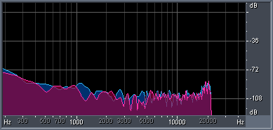](https://www.audioholics.com/audio-technologies/sacd1_000.gif/image)

As you can see, there is no such thing as "absolute silence", even on a digital rip off the CD. Note, though, that there is a cliff drop at around 22kHz. Note also the rising noise below 1kHz and the "hump" around 20kHz. This is same bit, but as played back by the SCD-XA777ES via the analog outputs:

[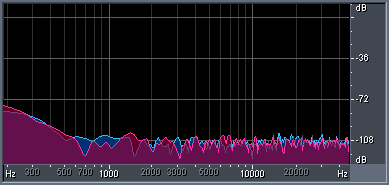](https://www.audioholics.com/audio-technologies/sacd3.gif/image)

The Sony played back the "silence" reasonably well. including the rise at the bottom end and the hump around 20kHz. However, note that additional ultrasonic noise between 20-40kHz has now crept in at around -108dB. This is probably a combination of noise generated by the player, the amplifier and the A/D accuracy of the Prodigy sound card. Note that the plots never look identical because I can't guarantee that I am sampling the exact same point in time for each wave file. The three wave files are not perfectly "synchronized" to the extent that 4:29 on one wave is exactly the same point in the music as 4:29 in another file. I have tried to synchronize them by eye, but only to the nearest 0.01 second.

This is the results from the DVD-A version:

[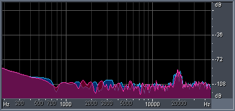](https://www.audioholics.com/audio-technologies/sacd2.gif/image)

As you can see, the PCM playback is very faithful, but minus the hump around 20kHz, so arguably more accurate than the CD version.

This is the results from the SACD:

[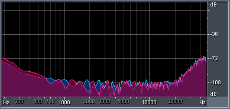](https://www.audioholics.com/audio-technologies/sacd4.gif/image)

Note the absence of the hump around 20kHz, but the "rising noise floor" characteristic of DSD asserts itself for frequencies above 20kHz, taking the noise floor all the way up to around -72db (which is still very quiet, if you have ears that can hear that high). There has been various comments made that the DSD rising noise floor starts as low as 5kHz, based on published results in Stereophile magazine, but as you can see I was not able to replicate those results and DSD behaved as per spec.

## Dynamic Comparison of CD, DVD-A, SACD - Part 1 - page 2

**Spectral Views**

These are plots of the "density" of frequency content across the 0-48kHz spectrum. The brighter the colour, the greater the amount of frequency content at any point in the graph.

First of all, the EAC rip:

[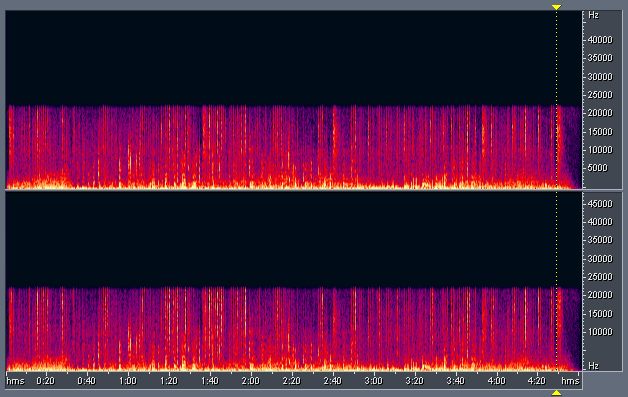](https://www.audioholics.com/audio-technologies/sacd5.gif/image)

Note the total absence of any frequencies above 22kHz, as to be expected given the 44.1kHz sampling rate.

Now, this is the same CD track but as played by the Sony and captured using the Prodigy:

[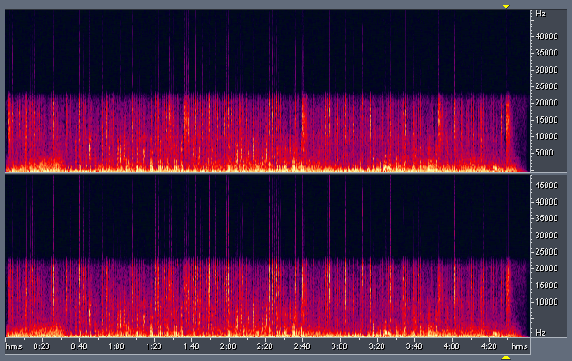](https://www.audioholics.com/audio-technologies/sacd6.gif/image)

Interestingly, various points in the track are "corrupted" by high frequency "spikes". I am not sure what is generating this noise, but it could be a combination of the player, the amplifier and the sound card.

Here is a frequency analysis at 4:29 into the track (at the point represented by the yellow dotted line in the graph above):

[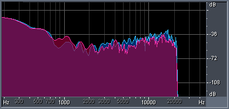](https://www.audioholics.com/audio-technologies/sacd8.gif/image)

Notice, again, the severe drop off above 22kHz. In comparison, the EAC rip at around the same point is similar, but without the ultrasonic noise:

[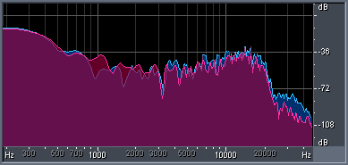](https://www.audioholics.com/audio-technologies/sacd7.gif/image)

It looks like Sony has opted for a gentler filter roll off (probably achieved using upsampling).

By comparison, this is the spectral analysis for the DVD-A:

[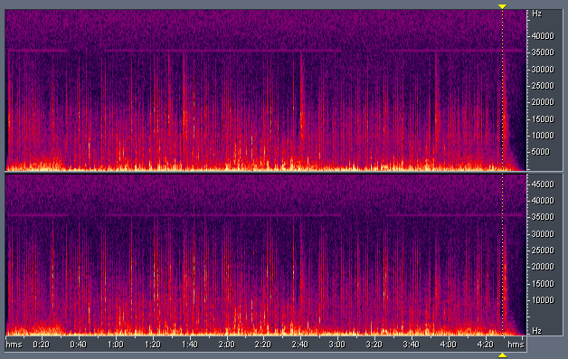](https://www.audioholics.com/audio-technologies/sacd11.gif/image)

Note that we have true frequency content above 22kHz all the way up to around 36kHz. The spikes above 36kHz are probably the same "noise" found on the CD version, although I cannot confirm that. The purple horizontal lines around 36kHz is probably the analog tape bias.

The frequency analysis around 4:29 for PCM looks like this:

[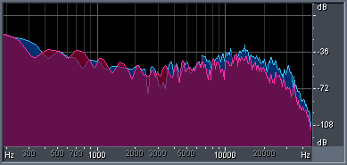](https://www.audioholics.com/audio-technologies/sacd10.gif/image)

Again, this confirms the presence of real musical content above 20kHz, but dropping off fairly significantly past 30kHz. I suspect there is no real usable musical information above 30kHz.

In comparison, this is how DSD looked like:

[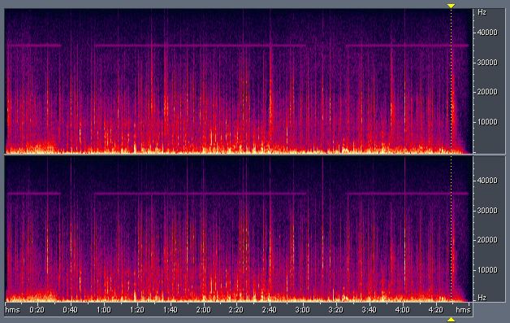](https://www.audioholics.com/audio-technologies/sacd9.gif/image)

As you can see, DSD is almost as good as PCM in capturing ultrasonic frequencies, but at the cost of higher ultrasonic noise (note the purple specks above 35kHz).

Frequency analysis at 4:29 :

As you can see, DSD offers a response very similar to PCM except for the overlay of the ultrasonic noise above 30kHz.

### **Dynamics/Compression Comparison**

Comparing the wave files between 2:50-4:50 yielded a surprise. I put the CD, DVD-A and SACD versions side by side and you could really see the difference

The CD is the most "compressed" (average signal amplitude higher in comparison to the peak) and DSD the "least" compressed. This means that if you adjust the relative levels of the three recordings such that the relative "energy" across all three are approximately the same, then the peaks and transients in SACD will be "higher" over DVD-A, which in turn will be higher than CD.

The differences are hard to see on this web page because I have shrunk the waveforms, but on Cool Edit they were quite obvious, and represents around a 2-3dB difference, which is significant enough to be audible. This difference was also noted empirically by me during recording, as I had to lower the gain for the CD and increase the gain for SACD.

If this difference is "real", as opposed to an anomaly in my equipment, then it could explain why some people don't like SACD compared to CD or DVD-A. The slightly lowered sound levels, if not compensated during the listening process, will cause SACD not to sound "as good" compared to CD or DVD-A.

The better dynamic performance of SACD would also explain why some people prefer SACD, as they probably notice the slightly higher dynamics.

The results are interesting indeed, even though I would caution against over-generalizing them into conclusions about each format. Remember that the results may not be applicable beyond a single title and the constraints of my equipment.

© 2004 Christine Tham

Reprinted with the Permission of Christine Tham. Please visit her very informative website at: [http://users.bigpond.net.au/christie/](https://users.bigpond.net.au/christie/)
