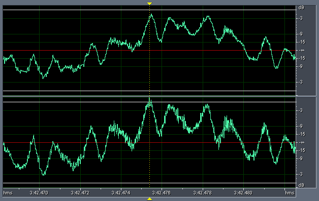
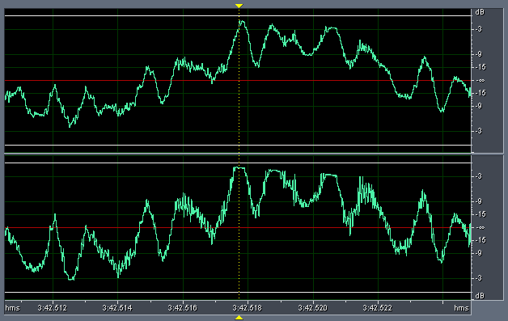
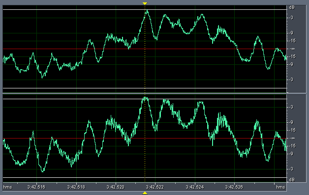
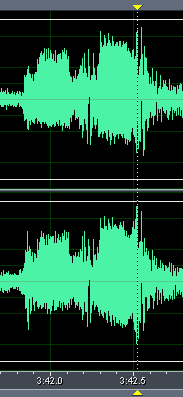
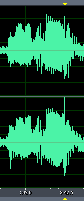
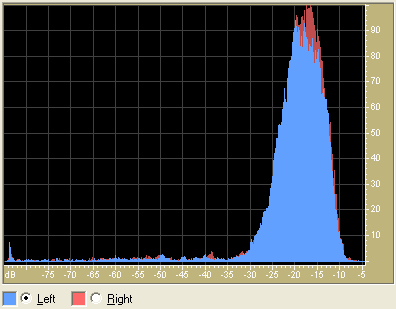
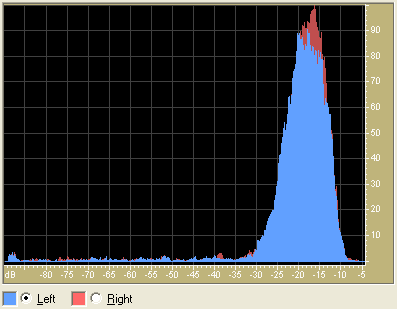
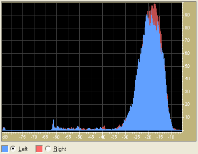
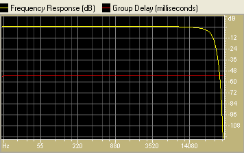
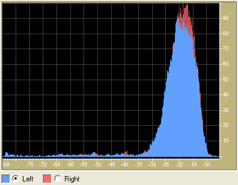

_This article was written by me and **published on Audioholics**, where it remains: **[read it there](https://www.audioholics.com/audio-technologies/dynamic-comparison-of-cd-dvd-a-sacd-part-2)**. Audioholics asked permission to run it. It is republished here for information, as part of the record of what I have written._

My previous comparison of 2-channel recordings of the title track of **Diana Krall's The Look Of Love** on CD, DVD-A (Group 2 - MLP 2.0 96/24) and SACD (2-channel) versions yielded a surprise in terms of the relative dynamics: the CD version was noticeably more "compressed" in dynamics than the DVD-A version, which in turn was also compressed relative to SACD.

I have yet to read any literature on the respective formats which would hint at this result that I began to doubt whether this might be an anomaly of the way I did the three recordings. I did use different gains for each recording, and I wondered whether a different gain setting may have contributed to altering the dynamics of the three recordings.

Therefore, I resolved to re-do all three recordings using constant gain, to try and see if I can replicate the dynamic differences for the three recordings.

This time, I've also done the recordings more accurately. I've abandoned my old copy of Cool Edit as a recording tool, although I am still using it to generate statistics and graphs. I discovered two things:

- Cool Edit does not seem to support 24-bit recording on the Prodigy 7.1 - I discovered using Cool Edit's "Statistics" function that I was actually recording at 16-bits!
- Cool Edit only supports the WDM/MME driver, which means the samples are probably passing through Windows' kmixer (also known as "kmangler" to audio enthusiasts due to it's propensity to resample audio streams when you least expect it to)

I am now using [FASOFT's n-Track Studio](https://www.fasoft.com/) Lite which comes bundled with the Prodigy 7.1. n-Track supports Prodigy's lower-latency and more transparent ASIO driver instead of the default WDM/MME. I've verified that n-Track does support 24-bit recording. I am also recording "silent" (with no monitoring of the signal) to prevent any possibility of cross-talk between the playback audio circuits and the recording audio circuits.

Well, here are the results ...

**Statistics** Recording the three versions at constant gain clearly shows that the SACD recording is around 3-4dB lower in level compared to the CD and DVD-A recordings. In an A-B comparison between SACD and CD or DVD-A (on my system), a typical listener will have a tendency to pick either CD or DVD-A as "better sounding" if the relative levels are not adjusted. But as we shall see, once the relative levels are adjusted, the increased dynamics of the SACD recording are confirmed.

This is what Cool Edit says about the relative statistics of the three recordings (using an RMS Window of 50ms where 0db=FS Square Wave):

## **CD**

|                             | **_Left_** | **_Right_** | **_Average_** |
| :-------------------------- | :--------- | :---------- | :------------ |
| **Min Sample Value:**       | -26579.71  | -26154.47   | -26367.09     |
| **Max Sample Value:**       | 28892.81   | 28189.78    | 28541.30      |
| **Peak Amplitude (dB):**    | -1.09      | -1.31       | -1.20         |
| **Possibly Clipped:**       | 0          | 0           | 0             |
| **DC Offset:**              | 0          | 0           | 0             |
| **Minimum RMS Power (dB):** | -84.37     | -84.12      | -84.25        |
| **Maximum RMS Power:**      | -6.49      | -6.84       | -6.67         |
| **Average RMS Power (dB):** | -18.37     | -17.90      | -18.14        |
| **Total RMS Power (dB):**   | -17.37     | -17.00      | -17.19        |
| **Actual Bit Depth:**       | 24         | 24          | 24            |

## **DVD-A**

|                             | _Left_    | _Right_   | _Average_ |
| :-------------------------- | :-------- | :-------- | :-------- |
| **Min Sample Value:**       | -28335.40 | -28361.94 | -28348.67 |
| **Max Sample Value:**       | 30438.44  | 30915.72  | 30677.08  |
| **Peak Amplitude (dB):**    | -0.64     | -0.51     | -0.58     |
| **Possibly Clipped:**       | 0         | 0         | 0         |
| **DC Offset:**              | 0         | 0         | 0         |
| **Minimum RMS Power (dB):** | -89.09    | -89.11    | -89.10    |
| **Maximum RMS Power:**      | -6.46     | -6.85     | -6.66     |
| **Average RMS Power (dB):** | -18.38    | -18.03    | -18.21    |
| **Total RMS Power (dB):**   | -17.39    | -17.14    | -17.27    |
| **Actual Bit Depth:**       | 24        | 24        | 24        |

## **DSD (unnormalized)**

|                             | _Left_    | _Right_   | _Average_ |
| :-------------------------- | :-------- | :-------- | :-------- |
| **Min Sample Value:**       | -16975.43 | -17873.29 | -17424.36 |
| **Max Sample Value:**       | 20894.00  | 20942.97  | 20918.49  |
| **Peak Amplitude (dB):**    | -3.91     | -3.89     | -3.90     |
| **Possibly Clipped:**       | 0         | 0         | 0         |
| **DC Offset:**              | 0         | 0         | 0         |
| **Minimum RMS Power (dB):** | -87.47    | -87.64    | -87.56    |
| **Maximum RMS Power:**      | -11.01    | -11.28    | -11.15    |
| **Average RMS Power (dB):** | -22.98    | -22.63    | -22.81    |
| **Total RMS Power (dB):**   | -21.96    | -21.71    | -21.84    |
| **Actual Bit Depth:**       | 24        | 24        | 24        |

## **DSD (normalized)**

Given that the level of the DSD recording is so low, I decided to "normalize" the DSD recording:

|                             | _Left_    | _Right_   | _Average_ |
| :-------------------------- | :-------- | :-------- | :-------- |
| **Min Sample Value:**       | -26560.86 | -27965.71 | -27263.29 |
| **Max Sample Value:**       | 32692.11  | 32768.74  | 32730.43  |
| **Peak Amplitude (dB):**    | -0.02     | 0.00      | -0.01     |
| **Possibly Clipped:**       | 0         | 1         | 0.5       |
| **DC Offset:**              | 0         | 0         | 0         |
| **Minimum RMS Power (dB):** | -83.58    | -83.75    | -83.67    |
| **Maximum RMS Power:**      | -7.12     | -7.39     | -7.26     |
| **Average RMS Power (dB):** | -19.10    | -18.74    | -18.92    |
| **Total RMS Power (dB):**   | -18.07    | -17.83    | -17.95    |
| **Actual Bit Depth:**       | 32        | 32        | 32        |

## **In Summary**

Comparing the average values for all four:

|                                       | _CD_      | _MLP_     | _DSD_     | _DSD normalized_ |
| :------------------------------------ | :-------- | :-------- | :-------- | :--------------- |
| **Peak Amplitude (dB):**              | -1.20     | -0.58     | -3.90     | -0.01            |
| **Minimum RMS Power (dB):**           | -84.25    | -89.10    | -87.56    | -83.67           |
| **Maximum RMS Power:**                | -6.67     | -6.66     | -11.15    | -7.26            |
| **Average RMS Power (dB):**           | -18.14    | -18.21    | -22.81    | -18.92           |
| **Total RMS Power (dB):**             | -17.19    | -17.27    | -21.84    | -17.95           |
| **Maximum - Average RMS Power (dB):** | **11.47** | **11.55** | **11.66** | **11.67**        |
| **Maximum - Minimum RMS Power (dB):** | 77.58     | 82.45     | 76.41     | 76.41            |

Note that by looking at the difference between the Maximum and Average RMS Power (second last row), the statistics support the hypothesis that DSD has slightly higher dynamics (11.66dB) than MLP (11.55dB), which in turn is slightly higher than CD (11.47). Note also that normalizing the DSD recording does not change the relative differences.

You may think the difference may not seem significant (only 0.11dB), but remember we are looking at differences between the Maximum and "Average" RMS Power, therefore the differences (which are more prominent the louder the signal is) have been averaged out.

The DSD difference between Maximum and Minimum RMS Power (last row) is relatively low at 76.41dB compared to MLP (82.45dB). This can be explained by the average level of the DSD recording being less than the MLP recording (the underlying A/D accuracy of the Prodigy sound card may be limiting the accuracy of the lower level DSD recording) as well as the DSD ultrasonic noise floor.

## Dynamic Comparison of CD, DVD-A, SACD - Part 2 - page 2

**Peak value analysis** The peak sample for the normalized SACD recording occurs at 3:42.475 seconds into the song (or sample #21,357,637!).

At this point in time, the normalized SACD waveform looks like this:

In comparison, the CD waveform is definitely more compressed, and the three middle peaks on the right channel show the tell-tale "flattening" from clipping:

Interestingly enough, even the DVD-A waveform exhibit clipping (but far less prominent):

Comparing the SACD and DVD-A recordings side by side clearly show that SACD is relatively more "dynamic" than DVD-A:

  **DVD-Audio (left); SACD (right)**

In the above waveforms, the DVD-A recording has been attenuated by -1dB so that the relatively quiet segment at the beginning of this extract are approximately the same amplitude for both DVD-A and SACD. In contrast, the amplitudes of the the middle, louder, segment, is at least 0.5-1dB louder on SACD than on DVD-A, thus demonstrating that SACD has higher relative dynamics.

**Histogram analysis** Now comes another surprise! But before I explain, let's look at some histogram graphs of the distribution of levels.

First of all, this is the histogram of the CD recording:

This shows that the actual dynamic range of the recording is only around 30dB (from -35dB to -5dB). There is negligible musical information below -35dB. Note the "hump" at the extreme left which corresponds to the "hump" around 20kHz in the spectral analysis.

The DVD-A recording looks very similar:

Note that the shape of the histogram is "narrower" in width around -35dB to -5dB. This indicates that the DVD-A recording is of a higher resolution than CD, as more values are spread across the entire histogram instead of concentrated around the median.

By comparison, the "normalized" SACD histogram has a strange "quirk" (the unnormalized histogram is similar):

Notice that there are no samples between -78dB and -62dB!!! In contrast, there is a higher proportion of samples between -62dB to -35dB, and the shape of the histogram is also "fatter" in width between -35dB to -5dB.

This is surprising indeed, because it implies that there are no samples below -62dB!

It turns out that this is caused by our old friend: DSD ultrasonic noise. Applying a 6-th order Bessel low pass filter at 20kHz - which looks like this:

... provided a "normal" looking histogram.

Since then, I have recorded other titles and formats and discovered that this phenomenon of "missing samples" below a certain threshold is quite common and tends to occur when the original source is noisy. I have encountered this in recordings from LP as well as DVD-As of analog sources.

**Conclusions** Well, I was hoping merely to confirm that the DSD recording has higher dynamics than the PCM recordings on CD and DVD-A, and I did manage to confirm my previous observation. The differences between the dynamics can be due to many reasons, the most likely being differences between the players in their ability to reproduce dynamic transients accurately.

However, I did not expect to see clipping on the CD and DVD-A recordings. This could either be a fault in the transfer, or in to D/A conversion stage, but it's quite interesting that I was able to observe clipping on two separate players (the Sony playing CD and the Panasonic playing DVD-A)! This clipping may be the reason why many people feel PCM recordings sound "edgier" than LP or SACD if it is prevalent during playback!

© 2004 Christine Tham

Reprinted with the Permission of Christine Tham. Please visit her very informative website at: [http://users.bigpond.net.au/christie/](https://users.bigpond.net.au/christie/)
