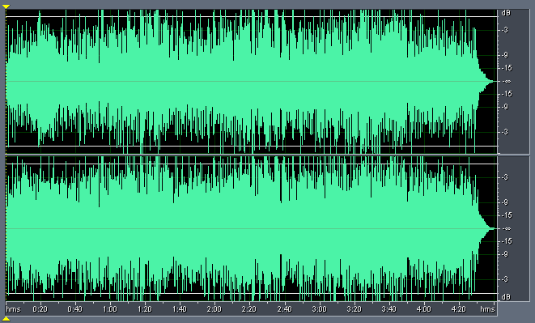
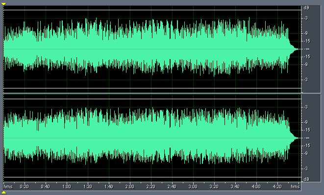
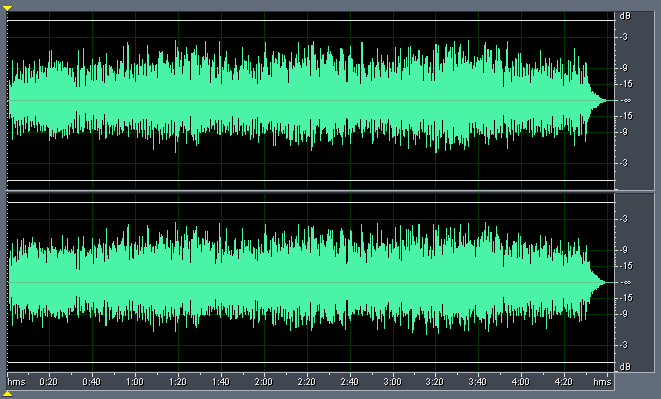
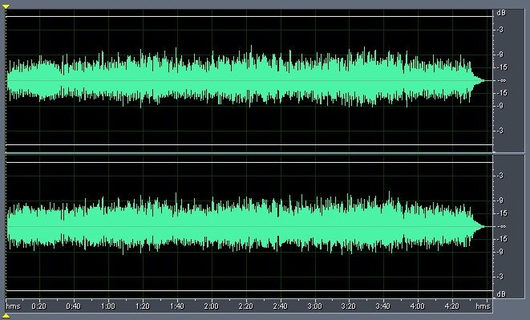

_This article was written by me and **published on Audioholics**, where it remains: **[read it there](https://www.audioholics.com/audio-technologies/dynamic-comparison-of-cd-dvd-a-sacd-part-3)**. Audioholics asked permission to run it. It is republished here for information, as part of the record of what I have written._

**The story so far...**

Sometime ago you will recall I did two articles comparing stereo versions of Diana Krall's Look of Love on DVD-A (96/24), SACD (DSD) and CD (44.1/16).

In Part 1 , I discovered that my recording of the SACD Stereo version of the track had slightly higher relative dynamics compared to the DVD-A MLP 2.0 version, which in turn had higher relative dynamics compared to the CD version.

In Part 2 , I confirmed the difference in relative dynamics do exist between the three recordings of the three formats, even when I redid the recordings using a constant gain setting and a more accurate recording method. In addition, I was surprised to discover the CD and DVD-A versions contained instances of clipping. These clips (instances where the waveform appear to flatten at peaks) appear to originate from the discs themselves and not as a result of my recording.

Since then, I have confirmed that on the CD version at least, the clips are definitely on the disc itself, as can be seen from the following analysis of the digitally rip (using Exact Audio Copy):

|                             | **_Left_** | **_Right_** | **_Average_** |
| :-------------------------- | :--------- | :---------- | :------------ |
| **Min Sample Value:**       | -32768.00  | -32768.00   | -32768.00     |
| **Max Sample Value:**       | 32767.00   | 32767.00    | 32767.00      |
| **Peak Amplitude (dB):**    | 0.00       | 0.00        | 0.00          |
| **Possibly Clipped:**       | 285        | 367         | 326           |
| **DC Offset:**              | -0.003     | 0           | -0.0015       |
| **Minimum RMS Power (dB):** | -82.51     | -80.46      | -81.49        |
| **Maximum RMS Power:**      | -4.39      | -4.80       | -4.60         |
| **Average RMS Power (dB):** | -16.65     | -16.22      | -16.44        |
| **Total RMS Power (dB):**   | -15.60     | -15.27      | -15.44        |
| **Actual Bit Depth:**       | 16 Bits    | 16 Bits     |               |

As you can see, the CD version clips in hundreds of places on a track lasting just over 4:42 minutes long. This seems hardly excusable, and is a sad indictment of the quality of mastering in the recording industry today.

This is how the waveform looks like:

**Using the Denon DVD-2200** Several people have correctly pointed out to me that there is a small chance the clipping could also be a result of overload on the analog circuits (player, amplifier, sound card) and the relative dynamics differences could be the result of the different players used for SACD and DVD-A.

Well, I've repeated the experiments, addressing both those concerns, by using a "universal" player (the Denon DVD-2200) and recording at a constant gain such that the peak digital sample on any format never exceeds -3.5dB FS.

The results are ... the same. Here are the statistics:

|                                       | **_EAC_** | **_CD_** | **_DVD-A_** | **_SACD_** |
| :------------------------------------ | :-------- | :------- | :---------- | :--------- |
| **Peak Amplitude (dB):**              | 0.00      | -2.95    | -3.46       | -6.16      |
| **Minimum RMS Power (dB):**           | -81.49    | -86.97   | -87.04      | -86.93     |
| **Maximum RMS Power:**                | -4.60     | -8.67    | -9.75       | -13.63     |
| **Average RMS Power (dB):**           | -16.44    | -19.98   | -21.18      | -25.23     |
| **Total RMS Power (dB):**             | -15.44    | -19.04   | -20.23      | -24.25     |
| **Maximum - Average RMS Power (dB):** | 11.84     | 11.32    | 11.43       | 11.60      |
| **Maximum - Minimum RMS Power (dB):** | 76.89     | 78.31    | 77.30       | 73.30      |

As you can see, the SACD recording still has slightly higher **Maximum - Average RMS Power** (11.60dB) over DVD-A (11.43dB) over CD (11.32dB). As we discussed in the previous article, this value is a good indication of the relative dynamics of the recording, so the higher the value the higher the relative dynamics.

This is how the CD recording looks like:

By contrast, the DVD-A recording is less compressed:

However I can still observe the instances of the clipped waveforms on the DVD-A recording. I haven't bothered showing pictures, since they look identical to the previous article.

By comparison, this is the SACD recording:

As we can see, even on the same player, the SACD playback is about 4dB quieter than DVD-A. If a listener compares the two discs without adjusting for the level differences, there will be a tendency to prefer the louder version (DVD-A).

## Conclusion

So it now looks like the differences in dynamics may be more fundamental than differences between players. Given that both DVD-A and SACD transfers come from the same analog master, the differences can now be narrowed to either the transfer process or the underlying format.

**Late breaking news:** After I wrote an article exploring the ability of various players in handling 0dBFS+ levels, I realised there is potentially a much simpler explanation, and it's to do with the players' inability to handle levels above 0dB FS. Given that neither the Panasonic DVD-RP82 nor the Denon DVD-2200 handle 0dBFS+ levels, the very slight reduction in relative dynamics could be due to this limitation (assuming that the DVD-A is recorded with digital samples peaking at 0dB FS). The reason why the SACD is not affected is the lower level of the recording (-6dB).

© 2004 Christine Tham. Used with permission.

_Reprinted with the Permission of Christine Tham. Please visit her very informative website at:__[http://users.bigpond.net.au/christie/](https://users.bigpond.net.au/christie/)_
