_This article was written by me and **published on Audioholics**, where it remains: **[read it there](https://www.audioholics.com/audio-technologies/dynamic-comparison-of-lps-vs-cds-part-4)**. Audioholics asked permission to run it. It is republished here for information, as part of the record of what I have written._

_Eight of the charts below are no longer served by Audioholics. They have been restored from my own Word manuscript for the article, which is why they are sharper here than the versions that ran there._

Yes, you have heard all the arguments before, and you are probably sick and tired of it. LP vs digital is a "religious war" that has been played out by various audiophiles ever since the CD format was introduced in the early 1980s.

"Vinylphiles" claim that CDs do not sound as good as LPs, period. CDs appear to sound "harsh", " unlistenable ", "lacking in dynamics", plus a myriad of other "faults." Some vinylphiles even extend this to all digital formats, including the new Super Audio CD and DVD-Audio high resolution formats, whereas others believe the higher resolution formats either equal or at least get closer to the "superior" sound of LP.

"Digiphiles" on the other hand laugh at LP's pitiful dynamic range, surface noise, pop and crackle, harmonic distortion, and various other limitations to do with the ability of either the cutting head to master difficult signals onto disc, and the ability of stylii to track them without "jumping."

So, are there any evidence to support these claims? Can _both_ parties be right? I was interested to find out if there are any objective evidence that I can gather using my sound card ( [Audiotrak Prodigy 7.1](https://www.audiotrak.net/prodigy71.htm) ) and my very old copy of Cool Edit.

I am particularly intrigued by vinylphile claims that LPs mastered from a digital recording sound _better_ than that exact same digital recording on CD. Plus, recording an LP onto CD yields most of the benefits of the original LP, and still sound better than the commercially pressed CD.

## **The Approach**

I took a few albums from my personal collection that I have on both LP and at least one digital format (CD, SACD, or DVD-A).

I selected the following songs from the following albums:

- _Main Titles_ from the original motion picture soundtrack to **_Chariots of Fire_** ( **Vangelis** ) LP ( Polydor 2383 602) 1981 Australian PolyGram pressing, purchased second hand CD ( Polydor 800 020-2) 1984 Polyram made in Germany , purchased new
- _Mick's Blessings_ from **_Café Bleu_** ( **The Style Council** ) LP ( Polydor 817 535-1) 1984 Australian PolyGram pressing, purchased new Original CD release ( Polydor 817 535-2) 1984 PolyGram made in Germany , purchased new "Digitally Remastered" CD re-release ( Polydor 557 915-2) 2000 Universal made in the EU, purchased new
- _What's New_ from **What's New** ( **Linda Ronstadt** and **The Nelson Riddle Orchestra** ) LP (Asylum 9 60260) 1983 USA WEA pressing, purchased second hand DVD-Audio (Elektra/Asylum/Rhino 8122-78341-9) 2002 Warner Strategic Marketing made in Germany , purchased new
- _Genesis Ch.1.V.32_ from **_I Robot_** ( **The Alan Parsons Project** ) LP (Arista Code 304 AL.7002) 1977 Australian EMI pressing, purchased second hand DVD-Audio (Classic HDAD 2003) 2004 Classic USA release, purchased new
- _More Than This_ from **_Avalon_** ( **Roxy** **Music** ) LP (EG 2311 154) 1982 Australian PolyGram pressing, purchased second hand Hybrid SACD (Virgin ROXYSACD 9) 2003 Virgin made in Holland , purchased new

Notice that most of the LPs are second hand. LPs deteriorate with every play, so this comparison is potentially biased against LPs.

What I did was cleaned all the LPs using a VPI HW16.5 vacuum based record cleaning machine (using VPI record cleaning fluid, VPI brush and a domestic lint brush - don't ask why, but it works!) to ensure that I minimize surface noise and crackle, and take out any dirt and grime from the second hand LPs.

I recorded all the tracks on the LPs using my system ( Dynavector DV-20xL cartridge, Rega P3 turntable, Dynavector P-75 phono stage) via the analog outputs of my Denon AVC-A1SE+ amplifier. I used my HTPC and n-Track Studio to do the recordings in stereo at 96kHz sampling rate and 24-bit resolution.

For the CDs, I ripped the actual digital information (at 44.1kHz/ 16-bit resolution) directly from the discs using [Exact Audio Copy](https://www.exactaudiocopy.de/) . In some cases, I also recorded them as reproduced by my Sony SCD-XA777ES player via the analog outputs of my amp.

I recorded SACD and DVD-A tracks using the analog outputs (via my amp) of the Sony SCD-XA777ES and Panasonic DVD-RP82 players respectively.

Linear PCM 96kHz/24-bit tracks encoded as DVD-Video content were recorded using the analog outputs (via my amp) Panasonic DVD-RP82, but also digitally ripped from the disc using DVD Decrypter .

All wave files were then analysed using Cool Edit Pro. The results are ... interesting ...

## Dynamic Comparison of LPs vs CDs - Part 4 - page 2

### **_Main Titles_ from _Chariots of Fire_**

Let's look at some statistics first, comparing:

- the digitally ripped copy of the track (using Exact Audio Copy)
- the analog recording of the SCD-XA777ES playing the track
- the recording of the LP

The following statistics were obtained using the " Analyze Statistics" function of Cool Edit (which produced separate results for Left and Right channels, which were then averaged):

|                                       | **_EAC_** | **_CD_** | **_LP_** |
| :------------------------------------ | :-------- | :------- | :------- |
| **Peak Amplitude (dB):**              | -3.09     | -5.48    | -4.90    |
| **Minimum RMS Power (dB):**           | -103.85   | -79.84   | -60.10   |
| **Maximum RMS Power:**                | -12.26    | -14.48   | -14.40   |
| **Average RMS Power (dB):**           | -23.61    | -25.59   | -25.95   |
| **Total RMS Power (dB):**             | -22.38    | -24.37   | -24.80   |
| **Maximum - Average RMS Power (dB):** | 11.35     | 11.11    | 11.56    |
| **Maximum - Minimum RMS Power (dB):** | 91.60     | 65.36    | 45.70    |

Note that the values for the CD recording are not as "good" as the EAC digital rip. This gives an indication of the difference between CD "real world" performance vs "theoretical" performance.

Now clearly LP loses out in dynamic range, even against the CD recording (by comparing the figures in the **Maximum - Minimum RMS Power** row). This is to be expected, given the surface noise on LP (which is quite audible on my system).

But before we chalk this as a "win" for CD, let's look at the noise flloor more closely, on both the CD and LP recordings.

This is the noise floor from the CD recording (in the "silent" bit just before the music starts):

[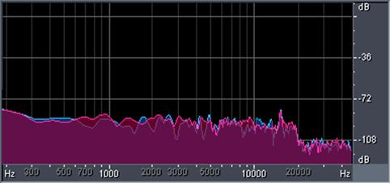](https://www.audioholics.com/audio-technologies/chart2-1.jpg/image)

The noise floor seems to be hovering around the -88dB level up to 20kHz, and then drops down to below -108dB (the underlying noise floor of the sound card).

By contrast, here is the recording of the LP around the same point:

[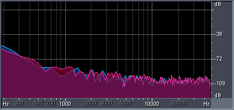](https://www.audioholics.com/audio-technologies/chart2-2.jpg/image)

We can see why statistics often "mislead". LP's noise floor is actually quite low over most of the spectrum, ranging from -84dB around 1kHz to -96dB for frequencies above 10kHz . In other words, the LP recording has a lower noise floor than the CD recording for the majority of the spectrum (frequencies above 2kHz ).

LP's surface noise, which is responsible for the poor dynamic range, is mainly concentrated below 500Hz where the noise level is around -50dB.

And this is for a mass-produced commercial LP, purchased second hand from a thrift store for around \$1!

The noise floor is even lower for an "audiophile" pressing on good quality vinyl. This is the noise floor from a Mobile Fidelity Sound Lab "Original Master Recording" of **_Three Works For Jazz Soloists & Symphony Orchestra_** ( **Don Sebesky** ) MFSL 2-503 (200J-3):

[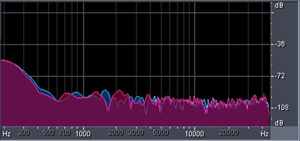](https://www.audioholics.com/audio-technologies/chart2-3.jpg/image)

As you can see, the noise floor is convincingly below -90dB all the way down to 400Hz. So it would appear LPs do have a reasonable dynamic range for the majority of the audible frequency range.

Many vinylphiles have long claimed that they can hear "below" the noise floor of their LPs. My observations would seem to partially support this claim: surface noise is fairly "structured" (it has a distinct "sound" as opposed to random noise) allowing our brain/ears to "filter" it away and listen to the "music" all the way down to the "real" underlying noise floor which is comparable to CD.

A far more interesting statistic to look at is **Maximum - Average RMS Power** . As I have mentioned in previous articles, this is a good indication of "relative dynamics." Note that relative dynamics is a different concept from dynamic range. Relative dynamics is the difference in dB between any two points in a waveform. Dynamic range is the difference between the loudest signal and the noise floor.

Here, LP actually "wins" over CD. LP's difference between maximum to average is around 11.56dB, compared against the CD recording at 11.11dB and even the digital rip at 11.35dB. In other words, LP "real world" relative dynamics is better than CD's "theoretical" performance.

At this point you might say: But isn't the higher noise levels on LP perhaps contributing to the values, and therefore the results are not statistically significant?

To investigate further, let's look at the actual waveforms.

This is the waveform for the digital rip (I'll explain the significance of the highlighted selection around 30 seconds into the track later):

[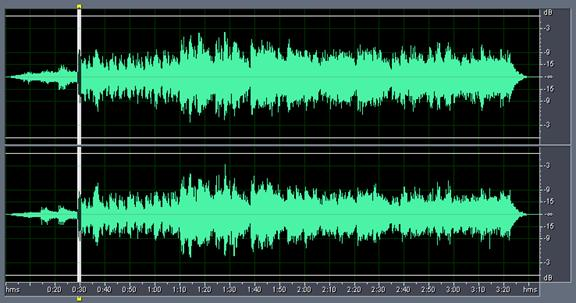](https://www.audioholics.com/audio-technologies/chart2-4.jpg/image)

The CD recording looks very similar:

[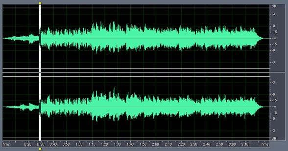](https://www.audioholics.com/audio-technologies/chart2-5.jpg/image)

And so does the LP recording:

[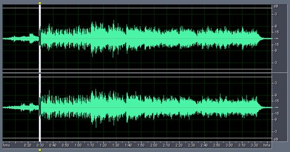](https://www.audioholics.com/audio-technologies/chart2-6.jpg/image)

Now, let's zoom in into the highlighted section. This is the CD recording:

[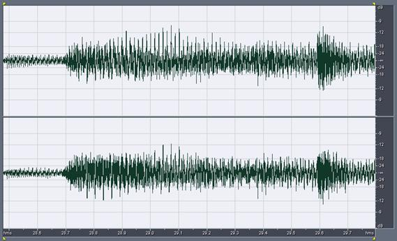](https://www.audioholics.com/audio-technologies/chart2-7.jpg/image)

Note the relatively quiet section at the beginning is peaking around -24dB. The louder section that follows is around -18-12dB.

By comparing, this is the LP recording at the same section:

[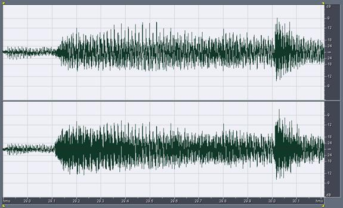](https://www.audioholics.com/audio-technologies/chart2-8.jpg/image)

Notice that although the quiet section at the beginning is also around -24dB, the louder section that follows has much higher peaks, ranging from -18-9dB! This is despite both recordings having the same average RMS power (in other words, same perceived average loudness). In particular, the loud bit around 30 seconds into the track is peaking at up to 3-4dB higher on LP vs CD!

This finding supports my own subjective impressions comparing the CD against the LP. I much prefer listening to the LP over the CD on my system. The CD sounds dull, congested, muddy, and lacking in dynamics. If I push up the volume, the sound becomes noticeably harsh and artificial. The LP on the other hand sounds more "dynamic" and "exciting."

Now let's compare the spectral views of the recordings. First of all the CD recording:

[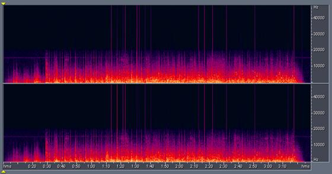](https://www.audioholics.com/audio-technologies/chart2-9.jpg/image)

As you can see, there is no spectral content above 20kHz , due to the Nyquist cutoff at 22.05kHz. The few spikes here and there are probably distortion frrom my setup.

In contrast, this is the LP recording:

[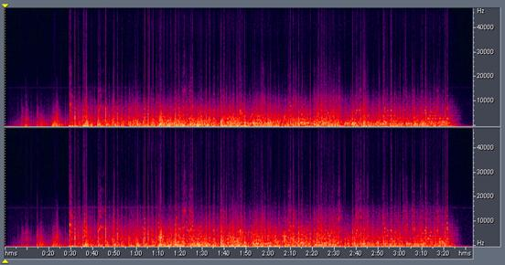](https://www.audioholics.com/audio-technologies/chart2-10.jpg/image)

The LP would _appear_ to have better frequency response, with spectral components all the way to 48kHz . However, I would caution against this interpretation of the graph (just yet). I suspect a lot of this spectral information is harmonic distortion and there is not much useful frequency content significantly above 20kHz in the original master tape. We'll investigate LP's usable frequency response in more detail later.

## Dynamic Comparison of LPs vs CDs - Part 4 - page 3

(The Style Council)

This time, I am comparing the original issue of the LP and CD released in 1984 against the "digitally remastered" version released in 2000.

First of all, some statistics (note that the CD figures are "theoretical" based on a digital rip - real world performance will not be as good, in contrast the LP figures are from my recording):

|                                       | **_Original_** | **_Remastered_** | **_LP_** |
| :------------------------------------ | :------------- | :--------------- | :------- |
| **Peak Amplitude (dB):**              | -1.43          | -0.05            | -5.09    |
| **Minimum RMS Power (dB):**           | -62.90         | -99.01           | -56.96   |
| **Maximum RMS Power:**                | -12.86         | -6.19            | -14.18   |
| **Average RMS Power (dB):**           | -21.18         | -13.77           | -21.88   |
| **Total RMS Power (dB):**             | -20.38         | -12.95           | -21.10   |
| **Maximum - Average RMS Power (dB):** | 8.33           | 7.58             | 7.71     |
| **Maximum - Minimum RMS Power (dB):** | 50.05          | 92.82            | 42.79    |

Subjectively, the original CD release sounds inferior to my LP, but the remastered version sounds pretty good - comparable to the LP on a casual listen.

Looking at the statistics, however, I suspect that the remastered CD achieves better subjective performance through manipulation: the remastered version is noticeably more compressed (lower **Maximum - Average RMS Power** ) and has had noise reduction applied (higher apparent **Maximum - Minimum RMS Power** ). One could argue whether this is effectively "cheating."

Let's compare the waveforms. This is the digital rip of the original CD release:

[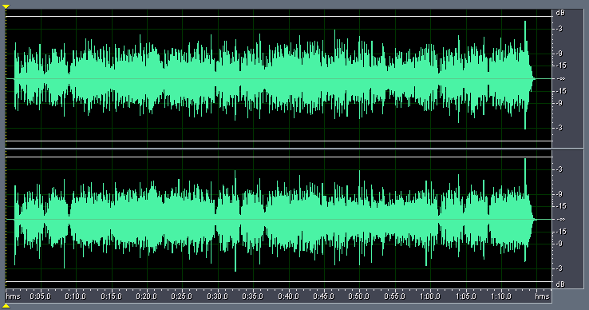](https://www.audioholics.com/audio-technologies/chart3-1.jpg/image)

In comparison, the remastered CD is noticeably compressed/peak limited, and the average volume level boosted as high as possible:

[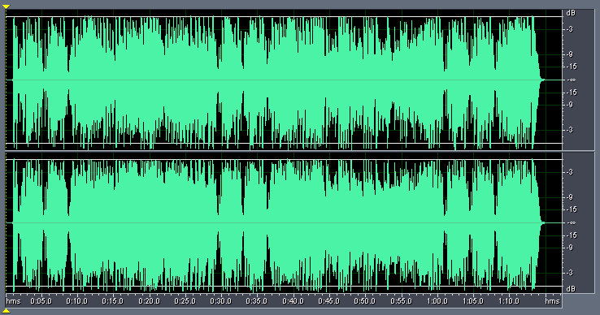](https://www.audioholics.com/audio-technologies/chart3-2.jpg/image)

The LP in comparison:

[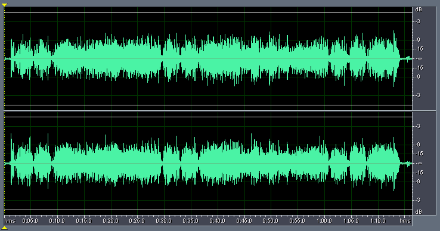](https://www.audioholics.com/audio-technologies/chart3-3.jpg/image)

This is the spectral view of the original issue CD:

[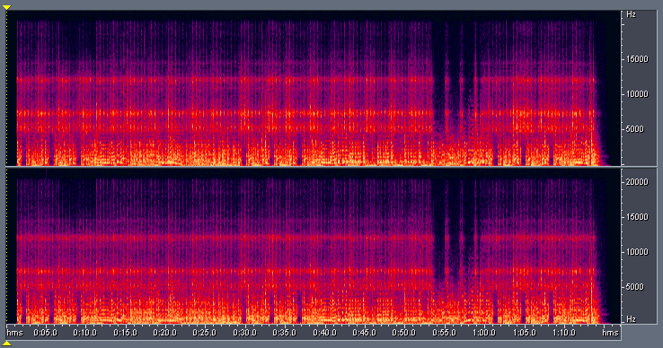](https://www.audioholics.com/audio-technologies/chart3-4.jpg/image)

As you can see, no spectral information above 20kHz . The horizontal "bands" of spectral content are probably inherent in the master tape, and probably the result of mutli -band analog equalization during mixing.

The remastered CD has similar specral content:

[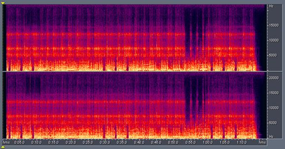](https://www.audioholics.com/audio-technologies/chart3-5.jpg/image)

Interestingly, I'm noticing a band of "noise" close to 22.05kHz - this could be the result of dithering, or a sign that the remastered CD was taken from a DSD master.

In comparison, this is the LP spectral view:

[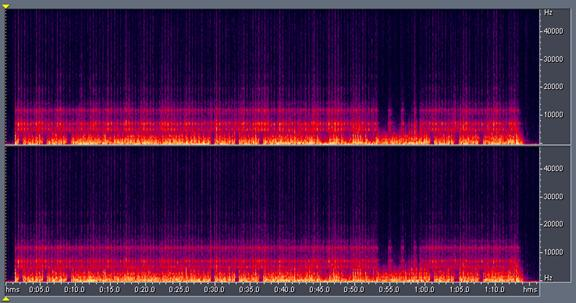](https://www.audioholics.com/audio-technologies/chart3-6.jpg/image)

Still rather inconclusive, although there appears to be some frequency content up to around 25kHz (notice the extra horizontal "band" above 20kHz).

### **_What's New_ from What's New (Linda Ronstadt and The Nelson Riddle Orchestra)**

This is comparing my capture of the LP vs the DVD-Audio MLP 2.0 track (at 192kHz/ 24-bits, converted to analog , and recaptured on my sound card at 96kHz/24-bits). First of all, the statistics:

|                                       | **_DVD-A_** | **_LP_** |
| :------------------------------------ | :---------- | :------- |
| **Peak Amplitude (dB):**              | -1.44       | -3.90    |
| **Minimum RMS Power (dB):**           | -89.46      | -60.00   |
| **Maximum RMS Power:**                | -7.16       | -12.19   |
| **Average RMS Power (dB):**           | -20.36      | -24.85   |
| **Total RMS Power (dB):**             | -18.88      | -23.61   |
| **Maximum - Average RMS Power (dB):** | 13.21       | 12.66    |
| **Maximum - Minimum RMS Power (dB):** | 82.30       | 47.81    |

Note that LP no longer has a relative dynamics advantage over the digital recording.

But the **Total RMS Power** of the DVD-A is higher. If we adjusted the DVD-A recording downwards by 4.73dB (so that both recordings have the same Total RMS Power):

|                                       | _DVD-A_ | _LP_   |
| :------------------------------------ | :------ | :----- |
| **Peak Amplitude (dB):**              | -6.17   | -3.90  |
| **Minimum RMS Power (dB):**           | -94.19  | -60.00 |
| **Maximum RMS Power:**                | -11.89  | -12.19 |
| **Average RMS Power (dB):**           | -25.09  | -24.85 |
| **Total RMS Power (dB):**             | -23.61  | -23.61 |
| **Maximum - Average RMS Power (dB):** | 13.21   | 12.66  |
| **Maximum - Minimum RMS Power (dB):** | 82.30   | 47.81  |

LP now has a higher peak amplitude and Average RMS Power. Indeed, comparing the waveforms show that LP has higher relative dynamics, but the differences are much smaller compared to _Chariots of Fire_ , around 1dB or less. This is probably not statistically significant, given LP's noise floor.

## Dynamic Comparison of LPs vs CDs - Part 4 - page 4

The DVD-A recording looks like this (without the -4.73dB adjustment):

[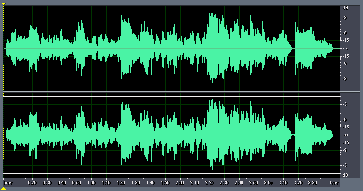](https://www.audioholics.com/audio-technologies/chart4-1.jpg/image)

By comparison, the LP recording:

[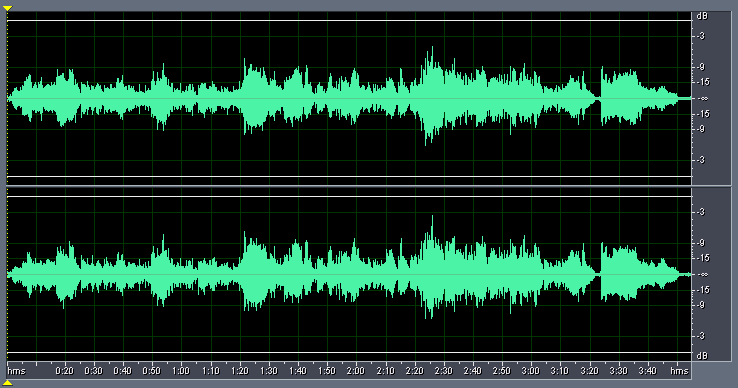](https://www.audioholics.com/audio-technologies/chart4-2.jpg/image)

The spectral view of DVD-A confirms that the DVD-A is faithfully capturing the extended frequency range of the original analog master, including the analog tape bias around 29kHz :

[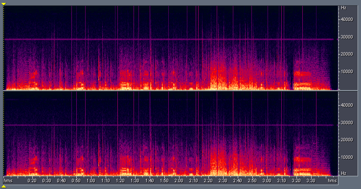](https://www.audioholics.com/audio-technologies/chart4-3.jpg/image)

Now, the spectral view of LP is interesting:

[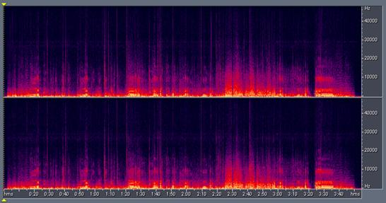](https://www.audioholics.com/audio-technologies/chart4-4.jpg/image)

It appears the the LP is definitely reproducing frequencies above 20kHz , although not very well. The LP is able to reproduce the analog tape bias at 29kHz , but very faintly. This is one advantage that LP has over CDs.

## Dynamic Comparison of LPs vs CDs - Part 4 - page 5

### **_Genesis Ch.1.V.32_ from _I Robot_ (The Alan Parsons Project)**

I did a digital rip of the 96/24 data from the DVD-Video side of the Classic HDAD release, and compared with the 96/24 recordings done using my soundcard of:

- Linear PCM 2.0 96/24 version on the DVD-Video side of the disc
- MLP 2.0 192/24 version on the DVD-Audio side of the disc
- LP

|  | **_LPCM Rip (96/24)_** | **_DVD-V (96/24)_** | **_DVD-A (192/24)_** | **_LP_** |
| :-- | :-- | :-- | :-- | :-- |
| **Peak Amplitude (dB):** | -2.14 | -2.07 | -2.61 | -4.61 |
| **Minimum RMS Power (dB):** | -86.74 | -86.36 | -91.48 | -60.20 |
| **Maximum RMS Power:** | -11.39 | -11.39 | -11.86 | -13.90 |
| **Average RMS Power (dB):** | -21.17 | -20.68 | -21.63 | -24.24 |
| **Total RMS Power (dB):** | -19.32 | -19.07 | -19.77 | -22.51 |
| **Maximum - Average RMS Power (dB):** | 9.78 | 9.29 | 9.78 | 10.35 |
| **Maximum - Minimum RMS Power (dB):** | 75.35 | 74.98 | 79.62 | 46.31 |

Note that despite the LP having a lower **Total RMS Power ,** it has a higher **Maximum - Average RMS Power** . Subjectively, the LP does sound slightly more dynamic than either the Linear PCM or MLP versions on the DVD-Audio disc, but the DVD-Audio still sounds quite good and arguably "cleaner" sounding than the LP (ie. less distortion).

## Dynamic Comparison of LPs vs CDs - Part 4 - page 6

The other interesting point of note is that the DVD-A side (MLP 2.0 192/24) has better relative dynamics than the DVD-V side (Linear PCM 2.0 96/24). It is interesting to speculate whether this is statistically significant!

The digitally ripped DVD-V waveform:

[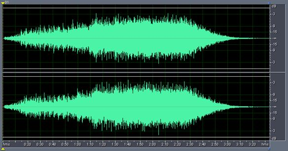](https://www.audioholics.com/audio-technologies/chart6-1.jpg/image)

The recording is quite faithful:

[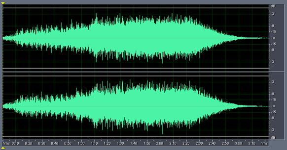](https://www.audioholics.com/audio-technologies/chart6-2.jpg/image)

The MLP version is again very similar:

[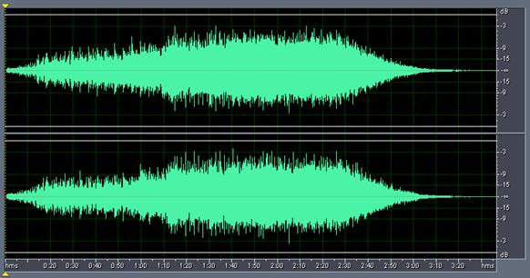](https://www.audioholics.com/audio-technologies/chart6-3.jpg/image)

And so is the LP recording:

[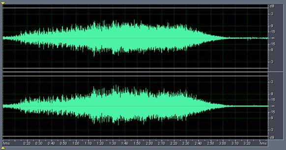](https://www.audioholics.com/audio-technologies/chart6-4.jpg/image)

I was a bit disappointed to discover there is no extended frequency content even on the digitally ripped version:

[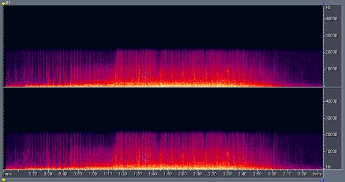](https://www.audioholics.com/audio-technologies/chart6-5.jpg/image)

And of course, it is not reproduced in the soundcard recording:

[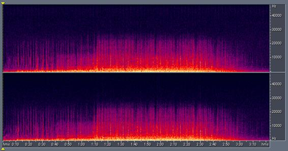](https://www.audioholics.com/audio-technologies/chart6-6.jpg/image)

And not in the DVD-A recording either:

[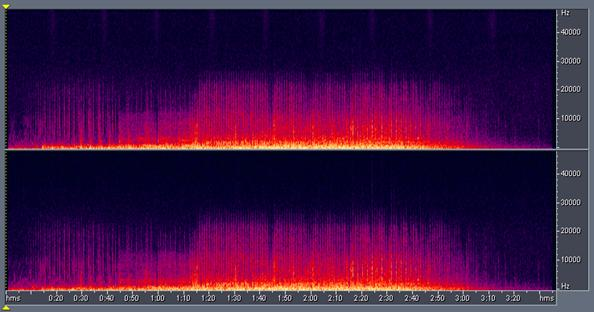](https://www.audioholics.com/audio-technologies/chart6-7.jpg/image)

It looks like the original master tape has had all frequencies above 20kHz filtered out, because even the LP is not showing a lot of content above 20kHz:

[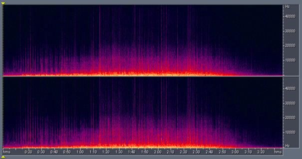](https://www.audioholics.com/audio-technologies/chart6-8.jpg/image)

### **_More Than This_ from _Avalon_ (Roxy Music)**

I compared the digital rip of the CD layer from the Hybrid SACD against 96/24 recordings done using my soundcard of the:

- CD layer of the Hybrid SACD
- Stereo DSD content from the Hybrid SACD
- LP

|                                       | **_EAC_** | **_CD_** | **_DSD_** | **_LP_** |
| :------------------------------------ | :-------- | :------- | :-------- | :------- |
| **Peak Amplitude (dB):**              | -0.01     | -8.19    | -6.09     | -5.03    |
| **Minimum RMS Power (dB):**           | -137.11   | -91.88   | -90.99    | -58.40   |
| **Maximum RMS Power:**                | -8.06     | -16.49   | -16.24    | -14.56   |
| **Average RMS Power (dB):**           | -16.88    | -25.08   | -24.84    | -23.53   |
| **Total RMS Power (dB):**             | -16.10    | -24.28   | -24.04    | -22.65   |
| **Maximum - Average RMS Power (dB):** | 8.82      | 8.60     | 8.60      | 8.97     |
| **Maximum - Minimum RMS Power (dB):** | 129.05    | 75.39    | 74.75     | 43.85    |

The CD and DSD recordings have such similar values it's scary (apart from slightly higher peaks for the DSD recording). I suspect the CD layer is a downconversion of the DSD master.

Notice once again the relative dynamics superiority of LP over the digital formats.

Looking at the digital rip of the CD reveals a typical over-compressed and heavily manipulated pop recording:

[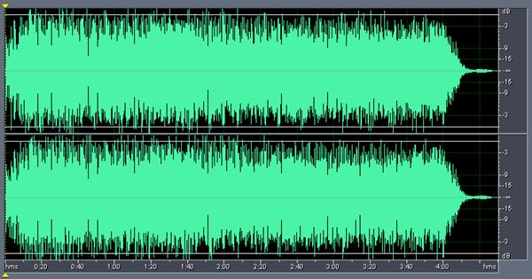](https://www.audioholics.com/audio-technologies/chart6-9.jpg/image)

... which the recording of the CD faithfully captures:

[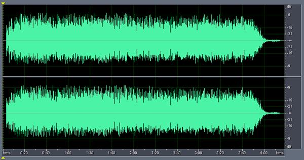](https://www.audioholics.com/audio-technologies/chart6-10.jpg/image)

And of course the DSD version as well:

[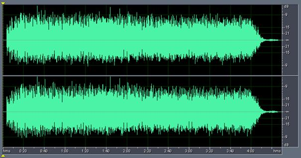](https://www.audioholics.com/audio-technologies/chart6-11.jpg/image)

The LP recording shows that the compression is intentional and present in the original master:

[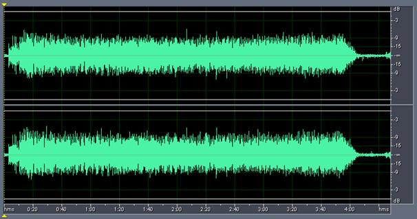](https://www.audioholics.com/audio-technologies/chart6-12.jpg/image)

The spectral view of the recording of the CD layer:

[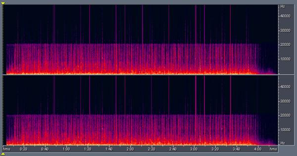](https://www.audioholics.com/audio-technologies/chart6-13.jpg/image)

Interestingly, the DSD spectral view shows extended frequencies:

[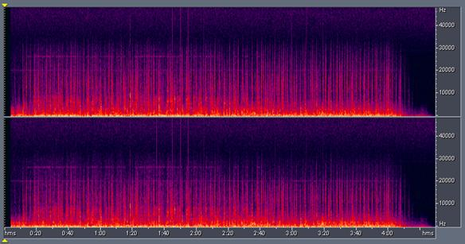](https://www.audioholics.com/audio-technologies/chart6-14.jpg/image)

Unfortunately, though, not on the LP:

[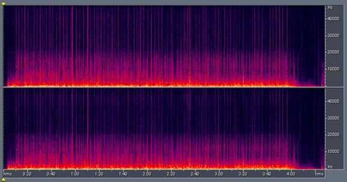](https://www.audioholics.com/audio-technologies/chart6-15.jpg/image)

I suspect the LP is derived from a low resolution PCM digital master.

### **Conclusions**

It appears that the vinylphile claims are not as outrageous as they seem: LPs do have a usable dynamic range far greater than the measured dynamic range would suggest, and LPs consistently have higher relative dynamics over digital formats. But it is also true that LPs have higher distortion levels which translate to ultrasonic frequency harmonics.

The question is: is the higher relative dynamics of LPs an indication of higher accuracy, or are LPs exaggerating transients and dynamics? I'm not sure, and I would welcome comments.

If LPs have higher distortion and are exaggerating dynamics, it may explain why the apparent "benefits" of LPs translate even into LP recordings, and potentially explain why LPs of digital recordings sound better than their CD equivalents.

© 2004 Christine Tham
