_This article was written by me and **published on Audioholics**, where it remains: **[read it there](https://www.audioholics.com/audio-technologies/dynamic-comparison-sacd-vs-cd-part-5)**. Audioholics asked permission to run it. It is republished here for information, as part of the record of what I have written._

_Eight of the charts below are no longer served by Audioholics. They have been restored from my own Word manuscript for the article, which is why they are sharper here than the versions that ran there._

After doing the four articles on comparisons of various formats and recordings based on measurements derived using my soundcard, I did not think there was any need to do another, but my friend Dan Banquer alerted me to one of his favourite recordings, which was originally released on CD but subsequently remastered by Mobile Fidelity and released as a Hybrid SACD.

**Patricia Barber's _Café Blue_** is regarded by many audiophiles as an excellent recording, both the original CD release and the Mobile Fidelity Hybrid SACD. It was recorded at the Chicago Recording Company in 1994. The original recording engineer was Jim Anderson, and he also participated in the Mobile Fidelity remaster in 2002.

Dan was so keen on me doing the comparisons between the CD and SACD versions that he sent me a CD-R copy of the original CD release, plus the Hybrid SACD for me to do my tests!

## **Subjective Impressions**

I started by listening to the CD-R copy of the original CD release (Blue Note/Premonition 737). I think I agree with the majority opinion that this does seem to be an excellent recording, and a worthy example of how good sounding a well-engineered CD can be. The ambience is rather atmospheric and reverberant, but in my opinion not unrealistically rich or 'wet.' It also sounded fairly open and dynamic.

I next played the CD layer of the Mobile Fidelity remastered Hybrid CD (UDSACD 2002). I did not expect to find a huge difference, but I was pleasantly surprised. The overall sound was noticeably improved, with cleaner and more detailed high frequencies, more "sparkle" in the instruments, and believe it or not sounding more dynamic than the CD-R which now sounds a bit dull in comparison.

Lastly, I listened to the SACD Stereo version. Overall, the soundwas very similar to the CD layer, and clearly the SACD and CD layers sounded more similar than the CD layer vs the CD-R of the original release. However, the SACD version seemed slightly softer in the transients than the CD - almost as if the edges have been smoothed off. Whilst I wouldn't call the CD layer "harsh", the softer sound did seem to liquefy the sound a little, but perhaps also reducing some of the "bite" of the music. I also noticed SACD's tendency to emphasise micro-dynamics in the presence region - Patricia's voice sounds more detailed and also more forward - by comparison her voice in both CD versions sound a bit recessed and indistinct.

So, how much of my subjective impressions are supported by measurements?

## **Comparing digital rips of the CD-R and the CD layer**

First of all, I did digital rips of both the CD-R and the CD layer of the hybrid disc using Exact Audio Copy. The "Analyze | Statistics …" function on Cool Edit on the first track ( _What A Shame_ ) clearly show that the two versions are totally different and clearly not based on the same master:

|                                       | _CDR_  | _Hybrid (CD)_ |
| :------------------------------------ | :----- | :------------ |
| **Peak Amplitude (dB):**              | -0.87  | -0.50         |
| **Minimum RMS Power (dB):**           | -96.34 | -146.32       |
| **Maximum RMS Power (dB):**           | -10.28 | -8.79         |
| **Average RMS Power (dB):**           | -24.03 | -22.84        |
| **Total RMS Power (dB):**             | -22.33 | -21.08        |
| **Maximum - Average RMS Power (dB):** | 13.76  | 14.05         |
| **Maximum - Minimum RMS Power (dB):** | 86.07  | 137.54        |

The CD layer of the Hybrid disc clearly reflects advances in mastering technology since 1994, and wins in nearly every respect: it is louder (peak amplitude, maximum RMS power), has a higher dynamic range (maximum - minimum RMS power), and has increased dynamics (maximum - average RMS power, as well as peak amplitude - average RMS power). No wonder I felt it sounded better than the CD-R.

## **Comparing recordings made using the soundcard**

I then recorded the CD-R, plus CD and SACD layers of the hybrid disc played using my Sony SCD-XA777ES player, with the analog outputs captured directly by my Audiotrak Prodigy 7.1 soundcard at 96kHz 24-bits resolution. The gain used was constant for all three recordings, and I took special care to avoid clipping by ensuring the highest digital sample was around -3dBFS.

Here is how the waveform for the CD-R recording looks like:

[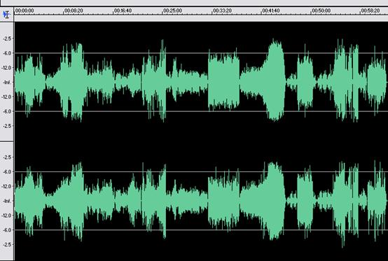](https://www.audioholics.com/audio-technologies/chart1-1.jpg/image) _CD-R captured using the soundcard at 96/24_

As you can see, the recording does not exhibit any significant signs of dynamic compression. In comparison, the CD layer is clearly louder _and_ relatively more dynamic, resulting in higher peaks (although these are difficult to spot on the graph):

[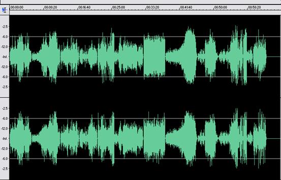](https://www.audioholics.com/audio-technologies/chart1-2.jpg/image)

Finally, the SACD layer is louder still plus higher relative dynamics. Note in particular the peaks on Track 11 ( _Nardis_ ) are much higher than on the CD layer, even taking into account that the SACD layer is slightly louder.

[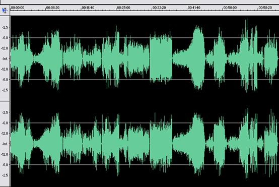](https://www.audioholics.com/audio-technologies/chart1-3.jpg/image) SA_CD layer of Hybrid disc captured using the soundcard at 96/24_

## Dynamic Comparison SACD vs CD - Part 5 - page 2

Using the first track (_What A Shame_), here are the relative differences using the "Analyze | Statistics …" function on Cool Edit:

|                                       | **_CDR_** | **_CD_** | **_SACD_** |
| :------------------------------------ | :-------- | :------- | :--------- |
| **Peak Amplitude (dB):**              | -4.26     | -3.68    | -2.93      |
| **Minimum RMS Power (dB):**           | -80.92    | -88.22   | -85.07     |
| **Maximum RMS Power (dB):**           | -13.57    | -12.08   | -11.33     |
| **Average RMS Power (dB):**           | -27.30    | -26.13   | -25.40     |
| **Total RMS Power (dB):**             | -25.63    | -24.38   | -23.64     |
| **Maximum - Average RMS Power (dB):** | 13.73     | 14.05    | 14.07      |
| **Maximum - Minimum RMS Power (dB):** | 67.35     | 76.15    | 73.74      |

As you can see, the SCD-XA777ES reproduces both the CD-R and the CD layer of the Hybrid disc reasonably faithfully compared to the digital rips (except with a higher noise floor). The statistics also confirm how close the CD and SACD layers are. The SACD layer is obviously slightly louder, and this could account for me finding Patricia's vocals a bit more engaging on SACD.

_<strong>Track 11 (Nardis)</strong>_

Here is a close-up showing that the SACD has much higher peaks on Track 11 ( _Nardis_):

[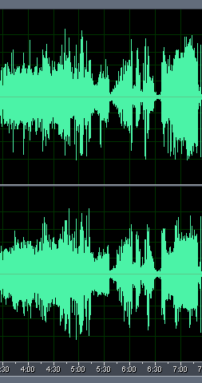](https://www.audioholics.com/audio-technologies/chart2-1a.gif/image) [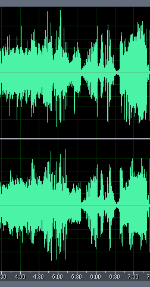](https://www.audioholics.com/audio-technologies/chart2-1b.gif/image) _omparing an excerpt from track 11 on CD (left) and SACD (right)_

Intrigued, I looked at the digital rip of track 11 from the CD layer, and found one possible explanation: evidence of clipping on the CD layer limiting the dynamics of that track. This is confirmed by the "Analyze | Statistics …" function on Cool Edit:

|                                 | _Left_    | _Right_   | _Average_ |
| :------------------------------ | :-------- | :-------- | :-------- |
| **Min Sample Value:**           | -32768.00 | -32768.00 | -32768.00 |
| **Max Sample Value:**           | 32767.00  | 32767.00  | 32767.00  |
| **Peak Amplitude:**             | 0.00      | 0.00      | 0.00      |
| **Possibly Clipped:**           | 8         | 4         | 6         |
| **DC Offset:**                  | 0         | 0         | 0         |
| **Minimum RMS Power:**          | -94.33    | -94.32    | -94.33    |
| **Maximum RMS Power:**          | -10.62    | -10.74    | -10.68    |
| **Average RMS Power:**          | -26.47    | -25.96    | -26.22    |
| **Total RMS Power:**            | -23.71    | -23.31    | -23.51    |
| **Actual Bit Depth:**           | 16 Bits   | 16 Bits   |           |
| **Maximum - Minimum RMS (dB):** | 83.71     | 83.58     | 83.65     |
| **Maximum - Average RMS (dB):** | 15.85     | 15.22     | 15.54     |

Here is the graph of the CD recording of track 11:

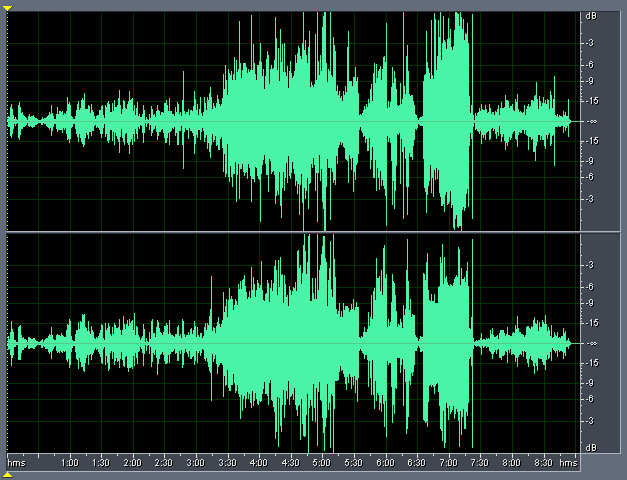

Recording of track 11 (Nardis) – CD layer of Hybrid disc.

## Dynamic Comparison SACD vs CD - Part 5 - page 3

As you can see, by zooming in the area of clipping, the recording clearly exhibit 0dBFS+ levels (as well as possibly clipped digital samples):

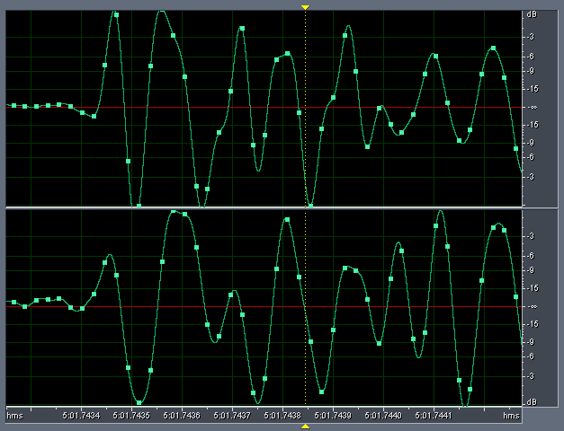

Close up of an excerpt from Track 11 from

CD layer (digitally ripped using EAC) showing signs of digital clipping as well as 0dBFS+ levels

### _<strong>Spectral Comparisons</strong>_

Here is how the Track 1 of the CD-R looks like:

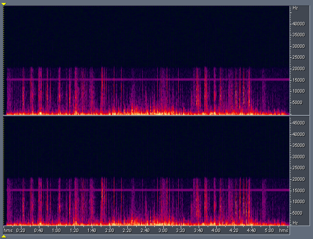

Track 1 of the

CD-R (recorded using soundcard at 96/24)

As you would expect, there are no frequency components above 22.05kHz. I'm not quite sure what the noise around 15.6kHz is, quite possibly this is an artefact from the equipment used in the studio (carrier frequency of a wireless microphone, perhaps?).

Here is a frequency analysis of a representative point in the recording showing the presence of the 15.6kHz signal:

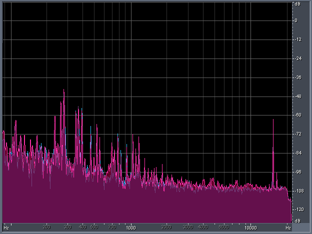

Frequency analysis within

Track 1 of the

CD-R (from the digital rip)

The noise is also present in the CD layer:

_ Track 1 of the_ _CD layer (recorded using soundcard at 96/24)_

As you can see, the artefact is also present in the remastered version.

## Dynamic Comparison SACD vs CD - Part 5 - page 4

The SACD layer surprisingly also show no frequency components above 22.05kHz except for DSD ultrasonic noise:

_[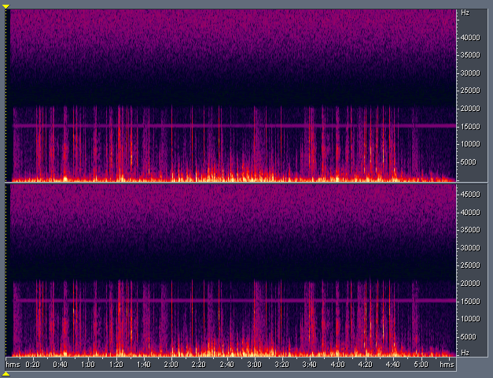](https://www.audioholics.com/audio-technologies/chart4-1.jpg/image) Track 1 of the_ SA _CD layer (recorded using soundcard at 96/24)_

### _<strong>Frequency analysis</strong>_

This is confirmed by doing a frequency analysis around 3:45 into the track. This is the CD-R:

[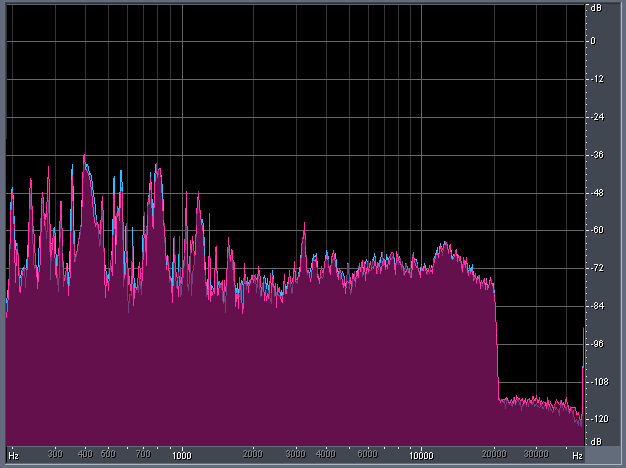](https://www.audioholics.com/audio-technologies/chart4-2.jpg/image) Frequency analysis around

3:45

of Track 1 of CD-R (recorded on soundcard)

The CD layer is similar:

[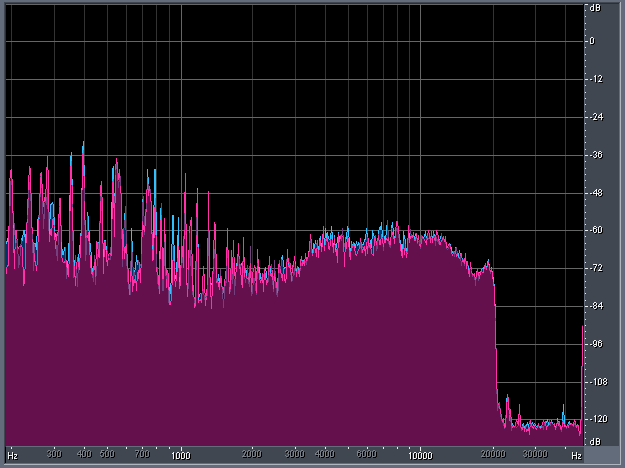](https://www.audioholics.com/audio-technologies/chart4-3.jpg/image) Frequency analysis around

3:45

of Track 1 of CD layer (recorded on soundcard)

## Dynamic Comparison SACD vs CD - Part 5 - page 5

The SACD layer exhibits exactly the same brick wall at 20kHz but layered with the rising DSD ultrasonic noise from about 24kHz onwards:

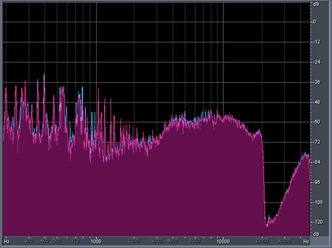

Frequency analysis around

3:45

of Track 1 of SACD layer (recorded on soundcard)

I was fairly disappointed by the lack of ultrasonic frequency components on the SACD layer, as it indicates that the SACD may have been mastered from a low-resolution PCM source.

I checked the liner notes, and discovered the engineer (Jim Anderson) clearly can't quite remember what the original recording format was:

_"What we did for these SACDs was to go back to using the analog masters exclusively."_

_"No… let me correct that. We used an older Mitsubishi 32-track digital machine on Café Blue, and now that I think of it, we didn't produce an analog master for Café Blue."_

So it looks like my worst fears are confirmed - _Café Blue_ originated from a low-resolution multi-track PCM recording.

## Conclusions

First of all, regardless of whether _Café Blue_ was originally recorded in analog or low-resolution PCM, it still doesn't change the observation that it is an excellent recording. Perhaps it is a useful reminder to us just how good 44.1kHz 16-bits can be, especially when all 16-bits are used and dynamic compression is avoided.

The differences between the CD-R of the original release and the remastered CD layer also highlight the benefits of careful remastering using the latest technology can bring even to digital recordings.

In that case, what accounts for the audible differences between the CD and SACD layers? I'll leave it up to the reader to draw his/her own conclusions, but here are some possible reasons:

- There are no differences between the CD and SACD layers. Any observable differences are purely a figment of the listener's imagination
- The differences are due to the relative accuracy of the player in reproducing PCM vs DSD.
- The differences are due to the CD layer clipping or exhibiting 0dBFS+ levels.
- The differences are due to the SACD revealing more of the benefits of the remaster that was possibly done using high resolution processing.
- The differences are due to the DSD ultrasonic noise somehow affecting the playback chain or our hearing.
- The differences are primarily due to the relative level difference between the layers (the SACD layer is on average around 0.7dB louder than the CD layer which would be just audible).
