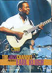

_This review was written by me for **MichaelDVD**, an Australian DVD review site that is no longer online. A capture of the site is held by the Internet Archive: **[browse it there](https://web.archive.org/web/20220217040146/http://www.michaeldvd.com.au/)**. It is reproduced here from my own copy of the site, as part of the record of what I have written._

_2000 · directed by Waymer Johnson._

## The film

_**The Jazz Channel Presents: Earl Klugh**_ is another in a series of TV specials featuring concerts by black musicians produced by **BET on Jazz**.

Acoustic jazz guitarist **Earl Wilbert Klugh, Jr.** was born on 16 September 1954 in Detroit, Michigan, USA. Early influences include **Chet Atkins**, **Burt Bacharach**, the **Beatles** and **Sergio Mendes**. While still in his mid-teens he recorded with **Yusef Lateef** and **George Benson**. He was also member of **Chick Corea**'s famous group **Return To Forever** before embarking on a solo career in the mid-1970s. Some of his early albums feature a collaboration with pianist/composer **Bob James**. He has had a very successful career, having released nearly 30 albums.

Earl's musical style can best be described as "smooth" or contemporary jazz - a space that is occasionally also occupied by the likes of **Larry Carlton** and **Lee Ritenour**. His music has a silky sweetness that hovers dangerously close to the muzak syrup where musicians like **Kenny G** belong to, but fortunately he is rescued by a top notch group of seasoned musicians (unfortunately uncredited) in this concert. Unlike most jazz guitarists, Earl uses a finger-picking style that is more reminiscent of classical guitar.

The track listing for this DVD is:

|  |  |
| :-- | :-- |
| 1. Wiggle 2. Living Inside Your Love 3. Wind and the Sea 4. Rayna 5. Midnight in San Juan 6. Take It From the Top | 1. Private Affair 2. Whimpers and Promises 3. Tropical Legs 4. Mount Airy Road 5. Last Song 6. Dr. Macumba |

All in all, I quite enjoyed this concert, probably because I have a soft spot for smooth jazz.

## The video transfer

Given that this originated as a TV special, the transfer is presented in a full frame aspect ratio.

In general, this is a good transfer, with sharpness, detail and shadow detail about slightly above average for a video source. There was little or no evidence of video noise, unlike some of the other discs in the "Jazz Channel Presents" series.

Colour saturation was good, without going into over-saturation. There are occasional aliasing and shimmering and moire patterns particularly around the Earl's guitar but I did not find these annoying. I suspect that this transfer has been upconverted from NTSC to PAL upconversion.

There are some signs edge enhancement but fortunately not excessive and the transfer is relatively devoid of MPEG artefacts.

Surprisingly, this DVD actually comes with several subtitle tracks. I turned on the Italian subtitle track just for fun, and was rewarded with: nothing. Well, what did I expect? All the performances are instrumental, and Earl doesn't have a mike so even when he says "Thank you" we don't get to hear it.

This disc is labelled DVD9 indicating that it is a single sided dual layer disc (**RSDL**). The layer change occurs at **50:52** minutes into the concert. Although it does disrupt the concert, in the grand scheme of things this is not an annoying change and it happens during a quiet spot in between songs.

## The audio transfer

This DVD has three audio tracks: Dolby Digital 5.1 at 448Kbps, DTS 5.1 (unknown bitrate) and Dolby Digital 2.0 at 224Kbps. I switched regularly between the DTS and Dolby Digital 5.1 tracks, and in addition listened briefly to the Dolby Digital 2.0 track.

Most of the other discs in the "Jazz Channel Presents" series have 5.1 tracks that are remixed from an original stereo master but to my surprise this disc appears to have a "native" or discrete 5.1 track as all speakers were active during the concert. The audience noises are reasonably spread distinctly across most of the speakers. The surround speakers are rather more actively engaged than one might expect from that generated by "fake" surround processing and certain instruments - such as the tom toms just after **10:04** - appear to be aggressively mixed to the surround channels.

It was really hard for me to choose between the Dolby Digital and DTS tracks. Both are very good, but fall just short of reference quality by sounding a bit muffled compared to the real thing. The Dolby Digital track sounds louder than the DTS track due to Dialog Normalization being set to +4 dB. I think the Dolby Digital track sounds a little bit more harder and edgy compared to DTS - which gives a bit more "punch" to the music, but the DTS track sounds just a little bit fuller.

The Dolby Digital 2.0 track, in comparison to the 5.1 tracks, has a collapsed soundstage and has been mastered at a much lower level. I don't know why they bothered to include this on the disc.

I did not detect any audio glitches or synchronisation issues.

## The extras

The extras are limited to foreign language subtitles and an interview featurette.

### Menu

The menus are reasonably pleasing and seems to be relatively free of MPEG artefacts, unlike some DVDs I've seen. They are in full frame format and are static.

### Featurette - "Meet the Artist" (16:58)

This is a brief interview with Earl Klugh. Earl is presented in a small "window" over a background consisting of excerpts from the concert footage.

Earl talks about his childhood inspiration **Chet Atkins**, meeting **Yusef Lateef** and **George Benson**, his musical style and even his love for movies. He seems to be responding to questions posed by an anonymous interviewer, but unfortunately we don't get to find out what the questions are so sometimes his answers seem a bit disjointed.

This featurette has three audio tracks but they all appear to be identical (Dolby Digital 2.0). Surprisingly, the featurette comes with a number of foreign language subtitle tracks. There's an audio glitch at **14:53** in the featurette.

## Censorship

As far as we have been able to ascertain, there are no censorship issues with this title.

## Region 4 versus Region 1

There appears to be no significant differences between the R1 and R4 versions of this disc.

## Summary

_**The Jazz Channel Presents: Earl Klugh**_ is a very enjoyable and listenable concert presented on a DVD with an above average video and audio transfer. The extras are limited to a single featurette.

| Rating  | Score        |
| :------ | :----------- |
| Plot    | ★★★★ 4 / 5   |
| Video   | ★★★★ 4 / 5   |
| Audio   | ★★★★ 4 / 5   |
| Extras  | ★ 1 / 5      |
| Overall | ★★★½ 3.5 / 5 |
