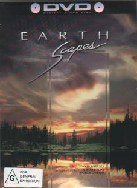

_This review was written by me for **MichaelDVD**, an Australian DVD review site that is no longer online. A capture of the site is held by the Internet Archive: **[browse it there](https://web.archive.org/web/20220217040146/http://www.michaeldvd.com.au/)**. It is reproduced here from my own copy of the site, as part of the record of what I have written._

## The film

**_EarthScapes_** is a set of time lapse and slow motion cinematography of various landscapes and terrains set to the music of various New Age composers. It is produced, photographed and edited by **David Fortney**. Personally, I thought that titling this "Earth" scapes is a bit ambitious given that the film was entirely shot in the North American continent, but I will resist from making remarks about the myopia and parochial attitudes of Americans.

Since there is no "plot" as such in this feature, I will simply list the following details for each chapter. There is no thematic connection across chapters.

These kind of discs only work well if the audio and video transfer is of "reference quality" because then you can use the DVD as demo disc to show off your home theatre to admiring fans and groupies. Unfortunately, as we will find out, the transfer quality is shockingly poor, barely better than a VHS tape. My suggestion is to avoid buying or renting this disc unless you are mainly interested in the scenery and music and don't care about the quality of the presentation.

## The video transfer

This is a made-for-video feature, presented in the original aspect ratio of 1.33:1 so don't even bother wishing for a 16x9 transfer. I don't even know how to begin in terms of describing how bad the video transfer is. Put it this way, this disc would be a very useful disc to educate someone on how to spot video and film artefacts.

The film itself appears to be somewhat grainy with slightly desaturated colours. It has some dirt and scratches but no major marks. I would rate the sharpness, detail and black levels to be below average.

The video transfer appears to have a number of glitches. I originally started noting the approximate timer locations of these but I gave up after encountering the fifth. Suffice to say you will encounter a video glitch in the transfer ever 5 minutes or so. The transfer itself seems almost designed to show off what video/MPEG artefacts are - I can detect examples of pixelation, colour smearing, posterisation, shimmering (**17:45

## The audio transfer

There is only one audio track on this disc, PCM 2.0 at 48kHz/16 bits resolution. In theory, this should yield CD-like quality but I suspected the audio transfer was derived from video tape as well. The mastering level of the transfer is exceedingly high, definitely higher than any other DVD that I have encountered and at least 6-9 dB ABOVE most CDs. The transfer level is so high I can hear "clipping" in various places on the soundtrack. Interestingly, I hear more clipping if I engage the Dolby Pro Logic decoder than straight stereo.

As the audio track is in 2 channels, the surround channels and sub-woofer are not activated during the presentation.

## The extras

Well, what do you know, there is an extra on this disc. It has some "preview" excepts from another similar DVD entitled "Earthdance". The audio and video transfer of the except is of a similar level of quality (ie. low) as the main feature so I have no compulsion to acquire Earthdance to see what it's like.

The menus consist mainly of scene selections. The top level menu allows you to between select "Continuous Play" and "Random Scene Access ", but on my DVD player the Continuous Play option does not seem to do what it suggests - at the end of the film, the DVD player reverts back to the main menu.

## Region 4 versus Region 1

This DVD is the same the world over and is formatted for NTSC displays.

## Summary

**_EarthScapes_** contains some spectacular cinematography of various landscapes set to some nice New Age music. It is presented on a minimalist DVD with a poor video transfer and equally poor audio transfer. The DVD has no extra features whatsoever.

### [Ratings (out of 5)](../ReviewersGuide/RatingsGuide.html)

© [Chris Tham](mailto:ChrisT@michaeldvd.com.au) (read my [biography](../ReviewerProfiles/ChrisT.asp)) 21 January 2001

| Rating  | Score      |
| :------ | :--------- |
| Plot    | ★★★ 3 / 5  |
| Video   | ★½ 1.5 / 5 |
| Audio   | ★★ 2 / 5   |
| Overall | ★★ 2 / 5   |
