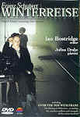

_This review was written by me for **MichaelDVD**, an Australian DVD review site that is no longer online. A capture of the site is held by the Internet Archive: **[browse it there](https://web.archive.org/web/20220217040146/http://www.michaeldvd.com.au/)**. It is reproduced here from my own copy of the site, as part of the record of what I have written._

## The film

This disc is a film "dramatisation" of **Franz Schubert**'s famous song cycle **_Die Winterreise_** (A Winter's Journey) opus 89/1-24, D.911. Of course, I use the word "dramatisation" somewhat loosely, as the individual songs (set to poems by **Wilhelm Müller**) do not really follow a plot but are conceptually and thematically related. Even so, this film version is very abstract, as director **David Alden** chose to portray the journey of the wanderer more as an emotional and mental journey rather than a literal one.

Wilhelm Müller (1794-1827), whose full name is **Johann Ludwig Wilhelm Müller**, wrote the 24 poems of _Die Winterreise_in three stages; each stage of the process was published separately. In 1822 he wrote the first set of 12 poems which was published in _Urania: Taschenbuch auf das Jahr_(1823) as _Wanderlieder von Wilhelm Müller. Die Winterreise_. In 1823 he wrote ten additional poems, which were published in _Deutsche Blätter für Poesie, Litteratur, Kunst und Theatre_. Müller then added two last poems (_Die Post_and _Täuschung_), changed the order of the 24 poems, and the complete cycle was published in 1824 in _Gedichte aus den hinterlassenen Papieren eines reisenden Waldhornisten II: Lieder des Lebens und der Liebe_ (Poems From The Posthumously Left Papers Of A Travelling French Horn Player).

**Franz Schubert**discovered Die Winterreise in the _Urania_ publication. He initially set this cycle of 12 poems to music, but only later discovered the 12 other poems which he also set to music. The order of the songs as published by Schubert differs from the order in Müller's _Waldhornisten_ (he kept the initial 12 songs in the _Urania_ order, and then tacked on the remaining 12 in roughly the same order as they were published except he switched the order of _Die Nebensonnen_and _Mut_!). Purists sometimes argue that the songs should be performed in the _Waldhornisten_ ordering rather than in Schubert's ordering, but I am personally quite comfortable with Schubert's ordering.

The unifying themes across all the poems/songs are that of despair and self-pity. We follow a lovesick and broken-hearted man on a cold bleak journey. He recalls his lost love and the memories of spring as he ventures into the winter wilderness. Along the way, he makes observations of things and places that he encounters: a weather vane, a lime tree, a river, a charcoal-burner's hut, a crow, a single leaf in a tree, a postman, an inn in a village. Finally, in the last song, the traveler meets up with an organ-grinder. In describing the organ-grinder, the traveller realises that he is describing himself: a broken man, turned away by the world, standing off from everyone else, pretty much a social outcast, but continuing to grind away at the organ of life.

Schubert composed the music to Winterreise towards the end of his life, and some say that the text of the poems mirrors Schubert's own despair as he reflects on the disappointments in his love life, his feeling of being an outsider, the pain caused by the withdrawal of public support, and the growing realisation that the end of his life is approaching (he suffered from syphillis).

Over the years, _Die Winterreise_ it has been performed many times by some of the world's greatest singers. Indeed, there have been over 140 recordings made of this work by singers such as **Hans Hotter**, **Herman Prey**, **Gérard Souzay**, and **Peter Schreier**. The famous baritone **Dietrich Fischer-Dieskau**was so enamoured of it he recorded 10 different versions. This very credible performance is by up-and-coming tenor **Ian Bostridge**accompanied by pianist **Julius Drake**.

There's even entire web sites on the Winterreise:

- [www.gopera.com/winterreise](http://www.gopera.com/winterreise/) by Margo Briessinck.
- [stumac39.music.temple.edu/schubert](http://stumac39.music.temple.edu/schubert/) by Ryan Griffin.

Each song in the cycle is separated into it's own chapter:

This dramatic performance was recorded and shot in a studio. The production and creative team (tenor **Ian Bostridge**, pianist **Julius Drake**, director **David Alden**, and designer **Ian MacNeil**) originally considered using a disused psychiatric hospital on the outskirts of London, but eventually decided to "recreate" the look and feel of the hospital in a soundstage.

Instead of portraying the imagery (weather vanes, meadows, lime tree, crow etc.) of the poems literally, David Alden has chosen to film the "wanderer" of the songs/poems as a psychotic, near suicidal man in an empty desolate room, tormented by his lovesickness and despair. The imagery of what he is singing is all in his mind. As he sings, ghostly images his ex-lover and her family revolve around him, and he seems to be singing to a mock "Schubertiad" consisting of them. Then we accompany him to a mental journey into the "White Void" as he sings against a background of pure white. Finally, in the last few songs, he returns back to the empty room, but it has changed reflecting his own emotional change.

Personally, I found this production somewhat disturbing. The Gothic, abstract look is no doubt stylish and innovative, but I think I would have strongly preferred a more literal interpretation. Call me naive, unsophisticated, even Phillistine if you like, but I think a more literal interpretation would have looked a lot better on DVD and made it easier to understand the text of the songs/poems.

## The video transfer

Both the main feature and the accompanying featurette are presented back-to-back on a single DVD title. They are presented in a 15:9 aspect ratio (1.66:1) with no 16x9 enhancement. I had mixed feelings about the lack of 16x9 enhancement - since my projector has native 16:9 panels I would have preferred the use of 16x9 enhancement (and creating black bars on the left and right sides of the screen) but the increase in resolution is not significant enough, and is outweighed by possible artefacts caused by anamorphic downconversion on 4:3 displays.

The main feature itself seems to have only average sharpness, but compensates by having superb detail (including shadow detail). An example of the detail present on this DVD is that occasionally the texture of the white wall behind Ian Bostridge can be resolved during the "White Void" scenes - thus shattering the illusion that Ian is performing in a white void.

Use of colour during the main feature seems quite subdued, perhaps intentionally. The "White Void" scenes suffer from slight over-exposure and colour bleeding. The featurette has better colour saturation but is still under-saturated.

Given that over 2 hours (the combined total running time for the main feature and featurette is **124:35**) have been compressed into a single layer, the number of MPEG artefacts are surprisingly small - mainly limited to slight posterisation (evident on the left hand side of the screen around **10:30**), some halo'ing due to edge enhancement (particularly in the White Void scenes), and minor aliasing during the featurette. I did not notice any film artefacts apart from what looked like either grain or low level video noise at the beginning of the first song.

The main feature comes with optional English subtitles (representing the lyrics to the songs). The featurette has optional English, French and German subtitles. I watched both the main feature and featurette with English subtitling on. The proce

## The audio transfer

This disc only has one audio track, Dolby Digital Stereo (2.0) encoded at a bitrate of 192 Kbps. The songs are sung in German, but the accompanying featurette is in English.

Despite the relatively low encoding bitrate (I would have preferred at least 256 Kbps), the quality of the audio track is superb. I can clearly hear every syllable enunciated by Ian, and the piano tone is subtle and realistic. The stereo soundstage is also superb and does not sound two-dimensional at all.

In fact, I would be tempted to say the audio track is of reference quality except that very occasionally I detected some high frequency sibilance that sounded suspiciously like clipping. I am no sure whether this is actually caused by clipping or the result of a compression artefact.

Obviously, there is no activity from the subwoofer or surround speakers due to the stereo track.

If I had my choice, I would have still preferred an uncompressed PCM stereo track, which would have entailed authoring a double layered disc.

## The extras

This single layer (DVD-5) disc is pretty much fully packed (4.2 Gb worth of data) by the inclusion of a 51 minute documentary in addition to the main feature, as well as minor DVD-ROM extras.

### Menu

The menus are 4:3 static and are non-16x9 enhanced. Incidentally, [MichaelD](mailto:MichaelD@michaeldvd.com.au) reported that he had problems turning the English subtitling off using PowerDVD. I was able to turn subtitling on and off successfully on both my DVD player and on WinDVD, so I suspect this is probably a PowerDVD "bug". However, the menu is somewhat idiosyncratic and non-intuitive in this respect - there is a "trick" to enabling/disabling subtitles which is only obvious if you understand a little bit about DVD authoring and the thought processes of a programmer!

Basically NVC/Warner has chosen to author the DVD so that both the main feature and the featurette are combined into a single DVD title. However, the main feature only includes an English subtitle track but the featurette has three subtitle tracks (English, French, German). Therefore, when you enable a particular subtitle track, you then have to select the corresponding part of the title (_Winterreise_, or _Over The Top With Franz_).

In fact, the menu kind of prompts you to do this: for example, if you select the English subtitle track for _Winterreise_(the menu item on the LEFT side), the menu will then highlight the _"Winterreise"_menu item. If you then press the ENTER key, then the main feature will begin to play with English subtitling, as requested. Similarly, if you select a subtitle track on the RIGHT side of the menu, you should then press ENTER whilst the menu highlights the _"Over The Top With Franz"_menu item to begin playing the featurette with subtitling enabled.

Confused yet? But wait, there is more! If you do select a subtitle track, DO NOT navigate back to the main menu to select PLAY/RESUME because then the menu will "forget" that you have made a subtitle track selection (actually, I think the logic is that it assumes you have cancelled your subtitle selection as you have not confirmed by selecting the appropriate feature to play).

If you select "Subtitles off" (the icon on the BOTTOM LEFT of the screen) then the menu does take you back to the main menu, allowing you to select PLAY/RESUME. To add to the confusion, the Subtitle selection button on the remote is disabled during the main feature, but enabled during the featurette!

So it all kind of makes sense, but it could have been far simpler if they had just authored the main feature and the featurette as separate DVD titles!

### Booklet

This multi-lingual (English, French, German) booklet contains the chapter titles, cast and crew biographies, and lyrics to the songs (in German).

### Listing-Cast & Crew

This is just a single still listing the cast and crew behind the production of the film.

### Featurette - _Over The Top With Franz_(50:47)

This is a fairly watchable "making of" documentary, starting with an excerpt from a recital performance of _Die Winterreise_performed by Bostridge and Drake. Then we see the pair being introduced to director David Alden, whose background is actually operatic direction. The featurette is a fascinating and insightful "window" into the collaborative process between the director and the two musicians as they discuss and even argue various options for interpreting and dramatising the work. I didn't realise how much influence the director had even over the musical interpretation and to the credit of Ian and Julius they did not seem to resent this in the slightest.

When he is not acting all Gothic and homicidal, Ian actually looks quite cute, in a fresh and scrubbed English schoolboy kind of way. Despite initial reservations, Ian seems to participate quite enthusiastically in exploring various ways of interpreting the work. Julius seems more uncomfortable with the process, but as he doesn't feature prominently in the film I think he decided not to make a fuss.

### DVD-ROM Extras - Libretto, Web Link

This consists of the lyrics of the songs (plus translations into English, Spanish, French and Italian) in several formats: HTML, Microsoft Word document and text file. The HTML pages also links to the NVC Arts web site when you click on the NVC Arts logo.

## Region 4 versus Region 1

The disc is multi-region coded for regions 2-6, and does not appear to be available in Region 1.

## Summary

**_Winterreise_** is an abstract dramatisation of **Franz Schubert**'s song cycle based on the poems of for **Wilhelm Müller**. **Ian Bostridge**and **Julius Drake**delivers a very credible and attractive interpretation, however I am not sure I agree with director **David Alden**'s vision and approach.

It is presented on a DVD with an above-average video transfer and a superb audio transfer. The extras are mainly an accompanying "making of" featurette which I found quite enjoyable, and song lyrics (including translations) on DVD-ROM.

### [Ratings (out of 5)](../ReviewersGuide/RatingsGuide.html)

© [Chris Tham](mailto:ChrisT@michaeldvd.com.au) (read my [biography](../ReviewerProfiles/ChrisT.asp)) 25 February 2001

| Rating  | Score        |
| :------ | :----------- |
| Plot    | ★★★★ 4 / 5   |
| Video   | ★★★½ 3.5 / 5 |
| Audio   | ★★★★ 4 / 5   |
| Extras  | ★★½ 2.5 / 5  |
| Overall | ★★★½ 3.5 / 5 |
