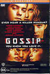

_This review was written by me for **MichaelDVD**, an Australian DVD review site that is no longer online. A capture of the site is held by the Internet Archive: **[browse it there](https://web.archive.org/web/20220217040146/http://www.michaeldvd.com.au/)**. It is reproduced here from my own copy of the site, as part of the record of what I have written._

_2000 · directed by Davis Guggenheim._

## The film

I still haven't decided yet whether I like _**Gossip**_. The premise is quite good - three college roommates attending a communications class decide to start a malicious false rumour just to see how far and fast it spreads - and how much embellishment it will accumulate. When the victim of the rumour starts believing in it herself the situation turns ugly.

However, the execution of the premise together with the "surprise" ending is somewhat flawed and problematic. I do like the pace of the film - it is well-directed and in the general the acting is uniformly strong.

Cathy Jones (**Lena Headey**), Derrick Webb (**James Marsden**) and Travis (**Norman Reedus**) are three roommates that seem to have little in common with each other but are close friends nevertheless. Cathy is bright, studious and has a secret crush on independently rich, handsome and natural born liar Derrick. Travis is a poor art student who likes creating photo montages (I wonder how he can afford those fancy digital film scanning and editing equipment and those industrial grade design printers!). They share lodgings in Derrick's ultra chic apartment loft and occasionally attend communication lectures given by the supercilious Professor Goodwin (**Eric Bogosian**) — when they are not drinking or hanging out in nightclubs.

One day, they decide to start a rumour that rich bitch Naomi Preston (**Kate Hudson**) slept with Beau Edson (**Joshua Jackson**) in a bedroom on top of a nightclub (How many nightclubs do you know that have upstair bedrooms? With three projectors displaying pictures on the walls?). As Naomi has a reputation for being chaste, the rumour spreads like wildfire. Problem is: Naomi was passed out at that time and when the rumour reaches her ears, she thinks she must have been raped and decides to press charges.

Cathy feels really guilty and wants to confess - but once a rumour has started it's not that easy to squash it. Then we discover that at least one of the main characters has a dark past and is not quite the nice but harmlessly mischievous person that we are initially led to believe ... As I've mentioned before, the film features a "twist" ending that may surprise you, unless of course you have a warped mind like mine and you saw it coming ages ago.

Personally, I found the ending unsatisfying and inconsistent with the rest of the film - even though it did occur to me about halfway through the film. It doesn't sit well with the psychological profile and motivation of some of the characters, and significantly dilutes the original premise that malicious gossip can be really harmful. However, make up your own mind when you watch it.

_Trivia_: Fans of _Blade Runner_ will be pleased to know **Edward James Olmos** ('Gaff') reprises his role as a noirish detective (Detective Curtis).

## The video transfer

This is an excellent video transfer, presented in a widescreen aspect ratio of 2.35:1 with 16x9 enhancement.

Sharpness, detail and colour saturation are basically reference quality. And the contrast in most part (apart from **12:59-13:01**) is extremely good - indeed, this transfer features extremely deep, satisfying black levels (owners of LCD video projectors will know that these projectors tend to display black as dark grey so getting good black levels is an unusual treat). The downside of the good black levels is mediocre low level detail. This transfer tends to exagerrate contrast causing a lot of shadow detail to be blended into black.

The film source is extremely clean, as you would expect from a recent release. There is virtually no evidence of grain, apart from a brief scene in **73:40-73:49** where some grain is visible (this may be due to digital sharpening, as the commentary reveals that the director decided to choose a take where the camera focus was not perfect because **James Marsden**'s performance was so good) This disc has very little in the way of film-to-video artefacts, apart from some moire effects in the brickwork in **44:05-44:07** and also in the lamp shade at **49:39**.

This disc somes with one subtitle track, English for the Hearing Impaired. I turned it on for a substantial part of the film. It is not 100% accurate, but is reasonably close enough to be acceptable.

This is a single sided dual layer disc (**RSDL**). Congratulations to Village Roadshow - they have managed to achieve a near-miracle in DVD authoring - a mid-scene layer change that is unnoticeable - almost. The first 2-3 times that I watched the film I simply could not spot where the layer change has occured and I had to resort to cheating - I had to read Anthony C's review on the DVDPlaza web site to find out exactly where the layer change is. And even then, I had to pay full attention, otherwise I would miss it. For those of you dying to know, the layer change occurs in Chapter 16 at **49:46** just after Derrick has spoken and the screen freezes for a split second on Travis.

## The audio transfer

There are two audio tracks on this disc, an English track encoded in Dolby Digital 5.1 at a bitrate of 384 Kb/s as well as an English commentary track encoded in Dolby Digital 2.0 surround (192Kb/s).

The English audio track is more than satisfactory. The dialogue is clear (apart from a couple of minor instances where the actors have mumbled lines) and there are no obvious audio missyncs (even during the party scene where Derrick's girlfriend's voice was over-dubbed).

When I read on the DVD packaging that the film features "... a hip, alternative soundtrack featuring **Propellerheads**, **Hednoize**, **Curve** and **Tonic**" I was almost afraid the music will be mixed in at too high a level and completely overwhelm the dialogue, but thankfully this did not happen. In fact, if anything the music in the soundtrack sounds quite restrained and very much mixed into the background.

This is a very dialogue-focused film, so the surround speakers are mainly used for music and ambience - and the subwoofer is rarely used (mainly to support the low end). Despite that, I was happy with the soundtrack - the use of the surround speakers are well integrated into the overall mix.

## The extras

I quite like the collection of extras found on this disc, but the video transfer for most of the extras leave a lot to be desired. Also, I didn't like the way some of the extras were concatenated onto a single title with no chapter breaks separating them.

### Menu

The menus are static but look pretty cool nevertheless. They do come with 16x9 enhancement, and are refreshingly Australianized (including a reference to the [www.village.com.au](http://www.village.com.au) URL).

### Dolby Digital Trailer-_Rain_

I have never seen this trailer before, and it's pretty cool, featuring droplets of water merging in mid-air and very directional panning of sound effects.

### Biographies-Cast, Listing-Cast and Crew<em></em>

This is a still listing the cast and crew. It links into separate stills listing other films featuring **James Marden**, **Joshua Jackson**, **Lena Headey**, **Kate Hudson**and **Sharon Lawrence**.

### Audio Commentary-_Davis Guggenheim (Dir) & James Marsden (Actor)_

This is a fairly interesting and listenable audio commentary. James is on the left speaker and Davis is on the right.

The pair is reasonably talkative and chatty, and reveal interesting tidbits such as the film being shot in Toronto but made up to look like "New York" city, the voice of the girl that Derrick was kissing was replaced by that of the director's wife to make her sound more "sexy", and even a goof or two towards the end.

The director even comments on the "over-the-top" nature of the beginning of the film - he wanted it to deliberately look more like a fantasised hyped-up image of college life to contrast it with the much darker tone of the second half of the film.

### Deleted Scenes-5 (11:30)

This contains a number of deleted scenes and unedited footage. Unfortunately, these have all been concatenated into a single title with no chapter breaks so you cannot easily navigate into each scene. All scenes are presented in 2.35:1 aspect ratio but with no 16x9 enhancement. The video transfer quality of the scenes is extremely poor, no better than VHS. The scenes have various frame counters and timers embedded in them, some have a big caption "Property of Warner Bros" emblazoned across them (just in case we were thinking of ripping them off and posting them on the Internet, I suppose), and others have the shooting date as the caption.

We start off with three deleted scenes removed to tighten the pace of the film. I agree that they are pretty optional in terms of the storyline:

1. Travis films Jones talking about the last time she heard the rumor they started and how it has changed.
2. Travis paints over a picture of Beau on his collage while explaining what roles Travis, Derrick and Jones play in the twisted game they have created.
3. Derrick runs into Detective Curtis and tells him more lies before the detective asks Derrick about a picture of Naomi which was stolen from her room.

Then we get the original unedited footage of Naomi and Beau making out in the bedroom above the party. Is it just me, or is this extremely boring and non-gratifying?

Finally, we get another deleted scene in which Derrick calls his parents and tries to ask them for help but they cruelly deny him. This scene was cut because the director didn't want the audience to have sympathy for Derrick (too bad, because the commentary reveals how the director asked actor **James Marsden**to milk maximum sympathy from the audience).

_Trivia_: Originally director **Davis Guggenheim**'s parents **Marion**and director **Charles Guggenheim**did the voices for Derrick's parents but unfortunately their voices can't be heard on the scene.

### Theatrical Trailer (2:01)

This is presented in 2.35:1 with 16x9 enhancement. It exhibits a moderate amount of grain in comparison to the main feature and the audio track is Dolby Digital 2.0

### Alternate Ending (2:57)

_Warning: spoiler ahead!_ An extended version of the ending has Jones and Travis leaving Derrick alone in his loft when he is approached by a stranger who identifies himself as the man who arrested Derrick when he was in high school and he tells him that Naomi is now pressing charges using the video-tape of Derrick admitting that he raped her. I found this ending even more annoying than the normal one. This is presented in 2.35:1 aspect ratio without 16x9 enhancement (together with running frame counter and shooting date). The video transfer quality is quite poor, similar to the quality of the deleted scenes.

### Travis's Gossip Interviews (4:38)

This features various interviews (edited and interleaved with each other) of other students discussing the Naomi/Beau "incident" and is supposedly shot by Travis on a video camera. Not surprising, the video transfer quality is low, and the interviews are presented in full frame (4:3).

### Grab Bag-Music Videos, Featurettes (10:35)

This features a mix of music videos and montage scenes, all presented in various aspect ratios with no 16x9 enhancement. Again, the items have all been concatenated into a single title with no chapter breaks so you cannot easily navigate into each item. The audio track is encoded in Dolby Digital 2.0 with the surround flag turned on. _Poe's Music Video (_Our Lips Are Sealed<em>)</em> This is presented in 2.35:1 letterboxed and the video transfer is extremely poor (sub VHS quality). _Tonic's Music Video (_Mean to Me<em>)</em> This is presented in 1.85:1 letterboxed. The video transfer is much better than the previous item. _The Gossip Montage Shot Test_ This features someone reading various lines used in the "gossip montage" sequence in the film. It is presented in 2.35:1 letterboxed (plus the "Property of Warner Bros" caption and the frame counter) and the video transfer is back to VHS quality. _The Gossip Montage Extended Version_ This is an extended version of the "gossip montage" sequence used in the film. It is presented in 2.35:1 letterboxed (plus the caption displaying the shooting date and the frame counter) and the video transfer is VHS quality.

## Region 4 versus Region 1

The Region 4 version of this disc misses out on;

- French audio and subtitle tracks

The Region 1 version of this disc misses out on;

- ( Possibly) Dolby Digital Rain Trailer

I would say both versions appear to contain pretty much the same features.

## Summary

**Gossip**, is an interesting film with a great premise that unfortunately (for me) has a "surprise" ending that didn't quite go down well. It is presented on a very well put together DVD with an excellent video transfer, a more than acceptable audio transfer, and a good collection of extras. Unfortunately, the extras are let down by poor video transfers.

| Rating  | Score         |
| :------ | :------------ |
| Plot    | ★★★ 3 / 5     |
| Video   | ★★★★½ 4.5 / 5 |
| Audio   | ★★★½ 3.5 / 5  |
| Extras  | ★★★★ 4 / 5    |
| Overall | ★★★★ 4 / 5    |
