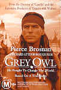

_This review was written by me for **MichaelDVD**, an Australian DVD review site that is no longer online. A capture of the site is held by the Internet Archive: **[browse it there](https://web.archive.org/web/20220217040146/http://www.michaeldvd.com.au/)**. It is reproduced here from my own copy of the site, as part of the record of what I have written._

## The film

**_Grey Owl_** is based on the real-life biography of **Archie Grey Owl** (played by Mr. 007, **Pierce Brosnan**) - a member of the Ojibway Indian tribe who worked as a trapper and a guide in the Canadian wilderness. However, Archie eventually gave up killing beavers for fur, became a forest ranger and started writing books and giving lectures on the Canadian north. He talked about the need for balance between civilization and nature and awoke a concern for preserving the environment in an era (1930s) when the word 'conservationist' probably didn't even exist. He gained international recognition through his books and lectures and in his lifetime became the most well-known Red Indian in the world.

However, there is one small, teensy-weensy, tiny little problem - **Archie Grey Owl** is a fake. Not only was he not born an Ojibway Indian (or even a part-Apache as he later claimed), he did not have a single drop of Red Indian blood in his veins. He was born Archibald Belaney in Hastings, England in 1888. He emigrated to Canada in 1906 and took the name of Grey Owl.

Just in case you think I have revealed a massive plot spoiler - relax. Archie's "secret" is revealed in the opening scenes of the film, and the rest of the story is a flashback of Archie talking about his life story to the reporter who uncovered his real past.

They say that behind a great man is a great woman ... and Archie's story is no exception. The film deals with Archie's relationship with Anahareo (nicknamed "Pony") - an attractive, "town-bred’’, half-blood Mohawk working as a waitress in Temagami. Pony (played by **Annie Galipeau**) is intrigued by Archie's clean and simple lifestyle and wants to rediscover her own heritage. Archie at first pretends that he finds her a nuisance but gradually falls in love with her. Pony was responsible for many of the turning points in Archie's life - she convinced him to stop trapping and to write and lecture instead. She also sowed the seed of his conservationist "message".

The film conveniently glosses over some of the less pleasant aspects of the real Archie - his drinking binges and bigamy. However, there is no denying the soundness of his plea for preservation nor his powerful charisma.

Directed by **Richard Attenborough** (director of _Gandhi_ and executive producer of _Dances with Wolves_), **_Grey Owl_** has interesting parallels with both those films. Like _Gandhi_, **_Grey Owl_** is a film based on the true story of a man with a powerful vision. Both films are structured with a circular storyline - an ending that ties back to the opening scene.

Like the real Archie, the film is somewhat flawed but its strengths overcome its weaknesses. I quite enjoyed the film, especially the part where he visits his aunts (**Renée Asherson** as Carrie Belaney and **Stephanie Cole** as Ada Belaney) in his hometown in England and we get to see the genesis of his adult life.

## The video transfer

I suppose every DVD reviewer at one stage in his or her life will encounter a pan & scan transfer, even though 16x9 enhanced widescreen transfers are thankfully becoming more and more the norm these days - this is the first DVD I've had to review in a pan & scan format. It's funny - before I started watching DVDs I was perfectly comfortable watching pan & scan movies on broadcast TV. Now that I know what I've been missing all these years, I find pan & scan transfers intensely annoying (to the point that I can no longer watch movies on TV), and this one is no exception.

The DVD has been released by an independent distributor, and I suspect that they probably lack the resources to commission a new widescreen telecine transfer, so the video has probably been sourced from a transfer intended for use on broadcast TV.

The film starts off 2.35:1 letterboxed to accomodate the opening credits, then reverts to 1.33:1 pan & scan for the rest of the film, before ending with the closing credits displayed in 2.35:1 letterboxed again. This is pretty standard practice for pan & scan movies shown on TV, and I encountered the usual issues with pan & scan - including characters shown with half their faces cropped off (notably around **11:45**-**12:26**) and characters coming alternately into and out of frame.

Apart from the annoyance of pan & scan, the transfer is actually not too bad. It is just a little bit soft, but features reasonable colour saturation.

The film source is reasonably clean of marks, apart from a black mark at **17:01**. Medium level grain is present occasionally in some scenes, particularly in low-light conditions but otherwise grain is not an issue. The transfer is relatively devoid of artefacts (apart from a minor video glitch at **15:41**).

The film is mastered somewhat unusually on this single sided double layered disc (**RSDL**) - instead of mastering the feature as a single title spanning two layers (with a layer change inserted at some point in the title) the DVD is mastered as two titles of exactly the same length (**56:36**) - one on each layer - and joined together using seamless branching. Instead of a freeze frame during a layer change, we get a completely blank screen. Fortunately, this happens in between scenes, but it left me with a sneaking suspicion that part o

## The audio transfer

Given that the DVD has been released by an independent distributor, I would have expected the audio transfer to be somewhat substandard, but I was pleasantly surprised. There is only one audio track, in Dolby Digital 5.1 soundtrack encoded at 448 Kb/s (not "5.1 and 2.0 sound" as stated on the packaging).

This is pretty much a near reference quality audio track, and sounds very full bodied, yet crisp and detailed. There is a minor audio dropout in Title 6 (the second half of the film) Chapter 5 at **24:46** (or around **81:17** into the film) - there is a brief period (roughly 1 second) where the background hiss disappears. Fortunately this dropout occurs during a silent part of the film so we're not missing any dialogue or sound effects.

The dialogue was pretty easy to understand most of the time, which is good since the disc does not contain any subtitle tracks. There were no audio sync problems.

The surround speakers are engaged mostly for music, but I did get a nice, satisfying enveloping ambience for most of the film.

The original music score by George Fenton sounds rather lush and symphonic, with a hint of ethnicism in the melody carried by the flutes, and seems to be well spread across the five main channels at all times. I think the "epic soundtrack" nature of the music suits the film rather well and the music played over the closing titles is suitably grand and moving.

As there are not much low frequency content in the soundtrack (limited to plane engines and the occasional 'thump' from the orchestra), the subwoofer is very rarely engaged.

## The extras

For an independently produced DVD, I was surprised to find extras (mainly featurettes and trailers) plus menu animation and audio. However, the featurettes have an "unfinished" feel about them, almost as if they are source material waiting for an editor to put together into a documentary.

### Menu

The main menu features animation and audio, and is presented Full Frame. The sub menus are static but include audio.

### Featurette (5:23)

This is an extremely short promotional featurette featuring excerpts from the film, on-location shots and interviews with:

- **Pierce Brosnan** ("Grey Owl")
- **Richard Attenborough** (Director/Producer)
- **Donald Smith** (Author of _"From the Land of Shadows"_)
- **Jake Eberts** (Producer)
- **Annie Galipeau** ("Pony")

The featurette is presented in Full Frame format (apart from excerpts from the film which are presented at 1.85:1 letterboxed) with Dolby Digital 2.0 audio.

### Featurette - Inside Interviews (9:13)

This features edited excerpts of interviews (bits of these were used in the promotional featurette above) with:

- **Pierce Brosnan** ("Grey Owl")
- **Annie Galipeau** ("Pony")
- **Richard Attenborough** (Director/Producer)
- **Jake Eberts** (Producer)
- **Donald Smith** (Author of _"From the Land of Shadows"_)

Each interview is in a chapter of its own, and in addition the menu allows direct access to each chapter. Interestingly, we are provided with a synopsis of the topics covered in each interview. The topics for Pierce Brosnan, for example are:

1. Grey Owl
2. A Wonderful Role
3. Meeting Pony
4. Grey Owl's Popularity
5. Richard Attenborough
6. The Pow-wow
7. The Film's Timeliness

The featurette is presented Full Frame with Dolby Digital 2.0 audio.

### Featurette-Behind The Scenes Footage (8:55)

This is a montage of on-location footage of various scenes, particularly the scene featuring Grey Owl's return from his lecture tour of England, various by-the-river scenes, the pow-wow scene, the first lecture and the wedding scene. It is presented in Full Frame format with Dolby Digital 2.0 audio.

### Theatrical Trailer (2:07)

This is presented in an aspect ratio of 1.85:1 without 16x9 enhancement and with Dolby Digital 2.0 audio. Compared to the transfer of the film, the video transfer is a bit softer.

### Trailer-_Girlfight_ (2:26)

This is presented in 1.33:1 (pan & scan?) with Dolby Digital 2.0 audio.

## Censorship

As far as we have been able to ascertain, there are no censorship issues with this title.

## Region 4 versus Region 1

The Region 4 version of this disc misses out on;

- **2.35:1 transfer with 16x9 enhancement**
- **Commentary by director Richard Attenborough**
- **Commentary by producer Jake Eberts**
- Additional Theatrical trailers and TV spots
- 2 Vintage Short Films With the Real **Grey Owl** (1934/1936)
- Grey Owl Trivia Game
- DVD-ROM Features

The Region 1 version of this disc misses out on;

- Pan and scan transfer

Looks like the clear winner is the R1 version, which I am strongly tempted to buy now that I have seen the R4 version.

## Summary

**Grey Owl**, for me, was a watchable film based on the true story from director/producer **Richard Attenborough**, though it is not the masterpiece that Gandhi was. Unfortunately, it is presented with a pan & scan video transfer. The audio quality is excellent. The extras look a bit "unfinished" and fall far short of the features present on the R1 version.

### [Ratings (out of 5)](../ReviewersGuide/RatingsGuide.html)

© [Chris Tham](mailto:ChrisT@michaeldvd.com.au) (read my [biography](../ReviewerProfiles/ChrisT.asp)) 29 April, 2001

| Rating  | Score        |
| :------ | :----------- |
| Plot    | ★★★½ 3.5 / 5 |
| Video   | ★★½ 2.5 / 5  |
| Audio   | ★★★★ 4 / 5   |
| Extras  | ★★½ 2.5 / 5  |
| Overall | ★★★ 3 / 5    |
