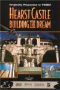

_This review was written by me for **MichaelDVD**, an Australian DVD review site that is no longer online. A capture of the site is held by the Internet Archive: **[browse it there](https://web.archive.org/web/20220217040146/http://www.michaeldvd.com.au/)**. It is reproduced here from my own copy of the site, as part of the record of what I have written._

## The film

In 1997, we drove the scenic Highway One from Los Angeles to San Francisco as part of our vacation in the USA, and we stopped by at San Simeon to have a look at Hearst Castle, which I have heard so much about. Unfortunately, we arrived just before 5pm only to find out the last castle tour of the day left a few minutes ago and they did not permit unescorted visits to the castle. Bitterly disappointed, all we could do was watch the tour mini-bus slowly making it's way up to the castle from the visitor's centre and we also looked at some of the exhibits in the little museum inside the centre.

Needless to say, I was really looking forward to this DVD as a way of satisfying my curiousity regarding the castle. I was hoping to be taken on a virtual tour of the whole castle accompanied by commentary explaining the significance of each room and pointing out major items of interest.

Well, if you are like me, be prepared to be disappointed. For a documentary running less than 40 minutes, less than half of it (barely 15 minutes) is of the castle itself. And even then they don't bother to show more than a relatively small part of the castle: just a few rooms, balconies and the outdoor Romanesque swimming pool.

The first half of the documentary is all about George Hearst and how he came to make his fortune (from silver mining, the proceeds of which he used to kick-start his publishing empire), young William as a boy doing a Grand Tour of Europe with his mother, a little bit about his career, and how he built the castle in the latter half of his life with the help of his architect Julia Morgan. All this is done in "pseudo-documentary" style with a half-hearted attempt at pretending it is being narrated by the pilot of the plane that brings daily supplies (including a full complement of all the newspapers) to the castle, explaining the history of the castle to his young co-pilot.

The narration and story-line seem to be just excuses to allow the film makers to do what they really wanted to do: which is to provide "eye-candy" to IMAX audiences through stunning fly-overs of picturesque scenery of the Sierra Mountains, the Californian coastline around San Simeon, plus various areas of Great Britain, Venice (I recognised St. Mark's Square, the Doge's Palace and the Bridge of Sighs) and a few other European locations. By comparison, I suppose, mere close-ups of the castle itself would not have been as impressive.

The second half of the documentary, showing us the castle itself, consists of several fly-bys over the castle together with shots of the swimming pool and a mini-reenactment of one of William's parties, accompanied by an over-"gushy" narration and voice-over from a "guest" of the party - a Hollywood starlet of some sort who eventually became Phoebe Apperson Hearst.

In summary, nice scenery, pity about the (lack of) content.

## The video transfer

This is a relatively clean and decent transfer, quite free of both film and MPEG artefacts. It is presented in a "full-frame" aspect ratio (4:3) from 70mm film (presumably shot with no matting). The sharpness and detail are above average, reflecting the good quality of the film source.

The only artefacts I can detect are a slight case of telecine wobble during the opening titles, some "posterised" trees in **27:47** and some of the scenes look just a little bit soft and defocused (notably the fly-by over a Scottish castle at the beginning of Chapter 4). Colour saturation is deep and richly satisfying, with acceptable shadow levels.

The English subtitles were fairly accurate and tend to follow the narrative closely.

Given th

## The audio transfer

There is only one audio track, in English, which is encoded in Dolby Digital 5.1 at a bitrate of 384Kb/s. The audio quality of the track is good, but nothing to crow about.

Dialogue is clear at all times, and directed mainly towards the front centre speaker. The surround speakers are mostly used for reproducing the ambience of the accompanying music, and there are not many audio effects (although these are suitably directional).

There are no audio synchronisation issues with this DVD. The subwoofer is very occasionally used to enhance to low freqency components of the soundtrack.

## The extras

Upon insertion, this DVD displays a copyright, followed by a Slingshot promo trailer which then leads into the main menu. There is a menu item labelled "Visit the WWW" - this only seems to work if you installed the Interactive PC-Friendly software on a PC with a DVD-ROM drive.

### Trailers

This seems to be a collection of IMAX trailers, organised as a single title (No. 3) lasting for 10:43 minutes broken into multiple chapters:

- Grand Canyon: The Hidden Secrets
- Yellowstone
- Hidden Hawaii
- Whales

Surprisingly, each trailer is divided into two chapters so that I could randomly access the middle of each trailer if I really wanted to. Each trailer is preceded by a "Slingshot" logo.

I found the trailers quite watchable, as they seem to consist of highlights from various IMAX films and they are reasonably well spliced together to almost create a "mini-IMAX" film (if only they would just get rid of the Slingshot logos in between trailers).

The video transfer is quite good (apart from rather bad aliasing/blockiness of the feature titles particularly for Grand Canyon and Whales). The audio transfer quality is rather poor and sounds "tinny" and slightly distorted at times.

### Scene Selection Animation

The chapter selection menu screens plays the opening few seconds of each chapter as thumbnails in the menu.

### DVD-ROM content

This basically consists of the Interactive PC-Friendly program, plus some basic information on other Slingshot titles.

## Region 4 versus Region 1

This DVD is the same the world over and is formatted for NTSC displays.

## Summary

**_Hearst Castle: Building The Dream_** is a short, fairly watchable documentary on the history leading to the construction of the castle and brief introduction to the castle, but it does not substitute for actually visiting the castle. It has impressive cinematography, but those of us expecting a more extensive tour of the castle will be bitterly disappointed. It is presented on a DVD with an more than acceptable video and audio transfer but limited extras.

### [Ratings (out of 5)](../ReviewersGuide/RatingsGuide.html)

© [Chris Tham](mailto:ChrisT@michaeldvd.com.au) (read my [biography](../ReviewerProfiles/ChrisT.asp)) 20 January 2001

| Rating  | Score       |
| :------ | :---------- |
| Plot    | ★ 1 / 5     |
| Video   | ★★★★ 4 / 5  |
| Audio   | ★★★★ 4 / 5  |
| Extras  | ★ 1 / 5     |
| Overall | ★★½ 2.5 / 5 |
