_This article was published on my own website at `users.bigpond.net.au/christie/`, which no longer exists. A capture of the original is held by the Internet Archive: **[read it there](https://web.archive.org/web/20040510100524/http://www.users.bigpond.net.au/christie/HTPC/htpc.html)**. It is reproduced here from my own copy of the site, as part of the record of what I have written. The eight component notes it links to were separate pages on the same site; those links now point at the Internet Archive’s copies._

## 1.0 Introduction

Some of you may have noticed that I review DVDs on [MichaelDVD](http://www.michaeldvd.com.au) using a "Custom HTPC." Given that I already own three DVD players (a Panasonic DVD-RP82, a Pioneer DV-626D and a Sony DVP-S336), why did I choose to use a HTPC and what advantages does it have over "set top box" or dedicated DVD players?

### 1.1 What is "HTPC"?

A Home Theatre Personal Computer ("HTPC") is a PC specifically designed and built to be part of a home theatre installation.

Some of the functions a HTPC can perform in a home theatre can include acting as:

- A high end (region free) DVD player (with built in audio decoders for most surround formats)
- A CD player playing directly off CDs or as a "music server" storing your entire CD collection on the hard disk
- A digital/analogue TV tuner
- A "digital" VCR ("DVR") that can record analog/digital video and store them on the hard disk
- An analogue/digital tape recorder (plus a recording studio if you want to)
- A DVD/CD recorder that can burn your personal CDs and DVDs
- A "media player" and storage device for all kinds of stuff, including pictures (in various formats), movies (in various formats), music (in various formats) ...
- A "media cataloguer" so you can store details of your DVD, CD, video, vinyl, tape, book collection ...
- A games machine (if you are so inclined or have young/not-so-young children)

A HTPC at the end of the day is also a general purpose computer, so if you want to you can do all your other PC activities like word processing, spreadsheets, financial tracking, web browsing etc. However, I would discourage you from trying to do so. A well designed and built HTPC is intended for specialised activities relating to home entertainment. It may be awkward to use for general purpose computing, and trying to provide general computing facilities may compromise the design.

I will even go as far as to discourage the use of HTPCs for activities like file serving and home automation. You should be able to turn off the HTPC like any other component in your home theatre set-up, or at least put it on stand-by.

### 1.2 Why did I decide to build a HTPC?

I heard through various sources that HTPCs can act as very good DVD players. The main DVD player I was using at the time (and still use) is the Panasonic DVD-RP82. Even though this player is a highly regarded DVD player, it only does NTSC progressive and not PAL progressive. My display device, a Sony VPL-VW11HT projector, will upconvert PAL interlaced but it is not perfect and I was getting tired of the artefacts that it produces (mainly a tendency towards shimmering and slightly fuzzy object edges).

I also wanted to be able to watch and record digital TV, and in particular HDTV. At that time, there were no digital TV set top boxes that will record digital broadcasts, and even now there are no set top boxes that can record HDTV (although apparently the ones with PVR functionality will happily record HDTV streams but won't play them back as HDTV).

I was entertaining the idea of a music server that contained all my favourite CDs that I can play on demand or serve to the other PCs in our house.

Finally, I love tinkering and I just wanted to prove to myself that I _can_ build an HTPC.

### 1.3 Design Goals

Before I started building the HTPC, I had a number of mandatory, highly desirable and optional goals that I wanted to meet. I called these "design goals" because they influenced and constrained many of the decisions I had to make in terms of choice of components or software, and well as capabilities.

In the end, I did not achieve all these goals, but I had a lot of fun trying. Your goals may be different, and lead you to very different design decisions and choices.

_Table 1: Design Goals_

| **Goal** | **Solution** | **Was Goal Met?** |
| :-- | :-- | :-- |
| _1. The HTPC must be as quiet as possible._Ideally, no more noise than a typical DVD player, but certainly not noisier than the projector. | There are many options for building "silent" PCs, and this is almost an art form in itself. | Mostly. My HTPC is probably noisier than the quietest DVD players, but is definitely less noisy than the projector or even the fridge. |
| _2. The HTPC must be as small as possible._Ideally, the same size as a DVD player and the ability to fit into the equipment rack in my home theatre set up. | There are many small form factor cases out there, and "small" motherboard designs such as Micro-ATX and Mini-ITX. | No. I tried using a small form factor case, but it was too noisy and does not dissipate heat well. I'm currently using a mid-sized tower case. |
| _3. The HTPC must have no electrical connection to the amplifier._Our home theatre equipment rack is powered using a dedicated circuit from the mains switchbox in order to reduce interference from other electrical devices in the house, and I don't intend to negate all that by putting a PC in the same circuit or have any electrical cables between the PC and other components (apart from the video projector, which is not on the dedicated circuit). | Practically, this means the HTPC needs to be powered from a different power outlet (not difficult), have a direct video connection to the projector (not difficult), and have an optical Toslink connector to the processor/amplifier (big constraint!) | Yes. Woo hoo! |
| _4. All human interface devices (keyboard, mouse, remote) must interface to the HTPC via wireless connections._There are enough cables cluttering the living room as it is. I did not want to have trail of cables from the sofa to the HTPC. | Lots of wireless devices are now available in the marketplace. | Yes. We use a wireless keyboard and mouse, plus a wireless mouse/remote. |
| _5. Common functions (such as watching DVDs or digital TV) should be very easy to use, and controlled solely from a remote control._The keyboard and mouse should only be required for infrequently used or complex activities. | I ended up using the X10 MouseRemote as the primary user interface device, and programmed DVD, TV and CD playback functions on the remote.. | Yes, for DVD, TV and CD playback. |
| _6. The HTPC should cost no more than typical home electronic components performing similar functions._Practically, this means a budget of around A\$2,000 (the price of a good quality DVD player plus an HDTV set top box). | This means staying away from state of the art components and using "budget" or lower tier components in terms of performance. | Yes. Total cost of building the HTPC (excluding software) is A\$1,747.47. This leaves me enough money for Windows XP and a software DVD player. If you buy the same configuration today, you will pay even less, or get more value for the same amount. |
| _7. The HTPC should look visually pleasing and fit within the overall decor of the home theatre. \|_This means no beige boxes! Specifically, I was looking for something in gold, silver or black to match the other electronic components. | Manufacturers are starting to cater for the HTPC market and producing some nice looking cases. | Partially. I would have preferred something that actually looks like a Hi Fi component. The current case at least blends in with the sofa. |

## 2.0 The Hardware

Here is a brief description of the components that make up my HTPC, my reasons for selecting them, plus other options I considered.

Click on either the Heading or the Image to get more details (including specifications of the component).

### [2.1 Case - Antec Sonata](https://web.archive.org/web/20040725070851/http://users.bigpond.net.au/christie/HTPC/Antec_Sonata.html)

Initially, I went for a small form factor case to meet Goal 2: the Fortunetec KA-907. This is a Micro-ATX case, since I was considering buying a Micro-ATX board. I liked it because the dimensions were small(ish): (HxWxD):90x325x425 mm and it comes with a 200W power supply. Best of all, it can accomodate up to two regular PCI cards and regular peripherals (instead of the expensive "slim" form factor drives).

However, it has no noise suppression, and sounds really noisy. Also, air circulation in the constrained interior is bad, which means the motherboard and CPU runs really HOT (55-60°C)! Also, it has a grey/beige exterior (bleah!)

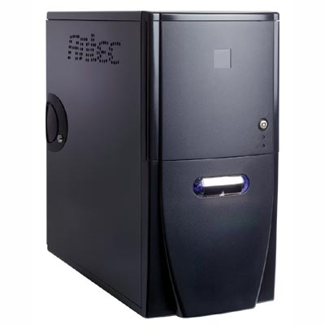The current case I'm using is the Antec Sonata. This case is specially designed to for building low noise PCs. It is a midi-size tower design. I would have preferred a smaller case, but at least this case keeps all the components inside wonderfully cool.

The case itself only generates 20.4 dBA which is pretty quiet. There are only two fans in the case, a single fan in the 380W power supply and a 120mm fan in the rear for air circulation/venting. More importantly, the case has specific features to reduce noise: such as silicon mounted power supplies and fans, and rubber grommets to absorb vibrations from hard drives.

The motherboard tray is not removable, but the drive trays are. The front panel has a door that is used to hide the removable drives. You can also lock the door, but of course we normally leave the door unlocked. The door is also useful for masking the noise from the DVD-ROM drive whilst it is playing.

Other cases that I looked at:

[Accent Cases from Kanam Electronics](http://www.kanam.co.kr/) These are my favourites. Quite expensive, though. [Antec Minuet & Overture Desktop Cases](http://www.antec-inc.com/us/pro_en_lifeStyle.html) These weren't available when I bought the Sonata. They look okay, although I've heard the components run hot in the cases, which means air circulation is constrained. [Lian Li Desktop 9xxx Series](http://www.lian-li.com/product.php?pcid=32&secid=166) Somehow, these didn't really appeal to me. [Coolermaster 6xx Desktop Series](http://www.coolermaster.com/case/p600.htm) I really like the ATC-600. Pity it's really expensive (like, A\$400 without a power supply). Some DVD set top box players are cheaper than this case! [Morex Desktop Cases](http://www.procase.com.tw/mainpage2003.htm) These are easy to find, are extremely tiny, and run silent. They only fit Mini-ITX boards though, and eventually I decided not to go the Mini-ITX route.

I ended up deciding I consider quietness to be more important than looks, which eliminated most of these cases from consideration, since they did not seem to have any overt noise-suppressing features.

Here are some other cases that I didn't look at but worth considering (some of these weren't available when I looked, and I don't know which are available in Australia):

- [Ahanix D.Vine Series](http://www.ahanix.com/products.html)
- [A-Tech Fabrication Heatsink Case](http://www.atechfabrication.com/home_theater_computers.htm)
- [Athena Tech Desktop](http://www.athenatech.us/a100bb.htm)
- [Chenbro Slim Desktops Series PC70xxx](http://www.chenbro.com.tw/product/cd-PClist.jsp?p=1)
- [CompuCase Desktop CX-710x Series](http://www.compucasecorp.com/)
- [Digitalis Cases from CRT Cinema](http://www.*********.com/cases.html)
- [DIGN Cases from Uneed International](http://www.iuneed.com/)
- [Goth Desktop from Colorcases](http://colorcases.com/Cases/gothdesktop.htm)
- [Lex Systems from Bonatech Computing](http://www.lex.com.tw/index1.htm)
- [LMP HTPC Case](http://www.lmp-pc.co.uk/products.shtml)
- [ScottX Spot Case](http://www.scottx.com/scottx.shtml)
- [Strata from Stands Unique](http://www.standsunique.com/strata.html)

### [2.2 Motherboard - Asus A7N266-VM](https://web.archive.org/web/20040725151911/http://users.bigpond.net.au/christie/HTPC/Asus_A7N266-VM.html)

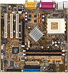nVIDIA makes an interesting motherboard chipset called nForce that has a Media and Communications Processor (MCP) supporting real time Dolby Digital encoding. I thought this was a really neat feature to have, particularly since I will be connecting the HTPC to the amplifier using an optical Toslink cable, which means I need a way of encoding multi-channel sound generated by games, etc.

I saw this motherboard on special at the North Rocks computer market. It's an ASUS (a really good quality motherboard maker), it's in the Micro-ATX form factor, has built in LAN, GeForce2 graphics and multi-channel sound and there was an adapter (A\$15) that I can buy that will provide co-axial and optical digital audio outputs. It seemed to meet all my requirements.

If I had to make a decision today, I would probably go for the Asus A7N8X-VM based on the nForce2 chipset (if I wanted to stay with the Micro-ATX form factor), or even the Asus A7N8X-E Deluxe full size ATX board.

If price wasn't a consideration, I would consider the Chaintech Zenith ZNF-150 ATX motherboard featuring the nForce3 150 with integrated support for 96/24 7.1 audio using the VIA Envy24PT chipset and VT1616 AC'97 2.2 audio codec. This motherboard supports the new AMD Socket754 Athlon 64 CPUs.

If Dolby Digital encoding is not an important feature, then I would recommend a motherboard based on an Intel chipset such as the i865PE, for example the Asus P4P800 Deluxe. If you are interested in an Intel chipset, it may be best to wait a few months, give the impending release of the Intel Grantsdale chipset. This has support for PCI Express as well as Intel's High Definition audio standard (192/32 and Dolby Pro Logic IIx support).

### [2.3 CPU - AMD Athlon XP 2400+](https://web.archive.org/web/20040725151420/http://users.bigpond.net.au/christie/HTPC/AMD_AthlonXP.html)

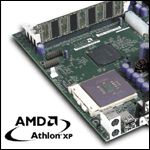Given that I've chosen the NForce motherboard, I had no choice but to select a suitable AMD Athlon XP CPU.

I chose the Model 8 (Thoroughbred) XP2400+ as it was a reasonable trade off between price and performance.

The motherboard does not support the Barton core and FSB speeds faster than 266 MHz.

If I had to do it again , I would probably consider a faster CPU, probably one in the 2.5-3.0GHz range.

### [2.4 CPU Cooler - Spire WhisperRock IV cooler](https://web.archive.org/web/20040916235535/http://users.bigpond.net.au/christie/HTPC/Spire_WhisperRockIV.html)

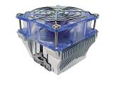Of course, the CPU needs to be cooled.

I chose the somewhat funkily named [Spire WhisperRock IV](http://home.iprimus.com.au/bohblesku/zalman.htm), based on good reviews.

I didn't want to spend hundreds of dollars on a CPU cooler, and this one attracted me as a reasonably cost effective, no nonsense, good performance, no frills, quiet heatsink.

### 2.5 Memory - PC2100 512 MB

I went for a single stock standard memory stick. I can't even remember the manufacturer. Some people are particular about the brand of memory cards they buy. I'm not.

### [2.6 AGP Graphics Card - Asus V9520 Magic/T](https://web.archive.org/web/20040725070533/http://users.bigpond.net.au/christie/HTPC/Asus_V9520.html)

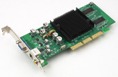

This is the cheapest current generation video card from Asus, based on the nVIDIA GeForce FX5200 chipset. It is a 128MB DirectX 9 card with AGP 8X support (although the motherboard only supports AGP 4X). It also has composite and S-Video TV outputs, which I don't use.

For a long time, I didn't use any graphics card at all, and relied on the integrated nVIDIA graphics in the A7N266-VM motherboard. However, I couldn't make HDTV playback smoothly without stutter and pauses.

Many people prefer the ATI Radeon series of graphics cards for HTPCs. Historically, the ATI Radeon series had better quality video output, plus better support for MPEG playback acceleration and custom video resolutions. However, nVIDIA has largely closed the gap with their current generation GeForce FX series chipsets. I chose the GeForce FX5200 chipset because it supported Direct 9 whereas the ATI Radeon equivalent (9200SE) only supported DirectX 8.1. Also, the nVIDIA display drivers allow setting of custom video resolutions (such as a 1366x768@56Hz required by my projector) without any additional software.

Of course, it is possible to spend a lot more money on the higher end graphics chipsets from either nVIDIA or ATI, however, typically these chipsets are useful for playing games. For typical HTPC applications, they should offer little or no additional performance improvement over the base models. And remember, the higher-speced cards usually have noisy fans.

### [2.6 Hard drive - Seagate Barracuda ST3120026A-3 Barracuda 7200.7 120GB](https://web.archive.org/web/20040725071612/http://users.bigpond.net.au/christie/HTPC/Seagate_Barracuda.html)

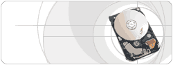Seagate has a well-deserved reputation for making the quietest hard drives in the market.

Seagate Barracuda IV drives were well known for being whisper quiet (2.0 bels). The latest generation drives, the Barracuda 7200.7, are not as quiet (2.5 bels), but the increase in noise is pretty insignificant.

They remain the hard disk brand of choice for silent PC builders, although recently Samsung have also been producing quiet drives.

They also have reasonable performance, with a spindle speed of 7200 RPM and 8 Mb cache.

### [2.7 DVD-ROM drive - Lite On XJ-HD165H 16X](https://web.archive.org/web/20040725070855/http://users.bigpond.net.au/christie/HTPC/JLMS_XJD165H.html)

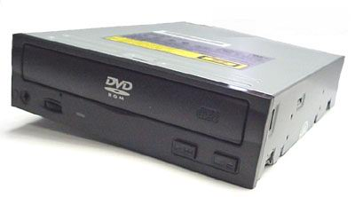

It is important to get an RPC1 DVD-ROM drive. RPC1 drives expect the operating system or DVD playback software to manage DVD regions. RPC2 drives on the other hand stores the target region code on the drive itself, and will only play back DVDs that correspond to the region code stored on the drive. Usually, you are only allowed to change the stored region code on an RPC2 drive up to 5 times.

Unfortunately, it is mandatory for drives sold after 1 January 2000 to be RPC2. However, depending on the drive model, you may be able to get "hacked firmware" that converts the drive from RPC2 to RPC1.

Originally, I wanted a DVD burner, and actually bought a Sony DRU500A. However, this is an RPC2 drive. Unfortunately, I couldn't find an RPC1 DVD burner, so I settled for a reasonably cheap DVD-ROM drive that has a utility to convert from RPC2 to RPC1.

### [2.9 DVB tuner - Nebula DigiTV PCI](https://web.archive.org/web/20040727145159/http://users.bigpond.net.au/christie/HTPC/Nebula_DigiTV.html)

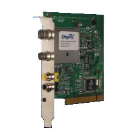

Digital TV broadcasts are still relatively new in Australia, having commenced in 1 January 2001.

The good news is that we get DVD quality standard definition TV broadcasts in MPEG2, additional channels, and even HDTV and Dolby Digital 5.1. And all this for free!

The bad news is nobody else in the world uses the same broadcast standards as we do. Although we use the same DVB-T broadcast standard as Europe, we are the only country in the world to support HDTV broadcasts using DVB.

So it's taken a while for DVB-T digital receiver cards to arrive in Australia, with software to support Australian TV channels. Fortunately, there are now several cards in the marketplace. Nebula is one of the better ones, with explicit support for HDTV (although I still can't get Dolby Digital via SP/DIF working using release 3.113 of the drivers).

This is a reasonable card, although the drivers and software are proprietary. However, the software is reasonably easy to use, and I've even burnt a few DVDs from off-the-air recordings (the process is somewhat complicated, and requires the conversion from MPEG2 transport stream to program stream, followed by editing and authoring onto a blank DVD).

### 2.10 Wireless Keyboard and Mouse - Belkin

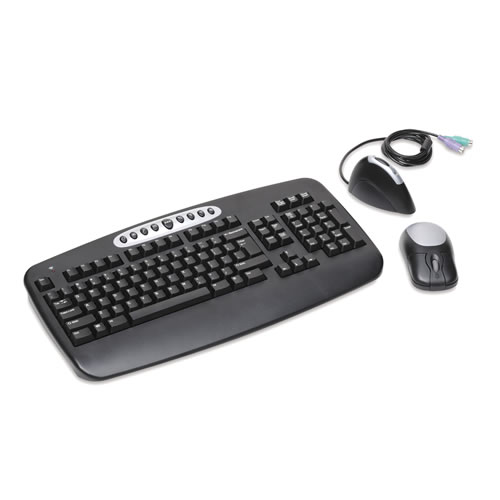

This is a cheap and cheerful wireless keyboard and mouse from Belkin (Part # F8E815-BNDL).

I initially bought an expensive Logitech model only to discover it had a very short range.

This one allows me to comfortably use the keyboard and mouse from the sofa, with the HTPC tucked away discreetly in a corner.

The keyboard works up to 6 feet away from the receiver.

Unfortunately, the mouse is not an optical one, so I need to use it on top of a DVD case or book. Fortunately, I don't use the mouse often, as I have a wireless remote control.

### 2.11 Wireless Remote Control - Marmitek X10 MouseRemote

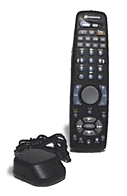This is the European version (with TeleText buttons) of the X10 mouse remote, which is also used by ATI. Basically, it's a combination of a universal IR remote control (non-learning, unfortunately, although there is a newer model with learning capabilities) plus a wireless mourse and mini-keyboard for the PC.

The manufacturer supplied drivers and software are pretty crappy, with only limited programmability of the remote control buttons.

Fortunately, there is an open source program called [maX10](http://max10.sourceforge.net/) that allows full programmability of most of the remote's keys. I managed to configure it to drive the DVD player and Digital TV software - so I don't need to use the keyboard and mouse for common activities.

### 2.11 Floppy Drive - Sony MPF920-Z(Black) 3.5" 1.44MB

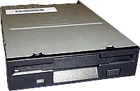Nothing special here, it's just a floppy drive. At least it's black, to match the case.

### 2.12 Memory Card Reader - Apacer USB 2.0 Embedded Card Reader

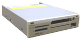

This is the usual all-in-one flash memory reader supporting Compact Flash Type I & II (including Microdrives), SmartMedia, MMC, Secure Digital, Memory Stick , and Memory Stick/PRO formats. It has a USB 2.0 interface, although the motherboard only supports USB 1.0. I've replaced the beige faceplace with a black faceplate.

### 2.13 How Much Did I Pay?

These prices are historical, and reflect the fact that I built the HTPC incrementally over a period of more than a year (2002-2003). The prices also include shipping if I ordered the item online (the price in brackets is the item price).

Table 2: Hardware Prices

| Component | Date Purchased | Price (A\$) | Purchased from |
| :-- | :-- | :-- | :-- |
| Antec Sonata case | 17 Sep 2003 | \$204.70 | On Line Marketing |
| Asus A7N266-VM motherboard | 23 Nov 2002 | \$149.00 | USB Technology |
| AMD Athlon XP 2400+ CPU | 22 Sep 2003 | \$159.72 | On Line Marketing |
| Spire WhisperRock IV CPU Cooler | 24 Sep 2003 | \$42.50 (\$35.00) | LowNoise PC |
| PC2100 512 MB memory | 23 Nov 2002 | \$295.00 | USB Technology |
| Asus V9520 Magic/T | 21 Mar 2004 | \$105.00 | Computer Target |
| Seagate ST3120026A-3 Barracuda 7000.7 120GB hard drive | 17 Sep 2003 | \$220.11 | On Line Marketing |
| Lite On XJ-HD165H DVD-ROM drive (with black face panel) | 23 Mar 2003 | \$73.25 | Computer Target |
| DVB Tuner | 20 Sep 2003 | \$350.00 | DigitalNow |
| Sony MPF920-Z(Black) 3.5" 1.44MB Floppy Drive | 17 Sep 2003 | \$16.34 | On Line Marketing |
| Marmitek X10 MouseRemote | 18 Dec 2002 | \$151.90 (\$119.00) | EON3 |
| Belkin Wireless Keyboard & Mouse | 30 Mar 2003 | \$49.95 | Harvey Norman |
| Apacer USB 2.0 Embedded Card Reader | 13 Apr 2003 | \$35.00 | Computer Target |

The total cost came up to A\$1,852.47, leaving just enough for software (hopefully!).

### 2.14 Putting It All Together

If you've never built a PC before, let alone a HTPC, it can be somewhat daunting. Fortunately, it's quite easy, and the instructions guides supplied with the components are quite helpful.

The following guides are useful:

- [buildPC.net](http://www.buildpc.net/)
- [PC Mechanic - Build Your Own PC](http://www.pcmech.com/byopc/)

### 2.15 Other Alternatives

Well, you don't have to build a HTPC, you can buy one. There are a few manufacturers who build HTPCs and will configure everything including hardware and software.

Alternatively, you can try buying a silent PC and configure it yourself. I particularly like the ones from [Hush Technologies](http://www.hushtechnologies.com/), and their prices are reasonable.

## 3.0 The Software

So far, all we've done is built a PC. It has some unusual and somewhat eclectic choices of components, to be sure, but this PC could conceivably be used for general purpose computing.

The main difference between a HTPC and a general purpose PC is the software, of course.

The good news about software is that if you look really really hard (and I _don't_mean surfing the warez sites!), most of the programs you need are free. And these are not cheap-skate functionality-deficient substitutions for commercial programs either - these are in fact the best and most appropriate programs for the various functions. So who says the best things in life aren't free? :-)

As far as I'm concerned, here are the only essential software packages you must purchase (for watching DVDs and TV):

- An operating system, preferably Microsoft Windows XP. Yes, I've heard about Linux and the BSD variants, but open source DVD players aren't quite state of the art yet, in my humble opinion.
- A software DVD player. If you are lucky, you will get a version of PowerDVD with your graphics card or DVD-ROM drive - I already own about 3 legal copies.

Everything else, you can acquire from the Internet. However, I would also consider the following to be worth considering (although I don't use them myself):

- [Inmatrix Zoomplayer Pro](http://www.inmatrix.com/zplayer/) (US\$19.95) - a great DVD player front end
- [Entech Taiwan PowerStrip](http://www.entechtaiwan.net/ps.htm) (US\$29.95) - for setting custom video resolutions and timings
- [Girder](http://www.girder.nl/) (US\$19.99) - for automating your HTPC

### 3.1 Operating System - Windows XP Professional or Home Edition

Microsoft has quite a few variants of Windows XP: Home, Professional, Tablet, and even a Media Center Edition (MCE). You can run older Windows versions, but why?

The MCE variant of Windows XP may seem at first sight to be an optimal base for constructing a HTPC, but it requires specialized hardware (remote controls, as well as for video capture/TV tuner). Plus, you can't get it in Australia unless you are an MSDN subscriber. I am, and used it briefly, but there is no electronic program guide for Australia (yet) and I didn't find the MCE applications all that interesting. myHTPC captures most of the look and feel, and it is more flexible.

I used the Professional Edition (A\$675), but I can't think of any reason why the Home edition (A\$463) wouldn't be just as suitable. I applied Service Pack 1, as well as all the updates from [Windows Update](http://windowsupdate.microsoft.com). The latest version of DirectX is also a must.

If you are building a HTPC from scratch, buy your copy of Windows XP from your dealer - an OEM edition bundled with hardware for Windows XP Home Edition is just \$149.60 at [EYO](www.eyo.com.au), for example.

### 3.2 Firmware and Drivers

These are the bane as well as the salvation of all PC users. It is important to keep track of the latest versions, but I've also had problems with particular software versions. Some of the utilities (such as RivaTuner) only supports specific driver versions, so it's worthwhile syncing the upgrades to specific version combinations.

These days, I wait until someone has reported a positive experience with a particular firmware version or driver before installing it. The Internet is your friend, search often, and read forums.

Here are some sites that I found useful for scanning and finding information about the specific components in my HTPC:

- [AVS Forum](http://www.avsforum.com/avs-vb/) - _the_ best place to find the latest news, tips and chat about HTPCs
- [The Firmware Page](http://www.firmware-flash.com)- this is a good place to find out whether there are any firmware updates for a specific DVD-ROM drive
- [nFORCERSHQ](http://www.nforcershq.com/) - this has a set of discussion forums related to the nForce family of motherboard chipsets and specific motherboards
- [ASUS A7N266-VM Downloads](http://www.asus.com.tw/support/download/item.aspx?ModelName=A7N266-VM) - for the latest BIOS, don't worry about the other drivers
- [Digi's JLMS (Lite-On) DVDROM drives](http://digi.rpc1.org/0page.htm) - this contains more detailed information on firmware revisions and utilities for the XJ-HD165H DVD-ROM drive.
- [nVIDIA](http://www.nvidia.com) - the place to get latest nForce chipset and GeForce display drivers
- [Nebule Electronics downloads](http://www.nebula-electronics.com/downloads/downloads.asp) - for the latest DigiTV software
- [Digital Broadcasting Australia - DBA Forums](http://www.dtvforum.info) - this has a really good forum for discussing Digital TV Tuner cards

### 3.3 Software DVD Player - WinDVD 5 Platinum

The major ones to consider are:

- [Sonic Cineplayer](http://www.cineplayer.com/default.asp)
- [nVIDIA NVDVD](http://www.nvidia.com/page/nvdvd.html)
- [Intervideo WinDVD](http://www.intervideo.com/jsp/WinDVDPlatinum_Profile.jsp)
- [Cyberlink PowerDVD](http://www.gocyberlink.com/english/index.jsp)

There are many debates on the Internet as to which is the best in terms of playback quality, but the truth is all the major vendors play a leap-frog game so choose the one that has the features you want or work best with your other software.

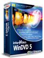

The one I am currently using is Intervideo WinDVD 5 Platinum. It does progressive deinterlacing properly (although the detection is not perfect), and supports DVD-Audio navigation (although it downsamples high resolution audio tracks to 48/16 unless you have a Creative Soundblaster Audigy 2). It also has an interesting feature called PAL TrueSpeed that slows PAL DVDs down by 4% to match the original 24 fps film source. Unfortunately, this feature only works if you do in-built audio decoding and send analog out to the amplifier (which I didn't want to do).

The price for WinDVD 5 Platinum is a bit steep at US\$69.95, but if you already have another DVD player (like the PowerDVD that came with the DVD-ROM drive) you can cross-grade for US\$49.95.

NVDVD is the other player that supports progressive deinterlacing, but the current version (2.15) exhibits the chroma upsampling error on my set-up. nVIDIA has announced a new version (renamed ForceWare Multimedia 3.0) that looks good.

### 3.4 Utilities

I use the following utilities (all freeware):

- [RivaTuner](http://www.guru3d.com/index.php?page=rivatuner&menu=8) - this allows me to set a custom 1368x768 @ 56 Hz video display resolution for a 1:1 pixel mapping to my VPL-VW11HT projector, so I don't need to purchase PowerStrip.
- [NebulaEPG](http://users.bigpond.net.au/renura/NebulaEPG.zip) - this downloads Australian TV program guides and converts them into a format usable by DigiTV.
- [myHTPC](http://myhtpc.net/) - this is a menu driven front end and media browser to make the HTPC easy to use, and it even does weather forecasts as a bonus feature!
- [max10](http://max10.sourceforge.net/) - this allows me to program the MouseRemote so that common applications (DigiTV, WinDVD) are entirely driven via the remote control. This allows me to avoid purchasing Girder, since I don't need the additional functionality.
- [DVD Region Killer](http://elby.ch/english/fun/software/index.html) - this allows you to play multi region discs on your DVD player (provided your DVD-ROM drive is RPC1). It doesn't work on the current version of WinDVD, but will on Zoomplayer. It was developed by someone at Elaborate Bytes and used to be available on their web site, but no longer. However, you can download it [here](http://www.ilovedvd.co.nz/dvddownloads.asp).
- [Exact Audio Copy](http://www.exactaudiocopy.de) - this makes a perfect bit for bit copy of a CD onto your hard disk.
- [Monkey's Audio](http://www.monkeysaudio.com) - this does lossless compression on PCM WAV files.
- [Dscaler](http://www.dscaler.org) - this does analog video capture and progressive deinterlacing.
- [DVD Decrypter](http://www.dvddecrypter.com/) - this rips DVDs onto your hard disk.

## 4.0 What's Next

Here are some of the things I'm currently thinking about:

- Upgrade the motherboard, CPU and graphics card to an Intel Prescott/Grantsdale/PCI Express configuration.
- Investigate Zoomplayer as a DVD front end
- Investigate nVIDIA ForceWare 3.0 Multimedia/DVD player
- Investigate ffdshow and reclock filters to improve video playback quality
- Consider options for burning recorded Digital TV programmes onto DVD

_Copyright © 2004 Christine Tham Version 1.0 4 April 2004_
