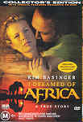

_This review was written by me for **MichaelDVD**, an Australian DVD review site that is no longer online. A capture of the site is held by the Internet Archive: **[browse it there](https://web.archive.org/web/20220217040146/http://www.michaeldvd.com.au/)**. It is reproduced here from my own copy of the site, as part of the record of what I have written._

## The film

**_I Dreamed Of Africa_**, not to be confused with _Out Of Africa_(1985) or even _I Dreamed Of Jeannie_(1965), is the story of Kuki Gallmann (played by **Kim Basinger**) starting from just before she moved to Kenya, Africa, with her husband Paolo (**Vincent Perez**) and son Emanuele (**Liam Aiken**) but prior to the establishment of the _Gallman Memorial Foundation_([www.gallmannkenya.org](http://www.gallmannkenya.org)).

As you can probably guess, there is actually a real life person called **Kuki Gallmann**, and this movie is based on her autobiography (with the same title as the movie). She has also published a follow up book called _African Nights_and a collection of poetry called _Il Colore del Vento_. In addition to being a successful author, she is also a staunch wildlife conservationist.

The film starts with Paolo and Kuki emerging from a restaurant with a group of friends and the group hops into Paolo's car to go to a bar. During the journey, they were involved in a horrible car accident (not Paolo's fault, though) resulting in the death of Kuki's friend, a broken leg and bruises for Kuki and minor injuries for Paolo. As Kuki slowly recovers, she and Paolo got to know each other better and eventually they fell in love. Paolo also develops a good relationship with Kuki's son Emanuele (shortened to Ema for much of the movie).

Paolo has been to Africa before and Kuki's father has told her stories of Africa when she was a child. So, when Paolo proposes marriage and suggest they move to Africa, Kuki accepts, despite the initial reservations of her mother. The rest of the movie is about them settling into Africa, moving into a badly-maintained ranch called Ol Ari Nyiro and building a life in Africa. We see Kuki becoming more and more self-reliant as Paolo spends days at a time hunting with his friends and we get to watch Ema growing up. Over time, Kuki learns to accept the "different rhythm" of life in Africa, confront the beauty as well as the danger of Africa, establish relationships with the local tribe, develop a passion for preserving the wild life, and eventually face up and survive the pain of personal loss.

In between, we are treated to some breathtaking views of African landscape and wild life. Although most of the movie was shot on location in South Africa instead of Kenya (much to the real Kuki's disappointment), there were some location scenes shot on the real Ol Ari Nyiro ranch itself.

I would have loved to say that I really enjoyed the movie, as there were elements of the story that really appealed to me. Unfortunately, the movie failed to "click" for me. In trying to compress a whole book into less than 2 hours, I felt like I was watching Kuki's life flash by with the Fast Forward button activated on the remote. Not having read the book on which the movie was based, I sometimes did not fully appreciate the significance of some of the scenes. Perhaps it's more accurate to say I think I intellectually understood what each scene was about but it failed to register emotionally with me.

The scenes were also necessary disjointed, and none of the aspects of the Gallmanns' life in Africa were developed to the extent that we get drawn into their lives. We are afforded no more than brief glimpses into important aspects of their lives, such as their relationship with the tribespeople, servants, the wildlife and poachers, the land, even their day to day activities maintaining and running the ranch. So, ultimately, I fail to relate to them and when major events happen to them I fail to be emotionally involved. I suspect the story would have worked better as a 3 hour movie or even a mini series.

Another aspect that bothered me was the casting. For a movie about Italians living in Africa, none of the main cast members are Italian which I think is a shame. Paolo is a Swiss of Spanish descent, with an accent that is not even vaguely Italian, and Kim and her mother (played by **Eva Marie Saint**) look and talk 100% American.

The real Kuki sounds like a very interesting person to know and to talk to and I would very much like to meet her. One good thing from watching this movie is that I will try and see if I can borrow the book the next time I go to the library.

## The video transfer

When I first watched the movie on this disc, I had the impression that the transfer was somewhat soft with muted colours. However, I've revised my opinion on subsequent rewatchings (with the audio commentary track and with the isolated musical score). I would say the transfer has excellent sharpness and detail. However, because this movie is set in Africa there are lots of shots of sweeping but hazy African landscapes that can create an impression of softness. There is some evidence that edge enhancement has been utilised, leading to occasional minor halo effects, but these are few and far in between and are never significant enough to intrude on the viewer enjoyment. Shadow detail is acceptable, even during dark scenes (such as those shot in the nighttime).

I still can't help feeling, however, that colour saturation is below par, even though I suspect the colour saturation is probably a lot closer to reality than my eyes are prepared to admit. Much of the film is shot in the outdoors during daylight, and the wide open spaces will appear somewhat hazy on camera, thus the film is probably capturing the colours accurately. A good yardstick is skin colours, and on this transfer flesh colours look realistic at all times. However, there are no scenes where the colours are brightly saturated a la the dance sequence during the opening titles of _Austin Powers_, not even in interior shots or nighttime shots. Occasionally, we see brightly coloured clothing being worn, but the colours never grab the eyes for attention the way they should.

The movie is presented in it's original aspect ratio of 2.35:1 with 16x9 enhancement. The film source seems to be somewhat less than perfect, as there are minor dust, scratches and black marks appearing throughout the film. These are especially noticeable against a bright background (like the sky). Fortunately, the film seems relatively free of grain.

The transfer is relatively free of MPEG or other video artefacts, apart from a slight video master glitch (horizontal white line) appearing at the middle left of the screen at **52:43** (just prior to the layer change), some ringing around the credits during the opening titles, minor posterisation (note the foliage in **17:39** and Charlie's face in **62:05**), and some pixelation/aliasing effects especially of near horizontal lines.

The disc comes with no less than 17 subtitle tracks ranging from English to the Scandinavian languages (all four) and even Hindi and Arabic. Even the commentary track is subtitled in German and Dutch.

This is a single sided dual layer disc (RDSL) and the layer change occurs at **52:50**. It does occur in the middle of a scene, so whether this change is objectionable or not will depend on your DVD player. On mine, it shows up as a minor freeze but acceptable. However, I did

## The audio transfer

There are four audio tracks on this disc: two Dolby Digital 5.1 audio tracks for the main feature, in English and German, encoded at the higher bitrate of 448Kb/s, plus an English Dolby Digital 2.0 audio commentary track at 192Kb/s, and an isolated music score, encoded as Dolby Digital 5.0 (note no LFE channel) at a bitrate of 448Kb/s. I listened to the English audio track and the commentary track in their entirety, and played selections from the isolated music track.

The audio track sounds clear and well-mixed. Even though the film itself is fairly dialogue focused, the surround channels are utilised for ambience (rain, birds) as well as for music, creating a realistic enveloping aural effect at all times. Even so, the rear channels are never aggressively utilised, except during the storm scene (about 63 minutes into the feature) where all channels are used including the sub-woofer. There is no evidence of sound glitches such as distortion or lack of audio synchronisation.

The original musical score by Maurice Jarre effectively complements and supports the film, and helps underscore the grandeur and majesty of the African scenes.

Overall, I quite like the audio transfer, but it falls short of reference quality because it seemed to lack the "punch" of a reference quality audio master and the additional "sparkle" that makes you notice even the tiniest details because they sound perfectly appropriate and realistic.

## The extras

This disc is marked as a "Collector's Edition" ("With Special Features Exclusive to DVD") which I gather in Columbia Tristar's book means that an audio commentary, featurette and trailer have all been included as extras, and the disc contains all of those, as well as an isolated music track which is less common. All menus and extras are non 16x9 enhanced. Menus and scene selections are static. The menus take painstaking care in telling us which menu item is subtitled or has non-English audio tracks, which I thought was a nice touch.

### Dolby Digital Trailer - City

This is the standard Dolby Digital "City" trailer.

### Isolated Musical Score

This contains both original music composed by **Maurice Jarre**as well as other music (I distinctly recall an aria from Mozart's _Le Nozze di Figaro_just before the car crash and apparently a Strauss song was used when they were releasing snakes in the river just before the end). Maurice Jarre's music sounds a bit like a cross between Beethoven's _Pastoral Symphony_(No. 6) and the theme from _Lawrence of Arabia_, but is nevertheless quite pleasant to listen to. I particularly like the fact that he sprinkles the soundtrack with a vague Italian flavour at the beginning of the movie but starts introducing congo drums to give the theme an African feel later on. The first half of the movie is neo-Western classical, and the later half of the movie is more African music inspired.

### Theatrical Trailer

This is the US Theatrical release trailer presented in a letterboxed 1.85:1 aspect ratio, non-16x9 enhanced. It is available with both English and German audio tracks (Dolby Digital 5.1) and Dutch subtitles.

### Featurette - HBO Making Of

This is a typical promotional documentary featuring interviews with the director and main actors as well as some stills and a short interview of the real Kuki Gallmann. It is **15:03**minutes long, and is presented in a full frame 4:3 aspect ratio (apart from excepts from the movie, which are presented in a letterboxed 1.85:1 aspect ratio, non-16x9 enhanced). It is subtitled in German and Dutch.

I found it instructive to compare Hollywood hype against reality by contrasting Kim's interview (in which she gushes about how much she wanted to do the movie because she really identified with Kuki and how she felt she understood Kuki) against the real Kuki's comment on Kim, as [quoted](http://www.susangranger.com/discovering.htm) by Susan Granger: "I don't know her, and she doesn't know me. If I'd been given the task of interpreting you in a movie, I would have come and met you, right? I would have made it my business to get to know you."

### Audio Commentary - Hugh Hudson (Director)

This is a fairly informative commentary, in which Hugh talks, amongst other things, about problems getting the script right given the episodic and diary like nature of Kuki's book and compressing everything to fit into 2 hours (well, sorry Hugh, it didn't work for me), and limiting the non-African scenes at the beginning to less than 20 minutes based on feedback from previews. He also talks about how they did the casting (the American financiers wanted an American movie star to play the role of Kuki, and they chose Kim after she won an Oscar for _L.A. Confidential_). He is fairly chatty for about 50 minutes or so, then he runs out of steam and is fairly silent for the rest of the movie apart from an occasional comment or two.

### Biographies-Cast & Crew

This is a set of stills featuring short biographies and filmographies of **Hugh Hudson**, **Kim Basinger,** **Vincent Pérez**, **Liam Aitken**and **Eva Marie Saint**.

## Region 4 versus Region 1

The Region 4 version of this disc misses out on;

- Pan and Scan transfer
- English Dolby Surround audio track
- Production notes booklet

The Region 1 version of this disc misses out on;

- German Dolby Digital 5.1 audio track
- A variety of foreign-language subtitles

My (slight) preference is for the Region 4 version as it has additional foreign language audio tracks and subtitles. Alternatively, if you hate black bars, you should probably go for the Region 1 version which has the 4x3 transfer.

## Summary

**_I Dreamed Of Africa_** is a gorgeously filmed story of a real person who is genuinely interesting. Unfortunately, the script and the movie fail to "work" for me and the casting can be improved. This movie is worth watching if you enjoy African scenery and wildlife, especially snakes.

It is presented on a DVD with above average video and audio transfers. The video transfer, in particular, suffers from a number of minor film and video glitches, but nothing that would cause annoyance. It has a good collection of extras and is well sub-titled with foreign languages.

### [Ratings (out of 5)](../ReviewersGuide/RatingsGuide.html)

© [Chris Tham](mailto:ChrisT@michaeldvd.com.au) (read my [biogr aphy](../ReviewerProfiles/ChrisT.asp)) 9 January 2001

| Rating  | Score        |
| :------ | :----------- |
| Plot    | ★★½ 2.5 / 5  |
| Video   | ★★★½ 3.5 / 5 |
| Audio   | ★★★★ 4 / 5   |
| Extras  | ★★★★ 4 / 5   |
| Overall | ★★★½ 3.5 / 5 |
