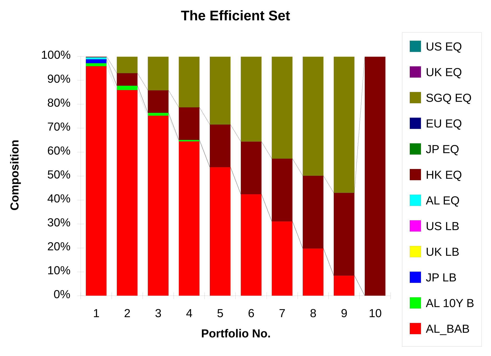
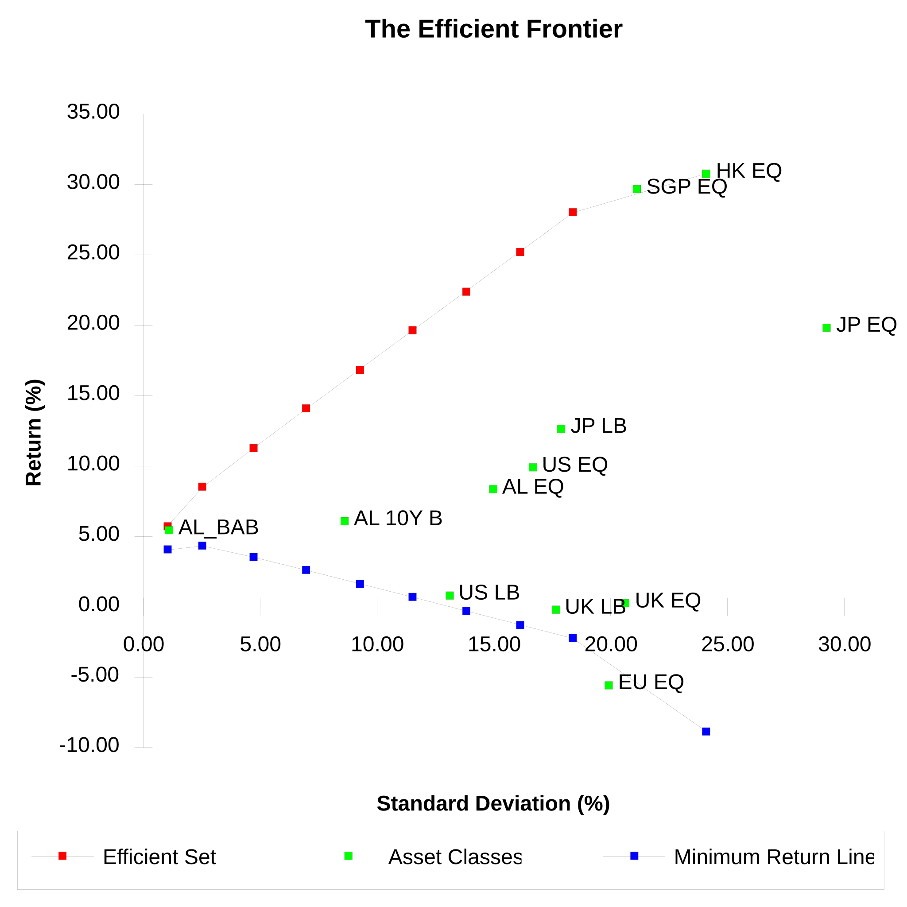

_This is the major assignment for Applied Portfolio Management, ECFS 843, one of the ten subjects in Macquarie University's [Master of Applied Finance](/spotlite/education/macquarie/), due on Friday the 4th of June 1993. The brief was to allocate a fund of one billion Australian dollars across international markets._

_**It is not mine alone.** It was written by a syndicate of five — Sallyanne Cook, Peter Negline, Michael Park, Xiaoguang Tan and me — and the manuscript credits each country outlook to its author in the heading, which is how those headings are reproduced here. The United States is mine. So, on the evidence of the signature at the end and of my own working files beside it, are the framework of analysis, the three total-return models, and the optimiser results with the sensitivity analyses that follow them; but the manuscript does not say so, and I have not annotated it to claim them._

_The five figures are the Equation Editor objects and charts embedded in the manuscript, recovered from the metafiles Word cached for each and converted to vector. Two repairs are worth naming. The equations are drawn one character at a time with the position carried separately, so read literally every glyph lands on the same spot; and their summation and product signs are Symbol-font characters that a browser without that font renders as Latin letters. Both are now handled. What is still missing is the large parentheses grouping each denominator: those are assembled from fragments of a font called Fences, which nothing here has, so they are dropped rather than drawn as the capitals they would otherwise become. The exponent placement still shows the grouping._

_Set from the Word 2.0 manuscript. Its twenty-nine tables are re-set as tables, and the words are as submitted._

Macquarie University Master of Applied Finance

ECFS 843: Applied Portfolio Management

MAJOR ASSIGNMENT Due Friday 4 June 1993

Syndicate members: Sallyanne Cook Peter Negline Michael Park Xiaoguang Tan Chris Tham

## Framework of Analysis

### Introduction

The aim of the exercise is to work out an international asset allocation for a fund with AUD 1 billion to invest in an international portfolio, using the Markowitz Asset Allocation model. The portfolio will be constructed from 12 bill, bond and equity indices (called asset classes) spanning 7 countries. This is done by making an analysis of the likely economic conditions in each country in the year ahead and then forecasting a one year total return on the relevant index in each country.

### Analysis Methodology

The Syndicate decided on the following approach to forecast the one year total return for all the indices under consideration:

1. Agree on a series of World Scenarios and relate the outlook for each country to that scenario.

2. Agree on a consistent methodology for forecasting one year total returns for bill, bond and equity indices given a fixed set of input parameters for each asset class. The spreadsheet model takes into account expected currency movements during the year when deriving total returns, hence the expected returns are based on an Australian investor using unhedged funds and holding each asset class for a period of one year, with all interim dividends or coupons reinvested in the same asset class. This methodology was implemented as a spreadsheet model and distributed to all members in the Syndicate.

3. Each Syndicate member then developed a country forecast by relating the outlook for that country in relation to each World Scenario and assigned probabilities for the development of each scenario in the country.

4. Country forecasts are then used to supply the input parameters to the return forecasting spreadsheet number to derive the expected total return for indices in that country.

5. Individual country forecasts and expected returns are then compared and cross checked for consistency.

6. The expected returns generated by the forecasting model are then used, in conjunction with historical variances and correlations between the indices over the last 62 months (Jan 1988 to Feb 1993), to generate a set of efficient portfolios within the efficient frontier using an optimisation program.

7. A set of sensitivity analyses was also conducted to determine the effect on optimal portfolio compositions to changes in expected returns, standard deviations and correlations.

8. Finally, a portfolio was chosen that best expresses the Syndicate’s risk tolerance, which is no less than a 95% probability of achieving a negative portfolio return in one year.

### Total Return Forecasting Model

The method used to calculate expected total return for any particular index over the next 12 months involves:

1. Assigning probabilities for each World Scenario occuring in the relevant country.

2. Obtain the current (31 March 1993) value for the index (the non accumulation index value can be used as a proxy if the accumulation index value was unobtainable).

3. Forecast the value of the index in 12 months under each World Scenario. The forecast index value depends on input parameters to a particular valuation model (depending on whether the index is a bill, bond or equity index).

4. Forecast the value of any expected dividends or coupon payments and reinvest in the asset class.

5. Calculate the expected return (in the country’s native currency) by taking into account the difference in index values as well as any interim dividends or coupon payments. The effects of inflation, taxation and dividend imputation have not been considered.

6. The current index value is converted to an AUD (Australian Dollar) value using the current exchange rate and the future index value plus interim dividends/coupons are converted to AUD using a forecast 12 month exchange rate.

7. A total return that takes into account currency effects is then computed. This is the output of the forecasting model.

8. The standard deviation of the expected total return is also computed (by taking into account the spread between the total return for each world scenario) and compared to the historical standard deviation. This is purely used as a sanity check and for consistency.

The specific valuation models for each kind of index is given in the following sections.

#### Bill Indices

For the ASE 90 day bill accumulation index, the valuation model takes as an input the current and 12 month forecast 90 day bill yields. Linear interpolation is then used to generate forecast 90 day bill yields for the next four quarters. The index value is then increased for four consecutive quarters (90 day periods) by using the simple interest formula and applying the relevant 90 day bill yield.

µ<strong> </strong>§

#### Bond Indices

The valuation model uses the compound interest formula (assuming semi-annual coupon payments) to calculate the fair price of a \$100 face value bond (with the tenor specified as an input parameter) given the input parameters of coupon rate and current yield. It then computes the fair price of the same bond one year hence (term to maturity reduced by one year) using the forecast bond yield. The forecast bond yield can be estimated from the sum of the estimated GDP growth and inflation over the next 12 months plus a risk premium. Half year coupon proceeds are reinvested at a rate which is the average of the current and forecast bond yields. The difference between the fair values plus coupon proceeds is a good proxy for the total return of investing in the index for one year.

µ<strong> </strong>§

#### Equity Indices

The valuation model uses the simple version of the Dividend Discount Model. The current fair value of the index is estimated given the estimated dividend yield, current long term bond yield, required equity premium and long term dividend growth. A sanity check on the input parameters is performed by comparing the current fair value with the current index value. The model then estimates the 12 month fair value of the index from the estimated required capitalisation rate in 12 months time. The difference between the current and forecast index values together with estimated dividend proceeds (assumed to be received at year end) gives a good indication for the return on the accumulation index. Note that if no figures are available for the accumulation index, the non-dividend adjusted index value can be used as a proxy.

µ<strong> </strong>§

##

## World Scenarios

### Introduction

The outlook for world growth remains subdued as the major economies of the US, Japan, and Europe continue to experience excess capacity combined with fiscal responsibility. As a result, the prospect for global inflation is that it will remain stable as a general surplus in global employment markets limit the prospects for wage driven increases. Whilst there have been some increases seen in soft commoditiy prices the broad oversupply and copious stockpiles of other commodities essential to any recovery will prevent any price shocks and therefore contribute to the overall subdued inflationary outlook.

The deficit reduction plans of the US (if passed by Congress) will contribute to the low growth and low inflationary environment that has existed for some eighteen months now. This situation has allowed the Federal Reserve to hold short rates at very low levels for much longer than would normally happen and whilst this might normally lead to a position of overheating, we believe that any substantial impact will not occur in the short term (ie, next twelve months) but rather through late 1994 and into 1995. In fact the relative strength of the US bond market through the year to date confirms our belief that capital investment (and thus sizeable growth) will not show any worthwhile turnaround before mid 1994. As Japan continues through it "growth recession" we believe that its growth will also be subdued and shall experience similar rallies in its long bonds as seen in the US Market place. The rise of the Yen due to Japan's strong trade surpluses is close to its peak. Any further strengthening will allow the government the opportunity for further easing but a rate of 110 will likely prevail as the average over the coming period.

Germany, the leading force in Central Europe, will continue to wrestle with inflationary fears though the levels will be below previous years. Like most other countries, in the EC weakening employment markets will contain any wage demands and ongoing Bundesbank constraint will ensure that the much expected easing at the short end will happen slowly. The UK, however, should see slightly stronger growth than its continental counterparts as the Government provides some stimulus through fiscal expansion. This will help reverse the slide of sterling seen over the last year and, in turn, short rates will likely push higher in line with growing corporate demand.

Other economies such as Canada and Australia will see improving growth trends combined with low inflationary environments. Any substantial recovery will be contained in line with the modest improvement of the World's major economies. The only exceptions will be the Asian tiger countries of Hong Kong and Singapore which will both be pushed along by the strength of mainland China and hence provide the best opportunity for large returns.

The general outlook for corporate profit growth looks solid but is largely because most markets are rising off such low bases. Given the duration of the recession most corporates globally have taken any hard medicine and have used the period to trim cost bases and improve productivity.

Commodity prices will continue to trend sideways though this will be made up of selected soft commodity prices improving whilst most other commodity prices will remain weak weighed down by excessive stockpiles.

We believe that there is somewhat of a schism in the world's major economies as some continue to show laboured growth (US, Europe, and Japan) whilst others ready themselves for higher levels of growth and a global recovery. Accordingly we believe the twelve month outlook is overall subdued but certainly setting the stage for a solid recovery thereafter.

### Choice of World Scenarios

Our World scenario is thus expecting that global GDP and inflation will increase only moderately across the major countries of the US, Japan and Europe. However to accomodate the ‘patchy’ nature of the world economies we have developed five scenarios (with our world between MGLI & MGMI) and then assigned probabilities to each outcome for the respective regions included in the project. This has allowed the Tiger economies to highlight their high growth outlook vis a vis the slow lumbering giant of the US.

The five scenarios are as follows:

| Low GDP Growth & Low Inflation       | LGLI |
| :----------------------------------- | :--- |
| Medium GDP Growth & Low Inflation    | MGLI |
| Medium GDP Growth & Medium Inflation | MGMI |
| Medium GDP Growth & High Inflation   | MGHI |
| High GDP Growth & High Inflation     | HGHI |

These may be explained as follows:

| LGLI | global recession                                                                  |
| :--- | :-------------------------------------------------------------------------------- |
| MGLI | world economy picking up from recession                                           |
| MGMI | steady recovery underway                                                          |
| MGHI | strong recovery in place (though more likely to appear in a slowing down economy) |
| HGHI | full growth possible.                                                             |

## Country Outlooks

### Australia (Peter Negline)

The lacklustre performance of the the Australian financial markets over 1993 reflects the current outlook for the economy and the prospects for growth over the coming twelve months. In fact the severity of the difficulties facing Australia are highlighted by the extent this year of the Government's revisions to its GDP forecasts. Conventionally, Australia has moved quickly from boom to bust, but in the present recession, the lacklustre prospects for growth have dampened the possibility for either an investment led or consumer led recovery.

Accordingly, the growth in corporate profits measured by eps growth estimates of the market are nominally set at 22.8% but little of this represents genuine growth in volumes or sales. The absolute level of profits remains little above previous years and regardless any growth is largely due to lower costs, interest charges and lower corporate taxes. The recent mix of interim results announced by the major bank stocks highlights the troubles still ahead for the Australian economy. The bank results also highlighted the patchy nature of the recovery.

Given the low possibility of an investment led recovery (the economy is in a sluggish growth phase), unemployment is expected to remain above 10%. Also with lower tax receipts for the government, the deficit will continue to drain the availability of funds and put a floor on the level of interest rates. The lacklustre performance of commodity prices will see little recovery in the agricultural and mining sectors. Whilst there might be some volume growth, prices (due to overstocking) are likely to remain flat as well as profits.

Given recent weakness of the Australian dollar against the US, an easing of rates at the short end is unlikely within the next quarter (before August). If inflation remains under 3% and GDP grows at an annualised rate of under 3%, the RBA will push for an easing toward the end of the year. Wage inflation is expected to remain low and any increases will be largely productivity based. Our forecast is for inflation to be 2.8% for the twelve months to 31/5/94. In such a historically low inflationary environment, provided there is no blow out in the deficit, then the AUD/USD rate should rise from current levels of .6940 to around .7200 after 12 months.

With the All Ordinaries Accumulation Index at 5968.1 and having traded in a narrow range for the year to date, we expect the market to reach 6466.68 by end of May, 1994. This includes the forecast dividend yield of 3.6% for the market.

The ASE 90 day bill accumulation index was at 7734.2 as at the end of March 1993. With bills currently trading at 5.14%, we expect the rate in twelve months to be 5.4% which will generate a total return for the index of 5.3%.

The CTB 10yr and over accumulation index was at 8234 as at the end of March 1993. We expect bonds to move from current yields of 7.64% to 8% within the next twelve months which will give a total return of 5%.

| Scenario | Probability | Inflation | GDP  |
| :------- | :---------- | :-------- | :--- |
| LGLI     | +0.2        | +2.5      | +2.5 |
| MGLI     | +0.35       | +2.8      | +3.0 |
| MGMI     | +0.3        | +3.5      | +5.0 |
| MGHI     | +0.1        | +4.0      | +6.0 |
| HGHI     | +0.05       | +5.0      | +8.0 |



| _Scenario_              | JPM   | LGLI  | MGLI  | MGMI  | MGHI  | HGHI  | _Expected_ |
| :---------------------- | :---- | :---- | :---- | :---- | :---- | :---- | :--------- |
| Probability             |       | 0.20  | 0.35  | 0.30  | 0.10  | 0.05  | 1.00       |
| Average Growth Rate     |       | 0.00% | 2.00% | 1.50% | 2.00% | 3.00% | 1.50%      |
| Growth Pattern          | Up    | Down  | Up    | Up    | Up    | High  | Up         |
| Average Price Inflation |       | 2.50% | 2.80% | 3.50% | 4.00% | 5.00% | 3.18%      |
| Inflation Pattern       | Level | Down  | Down  | Level | High  | High  | Level      |
| Current exchange rate   |       | 1.00  | 1.00  | 1.00  | 1.00  | 1.00  | 1.00       |
| Forecast exchange rate  |       | 1.00  | 1.00  | 1.00  | 1.00  | 1.00  | 1.00       |

§

#### ASE 90 day bill accumulation index (AL_BAB)



| _Scenario_             | JPM | LGLI     | MGLI     | MGMI     | MGHI     | HGHI     | _Expected_ |
| :--------------------- | :-- | :------- | :------- | :------- | :------- | :------- | :--------- |
| Current index          |     | 7,734.20 | 7,734.20 | 7,734.20 | 7,734.20 | 7,734.20 | 7,734.20   |
| AUD value              |     | 7,734.20 | 7,734.20 | 7,734.20 | 7,734.20 | 7,734.20 | 7,734.20   |
| Current yield          |     | 5.14%    | 5.14%    | 5.14%    | 5.14%    | 5.14%    | 5.14%      |
| Forecast yield         |     | 4.50%    | 5.00%    | 5.40%    | 8.00%    | 10.00%   | 5.57%      |
| Yield difference       |     | -0.64%   | -0.14%   | 0.26%    | 2.86%    | 4.86%    | 0.43%      |
| Index after 91 days    |     | 7,830.23 | 7,832.64 | 7,834.57 | 7,847.10 | 7,856.74 | 7,835.39   |
| Index after 182 days   |     | 7,924.32 | 7,931.64 | 7,937.50 | 7,975.63 | 8,005.02 | 7,940.01   |
| Index after 274 days   |     | 8,017.40 | 8,032.30 | 8,044.24 | 8,122.08 | 8,182.28 | 8,049.38   |
| Index after 1 year     |     | 8,113.74 | 8,133.83 | 8,149.93 | 8,255.12 | 8,336.70 | 8,156.92   |
| One year return        |     | 4.91%    | 5.17%    | 5.38%    | 6.74%    | 7.79%    | 5.47%      |
| Proceeds in AUD        |     | 8,113.74 | 8,133.83 | 8,149.93 | 8,255.12 | 8,336.70 | 8,156.92   |
| **AUD return**         |     | 4.91%    | 5.17%    | 5.38%    | 6.74%    | 7.79%    | 5.47%      |
| **Standard deviation** |     | 0.00%    | 0.00%    | 0.00%    | 0.02%    | 0.05%    | 0.73%      |

§

#### CTB 10 year and over bond accumulation index (AL 10Y B)



| _Scenario_             | JPM | LGLI   | MGLI   | MGMI   | MGHI   | HGHI    | _Expected_ |
| :--------------------- | :-- | :----- | :----- | :----- | :----- | :------ | :--------- |
| Current yield          |     | 7.64%  | 7.64%  | 7.64%  | 7.64%  | 7.64%   | 7.64%      |
| Risk premium           |     | 3.30%  | 3.30%  | 3.30%  | 3.30%  | 3.30%   | 3.30%      |
| Forecast yield         |     | 5.80%  | 8.10%  | 8.30%  | 9.30%  | 11.30%  | 7.98%      |
| Average coupon rate    |     | 9.50%  | 9.50%  | 9.50%  | 9.50%  | 9.50%   | 9.50%      |
| Term to maturity       |     | 10     | 10     | 10     | 10     | 10      | 10         |
| Price today            |     | 112.84 | 112.84 | 112.84 | 112.84 | 112.84  | 112.84     |
| Price in AUD           |     | 112.84 | 112.84 | 112.84 | 112.84 | 112.84  | 112.84     |
| Price in one year      |     | 125.66 | 108.83 | 107.50 | 101.20 | 89.99   | 110.09     |
| Coupon proceeds        |     | 9.63   | 9.65   | 9.65   | 9.66   | 9.68    | 9.65       |
| Total proceeds         |     | 135.29 | 118.48 | 117.16 | 110.86 | 99.67   | 119.74     |
| One year return        |     | 19.90% | 4.99%  | 3.82%  | -1.76% | -11.67% | 6.11%      |
| Proceeds in AUD        |     | 135.29 | 118.48 | 117.16 | 110.86 | 99.67   | 119.74     |
| **AUD return**         |     | 19.90% | 4.99%  | 3.82%  | -1.76% | -11.67% | 6.11%      |
| **Standard deviation** |     | 1.90%  | 0.01%  | 0.05%  | 0.62%  | 3.16%   | 7.87%      |

§

#### All Ordinaries Accumulation Index (AL EQ)



| _Scenario_             | JPM | LGLI     | MGLI     | MGMI     | MGHI     | HGHI     | _Expected_ |
| :--------------------- | :-- | :------- | :------- | :------- | :------- | :------- | :--------- |
| Current index          |     | 5,968.10 | 5,968.10 | 5,968.10 | 5,968.10 | 5,968.10 | 5,968.10   |
| AUD value              |     | 5,968.10 | 5,968.10 | 5,968.10 | 5,968.10 | 5,968.10 | 5,968.10   |
| Estimated dividend     |     | 175.00   | 195.00   | 215.00   | 235.00   | 255.00   | 200.55     |
| Dividend yield         |     | 2.93%    | 3.27%    | 3.60%    | 3.94%    | 4.27%    | 3.42%      |
| Dividend growth        |     | 6.00%    | 6.00%    | 6.00%    | 6.00%    | 6.00%    | 6.00%      |
| Equity premium         |     | 2.00%    | 2.00%    | 2.00%    | 2.00%    | 2.00%    | 2.00%      |
| Capitalisation rate    |     | 9.64%    | 9.64%    | 9.64%    | 9.64%    | 9.64%    | 9.64%      |
| Current fair value     |     | 4,807.69 | 5,357.14 | 5,906.59 | 6,456.04 | 7,005.49 | 5,604.40   |
| One year cap rate      |     | 9.30%    | 9.40%    | 9.50%    | 9.60%    | 9.70%    | 9.45%      |
| Future fair value      |     | 5,621.21 | 6,079.41 | 6,511.43 | 6,919.44 | 7,305.41 | 6,262.68   |
| Total value            |     | 5,796.21 | 6,274.41 | 6,726.43 | 7,154.44 | 7,560.41 | 6,466.68   |
| One year return        |     | -2.88%   | 5.13%    | 12.71%   | 19.88%   | 26.68%   | 8.35%      |
| Future AUD value       |     | 5,796.21 | 6,274.41 | 6,726.43 | 7,154.44 | 7,560.41 | 6,466.68   |
| **AUD return**         |     | -2.88%   | 5.13%    | 12.71%   | 19.88%   | 26.68%   | 8.35%      |
| **Standard deviation** |     | 1.26%    | 0.10%    | 0.19%    | 1.33%    | 3.36%    | 8.04%      |

§

### Hong Kong (Xiaoguang Tan)

During the first quarter of 1993, the Hong Kong stock market Hang Seng Index (HSI) hit a new record high of 6557 in early March, then fall down by 12% to 5761 in mid-March due to the gazetting of the political reform bill by the Governor, which is critically criticised by the China government.

However, by the end of the quarter much of this lost ground had been made up. Later on May 18, 1993, the HSI rose to 7149.30, which is the fourth record high close in the last five days of trading. Such a bull in the stock market is due to the announcement that the talk about Governor Patten's proposals for democratic reform in the territory would be held between China and Britain government, which had been considered in deadlock.

The rising of HSI indicates that the Hong Kong stock market remains fundamentally attractive relative to the other markets in the region. But it will take more risk in the political issues, especially the relationship between the China and Britain.

With the booming of the economic in South China, Hong Kong's domestic economic continues its recovery. The expectation of real GDP growth in 1994 will be on the 5.4% level. The slow down in the property market and a moderate increase in economic growth in 1993 should not have great pressure on the inflation. However, Because the new airport and other big projects will be expected to begin in the late 1993, affected by these big projects, the expected inflation rate will be on 8.5% level.

There are two main negative factors to the stock market. First the talk between China and Britain on the governor's political reform bill has not yet reached an agreement. If the results of the talk are not as good as that had been expected, it will affect the stock market severely. The results of the talk also affects the new airport projects. Secondly the annual issue of Most Favourable Nation status renewal for China is still a question. The US government has warned China against continued human rights abuses, missile sales and unfair trade practices. The US government also publicly acknowledged its support for the Governor's political reform bill, which will tighten the relationship between China and Britain.

The exchange rate between HKD and USD will be maintain around USD1/HKD = 7.8 which is consistent with the police adopted by the Hong Kong government. Since AUD appears weak against USD recently, the exchange rate between HKD and AUD will be also weak in the coming year. The expected exchange rate of AUD1/HKD = 5 for the next year.

The performance of the stock market over the coming year will continue to be controlled by the political issues. The overall economic outlook of Hong Kong is good. The stock market will be locked in a trading range between 7400 - 8400 of the HSI.



| _Scenario_              | JPM   | LGLI  | MGLI  | MGMI  | MGHI   | HGHI   | _Expected_ |
| :---------------------- | :---- | :---- | :---- | :---- | :----- | :----- | :--------- |
| Probability             |       | 0.07  | 0.13  | 0.22  | 0.40   | 0.18   | 1.00       |
| Average Growth Rate     |       | 2.80% | 5.40% | 5.40% | 5.40%  | 8.30%  | 5.74%      |
| Growth Pattern          | Up    | Down  | Up    | Up    | Up     | High   | Up         |
| Average Price Inflation |       | 3.50% | 3.50% | 8.50% | 12.00% | 12.00% | 9.53%      |
| Inflation Pattern       | Level | Down  | Down  | Level | High   | High   | Level      |
| Current exchange rate   |       | 0.18  | 0.18  | 0.18  | 0.18   | 0.18   | 0.18       |
| Forecast exchange rate  |       | 0.20  | 0.20  | 0.20  | 0.20   | 0.20   | 0.20       |

§

#### MSCI Gross Divs Reinv (HK EQ)



| _Scenario_ | JPM | LGLI | MGLI | MGMI | MGHI | HGHI | _Expected_ |
| :-- | :-- | :-- | :-- | :-- | :-- | :-- | :-- |
| Current bond yield |  | 7.20% | 7.20% | 7.20% | 7.20% | 7.20% | 7.20% |
| Current index |  | 11,746.56 | 11,746.56 | 11,746.56 | 11,746.56 | 11,746.56 | 11,746.56 |
| AUD value |  | 2,191.69 | 2,191.69 | 2,191.69 | 2,191.69 | 2,191.69 | 2,191.69 |
| Estimated dividend |  | 585.00 | 640.00 | 610.00 | 575.00 | 620.00 | 599.95 |
| Dividend yield |  | 4.98% | 5.45% | 5.19% | 4.90% | 5.28% | 5.11% |
| Dividend growth |  | 1.34% | 4.72% | 8.04% | 9.41% | 15.34% | 9.00% |
| Equity premium |  | 1.00% | 2.00% | 6.00% | 7.00% | 13.00% | 6.79% |
| Capitalisation rate |  | 8.20% | 9.20% | 13.20% | 14.20% | 20.20% | 13.99% |
| Current fair value |  | 8,527.70 | 14,285.71 | 11,821.71 | 12,004.18 | 12,757.20 | 12,152.82 |
| One year cap rate |  | 6.24% | 9.92% | 12.84% | 13.91% | 19.94% | 13.70% |
| Future fair value |  | 12,098.76 | 12,888.62 | 13,730.08 | 13,980.17 | 15,545.83 | 13,933.37 |
| Total value |  | 12,683.76 | 13,528.62 | 14,340.08 | 14,555.17 | 16,165.83 | 14,533.32 |
| One year return |  | 7.98% | 15.17% | 22.08% | 23.91% | 37.62% | 23.72% |
| Future AUD value |  | 2,501.73 | 2,668.37 | 2,828.42 | 2,870.84 | 3,188.53 | 2,866.53 |
| **AUD return** |  | 14.15% | 21.75% | 29.05% | 30.99% | 45.48% | 30.79% |
| **Standard deviation** |  | 2.77% | 0.82% | 0.03% | 0.00% | 2.16% | 8.34% |

§

### Japan (Michael Park)

We see the picture in Japan as one of slow recovery from the “growth recession” it is presently suffering. The economy has finally bottomed out for the present business cycle, its decline halted by significant fiscal stimulus by the government.

There has been two major government spending packages within the last 8 months, the first of ¥10.7 trillion in August 1992 being bolstered by a further ¥13.2 trillion announced recently. The government forecasts an economic growth figure of 3.3% for 1993 as a result.

Despite increased government spending the private sector remains subdued and will be slow to respond, thus retarding economic growth throughout the coming year. Household spending in real terms is sluggish (in February down 2.1% from last years figure) and industrial activity low (down 5.3% over the last year despite an unexpectedly good 2.1% increase for February 1993). Machinery orders for the private (excl. shipbuilding and utilities) are down 15.9% from levels one year ago, compared to a 22.6% increase in public sector orders. Given the condition of the private sector we feel that economic growth is more likely to be between 2 - 2.5% over the next 12 months.

On a brighter note there should be little pressure on inflation over the next year. Weak production and consumer demand have led to falling wholesale prices (down 2.3% over the last year) and the fall in real estate values is yet to feed into the housing cost component of the CPI.

Genuine increases in productivity within the next year are unlikely given the level of excess capacity and staff underutilisation which presently exists.

The outlook for corporate profits seems disappointing as a result of the slow pace of economic activity and the continuing process of the recognition of losses stemming from the bursting of the “bubble economy” of the late 1980's.

#### Share Market

The Nikei Index presently stands at ¥19,200 (with the MSCI Index at 1,281.38). The market has made strong gains recently in reaction to the surprisingly good February industrial activity figures. Recent investment has been led by foreigners, facilitating some distress selling by locals (thus relieving some selling pressure from the market). We feel that profit/earning results due in May/June will disappoint the market and temper the current rally. However by mid 1994 the beginnings of a more sustained recovery should be evident with the Nikei at ¥23,000 - 24,000 and the MSCI at 1,460.

#### The Bond Market

After a recent 40 point sell-off, the present 10 year benchmark stock (#145) is yielding 4.67%, however as the current wave of optimism accompanying the release of the February data falters bond yields will retrace. This fall will be aided by continued low inflation and growth and by political pressure to reduce the value of the yen. A further modest cut in the ODR is still possible, however we still foresee a flattening of the yield curve over the coming year with 10 year bonds reaching 4.05%.

#### The Foreign Exchange Market

The yen currently stands at ¥115.77: USD1 (from ¥133.70 a year ago). In the first quarter of 1993 Japan accumulated a USD30 billion trade surplus. Whilst consequently the yen may appreciate in the short term, the economies sluggish performance should see the currency back to current levels by this time next year.



| _Scenario_              | JPM   | LGLI   | MGLI   | MGMI   | MGHI   | HGHI   | _Expected_ |
| :---------------------- | :---- | :----- | :----- | :----- | :----- | :----- | :--------- |
| Probability             |       | 0.10   | 0.60   | 0.20   | 0.05   | 0.05   | 1.00       |
| Average Growth Rate     |       | 0.60%  | 0.80%  | 0.80%  | 0.80%  | 1.20%  | 0.80%      |
| Growth Pattern          | Up    | Down   | Up     | Up     | Up     | High   | Up         |
| Average Price Inflation |       | 1.00%  | 1.00%  | 1.50%  | 2.50%  | 2.50%  | 1.25%      |
| Inflation Pattern       | Level | Down   | Down   | Level  | High   | High   | Level      |
| Current exchange rate   |       | 0.0121 | 0.0121 | 0.0121 | 0.0121 | 0.0121 | 0.0121     |
| Forecast exchange rate  |       | 0.0111 | 0.0120 | 0.0120 | 0.0116 | 0.0132 | 0.0119     |

§

#### Japanese Long Bonds (Salomon) (JP LB)



| _Scenario_             | JPM | LGLI   | MGLI   | MGMI   | MGHI   | HGHI   | _Expected_ |
| :--------------------- | :-- | :----- | :----- | :----- | :----- | :----- | :--------- |
| Current yield          |     | 4.67%  | 4.67%  | 4.67%  | 4.67%  | 4.67%  | 4.67%      |
| Risk premium           |     | 1.50%  | 2.20%  | 2.45%  | 2.50%  | 2.50%  | 2.21%      |
| Forecast yield         |     | 3.10%  | 4.00%  | 4.75%  | 5.80%  | 6.20%  | 4.26%      |
| Average coupon rate    |     | 5.50%  | 5.50%  | 5.50%  | 5.50%  | 5.50%  | 5.50%      |
| Term to maturity       |     | 10     | 10     | 10     | 10     | 10     | 10         |
| Price today            |     | 106.57 | 106.57 | 106.57 | 106.57 | 106.57 | 106.57     |
| Price in AUD           |     | 1.29   | 1.29   | 1.29   | 1.29   | 1.29   | 1.29       |
| Price in one year      |     | 118.72 | 111.24 | 105.44 | 97.92  | 95.23  | 109.36     |
| Coupon proceeds        |     | 5.54   | 5.55   | 5.55   | 5.56   | 5.56   | 5.55       |
| Total proceeds         |     | 124.27 | 116.79 | 111.00 | 103.48 | 100.79 | 114.92     |
| One year return        |     | 16.60% | 9.59%  | 4.15%  | -2.90% | -5.43% | 7.83%      |
| Proceeds in AUD        |     | 1.57   | 1.47   | 1.40   | 1.31   | 1.27   | 1.45       |
| **AUD return**         |     | 21.84% | 14.52% | 8.83%  | 1.46%  | -1.18% | 12.68%     |
| **Standard deviation** |     | 0.84%  | 0.03%  | 0.15%  | 1.26%  | 1.92%  | 5.41%      |

§

#### MSCI Japan Gross Divs Reinv (JP EQ)



| _Scenario_             | JPM | LGLI     | MGLI     | MGMI     | MGHI     | HGHI     | _Expected_ |
| :--------------------- | :-- | :------- | :------- | :------- | :------- | :------- | :--------- |
| Current index          |     | 1,281.38 | 1,281.38 | 1,281.38 | 1,281.38 | 1,281.38 | 1,281.38   |
| AUD value              |     | 15.48    | 15.48    | 15.48    | 15.48    | 15.48    | 15.48      |
| Estimated dividend     |     | 8.50     | 9.50     | 10.00    | 13.00    | 14.00    | 9.90       |
| Dividend yield         |     | 0.66%    | 0.74%    | 0.78%    | 1.01%    | 1.09%    | 0.77%      |
| Dividend growth        |     | 5.80%    | 5.90%    | 6.00%    | 6.00%    | 6.20%    | 5.93%      |
| Equity premium         |     | 1.70%    | 1.80%    | 1.80%    | 1.90%    | 2.10%    | 1.81%      |
| Capitalisation rate    |     | 6.37%    | 6.47%    | 6.47%    | 6.57%    | 6.77%    | 6.48%      |
| Current fair value     |     | 1,491.23 | 1,666.67 | 2,127.66 | 2,280.70 | 2,456.14 | 1,811.50   |
| One year cap rate      |     | 6.52%    | 6.60%    | 6.70%    | 6.87%    | 7.02%    | 6.65%      |
| Future fair value      |     | 1,249.03 | 1,437.21 | 1,514.29 | 1,583.91 | 1,813.17 | 1,459.94   |
| Total value            |     | 1,257.53 | 1,446.71 | 1,524.29 | 1,596.91 | 1,827.17 | 1,469.84   |
| One year return        |     | -1.86%   | 12.90%   | 18.96%   | 24.62%   | 42.59%   | 14.71%     |
| Future AUD value       |     | 15.88    | 18.27    | 19.25    | 20.16    | 23.07    | 18.56      |
| **AUD return**         |     | 2.55%    | 17.98%   | 24.30%   | 30.23%   | 49.00%   | 19.86%     |
| **Standard deviation** |     | 3.00%    | 0.04%    | 0.20%    | 1.07%    | 8.49%    | 9.16%      |

§

### Singapore (Xiaoguang Tan)

This year Singapore stock market is recovered from its last year low. The Strait Times Index (STI) is soaring in the last several months. It now stands 42 per cent higher than that its August 1992 low of 1310.95.

This rise has been steep this year, with the market hitting one new high after another in rapid succession. Having successfully broken the 1800 psychological barrier in recent weeks, the market is now inching forward to the 1900 level.

The index's climb has been matched by trading volume. The amount traded in the first four months of the year was double that for the same period last year. In terms of shares traded, it was four times as much.

One key factor behind the market's soaring is the optimism over the Singapore economic, which is expected to grow by 6.5 to 7.5 per cent this year against last year's 5.8 per cent. The optimism is also supported by the tax cut. The corporate earnings outlook has improved with a strengthening economic and a corporate tax cut of 3 per cent in the recent budget. More cuts appear probable. Because the government aims to work toward a target rate of 25 per cent, another 2 per cent point cut is expected for next year.

So despite the signs that the US recovery is slow and that the German recession is not over, the Singapore stock market will continue to sparkle. The STI can go beyond the 2000-mark is not a question even under a conservative estimation. There are also some related reasons for this estimation. One of that is the expected listing of Telecoms in September. Singapore Telecoms will be a very attractive stock given its monopoly status in Singapore and its capacity for taking on overseas projects. It is expected that the Telecoms listing will add some 20 per cent to the Singapore exchange's total market capitalisation, which will help make the rest of the market more attractive to overseas investors.

The main negative factor in current economy is that the recovery in manufacturing sector has relatively narrow. The consumes electronics and petrochemicals, two major sectors in manufacturing, remain weak.

Inflation is expected to remain fairly stable at 2.5 - 3.5 per cent. With the introduction of GST scheduled for April 1994, the project inflation rate of next year is 3.1 per cent.

The Australia dollar will be expected weak against Singapore dollar under the consideration of the economic situation in Australia at the moment. The expected exchange rate of AUD1/SGD = 1.021 for the next year.

Politics in the coming period will be dominated by the presidential elections. Another factor is that the funds from Hong Kong believed to have been channelled to Singapore because of Singapore's "China connection" is playing a part in the current bull run stock market. Thus, indirectly, the stock market will be affected by the political situation in China and Hong Kong.

Although the expected earnings for next year may be good based on the current economic situation, companies will find that it will be difficult to sustain the same growth rates in a maturing economic in Singapore. The government aims at helping companies maintain earnings by cutting corporate taxes and by encouraging their expansion into countries like China, whose growth potential is still enormous. The alternatives are before the companies. If they do their part, the current market boom may be only a beginning.



| _Scenario_              | JPM   | LGLI  | MGLI  | MGMI  | MGHI  | HGHI  | _Expected_ |
| :---------------------- | :---- | :---- | :---- | :---- | :---- | :---- | :--------- |
| Probability             |       | 0.13  | 0.18  | 0.39  | 0.19  | 0.11  | 1.00       |
| Average Growth Rate     |       | 2.90% | 5.60% | 6.90% | 7.50% | 9.20% | 6.51%      |
| Growth Pattern          | Up    | Down  | Up    | Up    | Up    | High  | Up         |
| Average Price Inflation |       | 1.70% | 2.30% | 3.10% | 4.50% | 5.80% | 3.34%      |
| Inflation Pattern       | Level | Down  | Down  | Level | High  | High  | Level      |
| Current exchange rate   |       | 0.88  | 0.88  | 0.88  | 0.88  | 0.88  | 0.88       |
| Forecast exchange rate  |       | 0.98  | 0.98  | 0.98  | 0.98  | 0.98  | 0.98       |

§

#### MSCI Gross Divs Reinv (SGP EQ)



| _Scenario_             | JPM | LGLI     | MGLI     | MGMI     | MGHI     | HGHI     | _Expected_ |
| :--------------------- | :-- | :------- | :------- | :------- | :------- | :------- | :--------- |
| Current bond yield     |     | 7.00%    | 7.00%    | 7.00%    | 7.00%    | 7.00%    | 7.00%      |
| Current index          |     | 1,405.22 | 1,405.22 | 1,405.22 | 1,405.22 | 1,405.22 | 1,405.22   |
| AUD value              |     | 1,231.67 | 1,231.67 | 1,231.67 | 1,231.67 | 1,231.67 | 1,231.67   |
| Estimated dividend     |     | 38.00    | 38.50    | 39.00    | 36.00    | 38.00    | 38.10      |
| Dividend yield         |     | 2.70%    | 2.74%    | 2.78%    | 2.56%    | 2.70%    | 2.71%      |
| Dividend growth        |     | 0.64%    | 3.39%    | 7.22%    | 8.67%    | 12.31%   | 6.51%      |
| Equity premium         |     | 0.00%    | 0.00%    | 3.00%    | 4.00%    | 8.00%    | 2.81%      |
| Capitalisation rate    |     | 7.00%    | 7.00%    | 10.00%   | 11.00%   | 15.00%   | 9.81%      |
| Current fair value     |     | 597.48   | 1,066.48 | 1,402.88 | 1,545.06 | 1,412.64 | 1,265.71   |
| One year cap rate      |     | 3.36%    | 6.04%    | 9.82%    | 11.03%   | 14.71%   | 9.07%      |
| Future fair value      |     | 1,406.00 | 1,502.08 | 1,608.30 | 1,657.68 | 1,778.24 | 1,590.96   |
| Total value            |     | 1,444.00 | 1,540.58 | 1,647.30 | 1,693.68 | 1,816.24 | 1,629.06   |
| One year return        |     | 2.76%    | 9.63%    | 17.23%   | 20.53%   | 29.25%   | 15.93%     |
| Future AUD value       |     | 1,415.69 | 1,510.37 | 1,615.00 | 1,660.47 | 1,780.63 | 1,597.11   |
| **AUD return**         |     | 14.94%   | 22.63%   | 31.12%   | 34.81%   | 44.57%   | 29.67%     |
| **Standard deviation** |     | 2.17%    | 0.50%    | 0.02%    | 0.26%    | 2.22%    | 8.21%      |

§

### United Kingdom (Sallyanne Cook)

The U.K experienced a significant downturn during 1991 and is now in an early phase of recovery which is expected to pick up pace in the next 12 months. The recent March budget was neutral to slightly expansionary for 93/94 with PSBR forecast at GBP 50B or 8% of GDP. Fiscal tightening is planned for subsequent years beginning 97/98 which is expected to see PSBR down to 4% of GDP. With expansionary policies in place and the likelihood of further monetary easings, the U.K is expected to have medium to high economic growth in late 93 and 94. Recent surveyed based measures of business and consumer confidence indicate favourable prospects for a future upturn in the economy. Manufacturing output and orders together with increases in retail sales also give weight to this growth scenario

Core inflation is expected to hover around 3% for the remainder of 93 dropping to about 2.6% by the middle of next year. Due to the continued high level of unemployment, there is downward pressure on wage settlements which should aid in keeping industrial costs down and hence inflation.

#### BOND MARKET

The U.K. yield curve is steep and upward sloping. Monetary easing after the U.K withdrew from the ERM has resulted in low interest rates in the short end, currently around 5.80%. Uncertainty about the budget deficit and inflationary expectations have persisted in higher yields at the longer end, with 10 year gilts currently yielding 7.80%. Over the next 12 months U.K interest rates are expected to follow the general downtrend in European rates although not to the same magnitude. The 3 month rate is expected to be 5% by end 94 and 10 years gilts are expected to fall about 20 basis points. The moderate growth low inflation environment is seen as positive for interest rate markets.

#### CURRENCY

The pound has depreciated 10% since its exit from the ERM in September 92. Due to the lower pound exports have grown over the last six months and this is expected to continue into the remainder of 93 with European demand also providing stimulus in 94. The U.K and Germany are in divergent cyclical positions. The German recession will cause the DMark to weaken against the pound which should gain ground on the back of a strengthening economy. Presently the DM/GBP is at 2.40 with expectations of it appreciating to DM 2.50 by year end. The Bundesbank will be forced to continue to ease interest rates as Germany's economy slows which will be positive for the pound. However , Sterling strength may entice the Bank of England to ease interest rates to boost economic growth and employment, and to relieve concerns about the structurally high external deficit. Although strong against other European currencies, the pound is expected to slip against the US \$ as the US economy recovers during late 93/94.

#### EQUITY MARKETS

The growth scenario outlined above indicates improved prospects for corporate profits in 93/94. At present the equity markets look undervalued considering the potential for earnings growth. The MSCI UK index gross dividends reinvested as at 31 March 1993 is 2598.17. The forecast total return in Sterling including dividends is 10%. Also , as interest rates decline the demand for the higher yielding equities should bolster the stock market in late 93/94 . On a global perspective however U.K equities will not perform as well as the U.S.



| _Scenario_              | JPM   | LGLI  | MGLI  | MGMI  | MGHI  | HGHI  | _Expected_ |
| :---------------------- | :---- | :---- | :---- | :---- | :---- | :---- | :--------- |
| Probability             |       | 0.05  | 0.20  | 0.60  | 0.10  | 0.05  | 1.00       |
| Average Growth Rate     |       | 1.00% | 1.50% | 1.50% | 1.50% | 2.50% | 1.53%      |
| Growth Pattern          | Up    | Down  | Up    | Up    | Up    | High  | Up         |
| Average Price Inflation |       | 1.50% | 1.50% | 2.60% | 4.80% | 4.80% | 2.66%      |
| Inflation Pattern       | Level | Down  | Down  | Level | High  | High  | Level      |
| Current exchange rate   |       | 2.10  | 2.10  | 2.10  | 2.10  | 2.10  | 2.10       |
| Forecast exchange rate  |       | 1.91  | 1.91  | 1.91  | 1.91  | 1.91  | 1.91       |

§

#### UK Long Bonds (Salomon) (UK LB)



| _Scenario_             | JPM | LGLI   | MGLI   | MGMI   | MGHI    | HGHI    | _Expected_ |
| :--------------------- | :-- | :----- | :----- | :----- | :------ | :------ | :--------- |
| Current yield          |     | 8.12%  | 8.12%  | 8.12%  | 8.12%   | 8.12%   | 8.12%      |
| Risk premium           |     | 3.80%  | 3.00%  | 3.80%  | 5.00%   | 6.00%   | 3.87%      |
| Forecast yield         |     | 6.30%  | 6.00%  | 7.90%  | 11.30%  | 13.30%  | 8.05%      |
| Average coupon rate    |     | 8.00%  | 8.00%  | 8.00%  | 8.00%   | 8.00%   | 8.00%      |
| Term to maturity       |     | 10     | 10     | 10     | 10      | 10      | 10         |
| Price today            |     | 99.19  | 99.19  | 99.19  | 99.19   | 99.19   | 99.19      |
| Price in AUD           |     | 208.28 | 208.28 | 208.28 | 208.28  | 208.28  | 208.28     |
| Price in one year      |     | 111.54 | 113.75 | 100.64 | 81.66   | 72.66   | 100.51     |
| Coupon proceeds        |     | 8.12   | 8.11   | 8.13   | 8.16    | 8.18    | 8.13       |
| Total proceeds         |     | 119.67 | 121.87 | 108.77 | 89.82   | 80.84   | 108.64     |
| One year return        |     | 20.64% | 22.86% | 9.66%  | -9.45%  | -18.50% | 9.53%      |
| Proceeds in AUD        |     | 229.03 | 233.24 | 208.17 | 171.90  | 154.72  | 207.93     |
| **AUD return**         |     | 9.96%  | 11.98% | -0.05% | -17.47% | -25.72% | -0.17%     |
| **Standard deviation** |     | 1.03%  | 1.48%  | 0.00%  | 2.99%   | 6.53%   | 9.86%      |

§

#### MSCI UK Gross Divs Reinv (UK EQ)



| _Scenario_             | JPM | LGLI     | MGLI     | MGMI     | MGHI     | HGHI     | _Expected_ |
| :--------------------- | :-- | :------- | :------- | :------- | :------- | :------- | :--------- |
| Current index          |     | 2,598.17 | 2,598.17 | 2,598.17 | 2,598.17 | 2,598.17 | 2,598.17   |
| AUD value              |     | 5,455.78 | 5,455.78 | 5,455.78 | 5,455.78 | 5,455.78 | 5,455.78   |
| Estimated dividend     |     | 75.00    | 105.00   | 110.00   | 150.00   | 170.00   | 114.25     |
| Dividend yield         |     | 2.89%    | 4.04%    | 4.23%    | 5.77%    | 6.54%    | 4.40%      |
| Dividend growth        |     | 6.00%    | 6.00%    | 6.00%    | 6.00%    | 6.00%    | 6.00%      |
| Equity premium         |     | 2.50%    | 2.50%    | 2.50%    | 2.50%    | 2.50%    | 2.50%      |
| Capitalisation rate    |     | 10.62%   | 10.62%   | 10.62%   | 10.62%   | 10.62%   | 10.62%     |
| Current fair value     |     | 1,623.38 | 2,272.73 | 2,380.95 | 3,246.75 | 3,679.65 | 2,472.94   |
| One year cap rate      |     | 10.00%   | 10.00%   | 10.40%   | 11.00%   | 11.00%   | 10.39%     |
| Future fair value      |     | 1,987.50 | 2,782.50 | 2,650.00 | 3,180.00 | 3,604.00 | 2,744.08   |
| Total value            |     | 2,062.50 | 2,887.50 | 2,760.00 | 3,330.00 | 3,774.00 | 2,858.33   |
| One year return        |     | -20.62%  | 11.14%   | 6.23%    | 28.17%   | 45.26%   | 10.01%     |
| Future AUD value       |     | 3,947.40 | 5,526.35 | 5,282.33 | 6,373.25 | 7,223.02 | 5,470.52   |
| **AUD return**         |     | -27.65%  | 1.29%    | -3.18%   | 16.82%   | 32.39%   | 0.27%      |
| **Standard deviation** |     | 7.79%    | 0.01%    | 0.12%    | 2.74%    | 10.32%   | 11.19%     |

§

### Europe (Excl UK) (Sallyanne Cook)

European economies are set to contract for the remainder of 93 with a recovery picking up pace through 94. Interest rates across Europe have been kept artificially high, due to Germany's monetary stance which has placed other European countries under pressure to defend their currencies by increasing interest rates. The real interest rates of ERM members excluding Germany are between 5 - 10% and almost all have inflation rates below Germany. The reluctance of the Bundesbank to ease monetary policy more quickly is due to Germany's high headline inflation rates. Indirect taxes and admin price hikes are continuing to fuel inflation but with expected falls in GDP growth, wage demands and employment should be contained by the latter half of 93 into 94. High European interest rates have acted as straight jacket on economic growth. Over the last six months interest rates have been on a downtrend but this has not provided the stimulus to industrial production and employment which have fallen dramatically. However, as the downturn in Germany intensifies it is anticipated that the Bundesbank will be forced to ease their monetary policy to stimulate growth and this will flow through to other ERM countries.

The slope of European yield curves is inverse with short term end rates above those of the longer end. Over the next 12 months European short rates are expected to fall between 100 - 400 basis points. 10 year rates should also decline between 20 - 50 points. Because Germany's inflation is high relative to it's trading partners exports have declined due to the loss of cost competitiveness. Industrial production in Germany is almost 10% below the levels of a year ago and this has spread to other continental Europe economies such as France and Italy. Similarly, in France exports have softened and it is expected that its trade surplus will disappear in 93. The French Government has implemented an expansionary fiscal policy in order to stimulate growth and industrial production. Once Germany's interest rates decline the French Government should ease rates without the fear of jeopardising the Franc.

#### EQUITY MARKET

Throughout Europe business investment and consumer confidence is low, due to the discouraging effects of high real interest rates. All countries also have budget deficit problems and a waning trade surplus particularly France and the Netherlands. Belgium is plagued by political problems which will continue to impede the progress of narrowing their fiscal deficit.

As a result, earnings growth will be patchy across Europe with expectations from flat to declining. The outlook for corporate profits is grim as margins are shrinking. The Europe MSCI index gross dividends reinvested as at 31 March 1993 is 859.888, and the forecast total return over the period in local currency, including dividends is 7.7%. The estimated price return is only 4.2%, implying that there is little upside for European equities.

#### CURRENCY

European currencies are likely to depreciate against the rest of the world. The DM had been at historical highs with the over-valuation related to economic weakness rather than strength. The high yielding markets of France, Denmark, Spain and Italy have had to adopt tight monetary policy in order to support the currency. The French Government now appears to be committed to parity with the DM, so this should provide some stability. The strength of the US economy suggests continued upward pressure on the US\$/DM and also the ECU which is currently at 1.17 and is expected to be 1.06 by April 94.



| _Scenario_              | JPM   | LGLI  | MGLI  | MGMI  | MGHI  | HGHI  | _Expected_ |
| :---------------------- | :---- | :---- | :---- | :---- | :---- | :---- | :--------- |
| Probability             |       | 0.20  | 0.20  | 0.40  | 0.10  | 0.10  | 1.00       |
| Average Growth Rate     |       | 0.50% | 0.70% | 0.70% | 0.70% | 1.50% | 0.74%      |
| Growth Pattern          | Up    | Down  | Up    | Up    | Up    | High  | Up         |
| Average Price Inflation |       | 2.50% | 2.50% | 3.50% | 5.00% | 5.00% | 3.40%      |
| Inflation Pattern       | Level | Down  | Down  | Level | High  | High  | Level      |
| Current exchange rate   |       | 1.69  | 1.69  | 1.69  | 1.69  | 1.69  | 1.69       |
| Forecast exchange rate  |       | 1.48  | 1.48  | 1.48  | 1.48  | 1.48  | 1.48       |

§

#### FT-A Europe (excl UK) (EU EQ)



| _Scenario_             | JPM | LGLI     | MGLI     | MGMI     | MGHI     | HGHI     | _Expected_ |
| :--------------------- | :-- | :------- | :------- | :------- | :------- | :------- | :--------- |
| Current bond yield     |     | 7.46%    | 7.46%    | 7.46%    | 7.46%    | 7.46%    | 7.46%      |
| Current index          |     | 859.89   | 859.89   | 859.89   | 859.89   | 859.89   | 859.89     |
| AUD value              |     | 1,450.07 | 1,450.07 | 1,450.07 | 1,450.07 | 1,450.07 | 1,450.07   |
| Estimated dividend     |     | 20.00    | 30.00    | 30.00    | 35.00    | 40.00    | 29.50      |
| Dividend yield         |     | 2.33%    | 3.49%    | 3.49%    | 4.07%    | 4.65%    | 3.43%      |
| Dividend growth        |     | 6.00%    | 6.00%    | 6.00%    | 6.00%    | 6.00%    | 6.00%      |
| Equity premium         |     | 2.00%    | 2.00%    | 2.00%    | 2.00%    | 2.00%    | 2.00%      |
| Capitalisation rate    |     | 9.46%    | 9.46%    | 9.46%    | 9.46%    | 9.46%    | 9.46%      |
| Current fair value     |     | 578.03   | 867.05   | 867.05   | 1,011.56 | 1,156.07 | 852.60     |
| One year cap rate      |     | 9.30%    | 9.40%    | 9.50%    | 9.60%    | 9.70%    | 9.47%      |
| Future fair value      |     | 642.42   | 935.29   | 908.57   | 1,030.56 | 1,145.95 | 896.62     |
| Total value            |     | 662.42   | 965.29   | 938.57   | 1,065.56 | 1,185.95 | 926.12     |
| One year return        |     | -22.96%  | 12.26%   | 9.15%    | 23.92%   | 37.92%   | 7.70%      |
| Future AUD value       |     | 979.84   | 1,427.83 | 1,388.30 | 1,576.13 | 1,754.21 | 1,369.89   |
| **AUD return**         |     | -32.43%  | -1.53%   | -4.26%   | 8.69%    | 20.97%   | -5.53%     |
| **Standard deviation** |     | 7.24%    | 0.16%    | 0.02%    | 2.02%    | 7.02%    | 15.46%     |

§

### United States (Chris Tham)

US inflation indicators and most non-oil commodity prices have increased recently, signalling the end to the decline in inflation but may not necessarily indicate that inflation is on an upward trend due to the cautious character of US economic expansion and modest estimated growth figures in other countries. Industrial capacity utilisation (approaching 80%) and labour utilisation (unemployment rate of around 7%) figures are below the thresholds for either demand-driven price pressures or wage pressures. The trend rise (around 3.5%) in employment costs also suggest limited price pressures from unit labour costs. Market expectations, however, still point toward higher inflation in the next few years, depending on monetary policy developments.

Accordingly, a higher probability is placed on the low and medium inflation scenarios and a lower probability is assigned to the high inflation scenarios.

Economic indicators are also pointing to a moderate near-term pace of activity and growth will probably be on an upward trend, although the economic recovery is still very patchy. The overall impact of Clintonomics remain unclear, but the near-term fiscal stimulus is expected to be minimal. Corporations, after having spent many years restructuring, should be able to boost earnings this year. This should result in a slight decrease in the equity capitalisation rate over the year.

Consequently, a higher probability has been placed for the medium growth scenarios as opposed to low and high growth scenarios. The most likely scenario in the US appears to be that of medium growth coupled with medium inflation.

Bonds are currently settled into a broad trading range, which should hold for a few months. However, long term bond yields are expected to gradually rise over the year in response to stronger growth, a pickup in credit demand, and a greater realism about the Clinton budget proposals leading to the pricing in of a larger uncertainty premium.

The AUD/USD exchange rate is not expected to move substantially during the course of the year, barring adverse reaction to the Australian Federal Budget deficit or a surge in demand for the US dollar due to unfavourable circumstances in Germany and Europe. A slight increase in the exchange rate is expected as the A\$ has weathered some adverse news and points to upside potential.

The input parameters for the index forecast models are constructed by assuming an inflation range of 2.5-5%, a GDP growth range of 2-5%, an 0.5% increase in long term bond yields over the course of the year, a 1% bond risk premium, and a 0.5% decrease in the equity capitalisation rate for the most likely scenario. The bond risk premium is increased to 1.5% for the Low Growth Low Inflation scenario due to the increased country risk in that scenario. The AUD/USD exchange rate is estimated to be slightly higher.

The resulting expected returns are fairly low due to the anticipated increase in bond yields and the moderate view of US growth potential.



| _Scenario_              | JPM   | LGLI  | MGLI  | MGMI  | MGHI  | HGHI  | _Expected_ |
| :---------------------- | :---- | :---- | :---- | :---- | :---- | :---- | :--------- |
| Probability             |       | 0.2   | 0.2   | 0.4   | 0.1   | 0.1   | 1          |
| Average Growth Rate     |       | 2.50% | 3.40% | 3.40% | 3.40% | 5.10% | 3.39%      |
| Growth Pattern          | Up    | Down  | Up    | Up    | Up    | High  | Up         |
| Average Price Inflation |       | 2.00% | 2.00% | 3.10% | 5.20% | 5.20% | 3.08%      |
| Inflation Pattern       | Level | Down  | Down  | Level | High  | High  | Level      |
| Current exchange rate   |       | 1.41  | 1.41  | 1.41  | 1.41  | 1.41  | 1.41       |
| Forecast exchange rate  |       | 1.39  | 1.39  | 1.39  | 1.39  | 1.39  | 1.39       |

§

#### US Govt Long Bond (Salomon) (US LB)



| _Scenario_             | JPM | LGLI   | MGLI   | MGMI   | MGHI    | HGHI    | _Expected_ |
| :--------------------- | :-- | :----- | :----- | :----- | :------ | :------ | :--------- |
| Current yield          |     | 6.94%  | 6.94%  | 6.94%  | 6.94%   | 6.94%   | 6.94%      |
| Risk premium           |     | 1.50%  | 1.00%  | 1.00%  | 1.00%   | 1.00%   | 1.10%      |
| Forecast yield         |     | 6.00%  | 6.40%  | 7.50%  | 9.60%   | 11.30%  | 7.57%      |
| Average coupon rate    |     | 7.13%  | 7.13%  | 7.13%  | 7.13%   | 7.13%   | 7.13%      |
| Term to maturity       |     | 30     | 30     | 30     | 30      | 30      | 30         |
| Price today            |     | 102.32 | 102.32 | 102.32 | 102.32  | 102.32  | 102.32     |
| Price in AUD           |     | 143.91 | 143.91 | 143.91 | 143.91  | 143.91  | 143.91     |
| Price in one year      |     | 115.37 | 109.51 | 95.59  | 75.92   | 64.58   | 97.26      |
| Coupon proceeds        |     | 7.21   | 7.21   | 7.22   | 7.23    | 7.24    | 7.22       |
| Total proceeds         |     | 122.58 | 116.72 | 102.81 | 83.15   | 71.82   | 104.48     |
| One year return        |     | 19.80% | 14.07% | 0.48%  | -18.74% | -29.81% | 2.11%      |
| Proceeds in AUD        |     | 170.26 | 162.10 | 142.79 | 115.48  | 99.75   | 145.11     |
| **AUD return**         |     | 18.31% | 12.64% | -0.78% | -19.75% | -30.69% | 0.83%      |
| **Standard deviation** |     | 3.05%  | 1.39%  | 0.03%  | 4.24%   | 9.94%   | 15.22%     |

§

#### S&P 500 Adj Divs (US EQ)



| _Scenario_             | JPM | LGLI     | MGLI     | MGMI     | MGHI     | HGHI     | _Expected_ |
| :--------------------- | :-- | :------- | :------- | :------- | :------- | :------- | :--------- |
| Current index          |     | 1,098.31 | 1,098.31 | 1,098.31 | 1,098.31 | 1,098.31 | 1,098.31   |
| AUD value              |     | 1,544.74 | 1,544.74 | 1,544.74 | 1,544.74 | 1,544.74 | 1,544.74   |
| Estimated dividend     |     | 15.00    | 25.00    | 35.00    | 50.00    | 65.00    | 33.50      |
| Dividend yield         |     | 1.37%    | 2.28%    | 3.19%    | 4.55%    | 5.92%    | 3.05%      |
| Dividend growth        |     | 6.00%    | 6.00%    | 6.00%    | 6.00%    | 6.00%    | 6.00%      |
| Equity premium         |     | 2.50%    | 2.50%    | 2.50%    | 2.50%    | 2.50%    | 2.50%      |
| Capitalisation rate    |     | 9.44%    | 9.44%    | 9.44%    | 9.44%    | 9.44%    | 9.44%      |
| Current fair value     |     | 436.05   | 726.74   | 1,017.44 | 1,453.49 | 1,889.53 | 973.84     |
| One year cap rate      |     | 8.00%    | 8.00%    | 9.00%    | 10.00%   | 11.00%   | 8.90%      |
| Future fair value      |     | 795.00   | 1,325.00 | 1,236.67 | 1,325.00 | 1,378.00 | 1,188.97   |
| Total value            |     | 810.00   | 1,350.00 | 1,271.67 | 1,375.00 | 1,443.00 | 1,222.47   |
| One year return        |     | -26.25%  | 22.92%   | 15.78%   | 25.19%   | 31.38%   | 11.30%     |
| Future AUD value       |     | 1,125.00 | 1,875.00 | 1,766.20 | 1,909.72 | 2,004.17 | 1,697.87   |
| **AUD return**         |     | -27.17%  | 21.38%   | 14.34%   | 23.63%   | 29.74%   | 9.91%      |
| **Standard deviation** |     | 13.75%   | 1.31%    | 0.20%    | 1.88%    | 3.93%    | 19.17%     |

§

## Portfolio Optimisation

### Optimiser Results

The following table detail the set of efficient portfolios and portfolio composition obtained by running the Asset Allocation program. Note that the minimum return row is the minimum return achievable by the portfolio with a 95% certainty factor.

As expected, the individual portfolios in the efficient set is weighted towards Hong Kong and Singapore equity indices, due to their high Sharpe ratios. The 95% minimum return line is above zero for the first 6 portfolios in the efficient set.



| _Port._ | Global_MVP | 2 | 3 | 4 | 5 | 6 | 7 | 8 | 9 | 10 |
| :-- | :-- | :-- | :-- | :-- | :-- | :-- | :-- | :-- | :-- | :-- |
| _Exp.Ret.%_ | 5.71 | 8.50 | 11.28 | 14.07 | 16.86 | 19.64 | 22.43 | 25.22 | 28.00 | 30.79 |
| _Port.S.D._ | 1.02 | 2.54 | 4.72 | 6.97 | 9.25 | 11.53 | 13.81 | 16.10 | 18.39 | 24.11 |
| _Min Ret %_ | 4.04 | 4.33 | 3.52 | 2.60 | 1.65 | 0.68 | -0.29 | -1.27 | -2.25 | -8.87 |
| AL_BAB | 95.89 | 85.95 | 75.24 | 64.52 | 53.76 | 42.44 | 31.12 | 19.80 | 8.48 | 0.00 |
| AL 10Y B | 1.26 | 1.81 | 1.19 | 0.57 | 0.00 | 0.00 | 0.00 | 0.00 | 0.00 | 0.00 |
| JP LB | 1.63 | 0.00 | 0.00 | 0.00 | 0.00 | 0.00 | 0.00 | 0.00 | 0.00 | 0.00 |
| UK LB | 0.00 | 0.00 | 0.00 | 0.00 | 0.00 | 0.00 | 0.00 | 0.00 | 0.00 | 0.00 |
| US LB | 0.00 | 0.00 | 0.00 | 0.00 | 0.00 | 0.00 | 0.00 | 0.00 | 0.00 | 0.00 |
| AL EQ | 0.84 | 0.00 | 0.00 | 0.00 | 0.00 | 0.00 | 0.00 | 0.00 | 0.00 | 0.00 |
| HK EQ | 0.38 | 5.23 | 9.41 | 13.60 | 17.78 | 21.97 | 26.15 | 30.34 | 34.52 | 100.00 |
| JP EQ | 0.00 | 0.00 | 0.00 | 0.00 | 0.00 | 0.00 | 0.00 | 0.00 | 0.00 | 0.00 |
| EU EQ | 0.00 | 0.00 | 0.00 | 0.00 | 0.00 | 0.00 | 0.00 | 0.00 | 0.00 | 0.00 |
| SGQ EQ | 0.00 | 7.01 | 14.16 | 21.31 | 28.46 | 35.60 | 42.73 | 49.86 | 57.00 | 0.00 |
| UK EQ | 0.00 | 0.00 | 0.00 | 0.00 | 0.00 | 0.00 | 0.00 | 0.00 | 0.00 | 0.00 |
| US EQ | 0.00 | 0.00 | 0.00 | 0.00 | 0.00 | 0.00 | 0.00 | 0.00 | 0.00 | 0.00 |
| **TOTAL** | 100.00 | 100.00 | 100.00 | 100.00 | 100.00 | 100.00 | 100.00 | 100.00 | 100.00 | 100.00 |

§

### The Efficient Set

The following chart details a graphical representation of the composition of the set of efficient portfolios calculated by the Asset Allocation program.

As mentioned earlier, the set of efficient portfolios would appear to be a series of linear combinations of the following asset classes: AL_BAB, HK_EQ and SGP_EQ reflecting the dominance of these asset classes over all other asset classes in terms of Sharpe ratios.

 §

### Concerns regarding the optimiser

The portfolios generated by the Haugen software that are contained at the back of the assignment are the best possible portfolios on the basis that the investment manager has no concerns over risk control or liquidity. Whilst we have included those portfolios for the purpose of the exercise, in reality, it would not be possible to use an optimiser that did not allow upper or lower bounds for exposure to each asset. The software is only concerned with maximising return without exposure constraints which is not a realistic investment objective in today’s volatile markets.

### The Efficient Frontier

The following graph shows the relationship on the return-risk diagram between:

1. the efficient set,

2. the individual asset classes, and

3. the 95% probability minimal return line.

Based on the 95% minimal return line, the Syndicate selected portfolio No. 6 as the portfolio that best expresses the Syndicate’s risk tolerance. This portfolio has an expected one year total return of nearly 20% and an expected standard deviation of around 11.50%.

 §

## Sensitivity Analysis

### Changes in return forecasts

The Asset Allocation program is rerun by changing the expected total return for an asset class up and down by one percentage point. Only one asset class is modified at any given time. Intuitively, changing the expected return of an asset class that is dominated by other asset classes (having no weighting in the optimal portfolio) will have no effect of the portfolio composition of the efficient set, and this is borne out empirically. However, changing the expected return of an asset class that has some degree of weighting in the set of efficient portfolios will change the portfolio composition, in some cases dramatically. However, in all cases the change in the expected returns and variances of the efficient set is smaller than the change in portfolio composition within each portfolio. We did not attempt to vary the expected return of an asset class by the full variance as calculated for each world scenario but we anticipate that the portfolio composition may vary dramatically in some cases (as changing the expected return by large amounts will affect the risk-return relationships between the asset classes). The following pages show some representative results derived by moving the expected returns of asset classes AL_BAB, AL_10YB and HK_EQ up and down by one percentage point.



| **AL_BAB-1** |  |  |  |  |  |  |  |  |  |  |
| :-- | :-- | :-- | :-- | :-- | :-- | :-- | :-- | :-- | :-- | :-- |
| _Port._ | Global_MVP | 2 | 3 | 4 | 5 | 6 | 7 | 8 | 9 | 10 |
| _Exp.Ret.%_ | 4.75 | 7.65 | 10.54 | 13.43 | 16.33 | 19.22 | 22.11 | 25.00 | 27.90 | 30.79 |
| _Port.S.D._ | 1.02 | 2.53 | 4.71 | 6.95 | 9.22 | 11.49 | 13.76 | 16.04 | 18.33 | 24.11 |
| AL_BAB | 95.89 | 83.74 | 70.88 | 58.01 | 45.15 | 32.28 | 19.41 | 6.54 | 0.00 | 0.00 |
| AL 10Y B | 1.26 | 4.11 | 5.82 | 7.50 | 9.18 | 10.87 | 12.55 | 14.24 | 9.15 | 0.00 |
| JP LB | 1.64 | 0.04 | 0.00 | 0.00 | 0.00 | 0.00 | 0.00 | 0.00 | 0.00 | 0.00 |
| UK LB | 0.00 | 0.00 | 0.00 | 0.00 | 0.00 | 0.00 | 0.00 | 0.00 | 0.00 | 0.00 |
| US LB | 0.00 | 0.00 | 0.00 | 0.00 | 0.00 | 0.00 | 0.00 | 0.00 | 0.00 | 0.00 |
| AL EQ | 0.84 | 0.00 | 0.00 | 0.00 | 0.00 | 0.00 | 0.00 | 0.00 | 0.00 | 0.00 |
| HK EQ | 0.38 | 5.18 | 9.32 | 13.45 | 17.59 | 21.72 | 25.85 | 29.99 | 34.27 | 100.00 |
| JP EQ | 0.00 | 0.00 | 0.00 | 0.00 | 0.00 | 0.00 | 0.00 | 0.00 | 0.00 | 0.00 |
| EU EQ | 0.00 | 0.00 | 0.00 | 0.00 | 0.00 | 0.00 | 0.00 | 0.00 | 0.00 | 0.00 |
| SGQ EQ | 0.00 | 6.92 | 13.98 | 21.03 | 28.08 | 35.14 | 42.19 | 49.24 | 56.58 | 0.00 |
| UK EQ | 0.00 | 0.00 | 0.00 | 0.00 | 0.00 | 0.00 | 0.00 | 0.00 | 0.00 | 0.00 |
| US EQ | 0.00 | 0.00 | 0.00 | 0.00 | 0.00 | 0.00 | 0.00 | 0.00 | 0.00 | 0.00 |
| **TOTAL** | 100.00 | 100.00 | 100.00 | 100.00 | 100.00 | 100.00 | 100.00 | 100.00 | 100.00 | 100.00 |
| **Difference** |  |  |  |  |  |  |  |  |  |  |
| _Port._ | Global_MVP | 2 | 3 | 4 | 5 | 6 | 7 | 8 | 9 | 10 |
| _Exp.Ret.%_ | -0.96 | -0.85 | -0.75 | -0.64 | -0.53 | -0.43 | -0.32 | -0.21 | -0.11 | 0.00 |
| _Port.S.D._ | 0.00 | 0.00 | -0.01 | -0.02 | -0.03 | -0.04 | -0.05 | -0.06 | -0.06 | 0.00 |
| AL_BAB | 0.00 | -2.21 | -4.35 | -6.51 | -8.61 | -10.16 | -11.71 | -13.26 | -8.48 | 0.00 |
| AL 10Y B | 0.00 | 2.30 | 4.63 | 6.93 | 9.18 | 10.87 | 12.55 | 14.24 | 9.15 | 0.00 |
| JP LB | 0.00 | 0.04 | 0.00 | 0.00 | 0.00 | 0.00 | 0.00 | 0.00 | 0.00 | 0.00 |
| UK LB | 0.00 | 0.00 | 0.00 | 0.00 | 0.00 | 0.00 | 0.00 | 0.00 | 0.00 | 0.00 |
| US LB | 0.00 | 0.00 | 0.00 | 0.00 | 0.00 | 0.00 | 0.00 | 0.00 | 0.00 | 0.00 |
| AL EQ | 0.00 | 0.00 | 0.00 | 0.00 | 0.00 | 0.00 | 0.00 | 0.00 | 0.00 | 0.00 |
| HK EQ | 0.00 | -0.05 | -0.09 | -0.14 | -0.19 | -0.25 | -0.30 | -0.35 | -0.25 | 0.00 |
| JP EQ | 0.00 | 0.00 | 0.00 | 0.00 | 0.00 | 0.00 | 0.00 | 0.00 | 0.00 | 0.00 |
| EU EQ | 0.00 | 0.00 | 0.00 | 0.00 | 0.00 | 0.00 | 0.00 | 0.00 | 0.00 | 0.00 |
| SGQ EQ | 0.00 | -0.09 | -0.18 | -0.28 | -0.38 | -0.46 | -0.54 | -0.62 | -0.42 | 0.00 |
| UK EQ | 0.00 | 0.00 | 0.00 | 0.00 | 0.00 | 0.00 | 0.00 | 0.00 | 0.00 | 0.00 |
| US EQ | 0.00 | 0.00 | 0.00 | 0.00 | 0.00 | 0.00 | 0.00 | 0.00 | 0.00 | 0.00 |
| **TOTAL** | 0.00 | 0.00 | 0.00 | 0.00 | 0.00 | 0.00 | 0.00 | 0.00 | 0.00 | 0.00 |

§



| **AL_BAB+1** |  |  |  |  |  |  |  |  |  |  |
| :-- | :-- | :-- | :-- | :-- | :-- | :-- | :-- | :-- | :-- | :-- |
| _Port._ | Global_MVP | 2 | 3 | 4 | 5 | 6 | 7 | 8 | 9 | 10 |
| _Exp.Ret.%_ | 6.67 | 9.35 | 12.03 | 14.71 | 17.39 | 20.07 | 22.75 | 25.43 | 28.11 | 30.79 |
| _Port.S.D._ | 1.02 | 2.52 | 4.71 | 6.96 | 9.24 | 11.53 | 13.82 | 16.11 | 18.41 | 24.11 |
| AL_BAB | 95.89 | 87.82 | 76.47 | 65.13 | 53.78 | 42.44 | 31.09 | 19.74 | 8.40 | 0.00 |
| AL 10Y B | 1.26 | 0.00 | 0.00 | 0.00 | 0.00 | 0.00 | 0.00 | 0.00 | 0.00 | 0.00 |
| JP LB | 1.63 | 0.00 | 0.00 | 0.00 | 0.00 | 0.00 | 0.00 | 0.00 | 0.00 | 0.00 |
| UK LB | 0.00 | 0.00 | 0.00 | 0.00 | 0.00 | 0.00 | 0.00 | 0.00 | 0.00 | 0.00 |
| US LB | 0.00 | 0.00 | 0.00 | 0.00 | 0.00 | 0.00 | 0.00 | 0.00 | 0.00 | 0.00 |
| AL EQ | 0.84 | 0.00 | 0.00 | 0.00 | 0.00 | 0.00 | 0.00 | 0.00 | 0.00 | 0.00 |
| HK EQ | 0.38 | 5.21 | 9.43 | 13.65 | 17.86 | 22.08 | 26.30 | 30.52 | 34.73 | 100.00 |
| JP EQ | 0.00 | 0.00 | 0.00 | 0.00 | 0.00 | 0.00 | 0.00 | 0.00 | 0.00 | 0.00 |
| EU EQ | 0.00 | 0.00 | 0.00 | 0.00 | 0.00 | 0.00 | 0.00 | 0.00 | 0.00 | 0.00 |
| SGQ EQ | 0.00 | 6.97 | 14.10 | 21.23 | 28.36 | 35.48 | 42.61 | 49.74 | 56.87 | 0.00 |
| UK EQ | 0.00 | 0.00 | 0.00 | 0.00 | 0.00 | 0.00 | 0.00 | 0.00 | 0.00 | 0.00 |
| US EQ | 0.00 | 0.00 | 0.00 | 0.00 | 0.00 | 0.00 | 0.00 | 0.00 | 0.00 | 0.00 |
| **TOTAL** | 100.00 | 100.00 | 100.00 | 100.00 | 100.00 | 100.00 | 100.00 | 100.00 | 100.00 | 100.00 |
| **Difference** |  |  |  |  |  |  |  |  |  |  |
| _Port._ | Global_MVP | 2 | 3 | 4 | 5 | 6 | 7 | 8 | 9 | 10 |
| _Exp.Ret.%_ | 0.96 | 0.85 | 0.75 | 0.64 | 0.53 | 0.43 | 0.32 | 0.21 | 0.11 | 0.00 |
| _Port.S.D._ | 0.00 | -0.01 | -0.01 | -0.01 | 0.00 | 0.00 | 0.01 | 0.01 | 0.02 | 0.00 |
| AL_BAB | 0.00 | 1.87 | 1.24 | 0.61 | 0.02 | 0.00 | -0.03 | -0.06 | -0.08 | 0.00 |
| AL 10Y B | 0.00 | -1.81 | -1.19 | -0.57 | 0.00 | 0.00 | 0.00 | 0.00 | 0.00 | 0.00 |
| JP LB | 0.00 | 0.00 | 0.00 | 0.00 | 0.00 | 0.00 | 0.00 | 0.00 | 0.00 | 0.00 |
| UK LB | 0.00 | 0.00 | 0.00 | 0.00 | 0.00 | 0.00 | 0.00 | 0.00 | 0.00 | 0.00 |
| US LB | 0.00 | 0.00 | 0.00 | 0.00 | 0.00 | 0.00 | 0.00 | 0.00 | 0.00 | 0.00 |
| AL EQ | 0.00 | 0.00 | 0.00 | 0.00 | 0.00 | 0.00 | 0.00 | 0.00 | 0.00 | 0.00 |
| HK EQ | 0.00 | -0.02 | 0.01 | 0.05 | 0.08 | 0.11 | 0.15 | 0.18 | 0.21 | 0.00 |
| JP EQ | 0.00 | 0.00 | 0.00 | 0.00 | 0.00 | 0.00 | 0.00 | 0.00 | 0.00 | 0.00 |
| EU EQ | 0.00 | 0.00 | 0.00 | 0.00 | 0.00 | 0.00 | 0.00 | 0.00 | 0.00 | 0.00 |
| SGQ EQ | 0.00 | -0.04 | -0.06 | -0.08 | -0.11 | -0.11 | -0.12 | -0.12 | -0.13 | 0.00 |
| UK EQ | 0.00 | 0.00 | 0.00 | 0.00 | 0.00 | 0.00 | 0.00 | 0.00 | 0.00 | 0.00 |
| US EQ | 0.00 | 0.00 | 0.00 | 0.00 | 0.00 | 0.00 | 0.00 | 0.00 | 0.00 | 0.00 |
| **TOTAL** | 0.00 | 0.00 | 0.00 | 0.00 | 0.00 | 0.00 | 0.00 | 0.00 | 0.00 | 0.00 |

§



| **AL_10YB-1** |  |  |  |  |  |  |  |  |  |  |
| :-- | :-- | :-- | :-- | :-- | :-- | :-- | :-- | :-- | :-- | :-- |
| _Port._ | Global_MVP | 2 | 3 | 4 | 5 | 6 | 7 | 8 | 9 | 10 |
| _Exp.Ret.%_ | 5.70 | 8.49 | 11.28 | 14.06 | 16.85 | 19.64 | 22.43 | 25.22 | 28.00 | 30.79 |
| _Port.S.D._ | 1.02 | 2.53 | 4.71 | 6.97 | 9.24 | 11.52 | 13.81 | 16.10 | 18.39 | 24.11 |
| AL_BAB | 95.89 | 87.68 | 76.43 | 65.11 | 53.78 | 42.46 | 31.14 | 19.81 | 8.49 | 0.00 |
| AL 10Y B | 1.26 | 0.00 | 0.00 | 0.00 | 0.00 | 0.00 | 0.00 | 0.00 | 0.00 | 0.00 |
| JP LB | 1.63 | 0.11 | 0.00 | 0.00 | 0.00 | 0.00 | 0.00 | 0.00 | 0.00 | 0.00 |
| UK LB | 0.00 | 0.00 | 0.00 | 0.00 | 0.00 | 0.00 | 0.00 | 0.00 | 0.00 | 0.00 |
| US LB | 0.00 | 0.00 | 0.00 | 0.00 | 0.00 | 0.00 | 0.00 | 0.00 | 0.00 | 0.00 |
| AL EQ | 0.84 | 0.00 | 0.00 | 0.00 | 0.00 | 0.00 | 0.00 | 0.00 | 0.00 | 0.00 |
| HK EQ | 0.38 | 5.19 | 9.40 | 13.58 | 17.77 | 21.96 | 26.15 | 30.33 | 34.52 | 100.00 |
| JP EQ | 0.00 | 0.00 | 0.00 | 0.00 | 0.00 | 0.00 | 0.00 | 0.00 | 0.00 | 0.00 |
| EU EQ | 0.00 | 0.00 | 0.00 | 0.00 | 0.00 | 0.00 | 0.00 | 0.00 | 0.00 | 0.00 |
| SGQ EQ | 0.00 | 7.02 | 14.17 | 21.31 | 28.44 | 35.58 | 42.72 | 49.86 | 56.99 | 0.00 |
| UK EQ | 0.00 | 0.00 | 0.00 | 0.00 | 0.00 | 0.00 | 0.00 | 0.00 | 0.00 | 0.00 |
| US EQ | 0.00 | 0.00 | 0.00 | 0.00 | 0.00 | 0.00 | 0.00 | 0.00 | 0.00 | 0.00 |
| **TOTAL** | 100.00 | 100.00 | 100.00 | 100.00 | 100.00 | 100.00 | 100.00 | 100.00 | 100.00 | 100.00 |
| **Difference** |  |  |  |  |  |  |  |  |  |  |
| _Port._ | Global_MVP | 2 | 3 | 4 | 5 | 6 | 7 | 8 | 9 | 10 |
| _Exp.Ret.%_ | -0.01 | -0.01 | -0.01 | -0.01 | -0.01 | -0.01 | 0.00 | 0.00 | 0.00 | 0.00 |
| _Port.S.D._ | 0.00 | 0.00 | -0.01 | -0.01 | -0.01 | 0.00 | 0.00 | 0.00 | 0.00 | 0.00 |
| AL_BAB | 0.00 | 1.73 | 1.20 | 0.59 | 0.03 | 0.02 | 0.02 | 0.01 | 0.01 | 0.00 |
| AL 10Y B | 0.00 | -1.81 | -1.19 | -0.57 | 0.00 | 0.00 | 0.00 | 0.00 | 0.00 | 0.00 |
| JP LB | 0.00 | 0.11 | 0.00 | 0.00 | 0.00 | 0.00 | 0.00 | 0.00 | 0.00 | 0.00 |
| UK LB | 0.00 | 0.00 | 0.00 | 0.00 | 0.00 | 0.00 | 0.00 | 0.00 | 0.00 | 0.00 |
| US LB | 0.00 | 0.00 | 0.00 | 0.00 | 0.00 | 0.00 | 0.00 | 0.00 | 0.00 | 0.00 |
| AL EQ | 0.00 | 0.00 | 0.00 | 0.00 | 0.00 | 0.00 | 0.00 | 0.00 | 0.00 | 0.00 |
| HK EQ | 0.00 | -0.04 | -0.02 | -0.01 | -0.01 | -0.01 | -0.01 | 0.00 | 0.00 | 0.00 |
| JP EQ | 0.00 | 0.00 | 0.00 | 0.00 | 0.00 | 0.00 | 0.00 | 0.00 | 0.00 | 0.00 |
| EU EQ | 0.00 | 0.00 | 0.00 | 0.00 | 0.00 | 0.00 | 0.00 | 0.00 | 0.00 | 0.00 |
| SGQ EQ | 0.00 | 0.01 | 0.01 | -0.01 | -0.02 | -0.01 | -0.01 | -0.01 | 0.00 | 0.00 |
| UK EQ | 0.00 | 0.00 | 0.00 | 0.00 | 0.00 | 0.00 | 0.00 | 0.00 | 0.00 | 0.00 |
| US EQ | 0.00 | 0.00 | 0.00 | 0.00 | 0.00 | 0.00 | 0.00 | 0.00 | 0.00 | 0.00 |
| **TOTAL** | 0.00 | 0.00 | 0.00 | 0.00 | 0.00 | 0.00 | 0.00 | 0.00 | 0.00 | 0.00 |

§



| **AL_10YB+1** |  |  |  |  |  |  |  |  |  |  |
| :-- | :-- | :-- | :-- | :-- | :-- | :-- | :-- | :-- | :-- | :-- |
| _Port._ | Global_MVP | 2 | 3 | 4 | 5 | 6 | 7 | 8 | 9 | 10 |
| _Exp.Ret.%_ | 5.72 | 8.51 | 11.29 | 14.08 | 16.87 | 19.65 | 22.44 | 25.22 | 28.01 | 30.79 |
| _Port.S.D._ | 1.02 | 2.52 | 4.70 | 6.95 | 9.21 | 11.49 | 13.77 | 16.05 | 18.34 | 24.11 |
| AL_BAB | 95.89 | 83.68 | 70.64 | 57.61 | 44.57 | 31.54 | 18.50 | 5.47 | 0.00 | 0.00 |
| AL 10Y B | 1.26 | 4.28 | 6.13 | 7.97 | 9.82 | 11.66 | 13.51 | 15.35 | 9.09 | 0.00 |
| JP LB | 1.64 | 0.00 | 0.00 | 0.00 | 0.00 | 0.00 | 0.00 | 0.00 | 0.00 | 0.00 |
| UK LB | 0.00 | 0.00 | 0.00 | 0.00 | 0.00 | 0.00 | 0.00 | 0.00 | 0.00 | 0.00 |
| US LB | 0.00 | 0.00 | 0.00 | 0.00 | 0.00 | 0.00 | 0.00 | 0.00 | 0.00 | 0.00 |
| AL EQ | 0.84 | 0.00 | 0.00 | 0.00 | 0.00 | 0.00 | 0.00 | 0.00 | 0.00 | 0.00 |
| HK EQ | 0.38 | 5.18 | 9.34 | 13.50 | 17.65 | 21.81 | 25.97 | 30.13 | 34.47 | 100.00 |
| JP EQ | 0.00 | 0.00 | 0.00 | 0.00 | 0.00 | 0.00 | 0.00 | 0.00 | 0.00 | 0.00 |
| EU EQ | 0.00 | 0.00 | 0.00 | 0.00 | 0.00 | 0.00 | 0.00 | 0.00 | 0.00 | 0.00 |
| SGQ EQ | 0.00 | 6.86 | 13.89 | 20.92 | 27.96 | 34.99 | 42.02 | 49.05 | 56.44 | 0.00 |
| UK EQ | 0.00 | 0.00 | 0.00 | 0.00 | 0.00 | 0.00 | 0.00 | 0.00 | 0.00 | 0.00 |
| US EQ | 0.00 | 0.00 | 0.00 | 0.00 | 0.00 | 0.00 | 0.00 | 0.00 | 0.00 | 0.00 |
| **TOTAL** | 100.00 | 100.00 | 100.00 | 100.00 | 100.00 | 100.00 | 100.00 | 100.00 | 100.00 | 100.00 |
| **Difference** |  |  |  |  |  |  |  |  |  |  |
| _Port._ | Global_MVP | 2 | 3 | 4 | 5 | 6 | 7 | 8 | 9 | 10 |
| _Exp.Ret.%_ | 0.01 | 0.01 | 0.01 | 0.01 | 0.01 | 0.01 | 0.00 | 0.00 | 0.00 | 0.00 |
| _Port.S.D._ | 0.00 | -0.01 | -0.02 | -0.03 | -0.03 | -0.04 | -0.05 | -0.05 | -0.05 | 0.00 |
| AL_BAB | 0.00 | -2.28 | -4.60 | -6.91 | -9.18 | -10.90 | -12.61 | -14.33 | -8.48 | 0.00 |
| AL 10Y B | 0.00 | 2.47 | 4.94 | 7.40 | 9.82 | 11.66 | 13.51 | 15.35 | 9.09 | 0.00 |
| JP LB | 0.00 | 0.00 | 0.00 | 0.00 | 0.00 | 0.00 | 0.00 | 0.00 | 0.00 | 0.00 |
| UK LB | 0.00 | 0.00 | 0.00 | 0.00 | 0.00 | 0.00 | 0.00 | 0.00 | 0.00 | 0.00 |
| US LB | 0.00 | 0.00 | 0.00 | 0.00 | 0.00 | 0.00 | 0.00 | 0.00 | 0.00 | 0.00 |
| AL EQ | 0.00 | 0.00 | 0.00 | 0.00 | 0.00 | 0.00 | 0.00 | 0.00 | 0.00 | 0.00 |
| HK EQ | 0.00 | -0.05 | -0.07 | -0.10 | -0.13 | -0.16 | -0.18 | -0.21 | -0.05 | 0.00 |
| JP EQ | 0.00 | 0.00 | 0.00 | 0.00 | 0.00 | 0.00 | 0.00 | 0.00 | 0.00 | 0.00 |
| EU EQ | 0.00 | 0.00 | 0.00 | 0.00 | 0.00 | 0.00 | 0.00 | 0.00 | 0.00 | 0.00 |
| SGQ EQ | 0.00 | -0.15 | -0.27 | -0.39 | -0.51 | -0.61 | -0.71 | -0.81 | -0.56 | 0.00 |
| UK EQ | 0.00 | 0.00 | 0.00 | 0.00 | 0.00 | 0.00 | 0.00 | 0.00 | 0.00 | 0.00 |
| US EQ | 0.00 | 0.00 | 0.00 | 0.00 | 0.00 | 0.00 | 0.00 | 0.00 | 0.00 | 0.00 |
| **TOTAL** | 0.00 | 0.00 | 0.00 | 0.00 | 0.00 | 0.00 | 0.00 | 0.00 | 0.00 | 0.00 |

§



| **HK_EQ-1** |  |  |  |  |  |  |  |  |  |  |
| :-- | :-- | :-- | :-- | :-- | :-- | :-- | :-- | :-- | :-- | :-- |
| _Port._ | Global_MVP | 2 | 3 | 4 | 5 | 6 | 7 | 8 | 9 | 10 |
| _Exp.Ret.%_ | 5.71 | 8.38 | 11.06 | 13.74 | 16.41 | 19.09 | 21.76 | 24.44 | 27.12 | 29.79 |
| _Port.S.D._ | 1.02 | 2.49 | 4.61 | 6.80 | 9.02 | 11.24 | 13.46 | 15.69 | 17.92 | 24.11 |
| AL_BAB | 95.89 | 86.19 | 75.75 | 65.30 | 54.85 | 43.82 | 32.78 | 21.74 | 10.71 | 0.00 |
| AL 10Y B | 1.26 | 1.81 | 1.22 | 0.61 | 0.00 | 0.00 | 0.00 | 0.00 | 0.00 | 0.00 |
| JP LB | 1.63 | 0.02 | 0.00 | 0.00 | 0.00 | 0.00 | 0.00 | 0.00 | 0.00 | 0.00 |
| UK LB | 0.00 | 0.00 | 0.00 | 0.00 | 0.00 | 0.00 | 0.00 | 0.00 | 0.00 | 0.00 |
| US LB | 0.00 | 0.00 | 0.00 | 0.00 | 0.00 | 0.00 | 0.00 | 0.00 | 0.00 | 0.00 |
| AL EQ | 0.84 | 0.00 | 0.00 | 0.00 | 0.00 | 0.00 | 0.00 | 0.00 | 0.00 | 0.00 |
| HK EQ | 0.38 | 4.66 | 8.28 | 11.90 | 15.52 | 19.13 | 22.75 | 26.37 | 29.98 | 100.00 |
| JP EQ | 0.00 | 0.00 | 0.00 | 0.00 | 0.00 | 0.00 | 0.00 | 0.00 | 0.00 | 0.00 |
| EU EQ | 0.00 | 0.00 | 0.00 | 0.00 | 0.00 | 0.00 | 0.00 | 0.00 | 0.00 | 0.00 |
| SGQ EQ | 0.00 | 7.32 | 14.75 | 22.19 | 29.63 | 37.05 | 44.47 | 51.89 | 59.31 | 0.00 |
| UK EQ | 0.00 | 0.00 | 0.00 | 0.00 | 0.00 | 0.00 | 0.00 | 0.00 | 0.00 | 0.00 |
| US EQ | 0.00 | 0.00 | 0.00 | 0.00 | 0.00 | 0.00 | 0.00 | 0.00 | 0.00 | 0.00 |
| **TOTAL** | 100.00 | 100.00 | 100.00 | 100.00 | 100.00 | 100.00 | 100.00 | 100.00 | 100.00 | 100.00 |
| **Difference** |  |  |  |  |  |  |  |  |  |  |
| _Port._ | Global_MVP | 2 | 3 | 4 | 5 | 6 | 7 | 8 | 9 | 10 |
| _Exp.Ret.%_ | 0.00 | -0.11 | -0.23 | -0.34 | -0.45 | -0.56 | -0.67 | -0.78 | -0.89 | -1.00 |
| _Port.S.D._ | 0.00 | -0.05 | -0.11 | -0.17 | -0.23 | -0.29 | -0.35 | -0.41 | -0.47 | 0.00 |
| AL_BAB | 0.00 | 0.24 | 0.51 | 0.78 | 1.09 | 1.38 | 1.66 | 1.94 | 2.23 | 0.00 |
| AL 10Y B | 0.00 | 0.01 | 0.03 | 0.04 | 0.00 | 0.00 | 0.00 | 0.00 | 0.00 | 0.00 |
| JP LB | 0.00 | 0.02 | 0.00 | 0.00 | 0.00 | 0.00 | 0.00 | 0.00 | 0.00 | 0.00 |
| UK LB | 0.00 | 0.00 | 0.00 | 0.00 | 0.00 | 0.00 | 0.00 | 0.00 | 0.00 | 0.00 |
| US LB | 0.00 | 0.00 | 0.00 | 0.00 | 0.00 | 0.00 | 0.00 | 0.00 | 0.00 | 0.00 |
| AL EQ | 0.00 | 0.00 | 0.00 | 0.00 | 0.00 | 0.00 | 0.00 | 0.00 | 0.00 | 0.00 |
| HK EQ | 0.00 | -0.56 | -1.13 | -1.70 | -2.27 | -2.83 | -3.40 | -3.97 | -4.54 | 0.00 |
| JP EQ | 0.00 | 0.00 | 0.00 | 0.00 | 0.00 | 0.00 | 0.00 | 0.00 | 0.00 | 0.00 |
| EU EQ | 0.00 | 0.00 | 0.00 | 0.00 | 0.00 | 0.00 | 0.00 | 0.00 | 0.00 | 0.00 |
| SGQ EQ | 0.00 | 0.31 | 0.59 | 0.88 | 1.17 | 1.45 | 1.74 | 2.03 | 2.31 | 0.00 |
| UK EQ | 0.00 | 0.00 | 0.00 | 0.00 | 0.00 | 0.00 | 0.00 | 0.00 | 0.00 | 0.00 |
| US EQ | 0.00 | 0.00 | 0.00 | 0.00 | 0.00 | 0.00 | 0.00 | 0.00 | 0.00 | 0.00 |
| **TOTAL** | 0.00 | 0.00 | 0.00 | 0.00 | 0.00 | 0.00 | 0.00 | 0.00 | 0.00 | 0.00 |

§



| **HK_EQ+1** |  |  |  |  |  |  |  |  |  |  |
| :-- | :-- | :-- | :-- | :-- | :-- | :-- | :-- | :-- | :-- | :-- |
| _Port._ | Global_MVP | 2 | 3 | 4 | 5 | 6 | 7 | 8 | 9 | 10 |
| _Exp.Ret.%_ | 5.72 | 8.61 | 11.51 | 14.41 | 17.30 | 20.20 | 23.10 | 26.00 | 28.89 | 31.79 |
| _Port.S.D._ | 1.02 | 2.58 | 4.82 | 7.13 | 9.46 | 11.79 | 14.13 | 16.47 | 18.82 | 24.11 |
| AL_BAB | 95.89 | 85.76 | 74.82 | 63.88 | 52.84 | 41.29 | 29.73 | 18.18 | 6.62 | 0.00 |
| AL 10Y B | 1.26 | 1.80 | 1.17 | 0.54 | 0.00 | 0.00 | 0.00 | 0.00 | 0.00 | 0.00 |
| JP LB | 1.63 | 0.00 | 0.00 | 0.00 | 0.00 | 0.00 | 0.00 | 0.00 | 0.00 | 0.00 |
| UK LB | 0.00 | 0.00 | 0.00 | 0.00 | 0.00 | 0.00 | 0.00 | 0.00 | 0.00 | 0.00 |
| US LB | 0.00 | 0.00 | 0.00 | 0.00 | 0.00 | 0.00 | 0.00 | 0.00 | 0.00 | 0.00 |
| AL EQ | 0.84 | 0.00 | 0.00 | 0.00 | 0.00 | 0.00 | 0.00 | 0.00 | 0.00 | 0.00 |
| HK EQ | 0.38 | 5.78 | 10.53 | 15.27 | 20.01 | 24.76 | 29.50 | 34.25 | 39.00 | 100.00 |
| JP EQ | 0.00 | 0.00 | 0.00 | 0.00 | 0.00 | 0.00 | 0.00 | 0.00 | 0.00 | 0.00 |
| EU EQ | 0.00 | 0.00 | 0.00 | 0.00 | 0.00 | 0.00 | 0.00 | 0.00 | 0.00 | 0.00 |
| SGQ EQ | 0.00 | 6.67 | 13.49 | 20.32 | 27.14 | 33.95 | 40.76 | 47.57 | 54.38 | 0.00 |
| UK EQ | 0.00 | 0.00 | 0.00 | 0.00 | 0.00 | 0.00 | 0.00 | 0.00 | 0.00 | 0.00 |
| US EQ | 0.00 | 0.00 | 0.00 | 0.00 | 0.00 | 0.00 | 0.00 | 0.00 | 0.00 | 0.00 |
| **TOTAL** | 100.00 | 100.00 | 100.00 | 100.00 | 100.00 | 100.00 | 100.00 | 100.00 | 100.00 | 100.00 |
| **Difference** |  |  |  |  |  |  |  |  |  |  |
| _Port._ | Global_MVP | 2 | 3 | 4 | 5 | 6 | 7 | 8 | 9 | 10 |
| _Exp.Ret.%_ | 0.00 | 0.11 | 0.23 | 0.34 | 0.45 | 0.56 | 0.67 | 0.78 | 0.89 | 1.00 |
| _Port.S.D._ | 0.00 | 0.04 | 0.10 | 0.15 | 0.21 | 0.26 | 0.32 | 0.37 | 0.43 | 0.00 |
| AL_BAB | 0.00 | -0.20 | -0.42 | -0.65 | -0.91 | -1.15 | -1.39 | -1.62 | -1.86 | 0.00 |
| AL 10Y B | 0.00 | -0.01 | -0.02 | -0.03 | 0.00 | 0.00 | 0.00 | 0.00 | 0.00 | 0.00 |
| JP LB | 0.00 | 0.00 | 0.00 | 0.00 | 0.00 | 0.00 | 0.00 | 0.00 | 0.00 | 0.00 |
| UK LB | 0.00 | 0.00 | 0.00 | 0.00 | 0.00 | 0.00 | 0.00 | 0.00 | 0.00 | 0.00 |
| US LB | 0.00 | 0.00 | 0.00 | 0.00 | 0.00 | 0.00 | 0.00 | 0.00 | 0.00 | 0.00 |
| AL EQ | 0.00 | 0.00 | 0.00 | 0.00 | 0.00 | 0.00 | 0.00 | 0.00 | 0.00 | 0.00 |
| HK EQ | 0.00 | 0.55 | 1.11 | 1.67 | 2.23 | 2.79 | 3.35 | 3.91 | 4.47 | 0.00 |
| JP EQ | 0.00 | 0.00 | 0.00 | 0.00 | 0.00 | 0.00 | 0.00 | 0.00 | 0.00 | 0.00 |
| EU EQ | 0.00 | 0.00 | 0.00 | 0.00 | 0.00 | 0.00 | 0.00 | 0.00 | 0.00 | 0.00 |
| SGQ EQ | 0.00 | -0.34 | -0.67 | -0.99 | -1.32 | -1.64 | -1.97 | -2.29 | -2.62 | 0.00 |
| UK EQ | 0.00 | 0.00 | 0.00 | 0.00 | 0.00 | 0.00 | 0.00 | 0.00 | 0.00 | 0.00 |
| US EQ | 0.00 | 0.00 | 0.00 | 0.00 | 0.00 | 0.00 | 0.00 | 0.00 | 0.00 | 0.00 |
| **TOTAL** | 0.00 | 0.00 | 0.00 | 0.00 | 0.00 | 0.00 | 0.00 | 0.00 | 0.00 | 0.00 |

§

### Changes in volatility estimates

The results obtained from changing the standard deviation of each asset class by one percentage points were very similar to that obtained by changing the expected returns.

### Changes in correlation values

The results obtained from changing correlation values of each asset class caused negligible changes in portfolio composition or the expected returns and variances of the efficient set.




















































