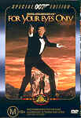

_This review was written by me for **MichaelDVD**, an Australian DVD review site that is no longer online. A capture of the site is held by the Internet Archive: **[browse it there](https://web.archive.org/web/20220217040146/http://www.michaeldvd.com.au/)**. It is reproduced here from my own copy of the site, as part of the record of what I have written._

_1981 · directed by John Glen._

## The film

_**For Your Eyes Only**_is definitely one of the better Bond films featuring **Roger Moore** as James Bond. In fact, I would even go as far to say that I would nominate either this film or _The Spy Who Loved Me_as my personal favourite Roger Moore Bond film.

First of all, the film has taken all the classic elements of a Bond flick and mixed them in reasonable proportions: exotic locations, an exciting ski sequence, a car chase and underwater scenes, lots of explosions, and of course beautiful women (including, as discovered later, **Caroline Cossey**- a male-to-female transsexual with a stage name of **Tula**- as one of the bikini-clad beauties lounging around Hector Gonzalez's villa and swimming pool).

Secondly, the plot is actually more realistic and down-to-earth compared to some of the more outrageous Roger Moore Bond films. Compared to _Moonraker_preceeding it, and _A View To A Kill_and _Octopussy_following it, it is surprisingly devoid of megalomaniacs intent on destroying the world through some far-fetched scheme. This film is also unusual in that it does not have a great emphasis on gadgets and is a bit closer in spirit to **Ian Fleming**'s novels than some of the campier Moore extravaganzas (although the film itself is not based on a Fleming novel but loosely based on two short stories - _For Your Eyes Only_and _Risico_).

The pre-titles opening sequence has James Bond paying a visit to the grave of his dead wife (a reference to _On Her Majesty's Secret Service_) and then fighting for his life in a helicopter that is being remote controlled by none other than Ernst Stavro Blofeld played by **John Hollis**(_Austin Power_fans will no doubt recognise Blofeld as one of inpirations for the Dr. Evil character). Needless to say, he succeeds not only in wrestling back control of the helicopter, but dispatching Blofeld to a very long drop down a chimney! We are then treated to **Sheena Easton**singing the theme song in the opening titles sequence (the first vocalist to actually appear in the opening credits of a Bond film).

After that, the film proper opens with a British surveillance ship carrying the ATAC (Automatic Targetting Attack Communicator) system sinking as a result of an accidental (?) collision with a mine. Needless to say, the Russkies are keen to get hold of this top-secret military device and 007 is dispatched to make sure it does not fall into the wrong hands.

Next, we see Melina Havelock (**Carole Bouquet**) arriving by seaplane to meet her parents, shortly before they are gunned down by the pilot, who turns out to be a hired gunman named Hector Gonzalez (**Stefan Kalipha**). She swores revenge, and we later find out there's a connection between the killing of her parents and the race to retrieve the ATAC. She teams up with James Bond in an exciting car chase away from Gonzalez's villa in Spain and the pair has various adventures in the skiing town of Cortina in the Dolomites, the Greek island of Corfu and a monastery perched on top of a rock (the Meteoras). Along the way, Bond encounters two larger-than-life Greek smugglers Kristatos (**Julian Glover**) and Colombo (**Topol**). They obviously have no love for each other, but who is the bad guy and who is the good?

Of course, there are still enough plot holes to sink ... well, a ship. Why o why do the sharks ignore the bleeding Bond and Havelock being towed over coral, but head straight to a goon who falls into the sea? What on Earth prompted Melina to leave a valuable oxygen tank at the bottom of the sea in one scene so that they can conveniently retrieve it later while trying to escape? The answer of course is that we are watching a Bond film, so shut up already.

Any scenes featuring the cutesy and ever so fluffy Bibi (**Lynn-Holly Johnson**) are rather excruciating to watch. I am surprised that Roger Moore seems so reluctant to give in to her girlish charms, and when I think of it, his behaviour is quite out of character for James Bond. **Sean Connery**probably would not only have gladly have obliged her, but wouldn't hesitate to use her as a human shield for any would be assailants!

Interesting trivia related to this film include:

- This is the first Bond film not featuring M (**Bernard Lee**), who died while preparing for the role. The role was not recasted as mark of respect, and the script was changed to say M was on leave.
- The character of Countess Lisl was played by Australia-born **Cassandra Harris**who, at the time of filming, was married to future Bond actor **Pierce Brosnan**.
- The ending of the film features **Janet Brown**doing an impersonation of **Dame Margaret Thatcher**(referred to only as 'the Prime Minister' in the film). Although Janet does a great job playing Margaret, I think the less said about this scene the better.

## The video transfer

Consistent with all the other James Bond Special Edition DVDs, this disc features a high quality video transfer from an immaculate film print. The transfer itself is presented in a 2.35:1 aspect ratio with 16x9 enhancement.

The transfer features excellent sharpness and detail (an example of which is the screen display in **31:53-31:59**which is clearly readable), with colour saturation good, but a couple of notches short of reference quality.

Some film grain is present throughout the feature, but was not major enough to cause annoyance.

The transfer is marred by several MPEG artefacts, mainly aliasing and shimmering, caused by over-compression. These are most noticeable in scenes featuring the seaplane near the beginning of the movie as Gonzalez flies Melina to meet her parents. The Region 1 version of DVD does not feature these artefacts, but has correspondingly higher levels of pixelation (due to the decreased resolution of NTSC compared to PAL). I suspect a higher level of MPEG compression has been applied to the R4 transfer compared to the R1 transfer to offset the higher resolution of PAL.

The main feature is accompanied by English and English for the Hearing Impaired subtitle tracks. I turned these on briefly, and noticed that the subtitles tend to appear in the black bar below the frame. There doesn't seem to be a lot of differences between the two subtitle tracks in terms of accuracy and completeness.

This is a single-sided dual layer disc (**RSDL**). The layer change occurs at **100:06** just when Bond is entering the confessional box. Although the location of the layer change is not super annoying or interrupt dialogue, it does occur in the middle of a scene and is quite noticeable. If only they could have just waited around 30 seconds, they could have done the layer change when there is a scene change (**100:31**) to Bond, Melina, Colombo and his men at the Meteoras.

## The audio transfer

There are three audio tracks, an English Dolby Digital 5.1 track recorded at the higher bitrate of 448 Kb/s, and two commentary tracks in Dolby Digital 2.0 (224 Kb/s).

Given that the film was released originally with a Dolby Stereo track, obviously some remixing has been done to provide us with a 5.1 channel track. The remix has been done with some care as it uses the surround speakers rather aggressively, and I noticed numerous examples of split surround effects and directional panning across all speakers. Overall, I was rather impressed by the result of the remix.

However, in comparison with the Region 1 version of the DVD, the audio track on this disc appears to be mastered at a lower level and generally lack dynamics and bass. I found this surprising as the audio track in both R1 and R4 versions have been encoded at the same bitrate, so I would have thought they would sound very similar (apart from the 4% speedup inherent in PAL transfers). The Region 1 audio track is by no means perfect, but the Region 4 transfer in comparison sounds rather disappointing, with explosions that generally lack "punch" and music that sounds a little bit more "muffled".

The music score by **Bill Conti**is quite listenable and even hummable but does sound dated, featuring lots of brass and disco beats. The title song, sung by **Sheena Easton**, still sounds great after all these years though.

## The extras

Consistent with the other Bond Special Editions released by Fox, this disc contains a very extensive collection of extras, and is substantially the same as the extras present in the Region 1 version of the title. I will give a five star rating to the extras, and I believe it is a very balanced mix and contain just about everything I would want, and more.

I do have an issue with the sheer amount of extras possibly impinging on the quality of the video and audio transfer, as I have noted in my comments on the video transfer quality. I know that it's a Catch-22 situation for Fox: if they cut out extras to maintain video/audio quality they will get critics complaining about Region 4 being short-changed again, and if they maintain all the extras critics like myself will moan about the sacrifice in transfer quality. Next time, as a suggestion for what to do with feature-packed Region 1 releases, how about splitting the content into a 2-disc set and not compromising on the quality of the video/audio transfer?

### Main Menu Audio & Animation

The menus are extensively animated with graphics and audio effects, and is 16x9 enhanced. However, the scene selection menus are not animated, unlike the R1 version. However, in comparison with the R1 version, the R1 menus have better graphics and are accompanied by voice-overs as well as audio effects.

### Booklet

This booklet is identical to the R1 booklet, right down to the chapter titles (which are incorrect, as the Region 4 version has different chapter breakpoints). The 8-page booklet features a cast list, production notes on the film and lots of glossy colour stills from the film, in addition to the chapter titles mentioned.

### Featurette - _Inside For Your Eyes Only_ (28:33)

This is a retrospective documentary featuring **Michael Wilson**(executive producer), **John Glen**(Director), **Arthur Wooster**(2nd unit director), Peter Lamont (production designer), **Roger Moore**(James Bond), **Dana Broccoli**, **Topol**(Colombo), **Lynn-Holly Johnson**(Bibi), **Rick Sylvester**(stuntman), **Chris Corbould**(special effects designer), and **Willy Bogner Jr.** (ski unit director). Made in 1999 and narrated by Patric MacNee, the documentary is presented in a 4:3 aspect ratio (with excerpts from the film in 2.35:1 letterbox aspect ratio).

I found the documentary quite watchable, and it was quite interesting to see how the cast and crew looks like almost 20 years after the production of the film. It does feature some on-location camera footage taken during the shooting of the film, so it is not just a "talking heads" documentary. The quality of the video transfer is quite good, apart from some minor pixelation here and there.

### Audio Commentary - _John Glen (Director) et al_

This is a commentary featuring various cast and crew members with **David Nailer**introducing each speaker and announcing each change of topic. Most of the beginning of the commentary is about cast and crew members reminiscing about other cast and crew members. The commentary does not seem to be closely related to the accompanying video images and in at least one instance the commentary introduces a scene at least half a minute before the actual scene appears, so I am wondering whether the participants were even watching the movie at the time or was it a series of separate interviews which was later edited together (I suspect the latter). I liked the plot comparisons between this film and _From Russia With Love_(another of my favourite Bond movies) and I agree with the plot parallels and similarities. The commentary even includes a short monologue on the history of the evolution of deep sea diving suits.

### Audio Commentary - _Michael G. Wilson (Executive Producer) et al_

This is also an edited commentary facilitated by David Nailer. It features interviews with various crew members in the production team, including executive producer **Michael Wilson**, production designer **Peter Lamont**, music score composer **Bill Conti**, stuntman **Arthur Wooster**, and various other crew members whose names I couldn't quite catch.

### Theatrical Trailer - _4_ (3:33, 3:40, 3:40, 1:59)

These four trailers are all very similar to each other, and pretty much feature the same scene excerpts, differing only in the ordering of the scenes within the trailer. Curiously, even though all four trailers are obviously intended to be screened in the 1.85:1 aspect ratio, only the first trailer is presented with 16:9 enhancement. Trailer 4 is presented entirely in letterboxed mode, whilst Trailers 2 and 3 are presented in letterboxed mode but with open matting at the beginning and end. All four trailers feature screen titles that extend beyond the "safe title area" which means they are likely to be cropped on most video displays.

### Radio Spots - _2_ (1:07)

This features the audio track of two radio commercials featuring the film played over a still graphic montage with a similar style to the menu backgrounds. The audio seems to be in mono and have been sourced from a low-fidelity recording as it has an annoying buzzing noise in the background throughout.

### Music Video - _For Your Eyes Only-Sheena Easton_ (2:38)

This so-called music video is simply the opening titles of the film minus the opening titles. It is presented in a 2.35:1 aspect ratio (but curiously _without_16x9 enhancement) and Dolby Digital 2.0 surround audio.

### Storyboard Comparisons - _The Snow Mobile Chase_ (1:10)

This features the camera panning in and out of various storyboard sketches of the "snow mobile chase" scene, presented in a 4:3 full frame aspect ratio. This was never filmed, but was replaced with a similar scene where James Bond is being chased by motorcycles instead of snowmobiles. This feature is accompanied by the music soundtrack from the motorcycle chase scene (a very 80s brassy number with a disco beat). I found it hard to focus on the storyboards with the camera panning in and out and wished that they had just presented stills of the storyboards. For some reason, there are three audio tracks associated with this featurette, but they are all identical.

### Storyboard Comparisons - _Retrieving the ATAC_ (1:42)

This is a very similar, and presents the storyboard sketches for the underwater sequences mixed in with the actual edited footage corresponding to the storyboards. The storyboards are presented in a 4:3 full frame aspect ratio, but the film excerpts are presented in a 2.35:1 letterboxed aspect ratio (non 16x9-enhanced). I found this feature easier to watch than the previous one, as the camera doesn't pan so much and it was interesting comparing the storyboard with the actual final scene from the film. This also has the three audio tracks.

### Gallery - Photo

This contains a large number of stills covering various production, pre-production and location shots of the cast and crew. It also includes promotional posters of the film from around the world. All the stills are presented in 16x9 enhanced mode (thankfully) but for some reason do not fill the screen (probably covering no more than 60% of the screen area).

## Region 4 versus Region 1

The Region 4 version of this disc misses out on;

- Trailer for "Tomorrow Never Dies" Playstation game
- Dolby Digital Surround French audio track

The Region 1 version of this disc misses out on;

- Nothing

From a feature-by-feature comparison perspective, I would rate both versions as pretty much the same. However, given that the R1 version has less MPEG artefacts in the video transfer and a better audio track, I would prefer the R1 version in this instance.

## Summary

**For Your Eyes Only** is one of the highlights of the Roger Moore Bond films, presented on a DVD with an above average video and audio transfer. However, the Region 1 special edition, in my opinion, has an even better transfer. The extras are quite substantial and basically are the same as the ones contained in the Region 1 version.

| Rating  | Score       |
| :------ | :---------- |
| Plot    | ★★★★ 4 / 5  |
| Video   | ★★★★ 4 / 5  |
| Audio   | ★★★ 3 / 5   |
| Extras  | ★★★★★ 5 / 5 |
| Overall | ★★★★ 4 / 5  |
