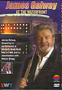

_This review was written by me for **MichaelDVD**, an Australian DVD review site that is no longer online. A capture of the site is held by the Internet Archive: **[browse it there](https://web.archive.org/web/20220217040146/http://www.michaeldvd.com.au/)**. It is reproduced here from my own copy of the site, as part of the record of what I have written._

_1999 · directed by Concert - Lovett, Sonia Documentary - Wattis, Nigel._

## The film

**James Galway** must be the most well-known flautist in recent history, having given concerts all over the world, received numerous awards for his performances and sold millions of recordings all over the world. This concert (recorded in 1999, the year of his sixtieth birthday) features James returning to his native Belfast, Ireland after nearly a decade to play in the Waterfront Hall.

The following brief biography is abridged from his official [web site](http://www.jamesgalway.com/): As a child, James Galway began playing the penny whistle before switching to the flute. He studied at various noted places including the Royal College of Music, the Guildhall School of Music and Drama in London, and the Paris Conservatory. He began his career at the **Sadlers Wells Opera** and the **Royal Opera Covent Garden** which led to positions with the **BBC Symphony Orchestra** where he played piccolo, the **London Symphony Orchestra** and the **Royal Philharmonic Orchestra** where he was Principal Flute. In 1969 he was appointed Principal Flute of the prestigious **Berlin Philharmonic** under its principal conductor **Herbert von Karajan**. James subsequently left the orchestra in the 1970s to launch a successful career as a soloist. Since then, he has travelled extensively giving recitals, performing with the world's leading orchestras, participating in chamber music engagements, popular music concerts and giving master classes. In December 1997, James Galway was appointed Principal Guest Conductor of the **London Mozart Players**.

The music pieces performed in the concert are:

|  |  |
| :-- | :-- |
| 1. Sonata – Reinecke 2. Sonata – Prokofiev 3. La Flûte de Pan – Mouquet 4. Fantaisie – Taffanel 5. Andante et Rondo – Doppler | 1. Jeanne’s Song – Overton 2. Il Pastore Svizzero – Morlacchi 3. Danny Boy – Traditional 4. The Flight of the Bumble-bee – Rimsky-Korsakov |

In this concert, James is accompanied by **Phillip Moll** on the piano. In two of the pieces - _Andante et Rondo_(**Doppler**) and _Jeanne's Song_(**Overton**), James is joined by his wife **Jeanne** (also an accomplished flautist in her own right).

I have to admit that I am not a fan of the flute and am unfamiliar with the repertoire. I did not recognise any of the music pieces on this apart from the last two. To be honest, the first time I watched this concert I was bored. Then I watched the fascinating _South Bank Show_ documentary in which James is interviewed by **Melvyn Bragg** and that really perked my interest as well as educated me on the intricacies of flute playing technique such as single/double tonguing ("No Virginia, these are not sexual techniques!"). After that, I had to rewatch the concert again and this time I enjoyed it a lot more. Needless to say, James' performance and technique in this concert is flawless and superb, but I didn't need to tell you that, did I?

## The video transfer

This transfer is taken from a video source intended for broadcast compatible with European digital TV, therefore it is 16x9 enhanced. The transfer is typical for a high quality video source, in terms of sharpness, detail (just check out the individual whiskers on James' beard and even the hairs on his hand and fingers!) and colour saturation.

However, I can detect evidence of low level video noise throughout the concert, particularly on the cloth on the suits of the performers. The video transfer has very little in terms of artefacts, mainly limited to very occasionally aliasing and very minor ringing.

There are a number of subtitle tracks on this disc. You are not allowed to select the subtitle tracks directly from the DVD player, only from the menu. Since the concert does not feature any spoken dialogue whatsoever, the subtitles only apply to the included documentary, which play immediately after the end of the concert. I turned on the English subtitles for the documentary and they were pretty accurate.

This is a single layer double sided disc (**RSDL**). There is no layer change in the middle of the programme - the layer change occurs after the end of the concert and prior to the documentary.

## The audio transfer

There is only one audio track on this disc: English Dolby Digital Stereo (2.0) at 192 Kb/s.

The audio is quite pleasant to listen to, and the soundstage features some depth, though not as much depth as an uncompressed PCM track might have. I found the imaging quite poor, and in the pieces where James is playing alongside Jeanne I found it quite difficult to separate the sound of the two flutes or even pinpoint where the flutes are coming from.

I also found that the timbre of the flutes seem to feature some high frequency harmonics that did not seem entirely realistic. This could be due to either the quality of the recording, or are artefacts introduced by the Dolby Digital encoding process (known for not being very accurate in the high frequencies).

As far as I can tell, there are no audio synchornisation issues with the disc. Needless to say, there is no surround presence or subwoofer activity.

## The extras

The extras on this disc are pretty minimal, apart from the inclusion of a 50-minute documentary.

### Menu

The menus are static and pretty basic, though colourful. They are 16x9 enhanced.

### Featurette - South Bank Show (49:32)

As I mentioned earlier, I was quite fascinated by this documentary and there is no doubt that Melvyn Bragg interviews very well. James Galway also comes across as being very down-to-earth, with a refreshing Irish accent that he has retained even after living in Switzerland for a number of years. The documentary is presented in 1.78:1 but unfortunately with no 16x9 enhancement.

The documentary starts with an introduction by Melvyn Bragg that features a really bad green halo all around him. Whether this is a video transfer artefact or present in the video source I cannot say.

The documentary shows James walking around the streets of Belfast today, meeting the locals and reminiscing about his childhood growing up in Belfast. Then we switch over to James at home in Switzerland and get a brief summary of his education and career, his time with the Berlin Philharmonic (I was shocked to know that there was a culture of hard drinking and drug taking amongst the sedate looking members of the orchestra!), his solo career, the various flutes he has (including the 24-carat gold one!) and demonstration of various flute playing techniques. It even shows him playing pop and jazz music - which sounded suspiciously like muzak to me (trust me, James, stick with your day job!).

### DVDROM - Web link

The sole DVD-ROM content on this disc appears to be a single HTML file (504 bytes) in a directory called "GALWAY." When opened, the file redirects the browser to the NVC-Arts web site ([http://www.nvcarts-video.com](http://www.nvcarts-video.com/)).

## Censorship

As far as we have been able to ascertain, there are no censorship issues with this title.

## Region 4 versus Region 1

The disc is multi-region coded for regions 2-6, and does not appear to be available in Region 1.

## Summary

**James Galway At The Waterfront** features the superb performance of the world famous flautist in a concert in his hometown of Belfast. It is presented on a minimalist DVD with a good video transfer and an above average audio transfer. The extras are primarily limited to a documentary (but it's a good one).

| Rating  | Score        |
| :------ | :----------- |
| Plot    | ★★★½ 3.5 / 5 |
| Video   | ★★★★ 4 / 5   |
| Audio   | ★★★ 3 / 5    |
| Extras  | ★★★ 3 / 5    |
| Overall | ★★★½ 3.5 / 5 |
