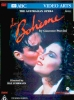

_This review was written by me for **MichaelDVD**, an Australian DVD review site that is no longer online. A capture of the site is held by the Internet Archive: **[browse it there](https://web.archive.org/web/20220217040146/http://www.michaeldvd.com.au/)**. It is reproduced here from my own copy of the site, as part of the record of what I have written._

## The film

**_La Bohème_** is, and always will be, one of my favourite operas. I don't mind viewing or listening to this opera again and again, and I own at least two different CD recordings:

1. the 1959 recording featuring **Renata Tebaldi** and **Carlo Bergonzi** with **Tullio Serafin** conducting the _Orchestra dell'Accademia di Santa Cecilia_, Rome (Decca catalogue number 448725), and
2. the 1972 recording featuring **Luciano Pavarotti** and **Mirella Freni** with **Herbert von Karajan** conducting the _Berliner Philharmoniker_ (Decca catalogue number 421049).

Over the years I have been fortunate enough to have seen quite a few different productions in the Sydney Opera House as well as on video/TV, including the one featured on this disc.

**_La Bohème_** in many respects is the "perfect" opera for beginners as well as connoisseurs alike. Broken into four acts each lasting less than 30 minutes, it does not require the audience to have super-human levels of stamina (try watching the entire _Ring_ cycle in one sitting!). It has a more than half decent plot (from the novel "_Scènes de la vie de bohème_" by **Henri Murger**, loosely based on his own experiences). The music by **Giacomo Puccini** and the libretto by **Luigi Illica** and **Giuseppe Giacosa** is of course superb. And lastly, it is a _real_ opera because at least one character dies (an opera with no deaths, a friend of mine once wryly noted, would be called "operetta"!).

Each time I watch or listen to this opera, I cannot help but start reaching for the tissues to wipe the tears in my eyes, from the beautifully touching love arias in Act One to the heart-wrenching cries of "Mimi!" from Rodolfo at the very end (perfectly timed with the musical score to create maximum dramatic impact). At the same time, it is a genuinely funny comedy, especially during the horse play scenes between the bohemians in Acts One and Four, the street scene in Act Two and even the quarrel between Marcello and Musetta in Act Three. What is truly amazing is Puccini's ability to somehow make me laugh and cry at the SAME time as he managed to mingle the comedic, romantic and tragic elements together not just once but in each of the four acts.

I am not going to provide a detailed synopsis to this opera, as it is relatively well known and there are plenty of other web sites that do, including the following:

- [Arizona Opera](http://www.azopera.com/98season/lb_syn.php3)
- [Metropolitan Opera](http://www.metopera.org/synopses/boheme.html)
- [OperaWeb](http://www.opera.it/English/Opere/Boheme/Boheme.html)
- [Pucciniana](http://www.r-ds.com/opera/pucciniana/boheme.htm)
- [New York City Opera](http://www.nycopera.com/boheme.html)

However, I will reproduce the following four-line summary, by [Rick Bogart](mailto:rick@rick.stanford.edu), taken from [OperaGlass](http://opera.stanford.edu/opera/main.html), only because it is extremely brief and surprisingly witty (as well as bringing a smile to those who _do_ know the opera!):

- Act I: Lucia, a consumptive seamstress called Mimi, comes upstairs to get a light from the poet Rodolfo. They fall in love.
- Act II: Everyone except Alcindoro has a good time at the Café Momus on Christmas Eve.
- Act III: Mimi and Rodolfo don't separate.
- Act IV: Mimi dies.

This is a rather stylish version of **_La Bohème_**, and it moves forward the timeline from the 1830s to 1957/8 to make it more appealing to a younger generation of audience perhaps not familiar with the operatic art form. Produced by **Baz Lurhmann** fresh from his acclaimed **_Strictly Ballroom_** and a few years prior to the successful **_Romeo + Juliet_**, it showcases his creative talent, impeccable timing and attention to detail. For example, Baz resolves a plot inconsistency (at the end of Act Two, none of the bohemians have enough money to pay for the evening meal and yet presumably Marcello has since he was the only one who did not buy anything earlier on) by showing Marcello being robbed by a street urchin after his attempts at flirting with the prostitutes.

The production features a fairly young and good looking cast, again adding to the appeal. For once, I can actually relax and enjoy looking at singers that passably resemble their characters and not have to suspend disbelief by looking at a stout Mimi who is more likely to die from an overdose of chocolates rather than from tuberculosis, or a Rodolfo who looks like he is old enough to be Mimi's father rather than her lover. **David Hobson** and **Cheryl Barker** are a well-matched couple, and exhibit significant amounts of on-stage chemistry, especially in Act Four.

The sets are also quite attractive, from the rotating combination of the garret interior and rooftop in Acts One and Four, to the deliberately spartan and "constructive" look of Act Three. The sets, backgrounds, and costumes of everyone except the main characters are deliberately greyish and monochromatic giving the impression that we are watching a 1950s black and white movie and allowing the eyes to focus on the colourful main characters.

The orchestra, under the baton of **Julian Smith**, delivers an acceptable if somewhat lacklustre performance. The young cast obviously could do with a little bit more experience and polish in their singing voices (my biggest disappointment was with **David Hobson**'s voice which needs a lot more strength even though he looks rather handsome as Rodolfo!), but to their credit all have above average acting abilities (and believe me, for an opera like this, acting is just as important as the ability to carry a tune). I was particularly impressed by **Roger Lemke**'s performance as Marcello and **Christine Douglas** (Musetta) delivers a more than adequate rendition of _Quando men vo_.

Overall, I'm fairly satisfied with the quality of this production. It is a perfect and gentle introduction to the world of opera for beginners, and a more than adequate performance for rabid fanatics like me.

## The video transfer

Given the age of this feature (1993), the transfer is surprising bright and clear, and relatively free of video artefacts (there is a slight glitch in the master tape at **25:58**). Presumably transferred from a broadcast-quality video master intended for TV stations, it looks and feels like a video production rather than a feature film.

The transfer is presented in it's original full-frame aspect ratio (4:3).

As an example of the detail in this transfer, check out the sweat on **David Hobson**'s (Rodolfo) face around 28 minutes into the feature (it must be pretty hot wearing all those clothes pretending to be freezing under stage lights!).

Colour saturation is acceptable, and the rather greyish/mono-chromatic look of the sets is by design. Trust me, it looked like that live in the Sydney Opera House, I was there! In Acts One/Two, the four bohemian buddies wear brightly coloured outfits which looks really vibrant on screen, creating an illusion of full-colour characters walking around against a background of black-and-white, kind of like the movie _Pleasantville_. Shadow detail is good on the spotlit area (check out the detail of Rodolfo's jacket in Act 1), and mediocre elsewhere.

Apart from the video glitch mentioned above, the transfer is relatively clean of MPEG or video artefacts. Occasionally the camera focus can be a little bit soft, but never annoyingly so. Acts One and Four features a rotating set with the interior of the garret on one side and the roof-top with the "L'Amour" neon lights on the other. Stage hands were used to rotate the set during the middle of the act to provide a quick change of scenery. In the opera hall, the rotation is fairly unobtrusive and can even be entertaining. On video, however, every effort should have been made to avoid capturing the stage hands on camera. Unfortunately, they didn't quite succeed all the time, especially during **31:06** and **83:29**.

Act Four looks soft and over-exposed in comparison to previous acts, with a yellowish tone throughout due to the bright stage lights. An attempt was made to compensate for this by the use of aggressive edge-enhancement, resulting in some posterisation and minor ringing artefacts.

I would like to make one comment on the video not related to the transfer, illustrating why it is still worthwhile attending live operatic performances as opposed to watching it on video in the comfort of your living room or home theater. Act Two of the opera is a Parisian street scene set in the Latin Quarter, and Baz Luhrmann takes advantage of the grand scale of the opera stage by making it a very busy scene with lots of people on stage and lots of things happening (quite a few of which goes beyond what the libretto actually specifies!). This allows each member of the audience to focus on the performer/activity that catches their eye and so each person can choose to "edit" the scene in their own way. This is difficult to transcribe onto a video screen, as the cinematographer is faced with the tough decision of either zooming back to capture the entire stage (and risk having none of the action viewable due to the smaller screen dimensions and limits to video resolution), or picking and choosing which part of the stage to zoom and focus on (and risk missing out on potentially interesting action happening elsewhere on stage). In this instance, the decision was to zoom as well as perform quick changes of camera angles to try and capture as much as possible. I think the editor did a good job splicing together the various pieces of action together, but I couldn't help but be disappointed by being able to see only part of the action (I did remember being nearly overwhelmed by the complexity of the choreography on stage during this scene and most of that has been lost on the video). A suggestion to future opera DVDs - use the multiple angle feature!!!

This disc does not feature subtitle tracks, but does have the English subtitles superimposed on the video transfer itself. I found this extremely annoying (and I am marking down the overall video rating because of this), since I found the subtitles distracting and would have preferred the ability to switch them on and off. Unfortunately, unless the producers have access to a video master without the superimposed subtitles, I don't think this issue can be easily resolved.

The subtitle text is presumably the same as, or close to, the _surtitles_ used in the opera hall during live performances, and is about average in terms of the quality of the translation, but substantially _below average_ in terms of the completeness of the translation. Unfortunately, some of the most lyrical and poetic qualities of the libretto, particularly during the love arias and duets, have not been captured in the subtitles. My suggestion if you are watching this DVD: learn Italian, or have access to an English translation of the libretto.

The packaging does not

## The audio transfer

Although the audio transfer is superficially clean and detailed, I was ultimately disappointed by the audio quality. It seems to lack "oomph", or a sense of "being there", in comparison with the two CD recordings that I own. Also, the equalisation mix, contributing to ther overall "sound" of the audio track, sounds a little 'off', almost as if it has been equalised for TV transmission (and it probably was) with an emphasised midrange and rolled off bass and treble.

There are two audio tracks on DVD, both in Italian (the original language of the libretto). The first, and default track is MPEG2 stereo and the alternate track is Dolby Digital 2.0 stereo, both encoded at 192Kb/s. I listened to both audio tracks. The default MPEG2 track sounds flat and lacking in dynamics in comparison to Dolby Digital. The Dolby Digital track creates a very limited and not very convincing soundstage across the front speakers but was also ultimately unsatisfying, although I can't quite put my finger as to why. There seems to be a lot of background clicks during Act One, but I suspect these are stage noises coming from the set rather than audio transfer problems.

Immediately after playing this DVD, I put on one of my CD recordings (the Freni/Pavarotti/Karajan version) and the increase in audio quality was astounding. Although the Karajan recording has a tendency towards mid to high end shrillness, the stereo field was much more stable, expansive and realistic. If I closed my eyes, I can pin-point almost exactly where the location of each singer is in front of me on the CD, but on the DVD it was hard to tell since all the voices appeared to come from a very muddy centre. The differences in dynamics between the CD recordings and the DVD audio track is substantial. Even in the 1959 recording, the orchestra swell following Marcello's algother too brief solo moment towards the end of Act Two overwhelms me like a brilliant flash of light. In comparison, the same passage on the DVD sounded well, ho hum.

There are no audio sync problems with the DVD. As the audio tracks are in stereo, there is no surround activity in the rear speakers. Due to the de-emphasis of low end bass in the recording, I doubt that a sub woofer will be required to perform it's duties.

## The extras

The DVD is not exactly brimming with extras, but I didn't expect to see any and was pleasantly surprised to see the inclusion of a synopsis and cast and crew biographies. Unfortunately, the introduction (if I recall correctly, presented by Christopher Lawrence) and the between-the-acts featurettes that accompanied the ABC simulcast of this production (on Channel 2 as well as ABC Classic FM) have not been included, and that's a real shame.

The scene selection is text only (the first few words of the first line sung in each chapter), but the titles of the chapters are provided in both Italian and English - a nice touch.

### Synopsis

This is a set of stills presenting an adequate synopsis of each of the four acts of the opera. The synopsis to each act is presented over multiple pages in yellow text superimposed on a background stills taken from the relevant part of the act.

### Biographies-Cast & Crew

This is a set of stills presenting some biographical notes on **Baz Luhrmann**, **David Hobson** and **Cheryl Barker**.

## Region 4 versus Region 1

The Region 4 version of this disc misses out on;

- Nothing

The Region 1 version of this disc misses out on;

- MPEG2 audio track
- (possibly) synopsis and biographies

My preference is for the Region 4 version to support the local industry but essentially there are no real differences between the two.

## Summary

**_La Bohème_** is an interesting and well-worth watching production of one of Puccini's best-loved operas presented on a DVD with an acceptable audio and video transfer. Some people, like myself, may find the embedding of the English subtitles into the video stream to be annoying.

The video quality is above average.

The audio quality is average.

The extras on this DVD are limited to some stills of the opera synopsis and details on the cast and crew.

### [Ratings (out of 5)](../ReviewersGuide/RatingsGuide.html)

© [Chris Tham](mailto:ChrisT@michaeldvd.com.au) (read my [biography](../ReviewerProfiles/ChrisT.asp)) 20 January 2001

| Rating  | Score        |
| :------ | :----------- |
| Plot    | ★★★★★ 5 / 5  |
| Video   | ★★★½ 3.5 / 5 |
| Audio   | ★★★ 3 / 5    |
| Extras  | ★ 1 / 5      |
| Overall | ★★★½ 3.5 / 5 |
