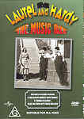

_This review was written by me for **MichaelDVD**, an Australian DVD review site that is no longer online. A capture of the site is held by the Internet Archive: **[browse it there](https://web.archive.org/web/20220217040146/http://www.michaeldvd.com.au/)**. It is reproduced here from my own copy of the site, as part of the record of what I have written._

## The film

I have to admit up front - the only reason I am reviewing this DVD is because of a mistake — my mistake. When the list of available DVD titles came up, my eyes came across "_<strong>Music Box</strong>_" and I searched [IMDB](http://www.imdb.com) and decided this must be the 1990 movie about a Hungarian immigrant accused of being a war criminal directed by <strong>Costa-Gavras</strong>_._ I thought it was probably worth watching. Needless to say no one was more surprised than I when I finally received the DVD.

**Stan Laurel** and **Oliver Hardy** are, of course, the famous comedy duo that have made numerous films from the 1920s till the 1940s. Their film career has spanned the transition from silent films to "talkies" and this DVD presents three well known sound shorts (produced by **Hal Roach**) circa 1932-33. The "official" web site for Laurel and Hardy is [www.laurel-and-hardy.com](http://www.laurel-and-hardy.com).

Stan Laurel was born **Arthur Stanley Jefferson** on 16 June 1890 in Ulverston, England and died on 23 February 1965. Oliver Hardy was born **Norvell Hardy** on 18 January 1892 in Harlem, Georgia and died on 7 August 1957.

The following descriptions of the three films are taken from [Laurel and Hardy Central](http://members.aol.com/lhcentral/). Note that the DVD packaging errorneously refer to Busy Bodies and Towed in a Hole as "silent shorts" but they are actually sound shorts (each around 20 minutes in length) and are presented on the DVD with dialogue.

### The Music Box

Written and filmed December, 1931. Released by MGM, April, 1932. Produced by Hal Roach. Directed by James Parrott. Three reels.

Cast: Stan Laurel, Oliver Hardy, Billy Gilbert, Lilyan Irene, Sam Lufkin, Charlie Hall, William Gillespie, Gladys Gale.

Laurel and Hardy are to deliver a piano to a house which sits atop an enormous flight of stairs. Their attempts to carry the piano up the stairs results in it rolling and crashing into the street below several times, often with Ollie in tow. They finally succeed in getting the piano in the house, where they make a shambles of the living room. The owner of the house, Professor Theordore Von Schwarzenhoffen, returns and is outraged at what he finds. He attacks the piano with an axe, but regrets his actions when he discovers it was a present from his wife.

The _<strong>Music Box</strong>_ is the only Laurel and Hardy film to be honored with an Academy Award, for "Best Short Subject," 1931-32.

### Towed in a Hole

Written and filmed October-November, 1932. Released December, 1932. Produced by Hal Roach. Directed by George Marshall. Two reels.

Cast: Stan Laurel, Oliver Hardy, Billy Gilbert.

Fish peddlers Laurel and Hardy decide to buy a boat so they can catch their own fish, eliminate the middleman, and have the profits go to the fish. They buy a rundown old boat, and have little success at repairing and painting it.

### Busy Bodies

Written and filmed July, 1933. Released by MGM, October, 1933. Produced by Hal Roach. Directed by Lloyd French. Two reels.

Cast: Stan Laurel, Oliver Hardy, Charlie Hall, Tiny Sandford.

The Boys work at a lumber yard, which has a plentiful supply of tools, paint, nails and electric saws. You get the idea.

## The video transfer

The sound shorts presented on this DVD have been lovingly preserved (transferred from the decaying and flammable nitrate 35mm film into safety film) and in some cases restored by the **KirchGroup**. Although these transfers are not without blemishes (there are numerous film marks throughout the transfer), suffice to say that they probably are the best possible transfer given the age and quality of the originals. They are presented in the original (full frame) aspect ratio.

In general, I was pleasantly surprised by the quality of the transfers. Shadow detail and sharpness are probably below average compared to say a 1950s black & white film, but quite good considering the film source. The transfer is reasonably detailed - for example I can read (with some difficulty) lettering on the piano crate and wagon.

The B&W version of _The Music Box_ suffers from some telecine wobble during the opening titles, but mercifully the actual feature itself is quite stable.

The colour version of _The Music Box_ suffers from colour smearing throughout the entire feature, and generally looks less sharp and detailed than the B&W version. The transfer also seems to have cropped the right edge of the film slightly.

I would say I greatly prefer the B&W version over the colour version, and I am by no means a purist. The difference in quality is rather like comparing a live TV broadcast against a VHS recording. The colour version suffers from what I can only describe as "colourisation artefacts", of which I can quote several glaring examples:

- Hardy's skin tone around **1:40** is definitely yellowish
- The piano crate around Laurel's hands from around **2:00** to **2:10** seems to be black & white instead of colour
- Professor Schwarzenhoffen's skin seems to be very greenish around **9:45**.

The quality of the transfer for the additional sound shorts (_Towed in a Hole_ and _Busy Bodies_) are similar to that for the _Music Box_. There's a glaring film mark in **10:40** in _Towed in a Hole_ and telecine wobble around **4:17** in _Busy Bodies_.

There appear to be no MPEG artefacts present in the transfer, although with the colour version it's hard to tell since the transfer is rather blurry.

All three shorts seem to be subti

## The audio transfer

The sound quality of the three shorts are about average considering the age of the films, ie. tinny and monophonic. Even though the DVD packaging claims that the colour version of The Music Box has a remixed stereo soundtrack, the soundstage still seemed very monophonic and centre focused to me.

There are two audio tracks, English and Spanish. Both tracks are mono, but are encoded in Dolby Digital 2.0 at a bitrate of 192 Kbps. I listened to only the English track.

Dialogue quality seems adequate considering the age of the films and I can detect no audio synchronisation problems. However, there seems to be an "echo" in the dialogue around **23:50** in the colour version of _The Music Box_.

## The extras

You can either regard this DVD has a three feature DVD with minimal extras, or a single feature DVD with loads of extras. I have chosen to review this DVD as containing three features and one extra.

### Menu

These are well presented and looks really sharp. They are non-animated. Curiously, the menus for the _Towed in a Hole_ and _Busy Bodies_ seem to default to subtitling on.

### Photo Gallery - _Hats Off_

This contains six stills from the lost film _Hats Off_. Interestingly, one of the stills features the same steep staircase that we saw in _The Music Box_.

## Region 4 versus Region 1

As far as I can tell, this DVD is the same around the world, apart from PAL/NTSC formatting. I can't find any reference to this DVD on Amazon, but a fan site states that the DVD will be released in the UK on 2 April 2001.

## Summary

**Laurel and Hardy: The Music Box**, is a good DVD for Laurel & Hardy fans. It is presented on a DVD with the best possible audio and video transfer that you could expect given the age of the film sources. It has a well presented set of extras, including _Towed in a Hole_, _Busy Bodies_, subtitles, and a photo gallery for _Hats Off_.

### [Ratings (out of 5)](../ReviewersGuide/RatingsGuide.html)

© [Chris Tham](mailto:ChrisT@michaeldvd.com.au) (read my [biography](../ReviewerProfiles/ChrisT.asp)) 4 February 2001

| Rating  | Score       |
| :------ | :---------- |
| Plot    | ★★½ 2.5 / 5 |
| Video   | ★★½ 2.5 / 5 |
| Audio   | ★★½ 2.5 / 5 |
| Extras  | ★★★★ 4 / 5  |
| Overall | ★★★ 3 / 5   |
