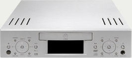
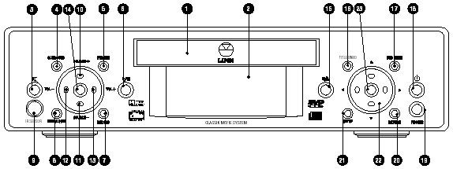
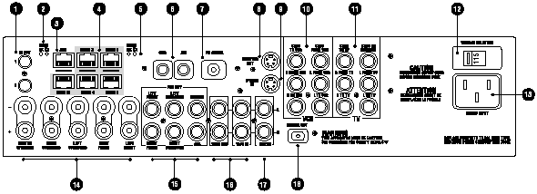
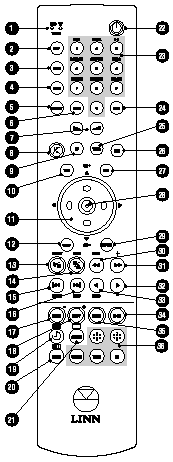

_This review was written by me for **MichaelDVD**, an Australian DVD review site that is no longer online. A capture of the site is held by the Internet Archive: **[browse it there](https://web.archive.org/web/20220217040146/http://www.michaeldvd.com.au/)**. It is reproduced here from my own copy of the site, as part of the record of what I have written._

There seems to be a definite market for "lifestyle" systems, probably due to factors such as an increasing trend towards people living in smaller homes and cosy apartments (with no space for bulky "audiophile" sized equipment) and a genuine desire for electronics that look "good" and blend in more with the overall interior design. Typical audio and home theatre gear seem downright ugly - who wants to live in a house that looks like the cockpit of a Boeing 747 or the mixing desk of a recording studio? (OK, OK, maybe _some_ of us do!)

The Danish manufacturer Bang & Olufsen was the first manufacturer to emphasize the exterior design of their equipment, but it was speaker manufacturer Bose that pioneered the "lifestyle" concept - all in one entertainment systems that are small and pretty - making a statement about decor and design as well as an audio/visual one. Pretty soon Bose were joined by other manufacturers, notably Nakamichi, and now virtually every major Japanese electronics manufacturer have jumped into the act with mixed results.

Still, I was surprised to discover than Scottish manufacturer Linn has now also entered into the arena with the Classik range. Surprised, because the whole concept of "lifestyle" systems (with the implicit but never acknowledged understanding that these systems sacrifice quality for design style) seem alien to the philosophy of specialist "audiophile" manufacturers. Indeed some manufacturers seem to revel in the fact that their equipment sounds good but looks ugly - as if daring their customers (almost invariably male) to test the "wife acceptance factor."

And in the totem pole of exclusive and revered audio manufacturers, Linn is right up there. For many years, the Linn Sondek LP12 turntable was _the_ record player to buy, and even now (an updated version of the LP12 is still manufactured today) some will say it is the best turntable money can buy. Since then, Linn has expanded into offering the full range of audio equipment including CD players, amplifiers, speakers and even cables and recordings.

Still, I did not expect Linn to release a lifestyle system, but then I did not expect Linn to ever release a CD player (given founder **Ivor Tiefenbrun**'s vitriolic anti-CD bashing when the format was initially launched) which just goes to show how wrong I can be. Linn's rationale, as explained in the [www.classik.com](http://www.classik.com)web site, is that most lifestyle systems today (meaning those produced by their competitors) "disappoint" when performing their primary function - reproducing sound. Linn wanted to offer a "no compromise" lifestyle system - something that sounds as good as "audiophile-quality" separate components, but at a fraction of the size (though sadly not a fraction of the price) and looks good as well.

There are currently two systems in the range - a "Music System" consisting of an integrated CD player, AM/FM tuner and a stereo integrated amplifier. The "Movie System" that I reviewed has all that, plus it plays DVDs (with integrated Dolby Pro Logic, Dolby Digital and dts decoding) and has a 5 channel amplifier (the LFE channel needs to be externally amplified, typically by a powered subwoofer). There is also a matching loudspeaker package consisting of "Unik" bookshelf speakers and the "Afekt" subwoofer.

By now, you have probably realised that Linn has a strange "affection" for naming all their products with the letter "k" somewhere in the name, thus risking potential confusion with Ikea who also share the disturbing tendency to k-ize their products. Then again, you might like it, particularly if you live in a trendy apartment in King's Kross (sorry!) filled with Ikea and Linn and you drive a Mercedes-Benz Kompressor!

Because this unit has many functions in addition to being a DVD player, I tested the unit in various configurations corresponding to typical installations:

- The unit as a standalone player connected to a Panasonic 61cm TV and using the TV speakers (I wonder how many owners will configure it this way!)
- The unit as the hub of a full 5.1 home theatre system consisting of five matching Linn Unik speakers and Afekt sub-woofer.
- The unit as a stereo system connected to my B&W CDM7NT front speakers.
- The unit as a DVD player/preamplifier connected to the EXT 5.1 inputs of my Denon AVR-3300 receiver and B&W CDM 7NT/CNT speakers and ASW2500 subwoofer. In this configuration, the unit was also connected to the Sony VPL-VW11HT LCD projector using both composite video and S-video connections.

I also tested the tuner capabilities of the unit briefly and it is adequate with reasonable sound quality. Tuner presets can be named alphabetically, but there are no advanced features such as RDS (no big loss, as RDS take up in Australia is pretty patchy). I did not test the unit's multi-room connectivity and operation.

Linn advertises the Classik as a "5.1 75 watt/channel" system, but I think that's stretching the truth a little bit. Yes, the unit will deliver 75 watts per channel - as long as you are only driving 1 channel at the time and the speaker impedance is 4 ohms. The actual technical specifications read:

"Power output 75W into 4 ohm load per channel 40W into 8 ohm load per channel Maximum power output 75W distributed to all channels"

In other words, it's probably equivalent to a 20 watt stereo amplifier when driving two channels at once. Still, this is not too shabby for a unit of it's size. I would recommend using high efficiency speakers, and not listening to DVDs at reference level! Given that the target market for lifestyle systems will probably use the unit most of the time at relatively low volume levels ("background listening") the unit should perform just fine.

One thing that annoyed me is that the unit is fan cooled, and the fan will definitely come on after about 15 minutes to half an hour of listening. The fan is rather loud and annoying, so I recommend putting this unit behind a glass door to shield the noise.

Linn advertises the Unik as a "full range" speaker and that's also somewhat stretching the truth. Unless of course you consider a frequency response of 80Hz to 20KHz ± 3dB as "full range." I suspect Linn is trying to differentiate these speakers from "satellite" speakers which typically have a bass response that disappears below 100-120Hz or so. The frequency response of these speakers are actually quite decent (comparable to typical bookshelf speakers) given that these speakers are quite small, coming somewhere between a satellite and a bookshelf speaker in terms of size.

## What's In The Box

The Movie System is available in five "designer" colours: Koral Blue, Silver, Arctik White, Black and Baltik Green. I was supplied with a Silver review unit, which matches the silver finish of my Panasonic TV and the DGTEC digital TV set top box.

The review unit appears to be a production version in retail packaging. The following items are included in the box:

- The unit itself
- An IEC three wire Australian power cord
- remote control (battery included)
- set up guide for remote control
- owner's manual (multiple languages), A5 sized spiral bound soft-cover
- two warranty registration booklets (for US and non-US markets)
- sample CD from Linn Records
- Linn product catalogue
- an accessories kit including FM and AM antennae and two pairs of BFA speaker plugs for use to connect to a stereo pair of speakers

When initially powered up for the very first time, the unit asks you to select a region for the tuner (US, Japan, Europe etc.). This configures the frequency "gap" or "spacing" between adjacent AM radio stations when the tuner is scanning for stations. I selected US at random because I could not find Australia only to discover I should have selected Europe or Japan (as the unit scans in 10kHz steps instead of 9kHz which is the spacing for AM stations in Australia). Unfortunately I could not find any way of getting back to this menu to reconfigure the tuner settings and of course it is not documented in the manual.

## Front Panel

As can be seen, the Classik Movie System is a very compact and stylish unit indeed, looking more like an elegant games console than a piece of home theatre equipment, and the silver colour blends in very well with the recent trend towards silver for TVs and VCRs. The extremely small size means it can comfortably fit into spaces where traditional "rack-sized" units cannot. It does however require some clearance behind the unit (to allow for cables to be plugged into the rear panel sockets) as well as on top of the unit (which have ventilation holes - the unit is fan-cooled just like a PC).

The front panel is very symmetrical, with two clusters of buttons arranged on either side of the disc tray (1) and fluorescent display (2):

On the left cluster, we have the IR Sensor (9) as well as the following buttons (from left to right):

- Mute (3)
- Surround (4) (Selects a surround sound format)
- Main/Local (8) (selects mode for multi-unit installations)
- Volume - (12)
- Source + (14)
- Adjust (10) (Selects a function to be adjusted and also modifies the function of the VOL - / + keys)
- Source - (11)
- Volume + (13)
- Format (5) (Selects between PAL, NTSC or automatic operation)
- Record (7) (Selects a source for recording)
- Play/Pause (6)

On the right cluster, we have a headphone socket (19) as well as the following buttons (from left to right):

- Stop/Eject (15)
- Title/Band (16) (Enters a DVD title menu, or switches tuner band)
- Setup (21)
- Navigation arrow keys (22)
- Enter key (23)
- DVD Menu (17)
- Return (20)
- Soft Power On/Off (18)

Wow! This is a lot of buttons on the front panel for a supposedly "lifestyle" unit, but through clever design the panel does not look cluttered at all and the buttons are reasonably intuitive and usable. I really like the front panel arrangement, which allows me to basically operate the unit without using the remote control (just as well, because the remote is pretty confusing to use as I will detail below.)

The fluorescent display is a fully dot matrix screen, which means it is flexible enough to show a variety of information in different font sizes and also allow the use of graphics. Unfortunately, it also means some of the status messages are in a tiny blocky font that is hard to read.

The display does a really cute animation when you turn the unit off - it shrinks the display to a single horizontal line, then shrinks the line to a single dot, whilst progressively dimming the display. In other words, it "emulates" the behaviour of an old style TV. Then you get an icon representing the unit in "sleep" mode.

## Rear Panel

I received the "US" version of player, which has RCA sockets for audio/video connections to the TV and VCR instead of SCART. This suited me just fine, since I don't have any equipment that uses SCART but if your TV and/or VCR does you may want to inquire whether you can get the "European" version.

The unit has a reasonable set of input and output connections, with the major omissions being component video output and co-axial digital out. From left to right and top to bottom, we have:

- IR OUT 1, 2 (1) (Infrared flasher connectors: Allows the remote control to drive additional devices by routing signals received from a remote control to a repeater)
- MAIN RX TX CONNECT LED indicators (2) (Indicate signals being transmitted between units in a multi-unit system)
- RJ-45 ACC KNEKT connector (3) (For installing unit in a LINN multi-room KNEKT system)
- RJ-45 ROOM 1 - 4, MAIN IN CONNECT connectors (4) (For linking additional Classik Movie units in a CONNECT system)
- ROOM RX TX CONNECT LED indicators (5) (Activity lights)
- AM aerial connectors (6)
- BNC FM aerial connector (7)
- S-video output (8)
- S-video input (9)
- RCA TV composite video/audio left/audio right input and output connectors (10)
- RCA VCR composite video/audio left/audio right input and output connectors (11)
- Voltage selector switch (12)
- IEC three prong power socket (13)
- BFA 5 channel speaker output connectors (L, C, R, Lr, Rr) (14)
- RCA PRE OUT line output connectors (L, C, R, Lr, Rr, LFE) (15)
- RCA TAPE OUT, TAPE IN connectors (16)
- RCA AUX IN (17)
- Toslink optical digital out (18)

You can probably guess from the multiple RJ-45 connectors that Linn allows you to "network" up to four Classik Movie units in a multi-room installation. One unit will act as a "master" and the other units can act as "slaves" reproducing the same audio/video source as the master, or they can also act in "local" mode whilst connected to a "master."

I quite like the provision of an IEC power socket allowing you to substitute different length (and also higher quality) power cables. I did not like the use of "BFA" speaker connectors, since BFA plugs are uncommon in Australia. The advantage of using BFA connectors is that they reduce the chances of speaker wire shorts which can damage both amplifiers and also speakers.

The unit comes with two pairs of BFA plugs which is only enough for connecting to one pair of speakers, which means if you have a 5.1 speaker setup you need to hunt around for an additional three pairs. Fortunately, if you buy the matching Linn Unik/Afekt speakers, these come with speaker cables appropriately terminated using BFA plugs on one end and bare wire on the other.

## Remote Control

The remote control is fairly long and thin and contains quite a lot of buttons:

- Indicator LEDs (shows when a signal is being transmitted and also the mode the remote is currently in) (1)
- DISP (display) (2) (Changes the time display on the front panel when playing discs.
- GOTO (3) (Title, chapter, track or time selection)
- SURR (surround) (4) (Selects sound formats)
- ADJUST (5) (Selects a function to be adjusted)
- STORE (6) (Stores disc and tuner information)
- Volume +/- buttons (7)
- Mute (8)
- TV (9) (Sets remote into TV mode)
- TITLE (10) (Enters a DVD title menu)
- Navigation arrow keys (11) (also works as TV channel +/-)
- SETUP (12)
- Play/Pause (13) (also works to select tuner preset)
- Stop/Eject (14) (also used to select a different frequency in Tuner mode)
- Chapter Skip buttons (15 and 16) (also used to display tuner signal strength and to select radio band)
- AUDIO (17) (used to cycle through different audio tracks on a DVD)
- SUB-T (18) (used to cycle through subtitle tracks on a DVD)
- Power On/Off (22)
- Numeric keypad (23) (also used in conjunction with the SHIFT (24) key to access a variety of esoteric functions)
- TUNER (25) (Selects Tuner mode)
- AUX (26) (This does not select the auxiliary input source, contrary to the labelling. It actually cycles through available input sources other than DVD/CD or TUNER: AUX, TAPE, TV, VCR)
- DVD (27) (Selects DVD/CD mode, I also found that it acts as DVD Menu button whilst a disc is playing)
- Enter (28)
- RETURN (29) (This restarts current playing track from the beginning)
- Rewind (30) (also scans for radio signals) and Fast Forward (31) (also selects the next tuner preset)
- Scan backwards (32) (also selects MONO mode in Tuner) and forwards (33) at various speeds
- ZOOM (34) (cycles through different magnification settings for the video image on a DVD)
- ANGLE (35) (cycles through available camera angles on a DVD)
- The remaining buttons (19-21 and 36) are either non-functional or used when the unit is networked as part of a Linn KNEKT setup.

I really dislike this remote control for many reasons:

- There are too many buttons, and they are all too small and indistinguishable from one another.
- None of the keys are illuminated, which means the remote is very difficult to operate in the dark.
- The remote control has three "modes" (DVD, TUNER, TV) and different keys behave differently depending on the mode. Designers should realise by now that modes confuse people. For example, the remote control has a TV mode which allows it to operate your TV (such as change channels or teletext functions). Now, this may sound like a good idea (allowing you to avoid using multiple remote controls - the bane of every home theatre enthusiast) but the implementation leaves much to be desired. First of all, you can easily put the remote into TV mode (just press the TV button). However, to get out of TV mode you have to use the remote to select a different source, such as Tuner or DVD. This sounds okay until you realise the volume up/down keys will operate on the TV set instead of on the Classik in TV mode. This means you are forced to change sources before you can change the volume whilst watching TV! I had to end up avoiding putting the remote in TV mode and continue using two remote controls. Besides, the teletext buttons are not implemented in the US version of the unit (which was the version I reviewed).
- Founder Ivor is fond of quoting Einstein's maxim: "Everything should be as simple as possible, but no simpler." Well, I wish the designers would actually follow this maxim. Basic DVD operations such as Play/Pause/Stop/Eject are actually quite clumsy to do, because of a strange decision to overload these functions on a minimal set of buttons. The Play and Pause functions are on the same button, and Stop/Eject on another button. This means that if a disc is playing and I want to eject it (a very common scenario for me) I have to press the Stop/Eject button three times - once to stop the disc from playing (this puts the player into Resume mode), a second time to cancel Resume mode, and a third time to finally eject the disc.
- Some keys don't behave in an intuitive manner corresponding to the label. For example, the AUX button doesn't select the auxiliary input source, it actually cycles across the input sources other than DVD/CD or Tuner (TV, VCR, Aux, Tape, ...). TV does not select the TV input source - it only puts the remote control into TV mode. If you haven't read the manual, try and guess what the RETURN key actually does!

## Manual

A big, thick spiral-bound A5 sized manual is supplied. However, upon closer inspection the thickness is due to the fact that English, French, German, Spanish, Italian, Dutch and Portuguese versions are supplied. The English portion of the manual is just under 50 pages, which makes this a fairly brief manual for a unit with so many functions.

I don't like the manual very much either. It omits documenting key aspects of the unit's operation, such as it's ability to play Super Video CDs and MP3 CD-ROMs. What it does document is sometimes done in a very cryptic and uninformative style. For example, this is what the manual has to say about the "Picture Mode" setup parameter:

"If when viewing a DVD the screen image flickers, choose a different option; either AUTO (suitable for most DVDs), HI-RES (high resolution) or N-FLICKER (non-flicker)."

Helpful, no? After reading that, I _still_ have no idea what this setting is supposed to do. It would seem to imply that the unit upconverts to HDTV or progressive scan (neither of which it does). I suspect this setting applies different parameters to the vertical aliasing filter in the Video DAC.

## Set-Up Menu

The on-screen setup menu is accessed by the SETUP key. I would have liked the menus to be displayed on the display panel as well (which should be possible given that it is a dot-matrix display) to allow the flexibility of configuring the unit without a display monitor.

The setup parameters are divided into four categories:

- GENERAL SETUP
- SPEAKER SETUP
- AUDIO SETUP
- PREFERENCE

GENERAL SETUP allows you to adjust the following:

- TV Display (4:3, Letterbox, 16:9)
- TV Type (Multi, NTSC, PAL) - the unit will do NTSC to PAL and PAL to NTSC conversions
- Picture Mode (Auto, Hi-Res, N-Flicker)
- Angle Mark (On, Off)
- OSD Lang (various)
- Captions (On, Off)
- Screen Saver (On, Off)
- Video Out (S-Video, Composite, Both) - this applies to the active signal sent via SCART

SPEAKER SETUP allows you to configure which speakers are connected to the system, whether they are full-range ("Large") or not ("Small"), and their distance from the listener (for time alignment adjustments). There is even a test tone function to allow you to adjust relative channel level (±10) - unfortunately no test tone is provided for the LFE channel which means you can adjust the level of the subwoofer relative to the other speakers.

AUDIO SETUP allows you to adjust the following:

- Audio Out (Analog, SPDIF/Raw, SPDIF/PCM) - unfortunately the analog outputs are muted if you turn on digital output which means you can't A/B the unit's DAC against an external DAC
- Op Mode (Line Out, TV Out) - I'm not sure what this does, and the manual does not help
- Dual Mono (Stereo, L-Mono, R-Mono, Mix-Mono) - allows you to choose which channel to listen for DVDs that contain different languages on each channel
- Dynamic - allows you to apply dynamic compression to the audio signal. I liked the fact that you can vary the level of compression instead of this being an on/off parameter.
- Pro Logic (Off, On, Auto) - determines whether the unit will apply Pro Logic decoding to stereo signals. Auto means the unit will respect the surround encoding flag on the Dolby Digital audio track.
- LPCM Out (LPCM 48K, LPCM 96K) - determines whether the player will send a 96/24 signal out via the digital output or downconvert

PREFERENCES allows you to adjust the following:

- Audio - selects preferred language for DVD audio tracks
- Subtitle - selects preferred language for DVD subtitle tracks
- Disc Menu - selects preferred language for DVD menus
- Locale - I suspect this sets the region code for the unit. The manual says this parameter is "not currently functional"
- Parental - sets parental control level
- Password - sets password for changing parental control level
- Defaults - resets the unit to original factory settings
- Smart Nav - not currently functional

The preferred language selections in the PREFERENCES menu are by language name, but only for a few selected languages. If your desired language is not one of them, you have to enter a numerical code. The list of available codes are not provided in the manual, but downloadable from [www.classik.com](http://www.classik.com).

## Video Playback

My major gripe with this player is the lack of support for RGB and/or component video output. The highest quality signal you can get out of this player is S-Video. Apart from that, the player has decent video output quality, however I noticed a tendency for low level noise (looks like a textured pattern on the screen) when I connected it to the projector on both S-Video and composite video. I suspect the player's video output signal is not strong enough given I have very long cable runs to the projector. In any case, I did not observe the "patterning" on a 61 cm Panasonic TV.

I calibrated the player by adjusting the display settings of my Sony VPL-VW11HT LCD projector using the [Video Essentials](http://www.videoessentials.com/dvd.htm) test disc (NTSC). It was clear from viewing the [Snell & Willcox Test Chart](http://www.snellwilcox.com/internet/reference/testchart.html) (Video Essentials Title 15 Chapter 12) that the DVD player is capable of extracting maximum horizontal and vertical resolution from the DVD format. I did not notice any video artefacts or abnormality viewing this test pattern (apart from the usual moire effects and slight coloration in the moving zone plate).

The Black level on NTSC discs is set at the NTSC 7.5 IRE level but I suspect the Black level for PAL is set to 0 IRE as I've noticed PAL discs tend to look somewhat darker than NTSC discs after calibration. This will be an issue for you if you have a mixture of PAL and NTSC discs and your display only allows one calibration setting.

The review unit does not seem to have any region zone markings. It seems to handle a number of Region 1, 2 and 4 discs, so it appears to be a multi-zone capable player.

The unit passed the usual set of "torture" discs that I fed into it, with one minor exception - it has a minor variant of the ["chroma upsampling error."](http://www.hometheaterhifi.com/volume_8_2/dvd-benchmark-special-report-chroma-bug-4-2001.html) This is evident is very slight streaking on the outer edges of red objects (particularly the chequerboard and the red tin lid in Toy Story R1 Chapters 3 and 4). However, unlike some other players I have reviewed, the chroma bug is hardly noticeable on this unit. Unless you are extremely picky, I don't think you will be find it annoying.

I did notice some instances of macro-blocking in various places that I don't recall noticing on my reference player (a Pioneer DV-626D).

The Fast forward/reverse buttons on the remote control will scan at 4X normal speed, but if you press the Scan forward/reverse buttons, you can cycle through multiple speeds including 2X, 4X, 6X and 8X. Similarly, if you press the pause button, the scan buttons then allow to cycle through slow scan speeds including 1/2, 1/4, 1/8 and 1/16. There doesn't appear to be frame advance functionality.

The layer change speed on this player is impressively fast, typically near-instantaneous with only a very minor interruption in the playback even on known problematic discs.

## On Screen Display

The on screen display is accessed via the DISP key and is pretty basic. One press gives title and chapter information (current and total) plus time elapsed in title. Subsequent presses of the button provides title remaining, chapter elapsed, chapter remaining. There is no total title or chapter length display, or layer/bitrate indicators.

## Standards Conversions

The Format button on front panel as well as the Setup menu will allow the player to do NTSC to PAL and PAL to NTSC format conversions. I was impressed by this since not many players implement this feature. The player does format conversions reasonably well - I did not detect any obvious and recurring signs of framing or scaling errors.

The player can be set to convert from Dolby Digital/dts/MPEG to PCM on the digital out connections.

## CDR & Video CD

The manual mentions support for both CD-R and CD-RW audio discs, but is silent about Video CD compatibility. I tried putting in a commercially pressed Video CD (_James Bond Man With The Golden Gun_, a legal copy bought in Hong Kong) and was very pleasantly surprised to discover the player will load and play Video CDs without complaints. I also tried a home-burned Video CD on a CD-R and that worked as well.

## Audio Playback

I evaluated the unit playing CDs in various configurations:

- As a CD transport using digital output - no problems were encountered.
- As a CD player using analog outputs - this is a great sounding player, in fact one of the best CD players I have ever heard! The sound is slightly "hot" but does not contain a trace of harshness typically found on most CD players. I think this unit will compare very favourably even to expensive high end CD players (such as the Linn Genki) which is an amazing achievement. The sound is quite open and warm and yet highly detailed.
- As a standalone unit connected to stereo speakers - many of the advantages of the unit as a CD player is transferred intact. The built-in amplifier sounds quite reasonable but a bit under-powered, as I notice some transients being blurred and a slightly underwhelming bass reproduction. OK, it may not be as scintillating as a high end power amplifier, but it sounds better than some Japanese mid-fi units I've encountered.
- As a standalone unit connected to Linn Unik speakers - the sound is not bad, certainly I was expecting far worse, but it wouldn't make me want to sell my B&W CDM7NTs. The overall sound is slightly on the dull side, and kind of "boxy." Fidelity and accuracy is quite reasonable, and the speaker has no problems reproducing human voices (very important for home theatre!). Bass response was surprisingly quite good, although upon close listening there is a lack of deep bass and there is a noticeable "boom" around 100Hz. I suspect the speakers de-emphasize the presence region to reduce apparent harshness. Music is best listened without the Afekt subwoofer which tends to over-emphasize the "boominess."

I also evaluated the player's Dolby Digital and dts decoder as well as digital output playing DVDs on a variety of configurations. The built in decoders are quite good and comparable to high end AV processors, and certainly far superior to those in-built to some DVD players I have encountered.

The unit performed reasonably well as a standalone home entertainment system complete with Unik/Afekt speakers in a 5.1 speaker configuration. The built-in amplifiers are probably under-powered for reference level listening, and the speakers are a little too boomy and dull for my taste but more than adequate for low level listening and brings a reasonable degree of excitement to action movies.

I also tested the player subjectively for audio synchronization by playing the usual problem discs such as _The Wedding Singer_ R4 (remaster #2) and _Matrix_ R1. This player is one of the better players I have encountered in terms of audio synchronization and I did not notice any issues on both discs.

By the way, the unit has a number of surround modes (including Stereo+Sub, Phantom, 3 Stereo, As Mix) but these are only applicable for DVDs and CDs. Also, Dolby Pro Logic decoding is only available for DVDs and CDs, and in particular you cannot apply Dolby Pro Logic to TV and VCR audio sources which is a pity as occasionally TV programs and video tapes are surround encoded. From this I deduce that the unit does not digitise audio inputs from external sources. Whilst this reflects a "purist" attitude that would be consistent with Linn's philosophy, it does reduce the usefulness of the unit to the lifestyle target market.

## MP3 Playback

Here is another pleasant surprise not mentioned in the manual. The Classik will in fact play MP3 CD-Rs, and the implementation is quite good, complete with an "Explorer"-like on-screen display of folders and tracks. The navigation keys can be used to navigate in and out of folders and to select MP3 files to play. The player even reads multi-session discs correctly on both CD-R and CD-RW. The player will support constant bit rate MP3 files with a transfer rate as low as 40 Kb/s. Although the player recognised variable bit rate MP3 files, it does not play them properly (apart from 1 example recorded with 1% quality) and the player will "hang" trying to load them. Fortunately, the hang can be rectified by turning the player off and on.

| **Test Disc Format** | **Results** |
| :-- | :-- |
| CD-R >100 MP3s (128 Kb/s)in multiple, nested subdirectories | Found all files |
| CD-R >100 MP3s (128 Kb/s) in root directory | Found all files |
| CD-R with MP3s (CBR ranging from 20-320 Kb/s, VBR ranging from 1%-100% quality), 1 WMA and 1 WAV file | Successfully played all constant bit rate files between 40-320 Kb/s. Recognised CBR 24 Kb/s as an MP3 file but was not able to play Did not recognise CBR 20, 32 Kb/s files Recognised VBR files but can only play file recorded at 1% quality, player crashed and hung on other VBR files Did not recognise non MP3 files |
| Multisession CD-RW (2 sessions each containing MP3 files) | Found all files in both sessions |

## Disc Compatibility Tests

I tested the player against a number of discs to highlight potential problems: _Specific Tests_

| **Disc** | **What Is Tested** | **Results** |
| :-- | :-- | :-- |
| The Matrix R1 Follow The White Rabbit | Tests active subtitle feature, seamless branching, ability to load hybrid DVD/DVD-ROM and audio sync. | YesYesYesYes |
| The Wedding Singer R4 remaster #2 Audio Sync | Opening scene tests audio sync. | Yes |
| Terminator: SE R4 Menu Load | Tests ability to load complex menu | Yes |
| Independence Day R4 Seamless Branching | Tests ability to handle seamless branching (Chapter 3) | Yes |
| The Patriot R1 RCE | Tests ability to handle RCE protected DVDs in Auto multizone mode (if applicable). | Not tested |
| Toy Story R1 chroma upsampling error | Chapter 3 and 4 tests for absence of chroma upsampling error | No |

## User Convenience Features

| Screen Saver | Yes |
| :----------- | :-- |
| Zoom         | Yes |

## Overall

### The Good Points

- one of the best CD playback quality I have ever encountered at any price point
- decent Dolby Digital and dts decoders
- very fast layer changes
- good looks and small size, plus the unit is available in 5 colours to suit your preferences and decor
- very usable front panel controls and versatile flourescent display
- ability to be networked with other Classik units or in a KNEKT system for multi-room installations

### The Bad Points

- terrible and non-intuitive remote control
- unhelpful manual
- no RGB or component video output
- under-powered power amplifier
- noisy fan
- minor chroma upsampling error

## Features At A Glance

| **Video**           | Component Output   | No  | RGB Output   | No  |
| :------------------ | :----------------- | :-- | :----------- | :-- |
| **Audio**           | DTS Output         | Yes | MP3 Playback | Yes |
| **Plays CDRs**      | Yes                |     |              |     |
| **Conversion**      | PAL-60             |     |              |     |
| **Inbuilt Decoder** | Dolby Digital, dts |     |              |     |

## In Closing

The Linn Classik may not be the least expensive lifestyle unit you can buy, and the remote control certainly annoyed me, but it is definitely a "no-compromise" unit particularly in terms of sound quality. The CD playback quality ranks as one of the best I have every heard at any price point, and the DVD playback is okay but not exceptional. The built-in amplifiers are a bit under-powered but sound quite reasonable. The matching set of speakers will do the job, but are probably the weakest components in the audio chain. If you buy this system and don't have a lot of home theatre experience, I would definitely recommend that it be professionally installed and calibrated as the manual is quite obtuse.

## [Ratings (out of 5)](Ratings.html)

| **Performance**     | ★★★★  |
| :------------------ | :---- |
| **Build Quality**   | ★★★★  |
| **In Operation**    | ★★★   |
| **Compatibility**   | ★★★★★ |
| **Value For Money** | ★★★   |

## Technical Specifications (Manufacturer Supplied)

| **Product Type:** | Integrated DVD-Video, Audio CD player, AM/FM tuner and 5.1 channel pre/power amplifier |
| :-- | :-- |
| **Region:** | Multi-region player |
| **Signal System:** | PAL / NTSC |
| **Serial Number Of Unit Tested:** | 715314 (Assembled, tested and packed by Steven Bolger) |
| **MPEG Decoder:** | ? |
| **Audio Frequency Response:** | N/A |
| **Signal to Noise Ratio:** | FM @ 93.5MHz (60 dBmV signal) –65dB AM @ 1MHz (50 dBmV signal) –45dB CD/DVD/Amplifier: N/A |
| **Dynamic Range:** | N/A |
| **Total Harmonic Distortion:** | <0.03% @ 10W into 4 Ohm load (1 channel driven) <0.03% @ 10W into 8 Ohm load (1 channel driven) |
| **Dimensions:** | 320 mm (w) x 325 mm (d) x 80 mm (h) |
| **Weight:** | 5 kg |
| **Price:** | \$5,999 |
| **Distributor:** | Audio Products Australia 67 O'Riordan Street Alexandria NSW 2015 |
| **Telephone:** | (02) 9669-3477, 1800 642 922 |
| **Facsimile:** | (02) 9669-3477, 1800 246 262 |
| **Email:** | info@audioproducts.com.au |
