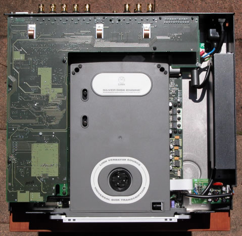
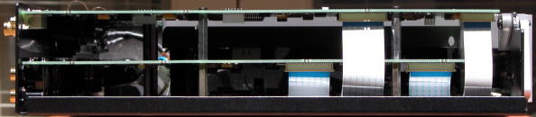
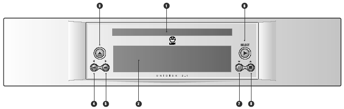
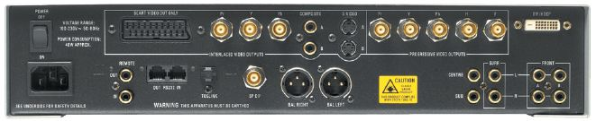
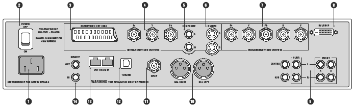
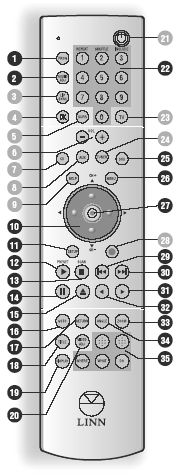

_This review was written by me for **MichaelDVD**, an Australian DVD review site that is no longer online. A capture of the site is held by the Internet Archive: **[browse it there](https://web.archive.org/web/20220217040146/http://www.michaeldvd.com.au/)**. It is reproduced here from my own copy of the site, as part of the record of what I have written._

The Scottish company Linn is justifiably famous for the quality of their source components: the Sondek LP12 was for many years regarded as the best turntable ever made by many audiophiles, and even today is still regarded as one of the better decks around. Similarly, the CD12 is regarded as one of the finest CD players that money can buy. However, until recently, Linn has not really released a DVD player (apart from the Classik Movie System which was an all-in-one lifestyle system).

Well, Linn has finally entered the market not just with a plain DVD player but a universal player that will play the following formats:

- DVD-Video (with inbuilt decoders for Dolby Digital and dts)
- DVD-Audio (with inbuilt decoder for MLP)
- Super Audio CD (with support for both stereo and multi-channel tracks)
- Video CD
- Super Video CD
- CD audio ("Redbook")
- DVD-R/RW (burned as DVD-Video or DVD-Audio)
- DVD+R/RW (burned as DVD-Video or DVD-Audio)
- CD-R/RW (burned to contain either CD Audio, MP3 or JPEG files)

The following media/formats do _not_ appear to be supported:

- HDCD encoded CDs
- "DivX" MPEG-4 discs
- Windows Media Player 9 content (such as the high definition transfer in the R1 _T2 Ultimate Edition_)
- ISO 9660 formatted CD-ROMs containing Windows Media Format (WMA) or HighMat
- Kodak Photo CD

The Linn Unidisk 2.1 (reviewed here) is the smaller sister of the Linn Unidisk 1.1, which was released earlier in the year. Despite the model number, the 2.1 is not a "better" model than the 1.1. The Unidisk 1.1 remains Linn's flagship universal player, and represents Linn's idea of state of the art in terms of audio and video playback. The "2" in Unidisk 2.1 means that Linn has made some compromises in the audio section to make the player more affordable, but the video quality (the ".1") is on par with the earlier model. Still, the player retails for a staggering A\$13,999, so it's not exactly a "budget" model from Linn!

Unlike some high end manufacturers, Linn has chosen not to base their universal players on an existing design. Both the Unidisk 1.1 and 2.1 are all-Linn designs from the transport to the analog stages, and even the power supply is a fast switching Linn design, which explains why the player is relatively light in weight - just under 5kgs. (The power supply tends to be the heaviest component in a player apart from the chassis).

Linn has taken particular care in designing their own transport, disc navigation and decoding unit (in partnership with Sony and ESS) and they are very proud of it. So proud that Linn has given a name to it: the Silver Disk Engine™, and are willing to license it to other manufacturers on an OEM basis. Why the emphasis on the transport and navigation, given that major manufacturers like Sony, Pioneer and Panasonic are willing to sell "generic" DVD transports for next to nothing?

The answer is Linn's fanatical obsession with pitch accuracy and the minimization of jitter, plus a desire to simplify disc navigation. (in line with Linn's founder **Ivor Tiefenbrun**'s fondness for quoting Einstein's maxim, "Everything should be as simple as possible, but no simpler.") It is no secret that a significant contributor to the excellent performance of the CD12 is due to the low jitter in Linn's CD engine, and Linn is anxious that no compromises are made for their universal players. Secondly, I have been very frustrated by the poor navigation of DVD-Audio discs on most players (including the difficulty of directly access groups and tracks without using a video display) so it is good to see that Linn is similarly concerned and willing to fix the problem.

Linn seems unusually secretive about the technology underlying the Unidisk players. Unlike Denon, who is happy to detail every component used in their designs, Linn's product brief does not provide a single clue on what's "underneath the hood" or even providing technical specifications such as frequency response, distortion or dynamic range. Linn wants us to judge the player by how it looks and sounds, and not by what's in it or how it measures.

I'm not a big believer in laboratory measurements either, but I was very curious to find out about the technology and components used in the design. Fortunately, I do know how to use a screwdriver, and the unit is relatively easy to assemble/disassemble (which should make it easier to service) so I managed to satisfy my curiosity, as I will reveal later in this review. For those of you who are impatient, rest assured, I was very impressed with what I saw - top quality state of the art components used throughout, with the possible exception of the audio D/A converters (thus explaining why this unit is a "2" rather than a "1").

## What's In The Player

Opening up the unit revealed a very dense layout, with at least three layers of circuit boards stacked on top of each other wrapped around the Silver Disk Engine (also called "Linn Verbatim Source - Universal Disk Transcription").

The black box on the right contains the switching power supply. Underneath the Silver Disk Engine is the digital processing circuit board containing the transport logic, disc decoding and player navigation logic. This board contains the ESS Vibratto Videodrive ES6038F universal DVD decoding chip, as well as various Sony transport logic chips such as the CXD 3068 and BA5981FP (commonly found on Sony DVD players).

The following side view (taken from the left of the player) reveals three layers of circuit boards stacked on top of each other:

The bottom board contains the digital processing circuitry as described previously.

The middle board contains the audio and remote/RS232 circuitry. The player uses 4392KEP D/A converters, plus Burr Brown INA2134UA differential line receivers and BBOPA2604AU op amps for the analog audio stage. The analog stage is pretty decent, but I wished Linn had used better-speced D/A converters, such as the Cirrus Logic 4397 or some of the more recent Burr Brown chips. Perhaps this is the reason why the Unidisk 2.1 is cheaper than the 1.1.

The top board contains the video circuitry. The player contains pretty much state-of-the-art components: I noticed a Silicon Image Sil504CM208 PureProgressive video deinterlacer, plus 2 Analog Devices ADV7300AKST 12 bit/108 MHz 4:4:4 video D/A converters featuring Noise Shaped Video processing. I think one is used for interlaced video output, and the other for progressive. DVI/HDCP output is performed by a Silicon Image SiI170BCL64 PanelLink transmitter. Video signal output is performed by Analog Devices AD8062 300MHz amplifiers.

Build quality is excellent. All circuit boards are uncluttered and of high quality, and feature surface mounted components exclusively. There are no hand soldered connections and connections between circuit boards are made using ribbon cables. Because of Linn's use of a switching power supply, voltage regulators are used extensively in the design, and I was pleased to see very good quality regulators being employed.

## Front Panel

The Unidisk 2.1 has a fairly minimalist front panel, consisting of (from left to right and top to bottom):

- Opens/closes the disc drawer (3)
- Disc drawer (1)
- SELECT Starts playback, selects an item in a menu (6)
- Skips/searches backwards, navigates left in a menu (4)
- Skips/searches forwards, navigates right in a menu (5)
- Front panel display (2)
- Pauses playback, navigates down in a menu (7)
- Stops playback, navigates up in a menu (8)

Obviously, Linn wants to encourage you to leave the player turned on all the time, as the power switch is at the rear, and there is no soft power switch on the front panel. The remote control does have a power toggle button, but I discovered it is not functional.

I really like the front panel layout, which is very logical. The 6 buttons are surprisingly very functional and allow you to navigate through most discs without a remote control. The Play, Pause, Stop and Chapter Skip buttons also double as menu navigation/selection buttons for DVD-Videos and DVD-Audios (whilst in a menu).

The front panel display is a blue 128 x 64 dot matrix. It is divided into three lines and three columns of text. The top line display the column headings, the middle line displays current play information, and the bottom line indicates the type of disc (eg. CD-DA Stereo, SA-CD Stereo, SA-CD Multi, DTS, ...) or current audio track on a DVD-Video or -Audio ("DVD Menu" is displayed when no audio tracks are being played).

For DVD-Video and Audio, the three columns for the middle lines are for current Group/Title, HH:MM:SS counter, and current track/chapter.

For CDs and SACDs the three columns are for total number of tracks, HH:MM:SS counter and current track. For SACDs, the middle line can also be used to scroll through SACD album and track title information. The player does not support CD or DVD text.

Linn has cleverly included a light sensor and dynamically adjusts the brightness of the display depending on ambient light. Therefore, the display is bright when the lights are turned on and dim when the room is darkened. Very neat! I wish other manufacturers will follow suit.

## Rear Panel

From left to right and top to bottom, we have:

- Power switch (2)
- SCART video out (3) - only component video is supported, S-Video and audio signals are not supported
- Interlaced YPrPb video out (4) - BNC
- Composite video out (5) x 2- RCA
- S-VIDEO (6) x 2
- Progressive YPrPbHV video out (7) - BNC
- DVI/HDCP video out (8) - this is not currently functional
- Mains input (1)
- REMOTE OUT / IN (14) - for installing the unit in a KNEKT system.
- RS232 OUT / IN (13) - for remote control via PC or touch-screen device.
- TOSLINK digital audio out (12) - optical
- SPDIF digital audio out (11) - BNC
- BAL RIGHT / LEFT (10) - balanced XLR outputs for front 2 channels only.
- Line output connectors (9) x 8 - RCA Line outputs for multi-channel/2 channel

There should be more than enough output connectors to suit even the most complex home theatre set-up. I particularly like the use of BNC rather than RCA connectors which should result in cleaner signals, and the provision of XLR balanced audio outputs (alas, only for the front left/right channels).

The provision of a DVI/HDCP digital video output should please videophiles and provide some future proofing. Unfortunately, this connector is not currently functional. I also noticed the absence of Firewire/i.Link connectors for digital audio output, although there are not many surround processors/receivers that will accept Firewire so it's not a major shortcoming.

## Remote Control

Linn provides a programmable remote control that can be used to control your other devices, such as surround processor, TV, CD player and tuner. A booklet is provided to allow you to configure the remote for other devices, but unfortunately the remote control does not have a learning mode.

I have mixed feelings about the remote. My first impression - too many buttons, all too small, and undifferentiated. Then I discovered some of the buttons are non-functional, including the all important power button.

However, there are some positive aspects of the remote. It "feels right" from a size and weight perspective. I know this seems an insignificant issue, but I really hate holding remotes that are too small, or big, too heavy, or light. This one has a really nice feel to it.

The buttons are reasonably logically laid out. I will describe only the functional buttons (numbered on the right in solid black). The non-functional buttons are numbered using greyed circles.

Starting from the top, we have the PROG (program) button (1) which in combination with the 1, 2, 3 buttons gives you access to REPEAT, SHUFFLE and INCLUDE functions.

The numeric keypad (22) is a standard one, and is used for direct group/title/track/chapter access (in conjunction with the GOTO button).

The AUDIO ADJ (adjust) button (2) cycles through available audio streams on a disc.

The DVD button (25) ensures the remote is in DVD mode, as opposed to the other modes (CD, AUX, TUNER, TV) for controlling other equipment.

The MENU button (26) selects the Root Menu on the disc.

The arrow keys (10) and Enter (27) performs menu navigation and selection, and is helpfully arranged as a circular keypad.

The SETUP button (11) enters/exit player setup screens.

The PLAY (12), STOP (13), Skip Previous (29), Skip Next (30), PAUSE (14), OPEN/EJECT (15), Scan Backwards (32), Scan Forwards (31) performs the usual functions.

The GOTO button (16) allows direct access into Titles/Groups and Chapters/Tracks on discs. The RETURN button (17) moves to the previous menu on discs. The ANGLE button (34) cycles across available DVD viewing angles. The ZOOM button (33) cycles through various magnification settings. The TITLE button (18) selects the TITLE menu on DVDs, but if held for more than a second will cycle through available subtitle tracks on the disc. The VIDEO ADJ button (20) cycles across PAL/NTSC/Native video format output. Finally, the DISPLAY button (19) cycles through elapsed/remaining time information on both the front panel display as well as on screen display.

## Manual

The manual is typeset is landscape A4, with most pages containing two columns of text. It contains English, German, French, and Italian versions of the text. The English section is only 30 pages.

The manual follows what must be a Linn tradition of terseness and minimal information. I really wish Linn would spend just a little bit more time documenting some of the setup parameters which can be rather cryptic.

I would strongly recommend that you read the manual carefully because some functions are not intuitively obvious or behave differently from other manufacturers' players.

## Set-Up Menu

The set-up menu is accessed by pressing the Setup button which brings up a nested menu of setup parameters. You navigate across menu selections using the up and down arrow keys. Pressing the right arrow key on a setup parameter will allow you to change it (confirmed using the ENTER button). Exiting the setup menu is done by pressing the Setup button again or by navigating to the "Exit Setup" menu item.

There are four categories of setup parameters:

- General Setup
- Progressive Scan Setup
- Audio Setup
- Preferences (only available if there is no disc loaded)

The "General Setup" sub menu has the following parameters (default in bold):

- OSD language (**English**, French, German, Italian, Spanish)
- Aspect Ratio (4:3, Letterbox, **16:9**)
- Video Standard (**Native**, NTSC, PAL)
- NTSC Type (**North American**, World)
- Prim. Display Device (**Interlaced**, Progressive, HDCP)
- Interlaced Out (RGB, **YPbPr**)
- Colour Level (**Default**, High, Low)
- Picture Mode (**Auto**, High Resolution, Non-flicker)
- Angle Mark (On, **Off**)
- Closed Captions (On, **Off**)
- Screen Saver (**On**, Off)

Most of these setup parameters are obvious, others less so or have "gotchas." Selecting RGB for interlaced out, for example, disables component video output (you have to use the SCART socket). I'm not sure what "NTSC Type" does - selecting either option did not affect how my projector interpreted the video signal. Colour level does NOT select Black IRE level as I thought but affects the video output levels (1V vs 0.7V peak-to-peak). Picture Mode is another cryptic setting which I haven't really figured out (I suspected it had something to do with either Bob vs Weave deinterlacing, but this parameter is also available on the Linn Classik Movie System which is an interlaced only player).

The "Progressive Scan Setup" sub menu has the following parameters:

- Colour Resolution (**High 4:4:4**, Normal 4:2:2)
- Dither (On, **Off**)
- Video Detection (**Auto**, Progressive, Interlaced)

The ability to turn off colour upsampling is interesting, and unique to Linn. "Dithering" is apparently a video processing filter that reduces the effects of posterization and macro-blocking, and "Video Detection" simply controls the deinterlacing mode on the Silicon Image Sil504.

The "Audio Setup" sub menu contains the following parameters:

- SPDIF Out (Off, **Raw**, LtRt PCM)
- LPCM Out (LPCM 48K, **LPCM 96K**)
- Channel Setup (2 channel, **5.1 channel**)
- Dual Mono (**Stereo**, L-mono, R-mono, Mixed-mono)
- Midnight Movie (On, **Off**)

There doesn't seem to be any options for fine tuning whether Dolby Digital/dts/MPEG gets converted to LPCM on the digital outputs, or the ability to selectively turn on and off the optical vs coaxial digital outputs. In any case, I discovered the player will always convert MPEG audio to LPCM on the digital outputs, even when Raw is selected.

The "Preferences" sub menu contains the following parameters:

- Audio (**English**, French, Spanish, German, Italian, Others)
- Subtitles (**English**, French, Spanish, German, Italian, Others)
- Disc Menu (**English**, French, Spanish, German, Italian, Others)
- Parental (1, 2, 3, 4, 5, 6, 7, **8**)
- Password (**3308**)
- Defaults
- Disc Nav. (**Menu On**)

This is a reasonable set of setup parameters. What is missing compared to other players are any signs of bass or channel management for the analogue multi-channel outputs, or extensive video display adjustment settings.

There are also a number of lower level setup parameters called "User Options." These allow you to do things like force a brightness level for the front panel display, plus RS232/IR settings and how the player displays SACD text. You enter this setup mode by holding the Eject button on the front panel whilst there is no disc in the player. You adjust the user options by either the arrow keys on the front panel or remote. The user options are displayed on the front panel only, there is no on screen display.

## Player Operation

I found the player reasonably easy to operate, with some minor annoyances. Controls function as I would expect. Interestingly, pressing Play during normal play will replay the current track/chapter. I did not notice any DVD-Audio keys (such as Next Page and Group).

The scan forward/scan reverse buttons give you multiple playback speeds (2X, 4X, 6X and 8X) which you can cycle by pressing the button repeatedly. You will exit scan forward/rewind operation by pressing "Play." Pressing the forward/rewind buttons when the player is paused will activate several speeds of slow scans (1/2, 1/4, 1/8 and 1/16). You can also advance to the next and previous frames by pressing and holding the Skip next/back buttons whilst in Pause mode. To exit Pause mode, you have to press the Play button. Once I got used to it, the buttons are surprisingly effective in cueing up to the right spot.

The GOTO button is quite useful, allowing direct access to a particular group/title/track/chapter as well as direct access by elapsed time. Although the function requires an on screen display to prompt you, if you've memorised the correct sequence you can do this "blind" (very useful when doing direct group/track selection on DVD-Audio discs!). There are also Repeat All, Repeat A-B, Shuffle/Random play and programmed track selection functions. There is no Repeat Track function.

I found a number of operational annoyances.

The subtitle track selection is very flaky and non-responsive because the function is overloaded with the DVD Title Menu function. You have to press and hold the Title button and eventually you will toggle through available subtitle tracks but it's very cumbersome and often the player will not respond to the function.

Using the GOTO function to select a different Group on a DVD-Audio disc is also sometimes flaky. Sometimes, even when the correct Group is selected, the front panel display does not update the Group number until the player changes tracks.

The review unit also has a fairly temperamental transport and often does not recognise discs (displaying "Unknown/No Disc") unless I eject the tray and try and reseat the disc within the tray. I also didn't insert a disc properly once and the tray jammed whilst closing - very ugly, but fortunately I was able to force the tray open with no apparent damage to the tray or the disc.

I also had a few problems playing discs. Sometimes, the DVD menus will not navigate properly, eg. not being able to select menu items in an animated menu. Sometimes DVD-Audio discs will not play properly, resulting in stuttering audio. CDs will also occasionally not play properly. Although the track appears to be in progress, no sound is generated on the analogue audio outputs. Very occasionally, I can hear dropouts whilst playing Super Audio CDs.

Many of these problems are no doubt due to the problematic transport and disappear once the tray is ejected and closed. Others (such as the inability to navigate animated DVD menus) appear to be a software bug caused by leaving the player on continuously since the only way to make the player navigate the menus is to power cycle the player.

Linn seems unusually defensive about the player's compatibility with discs, to the point of issuing the following note in the owner's manual:

"Whilst every effort has been made to ensure universal compatibility with all approved disc types, it is impossible to guarantee full operation of every function of the Linn UNIDISK 2.1 player with every disc that is on sale now or in the future. We have tested many of the disc types that are currently available but many discs that are on sale at this time do not conform to the published and accepted formal specifications. For this reason, we are unable to accept any responsibility for the player being unable to playback any particular disc. If you have discs that do not play on the Linn UNIDISK 2.1, which are subsequently found to play on other brands of player, then this does not imply that the Linn UNIDISK 2.1 is in any way at fault. There are many web sites that display details of discs that have known playback problems and we suggest that you consult with this published data before you make any judgments regarding the Linn UNIDISK 2.1’s playback abilities. We welcome the receipt of all suspect discs as this may assist us in ensuring that the Linn UNIDISK 2.1 continues to develop but cannot accept discs from end users on the basis that we have made any warranty about being able to learn how to play them."

## Video Playback

I calibrated the player by adjusting the display settings of my Sony VPL-VW11HT LCD projector) using the [**_Video Essentials_**](http://www.videoessentials.com/dvd.htm) test disc (NTSC). The player outputs video signals that are close to reference/nominal levels, as the display adjustments were at or close to default settings.

I only tested the player in progressive scan mode (for both PAL and NTSC titles) using component video output. I did briefly put the player in interlaced mode to verify that it outputs interlaced video correctly. The DVI/HDCP port was not active at the time of review, so I am unable to comment on that feature.

The review unit is multi-region enabled and I had no difficulty playing a number of Region 1, 2 and 4 discs (including R1 RCE discs). Even discs that do not play properly on my other players - the Pioneer DV-626D - (including _When Harry Met Sally_ and the layer change of several discs including _Fried Green Tomatoes_) and the Panasonic DVD-RP82 (_Live At The Basement: Eric Bibb_) play perfectly fine on the Unidisk 2.1. I am not sure whether retail units will be multi-region enabled out of the box.

As you would expect from a player at this price, the display quality is stunning and certainly as good as or better than any other player that I have tested to date. The output is quite "sharp", with minimal ringing, and the player seem to have the capability of extracting even the smallest amount of detail from DVDs.

In terms of overall picture quality the Unidisk 2.1 looks very very similar to the Denon DVD-2900 that I recently reviewed. No surprises there, since both players use the same deinterlacer (Sil504) and Video DAC (ADV7300AKST). However, I felt that the Unidisk 2.1 probably has a very slight edge in terms of additional detail. Gibbs effect and grain seem ever so slightly more prominent on the Unidisk than my memory of how the DVD-2900 looked like. When I compared the picture quality to my HTPC running WinDVD 5, the results were once again almost neck to neck but I would be tempted to say the Unidisk looked ever so slightly more natural in the graduation of colours and low level detail.

In terms of smoothness in pans and movement on screen, the Unidisk reminded me strongly of the Denon DVD-3800 and DVD-A1. Again, no surprises here, since all three players share the ESS Vibratto decoder chip. Full screen pans were eerily and almost artificially smooth, however every now and then there seems to be a micro-stutter that breaks the smoothness.

One advantage the Unidisk has in being a later generation player is that I could detect no instances of the dreaded chroma upsampling bug, so it looks like ESS has fixed the problem once and for all.

However, the player does not handle 4:2:0 interlaced chroma upsampling well. Strictly speaking this is not a bug, but it is annoying nevertheless as you can see it in many R1 animated menus with lots of red, such as the R1 Special Edition of _**Hunt For Red October**_. This puts the player at a disadvantage compared to Faroudja-based progressive scan DVD players such as the DVD-RP82 since the Faroudja chipset resamples and filters the chroma channel and hence "masks" the problem.

This player must implement a fairly large memory buffer that minimizes the "freeze" effect of a layer change transition. Layer changes are extremely smooth on this player and will be unnoticeable for most discs, even problem ones like _**Fried Green Tomatoes**_ R4. However, on DVDs that split a film across several titles (including the above-mentioned _**Fried Green Tomatoes**_), I noticed that title transitions still incur a slight pause.

In summary, the player currently provides State Of The Art video playback quality through the analog video outputs. It will be interesting to see what the DVI/HDCP output quality will be like once Linn enables the port.

## Progressive Scan

The player "officially" support both PAL and NTSC progressive scan. Given that it uses the Silicon Image Sil504 chip for deinterlacing (which is one of the best chipsets out there) I did not expect any issues and the player essentially delivered a flawless progressive scan display devoid of the usual artefacts (such as combing errors) typical of the cheap players in the marketplace.

## On Screen Display

The on-screen display is accessed while the DVD playing by pressing the "Display" button on the remote control. It's pretty basic and cycles through the following information over two lines of text on repeated presses of the Display button:

- Chapter/Track Elapsed in HH:MM:SS
- Chapter/Track Remaining in HH:MM:SS
- Group/Title/Disc Elapsed in HH:MM:SS
- Group/Title/Disc Remaining in HH:MM:SS
- Track name (SACDs only)

I would have liked to see Total Time (title or chapter) as well as a bitrate indicator. Given that the player is extremely smooth on layer changes due to memory buffering, I would have also liked to see a layer indicator.

## Standards Conversions

The player fully supports conversion from PAL to NTSC and NTSC to PAL. The NTSC to PAL (50 Hz) conversion is handled really well, in the correct aspect ratio with minimal juddering. The PAL to NTSC conversion is handled less well, appearing slightly letterboxed and with some juddering on pans.

The player can be set to convert from Dolby Digital/dts/MPEG to PCM on the digital out connections. However, this is an all or nothing proposition - you can't enable dts to PCM but not Dolby Digital to PCM for example.

Although the player seems to recognize MPEG )|( Multi-channel tracks I couldn't get it to output MPEG 5.1 (from my R4 copy of _**Fly Away Home**_) either through the analogue outputs (it downmixes to 2 channels) or via the digital output (it converts to 2 channel PCM). This is not a serious omission given that very few MPEG )|( Multi-channel DVDs have been released.

## CDR & Video CD

The Unidisk 2.1 had no problems playing a selection of CD-R and CD-RW discs that I inserted into it, including gold and blue/green discs recorded at 8X speed. It was able to correctly recognize CD-Rs containing:

- PCM audio tracks ("Redbook" format)
- dts music CD (encoded in pseudo "Redbook" format)
- ISO9660 CD-ROM containing MP3 audio files
- ISO9660 CD-ROM containing JPEG image files

In addition, the player had no problems recognizing the following types of commercially pressed discs:

- Video CD (various freebies from magazines)
- DVD-Video containing PCM 96/24 audio track (also known as a "Digital Audio Disc" or DAD) ("_Casino Royale_")

## MP3 and JPEG Playback

The player's MP3 and JPEG playback implementation is similar, featuring an "Explorer"-like on-screen display of folders and tracks. The navigation keys can be used to navigate in and out of folders and to select MP3 files to play. The player even reads multi-session discs correctly on both CD-R and CD-RW. The player will support constant bit rate MP3 files (as long as the transfer rate is at least 40Kb/s or above) as well as variable bit rate MP3 files. However, it does not recognize ID3 tags, MP3 play lists or (Joliet) long file names (all MP3 files are displayed using 8 character names).

| **Test Disc Format** | **Results** |
| :-- | :-- |
| CD-R >100 MP3s (128 Kb/s) in multiple, nested subdirectories | Found all files |
| CD-R >100 MP3s (128 Kb/s) in root directory | Found all files |
| CD-R with MP3s (CBR ranging from 20-320 Kb/s, VBR ranging from 1%-100% quality), 1 WMA and 1 WAV file | Successfully played all constant bit rate files between 40-320 Kb/s. Does not recognize CBR files with bitrates less than 96Kb/s. Recognized and successfully played all VBR files Did not recognize non MP3 files |
| Multisession CD-RW (2 sessions each containing MP3 files) | Found all files in both sessions |

The player's JPEG image display capability allows you to view JPEG still images (presumably scanned from your photo album or taken using a digital camera) burned onto an ISO9660 CD-R. The implementation is very similar to the MP3 playback menu - showing folders stored on the disc and filenames of images with a .JPG extension. In fact, you can even play a disc containing a mixture of MP3 and JPEG files correctly. It will display successive images in a slide show with a fixed delay between images. The player successfully recognised a disc with multiple folders, and more than a 1000 images in a single folder.

The player will automatically resize the JPEG image to fit within an NTSC progressive frame. Depending on the original size of the image, the player may puts a black border around the images, which means the effective resolution of the images is a bit less than NTSC. For example 1024x768 displayed as 3:2 letterboxed with no vertical black bars, but 1152x864 images were displayed with a black border around the image,

## Audio Playback

Given the price point of this player, I was very interested to find out what the audio performance is like. The balanced audio outputs for the front left and right channels look interesting, but unfortunately my amplifier only accepts single-ended connections.

The initial sound after I've connected it was a bit "closed" and sterile, but even then I noticed how "smooth" the player sounded and yet highly detailed.

I then proceeded to "burn in" the player for a period of at least 6 days - two days each on a CD, SACD and DVD-A respectively in continuous repeat mode.

After that, the player's sound opened up considerably and sounded more dynamic. The overall characteristic of the player still remained, which is a sense of smoothness or liquidity. The player sounded very confident and "relaxed" playing all sorts of material and music styles, and never faltered with even complex, difficult messages.

It would be easy to think that all this smoothness is hiding something, and yet this player can be incredibly detailed, without sounding clinical. Time and again I noticed little bits of detail and nuances in various instruments and background music parts in just about every disc I listened to. Complex passages never sound muddy, and the player has a habit of breathing new life into even bad recordings.

Every format sounded good on this player, even MP3. Indeed, this player is probably the best sounding MP3 player I have heard to date. High bitrate files sound nearly indistinguishable from their CD originals. Indeed, the player has an uncanny knack of narrowing the differences between formats. CDs do not sound harsh, or ring, or contain "over bite." I could not distinguish any audible difference between the sonic "signature"or sound quality of high resolution formats such as SACDs and DVD-As.

I have a few titles duplicated across formats. The player handles CDs so well, and so close to the high resolution equivalent on DVD-A or SACD, that it seriously begs the question: why bother with investing in these new, high resolution formats? However, a careful listen reveals that there is a harshness about playing CDs that isn't present on the newer formats. And listening to the best DVD-As and SACDs revealed new layers of detail and presence that are submerged in the CD version.

**Joni Mitchell**'s _Both Sides Now_ - one of my favourite "test" discs on CD and DVD-A - sounded great on CD, despite the lack of HDCD decoding. The MLP 5.1 version sounded marginally better, though not by much. However, the MLP 2.0 version was a revelation - the additional complexity and micro-dynamics in **Joni**'s voice and the timbre of the strings floored me - it was like listening to a completely different recording, and it was like cotton balls have been removed from my ears.

Similarly, **John William**'s soundtrack to the movie _A.I._ - a disc that can often sound murky and harsh on lesser players - is handled with aplomb, sweet sounding in the softer passages and appropriately menacing in the darker fast paced ones. There is no trace of sibilance in the vocal tracks.

The player was essentially faultless playing both multi-channel and stereo tracks on Super Audio CDs, with a very similar overall sound compared to my own player the Sony SCD-XA777ES. Listening to _The Girl From Ipanema_ from the SACD version of _Getz/Gilberto_, I felt that the player handled the cymbals with more accuracy than the XA777ES, capturing the overall character of the cymbals without making them sound "hollow" which a lot of other players tend to do.

There were only two extremely minor criticisms I can make to the overall sound. Linn seems to value smoothness above everything else, and as a consequence extreme high frequencies can sound a bit featureless or "over-filtered" compared to my other players. Secondly, I felt that the player appeared to sound ever so slightly less dynamic and "punchy" compared to the XA777ES. I was unable to ascertain whether the slight reduction in "bite" is due to the player being more accurate, or because it is yet another trade-off to get that "smooth" sound. Or perhaps it is simply another sign that the player still isn't performing optimally and further burn-in is required. Certainly, the dynamics and bite kept improving the longer I kept the player and towards the end I didn't think it was an issue.

Unfortunately, the player does not have any bass management, channel level setting or time alignment adjustments, so you better make sure you have five full range speakers, a good subwoofer, and have them positioned equidistant in an ITU configuration around your listening position. Obviously Linn believes that anyone who can afford A\$13,999 on a universal player can afford to get their speaker configuration "right." Fortunately, my speaker setup just scrapes through - my speakers are close to full range, missing only the bottom octave, and arranged in an approximately ITU configuration. If you are not able to achieve this, don't buy this player or don't listen to multi-channel.

Linn also assumes that you will never use the in built Dolby Digital and dts decoders in the player. In fact, they seem to have deliberately limited the player by implementing decoding into two channels only, thus forcing you to use an external surround processor if you ever want to watch movies in surround sound. In any case, the 2 channel decoding is rather mediocre. This seems strange to me, since the player obviously has enough processing power and analog circuitry to do it right. Perhaps Linn wanted to ensure that decoding DVD audio formats does not compromise video playback, or perhaps it was a deliberate limitation to distinguish the player from the Unidisk 1.1 (although I have no idea if the Unidisk 1.1 implements multi-channel Dolby Digital and dts decoding).

Subjectively, I did not notice any issues with audio synchronization (on both analogue and digital outputs) on the test discs (_**Wedding Singer**_ R4 second remastered edition and also _**Matrix**_ R1).

In summary, this player has audio playback quality that justifies it's high price tag, sounding better than any player I have reviewed to date.

## Disc Compatibility Tests

I tested the player against a number of discs to highlight potential problems: _Specific Tests_

| **Disc** | **What Is Tested** | **Results** |
| :-- | :-- | :-- |
| The Matrix R1 Follow The White Rabbit | Tests active subtitle feature, seamless branching, ability to load hybrid DVD/DVD-ROM and audio sync. | YesYesYesYes |
| Wedding Singer Remaster 2 R4 Audio Sync | Opening scene tests audio sync. | Yes |
| Terminator: SE R4 Menu Load | Tests ability to load complex menu | Yes |
| Independence Day R4 Seamless Branching | Tests ability to handle seamless branching (Chapter 3) | Yes |
| Patriot R1 RCE | Tests ability to handle RCE protected DVDs in Auto multizone mode (if applicable). | Yes |
| Toy Story R1 Chroma Upsampling | Tests for presence of chroma upsampling error (Chapter 3 and 4) | Yes |

As you can see, the Linn Unidisk 2.1 passes all tests with flying colours.

## User Convenience Features

| Screen Saver | Yes |
| :----------- | :-- |
| Zoom         | Yes |

## Overall

### The Good Points

- state of the art video quality, plus official support for both PAL and NTSC progressive scan
- very close to state of the art audio quality
- DVI/HDCP and balanced audio outputs (Front L/R only)
- "universal" support for disc formats - need I say more?
- will playback JPEG images and Kodak Picture CDs
- well thought out operating controls and navigation logic

### The Bad Points

- occasional problems reading discs and navigating DVD menus
- no bass or channel management, no time alignment
- built in decoders for Dolby Digital, dts and MPEG are 2 channel only, no in-built decoders for HDCD, MPEG )|( Multichannel, dts 96/24 or 7.1 formats such as Dolby Digital EX and dts ES
- no Firewire digital output
- does not "memorize" last playback position on discs
- no support for various features including layer change indicators, CD/DVD Text, Jacket Pictures, CD index points

## Features At A Glance

| **Video** | Component Output | Yes | RGB Output | Yes |
| :-- | :-- | :-- | :-- | :-- |
| **Progressive Scan** | NTSC | Yes | PAL | Yes |
| **Audio** | DTS Output | Yes | MP3 Playback | Yes |
| **High Resolution Audio** | DVD-Audio | Yes | Super Audio CD | Yes |
| **CD-R/RW, DVD-R/RW** | Yes |  |  |  |
| **Conversion** | NTSC and PAL conversion |  |  |  |
| **Inbuilt Decoder** | Dolby Digital (2-channel mixdown only), **dts** (2-channel mixdown only), MLP, MP3, JPEG, DSD |  |  |  |

## In Closing

At an asking price of A\$13,999, it is difficult to refer to the Unidisk 2.1 as Linn's budget or "entry-level" universal player. Although the player is positioned one step down below the flagship Unidisk 1.1, it is clear that Linn wasn't willing to compromise all that much. The Unidisk 2.1 is easily the best looking and best sounding player I have reviewed to date, with state of the art video quality and audio quality that beats other manufacturers' high end products. Watch out for the transport though - it is rather choosy in terms deciding whether it will read some of my discs, and if you are planning to watch movies in surround sound, you better invest in a decent surround processor or amplifier. It also doesn't do bass or channel management, nor time alignment, so you have to make sure you pair this unit with a decent no compromise set of speakers positioned equidistant from the listening position.

## [Ratings (out of 5)](Ratings.html)

| **Performance**     | ★★★★★ |
| :------------------ | :---- |
| **Build Quality**   | ★★★★★ |
| **In Operation**    | ★★★★★ |
| **Compatibility**   | ★★★★★ |
| **Value For Money** | ★★★   |

## Technical Specifications (Manufacturer Supplied)

| **Product Type:** | DVD-Video/Audio, Super Audio CD, Video CD, Super Video CD, Audio CD, MP3/JPEG player |
| :-- | :-- |
| **Region:** | multi-region enabled |
| **Signal System:** | PAL / NTSC |
| **Serial Number Of Unit Tested:** | 901623 (assembled, tested and packed by Liz Lamb) |
| **MPEG Decoder:** | Linn Silver Disk Engine (incorporating ESS Vibratto Videodrive ES6038F) |
| **Audio Frequency Response:** | not published |
| **Signal to Noise Ratio:** | not published |
| **Dynamic Range:** | not published |
| **Total Harmonic Distortion:** | not published |
| **Dimensions:** | 381mm (w) x 368mm (d) x 80mm (h) |
| **Weight:** | 4.9kg |
| **Price:** | \$13,999 |
| **Distributor:** | Audio Products Australia 67 O'Riordan Street Alexandria NSW 2015 |
| **Telephone:** | 1 300 134-400 |
| **Facsimile:** | 1 800 246-262 |
| **Email:** | info@audioproducts.com.au |
