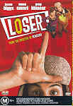

_This review was written by me for **MichaelDVD**, an Australian DVD review site that is no longer online. A capture of the site is held by the Internet Archive: **[browse it there](https://web.archive.org/web/20220217040146/http://www.michaeldvd.com.au/)**. It is reproduced here from my own copy of the site, as part of the record of what I have written._

## The film

**_Loser_** is a teen romantic comedy written, directed and co-produced by **Amy Heckerling**, who was also responsible for _Fast Times at Ridgemont High_ (1986), the _Look Who's Talking_ movies (1989, 1990) and more recently the surprise hit _Clueless_ (1995) - the movie that propelled **Alicia Silverstone** to fame. It features a fairly good cast:

- **Jason Biggs** (_American Pie_) as nerdy farm-boy Paul Tannek,a scholarship college student who has the hots for
- **Mena Suvari** (_American Beauty_ and _American Pie_) as fellow student Dora Diamond, who unfortunately has a crush on
- **Greg Kinnear** (_As Good As It Gets_, _You've Got Mail_), as Professor Edward Alcott, a lecturer at the college, and
- **Dan Ackroyd** (_Blues Brothers_, _Ghostbusters_) as Paul's father.

Paul Tannek (**Jason Biggs**) is an oh-so-nice-butter-wouldn't-melt-in-his-mouth farm boy who manages to secure a scholarship to a prestigious college in New York City. Right from the beginning, the film establishes how nice he is (he refuses money offered to him by his grandfather, as well he seems to have genuine affection for his kid sister) but also how uncool he is (he can't dance to save his life, even with his kid sister). His worst fears about not being able to fit into life in the fast, big city and dealing with street-smart, cool but cruel fellow students quickly turn to reality. He shares lodgings with three roommates from hell: Adam (**Zac Orth**), Chris (**Thomas Sadoski**) and Noah (**Jimmi Simpson**). They quickly make his life a misery by not allowing him time to study, continually playing pranks on him and eventually even kicks him out of the dorm, but he is too nice to complain.

Soon, his grades start to suffer, but his lecturer, Professor Alcott (**Greg Kinnear**) doesn't show any sympathy for his situation. No one seems to even care for him except Dora Diamond (**Mena Suvari**) who feels sorry for him when he accidentally stumbled and fell on entering into the lecture hall one day. He starts to fall in love with Dora only to realise she has a huge crush on Professor Alcott himself and apparently has been in a rather one-sided relationship with the professor for some time. The professor happens to be a self-centred twit who does not really care for Dora.

Dora comes from a poor family and can barely afford the tuition fees. She was doing part time work in a girly bar but is eventually fired due to her naivety. She turns to Professor Alcott for help but he is more concerned about maintaining his reputation. In desperation, she even resorts to sleeping in Grand Central with the tramps rather than go home.

So, basically the movie is trying to tell us both Paul and Dora are 'losers' who are really nice people who ought to deserve better, maybe even each other. Will both of them realise they are being taken advantage of (Paul by his roommates, Dora by Professor Alcott) without them losing their "niceness"? Will they realise they are Meant For Each Other and find true happiness? Can you spot the ending coming a mile away?

I really enjoyed _Clueless_, and the cast list sounded really promising, so I had high expectations for this movie. Unfortunately, I was disappointed. The movie tries so hard to ensure we get the message that the two characters are 'losers' that it makes it hard for me to feel any real empathy for them. I think there is a difference between being nice but naive to just being plain dumb and in this case the characters are so clueless and apathetic about their situations that I started feeling they deserve everything they are getting.

Cameo appearances by **Andy Dick** (_NewsRadio_'s Matthew Brock) and **David Spade** (_Just Shoot Me!_'s Dennis Finch) fail to generate any real excitement. **Dan Ackroyd**'s role as Mr. Tanneck is so small it borders on being a cameo appearance (he only appears in two scenes).

In summary, the movie wanted to say "nice guys finish first" but end up saying "nice guys ought to finish last" instead. So, the real 'loser' is probably the movie itself.

## The video transfer

True to the adage that bad movies get good video transfers, this is a near perfect transfer and I honestly cannot find anything negative to say about the transfer at all.

The movie is presented in it's original aspect ratio of 1.85:1 with 16x9 enhancement. The film source is extremely clean and free of dirt or grain, and the transfer by Sony Pictures DVD Center is excellent, with no sign of MPEG artefacts apart from slight "ringing" around the titles during the opening credits. Sharpness, colour saturation and shadow level is basically reference quality.

The disc comes with no less than 17 subtitle tracks ranging from English to the Scandinavian languages (all four) and even Hindi and Arabic. Even the trailer is subti

## The audio transfer

There are two audio tracks for the main feature, English and German, both encoded in Dolby Digital 5.1 at the higher bitrate of 448Kb/s. I listened to only the English track. Curiously, the trailer also includes a German track.

The quality of the audio transfer is good but nothing to shout about. Dialogue is crystal clear and in perfect sync with the video. As the movie is fairly dialogue focused, most of the audio is front-centred with the left/right fronts used mainly for various effects. The rear speakers are mostly used for ambience, particularly for music. Speaking of which, the music is just your run-of-the-mill teen flick background music and is not memorable. The cameo appearance of **Everclear**, a band I have never heard of before nor intend to in the future, is ho-hum.

## The extras

This disc comes with a reasonable collection of extras, but does not have a commentary track. Then again, I am not sure I want to listen to a commentary of this movie. All menus and extras are non 16x9 enhanced. Menus and scene selections are static. The menus take painstaking care in telling us which menu item is subtitled or has non-English audio tracks, which I thought was a nice touch.

### Dolby Digital Trailer - City

Curiously, there is a minor glitch in this DVD in that the Dolby Digital Trailer is played (before the movie) only if you select "Play Movie" from the main menu and not from the sub-menus.

### Theatrical Trailer

Somewhat unusually, the trailer comes with both English and German audio tracks (Dolby Digital 5.1) and a Dutch subtitle track. The trailer must have been a "TV spot" rather than a theatrical trailer because it is shown in the 4:3 aspect ratio.

### Featurette - Behind The Scenes

Also entitled "The Loser and You", the featurette is extremely short (4:33 in length) and starts of as a mock black and white documentary complete with fake film scratches which then segues into set of mini-interviews with Amy Heckerling, Jason Biggs and Mena Suvari. The featurette is subtitled in German and Dutch.

### Music Video - Teenage Dirtbag-Wheatus

This is a music video combining shots of Wheatus performing the song spliced with scenes featuring the main characters of the movie supposedly taken from the film except they are not. In fact, they seem to be taken from an entirely different story altogether (placing the characters in high school rather than in college). Weird.

The music video is presented in a letter-boxed non-16x9 enhanced aspect ratio.

### Biographies - Cast & Crew

This is a set of stills featuring short biographies of **Amy Heckerling**, **Jason Biggs, Mena Suvari**, and **Greg Kinnear**.

## Region 4 versus Region 1

The Region 4 version of this disc misses out on;

- Pan and Scan transfer (this may possibly be a full-frame unmatted transfer but I was unable to verify)
- English, French, Spanish, Portugese Dolby Surround audio tracks
- French, Spanish, Portugese, Chinese, Korean, Thai audio tracks

The Region 1 version of this disc is a single sided dual layer disc (RSDL) to accomodate the pan-and-scan transfer. It misses out on;

- German Dolby Digital 5.1 audio track
- A variety of foreign-language subtitles

I don't have a clear preference for either version, but the presence or absence of particular foreign language audio tracks/subtitles may sway you towards one or the other. Alternatively, if you hate black bars, you should probably go for the Region 1 version which has the 4x3 transfer.

## Summary

**_Loser_** is a disappointing film that ought to have been good, considering it's creator and cast. Just go and watch _Clueless_ again - it's a much better movie. It is presented on a DVD with a near-perfect video transfer, above average audio transfer and a reasonable collection of extras.

### [Ratings (out of 5)](../ReviewersGuide/RatingsGuide.html)

© [Chris Tham](mailto:ChrisT@michaeldvd.com.au) (read my [biography](../ReviewerProfiles/ChrisT.asp)) 6 January 2001

| Rating  | Score         |
| :------ | :------------ |
| Plot    | ★★ 2 / 5      |
| Video   | ★★★★½ 4.5 / 5 |
| Audio   | ★★★½ 3.5 / 5  |
| Extras  | ★★★½ 3.5 / 5  |
| Overall | ★★★ 3 / 5     |
