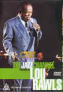

_This review was written by me for **MichaelDVD**, an Australian DVD review site that is no longer online. A capture of the site is held by the Internet Archive: **[browse it there](https://web.archive.org/web/20220217040146/http://www.michaeldvd.com.au/)**. It is reproduced here from my own copy of the site, as part of the record of what I have written._

## The film

_**The Jazz Channel Presents: Lou Rawls**_ is another in a series of TV specials featuring concerts by black jazz musicians produced by **BET on Jazz**.

Born in Chicago in 1935, **Lou Rawls**'s musical career has spanned over 40 years, 60-plus albums, three Grammy wins, 13 Grammy nominations, one platinum album, five gold albums and a gold single. His music has elements of gospel, blues, soul and pop packaged together with a wonderful singing voice that can be sweet, soft, strong and smooth all at the same time. No wonder that at the height of his career, he was one of the highest paid black performing artists around, and even today the power of his voice is unmistakable in this concert held in an intimate jazz club.

Backed by a 13-piece band ad 3 backup singers, Lou is in top form in this concert recording. He has a very pleasing stage presence and is obviously very comfortable and quite dapper looking in his silk suit with matching silk tie. In between songs, he converses a fair bit to his rapt and very attentive audience. I guess I shouldn't be surprised (given that BET stands for Black Entertainment TV or something) that the audience is predominantly black (although I did notice one white couple sitting on a table), but I would have thought that his target audience would be a lot broader than that suggested by the attendees of this performance. I will confidently predict that anyone who enjoys the music in _Blues Brothers_ will enjoy his songs.

Lou is not ashamed to admit that he mainly performs oldies but goodies in this concert. The track listing for this DVD is:

I quite enjoyed this concert. I was surprised that I recognised a few songs, including _Let Me Be Good To You_, _Love Is A Hurtin' Thing_ and _You'll Never Find Another Love Like Mine_. Lou gives a very interesting version of **Louis Armstrong**'s classic _What A Wonderful World_. And it was good to be able to hear a rendition of _Wind Beneath My Wings_ that is not completely spoiled by **Bette Midler**, whose version I've always perceived as being so incredibly off-key that it never ceases to amaze me how anyone can stand listening to it.

The end titles are superimposed whilst Lou is still belting out his last number, which I thought was a bit uncaring. I would have strongly preferred that the end titles roll out after the last song against a black background, but I suppose they wanted to fit as much music into a 60 minute TV slot and felt superimposing the titles over the song will allow them to fit more songs in.

## The video transfer

Given that this originated as a TV special, the transfer is presented in a full frame aspect ratio.

In general, the transfer seems reasonably clean, with good sharpness, detail and colour saturation. However, closer inspection reveals that the original video source must have been somewhat dirty and someone has applied a fair amount of enhancement to make the transfer look bright and clean. Camera shots of darker, non-spotlighted scenes reveal some degree of colour smearing and video noise. A tell tale sign is that shadow detail of anything not on stage is relatively poor.

In terms of MPEG artefacts, the transfer is relatively clean, apart from slight Gibb's effect ringing in various scenes and some aliasing (particularly in the vibes in **31:42**).

Surprisingly, this DVD actually comes with several subtitle tracks. I was hoping that one of the subtitle tracks would be in English and that the song lyrics would be transcribed onto the track. But alas, no such luck! The subtitle tracks here contain translations of Lou's stage banter into various foreign languages but do not include translations of the lyrics to the songs. Just for fun, I turned on the Italian subtitle track for a brief period. They didn't do a very good job with the translation as quite a few sentences were missed out, as well as I think the entire conversation beween tracks 9 and 10.

This disc is labelled DVD9 indicating that it is a single sided dual layer disc (**RSDL**). I did not detect any layer change during the performance. Given the relatively short

## The audio transfer

This DVD has three audio tracks: Dolby Digital 5.1 at 448Kbps, DTS 5.1 (unknown bitrate) and Dolby Digital 2.0 at 224Kbps. I listened to the DTS 5.1 soundtrack in its entirely, and in addition listened to a fair proportion (say about half an hour's worth) of the Dolby Digital 5.1 track.

The DTS track is actually more like a 4.0 track since the centre channel was not engaged during the entire concert. The soundstage is very front-focused, with the rear surround speakers mainly carrying ambience information. The original audio source must have been in stereo and then remixed into 5.1 as even the audience noises emanate from the front speakers as opposed to coming from the rears.

I was quite impressed by the DTS track - it had a very natural sounding "live" feel about it, and I can almost imagine Lou and the band playing "live" in front of me. In contrast, the Dolby Digital track sounded very flat and uninspiring, which is a disappointment as I know Dolby Digital can sound better than this. The Dolby Digital 2.0 track, which I listened to briefly, sounded even more insubstantial and seems to be mastered at about 6 dB lower than either of the 5.1 tracks.

I did not detect any audio glitches or synchronisation issues. Lou's dialogue can be a bit difficult to understand at times but I think it's due to his fast speech rather than a problem with the audio transfer.

## The extras

Given that most music DVDs don't come with any extras, the presence of an "interview" featurette, biographical stills, and the unusual inclusion of foreign language subtitles makes this DVD a cut above the average.

### Menu

The menus are reasonably pleasing and seems to be relatively free of MPEG artefacts, unlike some DVDs I've seen. They are in full frame format and are static.

### Biography - Lou Rawls

This contains 4 stills covering a brief biography of Lou Rawls.

### Featurette - "Meet the Artist"

This is a brief (**18:03** minutes) interview with Lou Rawls. Lou is presented in a small "window" over a background consisting of excerpts from the main feature. Lou talks about his childhood, his gospel beginnings, his association with Sam Cooke, and his harrowing experience in a car accident where he was pronounced dead on arrival and he was actually in a coma for several days and how that has changed his life. Given that there are quite lengthly periods in which he doesn't talk (and the little "window" disappears), I suspect this is a short 5-10 minute interview that has been stretched through the incorporation of excerpts from the concert performance.

## Region 4 versus Region 1

There appears to be no significant differences between the R1 and R4 versions of this disc.

## Summary

_**The Jazz Channel Presents: Lou Rawls**_ is an enjoyable if somewhat short concert by a good performer. It is presented on a DVD with an acceptable video and audio transfer with some extras.

### [Ratings (out of 5)](../ReviewersGuide/RatingsGuide.html)

© [Chris Tham](mailto:ChrisT@michaeldvd.com.au) (read my [biography](../ReviewerProfiles/ChrisT.asp)) 20 January 2001

| Rating  | Score        |
| :------ | :----------- |
| Plot    | ★★★★ 4 / 5   |
| Video   | ★★★★ 4 / 5   |
| Audio   | ★★★½ 3.5 / 5 |
| Extras  | ★★½ 2.5 / 5  |
| Overall | ★★★½ 3.5 / 5 |
